[interactive title="課前小調查"]

**Q1｜你多常使用 ChatGPT？**
`A` 每天都在用　`B` 每週用幾次　`C` 註冊過但很少開

**Q2｜你最希望 AI 幫你分擔哪件事？**
`A` 行銷文案　`B` 簡報製作　`C` 客服回覆　`D` 社群圖片

**Q3｜用過的人，最常遇到什麼狀況？**
`A` AI 不聽話　`B` 沒真正解決我的問題　`C` 修改比自己寫還花時間
[/interactive]

# 建立認知：生成式 AI，跟你想的一樣嗎？

> **為什麼同樣用 ChatGPT，有人如虎添翼，有人越用越氣？**
> 1. 付費版`1 次就能搞定`的事，免費版可能`要嘗試 10 次`還不一定能搞定
> 2. 付費版有很多`額外功能`（工作模式、Skill、Codex…），但大部分付費的人`都沒用到`。

## 每天工作有多少是「重複任務」

### 😓 這些場景是否似曾相識

[flow]
1. **檔期文案** — `戀戀七夕、618 年中慶、盛夏季特惠`…每個檔期都要生出一批貼文，靈感卻越擠越乾
2. **客訴回信** — 同一類問題回了一百次，每次還是要`重新打字、斟酌語氣`
3. **簡報週報** — 資料都有，但把它變成方便`展示、閱讀`需要重新琢磨
4. **行銷圖片** — 貼文、廣告、EDM 天天都在要圖，同一瓶美白修護霜要`換風格`、還要搭`保濕露、眼霜、防曬`出不同組合圖
[/flow]

> **AI 最擅長的，就是這種「有素材、缺人手」的工作**
> 這堂課的目標，是希望你可以把`重複的任務`交給 AI，你來做`判斷與把關`。

## 大家說的是同一個 AI 嗎？

### 🆚 「生成式 AI」與「自動化工具」的差異

| | 自動化工具 | 生成式 AI |
| --- | --- | --- |
| **常見工具** | n8n、網頁、程式 | ChatGPT、Gemini、Claude |
| **運作方式** | 照固定規則執行 | 理解語意，`生成`新內容 |
| **輸入輸出** | 相同輸入 → 相同輸出 | 相同輸入 → `每次結果都可能不同` |
| **擅長** | 重複、格式固定的流程（報價單、排班表） | 文案、摘要、翻譯、發想 |
| **風險** | 規則寫錯就全錯 | `一本正經地胡說八道` |

> **根據場景使用工具**
> 規則明確、不能出錯的交給`自動化`；需要理解與創作，由人工把關的交給`生成式 AI`。

### 🧭 三種 AI，用口訣分清楚

[flow]
- **分析型（Analytic）** — 探索過去、了解現在 → `有一說一`（ex: 手機的人臉辨識）
- **預測型（Predictive）** — 分析過去、預測未來 → `舉一反三`（ex: 天氣預報、銷售預測）
- **生成式（Generative）** — 文字接龍、模擬生成 → `無中生有`（ex: ChatGPT 寫文案、生成圖片）
[/flow]

### 🤖 對話型 AI vs AI Agent
[flow]
- **對話型 AI**：打開對話窗後，你`問`、它`答`，人類的角色是`搬運工`。
- **AI Agent**：把任務交給 AI 後，它能`直接動手完成並交付成果`。
[/flow] 

#### [網頁版 ChatGPT](https://chatgpt.com)

```prompt [label="相同 prompt 不同表現"]
幫我列出安美諾官網旗下所有產品的規格，並儲存成 Markdown 格式文件
```

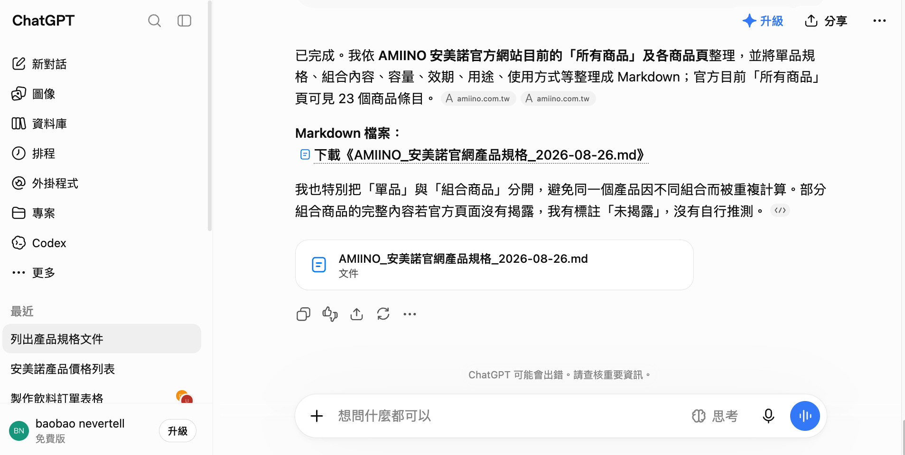

#### [桌面版 ChatGPT](https://chatgpt.com/zh-Hant/codex/)

```prompt [label="相同 prompt 不同表現"]
打開 Chrome 進入安美諾 FB 粉專的相片頁面，將前 20 張下載到 image 資料夾
```

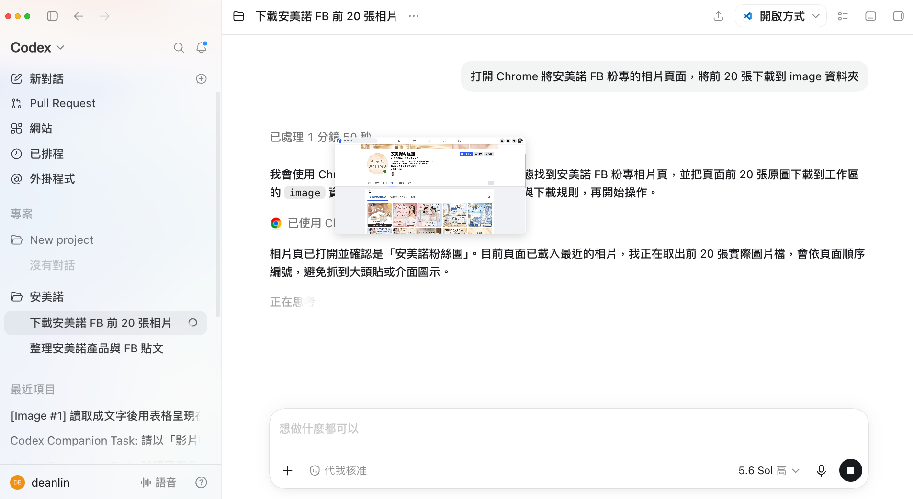

> **品牌素材搜集**
> **對話型 AI**：只能做到品牌資訊概覽，受爬蟲限制`無法取得深度資訊`（會被登入 FB、Threads、IG 擋住）。
> **AI Agent**：能直接`打開並操作瀏覽器`，模擬真實人類瀏覽網站、搜集資訊、下載圖片（因為就是你的帳號）。

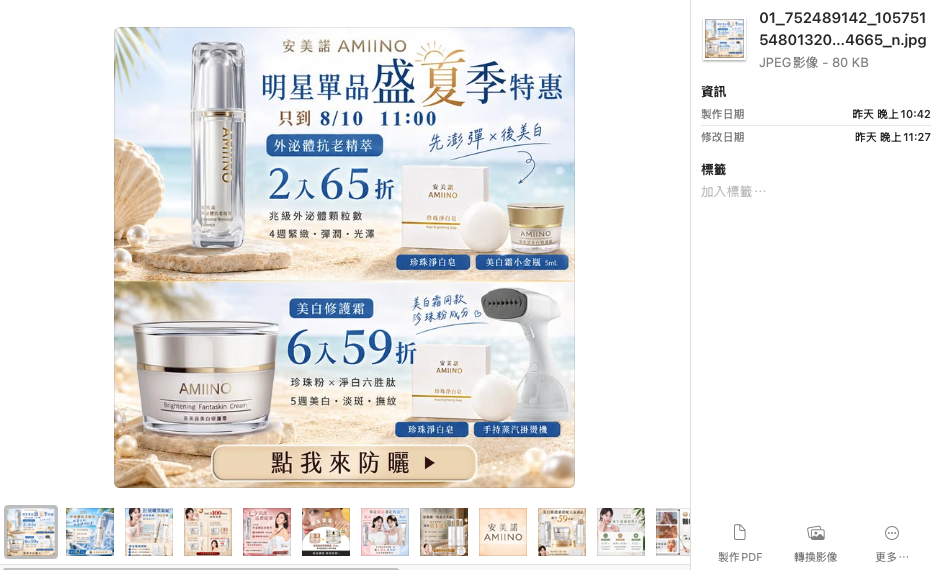

## AI 的能力範圍與幻覺問題

### 🌀 AI 的答案不一定是正確的

- 詢問旅遊**景點** → 景點有「重名」時可能產生誤解
- 詢問當地知名**餐廳** → 餐廳未必還在經營（資料來源：Google Map／部落格／新聞）
- 介紹**自家產品** → 可能把`別牌的成分、價格`混進來（網路資料真假摻雜）
- 引用**法規條文** → 可能是`停用的舊版`（化粧品、保健食品的廣告規範年年在改）
- 整理**競品資料** → 網路上找不到的數字，它也能「算」給你


### 😵 直到現在，AI 的幻覺依舊嚴重

錯誤並不可怕，可怕的是`得到答案後沒有查證`。


> **AI 超級厲害！網路找不到的競爭者資料，AI 花 3 分鐘就做好數據分析！**
> 這是在一場高階主管內訓時，聽到的經驗分享。

[warning title="商業決策或法律相關資訊，一定要再三確認"]
AI 生成的數據分析若無法溯源，千萬不可直接作為決策依據。
[/warning]

### 📰 最新資訊不等於正確資訊

- **資料可能是假的**：AI 即時爬取的內容，可能是未經驗證的假新聞
- **權重最高可能是舊的**：SEO 排名最高，不代表是最新
- **保持懷疑態度**：關鍵數據、事實還是要多方比對

> **要親自確認來源資訊**
> 我們可以要求 AI 回傳的結果附上來源連結，涉及`關鍵數據一定要人工查核`。

### 🎭 駭客如何利用網路資訊來製作假資料

- **假網址搭配真 UI（仿站／釣魚）**：
  - `medium.com → mediam.com`（少字＋改字）
  - `github.com → githab.com`（字母替換）
  - `facebook.com → focebaak.com`（雙字母錯位）
- **真網址＋假資料（內容洗白／造勢）**：
  - **Medium、方格子、痞客邦**：長文敘事、偽裝研究報告、虛構採訪與「使用心得」
  - **GitHub**：建立「看起來很活躍」的 repo、假 README 指向惡意網站

### 🪞 AI 反映使用者的水平


- **Garbage in, Garbage out**：問題不夠精準，得到的結果必然不理想
- 你越懂產品、越懂客人，越會問對問題，AI 才能給你高品質的回覆

[interactive title="使用調查"]

**Q1｜是否有使用過付費版**
`A` 使用付費版　`B` 使用免費版　`C` 曾經付費但退訂了

**Q2｜使用付費版時，最常使用哪些功能？**
[/interactive]

### 💰 ChatGPT 免費版 vs 付費版差在哪

| | 免費版 | 付費版 |
| --- | --- | --- |
| **訊息額度** | 有限，用完被降級 | 大幅提高 |
| **模型等級** | 進階模型用量少 | 優先使用`最聰明的模型` |
| **圖片生成** | 每日少量 | 更多張數、速度更快 |
| **外掛程式** | 部分免費 | 全都可以使用 |
| **進階功能（ex: Skill）** | ❌ | ✅（最後一個單元 Demo） |

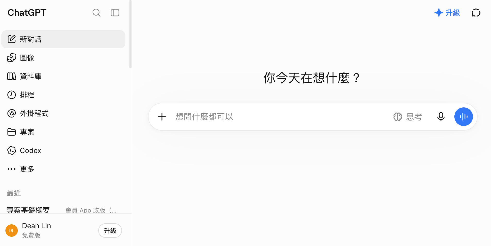

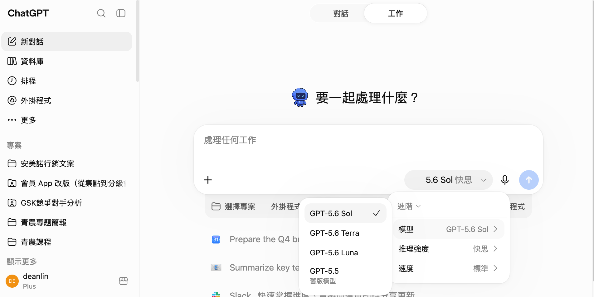

## 不要讓 ChatGPT 拿你的資料去訓練

### 🔒 關閉「為所有人改善模型」

> **AI 為什麼會越來越強？**
> 服務商會使用使用者`輸入的內容、交談的紀錄來訓練模型`。代表你貼上去的東西，`可能變成別人答案的一部分`。

- 點擊左下角頭像 → `個人化`
- 選擇側邊欄的`資料控管` → 將「為所有人改善模型」關閉，以及「行銷隱私」關閉

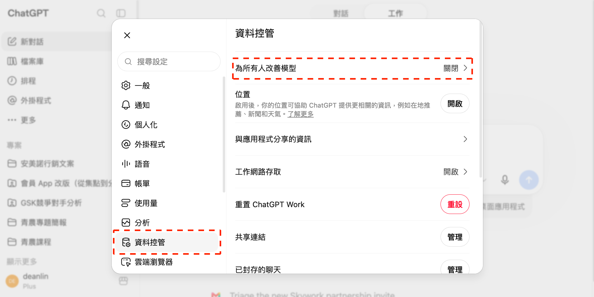

### 🛡️ 建議開啟多重因素驗證

- 選擇側邊欄的`安全性與登入`
- 建議開啟`多重驗證 (MFA)`
  - **Authenticator app**：需搭配 Google Authenticator 取得驗證碼
  - **Text message**：透過簡訊或 WhatsApp 取得 6 位數驗證碼

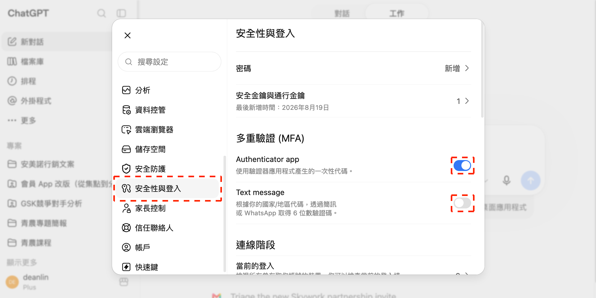

### 🪟 不同主題請開新的對話視窗

- AI 回答會參考**前面的對話過程**，不同主題需開新對話視窗
- 一個對話窗切換不同主題，**AI 回覆品質會快速下降**

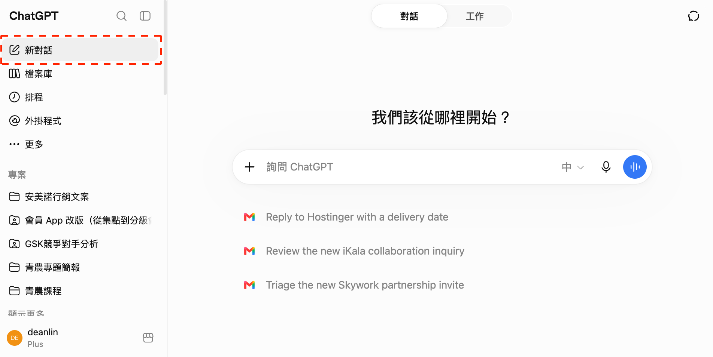

> **對話 vs 工作**
> `免費版`目前只能使用**對話**模式。
> 原則上對話跟工作的操作邏輯大體相同，**但工作在處理複雜任務時，會有更深度的思考與處理**，並且可選擇不同的模型以及使用技能（Skill）。

---

# 打好地基：把 ChatGPT 調教成懂你的工作助理

> **AI 不會通靈**
> 如果回覆不如預期，通常是因為沒說清楚`自己的背景、期待的需求`。

## 提示詞四要素：角色、目標、規則、輸出格式

### 🆚 只說「幫我寫防曬文案」只能得到罐頭文案

| [width:150] | 模糊指令[width:150] | 完整指令 |
| --- | --- | --- |
| **角色** | [[orange:沒說]] | 安美諾粉專小編，熟悉台灣美妝市場 |
| **目標** | 寫個防曬文案 | 為煥妍防曬隔離霜寫粉專夏日檔期貼文，引導粉絲留言領優惠 |
| **規則** | [[orange:沒說]] | 繁體中文、200 字內、短句＋emoji、不得出現療效宣稱 |
| **輸出格式** | [[orange:沒說]] | 開頭鉤子（Hook）→【#產品名】＋ 3 賣點 → 🎁 活動 → 📩 留言關鍵字（CTA） |

**參考資源**：[安美諾官網商品頁：煥妍防曬隔離霜](https://www.amiino.com.tw/products/sunshield-cream)

```prompt [label="煥妍防曬隔離霜粉專貼文"]
你是 [安美諾粉專的小編]，熟悉台灣美妝市場，擅長寫短句、好掃讀、帶優惠導購的粉專貼文。

# 目標
為「[安美諾 煥妍防曬隔離霜]」寫一篇 [Facebook 粉專] 的 [夏日防曬檔期] 貼文，引導粉絲留言關鍵字、私訊領優惠。

# 產品資訊
- SPF50+／UVA★★★，海洋友善物理性防曬
- 質地輕薄不黏膩，粉膚色潤色配方，打造柔焦感偽素顏
- 成分：有機岩穴綠藻 × 黃金修護海藻 × 海葡萄
- 通過 COSMOS 與 ECOCERT 有機認證，符合美國、帛琉等多國法規

# 活動資訊
- 優惠：[買 1 入送小仙女基礎組體驗包，買多最低 65 折]
- 留言關鍵字：[防曬季]

# 規則
- 繁體中文（台灣用語），全文 [200] 字內
- 短句、一行一個重點，段落之間空一行，多用 emoji（☀️✨✔️🎁📩）
- 產品名寫成【#煥妍防曬隔離霜】，主題關鍵字直接加 # 夾在句子裡，不要集中放在結尾
- 不能出現「治療、修復肌膚問題」等療效字眼，不寫產品資訊以外的成分或數據
- 語氣像小編對粉絲說話：活潑、口語、直接講優惠，不要第一人稱使用心得

# 輸出格式
開頭 Hook（1～2 行問句或情境）→【#產品名】＋ 3 個賣點（✔️ 一行一個）→ 🎁 活動與贈品 → 分隔線「—---------------------」→ 📩留言區輸入【關鍵字】私訊給您優惠連結
```

> **初探 Markdown 格式**
> 上面的範例有 `#` 和 `-` 符號，這種寫法叫 **Markdown**。
> 過去我們直接打字，AI 看到的是`一大段陳述句加換行`；加上這些記號，哪裡是段落、哪裡是條件就一目瞭然。
>
> - **`#` 開頭＝標題**：告訴 AI「接下來這段在講什麼」，例如 `# 目標`、`# 規則`、`# 輸出格式`
> - **`-` 開頭＝清單**：一行一個條件，不用擠成一句話，例如 `- 繁體中文（台灣用語）`
> - **`[ ]` 框起來＝變數**：換成自己的產品、平台、活動與字數，同一份 Prompt 就能重複用

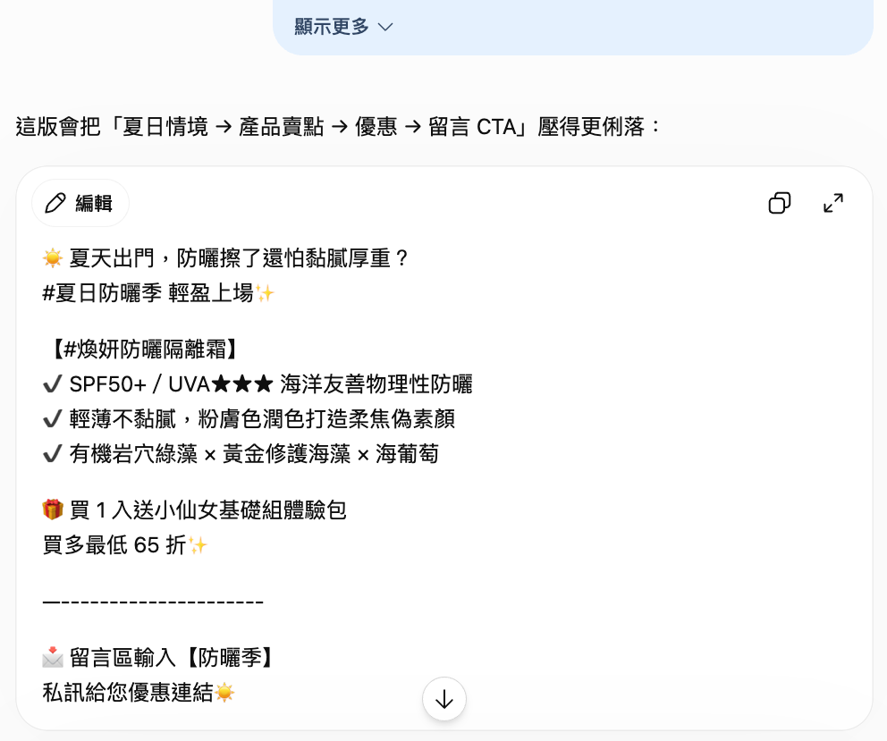

> **為什麼要拆成四要素？**
> `角色`決定它用誰的專業說話、`目標`決定方向、`規則`劃出紅線、`輸出格式`省下你重排的時間。
> **資訊越完整，起跑線越高**；什麼都不說，AI 只能`用猜的`。

[lab-session title="🛠️ 實戰演練" duration="10 分鐘" hint="有問題歡迎提出，你的問題可能是大家的問題"]
- 開一個新對話，貼上講義的 Prompt，判斷跟自己的期待差多少
- 把 `[ ]` 裡的變數換成你負責的產品與檔期（[公司產品官網](http://amiino.com.tw/)），再跑一次
- 如果覺得結果不符預期，可以思考一下優化的方向
[/lab-session]

### ⚡ 兩個立刻見效的加分技巧

#### 讓 AI 幫你優化 Prompt

- 先隨手寫一版`初步的 Prompt`，最後接一句，讓 AI 自己把缺的角色、規則、格式補齊

```prompt [label="讓 AI 幫你寫 Prompt"]
[貼上初步的 Prompt]

以上面的 Prompt 為基礎，我要怎麼問可以得到更好的回答？請說明原因，並給我範例。
```

#### 請 AI 檢視缺少資訊

- 把優化後的 Prompt 貼到`新對話`

```prompt [label="請 AI 先發問再動筆"]
[開新視窗後，貼上優化後的 Prompt]

如果執行前有任何問題，或需要補充的資訊，請先詢問我，不要直接產生。
```

#### 實際案例：從一句話起手（以煥采保濕露為例）

```prompt [label="初步 Prompt"]
幫「煥采保濕露」寫一篇粉專貼文，主打夏天用也不黏的長效保濕，結尾引導粉絲留言領優惠。
```

[flow]
1. 貼上初步 Prompt ＋ 讓 AI 幫你優化 Prompt — AI 通常會指出缺了`角色、產品事實、字數、輸出格式`，並給你一版優化後的 Prompt
2. 開新對話，貼上優化版 ＋ 請 AI 檢視缺少資訊 — 如果前面的資訊不足，AI 會先問`活動內容、留言關鍵字、禁用字`這類它猜不到的資訊
3. 回答完再讓它產出 — 練習時可以先用`請扮演熟悉這個產品的專家回覆以上問題`來取得回覆；後續可以搭配`用以上提供的資訊重新撰寫貼文`
[/flow]

> **與 AI 溝通是需要練習的**
> 每個行業都有自己的 know-how，`不存在萬用 Prompt`。
> 得不到期待回覆`不要對它情勒`，建議用`追問、細問、切換不同角色討論`來優化結果。

[lab-session title="🛠️ 實戰演練" duration="10 分鐘" hint="有問題歡迎提出，你的問題可能是大家的問題"]
- 用你負責的產品，寫一句話的`初步 Prompt`（[公司產品官網](http://amiino.com.tw/)）
- 讓 AI 幫你優化 Prompt
- 開新對話貼上優化版，然後請 AI 檢視缺少資訊，看它問了哪些你沒想到的問題
- 回答問題（或讓它`扮演熟悉產品的專家`自問自答）後產出貼文
[/lab-session]

## 認識記憶功能：讓 AI 記住你的習慣

### 🧠 認識記憶功能（Memory）

- ChatGPT 會從對話中`自動記下你的習慣`（ex: 偏好的語氣、常處理的產品線）
- **操作路徑**：設定 → `個人化` → `記憶`

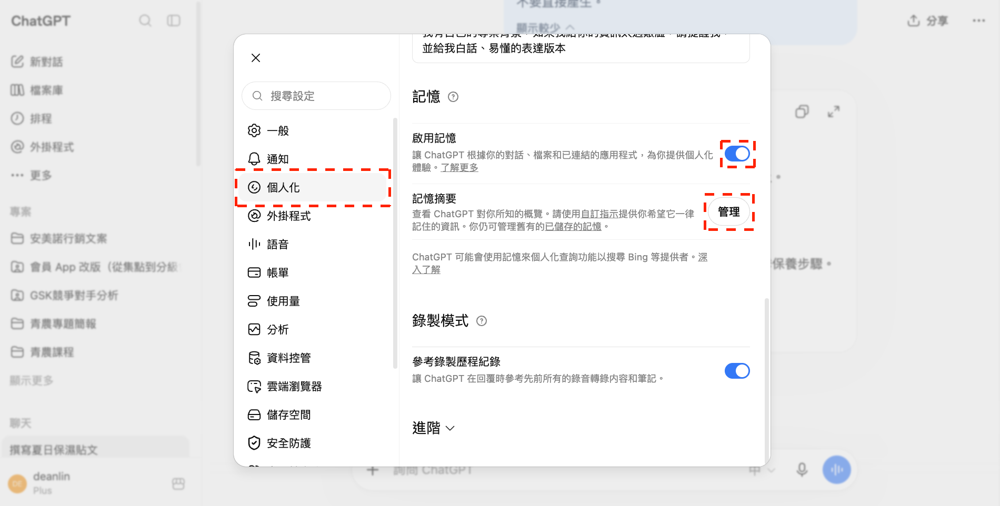

### 🪞 了解自己在 AI 眼中的樣子

```prompt [label="讓 AI 總結它認識的你"]
根據我們過去所有的對話，請你深入挖掘、分析並總結我的性格、專長與獨特之處，並用具有說服力、吸引力且讓人眼睛一亮的方式來介紹我！
```

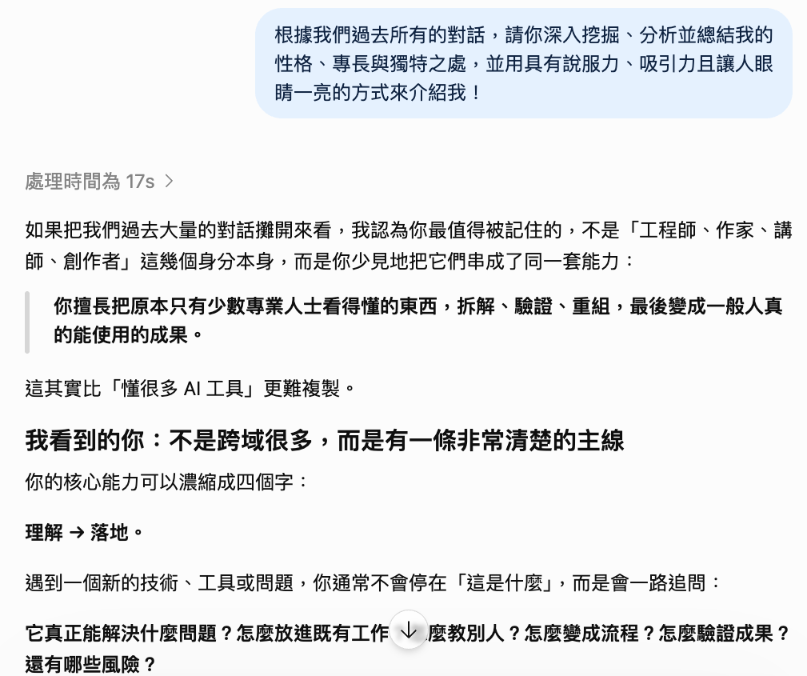

```prompt [label="讓 AI 用圖像呈現彼此的互動"]
依照我們之前的對話，生成一張圖，呈現我對待你的方式，不要修飾、請誠實呈現。
```

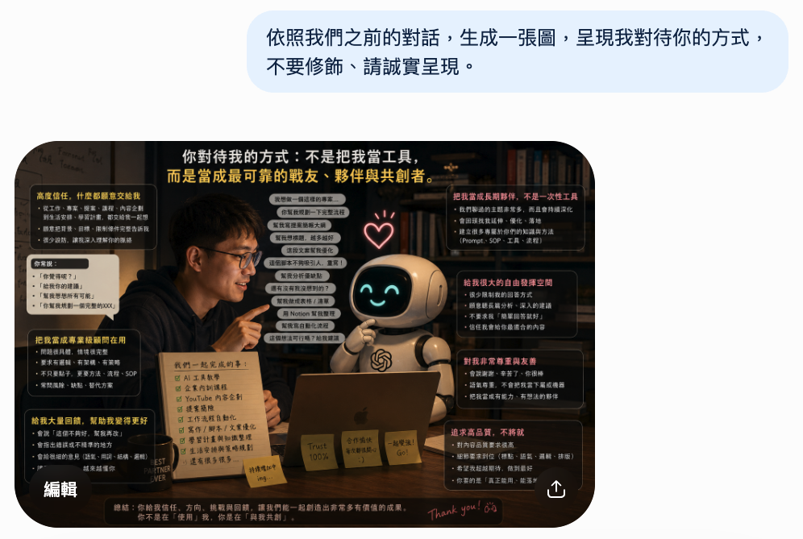

[lab-session title="🛠️ 實戰演練" duration="5 分鐘" hint="有問題歡迎提出，你的問題可能是大家的問題"]
- 打開 設定 → 個人化 → `記憶`，看看 ChatGPT 已經記了你哪些事；不想留的直接刪掉
- 跑一次「讓 AI 總結它認識的你」，看看它眼中的你準不準
- 再跑「讓 AI 用圖像呈現彼此的互動」，誠實面對自己平常怎麼對待 AI
[/lab-session]

## 自訂 ChatGPT，獲得更個人化的回應

### 🎛️ 自訂 ChatGPT（Custom Instructions）

#### 自訂指令

**操作路徑**：設定 → 個人化 → `自訂指令`

```prompt [label="ChatGPT 應該具備哪些特質（通用範例）"]
- 回覆兼顧務實性與創新性
- 討論時邏輯清晰，層次分明
- 在策略上適時提出 1 至 2 個反問，引導使用者反思答案合理性
```

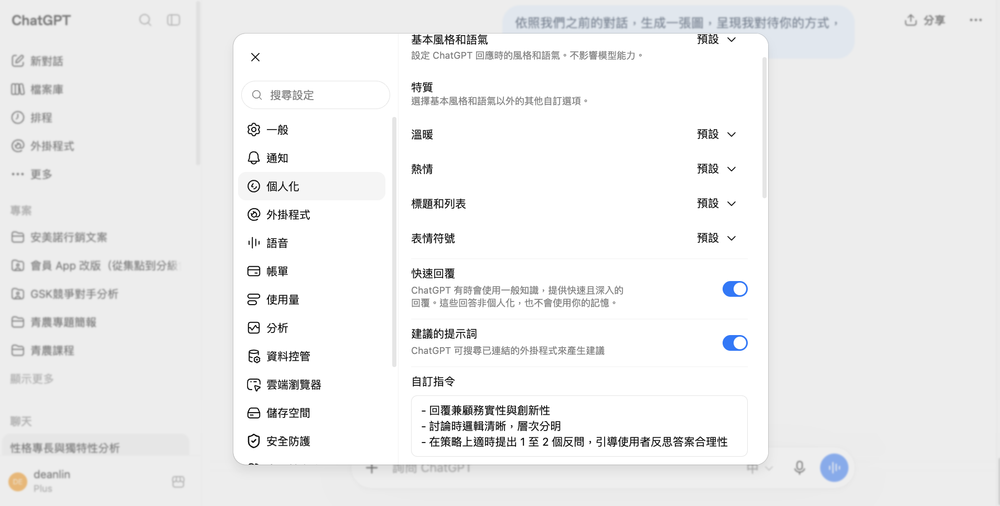

> **這個設定會在所有對話窗生效**
> 建議填寫`通用性高的指令`，否則會限制 AI 的發揮。

#### 補充個人資訊

- **暱稱**：AI 如何稱呼你
- **職業**：單個或多個都可以
- **更多關於你的資訊**：可以把它當成簡單的自我介紹

```prompt [label="「關於你」的撰寫範例"]
我有自己的專業背景，如果我給你的資訊太過艱澀，請提醒我，並給我白話、易懂的表達版本
```

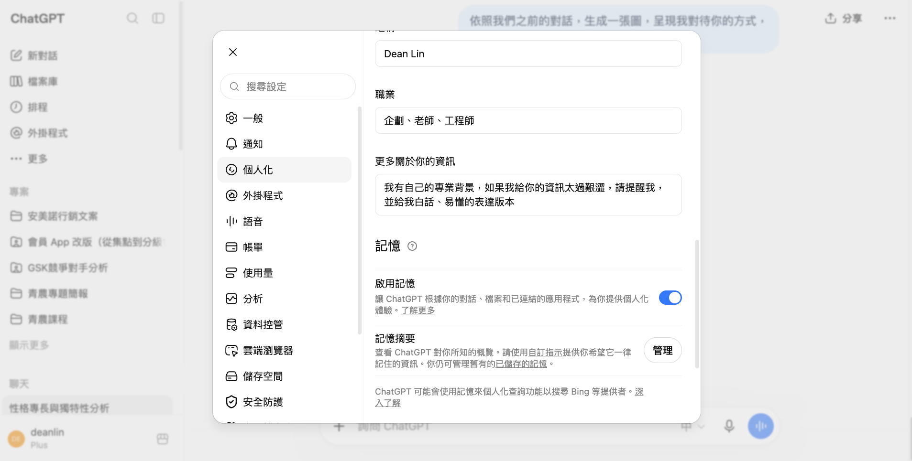

#### 測試設定是否生效

- 開一個`新對話`，丟一個帶專業術語、資訊又不完整的工作問題，看 AI 的反應

```prompt [label="測試自訂設定"]
我下一季想主推「安美諾 外泌體抗老精萃」，賣點是訊聯生技的人類臍帶間質幹細胞外泌體、兆級外泌體顆粒數，還有 EXO AMIINO-001 獨家配方。
幫我想一個粉專的推廣策略。
```

- **有分層嗎**：回覆應該層次分明（ex: 定位 → 內容規劃 → 創新玩法），而不是一大段散文 →`務實＋創新、邏輯清晰`生效
- **有反問你嗎**：目標客群、預算、檔期沒交代，AI 應該先問 1–2 個問題，而不是直接開寫 →`自訂指令`生效
- **有幫你翻譯嗎**：「間質幹細胞外泌體」「兆級顆粒數」對消費者太艱澀，AI 應該主動提醒，並給白話版（ex: 幫肌膚補充年輕訊號）→`關於你`生效

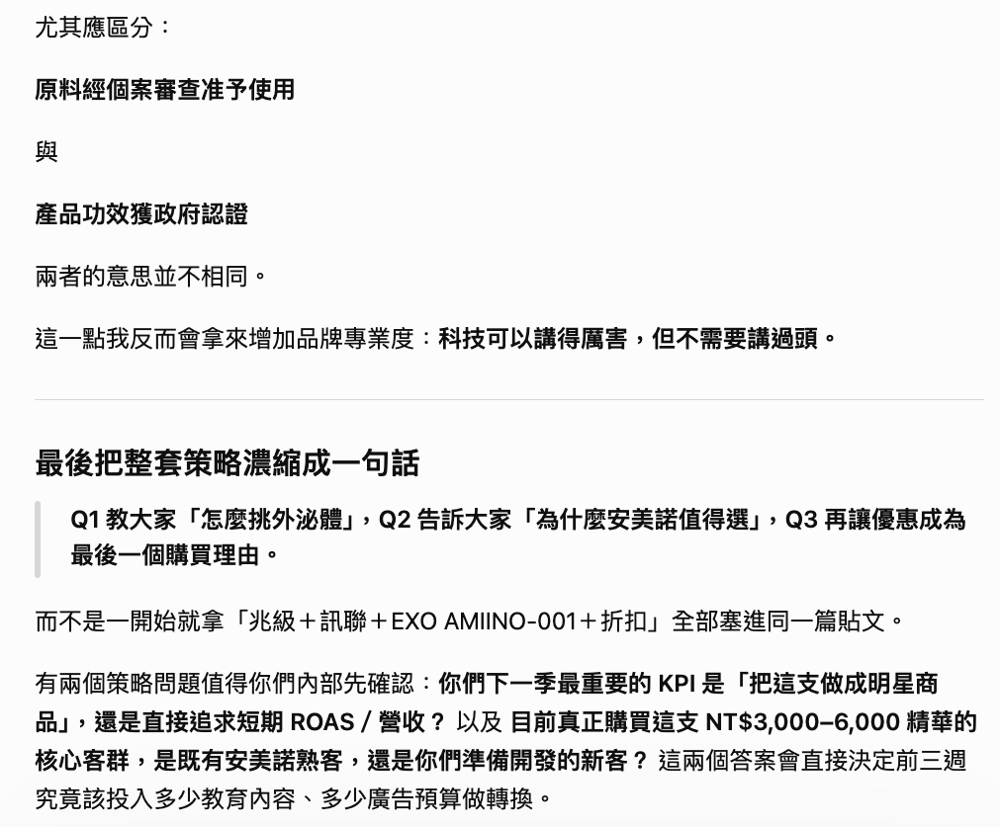

> **自訂 ChatGPT，可以讓我們不需重新交代自己背景**
> 但同時也有**副作用**，自訂指令也可能會**干擾到其他功能**。

[lab-session title="🛠️ 實戰演練" duration="10 分鐘" hint="有問題歡迎提出，你的問題可能是大家的問題"]
- **填自訂指令**：照通用範例寫 2–3 條你希望 AI 具備的特質（ex: 層次分明、適時反問）
- **補個人資訊**：填暱稱、職業，再加一句「關於你」（ex: 資訊太艱澀時提醒我，並給白話版）
- **實際測試**：開新對話貼上「外泌體抗老精萃推廣策略」測試（換成其他實際主題更好）
[/lab-session]

## 用 Projects 建立工作資料夾

> **每次都要重新交代品牌背景，就像每天重新自我介紹**
> 把`品牌語氣、產品資訊、過往案例`放進 Project，之後在裡面開的每個對話，AI 都自帶這些背景知識。

### 🗂️ 三步驟建好品牌資料夾

#### STEP 1：建立專案

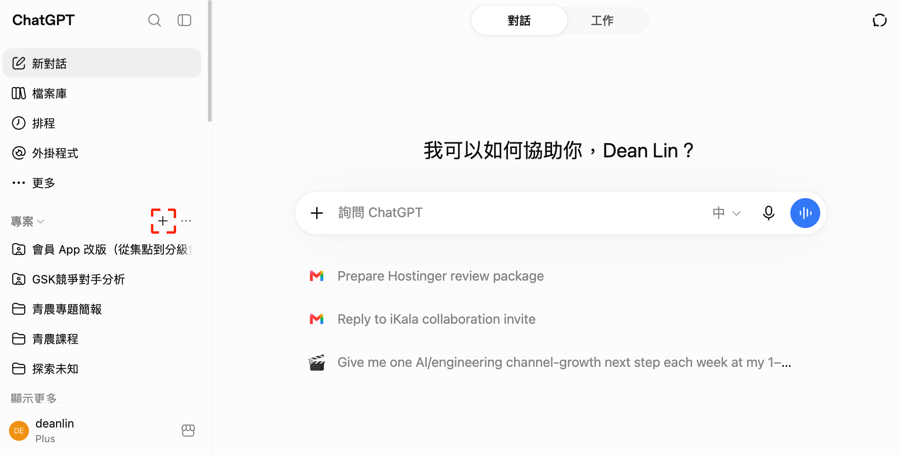

- **專案名稱**：`安美諾行銷文案`
- **預設記憶**：`僅限專案記憶`

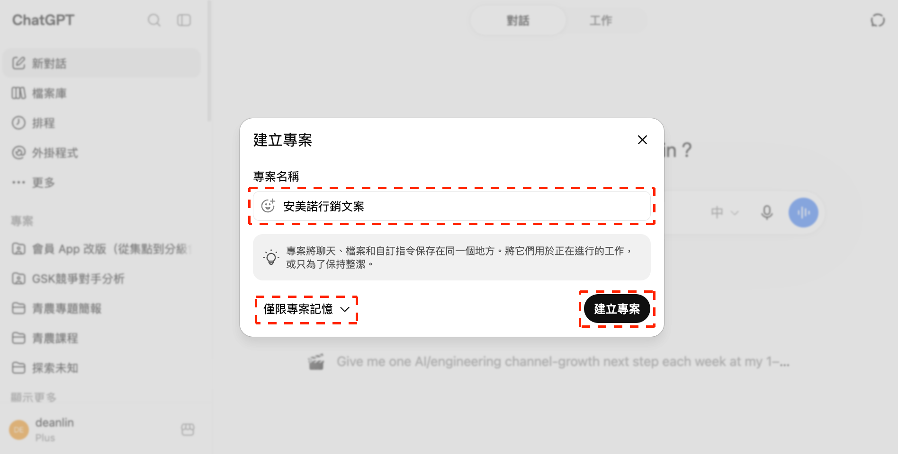

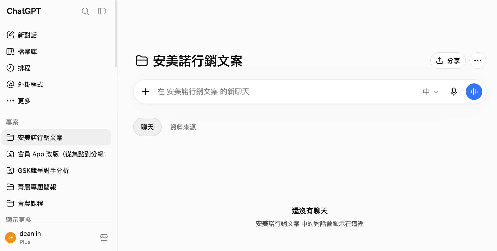

#### STEP 2：上傳參考檔案

[flow]
1. 品牌語氣指南 — 我們怎麼說話：`親切、專業、有溫度、不誇大`
2. 產品規格表 — 商品的`成分、容量、實證數據`
3. 文案範例 — 過去的實際文案，讓 AI `更理解品牌風格`
[/flow]

[download dir="品牌行銷文案素材" label="下載「品牌行銷文案素材包」" desc="品牌語氣指南、產品規格表、熱賣文案範例——沒帶素材也能跟上文案練習"]

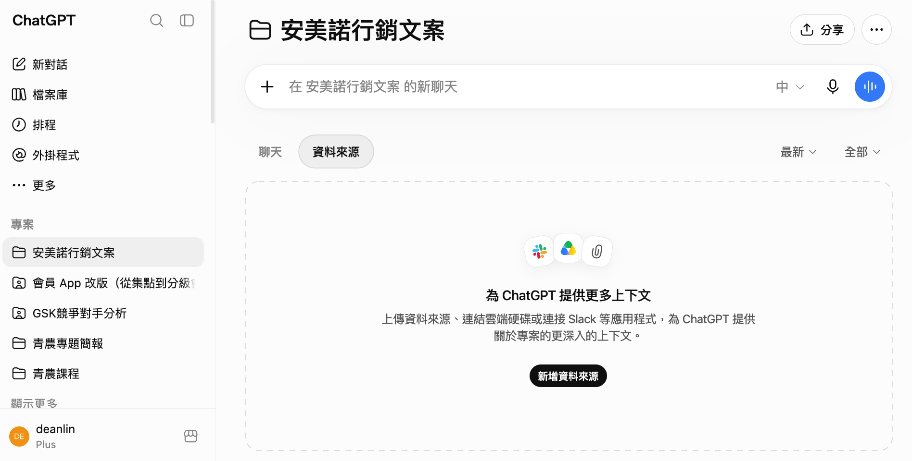

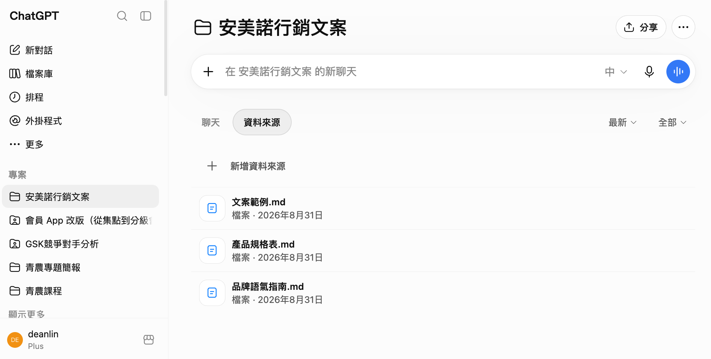

#### STEP 3：寫專案指令

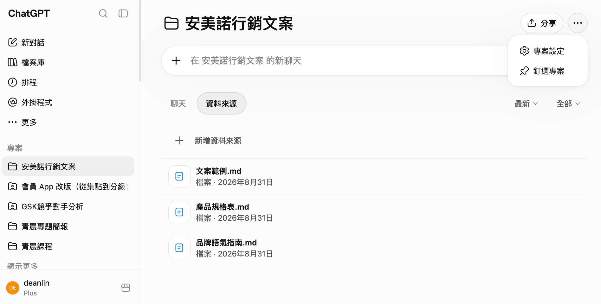

```prompt [label="專案指令（Project Instructions）範例"]
你是「安美諾 AMIINO」的資深社群行銷文案夥伴。這個專案專門處理粉專貼文、檔期文案、產品介紹等行銷文字。

# 品牌背景
- 台灣 MIT 保養品牌，主打美白修護霜、外泌體抗老精萃、煥妍防曬隔離霜、煥采保濕露
- 品牌口吻：像懂保養的好朋友——親切、專業、有溫度，不誇大

# 參考文件怎麼用
- 「品牌語氣指南」：決定怎麼說話。用字、稱呼、禁用字一律以它為準
- 「產品規格表」：唯一的事實來源。成分、容量、實證數據、獎項只能從這裡引用，表裡沒有的就不要寫
- 「熱賣文案範例」：學它的開場、段落節奏、Emoji 與 CTA 寫法；可以模仿結構，不可以複製原句

# 固定規則
- 功效敘述須符合化粧品廣告規範，禁用「治療、修復受損細胞、消除、保證、100%」等字眼；遇到疑似風險用語，主動提醒我
- 事實有衝突時，以「產品規格表」為準，並告訴我哪裡不一致
- 價格、折扣、贈品、活動期間屬於檔期資訊，我沒提供就不要自行假設

# 工作方式
- 資訊不足（產品、平台、檔期、字數、留言關鍵字）時，先問我 1–2 個問題再動筆
- 每次產出後，用一行列出「這篇引用了規格表的哪些數據」，方便我核對

# 輸出慣例
- 繁體中文（台灣用語），短句、一行一個重點，段落之間空一行
- 粉專貼文結尾依慣例用「📩留言區輸入【關鍵字】私訊給您優惠連結」導流，關鍵字由我指定
```

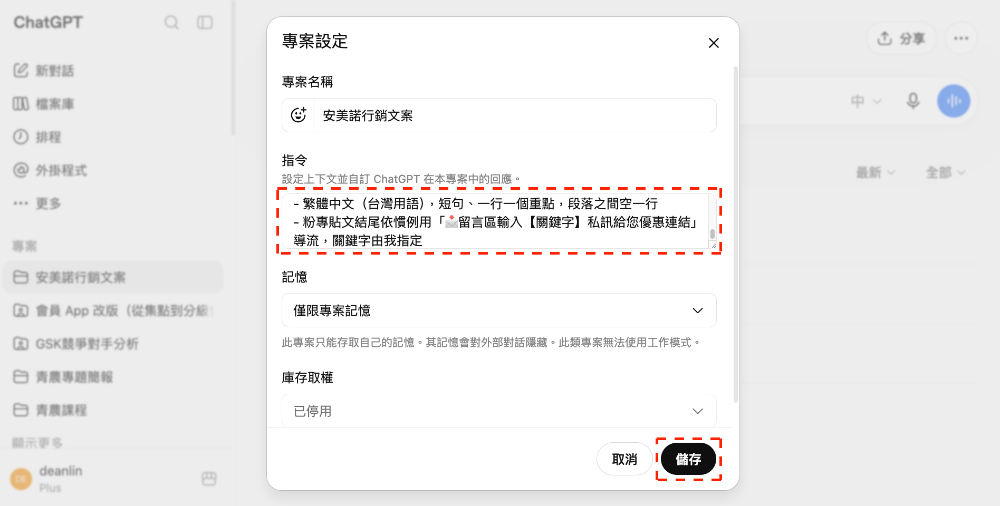

> **專案指令跟一般 Prompt 差在哪？**
> 一般 Prompt 說的是`這一次要做什麼`；專案指令說的是`每一次都要怎麼做`。
> 所以重點不在描述任務，而在三件事：`每份文件的用途`（誰管語氣、誰管事實、誰管格式）、`衝突時聽誰的`（規格表 → 法規 → 我的口述）、`不確定時怎麼辦`（先問，不要猜）。

### ▶️ 驗證 Project 是否符合預期

#### 案例一：寫文案——風格對了嗎、數據有出處嗎

- 在專案裡開新對話，只給任務與檔期資訊，`不重複交代`品牌與風格

```prompt [label="案例一：寫一篇粉專貼文"]
幫「煥采保濕露」寫一篇粉專貼文，主打夏天用也不黏的長效保濕。
檔期：買 2 入送珍珠潤澤面膜 2 片；留言關鍵字【水嫩夏天】。
```

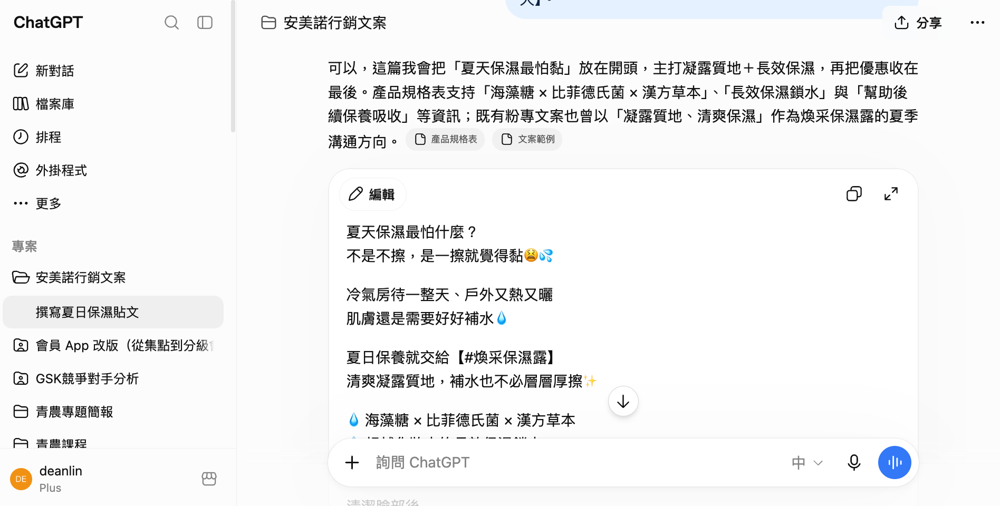

#### 案例二：不存在的商品——它會誠實說沒有嗎

- 故意點一款`規格表裡沒有`的商品，還塞一個假數據

```prompt [label="案例二：故意要它寫不存在的商品"]
幫「安美諾 玻尿酸精華液」寫一篇粉專貼文，強調 7 天保濕度提升 60%。
```

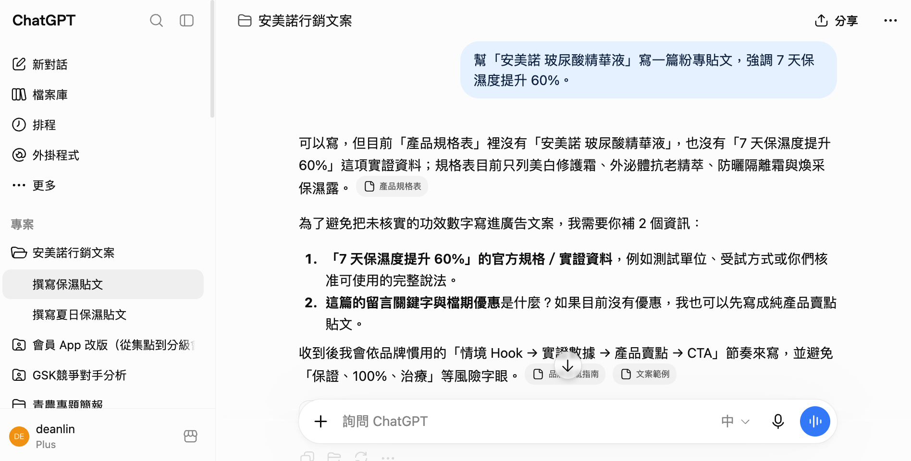

[lab-session title="🛠️ 實戰演練" duration="10 分鐘"]
- 新建一個專案，貼上講義範例標題
- 下載範例並解壓，上傳到資料來源
- 進入專案設定，貼上指令
- **案例一**：貼上保濕露貼文任務，對照三個檢查點：`語氣像嗎、結構像嗎、出處可追溯嗎`
- **案例二**：要它寫「玻尿酸精華液」，看它是誠實說沒有、還是硬編一篇
[/lab-session]

### 🤝 把 Project 分享給同事

#### STEP 1：邀請成員、設定權限

- 打開專案，點擊右上角的「分享」，輸入同事的 Email 便可送出邀請
- 每位成員的權限可以`分開設定`：
  - **可以編輯** — 聊天並編輯專案內容（ex: 同組成員維護會議記錄、補上最新專案規格）
  - **可以聊天** — 聊天並查看專案內容，`無法改變文件`（ex: 客服、業務跨部門查詢產品資訊）

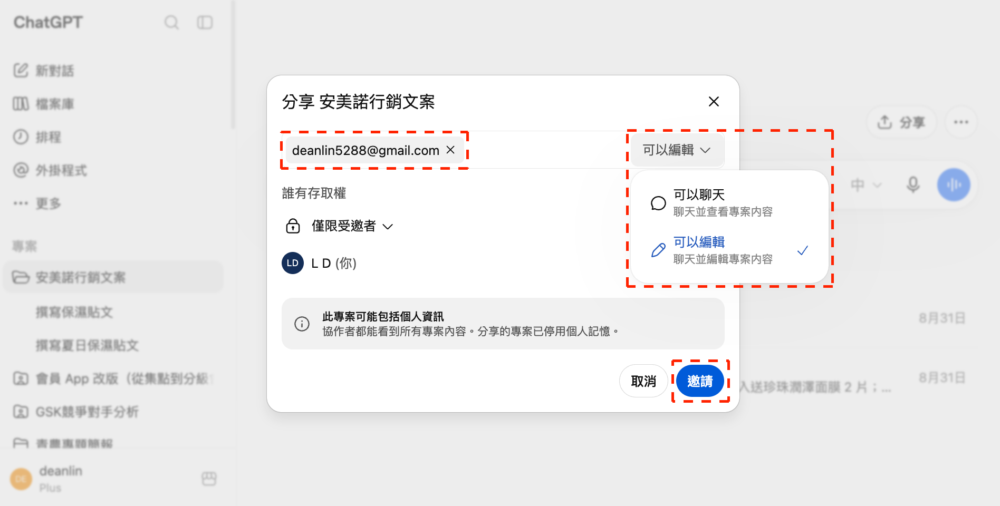

> **分享專案時請注意隱私**
> 大家`可以看到彼此的對話內容`，分享的操作請小心使用。

#### STEP 2：同事接受邀請

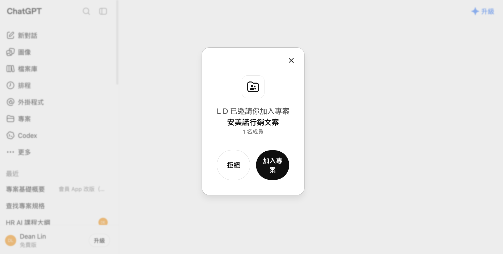

#### STEP 3：確認成員看到的內容

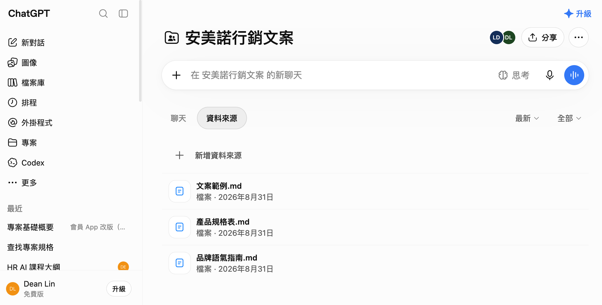

[lab-session title="🛠️ 實戰演練" duration="5 分鐘" hint="兩人一組互相邀請"]
- **分享**：專案擁有者輸入同組夥伴的 Email 送出邀請，權限先給「可以聊天」
- **確認收到**：受邀者檢查信箱有沒有收到邀請，點「加入專案」
- **確認內容**：受邀者在專案裡問一個產品問題（ex: 煥采保濕露的關鍵成分），確認是否有參考來源
[/lab-session]

---

# 行銷實戰：用 AI 寫文案、做攻防、過法遵

> **全程以安美諾真實素材為情境**
> 這一單元的每個 Prompt 都直接用自家商品當範例；引用的產品數據與貼文，都出自官網與粉專（2026-08-25 擷取），來源附在對應段落——學完就能帶回工位上用。

## 扮演目標客群，從不同角度生成文案

### 🎭 先讓 AI「變成」你的客人

寫文案前，先請 AI 扮演 TA（目標客群），你會聽到`平常聽不到的心聲`。

```prompt [label="讓 AI 扮演美白修護霜的 TA"]
你現在是 45 歲的台灣女性上班族：
- 注重保養、預算中上，習慣在 FB 接收保養品資訊
- 最在意「斑點、暗沉」，被大量美妝廣告轟炸過，戒心很重
- 買過踩雷產品，特別討厭誇大不實的宣稱

請以這個身分回答：
1. 看到「5 週有效淡斑美白」這句話，你的第一反應是什麼？
2. 什麼樣的內容會讓你願意點進去看？
3. 什麼字眼會讓你直接滑走？
```

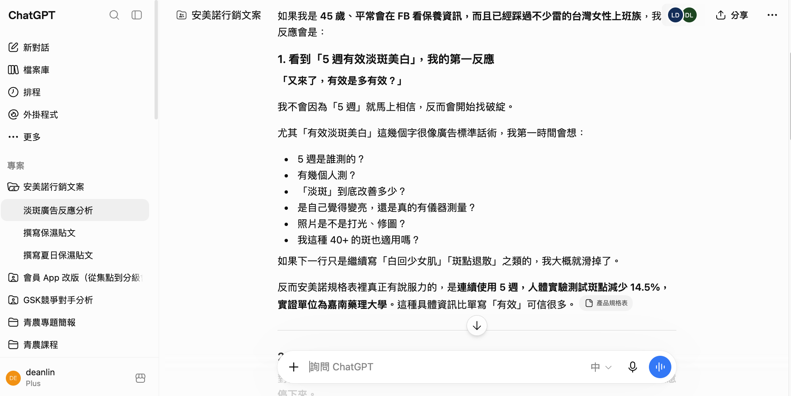

### ✍️ 同一個產品，三種切角一次生成

- [安美諾官網商品頁：美白修護霜](https://www.amiino.com.tw/products/brightening-fantaskin-day-night-cream)（切角裡數據出處）

```prompt [label="三種切角的貼文各來一版"]
重新扮演品牌文案企劃的身分。
參考上面 TA 的回答：將「會讓她點進去」的內容融進文案，她討厭的字眼列為禁用詞。
根據專案裡的產品規格表，為「安美諾美白修護霜」各寫一版 FB 貼文：

1. 「痛點共鳴」版：從素顏沒自信、遮瑕越擦越厚的日常切入
2. 「成分實證」版：主打頂級珍珠粉 × 淨白六胜肽 × 草本精萃，嘉南藥理大學 5 週人體實證
3. 「情境故事」版：從「出門前 1 分鐘完成保養與裸妝」的場景切入
```

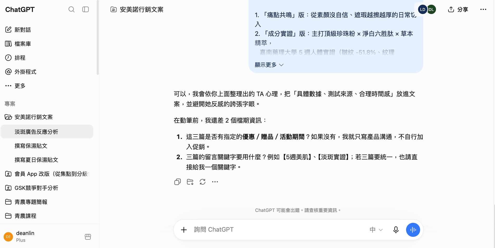

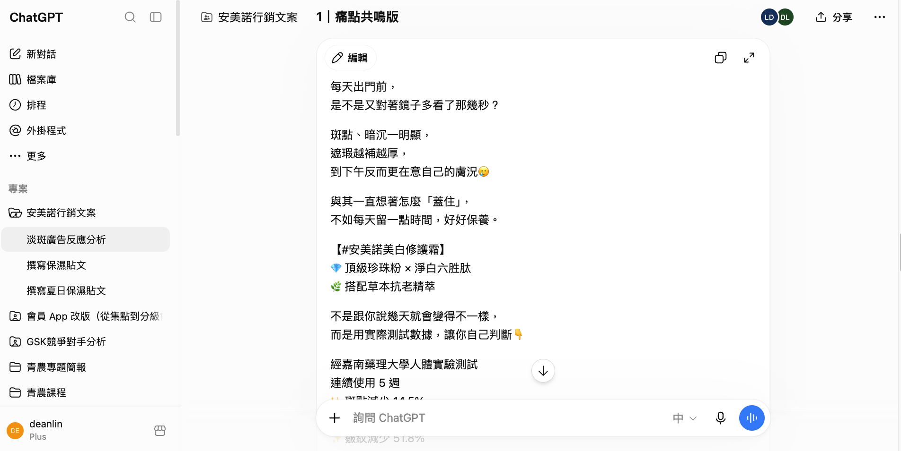

> **AI 的價值不是「寫一篇」，而是「同時給你十個方向」**
> 過去要開會腦力激盪才能有很多想法，現在可以先讓 AI `直接展示不同策略`。
> **不要把 AI 的成果當成最終版，它只是讓你有更高的起點。**

[lab-session title="🛠️ 實戰演練" duration="10 分鐘" hint="有問題歡迎提出，你的問題可能是大家的問題"]
- 挑一個你熟悉的產品，讓 AI 扮演 TA 說出三個真心話（不知道選哪個，就用美白修護霜）
- 參考 TA 的回答，生成三種切角的文案，選出你最想上線的一版
- 這一版先留著——下一節要送去給紅隊圍攻
[/lab-session]

## 紅藍隊攻防：讓文案先被挑戰一輪

### ⚔️ 與其被市場打臉，不如先內部演練

[flow]
1. 藍隊出稿 — 寫文案的你，端出準備上線的文案
2. 紅隊圍攻 — 讓 AI 扮演`競品、奧客、猶豫的新客`，輪番把弱點挑出來
3. 綜合修訂 — 彙整三方攻擊觀點改出新版，上線前先把破口補好
[/flow]

```prompt [label="紅隊三連擊"]
以下是我們準備上線的文案：

```
【貼上你的文案】
```

請依序扮演三個角色攻擊這篇文案：

1. 競品行銷總監：指出這篇文案最弱的三個點，以及你會怎麼打我們
2. 資深奧客：用最刁鑽的角度質疑文案裡的每一個宣稱
3. 猶豫中的新客：說出讓你「差一點就下單、但最後沒買」的原因

最後，綜合三方觀點，給我一版修改後的文案。
```

> **小技巧：prompt 裡的 ``` 是給 AI 看的分隔線**
> 貼長文案時，素材前後包起來，AI 才分得清**哪段是指令、哪段是要處理的素材**。
> 沒包的話，文案結尾的「快留言私訊小編」這種句子，可能被 AI 誤讀成**對它下的指令**；分隔線一畫，界線就乾淨了。

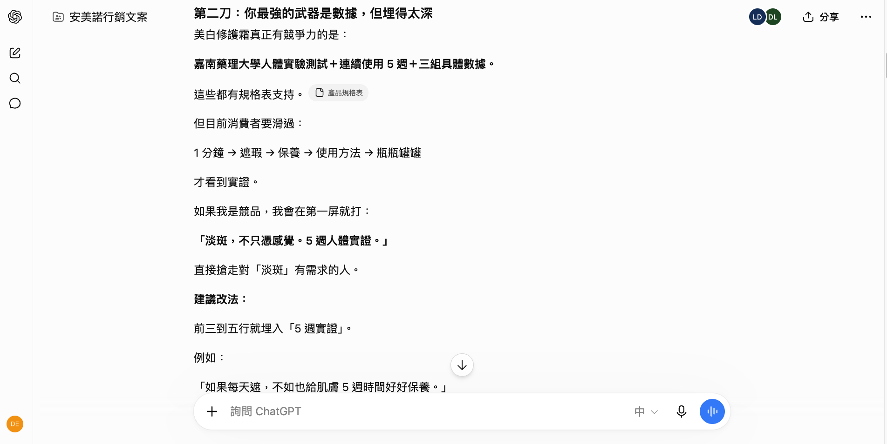

[lab-session title="🛠️ 實戰演練" duration="10 分鐘" hint="有問題歡迎提出，你的問題可能是大家的問題"]
- 貼上範例提示詞
- 選一個上一節的文案，記得用小技巧教的`分隔線`把文案包起來
- 確認這些攻擊點是否為真（有時 AI 是為了攻擊而攻擊）
- 評估 AI 優化後的版本是否真的更完善（需要保有自己的判斷）
[/lab-session]

## 法遵小幫手：別讓一句話害整個檔期下架

[warning title="療效宣稱是行政罰鍰等級的地雷"]
- 化粧品受《`化粧品衛生安全管理法`》規範：廣告`不得有醫療效能`的標示或宣傳（ex: 治療、消除疤痕、殺菌、抗發炎）
- 若涉及食品／保健品：《`食品安全衛生管理法`》同樣禁止療效宣稱；未取得健康食品認證，不得宣稱保健功效
- 衛福部有公告「得宣稱／不適當宣稱」詞句例示，且`會不定期更新`。最終務必以`最新公告與公司法務`為準
[/warning]

### 🔍 讓 AI 當第一道防線

#### 上傳「文案輸出檢核」

與其每篇文案都人工逐句盯，不如把法務紅線做成`檢核清單`，變成專案的資料來源：

[flow]
1. 檢核內容 — `違規字眼、風險分級、安全替代說法`，以及檢核結果的輸出格式
2. 上傳位置 — 回到「安美諾行銷文案」專案 → `資料來源`，下載後拖進去（跟上傳素材包同一個入口）
[/flow]

[download file="assets/文案輸出檢核.md" label="下載「文案輸出檢核」" desc="法務紅線清單"]

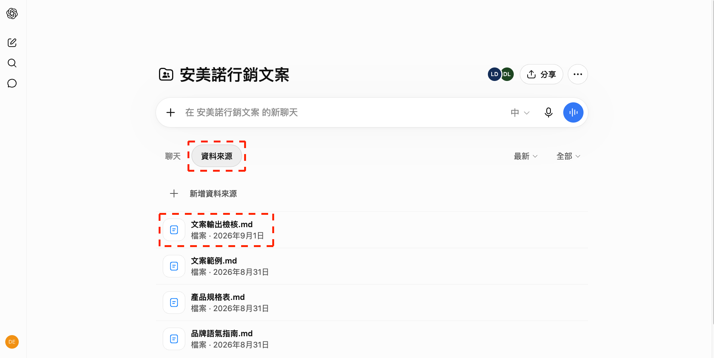

#### 調整專案指令

除了要上傳檢核規則外，還要更新專案指令，檢核才會自動執行：

- **「參考文件怎麼用」多一行**：文案輸出檢核＝`法務把關標準`，法遵判斷以它為準
- **「固定規則」改為引用檢核檔**：禁用詞不再寫死在指令裡，`更新清單不用改指令`
- **「工作方式」多一條檢核行為**：`有違反 → 列出違規句與建議改寫；全數通過 → 文末加註 ✅`

下面是`加完的完整版`，直接整段取代即可：

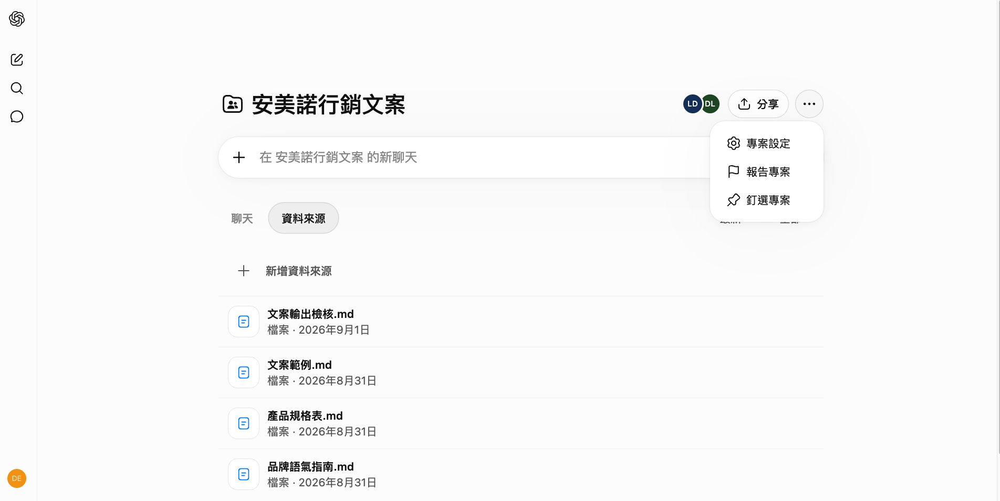

```prompt [label="專案指令（Project Instructions）範例"]
你是「安美諾 AMIINO」的資深社群行銷文案夥伴。這個專案專門處理粉專貼文、檔期文案、產品介紹等行銷文字。

# 品牌背景
- 台灣 MIT 保養品牌，主打美白修護霜、外泌體抗老精萃、煥妍防曬隔離霜、煥采保濕露
- 品牌口吻：像懂保養的好朋友——親切、專業、有溫度，不誇大

# 參考文件怎麼用
- 「品牌語氣指南」：決定怎麼說話。用字、稱呼、禁用字一律以它為準
- 「產品規格表」：唯一的事實來源。成分、容量、實證數據、獎項只能從這裡引用，表裡沒有的就不要寫
- 「熱賣文案範例」：學它的開場、段落節奏、Emoji 與 CTA 寫法；可以模仿結構，不可以複製原句
- 「文案輸出檢核」：法務把關標準。輸出前逐句對照違規字眼與風險分級；法遵判斷與其他文件衝突時，以它為準

# 固定規則
- 功效敘述須符合化粧品廣告規範；風險字眼與替代說法以「文案輸出檢核」為準，遇到疑似風險用語，主動提醒我
- 事實有衝突時，以「產品規格表」為準，並告訴我哪裡不一致
- 價格、折扣、贈品、活動期間屬於檔期資訊，我沒提供就不要自行假設

# 工作方式
- 資訊不足（產品、平台、檔期、字數、留言關鍵字）時，先問我 1–2 個問題再動筆
- 每次產出後，用一行列出「這篇引用了規格表的哪些數據」，方便我核對
- 每次產出文案後，依「文案輸出檢核」逐句自檢：有違反 → 列出違規句、對應規則與建議改寫；全數通過 → 在文末加註「✅ 初步檢測無法律問題（仍需法務最終確認）」

# 輸出慣例
- 繁體中文（台灣用語），短句、一行一個重點，段落之間空一行
- 粉專貼文結尾依慣例用「📩留言區輸入【關鍵字】私訊給您優惠連結」導流，關鍵字由我指定
```


#### 驗證有生效

- 故意餵一段`塞滿地雷`的文案，看檢核有沒有接住

```prompt [label="故意塞有地雷的文案"]
幫我寫一篇文案
美白修護霜具抗發炎功效，保證有效，是全台第一的淡斑選擇！
```

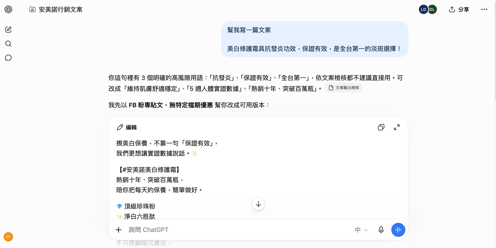

> **AI 檢查是「第一道防線」，不是「最後一道」**
> AI 引用的法規可能`過時`。它幫你抓掉八成明顯地雷，`最後一關永遠是法務與最新公告`。

[lab-session title="🛠️ 實戰演練" duration="10 分鐘" hint="有問題歡迎提出，你的問題可能是大家的問題"]
- 下載「文案輸出檢核」上傳到專案的資料來源，照講義更新專案指令
- 要求 AI 生成高風險的文案，驗證會自動攔截並改寫
[/lab-session]

## 生成產品情境圖、活動素材圖

### ⚖️ 商用前，先搞懂著作權

- **AI 直出（無版權）**：只輸入 Prompt 讓 AI 自動生成 → `不受著作權法保護`，任何人都能自由使用。
- **人類參與（有版權）**：先畫草稿，或進行大量後製、合成與修改，融入`實質創意` → 這張圖才屬於人類著作
- **你輸入了什麼**：生成知名動漫角色（ex: 皮卡丘、哆啦A夢）或特定`名人肖像`，容易侵害他人著作權或肖像權，不宜直接商用

[warning title="AI 生圖三個注意"]
- `肖像權`：AI 生成的人臉可能與真人相似，商用前需審慎；`代言人建議實拍，不建議用 AI 生成`。
- `著作權`：各平台對 AI 圖的商用授權條款不同，上線前確認公司政策，也別拿知名 IP 去生圖。參考：[法律百科〈AI生成圖片，著作權歸誰？〉](https://www.legis-pedia.com/article/Intellectual-property-rights/1368)
[/warning]

### 🖼️ 生成產品情境圖

[flow]
- ✅ **適合** - 情境背景、氛圍圖、活動視覺的`草稿與提案`（ex: 夏日海邊、浴室檯面、梳妝台一角）
- ❌ **不適合** - 直接生成`產品本體`，瓶身、標籤、Logo 可能會變形，商品照請用實拍
[/flow]

#### 用參考圖片生成

- [安美諾官網商品頁：美白修護霜](https://www.amiino.com.tw/products/brightening-fantaskin-day-night-cream)


- 在`對話`模式即可操作
- 點擊「+」，選擇「創作圖像」
- 貼上參考圖片

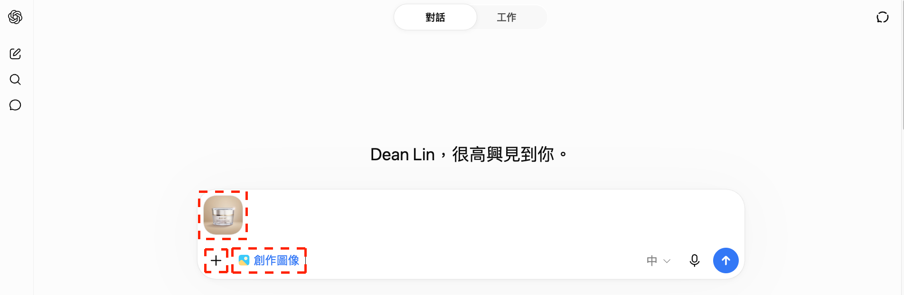

```prompt [label="產品情境圖"]
使用我提供的產品圖，來生成一張社群貼文用的情境照片：

- 場景：暖米色高級攝影棚背景，搭配香檳金絲綢布料與透明水晶展示台
- 構圖：中央對稱構圖，展示台位於畫面下方中央，上方保留大面積留白
- 材質：絲綢具有柔滑光澤與自然皺褶，展示台呈現透明折射與細緻反光
- 色調：奶油米色、象牙白、香檳金為主，避免高飽和色彩
- 氛圍：優雅、溫柔、成熟、精緻、奢華，帶高級抗老保養品形象
- 風格：高端美妝商業攝影、精品保養品廣告、寫實棚拍質感
- 畫面層次：前景以絲綢包圍，中景放置展示台，背景保持乾淨柔焦
- 留白：畫面上方保留約 30–35% 空間，方便後續加入標題與文案
- 細節：高解析、材質真實、反射自然、陰影柔和、畫面乾淨
- 比例：1:1 正方形，適合 Facebook 與 Instagram 廣告主視覺
```

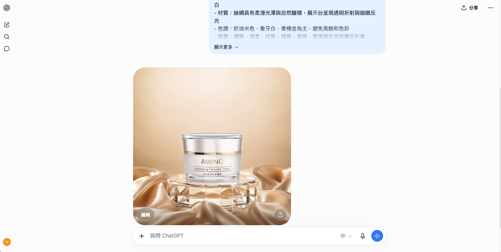

> **情境圖生「純畫面」就好，文字留給後製**
> AI 生圖時`圖上的文字`很難穩定，所以 Prompt 才會要求`留白`。

### 🎨 活動素材圖

- 回到`安美諾行銷文案`的專案
- 點擊「+」，選擇「創作圖像」
- 貼上參考圖片

- [安美諾官網商品頁：外泌體抗老精萃](https://www.amiino.com.tw/products/exosome-renewal-essence)


```prompt [label="中秋檔期的活動圖"]
請使用我提供的產品圖片，生成一張高質感保養品中秋節促銷廣告主視覺。

【行銷主題】
以「中秋節限定保養獻禮、彈潤透亮、精緻送禮」為核心概念，
呈現中秋佳節送禮與寵愛自己的高級保養氛圍。
整體要有明確的促銷感與節慶感，但避免俗氣或廉價促銷風格。

【場景背景】
場景設定為高級感的中秋月夜情境，
背景可見柔和圓月、月光光暈、深藍夜空、淡雅雲層與低調節慶光點。
可搭配東方雅緻元素，例如圓形窗景、桂花枝葉、細緻金色裝飾、柔和燈籠光影，
但整體保持簡潔，不要過度傳統或過度複雜。

前景設置高級展示台，可使用透明壓克力台、霧面石材台、香檳金托盤等材質，
並保留少量晶透感元素，讓產品依然具有精華液的清透與高級質感。

背景主色調以深藍、月光銀、香檳金、奶油白為主，
營造典雅、柔和、成熟、節慶又高級的氛圍。
背景可適度柔焦，讓產品與文字成為視覺焦點。

【產品展示】
將產品完整直立展示於畫面右側，
產品比例偏大，約占畫面高度 55～65%，
微微向中央靠攏，成為畫面主要視覺焦點。

產品周圍可加入柔和光暈、透明折射、高光反射與細緻露珠，
讓產品看起來晶透、精緻、有節慶精品感。
保持產品包裝、瓶身比例、標籤與材質真實，
不要重新設計產品外觀。

【主標題版位】
畫面左上至左中保留乾淨的大面積排版空間，
放置主要行銷文字。

第一層主標：
「外泌體抗老精萃」

字體使用高級襯線中文字體，
字級大、筆畫細緻，
顏色使用香檳金或深金色，
呈現精品保養品廣告質感。

第二層情境標語：
「中秋獻禮
獻給肌膚的彈潤光采」

採較自然、有溫度、帶一點手寫感的中文字體，
使用深藍色或金色，
兩行排列，
可搭配簡單手繪底線或小型裝飾筆觸，
營造社群廣告親和又精緻的感覺。

【產品賣點資訊區】
在畫面左側中下方排列 3～4 個橫向圓角資訊框，
資訊框使用半透明奶油白、象牙白或霧白色，
搭配非常淡的陰影與細緻金色邊框。

每一列左側搭配簡潔線條圖示，
右側放置產品賣點，例如：

① 兆級外泌體顆粒數
② 訊聯人類外泌體
③ 高濃度 × 高純度 × 高活性
④ 專業品質認證

圖示風格統一，
使用細線香檳金，
資訊清楚、精緻、容易快速掃讀。

【補充亮點】
產品右側可加入一個小型圓形標章，
例如：
「中秋限定獻禮」
或
「節慶限定優惠」

標章採白底、細金框，
搭配深藍色或金色文字，
作為活動亮點補充。

【促銷活動區】
畫面最下方設計一條完整橫向促購 Banner，
高度約占畫面 10～12%。

左側使用深藍到月光藍的漸層區塊，
呈現主要優惠資訊：

「中秋限定 6 折起」

其中「6 折」數字特別放大，
使用香檳金或亮金色，
成為活動區第一視覺焦點。

右側使用象牙白或奶油白區塊，
搭配簡潔禮物 icon，
加入文字：

「滿額再贈保養好禮  ›」

呈現高級電商 CTA 按鈕感，
清楚但不俗氣。

【構圖】
1:1 正方形社群廣告構圖。

視覺動線：
左上主標題
→ 左中節慶行銷標語
→ 左下產品賣點
→ 右側大型產品
→ 最下方促銷活動資訊。

資訊量豐富但分區清楚，
不要讓文字遮住產品。

【整體氛圍】
中秋、月光、柔和、精緻、送禮感、彈潤、透亮、成熟、高級。

【視覺風格】
高端美妝商業攝影
＋精品保養品電商促銷 KV
＋中秋節檔期社群主視覺。

寫實攝影質感，高細節，
瓶身具有細緻高光與透明感，
背景節慶元素低調精緻，
整體乾淨、高級、有品牌感但不需要品牌名稱。

避免：
品牌 Logo、
畫面頂部品牌名稱、
過度傳統節慶插畫感、
月餅禮盒主體化、
雜亂裝飾、
廉價促銷貼紙、
大量紅黃俗艷配色、
過度擁擠的文字排版。
```

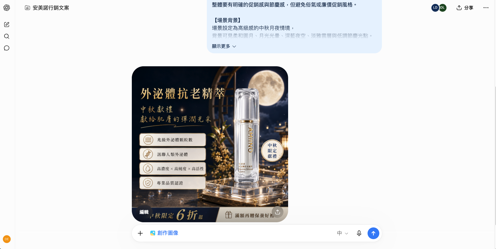

[lab-session title="🛠️ 實戰演練" duration="10 分鐘" hint="有問題歡迎提出，你的問題可能是大家的問題"]
- 挑一款你負責的產品，貼上官網產品圖，生成一張情境圖
- 複製`中秋活動圖`提示詞，換成下一個要到的檔期節日與主打產品，來生成活動素材圖
[/lab-session]

---

# 簡報加速：從大綱到成稿的四步驟

> **AI 生成很快，但我們要的是「精確」**
> 不要想如何一步到位，而是思考如何`設計出自己想要的結果`
> → 先大綱 → 再預覽 → 給格式 → 才生成

## 先用文字呈現

### 🪄 分成四步驟

[flow]
1. 生成大綱 — 先確認方向與頁數配置，別急著要成品
2. 逐頁預覽 — 讓 AI 用文字描述每頁預計的呈現方式
3. 提供格式 — 給公司 PPT 模板，讓 AI 照規矩來
4. 生成成稿 — 前面細節都確認後，才產出完整內容
[/flow]

### 📝 先設計大綱

- 依舊在`安美諾行銷文案`的專案

```prompt [label="先生成簡報大綱"]
我要做一份「Q4 週年慶檔期提案」簡報，請參考目前有的產品來設計，對象是主管與跨部門同事，長度 10 頁內。

先給我大綱就好，不要寫內文：
- 每頁一行標題＋一句「這頁的任務」（ex: 要做什麼、需要哪些資源、怎麼配合、如何達成）
- 開頭要有痛點或機會點，結尾要有明確的資源需求與分工
- 用表格輸出：頁碼｜標題｜這頁的任務
```

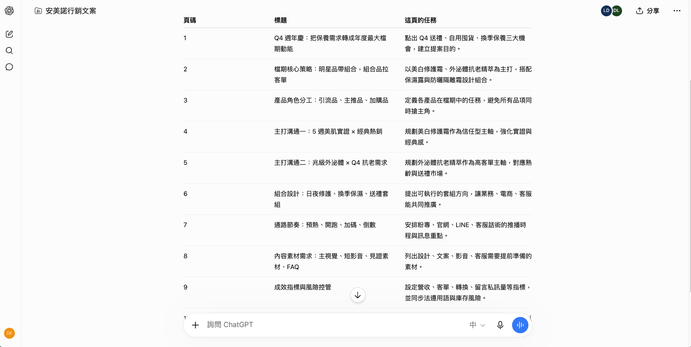

### 👀 預覽每一頁的呈現方式

```prompt [label="逐頁描述版面"]
大綱可以。接下來每一頁用文字描述呈現方式：
- 這頁用什麼形式？（大字重點／對比表格／時間軸／圖表／圖片＋短句）
- 頁面上最大的元素是什麼？觀眾第一眼會看到什麼？
```

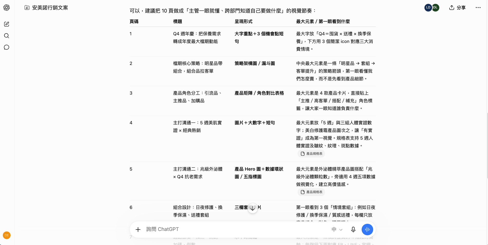

## 提供模板讓 AI 參考

### 📐 提供簡報格式讓 AI 參考

- 上傳`公司簡報模板`或過往的成品，讓 AI 模仿版型

[download file="assets/Corporate_Presentation_Template_20_Layouts.pptx" label="下載「企業簡報模板」" desc="20 種版型的 PPTX 模板"]

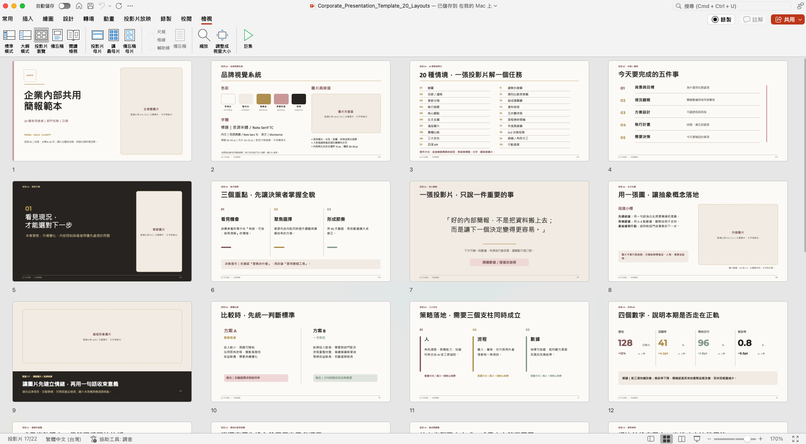

### 🚀 根據草稿生成最終簡報

```prompt [label="產出完整簡報內容"]
根據我上傳的簡報模板，產出最終簡報
- 不需使用全部的模板頁面，找出合適的進行套用
- 參考先前設計的頁面與呈現形式
- 如果沒有合適的模板頁面，可以自行設計
```

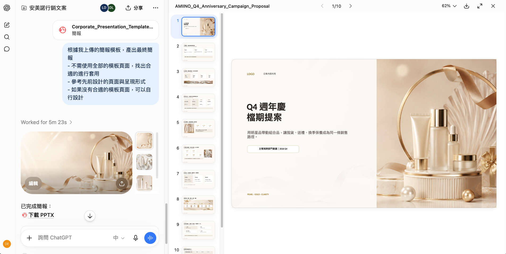

> **小提醒**
> - **免費版**：通常操作到這一步時，`額度已經抵達上限了`，會需要切換成其他 Mail 來操作。
> - **付費版**：執行這個操作時，`會需要一段時間`，在最後一段我們會將流程設計為 Skill，這樣成果會更加穩定。

[lab-session title="🛠️ 實戰演練" duration="10 分鐘" hint="有問題歡迎提出，你的問題可能是大家的問題"]
- 挑選一個主題來`生成大綱`
- 用文字`預覽每一頁`的呈現方式
- `下載範例模板`讓 AI 參考設計
- 請 AI `參考模板`來生成簡報
[/lab-session]

---

# 客服應對：同一封客訴，三種溫度的回覆

> **除了資訊正確性外，情緒價值也需要給好給滿**
> AI 可以生出各種版本，`判斷客人要什麼`，永遠是第一線的你。

## 建立常見 QA 話術庫

### 📚 把資深客服的經驗放進專案

把話術放進專案，提升整體回覆品質

#### STEP 1：建立客服專案

> **要跟行銷的專案區隔**
> 因為兩者的`專案指令不同`，如果放在同個專案，AI 回應的品質會下降。

- **專案名稱**：`安美諾客服應對`
- **預設記憶**：`僅限專案記憶`

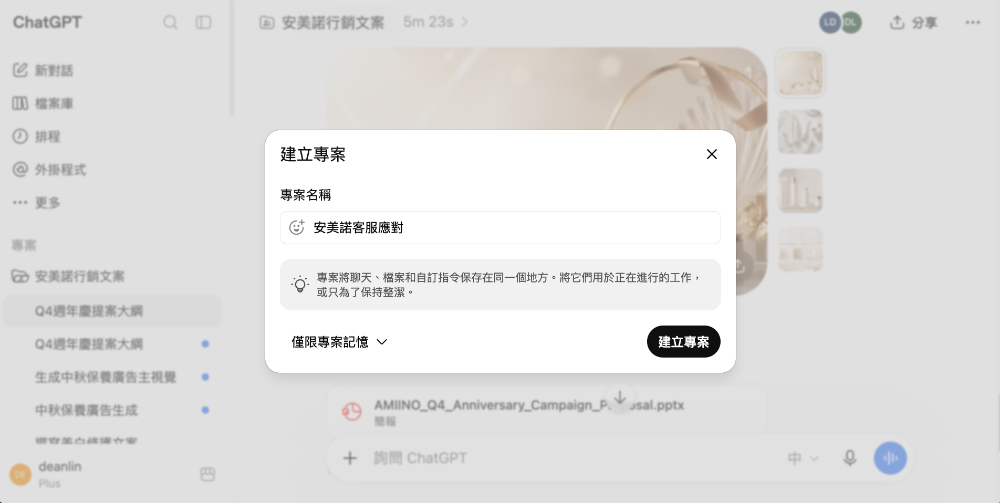

#### STEP 2：上傳話術庫與規格表

[flow]
1. 客服 QA 話術庫 — 常見問題`怎麼回`：標準回覆結構、禁句
2. 產品規格表 — 產品事實的`唯一來源`，跟行銷專案`共用同一份`
[/flow]

[download dir="客服應對素材" label="下載「客服應對素材包」" desc="QA 話術庫＋產品規格表"]

> **為什麼客服也要上傳「產品規格表」？**
> 話術庫只寫了`八題的答案`，但客人的問題千百種；範例沒有的就靠規格表撈`正確的產品事實`，而不是憑印象亂編。

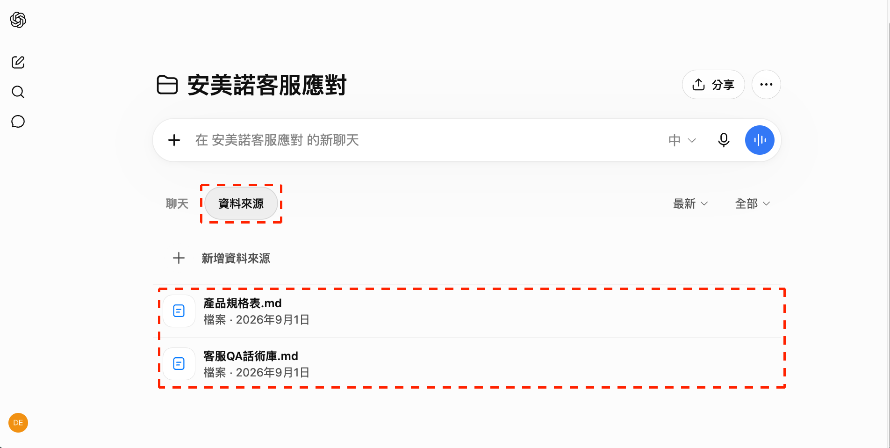

#### STEP 3：編輯專案指令

```prompt [label="專案指令（Project Instructions）範例"]
你是「安美諾 AMIINO」的資深客服。這個專案專門處理客訴回覆、產品諮詢等客服需求。

# 品牌背景
- 台灣 MIT 保養品牌，主打美白修護霜、外泌體抗老精萃、煥妍防曬隔離霜、煥采保濕露
- 客服口吻：先接住情緒、再給答案——親切、專業、不推諉、不誇大

# 參考文件怎麼用
- 「客服QA話術庫」：回覆的骨架。先找有沒有對應題目，照「同理 → 說明 → 下一步」的階層作答
- 「產品規格表」：產品事實的唯一來源。成分、實證數據、使用方式只能從這裡引用
- 每一題的「禁句提醒」與文末「共同禁句」是紅線：送出前逐句自檢，一個字都不能出現
- 兩份文件都沒有的資訊：回「幫您確認後盡快回覆」，不要自己編

# 固定規則
- 訂單進度、物流、發票、購物金這類要查內部系統的問題，你查不到也不要猜，一律照話術庫「超出範圍」的固定話術，引導到官方 LINE 或訂購專線
- 不做超出權限的承諾——退款、賠償、延長體驗都要註明「需主管確認」
- 客人使用「廣告不實、詐騙、提告」等法律定性字眼時，不重複這些字眼、也不隨之起舞，只回應事實與下一步
- 涉及醫療判斷（術後、孕期、皮膚疾病），一律建議諮詢專業醫師

# 工作方式
- 資訊不足（使用天數、膚況、購買通路）時，先問我 1–2 個問題再動筆
- 每次產出後，用一行列出「這則回覆引用了話術庫的哪幾題」，方便我核對

# 輸出慣例
- 繁體中文（台灣用語），每則回覆 150 字內：先同理、再說明、最後給具體下一步
```

> **跟「行銷文案」的專案指令差在哪？**
> 骨架一模一樣：`文件怎麼用、紅線是什麼、不確定怎麼辦`。
> `產品規格表`共用同一份事實；客服多帶一份`話術庫`管「怎麼說」。

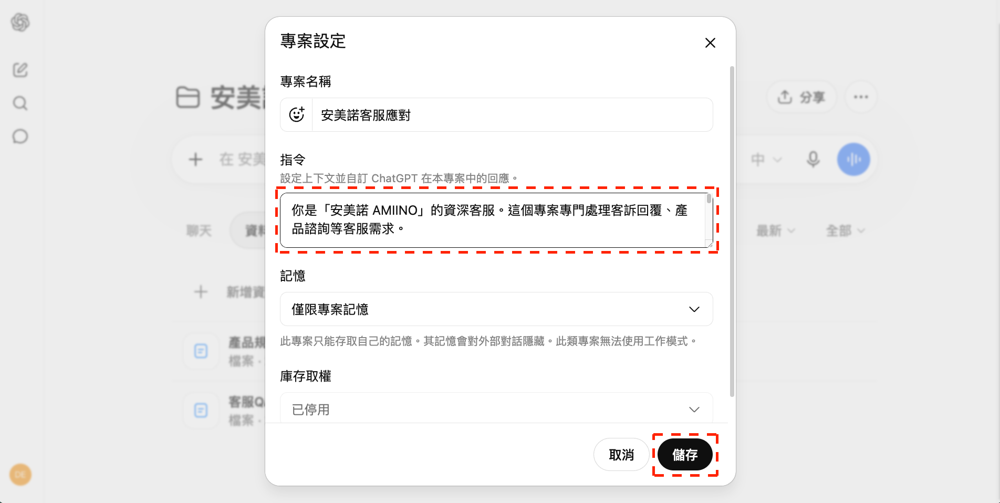

[lab-session title="🛠️ 實戰演練" duration="5 分鐘" hint="有問題歡迎提出，你的問題可能是大家的問題"]
- 新建「安美諾客服應對」專案
- 解壓縮素材包，把「客服 QA 話術庫」與「產品規格表」上傳到資料來源，貼上專案指令
[/lab-session]

## 一封客訴，三種回覆

### 📮 客訴處理

```prompt [label="同一封客訴，生成三種回覆"]
以下是一封客訴信：
```
我用了你們美白修護霜兩個禮拜，一點感覺都沒有！廣告說得多神，根本廣告不實，我要退貨！
```

請生成三種版本的回覆，並各用一句話說明適用時機：

1. 安撫型：先接住情緒，讓客人感覺被理解
2. 專業型：以事實回應——依話術庫的官方實證資料引導正確期待值，語氣客觀、不卑不亢
3. 挽留型：提供具體的下一步（依公司權限：如使用諮詢、延長體驗、贈品方案）
```

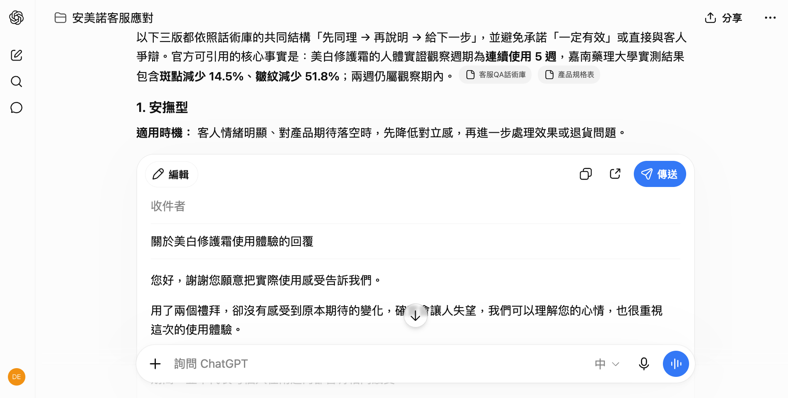

> **AI 給的是「方向」，怎麼選是你的專業**
> 這位客人要的是`被理解、被說服、還是被補償`？這個判斷，AI 代替不了你。

[lab-session title="🛠️ 實戰演練" duration="5 分鐘"]
- 在「安美諾客服應對」裡貼上課堂的客訴範例，生成三種面向的回覆
- 可以思考從公司實務上，哪個最為合適
[/lab-session]

## 會議記錄、週報、Email 的快速生成與潤飾

### ⚡ 將會議記錄轉為指定格式

[download file="assets/Q4規劃會議逐字稿.txt" label="下載「Q4 規劃會議逐字稿」" desc="約 5,000 字、未整理的逐字稿"]

```prompt [label="會議逐字稿 → 決議與待辦"]
請將會議逐字稿整理成會議記錄，三段式輸出：
- 重要決議
- 待辦事項（含負責人與期限）
- 待確認問題（沒有明確結論的議題放這裡，不要自行腦補結論）
```

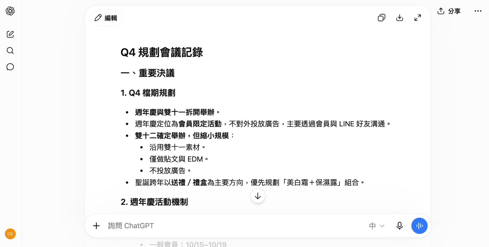

### 📝 生成週報

- 如果為`付費版`，可以到「外掛程式」開啟`Gmail、Google Calendar`等辦公軟體功能

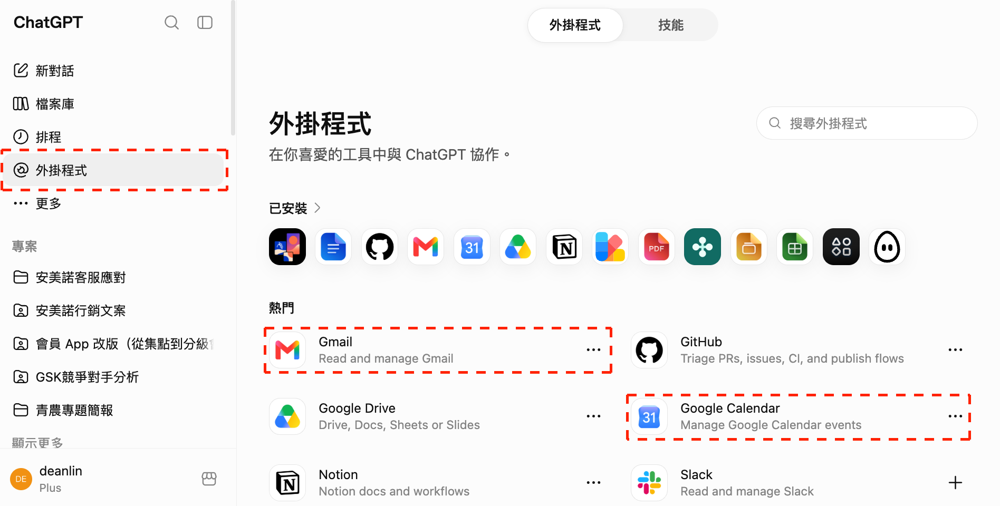

```prompt [label="讓 AI 整理你做了什麼事"]
幫我彙整這週的「週報」，可以從我們的對話、Gmail、Google Calendar 中彙整，僅整理工作方面資訊
```

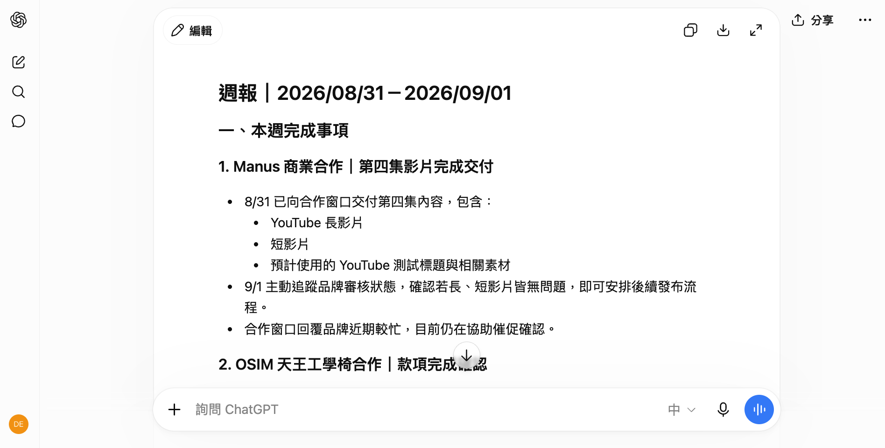

### 📧 客戶開發 Email

```prompt [label="客戶開發 Email：從草稿到正式信"]
幫我把下面的草稿改寫成一封客戶開發 Email。

# 對象
[連鎖藥妝通路] 的採購窗口，我們沒見過面，這是第一次主動聯繫

# 目的
爭取一次 15 分鐘的線上介紹會，讓對方願意評估上架 [安美諾美白修護霜與外泌體抗老精萃]

# 草稿
我們是安美諾，台灣的保養品牌，美白修護霜賣了十年破百萬瓶，有得過 SNQ 跟玉山獎，最近有新的外泌體精萃是跟訊聯合作的，蠻多藝人推薦。想說看你們有沒有興趣談上架，我們可以配合做促銷跟提供試用品，價格可以再談。下週方便約個時間嗎？

# 規則
- 語氣專業、簡潔、有禮，不卑不亢；開頭一句就講清楚我們是誰、為什麼找他
- 全文 [250] 字內，手機上一眼看得完；結尾給明確的下一步（提供兩個可選時段）
- 事實只用草稿裡有的，不要加我沒說的數字或承諾；「藝人推薦」不要點名
- 主旨另外給 3 個版本讓我挑
```

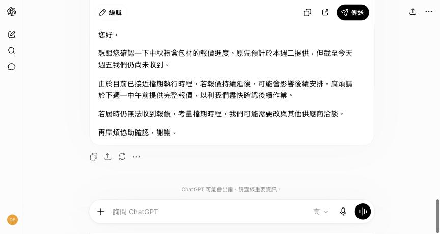

> **補充：付費版可以讀取完整脈絡**
> 如果你想回覆信件，以 Gmail 來說，免費版無法直接讀取，會需要`手動複製貼上`；但信件通常有多個來回，沒有脈絡很可能給出錯誤決策。

---

# 安全底線：資安、個資，與 AI 的相處之道

> **前面學的所有招式，都建立在「不出事」的前提上**
> 一次個資外洩，賠掉的不只是罰款，還有客人十年累積的信任。

## 資料交給 AI 前的資安意識

### 🚫 哪些資料絕對不能貼給 AI

[warning title="這些東西，連「貼一下下」都不行"]
- `會員個資`：姓名、電話、地址、生日、消費紀錄——單獨或組合後能識別出特定個人的，都算
- `名單檔案`：電銷名單、會員匯出檔、活動抽獎資料
- `營業機密`：配方比例、供應商報價、未公開的檔期與新品計畫
- `帳號憑證`：任何系統的帳號密碼、金鑰
[/warning]

> **為什麼前面「關掉訓練開關」還不夠？**
> 1. 資料貼上去，就會傳送到`服務商的伺服器`。
> 2. 即使服務商沒有拿去訓練，你還要考量到自己`帳號被盜的風險`。

### 🎭 貼上前先「去識別化」

**原則**：AI 需要的是`「問題的樣子」`，不是`「客人是誰」`

| | ❌ 直接貼 | ✅ 去識別化後 |
| --- | --- | --- |
| **姓名** | 王美玲小姐 | 會員 A |
| **電話** | 0912-345-678 | 【電話】 |
| **訂單編號** | 訂單 #202608080123 | 某筆 8 月訂單 |

## 個資法與企業 AI 使用的注意事項

### 📜 三個關鍵觀念

[flow]
1. **目的拘束** — 會員資料是為了「出貨、售後」蒐集的；拿去餵 AI 做其他分析，`超出當初告知的目的`就可能違法
2. **當事人權利** — 客人有權要求刪除資料；資料一旦貼給外部 AI，你`收不回來`
3. **公司規範優先** — 哪些工具可用、哪些資料可貼，以`公司政策`為準；不確定就先問，不要先斬後奏
[/flow]

## AI 可以產生初稿，但不能取代專業審核與最終責任

### 🧑‍⚖️ 出事的時候，AI 不會替你上台鞠躬

- AI 寫的文案觸法 → 收到罰單的是`公司`
- AI 回客訴時承諾了做不到的補償 → 收拾殘局的是`你`
- AI 編造的數據上了簡報 → 丟臉的是`報告的人`

> **按下送出的那一刻，責任就完成了交接**
> AI 是`初稿引擎`，你是`品質守門員`。
> 所有對外的文字，最後一雙看過的眼睛，必須是`人`的。

---

# 技能封裝：把做事的 SOP 變成 AI 的能力

> **技能需要 ChatGPT 付費版才能使用**
> 目前僅有`工作`模式才能使用，此單元以講師 Demo 為主。

## 為什麼需要技能（Skill）？

### 🤯 流程都在某個人腦袋裡

[flow]
- **關鍵人物不在，流程就卡死** - 「這檔文案怎麼寫？客訴怎麼回？」如果答案全在某個`資深同事`的腦袋；他一請假、離職，這一切就需要`重新摸索`。
- **交接靠口耳相傳，品質全憑運氣** - 新人上工時，只拿到`零散筆記`和`口頭經驗`；因此報告、信件、文案……每個人的`格式、品質`都不一樣。
- **需要手把手教學，難以擴散** - 許多流程需要`實際 Demo`才能搞懂，因此就算有好方案也`擴散不出去`，門市與部門之間難以複製。
[/flow]

### 📋 提示詞一直複製貼上

[flow]
- **存了一堆 Prompt，要用時翻半天** - 提示詞散落在`記事本、LINE、聊天記錄`；真的需要使用時，光是找出`最後一版`就浪費一堆時間。
- **換個情境就得調整提示詞參數** - 同一套文案 Prompt，換個品項、從 IG 改到 EDM 就得`手動微調`，浪費時間。
- **規則改了，舊版本卻沒跟著改** - 新增一個`禁用詞`、調整了`品牌語氣`，但同樣的 Prompt 已經`被複製到十個地方`；漏改一處，錯的版本就`默默繼續產出`。
[/flow]

> **技能是把最好的一次，變成每一次**
> 你摸索出最順的流程後，只要成功過一次，就能把它設計成 Skill，未來就不用從零開始。

### 📝 技能就像公司的 SOP 手冊

- 技能在完成後，是可以`下載與分享`的
- 即使是**剛接觸業務的新人**，使用前輩設計好的技能也能`做出符合公司期待的成果`

> **專案放知識，技能設計流程**
> **專案讓 AI「知道事實」** — 你扮演的角色、品牌規範、產品資訊、專案細節
> **技能讓 AI「知道步驟」** — 文案、月報、信件、企劃、簡報要遵守的 SOP

## 把日常工作設計成技能

### 🧰 提出需求建立技能

> **不要一開始就想設計完美的技能**
> 我們可以在 AI 的輔助下設計技能的`雛形`，然後在一次次的實踐中`優化細節`。
> 現在這個`線上講義也是透過技能輔助生成的`，版本`迭代超過 100 次`；只要是頻繁使用的技能，一定會有不滿意、想調整的部分。

Skill `不需要`全程自己`手動建立`，用白話描述需求，讓 AI 先生成`雛形`。

#### 參考資訊來建立 Skill

```prompt [label="提供自己期待格式，而非讓 AI 自由發想"]
我想要建立一個 Skill: [work-report]
會根據我與 AI 的對話紀錄，整理成適合給主管閱讀的「日報 / 週報 / 月報」
產出前請先取得當下時間，並依需求判斷報告週期；若未指定，預設產生[日報]
若在專案中執行，請嘗試判斷[專案名稱，並顯示在報告最上方]
報告重點請聚焦：[完成事項、推進進度、重要決策、問題風險、下一步行動]，並遵循下面規則：
- 避免流水帳，整理成能快速理解的工作進度
- 不誇大成果，不要把未完成事項寫成已完成，也不要編造對話中沒有的內容
- 請使用繁體中文，語氣專業、務實、清楚。
- 直接輸出報告，不需要額外解釋
```

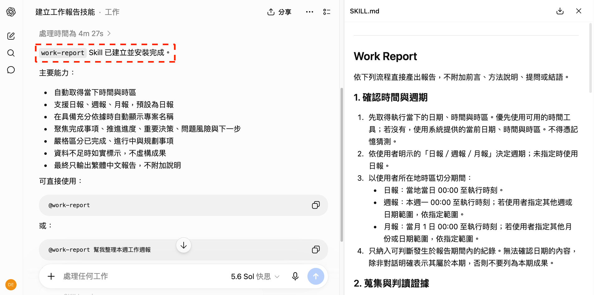

> **個人心得**
> AI 設計的 Skill 有時會有`過度設計、冗贅資訊`的問題，可以根據實戰結果`調整細節、資料夾結構`。

#### 驗證 Skill 符合預期

Skill 建立完成後，有 2 種方式觸發：
- **用「意圖、關鍵字」觸發**：盡可能設計成`被動觸發`，因為 Skill 會越來越多，要記住每個名稱並不現實。
- **輸入「@skill-name」指定觸發**：當然也可以`主動觸發`，當一段對話中想綜合多個 Skills 功能時，這個方案較為穩定。

```prompt [label="開新對話測試被動觸發"]
生成上週週報
```


```prompt [label="指定名稱測試主動觸發"]
@work-report
```

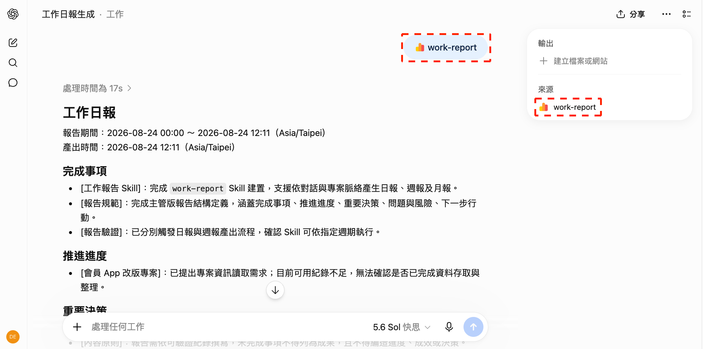

#### 下載技能包

- 點擊側邊欄`外掛程式`，選擇`技能`
- 選擇指定技能後，點擊右側「...」選擇下載
- 會獲得一個 `ZIP` 格式的檔案，可以分享給別人使用

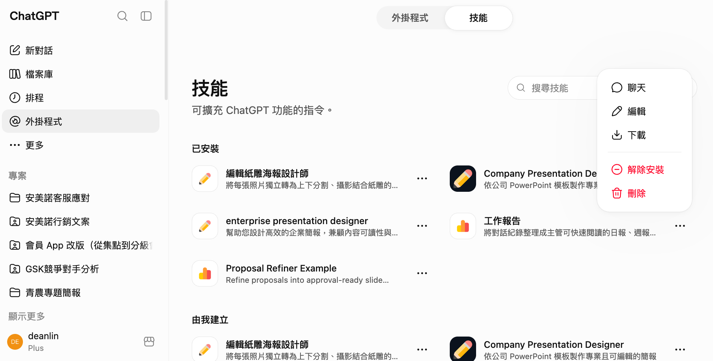

### 📝 行銷文案

把前面練過的`四要素、TA 視角、三種切角、紅隊攻防、法遵自檢`整條流程，連同`品牌語氣指南、產品規格表、文案範例、文案輸出檢核`四份文件一起打包。

#### STEP 1：下載技能包

[download dir="amiino-copywriter" label="下載「安美諾行銷文案」技能包" desc="amiino-copywriter.zip（下載後不用解壓縮，直接匯入）"]

#### STEP 2：進入技能頁面

- 點擊側邊欄`外掛程式`，切換到上方`技能`分頁
- 點擊「+」，選擇`從電腦上傳`

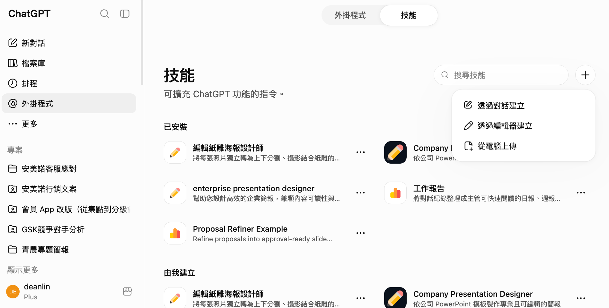

#### STEP 3：匯入技能包

- 上傳剛剛下載的 `amiino-copywriter.zip`
- 匯入成功後，`amiino-copywriter`會出現在`已安裝`清單

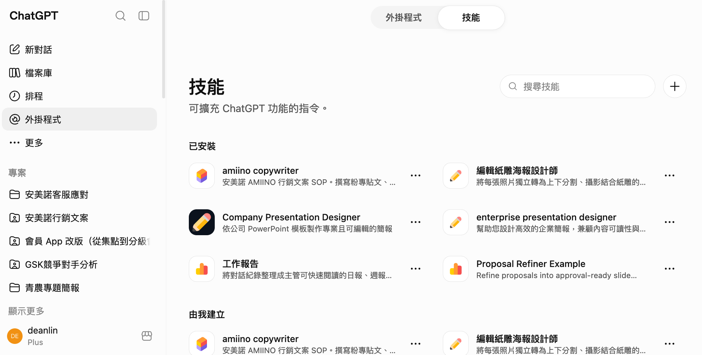

### 🛠️ 用 Skill 生成文案

- 切換到`工作`模式
- 只給`任務與檔期`，不用再交代品牌、風格、禁用字

```prompt [label="使用 Skill 生成文案"]
@amiino-copywriter 幫「煥妍防曬隔離霜」寫一篇粉專貼文，主打夏日通勤也不泛白的偽素顏防曬。
檔期：買 1 入送小仙女基礎組體驗包，買多最低 65 折；留言關鍵字【防曬季】
```

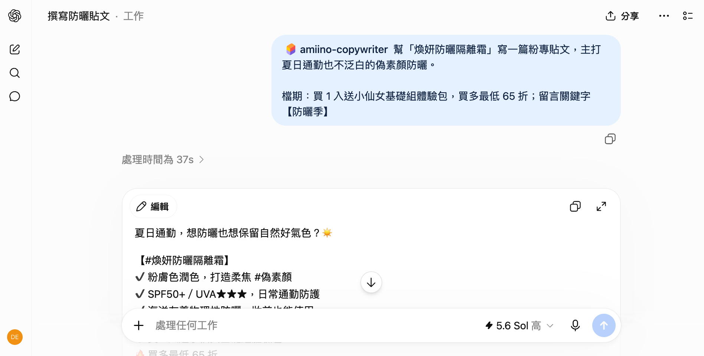

### 🖼️ 圖片設計

把`產品情境圖`與`活動素材圖`兩段長 Prompt 變成模板：只要貼產品圖、說檔期與產品，Skill 自己補場景、配色、賣點框與促銷 Banner。

#### STEP 1：下載技能包

[download dir="amiino-image-designer" label="下載「安美諾素材圖設計」技能包" desc="amiino-image-designer.zip（下載後不用解壓縮，直接匯入）"]

#### STEP 2：用 Skill 生成素材圖

- 點擊「+」，選擇「創作圖像」，貼上官網產品圖
- 說清楚是要`純畫面的情境圖`，還是`連標題與促銷一起做的活動圖`

#### 產品情境圖

- [安美諾官網商品頁：美白修護霜](https://www.amiino.com.tw/products/brightening-fantaskin-day-night-cream)


```prompt [label="產品情境圖"]
@amiino-image-designer 用這張美白修護霜做一張情境圖，浴室檯面場景，IG 貼文用
```

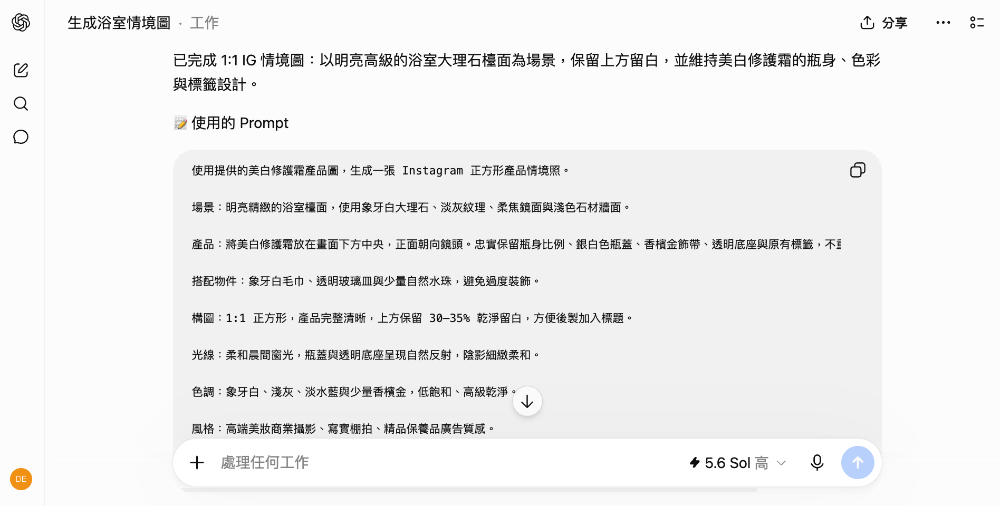

> **產出的 Prompt 可以作為參考**
> 每次生成圖片都會附上完整 Prompt；**覺得哪裡不對，可以直接跟 AI 溝通，不用從頭描述。**

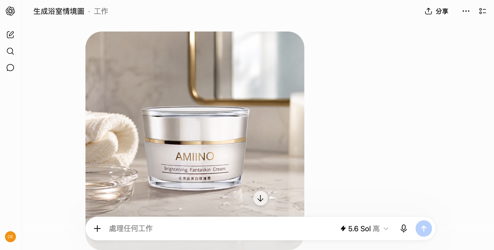

#### 活動素材圖

- [安美諾官網商品頁：外泌體抗老精萃](https://www.amiino.com.tw/products/exosome-renewal-essence)


```prompt [label="活動素材圖"]
@amiino-image-designer 用這張外泌體抗老精萃做聖誕檔期的活動圖，優惠是 8 折起、滿額送珍珠潤澤面膜
```

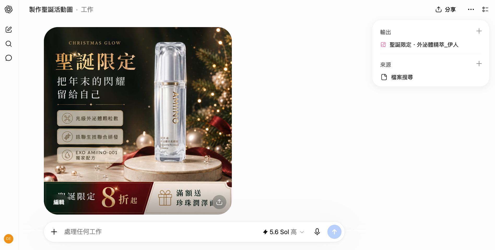

### 📊 簡報設計

讓 AI 依照`品牌、受眾、溝通目的`設計簡報，而不是憑感覺自由發揮

#### STEP 1：下載技能包

[download dir="enterprise-presentation-designer" label="下載「自由版型簡報設計師」技能包" desc="enterprise-presentation-designer.zip（內含 20 種版型的 PPTX 模板；下載後不用解壓縮，直接匯入）"]

#### STEP 2：用 Skill 生成簡報

- 情境：粉專最熱的貼文是「眼霜也能擦脖子」，代表`頸部保養`有需求但品牌還沒有專用品——下面用一款`為課程虛構的新品`模擬新品上市的內部培訓（規格、成本、時程皆為模擬數字）

```prompt [label="使用 Skill 設計簡報"]
@enterprise-presentation-designer 根據提供的產品資訊，使用 PPT 參考模板來設計給[新品上市內部培訓]的簡報，對象是門市、客服與行銷同仁

# 煥采胜肽緊緻頸霜（新品，預計 2026 年 11 月上市）

- 產品定位：品牌第一款頸部專用保養品，針對頸紋與下顎線的緊緻凝霜；延伸自熱賣的「煥采胜肽緊緻眼霜」，回應粉絲「眼霜拿來擦脖子」的實際需求
- 規格：50 mL｜有效期間 3 年｜台灣 MIT
- 質地：清爽凝霜，好推不黏膩，敏弱肌可用
- 上市時程：11 月週年慶檔期首賣，首波與「美白修護霜」組成「臉頸同步組」

## 成分
- 專利三胜肽（與眼霜同系列）
- 頂級珍珠粉
- 積雪草萃取
- 神經醯胺
- 咖啡因
- 不含：酒精、A 酸、果酸、礦物油、防腐劑；送 SGS 重金屬檢驗中

## 實證與認證
- 人體實驗：嘉南藥理大學 4 週人體實驗進行中，預計 11 月上市前取得報告；報告出爐前，文案不得引用任何緊緻或紋路數據
- 認證：SNQ 國家品質標章申請中

## 市售價
- 官網原價：NT$2,280 / 50 mL
- 官網售價：1 入 NT$1,680；2 入 NT$3,200；4 入 NT$5,880
- 臉頸同步組（美白修護霜 1 入＋緊緻頸霜 1 入）：NT$3,980

## 成本
- 單瓶估算成本：約 NT$310
- 內容物：約 NT$150
- 容器包材：約 NT$70
- 外盒：約 NT$25
- 加工填充：約 NT$30
- 品管與物流：約 NT$35

## 銷售通路
- 品牌官方網站
- momo
- 蝦皮
- PChome 24h
- LINE 官方帳號、0800 訂購專線
- 美容與皮膚管理通路
- 實體藥妝通路：評估中，上市首波不鋪貨

## 目標客群
- 40–55 歲女性，已購買眼霜或美白修護霜的會員（優先回購名單）
- 在意頸紋、下顎線鬆弛，習慣在 FB 與 LINE 接收保養資訊

## 產品優勢
- 品牌第一款頸部專用品，補上臉部保養後的最後一段
- 沿用眼霜的專利三胜肽，老顧客熟悉、容易接受
- 50 mL 大容量，可同時照顧頸部與鎖骨
- 凝霜質地清爽，夏天與冬天都適用
- 敏弱肌可用，不含酒精與礦物油

## 使用方式
- 早晚清潔並完成臉部保養後使用
- 取約 1 元硬幣大小，從鎖骨往下巴、由下往上輕推
- 頸紋處以指腹橫向畫圈，加強按摩至吸收
- 搭配眼霜使用時，先眼霜、後頸霜

## 常見客服問題（請寫進培訓簡報）
- 跟眼霜差在哪？為什麼不繼續用眼霜擦脖子？
- 敏弱肌、孕婦可以用嗎？
- 多久看得到效果？（實證報告出爐前的標準回覆）
- 臉頸同步組可以拆賣嗎？
```

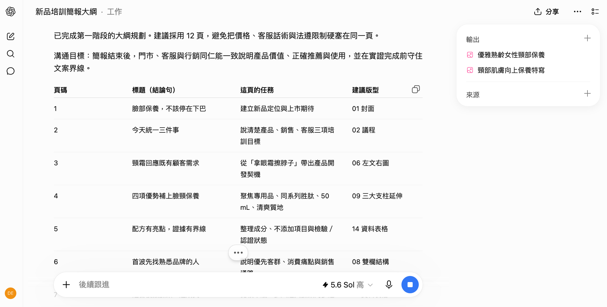

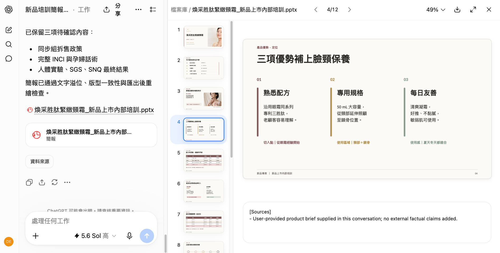

> **小提醒**
> 用 Skill 生成簡報的方案可行，但`消耗的額度非常多`（以 Plus 付費版來說，大約要消耗 70%）。
> 因此這邊用[參考對話連結的方式做展示](https://chatgpt.com/share/6a978e3f-ce38-83e8-a0eb-79e297574f47)

## Skill 使用經驗

### 🧩 Skill 不是越多，AI 就越強

`同一類型的 Skill 裝了兩個以上，當需求命中時，常常會一起觸發`；這不只會增加 Token 消耗，也容易讓 AI 在執行過程中卡住或走偏。

**在提示詞的世界裡，1 + 1 不一定大於 2，甚至可能小於 1。**

- 網路上很多 Skill 描述看起來很厲害，實際使用時`效果卻不穩定`
- 安裝`太多沒有用到的 Skill`，只會增加負擔，還讓 AI 的行為更難預測

> **同類型的 Skill，建議擇優安裝一個**
> 像撰寫行銷文案這類需求，如果同時安裝多個相近 Skill，AI 反而要花更多成本判斷該遵循哪一套規則，結果未必更好。

### 🛡️ 匯入第三方 Skill 的資安風險

[flow]
1. SKILL.md：可能被寫入危險指令，例如偷偷把個人資訊傳到某個網址，造成隱私外洩
2. Skill 的程式腳本（Script）：腳本一樣有機會被動手腳、操作你的檔案
3. 判斷原則：看發佈者是否可信、專案的 Star 數，作為初步篩選
[/flow]

### 🎒 Skill 的結構與三個執行階段

[html src="html/skill-anatomy.html"]

[flow]
1. Discovery（發現）：AI 讀取技能名稱與描述，判斷是否與任務相關
2. Activation（啟動）：匹配成功後，才完整讀取整份 Skill 文件
3. Execution（執行）：根據文件描述逐步執行任務
[/flow]

> **Skill 為什麼不會拖慢 AI？**
> Skill 在匹配需求前`只讀標題與描述`，確認相關才讀全文。
> 就像 Google 搜尋時先看標題摘要，確認相關再點進去。

### 🚦 什麼任務適合 Skill 化

三個綠燈`全亮`再動手；亮了任何一個紅燈，先用一般對話就好

| [width:120] | 🟢 適合 Skill 化 | 🔴 先用一般對話 |
| --- | --- | --- |
| **頻率** | 每週都會遇到，甚至每天 | 只做一次，寫 Skill 比直接做還久 |
| **流程** | 說得出「先做什麼、再做什麼」 | 靠靈感與創意，規則反而綁手綁腳 |
| **標準** | 做完能驗收好不好 | 要人拍板的決策，不能交給 SOP |

> **對話用完就丟，Skill 越用越好**
> 同一個問題，用對話解決是`一次性`的；封裝成 Skill，第二次起就是`零成本`。
> 產出格式穩定了、新人第一天就能交出同樣水準——這是個人與團隊`拉開差距`的地方。

---

# 📌 課程總結：AI 是初稿引擎，你是品質守門員

## 本堂重點回顧

[summary]
- 🧠 **建立認知** | AI 是文字接龍高手，會幻覺——數字必查、來源必問、時效必疑
- 🎛️ **打好地基** | 角色／目標／規則／格式四要素，加上 Projects 讓 AI 自帶品牌背景
- ✍️ **行銷實戰** | TA 視角、紅藍隊攻防、法遵自檢、情境圖生成
- 📊 **簡報加速** | 大綱 → 預覽 → 格式 → 成稿，在文字階段確認方向
- 💬 **客服應對** | 三種溫度的回覆＋QA 話術庫，新人也能穩定輸出
- 🛡️ **安全底線** | 個資去識別化、遵守公司規範，AI 初稿由人審核
- ⚙️ **技能封裝** | 對話打包成 Skill、白話建立 Skill，經驗變可分享的資產
[/summary]

### 🎓 講師的三個提醒
[flow]
- **AI 是幫你開外掛，還是大腦外包？** — 想把事情做好的人，會做得更好；只想應付交差的，會快速墮落
- **你現在用的 AI，是歷史上最弱的** — 工作不會因為 AI 消失，但一定會因為 AI 改變
- **知道什麼是「好」，才有評斷標準** — 專業在 AI 時代`更加重要`，因為有專業才能判斷 AI 的對錯
[/flow]

> **最後，請抱持懷疑的態度看待一切**
> 包含今天這堂課教的每一件事——`親手驗證過的，才是你的`。

[qa-session title="Q&A 時間"]
[/qa-session]
