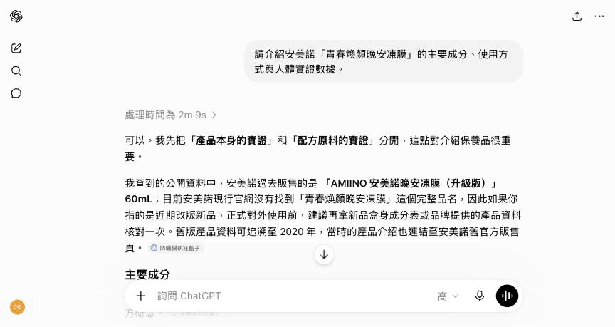

[interactive title="課前小調查"]

**Q1｜你多常使用 ChatGPT？**
`A` 每天都在用　`B` 每週用幾次　`C` 註冊過但很少開　`D` 還沒用過

**Q2｜你最希望 AI 幫你分擔哪件事？**
`A` 行銷文案　`B` 簡報製作　`C` 客服回覆　`D` 會議記錄與報表
[/interactive]

# 建立認知：生成式 AI，跟你想的一樣嗎？

> **為什麼同樣用 ChatGPT，有人如虎添翼，有人越用越氣？**
> 差別不在工具，而在你是否了解它`能做什麼、不能做什麼`。

## 每天的工作，有多少時間花在「重複產文字」上

### 😓 這些場景是否似曾相識

[flow]
1. **檔期文案** — 週年慶、母親節、盛夏防曬季…每個檔期都要生出一批貼文，靈感卻越擠越乾
2. **客訴回信** — 同一類問題回了一百次，每次還是要重新打字、斟酌語氣
3. **簡報週報** — 資料都有，但把它「變成一頁一頁」的苦工沒人想做
[/flow]

> **AI 最擅長的，正是這種「有素材、缺人手」的文字工作**
> 這堂課的目標不是讓你變成工程師，而是把`重複的文字工`交給 AI，你來做`判斷與把關`。

### 🆚 「生成式 AI」與「自動化工具」的差異

| | 自動化工具 | 生成式 AI |
| --- | --- | --- |
| **運作方式** | 照固定規則執行（ex: Excel 巨集、排程機器人） | 理解語意，`生成`新內容 |
| **輸入輸出** | 相同輸入 → 相同輸出 | 相同輸入 → `每次結果都可能不同` |
| **擅長** | 重複、格式固定的流程 | 文案、摘要、翻譯、發想 |
| **風險** | 規則寫錯就全錯 | `一本正經地胡說八道` |

> **一句話分工**
> 規則明確、不能出錯的交給`自動化`；需要理解與創作、允許人工把關的交給`生成式 AI`。

## AI 的能力範圍與幻覺問題

### 🎲 親眼看一次 AI「一本正經地胡說八道」

當 AI 遇到`它不知道的事`，它不會說「我不知道」，而是`把話接得通順`——這就是**幻覺（Hallucination）**。

```prompt [label="現場實驗：問一個不存在的產品"]
請介紹安美諾「青春煥顏晚安凍膜」的主要成分、使用方式與人體實證數據。
```

- 安美諾`根本沒有這個產品`，但 AI 很可能編出成分表、實證數據，講得跟真的一樣
- 現場再追問一句「你的依據是什麼？」，觀察它怎麼圓



> **為什麼 AI 會幻覺？**
> AI 的本質是`文字接龍`：根據機率算出「下一個字最可能是什麼」。
> 它的目標是「`像真的`」，而不是「`是真的`」。

### ✅ 三個查證習慣

[flow]
1. **數字必查** — 實證數據、價格、活動門檻，一律回`官網或內部文件`核對（ex: 美白修護霜的實證是「連續使用 5 週」，AI 寫成「7 天有感」就出大事）
2. **來源必問** — 追問「這個說法的依據是什麼？」，給不出來源就當`草稿靈感`看待
3. **時效必疑** — AI 的知識有`截止日期`，最新法規、本月檔期它可能不知道
[/flow]

### 💰 ChatGPT 免費版 vs 付費版差在哪

| | 免費版 | 付費版 |
| --- | --- | --- |
| **訊息額度** | 有限，用完被降級 | 大幅提高 |
| **模型等級** | 進階模型用量少 | 優先使用`最聰明的模型` |
| **圖片生成** | 每日少量 | 更多張數、速度更快 |
| **檔案與 Projects** | 基本功能 | 更大容量、完整功能 |
| **進階功能（ex: Skill）** | ❌ | ✅（最後一個單元 Demo） |

> **公司幫你付費的意義**
> 付費版不是「回答比較長」，而是`更聰明的模型 × 更穩定的額度 × 更完整的工作功能`。
> 用免費版評價 AI，就像只試駕最低配就下結論。

## 資訊安全第一課：不要讓 ChatGPT 拿你的資料去訓練

### 🛡️ 上班第一件事：關閉「用我的資料改善模型」

預設情況下，你輸入的內容`可能被拿去訓練未來的模型`。開始工作前，先把它關掉。

**操作路徑**：頭像 → `設定（Settings）` → `資料控管（Data Controls）` → 關閉「`為所有人改善模型（Improve the model for everyone）`」


- 一次性的敏感討論，可改用「`暫時交談（Temporary Chat）`」：不留紀錄、不進記憶
- 但注意：就算關了開關，`個資與機密仍然不該貼上去`——這是「安全底線」單元的重點

[lab-session title="🛠️ 實戰演練" duration="10 分鐘" hint="有問題歡迎提出，你的問題可能是大家的問題"]
- 登入 ChatGPT，關閉「為所有人改善模型」
- 用「青春煥顏晚安凍膜」實驗一次幻覺，感受 AI 的「一本正經」
- 追問它「你的依據是什麼？」，觀察它如何回應
[/lab-session]

---

# 打好地基：把 ChatGPT 調教成懂你的工作助理

> **AI 不好用，九成是因為「話沒說清楚」**
> 你不會對新同事丟一句「幫我寫個文案」就轉身走人，對 AI 也一樣。

## 提示詞四要素：角色、目標、規則、輸出格式

### 🆚 「幫我寫防曬文案」為什麼只能得到罐頭文

| | 模糊指令 | 完整指令 |
| --- | --- | --- |
| **角色** | （沒說） | 熟悉台灣美妝市場的社群行銷專家 |
| **目標** | 寫個文案 | 為煥妍防曬隔離霜寫 IG 夏日貼文，導流到官網 |
| **規則** | （沒說） | 不得出現療效宣稱、繁體中文、150 字內 |
| **輸出格式** | （沒說） | Hook → 3 賣點 → CTA → 3 個 hashtag |

```prompt [label="完整版：煥妍防曬隔離霜 IG 貼文"]
你是熟悉台灣美妝市場的社群行銷文案專家，擅長寫自然、不像廣告的貼文。

# 目標
為「安美諾 煥妍防曬隔離霜」寫一篇 IG 夏日貼文，導流到官網活動頁。

# 產品資訊
- SPF50+／UVA★★★，低敏物理性防曬
- 潤色配方，打造自然感偽素顏
- 成分：有機岩穴綠藻 × 黃金修護海藻 × 海葡萄
- 海洋友善，符合多國法規要求

# 規則
- 繁體中文（台灣用語），全文 150 字內
- 不能出現「治療、修復肌膚問題」等療效字眼
- 語氣像閨蜜推薦，不要條列成分表

# 輸出格式
開頭 Hook 一句 → 3 個使用情境亮點 → CTA → 3 個 hashtag
```


> **為什麼要拆成四要素？**
> `角色`決定它用誰的專業說話、`目標`決定方向、`規則`劃出紅線、`輸出格式`省下你重排的時間。
> 四個都給，第一版就能`八成可用`；一個都不給，AI 只能`用猜的`。

## 記憶與自訂指令：讓 AI 越用越懂你

### 🧠 認識記憶功能（Memory）

- ChatGPT 會從對話中`自動記下你的習慣`（ex: 偏好的語氣、常處理的產品線）
- **操作路徑**：設定 → `個人化（Personalization）` → `記憶（Memory）`
- 記了什麼可以隨時`查看與刪除`；不想留痕跡的討論，改用`暫時交談`


### 🎛️ 自訂 ChatGPT（Custom Instructions）

**操作路徑**：設定 → 個人化 → `自訂 ChatGPT`

```prompt [label="自訂指令範例（行銷職）"]
我是台灣保養品牌「安美諾 AMIINO」的行銷人員。
- 回覆一律使用繁體中文（台灣用語）
- 涉及產品功效的文字，主動提醒我注意化粧品法規的宣稱限制
- 我提供的資訊不足時，先反問我 1–2 個問題再動筆
```


### 🧭 記憶 vs 自訂指令 vs Projects

| | 記憶 | 自訂指令 | Projects |
| --- | --- | --- | --- |
| **誰來寫** | AI 自動記 | 你手動寫 | 你上傳檔案＋寫說明 |
| **作用範圍** | 全部對話 | 全部對話 | `只在該專案內` |
| **適合放** | 個人習慣 | 職務與通用規則 | `品牌資料、產品規格` |

## 用 Projects 建立工作資料夾

> **每次都要重新交代品牌背景，就像每天重新自我介紹**
> 把`品牌語氣、產品資訊、過往案例`放進 Project，之後在裡面開的每個對話，AI 都自帶這些背景知識。

### 🗂️ 三步驟建好你的品牌資料夾

#### STEP 1：建立專案

側邊欄 → `新專案（New Project）` → 命名（ex: `安美諾行銷文案`）


#### STEP 2：上傳參考檔案

- `品牌語氣指南`——我們怎麼說話：親切、專業、有溫度、不誇大
- `產品規格表`——四大明星商品的成分、容量、實證數據
- `熱賣文案範例`——過往成效好的貼文 5–10 篇


#### STEP 3：寫專案指令

```prompt [label="專案指令（Project Instructions）範例"]
這是「安美諾 AMIINO」的行銷文案專案。

# 品牌背景
- 台灣 MIT 保養品牌，深耕十年，攜手台灣專業醫師與研發團隊
- 明星商品：美白修護霜（熱銷 13 年）、外泌體抗老精萃、煥妍防曬隔離霜、煥采保濕露
- 榮譽：SNQ 國家品質標章、國家品牌玉山獎、世界品質評鑑大賞金獎
- 品牌口吻：像懂保養的好朋友——親切、專業、有溫度，不誇大

# 固定規則
- 產品數據只能引用我上傳的「產品規格表」，不可自行編造
- 所有功效敘述需符合化粧品廣告規範，禁用醫療效能字眼
- 文案結尾附上品牌句候選：「你，今天安美諾了嗎？」
```


### 🤝 把 Project 分享給同事

- 團隊方案可將設定好的專案`分享給同事`：新人報到直接繼承同一套背景設定與知識庫
- 好處：`全組輸出品質一致`，不再依賴「誰比較會下指令」
- 記得指定`一位維護者`：產品改版、法規更新時更新專案檔案，全組同步生效

> **這就是「把個人經驗變成團隊資產」的第一步**
> 最後一個單元的 Skill，會把這件事做得更徹底。

[lab-session title="🛠️ 實戰演練" duration="15 分鐘" hint="有問題歡迎提出，你的問題可能是大家的問題"]
- 建立一個屬於你職務的 Project（ex: 行銷文案／客服應對）
- 上傳 1–2 份你手邊的參考文件（記得先去除個資）
- 照「四要素」寫一段專案指令，測試同一個問題在專案內外的回答差異
[/lab-session]

---

# 行銷實戰：用 AI 寫文案、做攻防、過法遵

> **全程以安美諾真實產品為情境**
> 這一單元的每個 Prompt 都直接用自家商品當範例——學完就能帶回工位上用。

## 扮演目標客群，從不同角度生成文案

### 🎭 先讓 AI「變成」你的客人

寫文案前，先請 AI 扮演 TA（目標客群），你會聽到`平常聽不到的心聲`。

```prompt [label="讓 AI 扮演美白修護霜的 TA"]
你現在是 45 歲的台灣女性上班族：
- 注重保養、預算中上，習慣在 FB／LINE 接收保養品資訊
- 最在意「斑點、暗沉」，被大量美妝廣告轟炸過，戒心很重
- 買過踩雷產品，特別討厭誇大不實的宣稱

請以這個身份回答：
1. 看到「5 週有效淡斑美白」這句話，你的第一反應是什麼？
2. 什麼樣的內容會讓你願意點進去看？
3. 什麼字眼會讓你直接滑走？
```


### ✍️ 同一個產品，三種切角一次生成

```prompt [label="三種切角的貼文各來一版"]
根據專案裡的產品規格表，為「安美諾美白修護霜」各寫一版 FB 貼文：

1. 「痛點共鳴」版：從素顏沒自信、遮瑕越擦越厚的日常切入
2. 「成分實證」版：主打珍珠粉 × 淨白六胜肽 × 草本精萃、5 週人體實證
3. 「情境故事」版：從「趕通告 15 分鐘完妝出門」的場景切入

每版 200 字內，附 3 個 hashtag，結尾都要有導購 CTA。
```


> **AI 的價值不是「寫一篇」，而是「同時給你十個方向」**
> 人腦一次只能沿一條路想；AI 可以`平行展開所有路`，你負責挑出最對味的那條。

## 紅藍隊攻防：讓文案先被自己人打過一輪

### ⚔️ 與其被市場打臉，不如先內部演練

- **藍隊**＝寫文案的你
- **紅隊**＝故意挑毛病的一方——讓 AI 扮演`競品、奧客、猶豫的新客`，在上線前把弱點找出來

```prompt [label="紅隊三連擊"]
以下是我們準備上線的文案：
【貼上你的文案】

請依序扮演三個角色攻擊這篇文案：

1. 競品行銷總監：指出這篇文案最弱的三個點，以及你會怎麼打我們
2. 資深奧客：用最刁鑽的角度質疑文案裡的每一個宣稱
3. 猶豫中的新客：說出讓你「差一點就下單、但最後沒買」的原因

最後，綜合三方觀點，給我一版修改後的文案。
```


> **被 AI 罵，比被市場罵便宜太多**
> 紅隊演練的成本是 3 分鐘；上線翻車的成本是`整個檔期`。

## 法遵小幫手：別讓一句話害整個檔期下架

[warning title="療效宣稱是行政罰鍰等級的地雷"]
- 化粧品受《`化粧品衛生安全管理法`》規範：廣告`不得有醫療效能`的標示或宣傳（ex: 治療、消除疤痕、殺菌、抗發炎）
- 若涉及食品／保健品：《`食品安全衛生管理法`》同樣禁止療效宣稱；未取得健康食品認證，不得宣稱保健功效
- 衛福部有公告「得宣稱／不適當宣稱」詞句例示，且`會不定期更新`——最終務必以`最新公告與公司法務`為準
[/warning]

### 🔍 讓 AI 當第一道防線

```prompt [label="文案法遵自檢"]
你是熟悉台灣《化粧品衛生安全管理法》與衛福部宣稱詞句例示的法遵顧問。

請逐句檢查以下文案，用表格輸出：
| 原句 | 風險等級（🔴 高／🟡 中／🟢 低） | 問題說明 | 建議改寫 |

檢查重點：
- 是否涉及醫療效能（治療、痊癒、消除斑點、修復受損細胞…）
- 是否誇大不實（保證、第一、絕對、100%）
- 涉及功效的句子，是否有實證支持的安全說法可以替代

文案如下：
【貼上文案】
```


> **AI 檢查是「第一道防線」，不是「最後一道」**
> AI 引用的法規可能`過時`。它幫你抓掉八成明顯地雷，`最後一關永遠是法務與最新公告`。

## 生成產品情境圖、活動素材圖

### 🎨 正確用法：生「情境」，不生「產品」

- ✅ **適合**：情境背景、氛圍圖、活動視覺的`草稿與提案`（ex: 夏日海邊、浴室檯面、梳妝台一角）
- ❌ **不適合**：直接生成`產品本體`——瓶身、標籤、Logo 會變形，商品照請用實拍

```prompt [label="盛夏防曬檔期的情境圖"]
生成一張社群貼文用的情境照片：

- 場景：清晨的白色大理石浴室檯面，右側灑進柔和陽光
- 構圖：留出畫面右下 1/3 的乾淨空間（後製時放產品實拍圖）
- 氛圍：夏日、清爽、乾淨透亮，以水珠與綠色植物點綴
- 風格：真實攝影感、淺景深、明亮低對比
- 比例：1:1（IG 貼文用）
```


[warning title="AI 生圖三個注意"]
- `肖像權`：AI 生成的人臉可能與真人相似，商用前需審慎；`代言人素材（ex: 蘇晏霈）依合約使用實拍，絕不可用 AI 生成`
- `著作權`：各平台對 AI 圖的商用授權條款不同，上線前確認公司政策
- `標示誠實`：使用前後對比這類效果圖`不可用 AI 捏造`——這同樣構成廣告不實
[/warning]

[lab-session title="🛠️ 實戰演練" duration="15 分鐘" hint="有問題歡迎提出，你的問題可能是大家的問題"]
- 挑一個你負責的產品，讓 AI 扮演 TA 說出三個真心話
- 生成三種切角的文案，選出最好的一版丟給「紅隊三連擊」
- 把改完的文案跑一次法遵自檢，看看抓出幾個風險句
[/lab-session]

---

# 簡報加速：從大綱到成稿的四步驟

> **最累的不是想內容，而是「把內容變成一頁一頁」**
> 讓 AI 按部就班陪你走：先大綱、再預覽、給格式、才生成——`一步到位反而最慢`。

## 四步驟工作法

[flow]
1. 生成大綱 — 先確認方向與頁數配置，別急著要成品
2. 逐頁預覽 — 用文字描述每頁的呈現方式，低成本調整
3. 提供格式 — 給公司模板或版面規範，讓 AI 照規矩來
4. 生成成稿 — 方向、版面、格式都確認後，才產出完整內容
[/flow]

### 📝 STEP 1：先要大綱，不要成品

```prompt [label="先生成簡報大綱"]
我要做一份「Q4 週年慶檔期提案」簡報，對象是主管與跨部門同事，長度 15 頁內。

先給我大綱就好，不要寫內文：
- 每頁一行標題＋一句「這頁要說服對方什麼」
- 開頭要有痛點或機會點，結尾要有明確的資源需求
- 用表格輸出：頁碼｜標題｜這頁的任務
```


### 👀 STEP 2：請 AI 預覽每一頁的呈現方式

```prompt [label="逐頁描述版面"]
大綱確認了。接下來每一頁用文字描述呈現方式：
- 這頁用什麼形式？（大字重點／對比表格／時間軸／圖表／圖片＋短句）
- 頁面上最大的元素是什麼？觀眾第一眼會看到什麼？
一次描述 5 頁，我確認後再繼續。
```


### 📐 STEP 3：提供簡報格式讓 AI 參考

- 上傳`公司簡報模板`或過往的成品，讓 AI 模仿版型與用語
- 沒有模板就用文字描述規範（ex: 每頁重點不超過 3 條、標題不超過 15 字、品牌色為主色）

### 🚀 STEP 4：根據草稿生成最終簡報

```prompt [label="產出完整簡報內容"]
照確認過的大綱與版面，產出完整簡報內容：
- 每頁輸出：標題／重點內容（3 條內）／講者備忘稿（口語化，每頁 100 字內）
- 遵守我上傳模板的版型與字數限制
- 完成後，另外輸出一份可直接匯入的 .pptx 檔
```

> **為什麼不一步到位？**
> 一次生成 15 頁再重改，改動成本最高。`在文字階段把方向確認完`，AI 才不會做白工，你也不會改到懷疑人生。

[lab-session title="🛠️ 實戰演練" duration="15 分鐘" hint="有問題歡迎提出，你的問題可能是大家的問題"]
- 挑一個你近期要報告的主題，跑完 STEP 1 大綱
- 讓 AI 逐頁預覽前 5 頁的呈現方式，練習「在文字階段就改方向」
- 有帶公司模板的，試著讓 AI 照格式產出前 3 頁
[/lab-session]

---

# 客服應對：同一封客訴，三種溫度的回覆

> **客服的價值不是打字快，而是「選對溫度」**
> AI 負責生出各種版本，`判斷客人要什麼`，永遠是第一線的你。

## 電銷／客服：一封客訴，三種回覆

### 📮 真實場景演練

> **客訴信原文**
> 「我用了你們美白修護霜兩個禮拜，一點感覺都沒有！廣告說得多神，根本廣告不實，我要退貨！」

```prompt [label="同一封客訴，生成三種回覆"]
你是安美諾的資深客服主管。以下是一封客訴信：
【貼上客訴內容】

請生成三種版本的回覆，並各用一句話說明適用時機：

1. 安撫型：先接住情緒，讓客人感覺被理解
2. 專業型：以事實回應——官方人體實證為「連續使用 5 週」，兩週未達實證週期，
   引導正確期待值，語氣客觀、不卑不亢
3. 挽留型：提供具體的下一步（依公司權限：如使用諮詢、延長體驗、贈品方案）

規則：
- 不使用「廣告不實」等法律定性字眼，也不隨之起舞
- 不做超出權限的承諾
- 每版 150 字內，繁體中文
```


> **AI 給的是「三個方向」，選哪個是你的專業**
> 這位客人要的是`被理解、被說服、還是被補償`？這個判斷，AI 代替不了你。

## 建立常見 QA 話術庫，讓新人也能穩定回覆

### 📚 把資深客服的腦袋，變成新人的手冊

```prompt [label="從歷史對話整理 QA 話術庫"]
以下是我們過去三個月的客服對話紀錄（已去除客人姓名與聯絡方式）：
【貼上紀錄】

請整理成 QA 話術庫，用表格輸出：
| 分類 | 常見問題 | 標準回覆 | 禁句提醒 |

分類參考：
- 產品使用（ex: 敏感肌可以用嗎？雷射術後多久能用？使用順序？）
- 訂單物流／會員與購物金（ex: 生日購物金怎麼領？）
- 退換貨流程

「禁句提醒」列出這一題絕對不能說出口的字眼（ex: 保證有效、療效承諾）。
```


- 話術庫放進`客服 Project`，新人遇到問題先問 AI，回覆品質不再看年資
- 每月用新的對話紀錄`迭代更新`——這才是活的知識庫，不是躺在硬碟的文件
- ⚠️ 貼對話紀錄前記得先`去識別化`——下一個單元教你怎麼做

## 會議記錄、週報、Email 的快速生成與潤飾

### ⚡ 三個高頻小場景

```prompt [label="會議逐字稿 → 決議與待辦"]
以下是會議逐字稿，請整理成會議記錄，三段式輸出：
- 重要決議
- 待辦事項（含負責人與期限）
- 待確認問題（沒有明確結論的議題放這裡，不要自行腦補結論）
【貼上逐字稿】
```


```prompt [label="流水帳 → 週報"]
以下是我這週做的事（流水帳），請整理成週報：
- 格式：本週成果（量化優先）／進行中／下週計畫／需要協助
- 語氣專業簡潔，不誇大
【貼上流水帳】
```


```prompt [label="Email 潤飾"]
把以下內容改寫成一封得體的商務 Email：
- 對象：合作廠商窗口；語氣：客氣但立場明確
- 保留所有事實與數字，不新增我沒說過的承諾
【貼上草稿】
```


[lab-session title="🛠️ 實戰演練" duration="15 分鐘" hint="有問題歡迎提出，你的問題可能是大家的問題"]
- 用課堂的客訴範例，生成三種溫度的回覆，小組討論你會選哪一版、為什麼
- 挑 3 個你最常被問的問題，做出迷你版 QA 話術庫
- 把這週的工作流水帳丟給 AI，產出一份週報初稿
[/lab-session]

---

# 安全底線：資安、個資，與 AI 的正確相處之道

> **前面學的所有招式，都建立在「不出事」的前提上**
> 一次個資外洩，賠掉的不只是罰款，還有客人十年累積的信任。

## 哪些資料絕對不能貼給 AI

[warning title="這些東西，連「貼一下下」都不行"]
- `會員個資`：姓名、電話、地址、生日、消費紀錄——單獨或組合後能識別出特定個人的，都算
- `名單檔案`：電銷名單、會員匯出檔、活動抽獎資料
- `營業機密`：配方比例、供應商報價、未公開的檔期與新品計畫
- `帳號憑證`：任何系統的帳號密碼、金鑰
[/warning]

> **為什麼關掉訓練開關還不夠？**
> 資料貼上去，就等於`傳輸到境外服務商的伺服器`。
> 就算不被拿去訓練，也已經`離開公司的控制範圍`——個資法在意的正是這件事本身。

## 貼上前先「去識別化」

### 🎭 換個代號，AI 一樣能幫你

| | ❌ 直接貼 | ✅ 去識別化後 |
| --- | --- | --- |
| **姓名** | 王美玲小姐 | 會員 A |
| **電話** | 0912-345-678 | 【電話】 |
| **訂單** | 訂單 #202608080123 | 某筆 8 月訂單 |
| **內容** | 完整客訴信原文 | `摘要後`的問題描述 |

- 原則：AI 需要的是`「問題的樣子」`，不是`「客人是誰」`
- 回覆生成後，再由`人工`把真實稱謂填回去寄出

## 個資法與企業 AI 使用的注意事項

### 📜 三個關鍵觀念

[flow]
1. **目的拘束** — 會員資料是為了「出貨、售後」蒐集的；拿去餵 AI 做其他分析，`超出當初告知的目的`就可能違法
2. **當事人權利** — 客人有權要求刪除資料；資料一旦貼給外部 AI，你`收不回來`
3. **公司規範優先** — 哪些工具可用、哪些資料可貼，以`公司政策`為準；不確定就先問，不要先斬後奏
[/flow]

## AI 可以產生初稿，但不能取代專業審核與最終責任

### 🧑‍⚖️ 出事的時候，AI 不會替你上台鞠躬

- AI 寫的文案觸法 → 收到罰單的是`公司`
- AI 回客訴時承諾了做不到的補償 → 收拾殘局的是`你`
- AI 編造的數據上了簡報 → 丟臉的是`報告的人`

> **按下送出的那一刻，責任就完成了交接**
> AI 是`初稿引擎`，你是`品質守門員`。
> 所有對外的文字，最後一雙看過的眼睛，必須是`人`的。

---

# ⚙️ 進階加映：Skill——把做事的 SOP 變成 AI 的能力（4 小時版）

> 本單元功能需 ChatGPT 付費版，以講師 Demo 為主；先建立觀念，日後升級即可直接套用。

## 什麼是 Skill

### 🍳 先講個炒菜的比喻

- 同樣的食材，為什麼連鎖餐廳`每一盤炒出來都一樣好吃`？因為有`標準食譜`：火候幾分、下鍋順序、調味克數
- **Skill 就是給 AI 的標準食譜**：把「做事的 SOP」寫成 AI 看得懂的說明書，之後遇到同類任務，AI 自動照著做
- 差別在哪：Project 給的是`背景資料`，Skill 給的是`做事的步驟與標準`

### 🤔 為什麼同一件事，不同人用 AI 產出的品質差很多

- 高手的提示詞裡藏著大量`隱性知識`：品牌語氣怎麼拿捏、法遵紅線在哪、格式怎麼排
- 新人寫的指令`只有動作、沒有標準`，AI 只能給出平均水準的東西
- Skill 把高手的隱性知識`封裝`起來——從此品質不再取決於「`誰在用`」

## 前面各單元的內容，其實都能轉化成 Skill（Demo）

### ✍️ 行銷文案 Skill

- **封裝**：品牌語氣指南＋文案結構模板＋法遵自檢清單
- **效果**：輸入產品名與檔期 → 直接產出`已跑完一輪自檢`的三版文案

### 🎨 圖片設計 Skill

- **封裝**：光暗度、遮罩、構圖、留白位置等設計規則
- **效果**：每張情境圖`風格一致`，不再一張一個樣

### 📊 簡報設計 Skill

- **封裝**：公司版型、字級、配色規範、每頁資訊密度上限
- **效果**：全公司的週報與提案`長得像同一家公司出品`

## 什麼任務適合 Skill 化

[tags]
- [green] 高頻率：每週都要做的事
- [green] 可規則化：說得出步驟與標準
- [green] 有明確標準：能判斷「做得好不好」
- [orange] 一次性任務：寫成 Skill 不划算
- [orange] 高度創意：規則反而綁手綁腳
- [orange] 需要人判斷：決策別交給 SOP
[/tags]

> **把解決問題的經驗，變成可重複使用的資產**
> 一般的對話`用完就丟`；Skill `越用越好`。
> Skill 穩定了產出格式，也把新人上手成本降到最低——這是個人與團隊拉開差距的關鍵。

---

# 📌 課程總結：AI 是初稿引擎，你是品質守門員

[summary]
- 🧠 **建立認知** | AI 是文字接龍高手，會幻覺——數字必查、來源必問、時效必疑
- 🎛️ **打好地基** | 角色／目標／規則／格式四要素，加上 Projects 讓 AI 自帶品牌背景
- ✍️ **行銷實戰** | TA 視角、紅藍隊攻防、法遵自檢、情境圖生成
- 📊 **簡報加速** | 大綱 → 預覽 → 格式 → 成稿，在文字階段確認方向
- 💬 **客服應對** | 三種溫度的回覆＋QA 話術庫，新人也能穩定輸出
- 🛡️ **安全底線** | 個資去識別化、遵守公司規範，AI 初稿由人審核
- ⚙️ **Skill 預告** | 把 SOP 封裝成 AI 可重複執行的能力，經驗變資產
[/summary]

[bonus title="🎁 幕後製作心得"]
偷偷告訴大家：**這份講義本身，就是用這堂課教的方法做出來的**。

- 講義裡引用的品牌故事、產品成分、實證數據、會員制度，都是請 AI 從`安美諾官網`讀取後整理的——這就是「給 AI 參考資料，而不是讓它憑空發揮」
- 文案範例跑過`法遵自檢`的流程，把有風險的句子改寫掉
- 整份講義的排版，來自一個`簡報設計 Skill`：版型、配色、元件規範都封裝好了，講師只需要專心寫內容

所以「把 SOP 變成 AI 的能力」不是未來式——你現在看到的這一頁，就是成果。

還有一件事：講義裡的每一張 ChatGPT 畫面，都是`課前實際執行的結果`，不是示意圖——包括那個「安美諾行銷文案」專案，此刻真的存在，上傳了產品規格表、寫好了專案指令。
[/bonus]

[survey title="課程滿意度問卷" url="" hint="您的意見是我們進步的動力"]
[/survey]

[qa-session title="Q&A 時間"]
[/qa-session]
