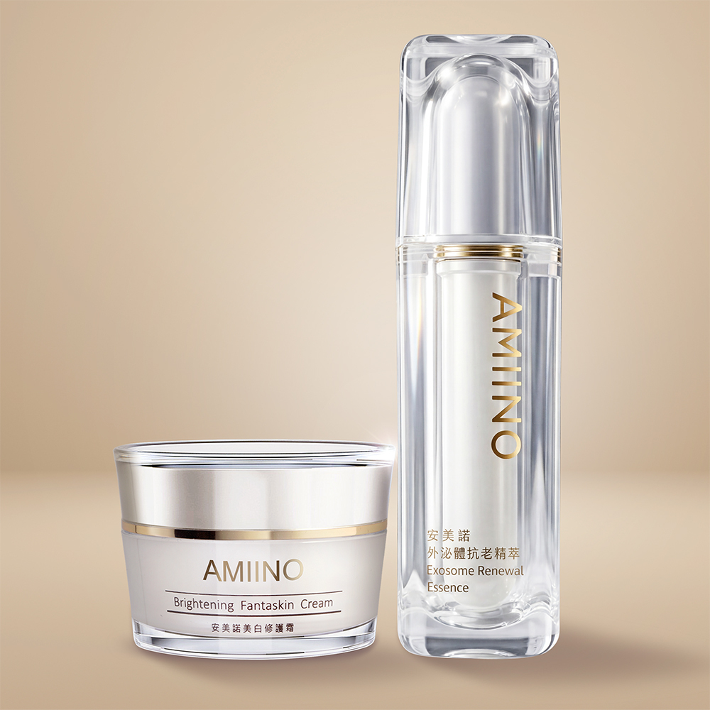

# 美白修護霜1入+外泌體抗老精萃1入

## 完整價格

以下價格為 2026-08-25 官網頁面擷取結果。

| 官方規格 | 官網原價 | 官網售價 | 相較原價 | 販售狀態 |
|---|---:|---:|---:|---|
| 美白修護霜1入+外泌體抗老精萃1入 | NT$10,500 | NT$6,800 | 35% | 官網販售中 |

## 官網商品簡介

丨戀戀七夕丨
下單贈｜外泌體抗老精萃 共2mL
指定組合，滿額贈好禮
期間限定只在這次情人節

美白修護霜
■頂級珍珠粉 × 淨白六胜肽 × 傳明酸

外泌體抗老精萃
■ 提升彈力｜緊緻撫紋｜提升光澤

▼撥打免付費專線了解更多▼

※單筆滿$3,000以上，享刷卡分期0利率※

## 官網產品詳細規格

01

**品名**
AMIINO安美諾美白修護霜

**用途**
含有珍珠粉、淨白六胜肽及草本抗老精萃等多種複方精華，經實驗證實有效減少皺紋、斑點、紋理及緊緻毛孔。

**使用方法**
早晚臉部清潔後，可使用化妝水或保濕露進行保濕鎖水，最後步驟取適量之本產品於臉部區域，以指腹輕推塗抹再以輕拍方式讓產品均勻吸收，就能持續維持淨白透亮。

**容量**
30mL

**有效期間**
3年

**保存期限與批號**
標示於包裝上

**保存方法：**
請置於陰涼處，避免高溫或陽光照射。

02

**品名**
AMIINO安美諾外泌體抗老精萃Exosome Renewal Essence

**用途**
含有高濃度的訊聯人類臍帶間質幹細胞外泌體，能幫助肌膚深層修護、撫平細紋、均勻膚色、延緩老化。

**使用方法**
臉部清潔後，取適量於手心，輕抹於臉部及重點修護部位，再用指腹按摩至肌膚完全吸收。

**容量**
30mL

**有效期間**
3年

**保存期限與批號**
標示於包裝上

**保存方法：**
請置於陰涼處，避免高溫或陽光照射。

**安心保障**
本產品已投保富邦產物保險3千萬元

**製造業者：**
美無痕生物科技股份有限公司

**客服專線：**
0800-360-036

**地址：**
新北市板橋區三民路一段212號8樓

## 官網圖文介紹文字

以下內容取自商品描述圖片的官方 alt 文字，依官網順序保留。

- 蘇晏霈與陳美鳳代言並推薦安美諾美白修護霜：榮獲 SNQ 國家品質標章、國家品牌玉山獎及 FG 專家認證等多項殊榮。
- 安美諾美白修護霜多效合一：主打1分鐘完成保養與裸妝，集美白淡斑、保濕抗老及撫平細紋於一瓶，快速打造無瑕素顏肌。
- 安美諾美白修護霜人體實驗數據：經嘉南藥理大學實測，連續使用5週後皺紋減少51.8%、紋理減少39.2%及斑點減少14.5%。
- 撥打免付費專線訂購，享更多優惠，電話:0800-202-777
- AMIINO安美諾外泌體抗老精萃瓶身與陳美鳳代言人之品牌形象照，主打安美諾生醫與訊聯生技聯研，兆級外泌體啟動年輕能量。
- AMIINO安美諾外泌體抗老精萃說明外泌體挑選關鍵，在於來源、純度、檢測與實證，含衛福部核准、兆級外泌體顆粒數與奈米分析檢測。
- AMIINO安美諾外泌體抗老精萃經4週人體實證，100%有感改善人數滿意度，彈力、緊緻度、皺紋細紋、光澤度與平滑度皆有提升。
- AMIINO 安美諾全系列保養使用步驟，從清潔、保濕、精華到美白修護霜，打造透亮細緻膚觸

## 來源

- [安美諾官網商品頁](https://www.amiino.com.tw/products/brightening-exosome-care)
