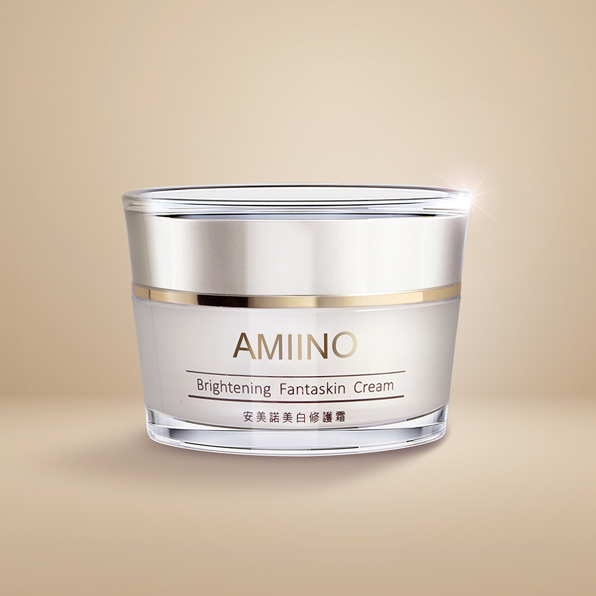

# 美白修護霜 5週給你美肌

## 完整價格

以下價格為 2026-08-25 官網頁面擷取結果。

| 官方規格 | 官網原價 | 官網售價 | 相較原價 | 販售狀態 |
|---|---:|---:|---:|---|
| 美白修護霜1入 | NT$4,500 | NT$2,980 | 34% | 官網販售中 |
| 美白修護霜2入 | NT$9,000 | NT$5,800 | 36% | 官網販售中 |
| 美白修護霜4入 | NT$18,000 | NT$10,800 | 40% | 官網販售中 |
| 美白修護霜6入 | NT$27,000 | NT$15,800 | 41% | 官網販售中 |

## 官網商品簡介

丨戀戀七夕丨
下單贈｜外泌體抗老精萃 共2mL
指定組合，滿額贈好禮
期間限定只在這次情人節

■頂級珍珠粉 × 淨白六胜肽 × 傳明酸
■強效美白｜極致淡斑｜抗皺撫紋
■人體實證5週 解決肌膚煩惱

▼撥打免付費專線了解更多▼

※單筆滿$3,000以上，享刷卡分期0利率※

## 官網產品詳細規格

| 欄位 | 官網內容 |
|---|---|
| 品名 | AMIINO安美諾美白修護霜 |
| 使用方法 | 早晚臉部清潔後，可使用化妝水或保濕露進行保濕鎖水，最後步驟取適量之本產品於臉部區域，以指腹輕推塗抹再以輕拍方式讓產品均勻吸收，就能持續維持淨白透亮。 |
| 用途 | 含有珍珠粉、淨白六胜肽及草本抗老精萃等多種複方精華，經實驗證實有效減少皺紋、斑點、紋理及緊緻毛孔。 |
| 容量 | 30mL |
| 有效期間 | 3年 |
| 保存方法 | 請置於陰涼處，避免高溫或陽光照射。 |
| 保存期限與批號 | 標示於包裝上 |
| 製造業者 | 美無痕生物科技股份有限公司 |
| 客服專線 | 0800-360-036 |
| 地址 | 新北市板橋區三民路一段212號8樓 |

## 官網圖文介紹文字

以下內容取自商品描述圖片的官方 alt 文字，依官網順序保留。

- 安美諾美白修護霜熱銷十年媒體實證：獲白冰冰等藝人推薦，並在超級冰冰秀、綜藝大集合等多檔電視節目中獲得高度評價與分享，累積深厚口碑。
- 蘇晏霈與陳美鳳代言並推薦安美諾美白修護霜：榮獲 SNQ 國家品質標章、國家品牌玉山獎及 FG 專家認證等多項殊榮。
- 安美諾美白修護霜多效合一：主打1分鐘完成保養與裸妝，集美白淡斑、保濕抗老及撫平細紋於一瓶，快速打造無瑕素顏肌。
- 安美諾美白修護霜人體實驗數據：經嘉南藥理大學實測，連續使用5週後皺紋減少51.8%、紋理減少39.2%及斑點減少14.5%。
- 安美諾美白修護霜抗老成分解析：添加頂級珍珠粉防止老化，搭配淨白六胜肽改善暗沉，及草本精萃提升肌膚防護力與保水度。
- 安美諾美白修護霜黃金複方成分：結合比菲德氏菌、神經醯胺、水解DNA、胎盤素及尿囊素，提供全方位修護、保濕與抗老功效。
- 安美諾美白修護霜瞬效煥白科技：透過淨白六胜肽與細緻珍珠粉深層滲透，擊退黑色素並提亮膚色，打造白皙透亮燈泡肌。
- 安美諾美白修護霜歷年獲獎殊榮：囊括2023 、2025、2026 Monde Selection金獎、國家品牌玉山獎及FG專家認證，品質與抗老功效備受各界肯定。
- 安美諾美白修護霜六大安全保證：通過SNQ國家品質標章、SGS檢驗及嘉南藥理大學5週人體實驗證實安全性與功效，層層把關更安心。
- 安美諾美白修護霜產品特色總覽：主打5效合1美白淡斑，經人體實驗證實有效，且配方溫和，全膚質與弱敏肌皆可安心使用。
- 安美諾美白修護霜8大安心保證：堅持不含酒精、A酸、果酸、礦物油及防腐劑，選用專櫃級原料並通過SGS重金屬檢驗，守護肌膚健康。
- AMIINO 安美諾全系列保養使用步驟，從清潔、保濕、精華到美白修護霜，打造透亮細緻膚觸

## 來源

- [安美諾官網商品頁](https://www.amiino.com.tw/products/brightening-fantaskin-day-night-cream)
