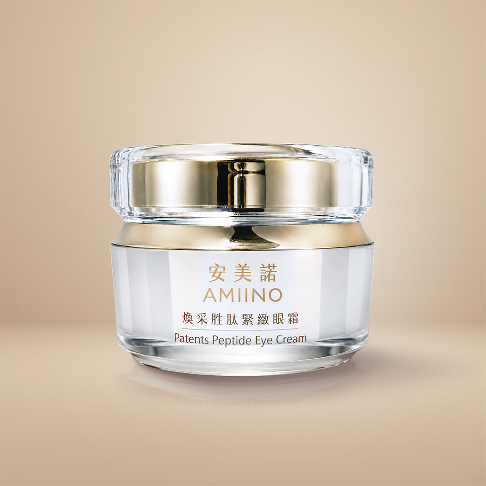

# 煥采胜肽緊緻眼霜 綻放電眼魅力

## 完整價格

以下價格為 2026-08-25 官網頁面擷取結果。

| 官方規格 | 官網原價 | 官網售價 | 相較原價 | 販售狀態 |
|---|---:|---:|---:|---|
| 煥采胜肽緊緻眼霜1入 | NT$1,680 | NT$1,280 | 24% | 官網販售中 |
| 煥采胜肽緊緻眼霜2入 | NT$3,360 | NT$2,400 | 29% | 官網販售中 |
| 煥采胜肽緊緻眼霜4入 | NT$6,720 | NT$4,380 | 35% | 官網販售中 |

## 官網商品簡介

丨戀戀七夕丨
下單贈｜外泌體抗老精萃 共2mL
指定組合，滿額贈好禮
期間限定只在這次情人節

■專利胜肽配方 × 咖啡因 × 玻尿酸
■撫平紋路｜深層提亮｜潤澤彈性
■輕潤呵護眼周脆弱肌膚

▼撥打免付費專線了解更多▼

※單筆滿$3,000以上，享刷卡分期0利率※

## 官網產品詳細規格

| 欄位 | 官網內容 |
|---|---|
| 品名 | AMIINO安美諾煥采胜肽緊緻眼霜 Patents Peptide Eye Cream |
| 使用方法 | 沾取適量，輕點在眼部周圍，由內而外以繞圈方式輕輕按摩於眼周。本產品無添加酒精、色素、溫和不易刺激。 |
| 用途 | 專利多胜肽精華－深層肌底養護，撫平細紋，提亮眼周暗沉。 |
| 容量 | 15mL |
| 有效期間 | 3年 |
| 保存方法 | 請置於陰涼處，避免高溫或陽光照射。 |
| 保存期限與批號 | 標示於包裝上 |
| 製造業者 | 美無痕生物科技股份有限公司 |
| 客服專線 | 0800-360-036 |
| 地址 | 新北市板橋區三民路一段212號8樓 |

## 官網圖文介紹文字

以下內容取自商品描述圖片的官方 alt 文字，依官網順序保留。

- 蘇晏霈推薦安美諾煥妍胜肽緊緻眼霜：主打全方位修護與深層滲透肌底，一瓶搞定眼周細紋，點亮自信雙眸。
- 謝孟璇醫師推薦安美諾胜肽緊緻眼霜：添加三、四、六、八胜肽等多重專利成分，全效修護眼周肌膚，能撫平細紋並提升肌膚緊緻度。
- 安美諾眼霜三大核心成分：添加有機認證乳木果油滋潤肌膚、咖啡因提亮眼周改善暗沉，以及玻尿酸深層補水恢復彈性。
- 安美諾眼霜有機與專利證書：嚴選ECOCERT認證乳木果油與植物固醇，搭配多項胜肽專利技術，確保成分天然有效且具備科研背書。
- 安美諾眼霜三步驟使用教學：針對細紋與暗沉，透過輕潤滲透、撫平細紋及賦活按摩手法，幫助成分吸收並調理眼周紋路。
- AMIINO 安美諾全系列保養使用步驟，從清潔、保濕、精華到美白修護霜，打造透亮細緻膚觸

## 來源

- [安美諾官網商品頁](https://www.amiino.com.tw/products/eye-cream)
