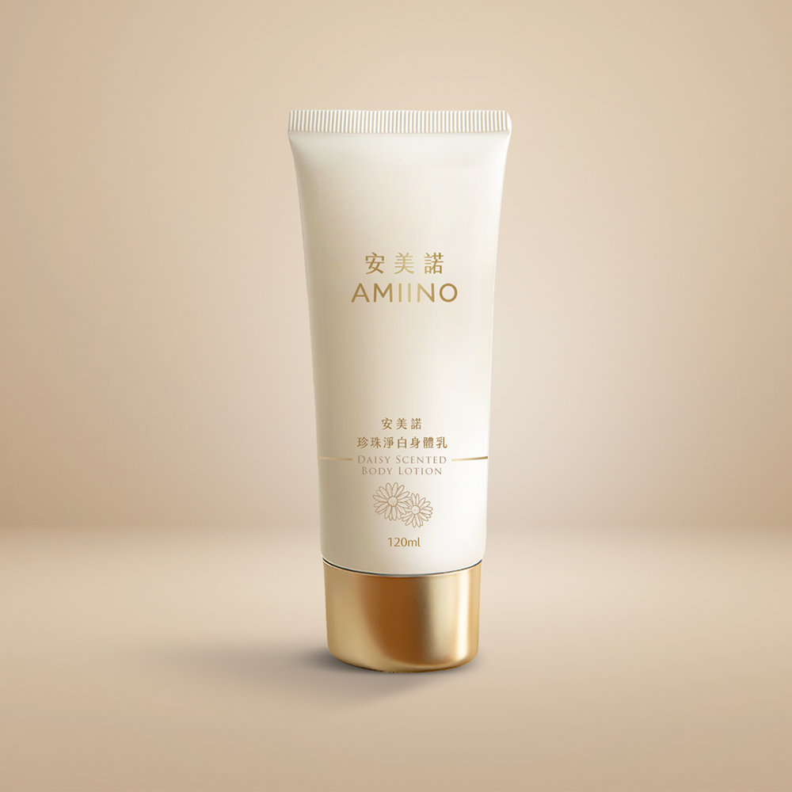

# 珍珠淨白身體乳｜小雛菊香味

## 完整價格

以下價格為 2026-08-25 官網頁面擷取結果。

| 官方規格 | 官網原價 | 官網售價 | 相較原價 | 販售狀態 |
|---|---:|---:|---:|---|
| 珍珠淨白身體乳－小雛菊1入 | NT$1,680 | NT$1,280 | 24% | 官網販售中 |
| 珍珠淨白身體乳－無花果1入+小雛菊1入 | NT$3,360 | NT$2,400 | 29% | 官網販售中 |
| 珍珠淨白身體乳－小雛菊2入 | NT$3,360 | NT$2,400 | 29% | 官網販售中 |
| 珍珠淨白身體乳－小雛菊4入 | NT$6,720 | NT$4,380 | 35% | 官網販售中 |

## 官網商品簡介

丨戀戀七夕丨
下單贈｜外泌體抗老精萃 共2mL
指定組合，滿額贈好禮
期間限定只在這次情人節

■專利白龍膽花 × 大溪地黑珍珠 ×有機乳木果油
■嫩白肌膚｜保濕鎖水｜改善細紋
■獨家特調兩款香氛

▼撥打免付費專線了解更多▼

※單筆滿$3,000以上，享刷卡分期0利率※

## 官網產品詳細規格

| 欄位 | 官網內容 |
|---|---|
| 品名 | AMIINO安美諾珍珠淨白身體乳（小雛菊） |
| 使用方法 | 沐浴後取適量塗抹於全身，輕柔按摩至吸收，乾燥或膚色較暗沉的部位，可適量加強使用。 |
| 用途 | 添加專利喜馬拉雅白龍膽花萃取與珍稀黑珍珠萃取，有效舒緩肌膚乾燥，提升緊緻度，使肌膚散發白淨透亮。 |
| 容量 | 120mL |
| 有效期間 | 3年 |
| 保存方法 | 請置於陰涼處，避免高溫或陽光照射。 |
| 保存期限與批號 | 標示於包裝上 |
| 製造業者 | 美無痕生物科技股份有限公司 |
| 客服專線 | 0800-360-036 |
| 地址 | 新北市板橋區三民路一段212號8樓 |

## 官網圖文介紹文字

以下內容取自商品描述圖片的官方 alt 文字，依官網順序保留。

- 代言人蘇晏霈推薦安美諾珍珠淨白身體乳（小雛菊香）：具備深層保濕與淨白功效，散發淡雅小雛菊香氣，讓肌膚重現柔嫩光澤，適合日常保養。
- 安美諾身體乳明星成分解析：添加專利白龍膽花修護肌膚防禦力，搭配有機乳木果油深層滋養鎖水，有效預防老化並改善乾燥引起的細紋。
- 謝孟璇醫師推薦安美諾身體乳成分：富含大溪地黑珍珠胺基酸助抗老凍齡，搭配雙專利水解膠原蛋白深層保濕，能改善細紋並恢復肌膚彈性。
- 安美諾身體乳科研認證：擁有白龍膽花與水解膠原蛋白之美國韓國雙專利，並選用通過歐盟有機認證的乳木果油，確保成分天然有效且具備臨床實證。
- 安美諾珍珠淨白身體乳質地示意：水嫩輕盈好吸收，塗抹時具備溫柔包覆的療癒感，能瞬間為肌膚補水，維持全身水潤透亮不黏膩。

## 來源

- [安美諾官網商品頁](https://www.amiino.com.tw/products/pearl-whitening-body-lotiond)
