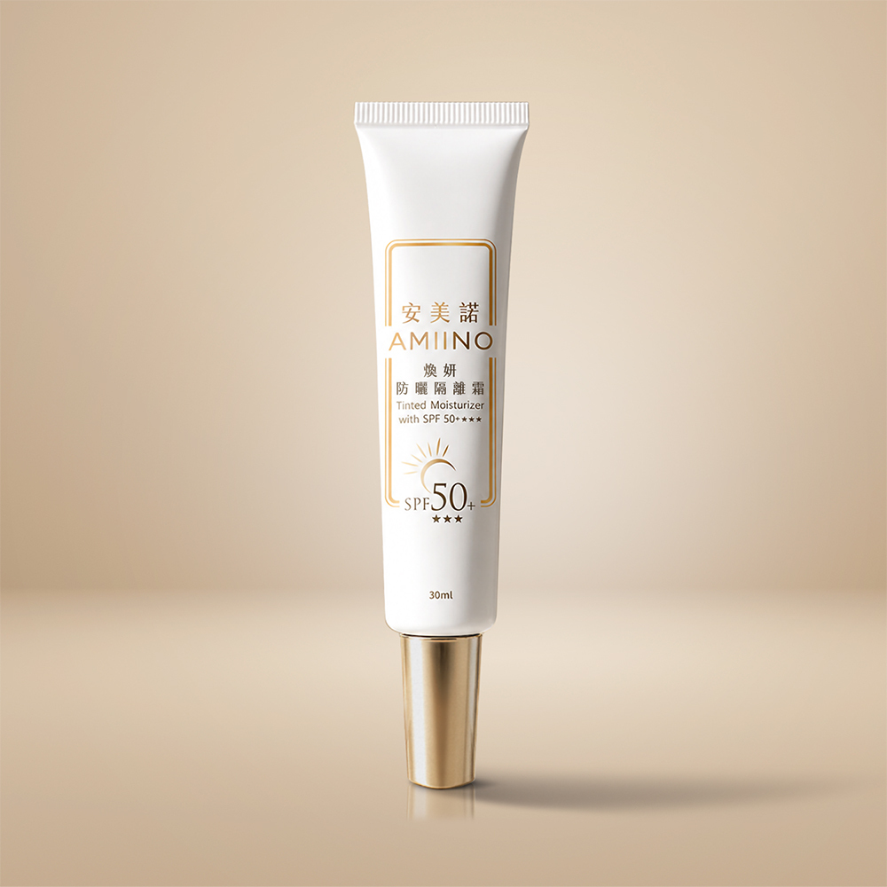

# 煥妍防曬隔離霜 SPF50+/UVA⭐⭐⭐

## 完整價格

以下價格為 2026-08-25 官網頁面擷取結果。

| 官方規格 | 官網原價 | 官網售價 | 相較原價 | 販售狀態 |
|---|---:|---:|---:|---|
| 煥妍防曬隔離霜1入 | NT$1,680 | NT$1,280 | 24% | 官網販售中 |
| 煥妍防曬隔離霜2入 | NT$3,360 | NT$2,400 | 29% | 官網販售中 |
| 煥妍防曬隔離霜4入 | NT$6,720 | NT$4,380 | 35% | 官網販售中 |

## 官網商品簡介

丨戀戀七夕丨
下單贈｜外泌體抗老精萃 共2mL
指定組合，滿額贈好禮
期間限定只在這次情人節

■有機岩穴綠藻 × 黃金修護海藻 × 海葡萄
■有效隔離髒污丨打造柔焦妝感
■海洋友善 符合多國法規要求

▼撥打免付費專線了解更多▼

※單筆滿$3,000以上，享刷卡分期0利率※

## 官網產品詳細規格

| 欄位 | 官網內容 |
|---|---|
| 品名 | AMIINO安美諾煥妍防曬隔離霜SPF50+★★★ |
| 使用方法 | 於基礎保養後，取適量均勻塗抹於肌膚上，做為妝前潤色修飾。 |
| 用途 | 臉部防曬隔離，修飾肌膚、自然潤色。 |
| 容量 | 30mL |
| 有效期間 | 3年 |
| 保存方法 | 請置於陰涼處，避免高溫或陽光照射。 |
| 保存期限與批號 | 標示於包裝上 |
| 製造業者 | 美無痕生物科技股份有限公司 |
| 客服專線 | 0800-360-036 |
| 地址 | 新北市板橋區三民路一段212號8樓 |

## 官網圖文介紹文字

以下內容取自商品描述圖片的官方 alt 文字，依官網順序保留。

- 蘇晏霈推薦安美諾煥妍防曬隔離霜：具SPF50+高防曬係數，質地輕薄不油膩，呈現粉膚色自然提亮潤色效果，容量30ml。
- 安美諾防曬隔離霜防護機制圖：高效隔離紫外線UVA及UVB，並形成保護膜阻隔髒空氣與彩妝，全天候防護肌膚免受環境傷害。
- 謝孟璇醫師推薦安美諾防曬隔離霜成分：採海洋友善物理防曬阻擋紫外線，添加岩穴綠藻與黃金海藻修護肌膚，兼具保濕潤澤與光防護功效。
- 安美諾海洋友善防曬隔離霜認證：符合美國與帛琉等國法規，獲COSMOS與ECOCERT有機認證，添加岩穴綠藻與黃金修護海藻，守護生態。
- AMIINO 安美諾全系列保養使用步驟，從清潔、保濕、精華到美白修護霜，打造透亮細緻膚觸

## 來源

- [安美諾官網商品頁](https://www.amiino.com.tw/products/sunshield-cream)
