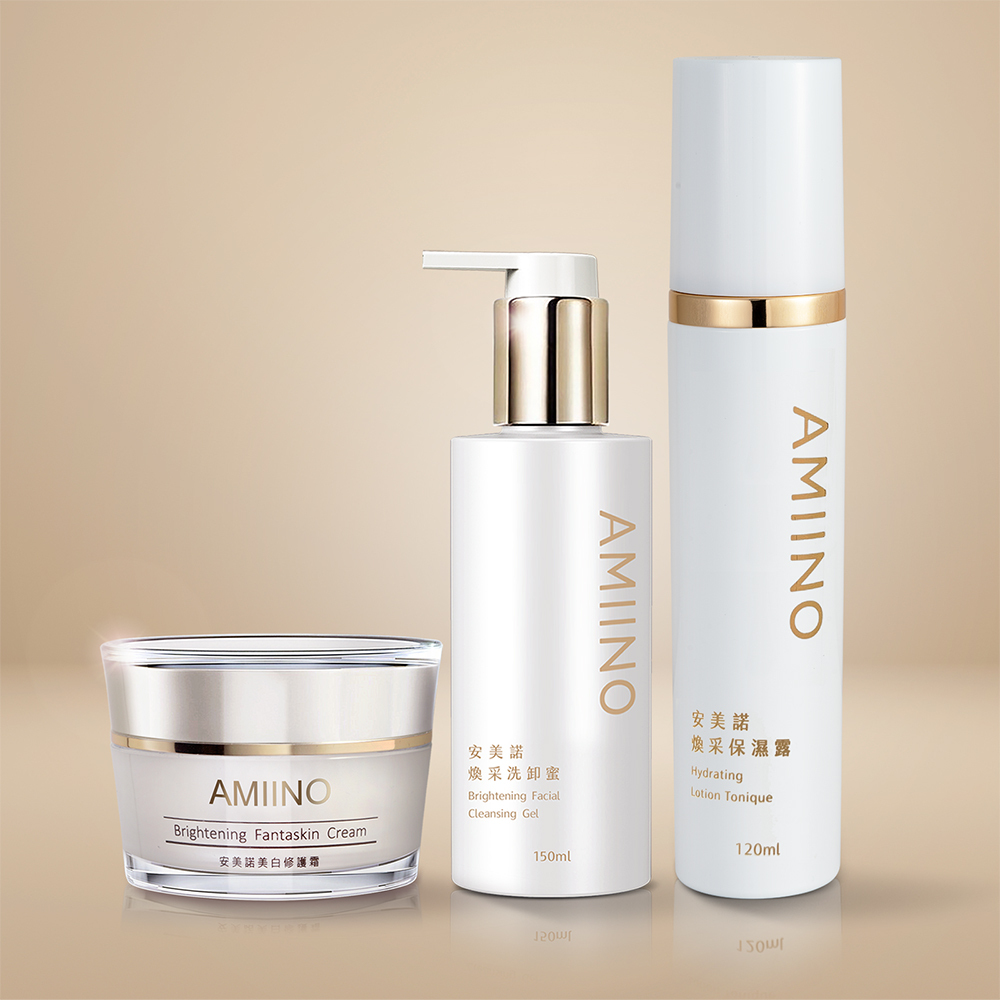

# 小仙女基礎組 5週美白有感

## 完整價格

以下價格為 2026-08-25 官網頁面擷取結果。

| 官方規格 | 官網原價 | 官網售價 | 相較原價 | 販售狀態 |
|---|---:|---:|---:|---|
| 小仙女基礎組 | NT$8,460 | NT$4,980 | 41% | 官網販售中 |

## 官網商品簡介

丨戀戀七夕丨
下單贈｜外泌體抗老精萃 共2mL
指定組合，滿額贈好禮
期間限定只在這次情人節

蘇晏霈精選仙女套組：

。美白修護霜1入30mL
。煥采保濕露1入120mL
。煥采洗卸蜜1入150mL

▼撥打免付費專線了解更多▼

※單筆滿$3,000以上，享刷卡分期0利率※

## 官網產品詳細規格

01

**品名**
AMIINO安美諾美白修護霜

**用途**
含有珍珠粉、淨白六胜肽及草本抗老精萃等多種複方精華，經實驗證實有效減少皺紋、斑點、紋理及緊緻毛孔。

**使用方法**
早晚臉部清潔後，可使用化妝水或保濕露進行保濕鎖水，最後步驟取適量之本產品於臉部區域，以指腹輕推塗抹再以輕拍方式讓產品均勻吸收，就能持續維持淨白透亮。

**容量**
30mL

**有效期間**
3年

**保存期限與批號**
標示於包裝上

**保存方法：**
請置於陰涼處，避免高溫或陽光照射。

02

**品名**
AMIINO安美諾煥采洗卸蜜

**用途**
添加珍貴的紫草精萃及胺基酸綿密細緻泡泡能深層淨化毛孔，溫和的配方讓洗後不緊繃，幫助肌膚健康調理，讓肌膚煥然一新。

**使用方法**
將臉部打濕後，取出適量於掌心搓揉起泡，均勻塗抹臉部輕輕按摩後以溫水洗淨。

**容量**
150mL

**有效期間**
3年

**保存期限與批號**
標示於包裝上

**保存方法：**
請置於陰涼處，避免高溫或陽光照射。

03

**品名**
AMIINO安美諾煥采保濕露

**用途**
添加生命之糖－海藻糖，其高效的保濕因子可提高肌膚保水度，使肌膚水潤光澤，並同時鎖水及舒緩肌膚，維持肌膚彈性。

**使用方法**
於清潔臉部後，取適量保濕露於手掌心，輕輕地塗抹於臉部肌膚、頸部，再用指腹輕輕按摩，幫助肌膚加速吸收。

**容量**
120mL

**有效期間**
3年

**保存期限與批號**
標示於包裝上

**保存方法：**
請置於陰涼處，避免高溫或陽光照射。

**安心保障**
本產品已投保富邦產物保險3千萬元

**製造業者：**
美無痕生物科技股份有限公司

**客服專線：**
0800-360-036

**地址：**
新北市板橋區三民路一段212號8樓

## 官網圖文介紹文字

以下內容取自商品描述圖片的官方 alt 文字，依官網順序保留。

- AMIINO 安美諾全系列保養使用步驟，從清潔、保濕、精華到美白修護霜，打造透亮細緻膚觸
- 安美諾美白修護霜熱銷十年媒體實證：獲白冰冰等藝人推薦，並在超級冰冰秀、綜藝大集合等多檔電視節目中獲得高度評價與分享，累積深厚口碑。
- 蘇晏霈與陳美鳳代言並推薦安美諾美白修護霜：榮獲 SNQ 國家品質標章、國家品牌玉山獎及 FG 專家認證等多項殊榮。
- 安美諾美白修護霜多效合一：主打1分鐘完成保養與裸妝，集美白淡斑、保濕抗老及撫平細紋於一瓶，快速打造無瑕素顏肌。
- 安美諾美白修護霜人體實驗數據：經嘉南藥理大學實測，連續使用5週後皺紋減少51.8%、紋理減少39.2%及斑點減少14.5%。
- 安美諾美白修護霜抗老成分解析：添加頂級珍珠粉防止老化，搭配淨白六胜肽改善暗沉，及草本精萃提升肌膚防護力與保水度。

## 來源

- [安美諾官網商品頁](https://www.amiino.com.tw/products/whitening-clean-moisturizing-set)
