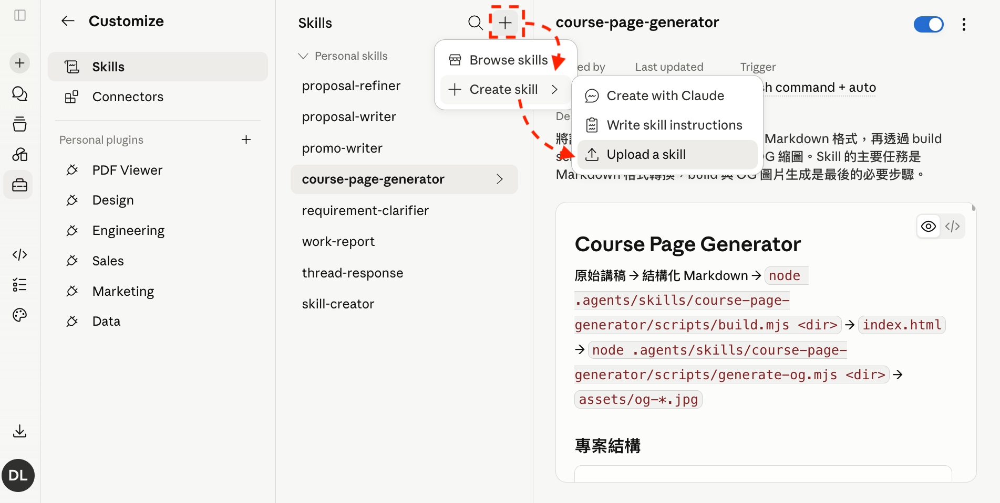
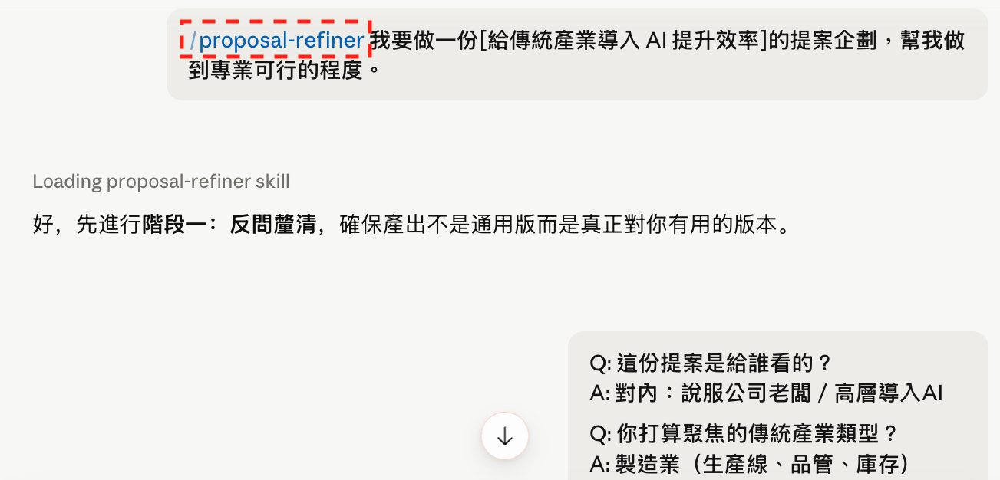
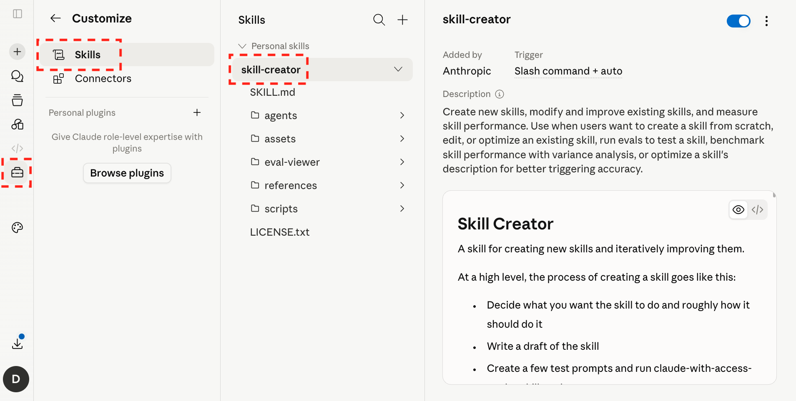
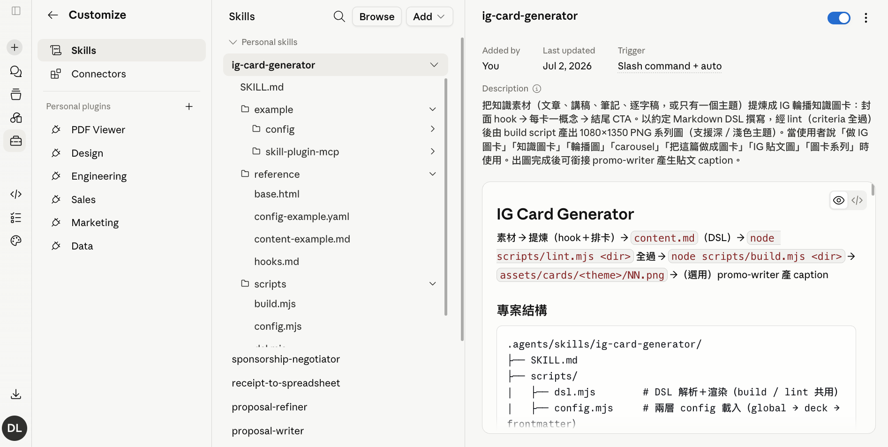
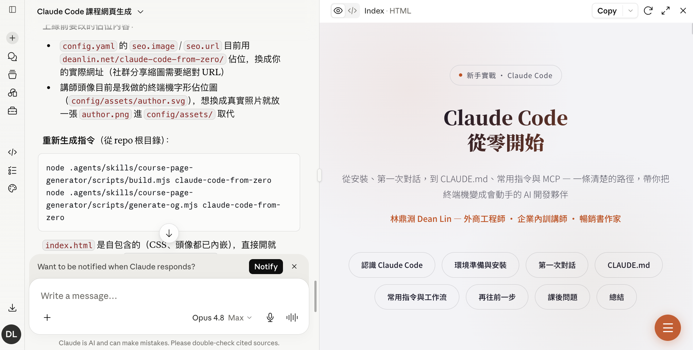

# 🙋 課前回顧：上一堂學了什麼？

> **第一堂建立基礎**
> 而今天我們`開始產出`，每段都會製作一個可以在職場應用的成果。

## 開始前，快速確認三件事

### 💬 你的 AI Agent 已經懂你了嗎？

[image-text position="right" width="50"]

- 個人化設定是否完成？
- **Prompt 技巧應用**：`角色`、`語氣`、`符號`、`格式`、`反問`、`補充`
[/image-text]

### 📚 知識庫有持續累積素材嗎？

[image-text position="right" width="50"]

- Gemini Notebook 的`筆記本`有持續更新嗎？
- ChatGPT 的`專案`開始應用了嗎？
[/image-text]

### 🌀 還記得 AI 的能力範圍嗎？

- **AI 的答案不一定正確**：快是 AI 的本事，對是你的責任
- 今天產出的每一份文案與簡報，都要人工把關


### 🧳 這堂課會帶走的五樣成果

[flow]
1. 企劃大綱 — 七步驟打磨出一份能上台的 Markdown 大綱
2. 技能包 — 把對話打包成 Skill，換個主題一鍵重現
3. Gamma 簡報 — 貼上大綱，快速生成圖文並茂的線上簡報
4. 用模板生成簡報 — 請 ChatGPT／Claude 透過簡報模板生成
5. 封面／流程圖 — 同一段 Prompt，ChatGPT 與 Gemini 的生成結果
[/flow]

---

# AI Agent 進階技巧：七步驟打磨提案企劃

> **最沒效率的事，就是高效率地做根本不該做的事**
> AI 讓「做」變得飛快，於是「想清楚要做什麼」變得更值錢。

## 七步驟打磨提案企劃

### [ChatGPT] 請使用「工作」模式(付費)


### [Gemini] 請使用「Spark」模式(付費)


### [Claude] 一般對話即可(免費)


### 🧭 七步驟總覽

> **下面以 ChatGPT 作為示範，大家請根據自己使用的工具調整（Gemini/Claude）**

[flow]
1. 優化提示詞 — 先讓 AI 把一句話需求，改寫成更精確的 Prompt
2. 讓 AI 反問 — 別急著送出，先讓 AI 列出還沒想清楚的地方
3. 補齊資訊 — 扮演產業顧問，把反問的問題一一補齊
4. 利害關係人 — 從決策者、使用者的角度重新檢視企劃
5. 彙整生成企劃 — 整合利害關係人的顧慮，產出第一版
6. 扮演對手挑毛病 — 紅藍隊攻防，讓競爭者（必要時加高層）來挑戰
7. 生成最終版本 — 整合所有建議，輸出可直接貼進 Gamma 的 Markdown 大綱
[/flow]

> **為什麼要這麼多步？**
> 一句「幫我寫企劃」，AI 給你的是網路上千篇一律的`平均值`；而七步驟走完，你拿到的是**考量過利害關係人、還沒上台就先被競爭者挑過毛病的版本**。

#### STEP 1：優化提示詞

- **讓 AI 協助聚焦**：先簡單說明想完成的目標，讓 AI 幫你把 Prompt 寫得更精確

```prompt [label="先簡單說明背景，讓 AI 優化提示詞"]
我準備製作一個[給台灣新創行銷公司導入 AI]的提案企劃

以上面的 Prompt 為基礎，我要提供怎麼樣的 Prompt 可以得到較好回答？
請說明為什麼，並在最後舉出能得到專業回覆的 Prompt 範例。
```

#### STEP 2：讓 AI 反問

- **開新視窗**：提示詞已經優化過一次，但往往還有沒考慮到的地方，先別急著送出
— **換角色審視**：讓 AI 先當提問者，逼自己把模糊的地方想清楚

```prompt [label="讓 AI 主動反問，而不是直接生成"]
```
[開新視窗貼上 STEP 1 得到的提示詞]
```
在用這個 Prompt[撰寫提案企劃前]有任何問題，請先詢問我，不要直接產生。
```

#### STEP 3：補齊資訊

- **建議自行填寫**：AI 反問列出的問題，建議自己親自填寫才會得到自己需要的答案
- **讓 AI 自問自答**：如果不知道如何寫，可以讓 AI 扮演「產業顧問」角色自問自答

```prompt [label="扮演產業顧問，補齊反問的資訊"]
請扮演對這個領域非常熟悉的[產業顧問]，針對提出的問題給出具體詳細的回覆、不要逃避問題。
```

#### STEP 4：利害關係人

- **不能只有一個視角**：一份企劃能不能過，不能只考量到自己
- **過去這些都需要市場調查**：AI 可以拓展思路，讓我們從不同面向看問題

```prompt [label="從利害關係人角度檢視企劃"]
請分析這份企劃最重要的[3]個利害關係人，從他們的角度和利益出發，詳細說明對這份企劃有哪些具體的[意見、建議、憂慮]？
```

#### STEP 5：彙整建議生成企劃

- **彙整資訊**：把利害關係人的顧慮整合進來，產出第一版企劃

```prompt [label="彙整利害關係人想法，生成初版企劃"]
請扮演[提案企劃]的專家，了解[利害關係人]的想法後，以最專業的角度在企劃補充更完善、可行的方案。
```

#### STEP 6：扮演對手挑毛病

> **用紅藍隊概念攻防**

- **主管老闆來挑錯誤**：看似圓滿的企劃往往還有許多細節不夠清晰，讓高層來挑毛病吧！
- **競爭對手來協助優化**：在優化這一塊，可以嘗試從競爭對手角度思考，可以有更完善的觀點

```prompt [label="紅隊：讓競爭者（與高層）挑戰企劃"]
請扮演審閱這份提案企劃的[公司高層]，請盡可能列出這份企劃的不足之處。
接著從提案企劃的[競爭者]角度，盡可能列出更完善、可行的方案。
```

#### STEP 7：生成最終版本

- **整合觀點後先出大綱的好處**
  - 可以讓我們`快速確認方向`，有問題可以即時調整
  - 減少`AI 額度消耗、等待時間`，因為完整的企劃可能需要 10~20 分鐘才能完成
- **為什麼指定 Markdown 格式？**
  - 因為`結構清晰`，後面可以直接丟給 Gamma 生成簡報

```prompt [label="整合建議，生成最終版本"]
請扮演[提案企劃]的專家，在了解[不足之處、更完善的方案後]後，以最專業的角度，重新完善這份企劃。

僅需呈現[主標題、次標題、簡述中要涵蓋關鍵數據、可使用列點呈現]，在 Code Block 中以 Markdown 格式呈現，以 10 頁簡報來設計。

等我確認方向都沒問題後，再生成完整企劃
```


[warning title="小提醒"]
- **ChatGPT**：[對話連結](https://chatgpt.com/share/6a8a7214-9940-83e8-8520-b620bc063b03)
AI 未必會採納所有建議，且可能會自動移除有用的內容，你還是需要自己審視一遍
[/warning]

### 📝 Markdown 簡介

> **結構明確**
> 是為了確保資料格式層級——`#` 是大標題、`-` 是列點，AI 與人都能一眼看懂結構。

```prompt [label="Markdown 基本語法"]
# 大標題 h1

#### 小標題 h4

這邊就是描述的內容，你可以區分層級:
- 文字的格式
  - **粗體**
  - *斜體*
  - ~~刪節線~~

> 引用的寫法

表格適合拿來做比較：

| 項目 | 說明 | 備註 |
|------|------|------|
| 標題 | `#` 控制層級 | 數字越多層級越低 |
| 列點 | `-` 開頭 | 縮排可做巢狀 |
| 引用 | `>` 開頭 | 用來補充說明 |
```


[lab-session title="實戰演練" duration="15 分鐘" hint="有問題歡迎提出，你的問題可能是大家的問題"]
- STEP 1：想一個與工作相關的企劃主題
- STEP 2：跑完七步驟，拿到 Markdown 大綱
- STEP 3：先別關視窗，接下來要把它轉換成可重複使用的 Skill
[/lab-session]

---

# Skill 篇：把流程打包成 Skill，換個主題一鍵重現

> **把聊天的成果，轉換成可重複使用的資產**
> 在 AI 完成任務後把視窗關閉太可惜了，你中間引導他如何優化的部分才是最珍貴的資產。
> 這些細節都能成為技能的養分，讓我們下次不用從零開始。

## 為什麼要打包成 Skill？

[warning title="目前僅 Claude 的 Skill 可以免費體驗"]
- ChatGPT、Gemini 免費版目前看不到、也不能建立 Skill
- 沒有付費的同學，可以透過 [Claude](https://claude.ai/) 嘗試
[/warning]

### 🤯 流程都在某個人腦袋裡

[flow]
- **關鍵人物不在，流程就卡死** - 「這份文案怎麼寫？系統怎麼設計的？專案下一步該做什麼？」如果答案全在某個`資深同事`的腦袋；他一請假、離職，這一切就需要`重新摸索`。
- **交接靠口耳相傳，品質全憑運氣** - 新人上工時，只拿到`零散筆記`和`口頭經驗`；因此報告、信件、文案……每個人的`格式、品質`都不一樣。
- **需要手把手教學，難以擴散** - 許多流程需要`實際 Demo`才能搞懂，因此就算有好方案也`擴散不出去`，案例難以複製到不同部門。
[/flow]

### 📋 提示詞一直複製貼上

[flow]
- **存了一堆 Prompt，要用時翻半天** - 提示詞散落在`記事本、Notion、聊天記錄`；真的需要使用時，光是找出`最後一版`就浪費一堆時間。
- **換個情境就得調整提示詞參數** - 同一套文案 Prompt，換個品項、從 IG 改到 EDM 就得`手動微調`，浪費時間。
- **規則改了，舊版本卻沒跟著改** - 新增一個`禁用詞`、調整了`品牌語氣`，但同樣的 Prompt 已經`被複製到十個地方`；漏改一處，錯的版本就`默默繼續產出`。
[/flow]

> **Skill 是把你最好的一次，變成每一次**
> 你摸索出最順的流程後，只要成功過一次，就能把它設計成 Skill，未來就不用從零開始。

### 📝 Skill 就像公司的 SOP 手冊

- Skill 在完成後，是可以`下載與分享`的
- 即使是**剛接觸業務的新人**，使用前輩設計好的 Skill 也能`做出符合公司期待的成果`

> **Project 放知識，Skill 設計流程**
> **Project 讓 AI「知道事實」** — 你扮演的角色、品牌規範、產品資訊、專案細節
> **Skill 讓 AI「知道步驟」** — 文案、月報、信件、企劃、簡報要遵守的 SOP

## [ChatGPT] 把剛剛的對話打包成 Skill

### 🧰 把對話變成技能包

#### STEP 1：將對話流程轉換成 Skill

```prompt [label="請 AI 把對話萃取成 Skill"]
請根據以下要求分析上方對話內容後，整理成可重複使用的 Skill，名稱為[proposal-refiner-exmaple]：

1. 起初怎麼提問
2. 中間如何引導與調整
3. 最終是如何得出這個成果的
```


#### STEP 2：確認 Skill有順利儲存

- 點擊側邊欄`外掛程式`，選擇`技能`


#### STEP 3：換個主題驗證

開啟新對話窗來驗證技能

```prompt [label="用不同主題驗證 Skill"]
/proposal-refiner-exmaple 我要做一份[給連鎖餐飲品牌導入 AI 點餐分析]的提案企劃，幫我做到專業可行的程度。
```


#### STEP 4：下載技能包

- 點擊側邊欄`外掛程式`，選擇`技能`
- 選擇指定技能後，點擊右側「...」選擇下載
- 會獲得一個 `ZIP` 格式的檔案，可以分享給別人使用


## [Gemini] 把剛剛的對話打包成 Skill

### 🧰 把對話變成技能包

#### STEP 1：將對話流程轉換成 Skill

```prompt [label="請 AI 把對話萃取成 Skill"]
請根據以下要求分析上方對話內容後，整理成可重複使用的 Skill，名稱為[proposal-refiner-exmaple]：

1. 起初怎麼提問
2. 中間如何引導與調整
3. 最終是如何得出這個成果的
```


#### STEP 2：確認 Skill有順利儲存

- 點擊側邊欄`技能`


#### STEP 3：換個主題驗證

```prompt [label="用不同主題驗證 Skill"]
/proposal-refiner-exmaple 我要做一份[給服務業導入 AI 客服]的提案企劃，幫我做到專業可行的程度。
```


#### STEP 4：下載技能包

- 點擊側邊欄`技能`
- 選擇指定技能後，點擊右側「...」選擇下載
- 會獲得一個 `ZIP` 格式的檔案，可以分享給別人使用


## [Claude] 把剛剛的對話打包成 Skill

### 🧰 把對話變成技能包

#### STEP 1：將對話流程轉換成 Skill

```prompt [label="請 AI 把對話萃取成 Skill"]
請根據以下要求分析上方對話內容後，整理成可重複使用的 Skill，名稱為[proposal-refiner-exmaple]：

1. 起初怎麼提問
2. 中間如何引導與調整
3. 最終是如何得出這個成果的
```


#### STEP 2：點擊「Save skill」直接儲存

- 要點擊「Save skill」才會儲存


#### STEP 3：確認 Skill有順利儲存

- 點擊左下側頭像，選擇`Setting`
- 點擊側邊欄`Skills`


#### STEP 4：換個主題驗證

```prompt [label="用不同主題驗證 Skill"]
/proposal-refiner-exmaple 我要做一份[給連鎖餐飲品牌導入 AI 點餐分析]的提案企劃，幫我做到專業可行的程度。
```


#### STEP 4：下載技能包

- 點擊左下側頭像，選擇`Setting`
- 點擊側邊欄`Skills`
- 選擇`proposal-refiner-exmaple`
- 點擊右側「...」選擇下載
- 會獲得一個 `Skill` 格式的檔案，可以分享給別人使用


## 同一個技能包，帶到 Gemini 與 Claude 重現

> **技能包打開來，其實只是一份文字檔**
> Skill 是開放格式，本體就是一份 `SKILL.md`——不管用哪個平台建立，都可以匯出、匯入到別的平台繼續用。

[download file="assets/proposal-refiner.skill" label="下載「proposal-refiner」技能包" desc="前一章七步驟對話打包成的 Skill；沒有跟著打包的同學直接用這份"]

### [Gemini] 上傳技能包並重現

- 進到設定裡的技能相關頁面，選擇上傳，把下載好的技能包匯入


```prompt [label="用不同主題驗證 Skill"]
/proposal-refiner 我要做一份[給製造業導入 AI 品檢]的提案企劃，幫我做到專業可行的程度。
```


### [Claude] 上傳技能包並重現

- 前置設定：Settings → Privacy 關閉 Help improve Claude


- 步驟：Customize → Skills → Create skill → Upload a skill




```prompt [label="用不同主題驗證 Skill"]
/proposal-refiner 我要做一份[給傳統產業導入 AI 提升效率]的提案企劃，幫我做到專業可行的程度。
```



### 🔓 Skill 不綁平台

- 今天在 ChatGPT 打磨的七步驟，明天在 Gemini、Claude 一樣能用
- 交接給同事，也只是傳一個檔案——不用再口頭解釋一遍流程

> **你打磨出來的流程是自己的資產，換工具也帶得走**
> 工具會換、方案會漲價，但流程是你的——這才是值得累積的東西。

## 第二個案例：讓 AI 讀過去的對話，幫你寫工作報告

> **AI 其實看得到你的對話紀錄**
> 不管 ChatGPT、Gemini、Claude，都能讀取目前對話（以及 Project 內）的脈絡——所以可以設計一個 Skill，把一整天跟 AI 討論的東西整理成日報／週報。

### 🆚 兩條路建立 Skill

| 建立方式 | 適合情境 |
| --- | --- |
| 把流程轉成 Skill（直接描述需求） | 流程已經想清楚，但還沒實際跑過——直接用白話文描述輸入輸出 |
| 從對話生成 Skill（先做一次，再請 AI 萃取） | 已經跟 AI 來回打磨出理想結果——讓 AI 回頭萃取這次的引導過程 |

- 上一節（proposal-refiner）示範的是後者，這一節示範前者

### 📝 用白話描述需求建立 work-report Skill

- Skill `不需要`全程自己`手動建立`，可以先透過 `skill-creator` 來生成
- 三個平台都用同樣的描述即可，這裡用 Claude 示範



```prompt [label="提供自己期待格式，而非讓 AI 自由發想"]
/skill-creator
我想要建立一個 Skill: [work-report]
會根據我與 AI 的對話紀錄，整理成適合給主管閱讀的「日報 / 週報 / 月報」
產出前請先取得當下時間，並依需求判斷報告週期；若未指定，預設產生[日報]
若在專案中執行，請嘗試判斷[專案名稱，並顯示在報告最上方]
報告重點請聚焦：[完成事項、推進進度、重要決策、問題風險、下一步行動]，並遵循下面規則：
- 避免流水帳，整理成能快速理解的工作進度
- 不誇大成果，不要把未完成事項寫成已完成，也不要編造對話中沒有的內容
- 請使用繁體中文，語氣專業、務實、清楚。
- 直接輸出報告，不需要額外解釋
```


> **個人心得**
> AI 設計的 Skill 有時會有`過度設計、冗贅資訊`的問題，可以根據實戰結果`調整細節、資料夾結構`。

### ✅ 驗證：被動觸發 vs 主動觸發

- Skill 建立完成後，有 2 種方式觸發：
  - **用「意圖、關鍵字」觸發**：盡可能設計成`被動觸發`，因為 Skill 會越來越多，要記住每個名稱並不現實
  - **輸入「/skill-name」指定觸發**：當然也可以`主動觸發`，當一段對話中想綜合多個 Skills 功能時，這個方案較為穩定

```prompt [label="在 Chat 開新對話測試"]
生成週報
```


> **Claude 的 Chats 跟 Projects 的記憶是分開的**
> 如果想要取得特定 Project 記憶，就需要進去操作。

```prompt [label="選一個 Project 開新對話測試"]
/work-report
```


### 🔧 修改 Skill 前先備份

- 更新技能包會直接覆蓋掉舊版本；有時新版反而沒有舊版好用，建議更新前先下載備份


- 備份完直接用白話說出想調整的地方（ex: 「我希望 work-report 的週報多一個『下週優先事項』區塊」），確認方向沒問題再「Save skill」，然後開新對話驗證


[lab-session title="實戰演練" duration="15 分鐘" hint="有問題歡迎提出，你的問題可能是大家的問題"]
- STEP 1：照自己平台的分頁，把七步驟對話打包成 Skill（免費的同學可用 Claude）；或直接上傳講義提供的技能包
- STEP 2：換一個主題驗證
- STEP 3：用白話描述建立 work-report Skill，輸入「生成日報」驗證
[/lab-session]

## 匯入別人的 Skill，站在更高的起點

> **別人驗證過的流程，也能直接裝進來用**
> 網路上有很多人分享自己建立好的 Skill，這裡拿講師自己兩個開源 Skill 做示範——操作方式跟前面「同一個技能包，帶到 Gemini 與 Claude 重現」完全相同。

### 🖼️ ig-card-generator：把文案變成 IG 輪播圖卡

[download file="assets/ig-card-generator.zip" label="下載「.zip」範例包" desc="提供文案生成 IG 圖卡"]



```prompt [label="提供一段文案，生成 IG 格式圖卡"]
/ig-card-generator
【用 AI 寫程式，卻覺得沒有比較快？】

上個月企業內訓時，在課前有位工程師跟我說：「我每天都在用 AI 寫程式，但說實話，效率好像沒什麼提升。」

因此我請他示範平常的用法。

他先打開 ChatGPT、把需求貼上去、等回覆、複製回 VS Code、跑起來報錯、再把錯誤訊息貼回去問。

…（貼上完整文案）
```


- GitHub 來源：https://github.com/dean9703111/ig-card-generator

### 📝 course-page-generator：輸入主題生成線上講義

[download file="assets/course-page-generator.zip" label="下載「.zip」範例包" desc="輸入主題生成線上講義"]


```prompt [label="輸入主題/草稿生成 HTML 講義"]
/course-page-generator 幫我做一份「Claude Code 從零開始」的課程網頁
```



[bonus title="🎁 製作心得"]
這個課程網頁的製作，走過了一段從「結果不可控」到「完全掌控」的歷程。

1. **遇到痛點** — Vibe Coding 出來的網頁，調整內容都要改 HTML，非常不方便
2. **逆推結構** — 讓 AI 把現有網頁拆解，對應成一套可用 Markdown 撰寫的格式
3. **內容與版型分離** — 只需改 Markdown，自動套用對應版型，細節完全可控
4. **設計 Agent Skill** — 不是讓 AI 生成網頁，而是讓 AI 學會「這份 Markdown 怎麼寫」
5. **模板生成器思維** — AI 負責生成結構化內容，程式再把內容轉成最終網頁
[/bonus]

[warning title="⚠️ 這類複雜 Skill 很吃額度"]
在聊天視窗執行 Token 消耗極快、容易中斷；這兩個 Skill 原本是設計給程式碼編輯器（Claude Code 這類 AI Agent）使用，體驗好很多。記得把 Skill 裡的資訊（帳號、品牌）調整成自己的。
[/warning]

[lab-session title="實戰演練" duration="10 分鐘" hint="有問題歡迎提出，你的問題可能是大家的問題"]
- STEP 1：匯入 ig-card-generator，貼一段自己的文案生成圖卡
- STEP 2（選做）：匯入 course-page-generator，生成一份講義
- STEP 3：觀察 Skill 有沒有被正確觸發、輸出哪裡不符預期
[/lab-session]

### 🛡️ 匯入第三方 Skill 的資安風險

- 風險①：`SKILL.md` 可能被寫入危險指令——例如偷偷把個人資訊傳到某個網址，造成隱私外洩
- 風險②：Skill 常帶`程式腳本（Script）`，腳本一樣有機會被動手腳、操作你的檔案
- 判斷原則：看發佈者是否可信、專案的 Star 數，作為初步篩選

### 🎒 Skill 的結構與三個執行階段

[html src="html/skill-anatomy.html"]

[flow]
1. Discovery（發現）：AI 讀取技能名稱與描述，判斷是否與任務相關
2. Activation（啟動）：匹配成功後，才完整讀取整份 Skill 文件
3. Execution（執行）：根據文件描述逐步執行任務
[/flow]

> **Skill 為什麼能節省 Token？**
> Rule 每次都會讀完整文件；Skill 在匹配需求前`只讀標題與描述（Metadata）`。
> 就像 Google 搜尋時先看標題摘要，確認相關再點進去。

### 🧩 Skill 不是越多越好

- **描述要寫清楚使用時機**：想讓 Skill 被動觸發，「描述」不能只寫功能，要寫清楚使用時機與關鍵字——不然遇到類似情境也未必觸發
- **同類型別裝兩個以上**：命中時常常一起觸發，不只多耗 Token，也容易讓 AI 卡住或走偏——`1 + 1 不一定大於 2`，同類型建議擇優安裝一個
- **看起來有用不代表真的有用**：網路上很多 Skill 描述寫得很厲害，實測效果卻不穩定——安裝前先測試，選最符合需求的一個，再持續優化

> **最珍貴的不是別人的 Prompt，而是你打磨成果的流程**
> 網路上的 Prompt 跟 Skill 資源很多，但要能轉化成匹配自己工作流的技能，價值才有辦法持續累積。

---

# Gamma 簡報篇：把七步驟產出的大綱一鍵變簡報

> 把第一章（或 Skill）產出的 Markdown 大綱貼進 Gamma，幾秒鐘就變成圖文並茂的簡報——排版交給模板，美編交給 AI，你只需要專注在內容本身。

## 為什麼選 Gamma？

### 🎯 Gamma 的三個優勢

- **吃 Markdown 結構**：`#`／`-` 這類層級直接對應成頁面與列點，不用重新排版
- **AI 排版＋配圖**：套版型、挑圖片、抓對齊，一次到位
- **產出是網頁**：可直接分享連結，也能匯出成 PPT、PDF

### 🎟️ 用推薦連結多拿 200 Credits

- **註冊連結**：https://gamma.app/signup?r=xxndt061vudg1pr
- 🎉 使用這個註冊連結可以多獲得 **200 Credits** 🎉
- 注意：Gamma 的每個 AI 功能都會消耗 Credits


## 用「貼上文字」方式生成簡報

### 📋 五步驟從大綱到成品

#### STEP 1：選擇「貼上文字」


#### STEP 2：貼上 ChatGPT 生成的簡報大綱

- 把第一章七步驟（或 proposal-refiner Skill）產出的 Markdown 大綱整份貼上


#### STEP 3：選擇處理方案

- 使用默認的「從備註或大綱生成」，讓 AI 有一定程度的自由發揮


#### STEP 4：調整簡報細節

- **文字內容**：建議選擇「生成」或是「保留」
- **主題**：會影響到 AI 圖片生成風格
- **圖片**：建議選擇「AI 圖片」避免版權問題


#### STEP 5：檢視簡報

- 稍等幾秒鐘，簡報就會順利生成


[lab-session title="實戰演練" duration="10 分鐘" hint="有問題歡迎提出，你的問題可能是大家的問題"]
- STEP 1：把七步驟產出的 Markdown 貼進 Gamma 生成簡報
- STEP 2：換一兩個模板，看看差異
[/lab-session]

## 調整圖片、卡片結構與圖表的技巧

### 🖼️ 更新圖片

- 先回 ChatGPT，一次幫每一頁產生英文配圖描述，再逐頁貼進 Gamma 生圖

```prompt [label="為每頁簡報產生配圖描述"]
請扮演一位擅長用簡報圖片說故事的講者，你在了解每一頁簡報要表達的意思後（## 表示一頁），用英文描述適合搭配簡報的圖片，用陳述句具體的表達，圖片中不要包含任何文字，並在最後附上中文讓我參考。
下面是簡報內容：

``` [Markdown 文件] ```
```

- 在 Gamma 中生成圖片三步驟：
  1. 貼上 Prompt（ex: A panoramic view of Taiwanese farmland under different weather conditions...）
  2. 選擇風格、數量、長寬比、模型
  3. 點擊生成

[gallery]


[/gallery]

### 🧱 換卡片結構

- **看圖選模板**：直接瀏覽視覺效果來挑選
- **模板可調參數**：欄位寬度、圖片大小、圖片形狀、對齊方式（不同模板間會有差異）


- **巢狀卡片**：將相同主題小卡濃縮到單張簡報，列點太多導致重點混亂時使用；ex: 把「聊出需求規格書的技巧」的細節收進子卡

[warning title="⚠️ 建議不要設計一層以上的巢狀卡片"]
- 層級太深，觀眾（和你自己）都會迷路
[/warning]

- **內容折疊（切換按鈕）**：目錄大綱、FAQ、長 Prompt 都適合收進折疊區塊，需要時再展開
- **註腳**：滑鼠移過去才顯示的補充說明，適合放定義、來源
- ex: 講師把「個人公仔盒裝圖」的超長生成 Prompt 收進折疊區，簡報乾淨、細節不丟

[gallery]


[/gallery]

### 📊 生成智慧圖表

- 貼上文字，選擇「將這段文字視覺化」
- **靶心圖表**：呈現「核心–中層–外部」的關係，適合政策、產業鏈與外部環境
- **想法圖表**：集中呈現一個主題下的多個解決方案或策略方向
- **象限圖表**：將資料依照兩個維度分類，幫助比較與決策
- **冰山圖表**：顯示「可見因素」與「隱藏因素」的結構，幫助全面思考


### 🧩 逐段生成列點、表格與逐字稿

- 大綱只有標題與簡述，每一頁的細節回 ChatGPT「指定段落」生成，再貼回 Gamma

#### STEP 1：指定段落來生成細節

```prompt [label="指定段落生成簡報逐字稿"]
請你扮演[擅長透過白話傳達資訊]的簡報達人，將[1. 前言與企劃目標]的內容，轉換成適合直接上台使用的簡報逐字稿。

輸出要求：
1. 步驟、案例 → 用[列點]呈現，條列清楚且簡短。
2. 若內容涉及比較 → 使用[表格]呈現，表格第一欄為比較項目，其餘欄為對應差異。
3. 最終輸出要包含「可以直接朗讀」的逐字稿，語氣口語化、易懂，避免艱澀專業用語。
4. 請保留邏輯順序，讓聽眾聽完就能馬上明白「為何要做、要達成什麼」。
```


#### STEP 2：「編輯訊息」生成新的段落

- 完成後點擊「編輯訊息」，把段落名稱換掉再「傳送」——不用重打整段 Prompt


### ✍️ 文字交給 ChatGPT 改

- **用 AI 編輯內容（不建議）**：文字重寫／擴增／縮寫、透過文字搜尋圖片、根據文字建議模板——AI 會自行增減文字、每次操作也都消耗 Credits，文字調整建議回 ChatGPT 改好再貼回來

```prompt [label="請 ChatGPT 為單頁補充內容"]
請扮演熟悉[提案企劃]的專家，根據下面的[提案]設計對應的[資源整合可行性]，內容請簡潔扼要，並以表格呈現。

``` [貼上提案企劃] ```
```

```prompt [label="濃縮文字"]
請擔任專業的[文案寫手]，幫我[濃縮]下面的文字。

``` [想要調整的文字] ```
```

> **Gamma 自己也有 AI，為什麼還要回 ChatGPT？**
> Gamma 的 AI 擅長排版，不擅長琢磨文字——內容的增刪與語氣調整，交給 ChatGPT 處理完再貼回來，各司其職。

## Gamma 是網頁，跟傳統簡報比有什麼不一樣？

### 🆚 網頁式簡報 vs 傳統簡報

| 網頁式簡報（Gamma） | 傳統簡報 |
| --- | --- |
| 高度不受限制 | 一頁一個固定尺寸 |
| 內建 Spotlight 簡報動畫（快捷鍵 `S`） | 需要另外設計轉場動畫 |
| 手機、平板可以直接展示 | 通常需要投影設備 |
| 可在簡報內直接觀看外部資源（Figma、Google Docs、Miro） | 只能貼截圖或連結 |
| 簡報模式下也能點右鍵直接修改內容 | 要離開播放模式才能改 |
| 用連結分享、可設定權限控管 | 需要傳送檔案 |
| 可匯出成 PPT、PDF | 本身就是檔案 |


[lab-session title="實戰演練" duration="15 分鐘" hint="有問題歡迎提出，你的問題可能是大家的問題"]
- STEP 1：把一段文字視覺化成智慧圖表
- STEP 2：更新一張圖片（Gamma 生圖，或貼上 ChatGPT 產生的圖片 Prompt）
- STEP 3：換一張卡片的結構（巢狀／折疊／註腳）
[/lab-session]

> **美感可以外包，品味不能**
> AI 可以一口氣生一百張圖，但哪一張「對」，還是要你來挑——挑選的眼光，才是你的護城河。

---

# AI 直接生成簡報篇：漂亮但不可編輯，還是可編輯但要調？

> 不經 Gamma，直接請 ChatGPT／Claude 生成簡報——兩種做法的產出本質不同，要先搞清楚拿到的是圖片還是可以編輯的檔案。

## [ChatGPT] 直接生成簡報

### 🎞️ 兩步驟看清楚產出的本質

#### STEP 1：提供內容，請 AI 設計簡報

```prompt [label="請 ChatGPT 依內容設計簡報"]
你擅長資訊表達，根據下面的內容，設計出對應風格的簡報。

要求：
- 每頁一個重點，標題＋三個列點
- 整體風格一致

[貼上內容]
```


#### STEP 2：看清楚你拿到的是什麼

[warning title="⚠️ 這樣生成的簡報，本質是一張張圖片"]
文字改不了、圖表動不了，適合當靈感或一次性展示，不適合要持續修改的正式簡報。
[/warning]


## [ChatGPT] 上傳公司模板，讓 AI 照版型填內容

### 🧩 先套版型，穩定後再打包成 Skill

- 情境：公司有固定的 PPT 模板，希望 AI 照版型把內容填進去，而不是重新設計一套風格

```prompt [label="上傳模板，請 AI 照版型填入內容"]
（先上傳公司的 PPT 模板檔）

請分析這份模板的版型規則（封面、章節頁、內容頁的配色、字級、版面），然後把下面的內容依照版型填入，輸出可下載的 PPT 檔：

[貼上內容]
```

- 流程穩定後，同樣可以打包成 Skill——把模板規則寫進 Skill，之後每次只要貼內容

```prompt [label="把套模板流程打包成 Skill"]
請根據以下要求分析上方對話內容後，整理成可重複使用的 Skill，名稱為[pptx-template-filler]：

1. 模板的版型規則是如何被分析出來的
2. 內容如何依照版型填入
3. 最終如何輸出可下載的 PPT 檔
```


## [Claude] 用 Skill 生成可編輯的簡報

### 🖥️ 兩步驟產出可編輯簡報

#### STEP 1：提供文件、內容，請 AI 製作簡報

```prompt [label="請 Claude 依內容生成簡報"]
你擅長資訊表達，根據下面的內容，設計出對應風格的簡報

[貼上內容]
```

- 如果他沒有給你下載連結，可以直接說「給我 PPT 下載連結」


#### STEP 2：簡報是可以下載編輯的

- [參考連結](https://claude.ai/share/788eac26-e952-44b5-a473-f8b6e66ab9b5)


- Claude 一樣可以上傳公司模板，請它照版型輸出——做法與 ChatGPT 相同，上傳模板檔＋描述版型規則即可

### 🧰 從 Skill 商店挑現成的用

- Customize → Browse skills，直接瀏覽別人做好的 Skill

[image-text position="right" width="30"]

- **canvas-design**：設計海報圖片（[實測範例](https://claude.ai/share/dad80a0b-7010-4a31-a18f-5389be889fe3)）
- 提供行程資訊（集合出發 → 彩虹眷村 → 審計新村 → 新社園區 → 高美濕地 → 晚餐回程），就能得到右側的成品
- 現成 Skill 很多，但大部分不如預期——安裝前先看評價、裝完先小規模實測
[/image-text]

## 三種生成方式，怎麼選？

### 🆚 三種生成簡報方式比較

| 方式 | 產出形式 | 可編輯性 | 美觀度 | 成本 | 適合情境 |
| --- | --- | --- | --- | --- | --- |
| Gamma | 網頁 | 高（卡片、結構皆可調） | 高 | 消耗 Credits | 要持續修改、要分享連結的正式簡報 |
| ChatGPT 直接生成 | 圖片 | 幾乎不可編輯 | 高 | 低 | 找靈感、一次性展示 |
| Claude Skill | PPTX | 可下載後編輯 | 中 | 中 | 需要交出檔案、後續要在 PowerPoint 微調 |

[bonus title="🎁 Bonus：目前生成簡報最強的 Manus"]
在生成簡報的領域，目前 Manus 的表現最好，結合了 Nano Banana 的美觀 + Claude 的編輯性。

- 透過[邀請連結註冊](https://manus.im/invitation/9EZQALE1FISTXZP?utm_source=invitation&utm_medium=social&utm_campaign=copy_link)，會多獲得 **500 點數**
- 操作方式一樣：「你擅長資訊表達，根據下面的內容，設計出對應風格的簡報 [貼上內容]」
- 產出的簡報最詳盡、美觀、可編輯（[成果範例](https://manus.im/share/In3zMOYuTs3iYqrFUUVwlg)）
- 但相對成本最高——範例中的簡報花了 `652 點`
[/bonus]

---

# 生成圖片篇：相同 Prompt，不同 AI 給你不同答案

> 簡報封面、活動海報——同一段 Prompt 分別丟給 ChatGPT 與 Gemini，看結果差在哪，再學「給參考圖」讓結果可控。

## 同一段 Prompt，兩個 AI 各生一次

### 🖼️ 本節共用的 Prompt

```prompt [label="根據底圖生成簡報封面"]
請扮演簡報設計師，在了解文案要傳遞的資訊後，根據這張圖生成有高級感的簡報封面。
文案如下：
[貼上文案]
```

```prompt [label="根據活動內容生成海報"]
根據活動內容設計出有質感的海報：
- 背景圖：需符合活動主題，可以有漸層轉換效果
- 文字排版：使用清晰無襯線字體，注重黑白對比來強調層次，並用網格佈局來對齊
- 整體畫面：適當保持留白，文字不要擋住關鍵區域

活動內容：
- 主題：
- 時間：
- 地點：
```

### [ChatGPT] 生成簡報封面與海報

- 直接在對話中貼上 Prompt，也可以附上一張底圖讓 AI 參考


### [Gemini] 用 Nano Banana 生成簡報封面與海報

#### STEP 1：上傳圖片，選擇「建立圖像」

- 選擇「思考型」，中文字才會順利產生


#### STEP 2：輸入提示詞

- 如果發現 Gemini 一直卡住不願意生成圖片，可以直白的說「產生圖片，不要廢話」（[實測連結](https://gemini.google.com/share/065ddd5ee897)）


- 活動海報一樣可以「先提供資訊請 AI 規劃 → 選方案 → 生成」（[實測連結](https://gemini.google.com/share/8c088379f2b8)）

[gallery]


[/gallery]

### 🔍 現場比對：同一段 Prompt，差在哪？

- 比對重點：中文字的正確率、風格傾向、對底圖的還原程度

> **為什麼要兩個都試？**
> 模型各有偏好，同一段 Prompt 會給出不同結果——挑選哪一張，才是你的工作。

## 讓結果更可控的技巧

### 🧷 提供參考圖片

- 上傳一張底圖／風格參考圖，AI 會依照這張圖的構圖、色調來生成新內容
- **改變場景**：「幫我延伸圖片背景，呈現在高級餐廳吃飯的質感，加上適當的光影。超寫實，8k 解析度，商業美食攝影，對焦清晰。」
- **加上文字批註**：「請將我上傳的圖片盡量使用紅色墨水筆或字卡，瘋狂地加上手寫中文批註、塗鴉……」


### 🧠 先規劃再生成

1. 提供資料請 AI 協助設計：「請扮演一位資深的簡報設計師，閱讀完下面的內容後，告訴我如何設計有重點、設計感、美觀的簡報封面，盡可能細節規劃 [貼上文案]」
2. 選擇方案請 AI 生成：「使用『提案一』產生圖片，不要廢話」（[實測連結](https://gemini.google.com/share/10ea8999823a)）


### 🔁 換節慶不用重寫 Prompt

- 節慶賀卡可以用超長 Prompt 控制角色、場景、色彩、構圖、文字（詳見講師提供的端午節黏土風範例）
- 換節慶不用重寫：

```prompt [label="讓 AI 幫你改寫節慶 Prompt"]
請扮演充滿創意、天馬行空的藝術家，幫我將下面的提示詞轉成適合[端午節/中秋節/春節]的內容，人物、場景、物件、風格、光影、氛圍都要調整
```

[gallery]


[/gallery]

### 📰 懶人包、行程表、流程圖

```prompt [label="把文章變成懶人包圖"]
將下面的文章總結成懶人包，需要有主題與 3 個重點，並用一句話總結，並以可愛日系動漫的方式呈現
[貼上文章]
```


```prompt [label="生成手繪風行程流程圖"]
請生成一張[手繪風格]的行程流程圖，每個景點方便需要加入對應的景點圖案示意
主題：2026 員工旅遊
活動行程：
[貼上活動行程]
```


```prompt [label="從表格提取資訊生成流程圖"]
從下方流程提取出關鍵資訊，用簡單易懂的方式設計為流程圖，讓目標受眾可以快速掌握階段性目標，請使用[向量插畫與扁平化設計]
流程：
[貼上流程]
```


[lab-session title="實戰演練" duration="15 分鐘" hint="有問題歡迎提出，你的問題可能是大家的問題"]
- STEP 1：同一段封面 Prompt，分別在 ChatGPT 與 Gemini 生成，比較差異
- STEP 2：上傳一張參考圖，再生成一次
- STEP 3：用對話微調細節
[/lab-session]

---

# 📎 補充資料：Canvas 做 EDM、Google Workspace AI

> 課堂時間不一定講得到，但都是現成可用的流程——回去照講義操作即可。

## 生成網站：Canvas 做出能寄的 EDM

> 活動頁面、EDM 電子報——用 Canvas 生成 RWD 網頁，程式碼貼進 Gmail，就是一封在電腦和手機上都漂亮的信。

### [Gemini] 💌 透過 Canvas 生成網站（可作為 EDM Email）

#### STEP 1：提供參考資訊，選擇 Canvas

```prompt [label="生成 RWD 活動網頁"]
請幫我將下面的活動內容設計為符合 RWD 的網站，排版配色要有設計與高級感，我要作為 EDM 郵件寄出，不要使用複雜的元素，不需要圖片區域

活動內容：
[貼上活動內容]
```

- `RWD`（響應式網頁設計）：同一個網頁在電腦與手機上都會自動調整排版


#### STEP 2：網站產生出來後，選擇「程式碼」

- 裡面的連結都只是默認值，要記得把正確資訊提供給 AI，才會真的跳轉（[實測連結](https://gemini.google.com/share/8e9b28ae424a)）


#### STEP 3：安裝 HTML Inserter for Gmail Chrome 外掛

- 安裝 [HTMail 外掛](https://chromewebstore.google.com/detail/htmail-insert-html-into-g/omojcahabhafmagldeheegggbakefhlh?hl=zh-TW)後，Gmail 右下角會有一個程式碼符號，點擊展開後直接貼上 HTML


#### STEP 4：這樣收到的信件就會漂亮許多


[image-text position="right" width="24"]

- 因為一開始就要求 RWD，手機打開一樣漂亮
- 收件人不管用電腦還是手機，看到的都是完整排版
- 比起純文字信件，EDM 的點擊意願高出一截
[/image-text]

## Google Workspace AI：把 AI 帶進 Docs、Sheets 與日曆

> 文件草擬、資料整理、跨筆記本問答、行程規劃——不用離開每天都在用的 Google 工作環境，AI 就在你打字的地方待命。

[warning title="⚠️ 開始前，先確認你的帳號看得到 Gemini"]
- 個人 Google 帳號：需訂閱 Google AI 付費方案，免費帳號可能看不到 Gemini 入口
- 公司 Workspace 帳號：需由管理員開通 Gemini 功能
- 介面語言與地區也可能影響按鈕位置——現場找不到按鈕的同學，先與鄰座共用畫面，回去後依上述條件開通
[/warning]

### 📄 Google Docs：生成文件、圖片

#### STEP 1：打開 Google Docs 的 Gemini 對話

- 點擊右上角的 Gemini 圖示，右側會展開對話面板


#### STEP 2：輸入需求

```prompt [label="請 Gemini 草擬文件"]
製作一份 Gemini 辦公應用教育訓練的課程
```


- 確認沒問題後，點擊「插入」就會放進文件中


#### STEP 3：生成表格

```prompt [label="把摘要轉成表格"]
將摘要以「表格」呈現，讓我可以快速閱覽內容
```


#### STEP 4：生成圖片

```prompt [label="生成文件封面圖"]
幫我生成適合當課程封面的圖片，不要有文字
```


> **為什麼不去 ChatGPT 寫好再貼回來？**
> 因為`來回切換`才是效率殺手——在文件裡直接生成、直接插入，格式不會跑掉，脈絡也不會斷。

### 📊 Google Sheets：整理資料、智慧填充

#### STEP 1：打開 Google Sheets 的 Gemini 對話


#### STEP 2：輸入需求

```prompt [label="模擬一份客戶名單"]
幫我模擬一份客戶名單，要有「姓名、出生年月日、性別、愛好(1~6個)、居住縣市、居住行政區、Email」等欄位，共 30 名，請使用虛擬而非知名人士的名字
```

- 確認沒問題後，點擊「插入」就會放進試算表中


#### STEP 3：視覺化數據

```prompt [label="用函式彙整並生成圖表"]
我想要透過圖表，根據這些資料用函式幫我彙整出下面資訊：
- 年齡分佈
- 性別分布
- 愛好分布
- 居住縣市分布
```


> **模擬資料是最安全的練習場**
> 想練習客戶分析卻不能拿真實個資來玩？請 AI 生一份虛擬名單——餐飲的會員輪廓、製造的客戶清單、服務的滿意度調查，都能安全地演練一遍。

### 🔗 在 Gemini 調用多個 NotebookLM 筆記本

> 第一堂建好的知識庫，在這裡直接派上用場——Gemini 可以同時掛載多個筆記本，做跨知識庫的綜合問答。

#### STEP 1：開新的對話窗，選擇 NotebookLM

- 點擊輸入框左側的「＋」，選單中選擇「NotebookLM」


#### STEP 2：選擇要加入的筆記本

- 可以一次勾選多個筆記本，讓 AI 同時參考


#### STEP 3：提出綜合問題

```prompt [label="跨筆記本的綜合問題"]
根據目前系統開發的方式，新進人員手冊是否需要優化？
```

- 🍜 餐飲：把「門市 SOP」與「顧客評論彙整」掛在一起，問「哪些 SOP 該因應常見客訴調整？」
- 🏭 製造：把「品管規範」與「會議記錄」掛在一起，問「上次會議的製程變更，有沒有牴觸現行規範？」
- 🛎️ 服務：把「服務手冊」與「教育訓練教材」掛在一起，問「新人教材有沒有跟上最新的服務流程？」


> **單一筆記本是「查資料」，多筆記本是「做判斷」**
> 把會議記錄與規範手冊放在一起問，AI 才能幫你發現「文件之間的落差」——這是翻文件翻不出來的洞察。

### 🗓️ 在 Gemini 規劃 Calendar 行程

#### STEP 1：開新的對話窗提出讀取行程需求

- 第一次使用需要開啟日曆的存取權限

```prompt [label="讀取現有行程"]
三月份目前有哪些會議、課程要處理
```


#### STEP 2：可以直接透過與 AI 對話來新增行程

```prompt [label="摘要影片內容並寫入日曆"]
我在 3/13 號下午 3-4 點需要在公司內舉辦技術分享，主題是之前在 YouTube 分享的影片，幫我摘要內容大綱後用陳述句寫入 Google 日曆說明，字數 100 字內。
[貼上影片連結]
```


#### STEP 3：前往 Google 日曆確認有順利新增


#### STEP 4：初步規劃旅遊行程也是可以的

```prompt [label="規劃旅遊行程並直接寫入日曆"]
我預計 5 月份要到日本東京旅遊，時間在 5/18~22
請幫我規劃旅遊行程，人數為 2 人，以中午到晚上行程為主，每個點的地址要確定
標題為「地點 + 大眾工具的搭乘方式」
完成後直接寫到日曆中
```


[warning title="⚠️ 小提醒"]
- 目前寫入「說明」的功能還不是很穩定，寫入後記得到日曆確認一遍
[/warning]

[lab-session title="回家練習" duration="10 分鐘" hint="有問題歡迎提出，你的問題可能是大家的問題"]
- STEP 1：在 Google Docs 用 Gemini 生成一份文件（企劃、公告、活動說明皆可），並插入表格與封面圖
- STEP 2：在 Google Sheets 生成一份模擬名單，請 AI 用函式彙整出分佈圖表
- STEP 3：在 Gemini 掛載第一堂建立的 NotebookLM 筆記本，提出一個綜合問題
[/lab-session]

---

# 結語：AI 時代的生存心法

> 工作並不會因為 AI 工具的出現而消失，但會因為 AI 工具的出現而改變。

## 五個心法

### 🧑‍⚖️ 只有專業人士，才有能力判斷對錯

- AI 已經達到「初階能力」的全才
- 除非真的了解背景知識，否則並沒有判斷 AI 答案對錯的能力

> **如果你過去從來沒有積累呢？**
> 那你要拿什麼判斷 AI 答案的好壞與正確性？AI 給了你一份看起來很專業的報告，你連它錯在哪都看不出來。

### ⚖️ AI 所導致的兩極化

- AI 是幫你開外掛，還是大腦外包？
- 想把事情做好的人，會做得更好
- 只想應付交差的，會快速墮落

> **不是 AI 做不到**
> 它只是誠實地`放大你的混亂`罷了——你的思路清晰，它放大你的清晰；你的需求混亂，它也如實放大那份混亂。

### 🎓 「因為你不是專家，所以我才找你當老師」

> **這句話聽起來荒謬，卻是 AI 時代的真實心態**
> 有人覺得 AI 什麼都會，專家不再必要——但沒有專家把關，你連 AI 錯在哪都不知道。

### 🎮 AI 可以突破能力範圍，但你對結果有掌控性嗎？

- 結果有「對錯」之分嗎？
- 我們有對作品的「鑑賞」能力嗎？
- 不滿意的地方，有辦法調整嗎？

### 🏔️ 站在巨人的肩膀，不代表自己就是巨人

- 如果沒打好根基，會更早遇到瓶頸（ex: Vibe Coding）
- 發生意外時，沒有收拾的能力
- 遇到挫折時，會更容易放棄

> **AI 解決不了的，都是中高階問題**
> 擁有專業知識的人，才能夠如臂使指；知道什麼是「好」，才有評斷標準。

[summary]
- 📝 **企劃七步驟** | 用角色切換與紅藍隊攻防，把「幫我寫企劃」的平均值變成能上台的版本
- 🤝 **Skill** | 打包對話成 Skill，換個主題一鍵重現，還能帶到 Gemini、Claude 跨平台使用，也能匯入別人的 Skill
- 🖼️ **Gamma** | Markdown 一鍵變簡報，圖片、卡片結構、智慧圖表都能調
- 🎞️ **AI 直接生成簡報** | ChatGPT 直接生成是圖片、Claude Skill 才可編輯，也能上傳公司模板照版型輸出
- ✨ **生成圖片** | 同一段 Prompt 丟給 ChatGPT 與 Gemini 比對，給參考圖讓結果更可控
- 🛡️ **資安意識** | 匯入第三方 Skill 前先看發佈者與 Star 數，機密資訊不上傳給 AI
[/summary]

[qa-session title="Q&A 時間"]
[/qa-session]
