# 🙋 課前回顧：接上第一堂的進度

> 第一堂我們學會了認識 AI、問對問題、建好知識庫——這一堂正式進入產出：文案、簡報、視覺素材一條龍。

## 開始前，快速確認三件事

### 💬 你的 ChatGPT 已經懂你了嗎？

- 記憶、自訂、個人化設定是否已完成？
- 還記得 Prompt 四要素：`角色`、`語氣`、`符號`、`格式`

### 📚 知識庫裡有素材了嗎？

- NotebookLM 是否已建立自己的筆記本？
- 這一堂的企劃與簡報，會直接用到這些背景資料

### 🌀 還記得 AI 的能力範圍嗎？

- AI 的答案不一定正確——快是 AI 的本事，對是你的責任
- 今天產出的每一份文案與簡報，最後都要人工把關

> **這一堂的範例，同樣輪流用三個產業示範**
> `餐飲`、`製造`、`服務`會輪流當案例的主角——產出型任務的差別只在素材，把範例裡的商品與活動換成你的，流程一步都不用改。

---

# ChatGPT 企劃篇：擬定提案簡報大綱

> 簡報最花時間的不是排版，而是「想清楚要講什麼」。上傳背景資料，讓 AI 扮演顧問、高層、競爭者輪番攻防——一份能上台的簡報大綱，不用一個下午就能完稿。

> **最沒效率的事，就是高效率地做根本不該做的事**
> 管理學大師彼得・杜拉克的提醒。AI 讓「做」變得飛快，於是「想清楚要做什麼」變得更值錢。

## 「新增專案」上傳背景資訊

> 免費版與 Plus 都有「專案」功能（差別在可上傳的檔案數量）；使用 ChatGPT Team 方案的人，需要先將「個人帳戶」轉成「工作空間」才看得到「新增專案」選項。此功能類似於 Claude 的 Projects。

### 🗂️ 四步驟建立專案

#### STEP 1：在側邊欄選擇「新增專案」

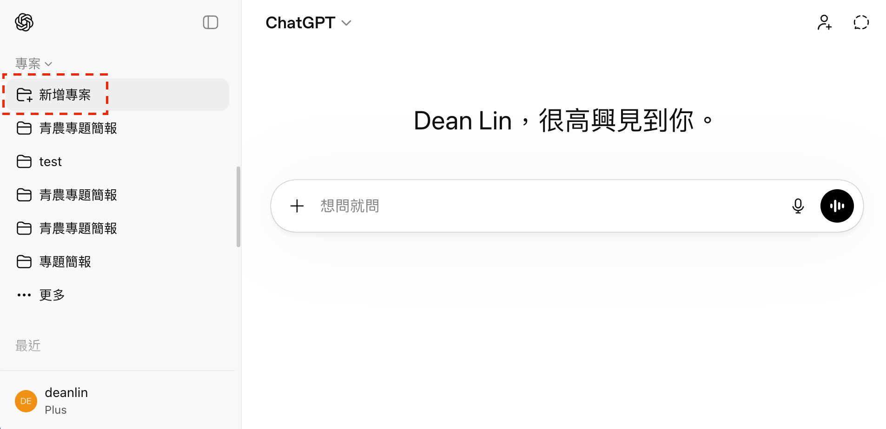

#### STEP 2：命名專案名稱

- ex:「競品分析」——餐飲的同商圈名店、製造的同產品線同業、服務的同客群品牌，都是好題目

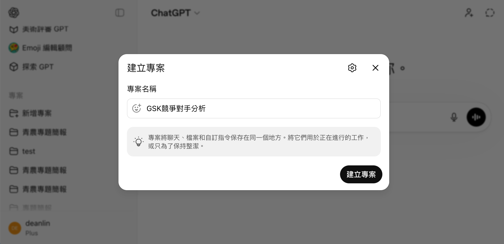

#### STEP 3：新增指令與檔案

- 設定專屬專案的指令；普通對話上傳的背景資訊只能用「一次」，`專案`上傳一次後就可以持續使用

```prompt [label="專案指令範例：競品分析顧問"]
# 角色
你是一位專精「競品分析」與「市場研究」的顧問，擅長從公開資訊推估同業的經營策略，並清楚標示不確定性。

# 任務
請針對我提供的資訊背景進行完整競品分析，重點放在：
市場定位、產品（服務）與價格帶、銷售通路、客群輪廓與口碑評價

# 資料要求
- 優先使用公開資料（官網、社群帳號、新聞、評論與電商平台）
- 若無明確數據，可用合理推估，但需標示「推估」或「需自行查證」
- 避免憑空捏造

# 輸出格式
## 一、品牌基本資料（Brand Overview）
## 二、品牌規模與通路（Scale & Channels）
## 三、產品與市場（Product & Market）
## 四、客群分析（Audience Analysis）
## 五、競爭與機會分析（Competitive Insight）
## 六、資料可信度（Confidence Level）
- 高 / 中 / 低（並說明原因）
```

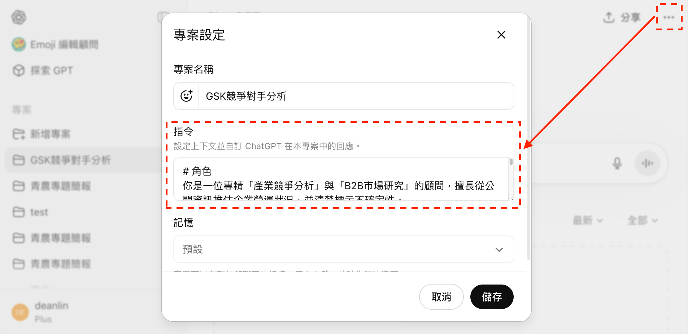

> 截圖為講師先前實測的設定畫面，指令文字請以講義為準——操作流程完全相同。

#### STEP 4：請 AI 提供檢索資訊

- 「分析[競品品牌]在市場扮演的角色、近期經營策略與動態，不可空泛，需要有報導、來源」（課堂實測以 Palantir 為例，流程完全相同）


## NotebookLM 跟 ChatGPT Project，該用哪個？

> **Project 不是已經有知識庫了嗎？**
> 上一堂學了 NotebookLM、這一堂又上傳檔案給 Project，很多人會問：功能不是重複了嗎？——沒有，一個是`圖書館員`，一個是`顧問`。

### 🆚 兩者的定位完全不同

- **NotebookLM 像圖書館員**：只根據館藏（你上傳的來源）回答，每句話都能給你出處
- **ChatGPT Project 像顧問**：讀過你給的資料，還會上網查、會推理、會動手幫你寫東西

| 比較項目 | NotebookLM | ChatGPT Project |
| --- | --- | --- |
| 回答依據 | ⭐ **只根據上傳來源**，附出處可回查原文 | 來源＋模型知識＋網路搜尋，較會「發揮」 |
| RAG 檢索能力 | ⭐ 天然的 RAG 工具，查證能力最強 | 檢索過程較黑箱，可能摻入模型自身知識 |
| 衍生產出 | ⭐ 心智圖、語音／影片摘要、簡報、資訊圖表一鍵生成 | 企劃、大綱、文案、逐字稿——想要什麼格式用說的 |
| 靈活度 | 侷限在來源內容，超出範圍會說不知道 | ⭐ 寫作、翻譯、網搜、深入研究都在同一個專案 |
| 來源容量 | ⭐ 免費每筆記本 50 個來源，單一來源可達 50 萬字 | 檔案數較少（免費 5 個、Plus 25 個） |
| 共享協作 | 可設`檢視者`／`編輯者`權限 | 共享專案＋專案隔離記憶（個人對話不會外洩給協作者） |
| 主要限制 | 生成的簡報**不可編輯**、只能答來源內的事 | 引用不到段落級，關鍵數字要自己核對 |

### 🎯 使用時機：「查」找 NotebookLM，「產」找 Project

- 想**查證、彙整、讀懂**手上的資料（會議記錄、規章、報告）→ NotebookLM
- 想**產出新東西**（企劃、簡報大綱、開發信）→ ChatGPT Project
- 最強的用法是`接力`：先用 NotebookLM 把來源查證、彙整成重點 → 貼給 Project 當背景資料，讓它放手去寫

> **知識庫是倉管，工作室是產線**
> 兩者不是二選一——資料的「保存與查找」交給 NotebookLM，資料的「加工與產出」交給 Project，各司其職才是完整的工作流。

## 扮演特定產業的角色，將資料整理成大綱

### 🎯 產生合適的 Prompt（聚焦需求）

```prompt [label="先讓 AI 優化你的問題"]
``` 分析[競品品牌]的經營策略與內容經營，不可空泛，需要有報導、來源；從競爭者角度分析，有哪些適合學習、模仿、超越，並撰寫提案企劃 ```

以上面的 Prompt 為基礎，我要提供怎麼樣的 Prompt 可以得到較好回答？
請說明為什麼，並在最後舉出能得到專業回覆的 Prompt 範例。
```

### 🔄 用「角色切換」補齊資訊再產出

1. 開新交談，詢問是否有需要補充的內容：「如果[撰寫提案企劃前]有任何問題，請先詢問我，不要直接產生。」
2. 根據狀況補齊資訊（可重複多次）：「請扮演熟悉[你所在產業與商品線]的產業顧問，針對提出的問題給出具體詳細的回覆。」
3. 重新扮演提案企劃的專家：

```prompt [label="切回企劃專家產出大綱"]
請扮演[提案企劃]的專家，依據提供的資訊撰寫一份詳盡的[企劃大綱]，僅需要呈現[主標題、次標題、簡述]即可，在 Code Block 中以 Markdown 格式呈現。
```

### 📝 為什麼要用 Markdown？

> 之所以使用「Markdown」，是為了確保資料格式層級——`#` 是大標題、`-` 是列點，AI 與人都能一眼看懂結構。

```prompt [label="Markdown 基本語法"]
# 大標題 h1

#### 小標題 h4

這邊就是描述的內容，你可以區分層級:
- 文字的格式
  - **粗體**
  - *斜體*
  - ~~刪節線~~

> 引用的寫法
```

## 從利害關係人角色來看需求、問題

### 👥 三步驟換位檢視企劃

1. 了解企劃的利害關係人：「請分析這份企劃最重要的[3]個利害關係人。」
2. 了解利害關係人在意的點：「請你扮演[上面利害關係人]的角色，從他們的角度和利益出發，詳細說明對這份企劃有哪些具體的[意見、建議、憂慮]？」
3. 重新產生企劃：

```prompt [label="整合利害關係人觀點"]
請你扮演[提案企劃]的專家，在了解[利害關係人]的想法後，以最專業的角度，將內容整合到下方的企劃大綱中，僅需要呈現[主標題、次標題、簡述]即可，在 Code Block 中以 Markdown 格式呈現。

``` [貼上一開始的企劃大綱] ```
```

## 用紅藍隊概念攻防（同產業競爭者、公司高層）

> `紅隊`負責攻擊（挑毛病的高層與競爭者）、`藍隊`負責防守（修補企劃的你）——這是從資安演練借來的概念。

### ⚔️ 讓高層與競爭者輪番挑戰

1. 讓高層審閱這份企劃：

```prompt [label="紅隊：高層與競爭者的挑戰"]
請扮演審閱這份提案企劃的[公司高層]，請盡可能列出這份企劃的不足之處。
接著從提案企劃的[競爭者]角度，盡可能列出更完善、可行的方案。
```

2. 重新產生計畫：「請你扮演[提案企劃]的專家，在了解[不足之處、更完善的方案後]後，將每點建議整合到下方的企劃大綱中。」

[warning title="⚠️ 小提醒"]
- ChatGPT 未必會採納所有建議，且可能會自動移除有用的內容，你還是需要自己審視一遍
[/warning]

## 將與 AI 對話的過程，變成可重複利用的資產

### ♻️ 把對話萃取成可重現的 Prompt

```prompt [label="把對話萃取成可重現的 Prompt"]
請將上方對話整理成以下內容，並在最後設計一個可以重現結果的 Prompt：

1. 起初怎麼提問
2. 中間如何引導與調整
3. 最終是如何得出這個成果的

這個 Prompt 需要能完整呈現對話的思考鏈
```

- 實際案例：[完整對話過程](https://chatgpt.com/share/69e23f8b-f924-83a4-8d76-a423f069e715)

> **與 AI 對話不是聊天，是累積資產**
> 每一次成功的引導過程都值得收藏——下次遇到類似問題，你不是從零開始，是從上次的終點開始。

[lab-session title="實戰演練" duration="15 分鐘" hint="有問題歡迎提出，你的問題可能是大家的問題"]
- STEP 1：思考要製作的企劃（建議與目前工作相關 → 能判斷答案對錯；或過去寫過的企劃 → 可比對準確率）
- STEP 2：新建專案，上傳企劃需要的背景資訊
- STEP 3：扮演多重角色生成企劃大綱——從不同的角度來審視企劃
- STEP 4：將與 AI 對話的過程，變成可重複利用的資產
[/lab-session]

## 「逐段」生成提案簡報內的列點、表格、逐字稿

### 🧩 兩步驟逐段生成細節

#### STEP 1：指定段落來生成細節

```prompt [label="指定段落生成簡報逐字稿"]
請你扮演[擅長透過白話傳達資訊]的簡報達人，將[1. 前言與企劃目標]的內容，轉換成適合直接上台使用的簡報逐字稿。

輸出要求：
1. 步驟、案例 → 用[列點]呈現，條列清楚且簡短。
2. 若內容涉及比較 → 使用[表格]呈現，表格第一欄為比較項目，其餘欄為對應差異。
3. 最終輸出要包含「可以直接朗讀」的逐字稿，語氣口語化、易懂，避免艱澀專業用語。
4. 請保留邏輯順序，讓聽眾聽完就能馬上明白「為何要做、要達成什麼」。
```


#### STEP 2：「編輯訊息」生成新的段落

- 完成後點擊「編輯訊息」，把段落名稱換掉再「傳送」——不用重打整段 Prompt


[lab-session title="實戰演練" duration="5 分鐘" hint="有問題歡迎提出，你的問題可能是大家的問題"]
- STEP 1：「指定段落」來生成細節
- STEP 2：「編輯訊息」生成新的段落
[/lab-session]

---

# Gamma 簡報篇：一鍵生成圖文並茂的簡報

> 把上一章產出的 Markdown 大綱貼進來，幾秒鐘就變成圖文並茂的簡報——排版交給模板，美編交給 AI，你只需要專注在內容本身。

## 註冊 Gamma

### 🎟️ 用推薦連結多拿 200 Credits

- **註冊連結**：https://gamma.app/signup?r=xxndt061vudg1pr
- 🎉 使用這個註冊連結可以多獲得 **200 Credits** 🎉
- 注意：Gamma 的每個 AI 功能都會消耗 Credits


## 用「貼上文字」方式生成簡報

### 📋 五步驟從大綱到成品

#### STEP 1：選擇「貼上文字」


#### STEP 2：貼上 ChatGPT 生成的簡報大綱

- 把上一章產出的 Markdown 大綱整份貼上


#### STEP 3：選擇處理方案

- 使用默認的「從備註或大綱生成」，讓 AI 有一定程度的自由發揮


#### STEP 4：調整簡報細節

- **文字內容**：建議選擇「生成」或是「保留」
- **主題**：會影響到 AI 圖片生成風格
- **圖片**：建議選擇「AI 圖片」避免版權問題


#### STEP 5：檢視簡報

- 稍等幾秒鐘，簡報就會順利生成


## Gamma 基礎功能簡介

### 🧰 編輯、模板與匯出

- **用 AI 編輯內容（不建議）**：文字重寫／擴增／縮寫、透過文字搜尋圖片、根據文字建議模板——AI 會自行增減文字、每次操作也都消耗 Credits，文字調整建議回 ChatGPT 改好再貼回來
- **看圖選模板**：直接瀏覽視覺效果來挑選
- **模板可調參數**：欄位寬度、圖片大小、圖片形狀、對齊方式（不同模板間會有差異）
- **將簡報匯出成 PPT、PDF**

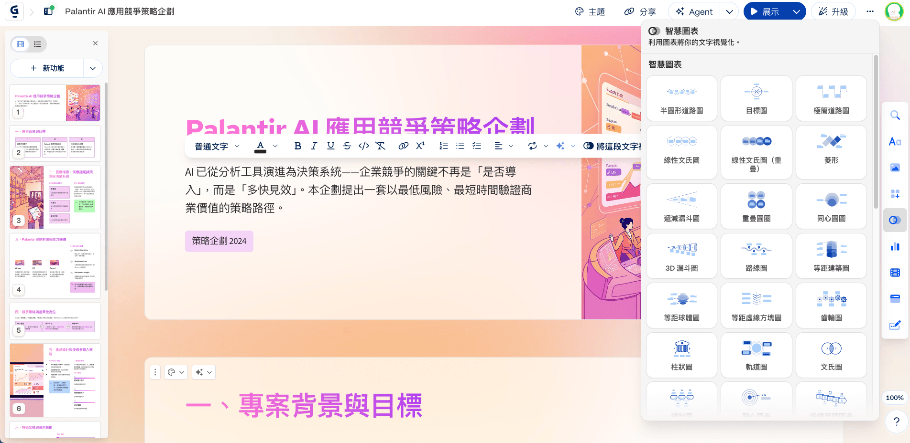


### 🔗 分享 Gamma 簡報


[lab-session title="實戰演練" duration="10 分鐘" hint="有問題歡迎提出，你的問題可能是大家的問題"]
- STEP 1：將 Markdown 轉為 Gamma 簡報（用 ChatGPT 調整後的 Markdown 格式來轉換會有更好的效果）
- STEP 2：調整簡報細節——使用不同模板、並微調參數
[/lab-session]

## 與 ChatGPT 搭配使用

> **Gamma 自己也有 AI，為什麼還要回 ChatGPT？**
> Gamma 的 AI 擅長排版，不擅長琢磨文字——內容的增刪與語氣調整，交給 ChatGPT 處理完再貼回來，各司其職。

### 📄 生成單頁資訊

```prompt [label="請 ChatGPT 為單頁補充內容"]
請扮演熟悉[提案企劃]的專家，根據下面的[提案]設計對應的[資源整合可行性]，內容請簡潔扼要，並以表格呈現。

``` [貼上提案企劃] ```
```

### ✂️ 縮減、擴增文字

```prompt [label="濃縮文字"]
請擔任專業的[文案寫手]，幫我[濃縮]下面的文字。

``` [想要調整的文字] ```
```

### 🖌️ 產生圖片 Prompt

```prompt [label="為每頁簡報產生配圖描述"]
請扮演一位擅長用簡報圖片說故事的講者，你在了解每一頁簡報要表達的意思後（## 表示一頁），用英文描述適合搭配簡報的圖片，用陳述句具體的表達，圖片中不要包含任何文字，並在最後附上中文讓我參考。
下面是簡報內容：

``` [Markdown 文件] ```
```

### 🎨 在 Gamma 中生成圖片

1. 貼上 Prompt（ex: A panoramic view of Taiwanese farmland under different weather conditions...）
2. 選擇風格、數量、長寬比、模型
3. 點擊生成

[gallery]
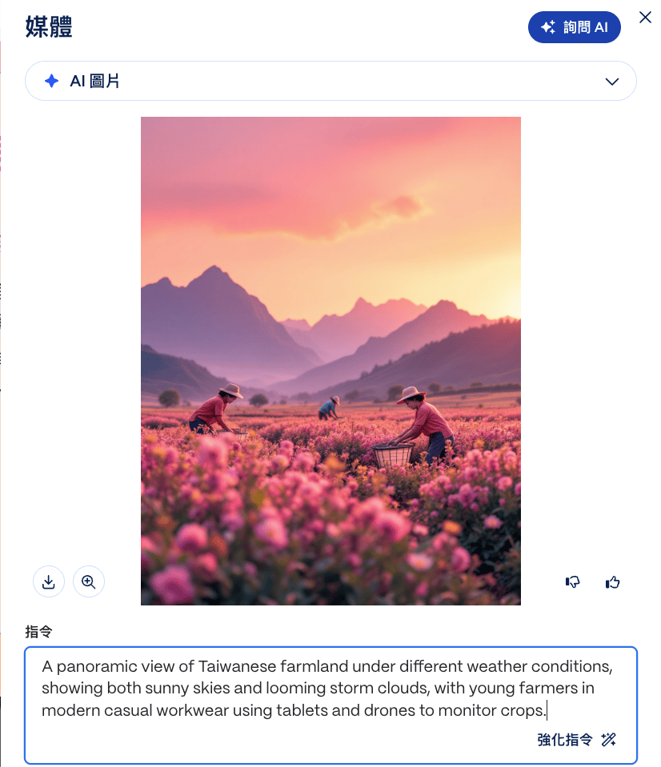
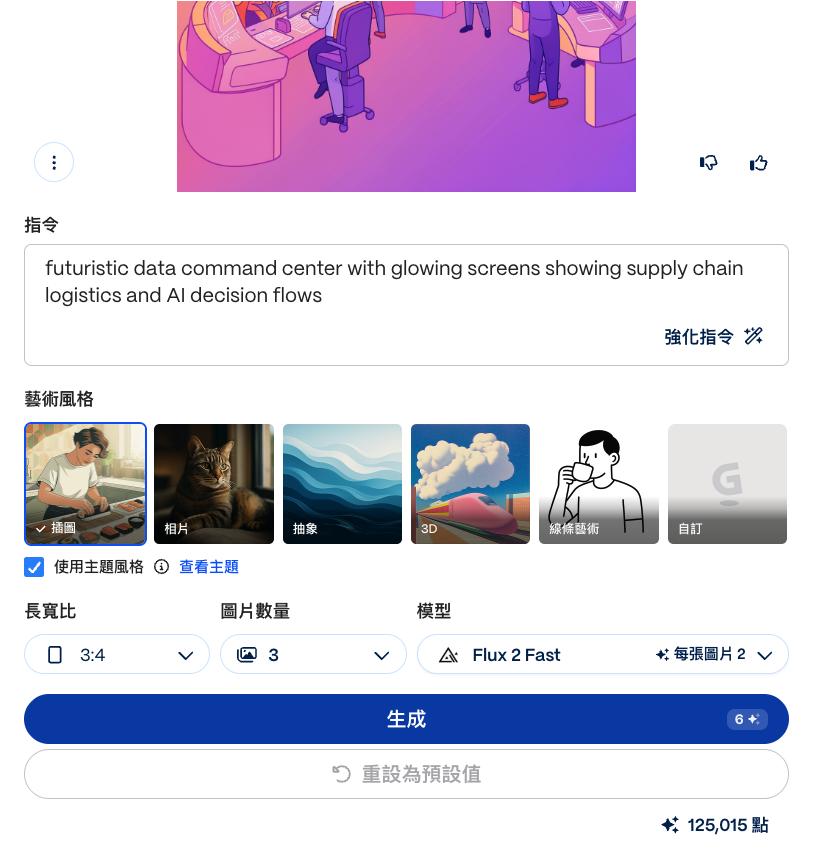
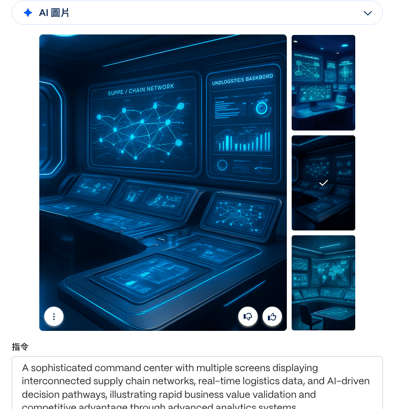
[/gallery]

[lab-session title="實戰演練" duration="10 分鐘" hint="有問題歡迎提出，你的問題可能是大家的問題"]
- 與 ChatGPT 搭配使用：生成單頁簡報、優化文字、產生圖片 Prompt
[/lab-session]

## Gamma 進階功能介紹

### 🗂️ 巢狀卡片

- **將相同主題小卡濃縮到單張簡報**：列點太多導致重點混亂時使用
- **在小卡附加次要訊息**：ex: 把「聊出需求規格書的技巧」的細節收進子卡

[warning title="⚠️ 建議不要設計一層以上的巢狀卡片"]
- 層級太深，觀眾（和你自己）都會迷路
[/warning]

### 🪗 內容折疊（切換按鈕）

- 目錄大綱、FAQ、長 Prompt 都適合收進折疊區塊，需要時再展開
- **註腳**：滑鼠移過去才顯示的補充說明，適合放定義、來源
- ex: 講師把「個人公仔盒裝圖」的超長生成 Prompt 收進折疊區，簡報乾淨、細節不丟

[gallery]


[/gallery]

### 📊 智慧圖表

- 貼上文字，選擇「將這段文字視覺化」
- **靶心圖表**：呈現「核心–中層–外部」的關係，適合政策、產業鏈與外部環境
- **想法圖表**：集中呈現一個主題下的多個解決方案或策略方向
- **象限圖表**：將資料依照兩個維度分類，幫助比較與決策
- **冰山圖表**：顯示「可見因素」與「隱藏因素」的結構，幫助全面思考

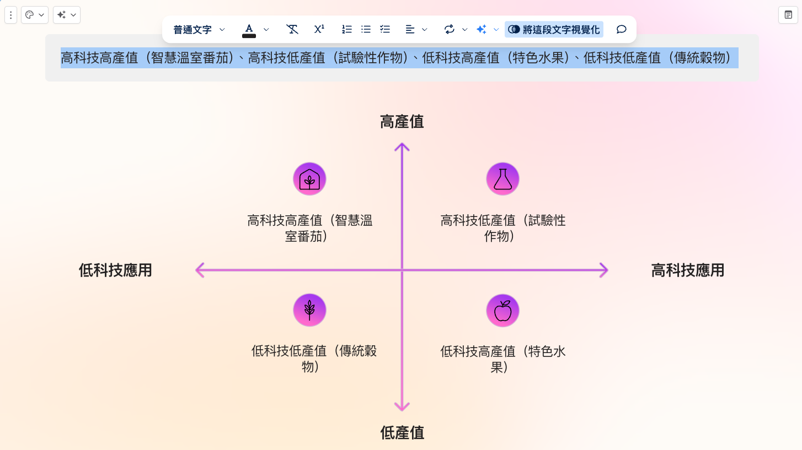

### 🎬 展示簡報的優勢

- 簡報沒有高度限制
- 內建 Spotlight 簡報動畫（快捷鍵 `S`）
- 在不同行動裝置上展示簡報（手機、平板皆可）
- 在簡報內直接觀看外部資源（連結的點按動作選擇「展開」，支援 Figma、Google Docs、Miro）
- 在簡報模式下也可以修改內容（點擊滑鼠「右鍵」）

[lab-session title="實戰演練" duration="10 分鐘" hint="有問題歡迎提出，你的問題可能是大家的問題"]
- STEP 1：嘗試導入 Gamma 自定義版型（巢狀卡片、切換按鈕、註腳）
- STEP 2：嘗試導入 Gamma 智慧模板（想法圖表、冰山圖表）
[/lab-session]

---

# Claude Skill 篇：把工作流變成可重複使用的能力

> 不想每次都重新講一次需求？把「你怎麼做事」寫成 AI 的 SOP 手冊——一次建立、全團隊重複使用，順手還能直接產出可編輯的 PPT。

## 前置設定：關閉 Claude 改善模型選項

### 🔒 三步驟關閉資料訓練

1. 登入 https://claude.ai/
2. 點擊左下角的個人頭像，選擇「Settings」
3. 找到「Privacy」分頁，將「Help improve Claude」關閉

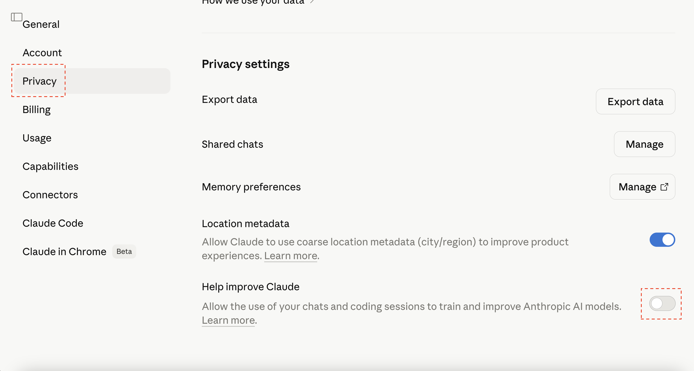

## 為什麼要建立 Skills？

### 🎯 三個建立 Skills 的理由

- 不想每次都重新再講一次（專業知識、工作流程、格式要求、品質標準）
- 一個人完成後，可共享給其他人使用
- 讓 AI 把過去解決過的問題，變成未來可以重複使用的能力

> **Skill 是把你最好的一次，變成每一次**
> 你摸索出最順的流程只要成功過一次，就能封裝起來——之後每一次，都是你的最佳表現。

> **Skill 就像公司的 SOP 手冊**
> 新人（AI）照著手冊做，第一次就有八成水準——而且這本手冊寫一次，全公司都能用。

## 建立自己的 Skills

### 🛠️ 五步驟從對話生出 Skill

#### STEP 1：點「Customize」（客製化）


#### STEP 2：點擊「Create new Skills」

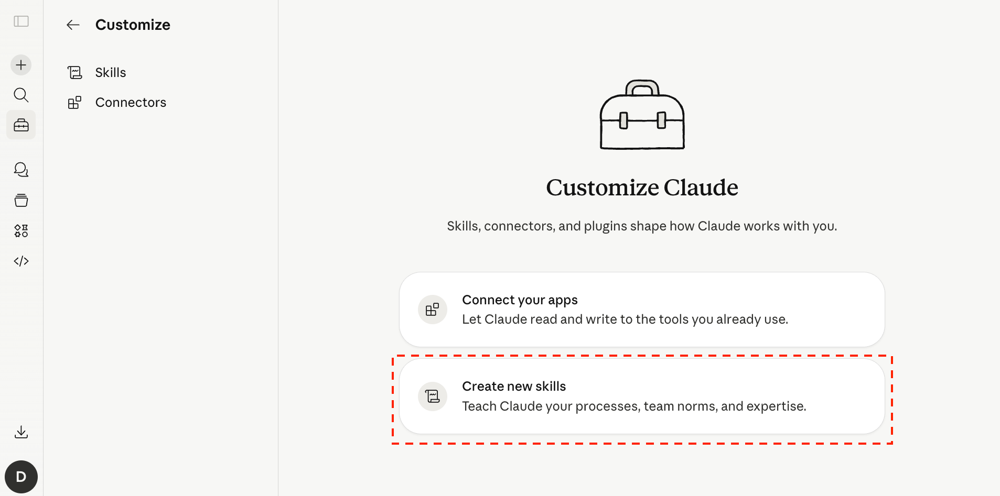

#### STEP 3：點擊「+」後會有三種選擇

- **Create with Claude**：透過對話生成
- **Write skill instructions**：手動輸入
- **Upload a skill**：上傳別人建立好的 Skill

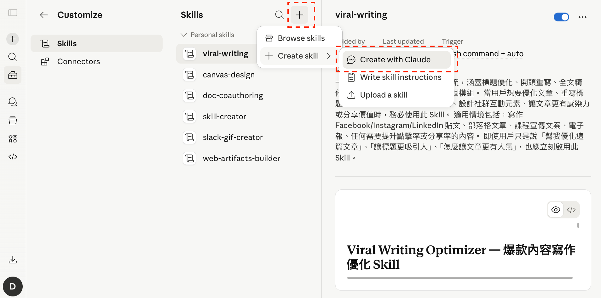

#### STEP 4：選擇「Create with Claude」，輸入自己日常工作流

```prompt [label="用白話描述你的工作流"]
我想要建立「客訴回覆產生器」的技能，只要輸入「客訴內容、發生管道、顧客情緒」，就會得到「第一時間回覆草稿、補償方案建議、內部改善備忘」三個部分，語氣要真誠、不推卸責任
```

- 換個產業一樣好用（ex: 製造的「英文詢價信回覆器」、服務的「會員活動企劃器」、餐飲的「新菜色貼文產生器」）——把輸入與輸出描述清楚即可

> 以下實測截圖以講師先前建立的「開發新客戶」Skill 為例——操作流程完全相同，把描述換成你的工作流即可。

- 輸入後 AI 會與你釐清細節；建立後 AI 會先自行驗證一次，確認沒問題就點擊「Save skill」


#### STEP 5：驗證 Skill

- 「我們是[火鍋店]，幫我回覆這則 Google 評論：[等了 40 分鐘餐才上，服務生態度也不好]」——會先觸發剛剛設計的 Skill，然後給予對應方案


[lab-session title="實戰演練" duration="10 分鐘" hint="有問題歡迎提出，你的問題可能是大家的問題"]
- STEP 1：用白話文描述自己的工作流，請他製作成 Skill（可以有多個步驟、給予範例輸出格式）
- STEP 2：驗證 Skill 是否符合預期（是否正確？如果錯誤，是錯在哪裡？）
[/lab-session]

## 修改 Skills & 注意事項

> 一開始建立的 Skill 不可能完美，會需要根據使用習慣持續優化。

> 本節實測截圖同樣以講師先前的「開發新客戶」Skill 為例，操作流程完全相同。

### 🔧 三步驟安全地迭代 Skill

#### STEP 1：修改前，建議下載一份保存

- 更新技能包會直接覆蓋掉舊版本；有時新版反而沒有舊版好用，建議更新前先下載備份


#### STEP 2：說出自己想要調整的地方

- 「我希望客訴回覆的 Skill，除了回覆草稿外，也能附上『嚴重度分級』與『是否需要主管介入』的建議，並根據不同管道（Google 評論、粉專私訊、Email）自動調整語氣與篇幅」
- 提供關鍵字就會找到對應 Skill；確認調整方向沒問題後，再點擊「Save skill」

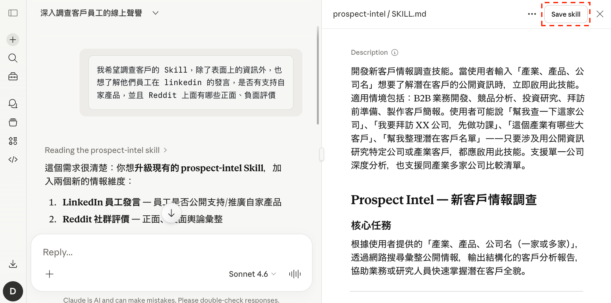

#### STEP 3：驗證 Skill

- 開一個新的對話窗測試：「幫我回覆一則[外送餐點灑出]的顧客抱怨私訊」


[warning title="⚠️ Skill 只是盡可能執行，有可能會遺漏"]
- 實測中 Skill 說好的「員工發言與社群評價」就沒出現——發生時直接提醒它補充即可
[/warning]

## 安裝現成的 Skills

### 🧰 從 Skill 商店挑現成的用

#### STEP 1：點「Customize」，選擇「Browse skills」瀏覽


#### STEP 2：根據需求安裝

[image-text position="right" width="30"]

- **canvas-design**：設計海報圖片（[實測範例](https://claude.ai/share/dad80a0b-7010-4a31-a18f-5389be889fe3)）
- 提供行程資訊（集合出發 → 彩虹眷村 → 審計新村 → 新社園區 → 高美濕地 → 晚餐回程），就能得到右側的成品
- 現成 Skill 很多，但大部分不如預期——安裝前先看評價、裝完先小規模實測
[/image-text]

## 用 Skills 生成簡報

### 🖥️ 兩步驟產出可編輯簡報

#### STEP 1：提供文件、內容，請 AI 製作簡報

```prompt [label="請 Claude 依內容生成簡報"]
你擅長資訊表達，根據下面的內容，設計出對應風格的簡報

[貼上內容]
```

- 如果他沒有給你下載連結，可以直接說「給我 PPT 下載連結」

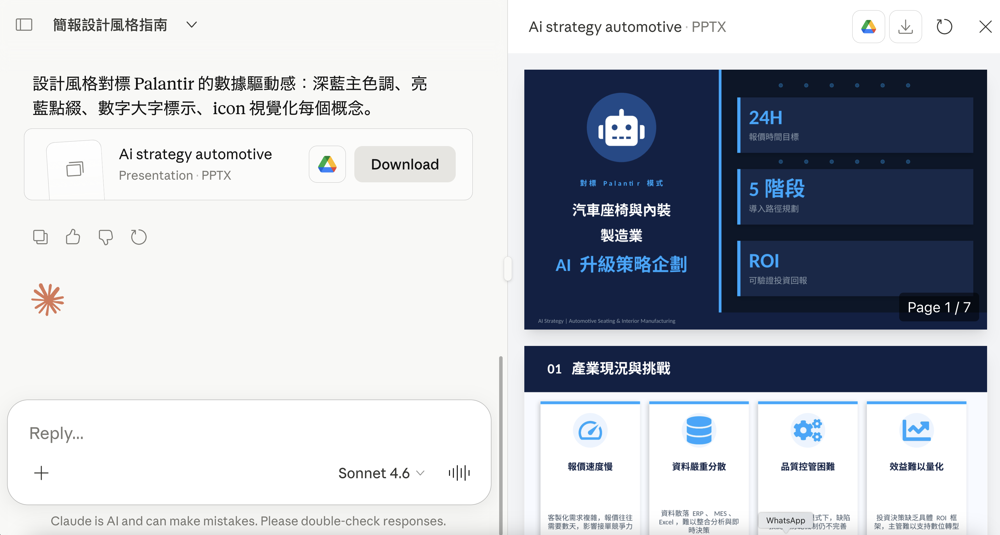

#### STEP 2：簡報是可以下載編輯的

- [參考連結](https://claude.ai/share/788eac26-e952-44b5-a473-f8b6e66ab9b5)

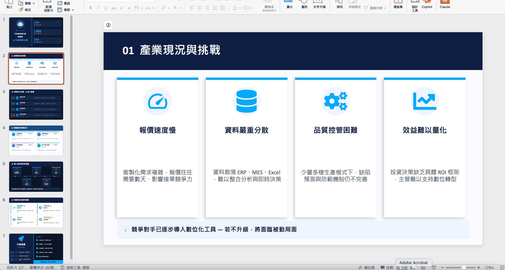

[lab-session title="實戰演練" duration="10 分鐘" hint="有問題歡迎提出，你的問題可能是大家的問題"]
- STEP 1：提供文件、內容，請 AI 製作簡報
- STEP 2：下載 AI 完成的簡報，做後續編輯（NotebookLM 生成的簡報目前是圖片；Gemini Canvas 生成的可編輯但美感差）
[/lab-session]

[bonus title="🎁 Bonus：目前生成簡報最強的 Manus"]
在生成簡報的領域，目前 Manus 的表現最好，結合了 Nano Banana 的美觀 + Claude 的編輯性。

- 透過[邀請連結註冊](https://manus.im/invitation/9EZQALE1FISTXZP?utm_source=invitation&utm_medium=social&utm_campaign=copy_link)，會多獲得 **500 點數**
- 操作方式一樣：「你擅長資訊表達，根據下面的內容，設計出對應風格的簡報 [貼上內容]」
- 產出的簡報最詳盡、美觀、可編輯（[成果範例](https://manus.im/share/In3zMOYuTs3iYqrFUUVwlg)）
- 但相對成本最高——範例中的簡報花了 `652 點`
[/bonus]

---

# Gemini 視覺篇：生成圖片與網站

> 簡報封面、活動海報、節慶賀卡、行程表、EDM 網頁——所有「要美，但不想開設計軟體」的需求，用 Nano Banana 和 Canvas 一站搞定。

> **美感可以外包，品味不能**
> AI 可以一口氣生一百張圖，但哪一張「對」，還是要你來挑——挑選的眼光，才是你的護城河。

## 用 Nano Banana 生成圖片

### 🖼️ 簡報封面

#### STEP 1：上傳圖片，選擇「建立圖像」

- 選擇「思考型」，中文字才會順利產生


#### STEP 2：輸入提示詞

```prompt [label="根據底圖生成簡報封面"]
請扮演簡報設計師，在了解文案要傳遞的資訊後，根據這張圖生成有高級感的簡報封面。
文案如下：
[貼上文案]
```

- 如果發現 Gemini 一直卡住不願意生成圖片，可以直白的說「產生圖片，不要廢話」（[實測連結](https://gemini.google.com/share/065ddd5ee897)）


#### 進階：先提供資訊讓 AI 理解後再生成

1. 提供資料請 AI 協助設計：「請扮演一位資深的簡報設計師，閱讀完下面的內容後，告訴我如何設計有重點、設計感、美觀的簡報封面，盡可能細節規劃 [貼上文案]」
2. 選擇方案請 AI 生成：「使用『提案一』產生圖片，不要廢話」（[實測連結](https://gemini.google.com/share/10ea8999823a)）


### 🪧 活動海報

```prompt [label="根據活動內容生成海報"]
根據活動內容設計出有質感的海報：
- 背景圖：需符合活動主題，可以有漸層轉換效果
- 文字排版：使用清晰無襯線字體，注重黑白對比來強調層次，並用網格佈局來對齊
- 整體畫面：適當保持留白，文字不要擋住關鍵區域

活動內容：
- 主題：
- 時間：
- 地點：
```

- 一樣可以「先提供資訊請 AI 規劃 → 選方案 → 生成」（[實測連結](https://gemini.google.com/share/8c088379f2b8)）

[gallery]


[/gallery]

### 📰 懶人包

```prompt [label="把文章變成懶人包圖"]
將下面的文章總結成懶人包，需要有主題與 3 個重點，並用一句話總結，並以可愛日系動漫的方式呈現
[貼上文章]
```


### 💌 創意賀卡

- 節慶賀卡可以用超長 Prompt 控制角色、場景、色彩、構圖、文字（詳見講師提供的端午節黏土風範例）
- 換節慶不用重寫：

```prompt [label="讓 AI 幫你改寫節慶 Prompt"]
請扮演充滿創意、天馬行空的藝術家，幫我將下面的提示詞轉成適合[端午節/中秋節/春節]的內容，人物、場景、物件、風格、光影、氛圍都要調整
```

[gallery]


[/gallery]

### 🗺️ 行程表

```prompt [label="生成手繪風行程流程圖"]
請生成一張[手繪風格]的行程流程圖，每個景點方便需要加入對應的景點圖案示意
主題：2026 員工旅遊
活動行程：
[貼上活動行程]
```

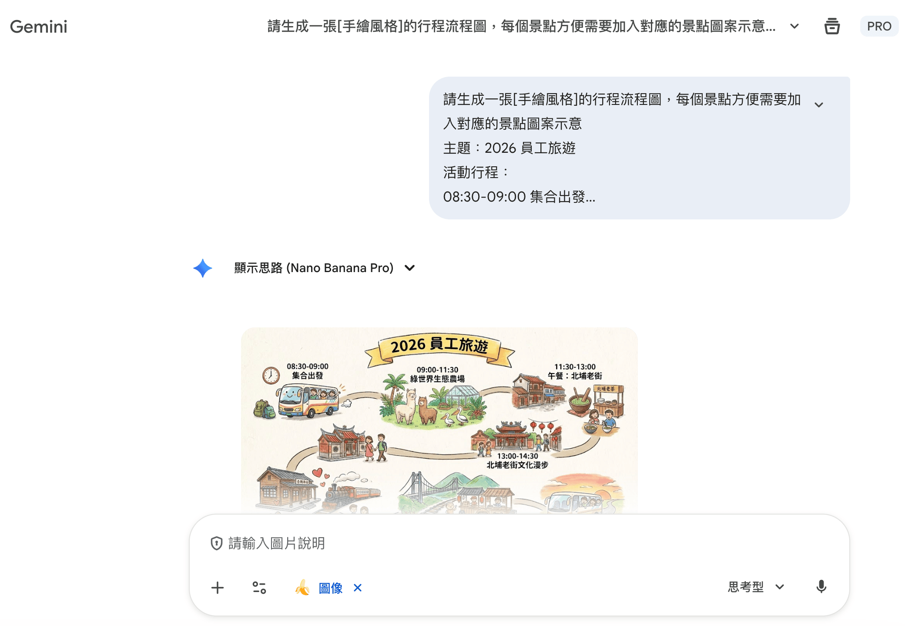

### 📈 流程圖

```prompt [label="從表格提取資訊生成流程圖"]
從下方流程提取出關鍵資訊，用簡單易懂的方式設計為流程圖，讓目標受眾可以快速掌握階段性目標，請使用[向量插畫與扁平化設計]
流程：
[貼上流程]
```

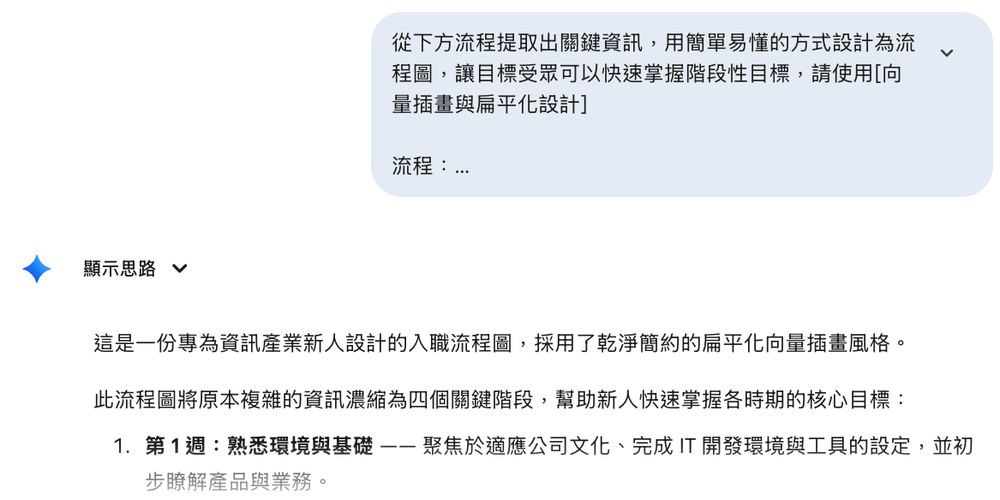

### 🍽️ 模擬示意圖

- **改變場景**：「幫我延伸圖片背景，呈現在高級餐廳吃飯的質感，加上適當的光影。超寫實，8k 解析度，商業美食攝影，對焦清晰。」
- **加上文字批註**：「請將我上傳的圖片盡量使用紅色墨水筆或字卡，瘋狂地加上手寫中文批註、塗鴉……」


[lab-session title="實戰演練" duration="10 分鐘" hint="有問題歡迎提出，你的問題可能是大家的問題"]
- STEP 1：嘗試用 Gemini 生成圖片（簡報封面、活動海報、行程表、模擬示意圖）
- STEP 2：生成後的圖片可以透過對話微調細節
[/lab-session]

## 透過 Canvas 生成網站（可作為 EDM Email）

### 💌 四步驟從活動內容到 EDM

#### STEP 1：提供參考資訊，選擇 Canvas

```prompt [label="生成 RWD 活動網頁"]
請幫我將下面的活動內容設計為符合 RWD 的網站，排版配色要有設計與高級感，我要作為 EDM 郵件寄出，不要使用複雜的元素，不需要圖片區域

活動內容：
[貼上活動內容]
```

- `RWD`（響應式網頁設計）：同一個網頁在電腦與手機上都會自動調整排版


#### STEP 2：網站產生出來後，選擇「程式碼」

- 裡面的連結都只是默認值，要記得把正確資訊提供給 AI，才會真的跳轉（[實測連結](https://gemini.google.com/share/8e9b28ae424a)）


#### STEP 3：安裝 HTML Inserter for Gmail Chrome 外掛

- 安裝 [HTMail 外掛](https://chromewebstore.google.com/detail/htmail-insert-html-into-g/omojcahabhafmagldeheegggbakefhlh?hl=zh-TW)後，Gmail 右下角會有一個程式碼符號，點擊展開後直接貼上 HTML


#### STEP 4：這樣收到的信件就會漂亮許多


[image-text position="right" width="24"]

- 因為一開始就要求 RWD，手機打開一樣漂亮
- 收件人不管用電腦還是手機，看到的都是完整排版
- 比起純文字信件，EDM 的點擊意願高出一截
[/image-text]

---

# Google Workspace AI 篇：把 AI 帶進 Docs、Sheets 與日曆

> 文件草擬、資料整理、跨筆記本問答、行程規劃——不用離開每天都在用的 Google 工作環境，AI 就在你打字的地方待命。

[warning title="⚠️ 開始前，先確認你的帳號看得到 Gemini"]
- 個人 Google 帳號：需訂閱 Google AI 付費方案，免費帳號可能看不到 Gemini 入口
- 公司 Workspace 帳號：需由管理員開通 Gemini 功能
- 介面語言與地區也可能影響按鈕位置——現場找不到按鈕的同學，先與鄰座共用畫面，回去後依上述條件開通
[/warning]

## Google Docs：生成文件、圖片

### 📄 四步驟在文件裡呼叫 Gemini

#### STEP 1：打開 Google Docs 的 Gemini 對話

- 點擊右上角的 Gemini 圖示，右側會展開對話面板


#### STEP 2：輸入需求

```prompt [label="請 Gemini 草擬文件"]
製作一份 Gemini 辦公應用教育訓練的課程
```


- 確認沒問題後，點擊「插入」就會放進文件中


#### STEP 3：生成表格

```prompt [label="把摘要轉成表格"]
將摘要以「表格」呈現，讓我可以快速閱覽內容
```


#### STEP 4：生成圖片

```prompt [label="生成文件封面圖"]
幫我生成適合當課程封面的圖片，不要有文字
```


> **為什麼不去 ChatGPT 寫好再貼回來？**
> 因為`來回切換`才是效率殺手——在文件裡直接生成、直接插入，格式不會跑掉，脈絡也不會斷。

## Google Sheets：整理資料、智慧填充

### 📊 三步驟讓試算表自己動起來

#### STEP 1：打開 Google Sheets 的 Gemini 對話


#### STEP 2：輸入需求

```prompt [label="模擬一份客戶名單"]
幫我模擬一份客戶名單，要有「姓名、出生年月日、性別、愛好(1~6個)、居住縣市、居住行政區、Email」等欄位，共 30 名，請使用虛擬而非知名人士的名字
```

- 確認沒問題後，點擊「插入」就會放進試算表中


#### STEP 3：視覺化數據

```prompt [label="用函式彙整並生成圖表"]
我想要透過圖表，根據這些資料用函式幫我彙整出下面資訊：
- 年齡分佈
- 性別分布
- 愛好分布
- 居住縣市分布
```


> **模擬資料是最安全的練習場**
> 想練習客戶分析卻不能拿真實個資來玩？請 AI 生一份虛擬名單——餐飲的會員輪廓、製造的客戶清單、服務的滿意度調查，都能安全地演練一遍。

## 在 Gemini 調用多個 NotebookLM 筆記本

> 第一堂建好的知識庫，在這裡直接派上用場——Gemini 可以同時掛載多個筆記本，做跨知識庫的綜合問答。

### 🔗 三步驟跨筆記本問答

#### STEP 1：開新的對話窗，選擇 NotebookLM

- 點擊輸入框左側的「＋」，選單中選擇「NotebookLM」


#### STEP 2：選擇要加入的筆記本

- 可以一次勾選多個筆記本，讓 AI 同時參考


#### STEP 3：提出綜合問題

```prompt [label="跨筆記本的綜合問題"]
根據目前系統開發的方式，新進人員手冊是否需要優化？
```

- 🍜 餐飲：把「門市 SOP」與「顧客評論彙整」掛在一起，問「哪些 SOP 該因應常見客訴調整？」
- 🏭 製造：把「品管規範」與「會議記錄」掛在一起，問「上次會議的製程變更，有沒有牴觸現行規範？」
- 🛎️ 服務：把「服務手冊」與「教育訓練教材」掛在一起，問「新人教材有沒有跟上最新的服務流程？」


> **單一筆記本是「查資料」，多筆記本是「做判斷」**
> 把會議記錄與規範手冊放在一起問，AI 才能幫你發現「文件之間的落差」——這是翻文件翻不出來的洞察。

## 在 Gemini 規劃 Calendar 行程

### 🗓️ 四步驟讓 AI 幫你管行程

#### STEP 1：開新的對話窗提出讀取行程需求

- 第一次使用需要開啟日曆的存取權限

```prompt [label="讀取現有行程"]
三月份目前有哪些會議、課程要處理
```


#### STEP 2：可以直接透過與 AI 對話來新增行程

```prompt [label="摘要影片內容並寫入日曆"]
我在 3/13 號下午 3-4 點需要在公司內舉辦技術分享，主題是之前在 YouTube 分享的影片，幫我摘要內容大綱後用陳述句寫入 Google 日曆說明，字數 100 字內。
[貼上影片連結]
```


#### STEP 3：前往 Google 日曆確認有順利新增


#### STEP 4：初步規劃旅遊行程也是可以的

```prompt [label="規劃旅遊行程並直接寫入日曆"]
我預計 5 月份要到日本東京旅遊，時間在 5/18~22
請幫我規劃旅遊行程，人數為 2 人，以中午到晚上行程為主，每個點的地址要確定
標題為「地點 + 大眾工具的搭乘方式」
完成後直接寫到日曆中
```


[warning title="⚠️ 小提醒"]
- 目前寫入「說明」的功能還不是很穩定，寫入後記得到日曆確認一遍
[/warning]

[lab-session title="實戰演練" duration="10 分鐘" hint="有問題歡迎提出，你的問題可能是大家的問題"]
- STEP 1：在 Google Docs 用 Gemini 生成一份文件（企劃、公告、活動說明皆可），並插入表格與封面圖
- STEP 2：在 Google Sheets 生成一份模擬名單，請 AI 用函式彙整出分佈圖表
- STEP 3：在 Gemini 掛載第一堂建立的 NotebookLM 筆記本，提出一個綜合問題
[/lab-session]

---

# 結語：AI 時代的生存心法

> 工作並不會因為 AI 工具的出現而消失，但會因為 AI 工具的出現而改變。

## 五個心法

### 🧑‍⚖️ 只有專業人士，才有能力判斷對錯

- AI 已經達到「初階能力」的全才
- 除非真的了解背景知識，否則並沒有判斷 AI 答案對錯的能力

> **如果你過去從來沒有積累呢？**
> 那你要拿什麼判斷 AI 答案的好壞與正確性？AI 給了你一份看起來很專業的報告，你連它錯在哪都看不出來。

### ⚖️ AI 所導致的兩極化

- AI 是幫你開外掛，還是大腦外包？
- 想把事情做好的人，會做得更好
- 只想應付交差的，會快速墮落

> **不是 AI 做不到**
> 它只是誠實地`放大你的混亂`罷了——你的思路清晰，它放大你的清晰；你的需求混亂，它也如實放大那份混亂。

### 🎓 「因為你不是專家，所以我才找你當老師」

> **這句話聽起來荒謬，卻是 AI 時代的真實心態**
> 有人覺得 AI 什麼都會，專家不再必要——但沒有專家把關，你連 AI 錯在哪都不知道。

### 🎮 AI 可以突破能力範圍，但你對結果有掌控性嗎？

- 結果有「對錯」之分嗎？
- 我們有對作品的「鑑賞」能力嗎？
- 不滿意的地方，有辦法調整嗎？

### 🏔️ 站在巨人的肩膀，不代表自己就是巨人

- 如果沒打好根基，會更早遇到瓶頸（ex: Vibe Coding）
- 發生意外時，沒有收拾的能力
- 遇到挫折時，會更容易放棄

> **AI 解決不了的，都是中高階問題**
> 擁有專業知識的人，才能夠如臂使指；知道什麼是「好」，才有評斷標準。

[summary]
- 📝 **簡報大綱** | 專案上傳背景＋多重角色攻防，AI 打底、人做決策
- 🖼️ **Gamma** | Markdown 一鍵變簡報，模板、智慧圖表與 ChatGPT 搭配使用
- 🤝 **Claude Skill** | 把工作流固化成可重複使用的 Skill，順手產出可編輯簡報
- ✨ **Gemini** | Nano Banana 生圖＋Canvas 生網頁，搞定封面、海報、EDM
- 📅 **Google Workspace AI** | Docs 生文件、Sheets 整資料，Gemini 掛知識庫、管日曆
- 🛡️ **資安意識** | 不把機密丟給 AI、關鍵決策再三確認——每一堂都適用
[/summary]

[qa-session title="Q&A 時間"]
[/qa-session]
