# 🙋 課前回顧：上一堂學了什麼？

> **第一堂建立基礎**
> 而今天我們`開始產出`，每段都會製作一個可以在職場應用的成果。

## 開始前，快速確認三件事

### 💬 你的 AI Agent 已經懂你了嗎？

[image-text position="right" width="50"]

- 個人化設定是否完成？
- **Prompt 技巧應用**：`角色`、`語氣`、`符號`、`格式`、`反問`、`補充`
[/image-text]

### 📚 知識庫有持續累積素材嗎？

[image-text position="right" width="50"]

- Gemini Notebook 的`筆記本`有持續更新嗎？
- ChatGPT 的`專案`開始應用了嗎？
[/image-text]

### 🌀 還記得 AI 的能力範圍嗎？

- **AI 的答案不一定正確**：快是 AI 的本事，對是你的責任
- 今天產出的每一份文案與簡報，都要人工把關


### 🧳 這堂課會帶走的五樣成果

[flow]
1. 企劃大綱 — 七步驟打磨出一份能上台的 Markdown 大綱
2. 技能包 — 把對話打包成 Skill，換個主題一鍵重現
3. Gamma 簡報 — 貼上大綱，快速生成圖文並茂的線上簡報
4. 用模板生成簡報 — 請 ChatGPT／Claude 透過簡報模板生成
5. 封面／流程圖 — 同一段 Prompt，ChatGPT 與 Gemini 的生成結果
[/flow]

---

# AI Agent 進階技巧：七步驟打磨提案企劃

> **最沒效率的事，就是高效率地做根本不該做的事**
> AI 讓「做」變得飛快，於是「想清楚要做什麼」變得更值錢。

## 七步驟打磨提案企劃

### [ChatGPT] 請使用「工作」模式(付費)


### [Gemini] 請使用「Spark」模式(付費)


### [Claude] 一般對話即可(免費)


### 🧭 七步驟總覽

> **下面以 ChatGPT 作為示範，大家請根據自己使用的工具調整（Gemini/Claude），如果目前都沒有付費，可使用 Claude 體驗。**

[flow]
1. 優化提示詞 — 先讓 AI 把一句話需求，改寫成更精確的 Prompt
2. 讓 AI 反問 — 別急著送出，先讓 AI 列出還沒想清楚的地方
3. 補齊資訊 — 扮演產業顧問，把反問的問題一一補齊
4. 利害關係人 — 從決策者、使用者的角度重新檢視企劃
5. 彙整生成企劃 — 整合利害關係人的顧慮，產出第一版
6. 扮演對手挑毛病 — 紅藍隊攻防，讓競爭者（必要時加高層）來挑戰
7. 生成最終版本 — 整合所有建議，輸出可直接貼進 Gamma 的 Markdown 大綱
[/flow]

> **為什麼要這麼多步？**
> 一句「幫我寫企劃」，AI 給你的是網路上千篇一律的`平均值`；而七步驟走完，你拿到的是**考量過利害關係人、還沒上台就先被競爭者挑過毛病的版本**。

#### STEP 1：優化提示詞

- **讓 AI 協助聚焦**：先簡單說明想完成的目標，讓 AI 幫你把 Prompt 寫得更精確

```prompt [label="先簡單說明背景，讓 AI 優化提示詞"]
我準備製作一個[給台灣新創行銷公司導入 AI]的提案企劃

以上面的 Prompt 為基礎，我要提供怎麼樣的 Prompt 可以得到較好回答？
請說明為什麼，並在最後舉出能得到專業回覆的 Prompt 範例。
```

#### STEP 2：讓 AI 反問

- **開新視窗**：提示詞已經優化過一次，但往往還有沒考慮到的地方，先別急著送出
— **換角色審視**：讓 AI 先當提問者，逼自己把模糊的地方想清楚

```prompt [label="讓 AI 主動反問，而不是直接生成"]
```
[開新視窗貼上 STEP 1 得到的提示詞]
```
在用這個 Prompt[撰寫提案企劃前]有任何問題，請先詢問我，不要直接產生。
```

#### STEP 3：補齊資訊

- **建議自行填寫**：AI 反問列出的問題，建議自己親自填寫才會得到自己需要的答案
- **讓 AI 自問自答**：如果不知道如何寫，可以讓 AI 扮演「產業顧問」角色自問自答

```prompt [label="扮演產業顧問，補齊反問的資訊"]
請扮演對這個領域非常熟悉的[產業顧問]，針對提出的問題給出具體詳細的回覆、不要逃避問題。
```

#### STEP 4：利害關係人

- **不能只有一個視角**：一份企劃能不能過，不能只考量到自己
- **過去這些都需要市場調查**：AI 可以拓展思路，讓我們從不同面向看問題

```prompt [label="從利害關係人角度檢視企劃"]
請分析這份企劃最重要的[3]個利害關係人，從他們的角度和利益出發，詳細說明對這份企劃有哪些具體的[意見、建議、憂慮]？
```

#### STEP 5：彙整建議生成企劃

- **彙整資訊**：把利害關係人的顧慮整合進來，產出第一版企劃

```prompt [label="彙整利害關係人想法，生成初版企劃"]
請扮演[提案企劃]的專家，了解[利害關係人]的想法後，以最專業的角度在企劃補充更完善、可行的方案。
```

#### STEP 6：扮演對手挑毛病

> **用紅藍隊概念攻防**

- **主管老闆來挑錯誤**：看似圓滿的企劃往往還有許多細節不夠清晰，讓高層來挑毛病吧！
- **競爭對手來協助優化**：在優化這一塊，可以嘗試從競爭對手角度思考，可以有更完善的觀點

```prompt [label="紅隊：讓競爭者（與高層）挑戰企劃"]
請扮演審閱這份提案企劃的[公司高層]，請盡可能列出這份企劃的不足之處。
接著從提案企劃的[競爭者]角度，盡可能列出更完善、可行的方案。
```

#### STEP 7：生成最終版本

- **整合觀點後先出大綱的好處**
  - 可以讓我們`快速確認方向`，有問題可以即時調整
  - 減少`AI 額度消耗、等待時間`，因為完整的企劃可能需要 10~20 分鐘才能完成
- **為什麼指定 Markdown 格式？**
  - 因為`結構清晰`，後面可以直接丟給 Gamma 生成簡報

```prompt [label="整合建議，生成最終版本"]
請扮演[提案企劃]的專家，在了解[不足之處、更完善的方案後]後，以最專業的角度，重新完善這份企劃。

僅需呈現[主標題、次標題、簡述中要涵蓋關鍵數據、可使用列點呈現]，在 Code Block 中以 Markdown 格式呈現，以 10 頁簡報來設計。

等我確認方向都沒問題後，再生成完整企劃
```


[warning title="小提醒"]
- **ChatGPT**：[對話連結](https://chatgpt.com/share/6a8a7214-9940-83e8-8520-b620bc063b03)
AI 未必會採納所有建議，且可能會自動移除有用的內容，你還是需要自己審視一遍
[/warning]

### 📝 Markdown 簡介

> **結構明確**
> 是為了確保資料格式層級——`#` 是大標題、`-` 是列點，AI 與人都能一眼看懂結構。

```prompt [label="Markdown 基本語法"]
# 大標題 h1

#### 小標題 h4

這邊就是描述的內容，你可以區分層級:
- 文字的格式
  - **粗體**
  - *斜體*
  - ~~刪節線~~

> 引用的寫法

表格適合拿來做比較：

| 項目 | 說明 | 備註 |
|------|------|------|
| 標題 | `#` 控制層級 | 數字越多層級越低 |
| 列點 | `-` 開頭 | 縮排可做巢狀 |
| 引用 | `>` 開頭 | 用來補充說明 |
```


[lab-session title="實戰演練" duration="10 分鐘" hint="有問題歡迎提出，你的問題可能是大家的問題"]
- 想一個與工作相關的企劃主題
- 跑完七步驟，拿到 Markdown 大綱
- 先別關視窗，接下來要把它轉換成可重複使用的 Skill
[/lab-session]

---

# Skill 技能包：把流程打包成 Skill，換個主題一鍵重現

> **把聊天的成果，轉換成可重複使用的資產**
> 在 AI 完成任務後把視窗關閉太可惜了，你中間引導他如何優化的部分才是最珍貴的資產。
> 這些細節都能成為技能的養分，讓我們下次不用從零開始。

## 為什麼要打包成 Skill？

[warning title="目前僅 Claude 的 Skill 可以免費體驗"]
- ChatGPT、Gemini 免費版目前看不到、也不能建立 Skill
- 沒有付費的同學，可以透過 [Claude](https://claude.ai/) 嘗試
[/warning]

### 🤯 流程都在某個人腦袋裡

[flow]
- **關鍵人物不在，流程就卡死** - 「這份文案怎麼寫？系統怎麼設計的？專案下一步該做什麼？」如果答案全在某個`資深同事`的腦袋；他一請假、離職，這一切就需要`重新摸索`。
- **交接靠口耳相傳，品質全憑運氣** - 新人上工時，只拿到`零散筆記`和`口頭經驗`；因此報告、信件、文案……每個人的`格式、品質`都不一樣。
- **需要手把手教學，難以擴散** - 許多流程需要`實際 Demo`才能搞懂，因此就算有好方案也`擴散不出去`，案例難以複製到不同部門。
[/flow]

### 📋 提示詞一直複製貼上

[flow]
- **存了一堆 Prompt，要用時翻半天** - 提示詞散落在`記事本、Notion、聊天記錄`；真的需要使用時，光是找出`最後一版`就浪費一堆時間。
- **換個情境就得調整提示詞參數** - 同一套文案 Prompt，換個品項、從 IG 改到 EDM 就得`手動微調`，浪費時間。
- **規則改了，舊版本卻沒跟著改** - 新增一個`禁用詞`、調整了`品牌語氣`，但同樣的 Prompt 已經`被複製到十個地方`；漏改一處，錯的版本就`默默繼續產出`。
[/flow]

> **Skill 是把你最好的一次，變成每一次**
> 你摸索出最順的流程後，只要成功過一次，就能把它設計成 Skill，未來就不用從零開始。

### 📝 Skill 就像公司的 SOP 手冊

- Skill 在完成後，是可以`下載與分享`的
- 即使是**剛接觸業務的新人**，使用前輩設計好的 Skill 也能`做出符合公司期待的成果`

> **Project 放知識，Skill 設計流程**
> **Project 讓 AI「知道事實」** — 你扮演的角色、品牌規範、產品資訊、專案細節
> **Skill 讓 AI「知道步驟」** — 文案、月報、信件、企劃、簡報要遵守的 SOP

## [ChatGPT] 把剛剛的對話打包成 Skill

### 🧰 把對話變成技能包

#### STEP 1：將對話流程轉換成 Skill

```prompt [label="請 AI 把對話萃取成 Skill"]
請根據以下要求分析上方對話內容後，整理成可重複使用的 Skill，名稱為[proposal-refiner-exmaple]：

1. 起初怎麼提問
2. 中間如何引導與調整
3. 最終是如何得出這個成果的
```


#### STEP 2：確認 Skill有順利儲存

- 點擊側邊欄`外掛程式`，選擇`技能`


#### STEP 3：換個主題驗證

開啟新對話窗來驗證技能

```prompt [label="用不同主題驗證 Skill"]
/proposal-refiner-exmaple 我要做一份[給連鎖餐飲品牌導入 AI 點餐分析]的提案企劃，幫我做到專業可行的程度。
```


#### STEP 4：下載技能包

- 點擊側邊欄`外掛程式`，選擇`技能`
- 選擇指定技能後，點擊右側「...」選擇下載
- 會獲得一個 `ZIP` 格式的檔案，可以分享給別人使用


## [Gemini] 把剛剛的對話打包成 Skill

### 🧰 把對話變成技能包

#### STEP 1：將對話流程轉換成 Skill

```prompt [label="請 AI 把對話萃取成 Skill"]
請根據以下要求分析上方對話內容後，整理成可重複使用的 Skill，名稱為[proposal-refiner-exmaple]：

1. 起初怎麼提問
2. 中間如何引導與調整
3. 最終是如何得出這個成果的
```


#### STEP 2：確認 Skill有順利儲存

- 點擊側邊欄`技能`


#### STEP 3：換個主題驗證

```prompt [label="用不同主題驗證 Skill"]
@proposal-refiner-exmaple 我要做一份[給服務業導入 AI 客服]的提案企劃，幫我做到專業可行的程度。
```


#### STEP 4：下載技能包

- 點擊側邊欄`技能`
- 選擇指定技能後，點擊右側「...」選擇下載
- 會獲得一個 `ZIP` 格式的檔案，可以分享給別人使用


## [Claude] 把剛剛的對話打包成 Skill

### 🧰 把對話變成技能包

#### STEP 1：將對話流程轉換成 Skill

```prompt [label="請 AI 把對話萃取成 Skill"]
請根據以下要求分析上方對話內容後，整理成可重複使用的 Skill，名稱為[proposal-refiner-exmaple]：

1. 起初怎麼提問
2. 中間如何引導與調整
3. 最終是如何得出這個成果的
```


#### STEP 2：點擊「Save skill」直接儲存

- 要點擊「Save skill」才會儲存


#### STEP 3：確認 Skill有順利儲存

- 點擊左下側頭像，選擇`Setting`
- 點擊側邊欄`Skills`


#### STEP 4：換個主題驗證

```prompt [label="用不同主題驗證 Skill"]
/proposal-refiner-exmaple 我要做一份[給連鎖餐飲品牌導入 AI 點餐分析]的提案企劃，幫我做到專業可行的程度。
```


#### STEP 4：下載技能包

- 點擊左下側頭像，選擇`Setting`
- 點擊側邊欄`Skills`
- 選擇`proposal-refiner-exmaple`
- 點擊右側「...」選擇下載
- 會獲得一個 `Skill` 格式的檔案，可以分享給別人使用


## 提出需求建立 Skill

> **不要一開始就想設計完美的 Skill**
> 我們可以在 AI 的輔助下設計 Skill 的`雛形`，然後再一次次的實踐中`優化細節`。
> 現在這個`線上講義也是透過 Skill 輔助生成的`，版本`迭代超過 100 次`；只要頻繁使用的 Skill，一定會有不滿意、想調整的部分。

### [ChatGPT] 📝 建立工作日誌 Skill

Skill `不需要`全程自己`手動建立`，用白話描述需求，讓 AI 先生成`雛形`。

#### 參考資訊來建立 Skill

```prompt [label="提供自己期待格式，而非讓 AI 自由發想"]
我想要建立一個 Skill: [work-report]
會根據我與 AI 的對話紀錄，整理成適合給主管閱讀的「日報 / 週報 / 月報」
產出前請先取得當下時間，並依需求判斷報告週期；若未指定，預設產生[日報]
若在專案中執行，請嘗試判斷[專案名稱，並顯示在報告最上方]
報告重點請聚焦：[完成事項、推進進度、重要決策、問題風險、下一步行動]，並遵循下面規則：
- 避免流水帳，整理成能快速理解的工作進度
- 不誇大成果，不要把未完成事項寫成已完成，也不要編造對話中沒有的內容
- 請使用繁體中文，語氣專業、務實、清楚。
- 直接輸出報告，不需要額外解釋
```


> **個人心得**
> AI 設計的 Skill 有時會有`過度設計、冗贅資訊`的問題，可以根據實戰結果`調整細節、資料夾結構`。

#### 驗證 Skill 符合預期

Skill 建立完成後，有 2 種方式觸發：
- **用「意圖、關鍵字」觸發**: 盡可能設計成`被動觸發`，因為 Skill 會越來越多，要記住每個名稱並不現實。
- **輸入「/skill-name」指定觸發**: 當然也可以`主動觸發`，當一段對話中想綜合多個 Skills 功能時，這個方案較為穩定。

```prompt [label="開新對話測試被動觸發"]
生成上週周報
```


```prompt [label="指定名稱測試主動觸發"]
@work-report
```


[lab-session title="🛠️ 實戰演練" duration="10 分鐘" hint="建立 Skill，並驗證可用性"]
- 貼上講義提示詞，來建立初版 Skill
- 開新對話輸入「生成週報」驗證被動觸發
- 輸入「@work-report」驗證主動觸發
[/lab-session]

### [Gemini] 📝 建立工作日誌 Skill

Skill `不需要`全程自己`手動建立`，用白話描述需求，讓 AI 先生成`雛形`。

#### 參考資訊來建立 Skill

```prompt [label="提供自己期待格式，而非讓 AI 自由發想"]
我想要建立一個 Skill: [work-report]
協助整理成適合給主管閱讀的「日報 / 週報 / 月報」
產出前請先取得當下時間，並依需求判斷報告週期；若未指定，預設產生[日報]
若在專案中執行，請嘗試判斷[專案名稱，並顯示在報告最上方]
報告重點請聚焦：[完成事項、推進進度、重要決策、問題風險、下一步行動]，並遵循下面規則：
- 避免流水帳，整理成能快速理解的工作進度
- 不誇大成果，不要把未完成事項寫成已完成，也不要編造對話中沒有的內容
- 請使用繁體中文，語氣專業、務實、清楚。
- 直接輸出報告，不需要額外解釋
```


> **個人心得**
> AI 設計的 Skill 有時會有`過度設計、冗贅資訊`的問題，可以根據實戰結果`調整細節、資料夾結構`。

#### 驗證 Skill 符合預期

Skill 建立完成後，有 2 種方式觸發：
- **用「意圖、關鍵字」觸發**: 盡可能設計成`被動觸發`，因為 Skill 會越來越多，要記住每個名稱並不現實。
- **輸入「/skill-name」指定觸發**: 當然也可以`主動觸發`，當一段對話中想綜合多個 Skills 功能時，這個方案較為穩定。

```prompt [label="開新對話測試被動觸發"]
生成上週周報
```


```prompt [label="指定名稱測試主動觸發"]
/work-report
```


[warning title="⚠️ Gemini 邏輯跟其他 AI Agent 不同"]
不管生成日報還是月報，Gemini 是參考 Google Workspace 所能得到的資訊（ex: Gmail、Google Calendar） 
`目前 Gemini 無法跨對話窗讀取資訊`
[/warning]

[lab-session title="🛠️ 實戰演練" duration="10 分鐘" hint="建立 Skill，並驗證可用性"]
- 貼上講義提示詞，來建立初版 Skill
- 開新對話輸入「生成週報」驗證被動觸發
- 輸入「/work-report」驗證主動觸發
[/lab-session]

### [Claude] 📝 建立工作日誌 Skill

Skill `不需要`全程自己`手動建立`，用白話描述需求，讓 AI 先生成`雛形`。

#### 參考資訊來建立 Skill

```prompt [label="提供自己期待格式，而非讓 AI 自由發想"]
/skill-creator
我想要建立一個 Skill: [work-report]
會根據我與 AI 的對話紀錄，整理成適合給主管閱讀的「日報 / 週報 / 月報」
產出前請先取得當下時間，並依需求判斷報告週期；若未指定，預設產生[日報]
若在專案中執行，請嘗試判斷[專案名稱，並顯示在報告最上方]
報告重點請聚焦：[完成事項、推進進度、重要決策、問題風險、下一步行動]，並遵循下面規則：
- 避免流水帳，整理成能快速理解的工作進度
- 不誇大成果，不要把未完成事項寫成已完成，也不要編造對話中沒有的內容
- 請使用繁體中文，語氣專業、務實、清楚。
- 直接輸出報告，不需要額外解釋
```


> **個人心得**
> AI 設計的 Skill 有時會有`過度設計、冗贅資訊`的問題，可以根據實戰結果`調整細節、資料夾結構`。

#### 驗證 Skill 符合預期

Skill 建立完成後，有 2 種方式觸發：
- **用「意圖、關鍵字」觸發**: 盡可能設計成`被動觸發`，因為 Skill 會越來越多，要記住每個名稱並不現實。
- **輸入「/skill-name」指定觸發**: 當然也可以`主動觸發`，當一段對話中想綜合多個 Skills 功能時，這個方案較為穩定。

```prompt [label="在 Chat 開新對話測試"]
生成上週周報
```


> **Claude 的 Chats 跟 Projects 的記憶是分開的**
> 如果想要取得特定 Project 記憶，就需要進去操作

```prompt [label="選一個 Project 開新對話測試"]
/work-report
```


[lab-session title="🛠️ 實戰演練" duration="10 分鐘" hint="建立 Skill，並驗證可用性"]
- 貼上講義提示詞，來建立初版 Skill
- 完成後記得點擊「Save skill」
- 開新對話輸入「生成週報」驗證被動觸發
- 輸入「/work-report」驗證主動觸發
[/lab-session]

## Skill 使用經驗

### 🧩 Skill 不是越多，AI 就越強

`同一類型的 Skill 裝了兩個以上，當需求命中時，常常會一起觸發`；這不只會增加 Token 消耗，也容易讓 AI 在執行過程中卡住或走偏。

**在提示詞的世界裡，1 + 1 不一定大於 2，甚至可能小於 1。**

> **同類型的 Skill，建議擇優安裝一個**
> 像撰寫行銷文案這類需求，如果同時安裝多個相近 Skill，AI 反而要花更多成本判斷該遵循哪一套規則，結果未必更好。

### 🤔 網路上很多 Skill 只是看起來有用

- 有些 Skill 描述看起來很厲害，實際使用時`效果卻不穩定`
- 過多的 Skills 只會`增加上下文負擔`，卻沒有提供足夠的專業價值
- 安裝`太多沒有用到的 Skills` 甚至會讓 AI 的行為變得更難預測

### 🛡️ 匯入第三方 Skill 的資安風險

[flow]
1. SKILL.md: 可能被寫入危險指令，例如偷偷把個人資訊傳到某個網址，造成隱私外洩
2. Skill 的程式腳本（Script）:腳本一樣有機會被動手腳、操作你的檔案
3. 判斷原則：看發佈者是否可信、專案的 Star 數，作為初步篩選
[/flow]

### 🎒 Skill 的結構與三個執行階段

[html src="html/skill-anatomy.html"]

[flow]
1. Discovery（發現）：AI 讀取技能名稱與描述，判斷是否與任務相關
2. Activation（啟動）：匹配成功後，才完整讀取整份 Skill 文件
3. Execution（執行）：根據文件描述逐步執行任務
[/flow]

> **Skill 為什麼能節省 Token？**
> Rule 每次都會讀完整文件；Skill 在匹配需求前`只讀標題與描述（Metadata）`。
> 就像 Google 搜尋時先看標題摘要，確認相關再點進去。

---

# Gamma 簡報篇：把七步驟產出的大綱一鍵變簡報

> **把 Skill 產出的大綱轉換成簡報**
> 把 Markdown 大綱貼進 Gamma，幾秒鐘就變成圖文並茂的簡報；**排版交給模板，美編交給 AI，你只需要專注在內容本身**。

## 為什麼選 Gamma？

### 🎯 Gamma 的三個優勢

- **吃 Markdown 結構**：`#`／`-` 這類層級直接對應成頁面與列點，不用重新排版
- **AI 排版＋配圖**：套版型、挑圖片、抓對齊，一次到位
- **產出是網頁**：可直接分享連結，也能匯出成 PPT、PDF

### 🎟️ 用推薦連結多拿 200 Credits

- **註冊連結**：https://gamma.app/signup?r=xxndt061vudg1pr
- 🎉 使用這個註冊連結可以多獲得 **200 Credits** 🎉
- **注意**：Gamma 的每個 AI 功能都會消耗 Credits


## 「貼上文字」生成簡報

### 📋 從大綱到成品

#### STEP 1：選擇「貼上文字」


#### STEP 2：貼上 AI Agent 生成的簡報大綱

- 將先前產出的 `Markdown 大綱`整份貼上（透過 proposal-refiner-exmaple 這個 Skill 產出的）

```prompt [label="或是直接使用下面的大綱"]
# 第1頁｜用 AI 提升每一筆訂單的增量毛利
## 以 POS＋會員資料建立可驗證、可回退的點餐推薦機制

- 提案目的：提高連鎖門市平均客單價與單筆貢獻毛利
- 核心方法：先驗證推薦機制，再逐步導入 AI 個人化
- 試點範圍：5–10 家代表性門市、1 個點餐通路、12–16 週
- 投資原則：分階段核准，達標才擴大
- 核心指標：每千筆符合資格訂單的增量貢獻毛利

---

# 第2頁｜會員與交易資料已存在，但尚未轉化為訂單決策
## 無法掌握顧客當下需求，使加購與套餐推薦長期依賴固定版位

- 現行推薦多依熱門品項、促銷檔期或人工經驗安排
- 相同推薦套用於不同門市、時段、購物車與會員
- 高毛利商品可能缺乏曝光，優惠也可能補貼原本就會購買的顧客
- 現況基準：客單價、貢獻毛利、加購率與推薦轉換率待第1階段量測
- 不行動成本：持續流失可影響訂單的增量毛利，且無法累積可驗證的推薦能力

---

# 第3頁｜聚焦「商品選擇到完成付款」這一條價值鏈
## 每次推薦同時滿足顧客相關性、商品毛利與門市供應能力

- 輸入：購物車、會員分群、門市、時段、用餐方式與歷史交易
- 候選商品：可售、有庫存、符合門市產能及品牌規則
- 排序邏輯：購買可能性 × 單位貢獻毛利 × 營運可行性
- 輸出：1–3 個適合當下情境的套餐或加購建議
- 首期排除：動態定價、全通路同步及無人監督的自動促銷

---

# 第4頁｜先確認資料與商業機會，再決定是否開發模型
## 前4週完成基準診斷，避免在錯誤問題上投資 AI

- 盤點 POS、會員、菜單、折扣、商品成本及門市資料
- 建立統一商品編碼，處理停售、改名、套餐拆分與退單
- 分析高頻組合、高毛利低曝光品項及會員消費分群
- 建立現況指標：客單價、貢獻毛利、加購率、取消率及點餐時間
- 決策門檻：有效訂單覆蓋率建議達 90%，成本資料可追溯率達 95%
- 未達門檻：先執行資料治理，不進入 AI 模型開發

---

# 第5頁｜建立可控的最小推薦基礎
## 先用固定與規則推薦建立可解釋的效益基準

- 建立 10–20 組高毛利且具消費關聯性的推薦組合
- 依門市、時段、用餐方式與購物車內容套用推薦規則
- 串接商品可售狀態、庫存與廚房負荷
- 每項推薦保留規則來源、版本與操作紀錄
- 採去識別化會員 ID，不匯入姓名及電話等直接識別資料
- 最低要求：無效推薦率低於 1%，並可一鍵切回原始流程

---

# 第6頁｜以 A/B Test 證明推薦是否帶來真正增量
## 同時比較原始介面、規則推薦與 AI 推薦，不以導入前後取代實驗

- 對照組：維持現有點餐及推薦方式
- 實驗組A：固定或規則式情境推薦
- 實驗組B：AI 個人化推薦，於資料與樣本量足夠後啟用
- 以會員或訂單隨機分流，避免不同門市及客群造成偏誤
- 試點需涵蓋平假日及不同用餐時段
- 實驗樣本量與顯著性：由資料團隊依現況轉換率及最小可偵測效果計算

---

# 第7頁｜毛利提升不能以顧客與門市負擔為代價
## 將體驗、產能、個資與維運能力納入正式驗收

- 北極星指標：每千筆符合資格訂單的增量貢獻毛利
- 護欄指標：完成率、取消率、點餐時間、客訴率與出餐時間
- 顧客可關閉個人化推薦，敏感分群不得用於促銷決策
- 營運單位可排除缺貨、低產能或暫停供應品項
- IT 保留權限、紀錄、資料刪除、事件通報及回退機制
- 至少配置產品負責人與備援維護人員各1名

---

# 第8頁｜12–16週分成三個決策關卡
## 每一階段均可保留成果、調整方向或停止追加投資

- 第1–4週：資料盤點、基準量測與菜單機會分析
- Gate 1：資料覆蓋與商品成本品質達標，才進入推薦建置
- 第5–8週：固定推薦、規則引擎及點餐前端串接
- Gate 2：系統穩定、無效推薦率及體驗指標達標，才啟動正式實驗
- 第9–16週：A/B Test、AI模型比較與財務評估
- Gate 3：增量毛利達最低門檻且護欄未惡化，才批准擴大

---

# 第9頁｜以可實現毛利計算投資價值
## 區分理論提升、實驗增量與真正可回收的財務效益

- 年增量毛利試算：
  符合資格月訂單數 × 每單增量貢獻毛利 × 12 × 效益實現係數
- 試算情境：
  20萬筆/月 × 每單增加 NT$3 × 12 × 70% ＝ NT$504萬元/年
- 上述數字為示範，須以公司實際訂單、毛利及實驗結果替換
- 總成本須包含：資料整理、系統串接、軟體授權、內部工時、教育訓練及年度維運
- 擴大條件：預估12–18個月內回收，且三年淨效益為正
- 不把節省時間直接列為現金收益，除非有明確的人力重配或成本減少計畫

---

# 第10頁｜申請核准「受控試點」，不申請一次性全面導入
## 用12–16週回答 AI 是否值得成為連鎖品牌的長期營收能力

- 建議核准：5–10家門市、1個點餐通路的分階段試點
- 期待目標：客單價提升5%–8%、單筆貢獻毛利提升4%–6%
- 最低驗收門檻：單筆貢獻毛利提升至少2%，且結果具統計可信度
- 護欄門檻：完成率降幅不超過1%、點餐時間增幅不超過10秒
- 停止條件：毛利未達標、體驗顯著惡化、串接不穩或維運成本超出上限
- 本次決策：核准第一階段資料診斷及試點預算上限；Gate 1後再核准後續投資
```


#### STEP 3：選擇處理方案

- 使用`從備註或大綱生成`，讓 AI 有一定程度的自由發揮


#### STEP 4：調整簡報細節

- **文字內容**：建議選擇「生成」或是「保留」；若選擇生成可以自行調整「寫給...」以及「語氣」
- **主題**：會影響到 AI 圖片生成風格
- **圖片**：建議選擇「AI 圖片」避免版權問題


#### STEP 5：檢視簡報

- 稍等幾秒鐘，簡報就會順利生成


[lab-session title="實戰演練" duration="10 分鐘" hint="有問題歡迎提出，你的問題可能是大家的問題"]
- 把 Markdown 貼進 Gamma 生成簡報
- 可以調整簡報參數細節（調整主題、藝術風格、圖片模型）
[/lab-session]

## 調整圖片、卡片結構與圖表

### 🖼️ 更新圖片

- Gamma `預設都是英文指令`，儘管中文也可以使用，但效果較差
- 先回到熟悉的 AI Agent 來協助`生成每一頁產生英文配圖描述`，在有`中英比對`的狀況我們更好判斷是否合適

```prompt [label="為每頁簡報產生配圖描述"]
請扮演一位擅長用簡報圖片說故事的講者，你在了解每一頁簡報要表達的意思後，用英文描述適合搭配簡報的圖片，用陳述句具體的表達，圖片中不要包含任何文字，並在最後附上中文讓我參考。

下面是簡報內容：

```
[Markdown 文件] 
```
```


> **免費版僅能使用基礎模型生成圖片**
> 如果為 ChatGPT、Gemini 付費版，直接使用內建的圖片生成會有更好的品質；在「5. 生成圖片篇」會進一步分享。

### 🧱 調整卡片結構


### 📊 將文字視覺化

1. 先新增一張`空白卡片`
2. 標題貼上`新增視覺化圖表`
3. 貼上下面的提示詞
4. 選起來用`將這段文字視覺化`

```prompt [label=""]
1. POS 與會員資料
2. 固定推薦與促銷活動
3. 顧客當下需求與消費情境
4. 高毛利低曝光商品與無效優惠
5. 持續流失的增量毛利
```


[lab-session title="實戰演練" duration="10 分鐘" hint="有問題歡迎提出，你的問題可能是大家的問題"]
- 用 AI 生成每張簡報的圖片提示詞
- 選擇 Gamma 某張圖片來編輯
- 嘗試調整卡片結構、新增視覺化圖片
[/lab-session]

## 進階功能介紹

### 🗂️ 巢狀卡片

- 將相同主題小卡`濃縮到單張簡報`
- 在小卡`附加次要訊息`


> **建議不要設計一層以上的巢狀卡片**
> 太多層的話，連講者自己都會分不清楚簡報結構

### 🗂️ 內容折疊

- **切換按鈕**：可應用於`目錄大綱、常見問題`
- **註腳**：點擊才顯示的補充說明，適合放`定義、來源、詳細介紹`

```prompt [label="適合折疊應用的案例"]
- 目錄大綱
  - ㄧ、掌握 ChatGPT 進階提問技巧，搞定行銷文案
    - A. 請 ChatGPT 扮演某個「角色」
    - B. 搭配「語氣、受眾、目標」
    - C. 用「符號」輔助，指定輸出「格式」
    - D. 向 ChatGPT 詢問如何提供 Prompt
  - 二、切換不同角色，製作高品質的活動設計、 文案企劃
    - A. 用 ChatGPT 生成企劃大綱
    - B. 了解企劃相關利害關係人
    - C. 切換不同角色來優化企劃
    - D. 讓高層來審閱這份企劃
- 常見問題
  - 購物流程
    - 如何選購商品？
      瀏覽商品目錄，找到商品後，點擊“加入購物車”。
    - 如何確認訂單？
      在購物車中確認商品無誤，點擊“結帳”，並完成付款程序。
    - 可以修改訂單嗎？
      在訂單未出貨前，可聯絡客服進行修改。但一旦出貨，則無法更改。

公司的產業別為[行銷]，請幫我寫一封[300字]的邀信請給講師，希望請他來分享職場 AI 的應用經驗，信中稍微表達對講師專業的肯定，講師的簡介如下：[簡介]

外商資安公司軟體專家、生成式 AI 創新學院發起人及講師、全台第一本 ChatGPT 應用專書作者，不僅在各大平台開設線上課程，也曾受邀至中華電信等知名企業擔任內訓講師。
```


## 展示簡報的優勢

### 🆚 網頁式簡報 vs 傳統簡報

| 網頁式簡報（Gamma） | 傳統簡報 |
| --- | --- |
| 高度不受限制 | 一頁一個固定尺寸 |
| 內建 Spotlight 簡報動畫（快捷鍵 `S`） | 需要另外設計轉場動畫 |
| 手機、平板可以直接展示 | 只適合電腦展示 |
| 簡報模式下也能點右鍵直接修改內容 | 要離開播放模式才能改 |

> **Gamma 適合速成、即戰**
> 1. **對內簡報**: 資訊比美感重要
> 2. **不擅長製作簡報**: 關注版型選擇即可

## 匯出、分享簡報

### 📨 匯出成 PPT 或 PDF

1. 點擊上方的`分享`
2. 選擇側邊欄`匯出`
3. 有多種格式可以使用（`PDF/PPT/Google 簡報/PNG`）


### 📤 分享簡報

1. 點擊上方的`分享`
2. 可以透過信箱邀請`編輯、評論`
3. 如果要公開，就將`任何持有連結的人`調整為`檢視`


[lab-session title="實戰演練" duration="10 分鐘" hint="有問題歡迎提出，你的問題可能是大家的問題"]
- 嘗試「巢狀卡片」功能，把次要卡片拖拉進另一張卡片
- 嘗試「內容折疊」功能，讓版面更靈活
- 嘗試「匯出、分享」簡報
[/lab-session]

---

# 用 Skill 生成簡報：讓 AI 參考模板設計簡報

> **這邊不展示結果為「圖片」的簡報**
> 儘管 ChatGPT 與 Gemini 有能力生成「圖片」類型的簡報；但簡報通常需要頻繁修改，因此`可編輯的 PPT 才是較好的選項`。
> 另外目前 Gemini 的 Skill 能`接受的檔案類型太少（CSV/PY/TXT/MD）`，因此不做示範。

## 提供 PPT 模板

### 🗂️ 模板最好涵蓋到大部分情境

[download file="assets/Corporate_Presentation_Template_20_Layouts.pptx" label="下載簡報範例檔" desc="裡面涵蓋 20 種情境"]


## [ChatGPT] 參考模板設計簡報

### ⬇️ 匯入 Skill

#### STEP 1：下載技能包

[download file="assets/enterprise-presentation-designer.zip" label="下載「自由版型簡報設計師」技能包" desc="enterprise-presentation-designer.zip（下載後不用解壓縮，直接匯入）"]

#### STEP 2：進入技能頁面

- 點擊側邊欄`外掛程式`，切換到上方`技能`分頁
- 點擊「+」，選擇`從電腦上傳`


#### STEP 3：匯入技能包

- 上傳剛剛下載的 `enterprise-presentation-designer.zip`
- 匯入成功後，`enterprise-presentation-designer`會出現在`已安裝`清單


### 🛠️ 用 Skill 生成簡報

- 切換到`工作`的模式，才能使用 Skill

```prompt [label="使用 Skill 設計簡報"]
@enterprise-presentation-designer 根據提供的產品資訊，使用 PPT 參考模板來設計給[公司內部培訓]的簡報

# UV Shield Daily 防曬乳

- 產品定位：日常通勤、臉部與身體兩用的高係數防曬乳
- 規格：50 mL
- 防曬係數：SPF50+ / PA++++

## 成分
- Uvinul A Plus
- Uvinul T150
- Tinosorb S
- Niacinamide 菸鹼醯胺
- Vitamin E 維生素 E
- Hyaluronic Acid 玻尿酸
- Centella Asiatica 積雪草萃取

## 市售價
- 建議售價：NT$680 / 50 mL

## 成本
- 單瓶估算成本：約 NT$170
- 內容物：約 NT$80
- 容器包材：約 NT$35
- 外盒：約 NT$15
- 加工填充：約 NT$20
- 品管與物流：約 NT$20

## 銷售通路
- 品牌官方網站
- momo
- 蝦皮
- 康是美
- 屈臣氏
- 寶雅
- 美妝選物店
- 美容與皮膚管理通路

## 產品優勢
- SPF50+ / PA++++ 高係數廣效防曬
- 清爽、不黏膩
- 不易泛白
- 臉部與身體皆可使用
- 適合作為妝前防曬
- 添加保濕與舒緩成分
- 適合日常通勤與戶外活動

## 使用方式
- 出門前 15–20 分鐘均勻塗抹
- 臉部建議使用約兩指長的用量
- 頸部與其他裸露肌膚同步塗抹
- 一般通勤每 3–4 小時補擦
- 大量流汗、游泳或戶外活動時，每 2 小時補擦一次
```


## [Claude] 參考模板設計簡報

### ⬇️ 匯入 Skill

讓 AI 依照`品牌、受眾、溝通目的`設計簡報，而不是憑感覺自由發揮

#### STEP 1：下載技能包

[download file="assets/enterprise-presentation-designer.zip" label="下載「自由版型簡報設計師」技能包" desc="enterprise-presentation-designer.zip（下載後不用解壓縮，直接匯入）"]

#### STEP 2：進入技能頁面

- 點擊左側`Customize`
- 選擇上方的 `Add`，再選擇`Upload a skill`


#### STEP 3：匯入技能包

- 上傳剛剛下載的 `enterprise-presentation-designer.zip`
- 匯入成功後，`enterprise-presentation-designer`會出現在`Skill`清單


### 🛠️ 用 Skill 生成簡報

```prompt [label="使用 Skill 設計簡報"]
/enterprise-presentation-designer 根據提供的產品資訊，使用 PPT 參考模板來設計給[公司內部培訓]的簡報

# UV Shield Daily 防曬乳

- 產品定位：日常通勤、臉部與身體兩用的高係數防曬乳
- 規格：50 mL
- 防曬係數：SPF50+ / PA++++

## 成分
- Uvinul A Plus
- Uvinul T150
- Tinosorb S
- Niacinamide 菸鹼醯胺
- Vitamin E 維生素 E
- Hyaluronic Acid 玻尿酸
- Centella Asiatica 積雪草萃取

## 市售價
- 建議售價：NT$680 / 50 mL

## 成本
- 單瓶估算成本：約 NT$170
- 內容物：約 NT$80
- 容器包材：約 NT$35
- 外盒：約 NT$15
- 加工填充：約 NT$20
- 品管與物流：約 NT$20

## 銷售通路
- 品牌官方網站
- momo
- 蝦皮
- 康是美
- 屈臣氏
- 寶雅
- 美妝選物店
- 美容與皮膚管理通路

## 產品優勢
- SPF50+ / PA++++ 高係數廣效防曬
- 清爽、不黏膩
- 不易泛白
- 臉部與身體皆可使用
- 適合作為妝前防曬
- 添加保濕與舒緩成分
- 適合日常通勤與戶外活動

## 使用方式
- 出門前 15–20 分鐘均勻塗抹
- 臉部建議使用約兩指長的用量
- 頸部與其他裸露肌膚同步塗抹
- 一般通勤每 3–4 小時補擦
- 大量流汗、游泳或戶外活動時，每 2 小時補擦一次
```


[lab-session title="🛠️ 實戰演練" duration="10 分鐘" hint="有問題歡迎提出，你的問題可能是大家的問題"]
- 下載技能包（assets/enterprise-presentation-designer.zip）
- 進入技能（Skill）頁面匯入技能包
- 用 Skill 生成簡報，確認有使用模板
[/lab-session]

## 調整成自己公司的模板

> **為什麼要另外生成一個新的 Skill？**
> 剛剛匯入的 Skill 綁定的是講義提供的`範例模板`，但實務上每間公司都有自己的`官方模板`。
> 我們不用從零打造，只要提供`公司的 PPT 模板`，讓 AI 參考`現有 Skill 的架構`另外生成一個新的 Skill；新舊 Skill `各自獨立`，之後想用哪個模板，就呼叫哪個名字。

### 🗂️ 假使為科技業就會用不同風格

[download file="assets/Technology_Corporate_Template_20_Layouts.pptx" label="下載科技業簡報範例檔" desc="裡面涵蓋 20 種情境"]


### [ChatGPT] 🏢 生成公司模板的新 Skill

#### STEP 1：提供公司模板生成新 Skill

- 切換到`工作`的模式
- 上傳`公司的 PPT 模板`，再貼上下面的提示詞

```prompt [label="參考公司模板生成新 Skill"]
我想要建立一個新的 Skill: [company-presentation-designer]
請參考 @enterprise-presentation-designer 的架構，並遵循下面規則：
- 將 PPT 參考模板替換成我上傳的[公司模板]
- 分析新模板每種版型的使用情境，更新對應的設計規則
- 保留原本的設計流程，也不要動到舊的 Skill
```


#### STEP 2：確認新舊 Skill 並存

- 點擊側邊欄`外掛程式`，切換到上方`技能`分頁
- 確認`Company Presentation Designer`出現在`已安裝`清單，且舊的`enterprise presentation designer`沒有被覆蓋


#### STEP 3：驗證模板已替換

開新對話，指定`新的名稱`生成簡報：

```prompt [label="開新對話驗證模板已替換"]
@company-presentation-designer 以[掃地機器人新品上市]為主題設計簡報，共 8 頁，模擬相關數據即可
```

下載產出的 PPT，跟公司模板`並排比對`：`配色、字體、Logo、版型`是否一致；如果長得還是像範例模板，就回頭檢查 Skill 裡的模板檔案`是否真的被替換`。


### [Claude] 🏢 生成公司模板的新 Skill

#### STEP 1：提供公司模板生成新 Skill

- 上傳`公司的 PPT 模板`，再貼上下面的提示詞

```prompt [label="參考公司模板生成新 Skill"]
/skill-creator 我想要建立一個新的 Skill: [company-presentation-designer]
請參考 enterprise-presentation-designer 的架構，並遵循下面規則：
- 將 PPT 參考模板替換成我上傳的[公司模板]
- 分析新模板每種版型的使用情境，更新對應的設計規則
- 保留原本的設計流程，也不要動到舊的 Skill
```


#### STEP 2：確認新舊 Skill 並存

- 點擊左側`Customize`
- 確認`company-presentation-designer`出現在`Skill`清單，且舊的`enterprise-presentation-designer`沒有被覆蓋


#### STEP 3：驗證模板已替換

開新對話，指定`新的名稱`生成簡報：

```prompt [label="開新對話驗證模板已替換"]
/company-presentation-designer 以[掃地機器人新品上市]為主題設計簡報，共 8 頁，模擬相關數據即可
```

下載產出的 PPT，跟公司模板`並排比對`：`配色、字體、Logo、版型`是否一致；如果長得還是像範例模板，就回頭檢查 Skill 裡的模板檔案`是否真的被替換`。


[lab-session title="🛠️ 實戰演練" duration="10 分鐘" hint="有問題歡迎提出，你的問題可能是大家的問題"]
- 上傳公司（或自選）的 PPT 模板，生成新的 Skill
- 確認新舊 Skill 並存於清單
- 開新對話用新 Skill 生成簡報，比對模板是否已替換
[/lab-session]

---

# 生成圖片：AI 生成圖片可以應用在哪些情境

## AI 圖片著作權

### ⚖️ 版權歸屬：AI 直出沒有，人類參與才有

- **AI 直出（無版權）**：只輸入 Prompt 讓 AI 自動生成 → `不受著作權法保護`，任何人都能自由使用，你也`無法告別人抄襲`
- **人類參與（有版權）**：先畫草稿，或進行大量後製、合成與修改，融入`實質創意` → 這張圖才屬於人類著作，享有著作權

### 💼 商用前，先過兩關

- **工具怎麼訓練的**：Adobe Firefly 用正版圖庫訓練，相對安全；其他工具可能有`訓練資料侵權`疑慮
- **你輸入了什麼**：生成知名動漫角色（ex: 皮卡丘、哆啦A夢）或特定`名人肖像`，容易侵害他人著作權或肖像權，不宜直接商用

[warning title="⚠️ 請注意版權問題"]
- 印成海報、上架商品、當品牌視覺之前，先確認工具授權，也別拿知名 IP 去生圖
- 參考：[法律百科〈AI生成圖片，著作權歸誰？〉](https://www.legis-pedia.com/article/Intellectual-property-rights/1368)
[/warning]

## [ChatGPT] 懶人包、行程表、流程圖

> **這三種圖，職場最常用**
> 封面很華麗，但真正每週會做的，是把長文變成懶人包、把活動變成行程圖、把流程變成一張圖。

### 📰 懶人包

- 長文、會議紀錄、內部公告——指定`主題＋3 個重點＋一句話總結`，比只說「做成圖」更穩
- 風格寫清楚（ex: `可愛日系動漫`），產出才不會每次都長不一樣

```prompt [label="把文章變成懶人包圖"]
將下面的文章總結成懶人包，需要有主題與 3 個重點，並用一句話總結，並以可愛日系動漫的方式呈現

本季導入 AI 助理後，跨部門改走「先產出再開會」：
1. 會前用 AI 整理爭議點，開會從 90 分鐘降到 40 分鐘
2. 初稿品質參差，主管仍要當守門員
3. 省下的時間拿去做客戶與現場，而不是做更多投影片
```


### 🗓️ 行程表

- 員工旅遊、教育訓練、活動當天——每個景點旁邊放`對應圖案`，比純文字更一眼看懂
- 指定`手繪風格`，適合內部活動、不適合正式對外簡報

```prompt [label="生成手繪風行程流程圖"]
請生成一張[手繪風格]的行程流程圖，每個景點旁邊需要加入對應的景點圖案示意
主題：2026 員工旅遊
活動行程：
- 08:00 台北車站集合
- 10:00 九份老街
- 12:00 黃金博物館
- 18:00 十分放天燈
```

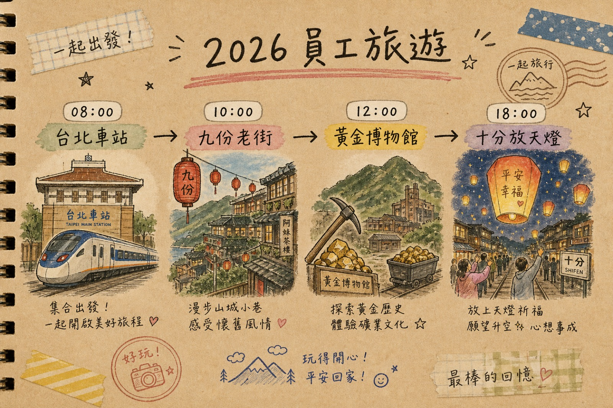

### 🔀 流程圖

- 從表格或文字流程`提取關鍵資訊`，不要整段貼進去讓 AI 自己猜重點
- 對外、對主管用`向量插畫與扁平化設計`，看起來才像正式文件

```prompt [label="從表格提取資訊生成流程圖"]
從下方流程提取出關鍵資訊，用簡單易懂的方式設計為流程圖，讓目標受眾可以快速掌握階段性目標，請使用[向量插畫與扁平化設計]
流程：
1. 收到客戶需求
2. 內部評估可行性
3. 提出報價與時程
4. 客戶確認
5. 交付與驗收
```

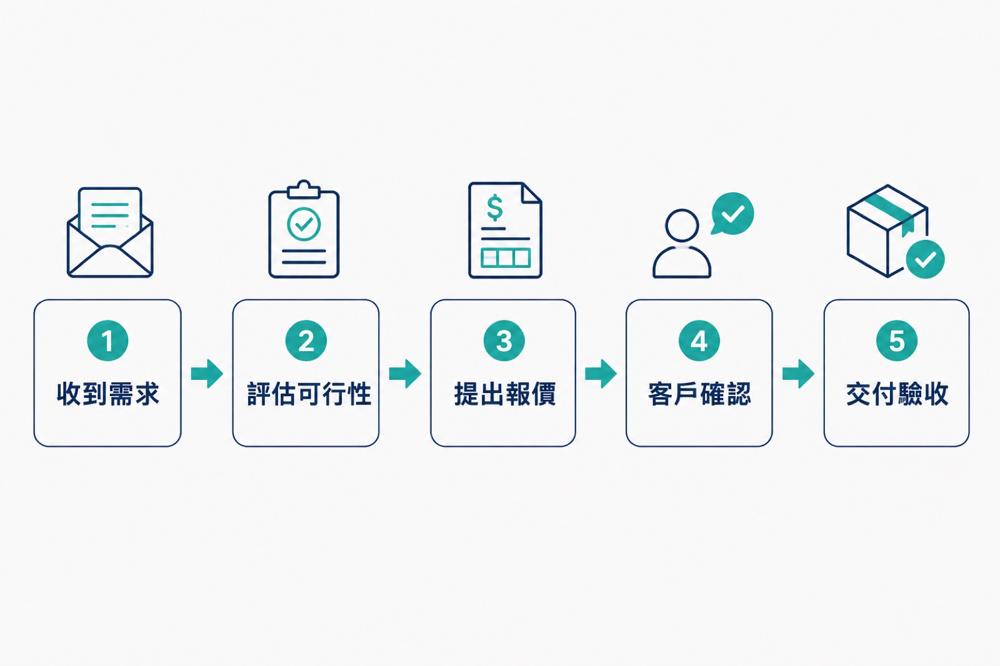

## [ChatGPT] 影片封面圖、藝術圖

### 🎬 影片封面圖

- 內訓影片、YouTube、學習平台縮圖——`16:9`＋`主標題大字`，畫面只留一個視覺焦點
- 中文標題寫進 Prompt 裡，生成後仍要人工核對有沒有錯字

```prompt [label="生成內訓／課程影片封面"]
請生成一張 16:9 的影片封面圖，適合放在[內部學習平台／YouTube]
- 主標題大字清楚，中文不要錯字
- 畫面只留一個視覺焦點，不要資訊過載
- 風格：[科技感、專業、有溫度]
主題：AI 幫你做簡報
```


### 🎨 藝術圖

- 簡報點綴、活動氛圍、社群底圖——`不要文字`，之後才好疊上自己的標題
- 風格寫具體（ex: `水彩、電影光影`），比「漂亮一點」有用

```prompt [label="生成沒有文字的藝術配圖"]
請生成一張有藝術感的插畫，用來當作[簡報點綴／活動氛圍圖]
- 風格：[水彩、電影光影]
- 畫面中不要出現任何文字
主題：黃昏辦公室，陽光穿過百葉窗
```


## [ChatGPT] 食物模擬、產品設計

### 🍜 食物模擬

- 菜單、社群、尚未拍實品的提案——用`商業美食攝影`條件鎖畫質
- 畫面中`不要有文字`，價錢與品名之後自己疊，才不會被 AI 寫錯

```prompt [label="生成超寫實食物攝影"]
請生成一張超寫實的食物攝影，用來當作[菜單／社群貼文]產品圖
- 商業美食攝影、對焦清晰、8k、光影自然
- 畫面中不要有文字
餐點：台灣牛肉麵，紅燒湯頭、筷子、可見蒸氣
```

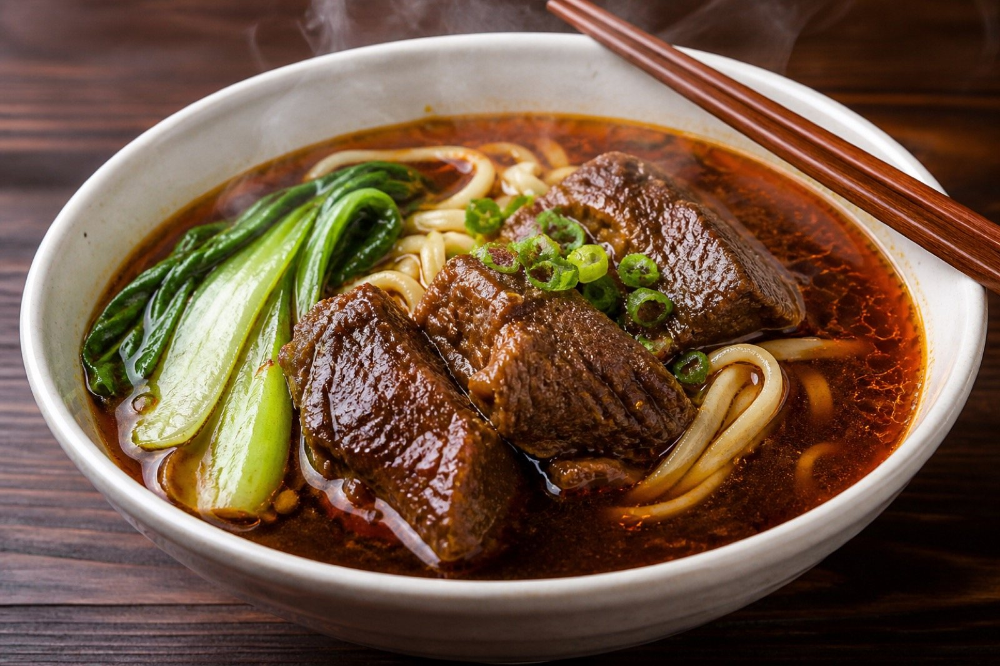

### 🧴 產品設計

- 包裝提案、尚未開模的新品——把`規格與材質`寫進 Prompt，效果圖才站得住
- 延續前面防曬乳案例，同一份產品資訊也能拿來生成包裝圖

```prompt [label="生成產品包裝效果圖"]
請扮演產品設計師，根據下面資訊生成一張[包裝設計效果圖]
- 乾淨背景、商業產品攝影
- 可清楚看出材質、比例與品牌感
產品：
- 名稱：UV Shield Daily 防曬乳
- 規格：50 mL
- 防曬係數：SPF50+ / PA++++
- 包裝：霧面乳白軟管，低調金與鼠尾草綠標籤
```


## 創意圖片九宮格

[html src="html/creative-image-grid.html"]

## 同一段 Prompt，兩個 AI 各生一次

### 🖼️ 本節共用的 Prompt

```prompt [label="根據底圖生成簡報封面"]
請扮演簡報設計師，在了解文案要傳遞的資訊後，根據這張圖生成有高級感的簡報封面。
文案如下：
[貼上文案]
```

```prompt [label="根據活動內容生成海報"]
根據活動內容設計出有質感的海報：
- 背景圖：需符合活動主題，可以有漸層轉換效果
- 文字排版：使用清晰無襯線字體，注重黑白對比來強調層次，並用網格佈局來對齊
- 整體畫面：適當保持留白，文字不要擋住關鍵區域

活動內容：
- 主題：
- 時間：
- 地點：
```

### [ChatGPT] 生成簡報封面與海報

- 直接在對話中貼上 Prompt，也可以附上一張底圖讓 AI 參考


### [Gemini] 用 Nano Banana 生成簡報封面與海報

#### STEP 1：上傳圖片，選擇「建立圖像」

- 選擇「思考型」，中文字才會順利產生


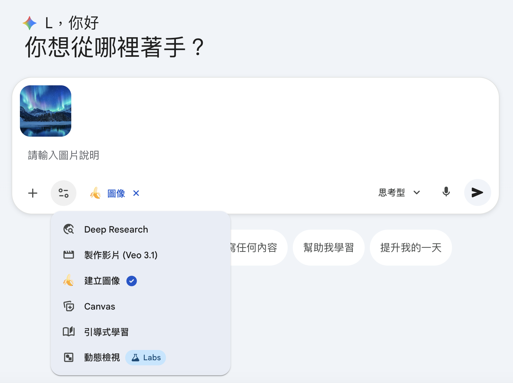

#### STEP 2：輸入提示詞

- 如果發現 Gemini 一直卡住不願意生成圖片，可以直白的說「產生圖片，不要廢話」（[實測連結](https://gemini.google.com/share/065ddd5ee897)）


- 活動海報一樣可以「先提供資訊請 AI 規劃 → 選方案 → 生成」（[實測連結](https://gemini.google.com/share/8c088379f2b8)）

[gallery]
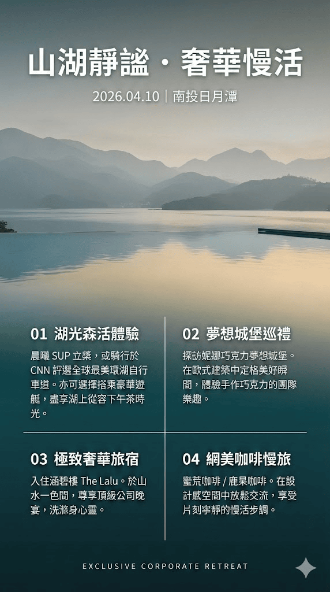
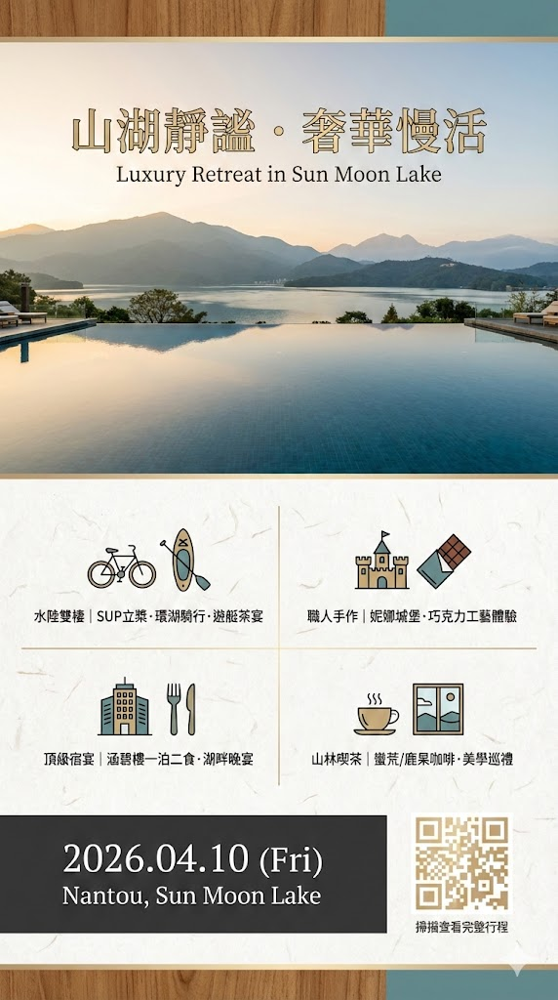
[/gallery]

### 🔍 現場比對：同一段 Prompt，差在哪？

- 比對重點：中文字的正確率、風格傾向、對底圖的還原程度

> **為什麼要兩個都試？**
> 模型各有偏好，同一段 Prompt 會給出不同結果——挑選哪一張，才是你的工作。

## 讓結果更可控的技巧

### 🧷 提供參考圖片

- 上傳一張底圖／風格參考圖，AI 會依照這張圖的構圖、色調來生成新內容
- **改變場景**：「幫我延伸圖片背景，呈現在高級餐廳吃飯的質感，加上適當的光影。超寫實，8k 解析度，商業美食攝影，對焦清晰。」
- **加上文字批註**：「請將我上傳的圖片盡量使用紅色墨水筆或字卡，瘋狂地加上手寫中文批註、塗鴉……」

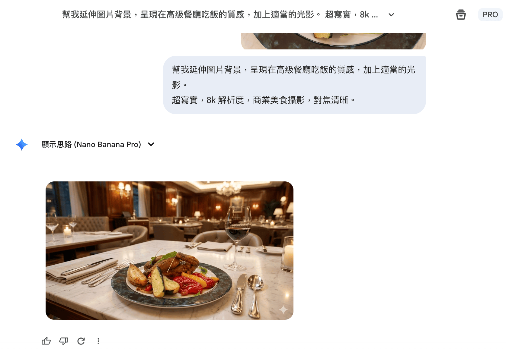

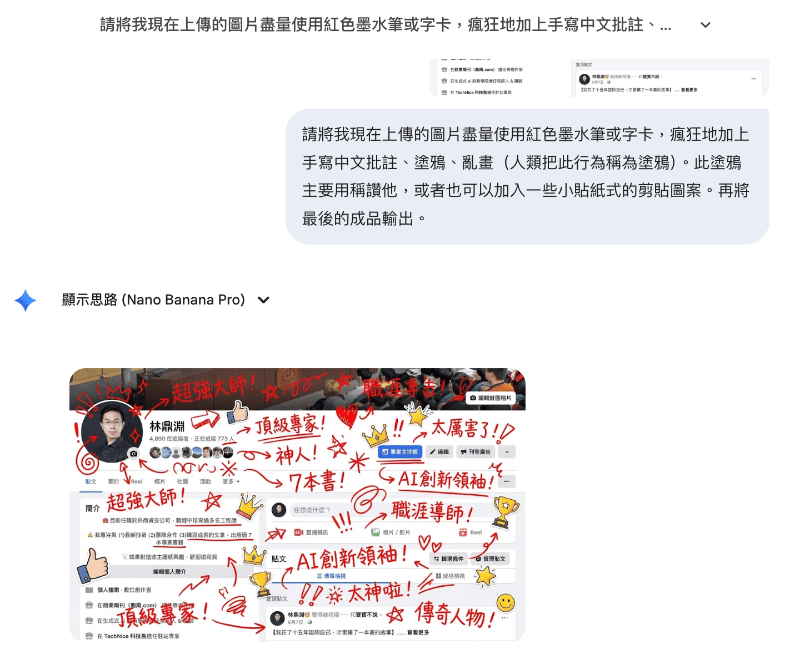

### 🧠 先規劃再生成

1. 提供資料請 AI 協助設計：「請扮演一位資深的簡報設計師，閱讀完下面的內容後，告訴我如何設計有重點、設計感、美觀的簡報封面，盡可能細節規劃 [貼上文案]」
2. 選擇方案請 AI 生成：「使用『提案一』產生圖片，不要廢話」（[實測連結](https://gemini.google.com/share/10ea8999823a)）

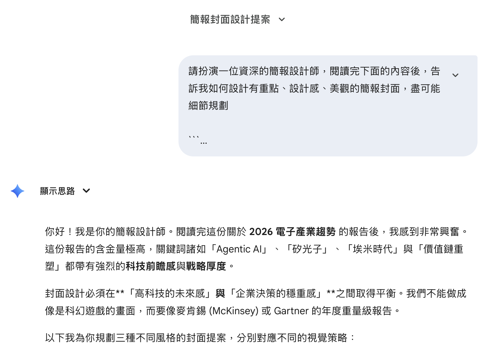


### 🔁 換節慶不用重寫 Prompt

- 節慶賀卡可以用超長 Prompt 控制角色、場景、色彩、構圖、文字（詳見講師提供的端午節黏土風範例）
- 換節慶不用重寫：

```prompt [label="讓 AI 幫你改寫節慶 Prompt"]
請扮演充滿創意、天馬行空的藝術家，幫我將下面的提示詞轉成適合[端午節/中秋節/春節]的內容，人物、場景、物件、風格、光影、氛圍都要調整
```

[gallery]


[/gallery]

[lab-session title="實戰演練" duration="15 分鐘" hint="有問題歡迎提出，你的問題可能是大家的問題"]
- STEP 1：同一段封面 Prompt，分別在 ChatGPT 與 Gemini 生成，比較差異
- STEP 2：上傳一張參考圖，再生成一次
- STEP 3：用對話微調細節
[/lab-session]

---

# 📎 補充資料：Canvas 做 EDM、Google Workspace AI

> 課堂時間不一定講得到，但都是現成可用的流程——回去照講義操作即可。

## 生成網站：Canvas 做出能寄的 EDM

> 活動頁面、EDM 電子報——用 Canvas 生成 RWD 網頁，程式碼貼進 Gmail，就是一封在電腦和手機上都漂亮的信。

### [Gemini] 💌 透過 Canvas 生成網站（可作為 EDM Email）

#### STEP 1：提供參考資訊，選擇 Canvas

```prompt [label="生成 RWD 活動網頁"]
請幫我將下面的活動內容設計為符合 RWD 的網站，排版配色要有設計與高級感，我要作為 EDM 郵件寄出，不要使用複雜的元素，不需要圖片區域

活動內容：
[貼上活動內容]
```

- `RWD`（響應式網頁設計）：同一個網頁在電腦與手機上都會自動調整排版


#### STEP 2：網站產生出來後，選擇「程式碼」

- 裡面的連結都只是默認值，要記得把正確資訊提供給 AI，才會真的跳轉（[實測連結](https://gemini.google.com/share/8e9b28ae424a)）


#### STEP 3：安裝 HTML Inserter for Gmail Chrome 外掛

- 安裝 [HTMail 外掛](https://chromewebstore.google.com/detail/htmail-insert-html-into-g/omojcahabhafmagldeheegggbakefhlh?hl=zh-TW)後，Gmail 右下角會有一個程式碼符號，點擊展開後直接貼上 HTML

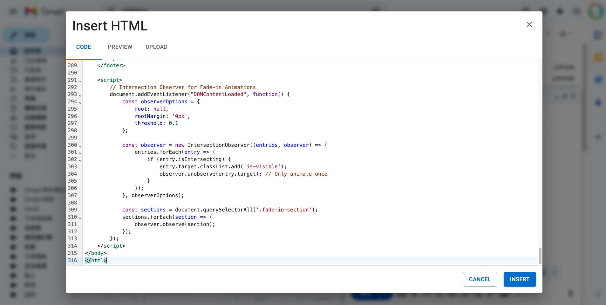

#### STEP 4：這樣收到的信件就會漂亮許多


[image-text position="right" width="24"]
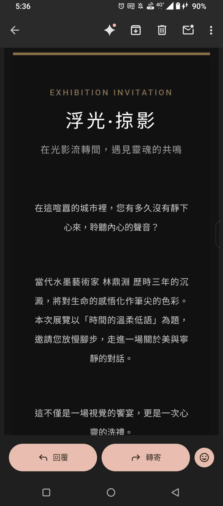
- 因為一開始就要求 RWD，手機打開一樣漂亮
- 收件人不管用電腦還是手機，看到的都是完整排版
- 比起純文字信件，EDM 的點擊意願高出一截
[/image-text]

## Google Workspace AI：把 AI 帶進 Docs、Sheets 與日曆

> 文件草擬、資料整理、跨筆記本問答、行程規劃——不用離開每天都在用的 Google 工作環境，AI 就在你打字的地方待命。

[warning title="⚠️ 開始前，先確認你的帳號看得到 Gemini"]
- 個人 Google 帳號：需訂閱 Google AI 付費方案，免費帳號可能看不到 Gemini 入口
- 公司 Workspace 帳號：需由管理員開通 Gemini 功能
- 介面語言與地區也可能影響按鈕位置——現場找不到按鈕的同學，先與鄰座共用畫面，回去後依上述條件開通
[/warning]

### 📄 Google Docs：生成文件、圖片

#### STEP 1：打開 Google Docs 的 Gemini 對話

- 點擊右上角的 Gemini 圖示，右側會展開對話面板

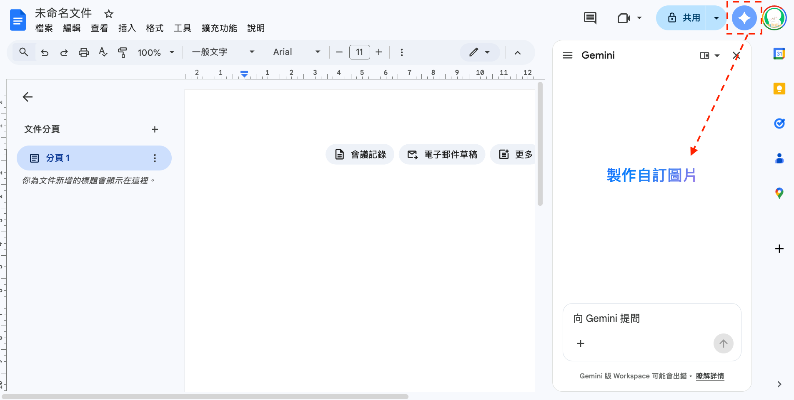

#### STEP 2：輸入需求

```prompt [label="請 Gemini 草擬文件"]
製作一份 Gemini 辦公應用教育訓練的課程
```

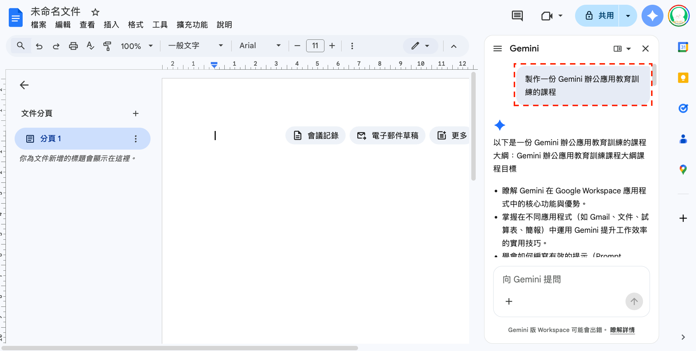

- 確認沒問題後，點擊「插入」就會放進文件中

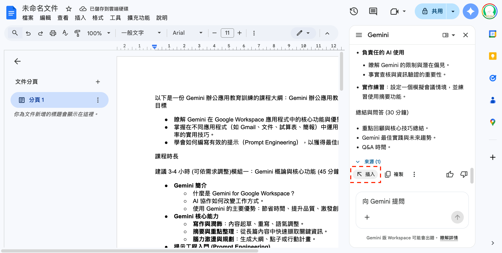

#### STEP 3：生成表格

```prompt [label="把摘要轉成表格"]
將摘要以「表格」呈現，讓我可以快速閱覽內容
```

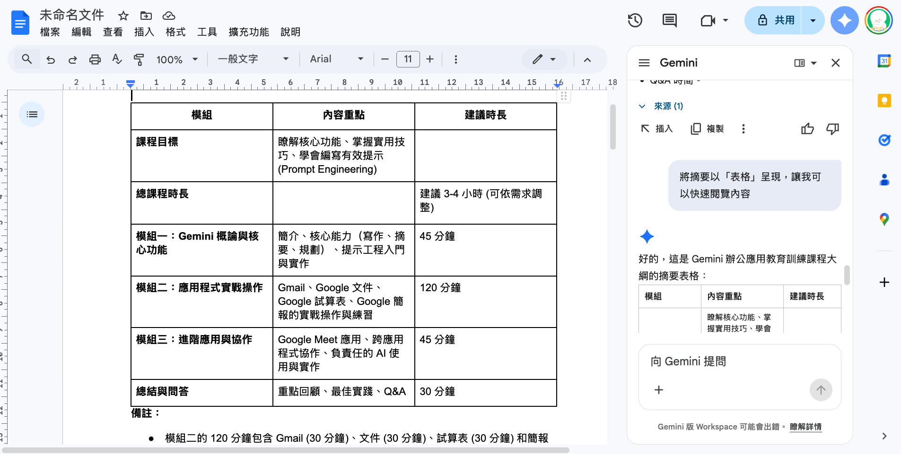

#### STEP 4：生成圖片

```prompt [label="生成文件封面圖"]
幫我生成適合當課程封面的圖片，不要有文字
```

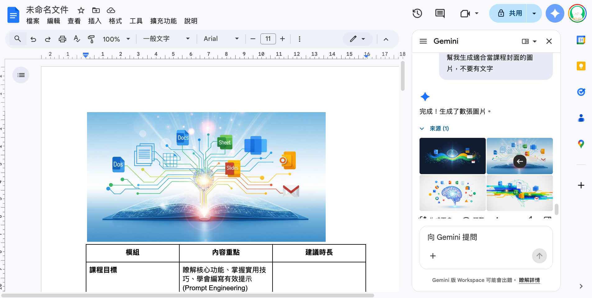

> **為什麼不去 ChatGPT 寫好再貼回來？**
> 因為`來回切換`才是效率殺手——在文件裡直接生成、直接插入，格式不會跑掉，脈絡也不會斷。

### 📊 Google Sheets：整理資料、智慧填充

#### STEP 1：打開 Google Sheets 的 Gemini 對話

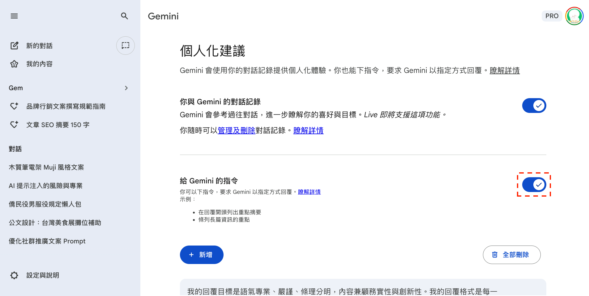

#### STEP 2：輸入需求

```prompt [label="模擬一份客戶名單"]
幫我模擬一份客戶名單，要有「姓名、出生年月日、性別、愛好(1~6個)、居住縣市、居住行政區、Email」等欄位，共 30 名，請使用虛擬而非知名人士的名字
```

- 確認沒問題後，點擊「插入」就會放進試算表中

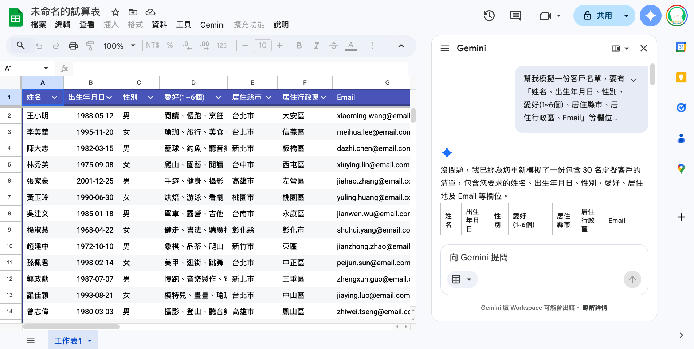

#### STEP 3：視覺化數據

```prompt [label="用函式彙整並生成圖表"]
我想要透過圖表，根據這些資料用函式幫我彙整出下面資訊：
- 年齡分佈
- 性別分布
- 愛好分布
- 居住縣市分布
```

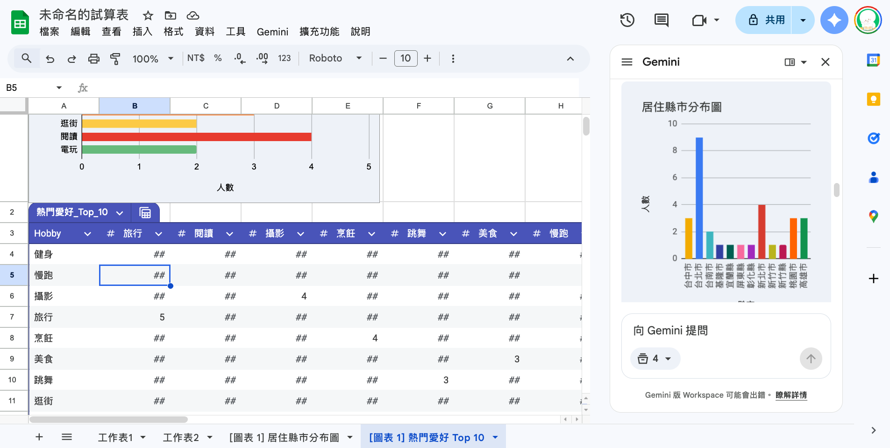

> **模擬資料是最安全的練習場**
> 想練習客戶分析卻不能拿真實個資來玩？請 AI 生一份虛擬名單——餐飲的會員輪廓、製造的客戶清單、服務的滿意度調查，都能安全地演練一遍。

### 🔗 在 Gemini 調用多個 NotebookLM 筆記本

> 第一堂建好的知識庫，在這裡直接派上用場——Gemini 可以同時掛載多個筆記本，做跨知識庫的綜合問答。

#### STEP 1：開新的對話窗，選擇 NotebookLM

- 點擊輸入框左側的「＋」，選單中選擇「NotebookLM」

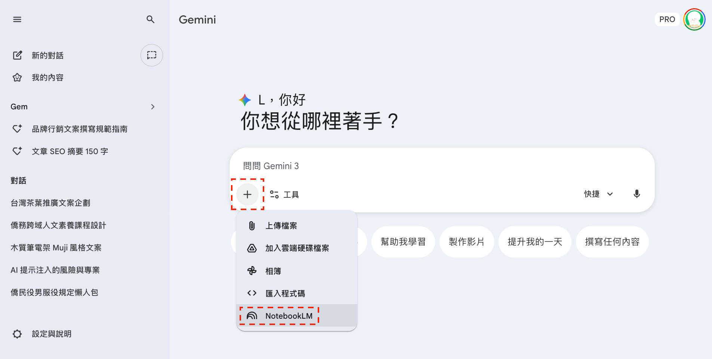

#### STEP 2：選擇要加入的筆記本

- 可以一次勾選多個筆記本，讓 AI 同時參考

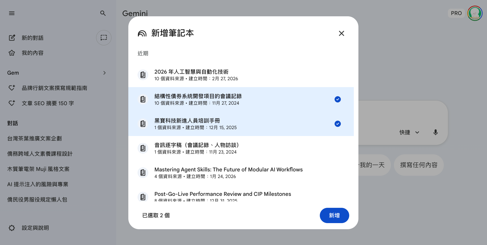

#### STEP 3：提出綜合問題

```prompt [label="跨筆記本的綜合問題"]
根據目前系統開發的方式，新進人員手冊是否需要優化？
```

- 🍜 餐飲：把「門市 SOP」與「顧客評論彙整」掛在一起，問「哪些 SOP 該因應常見客訴調整？」
- 🏭 製造：把「品管規範」與「會議記錄」掛在一起，問「上次會議的製程變更，有沒有牴觸現行規範？」
- 🛎️ 服務：把「服務手冊」與「教育訓練教材」掛在一起，問「新人教材有沒有跟上最新的服務流程？」

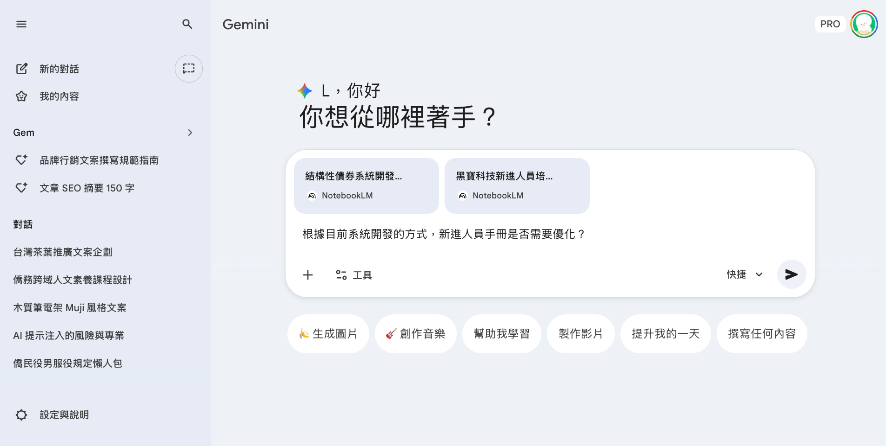

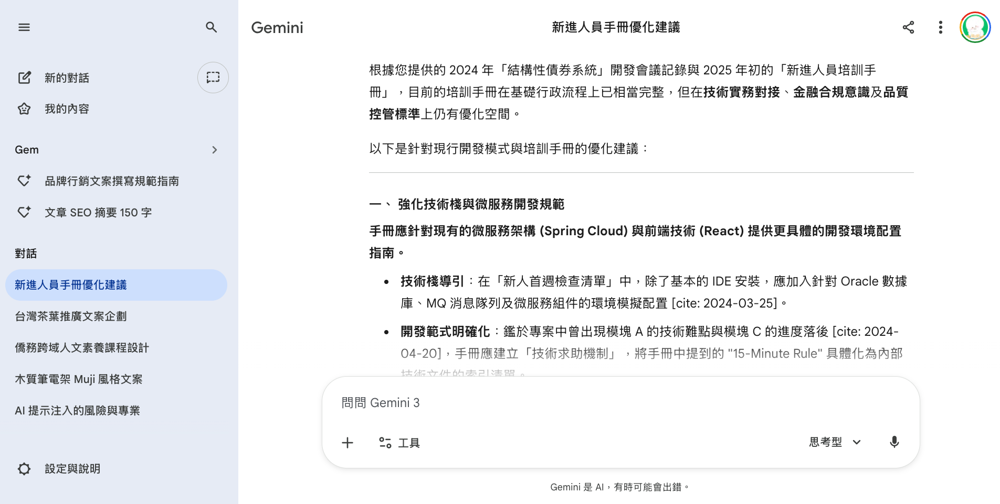

> **單一筆記本是「查資料」，多筆記本是「做判斷」**
> 把會議記錄與規範手冊放在一起問，AI 才能幫你發現「文件之間的落差」——這是翻文件翻不出來的洞察。

### 🗓️ 在 Gemini 規劃 Calendar 行程

#### STEP 1：開新的對話窗提出讀取行程需求

- 第一次使用需要開啟日曆的存取權限

```prompt [label="讀取現有行程"]
三月份目前有哪些會議、課程要處理
```

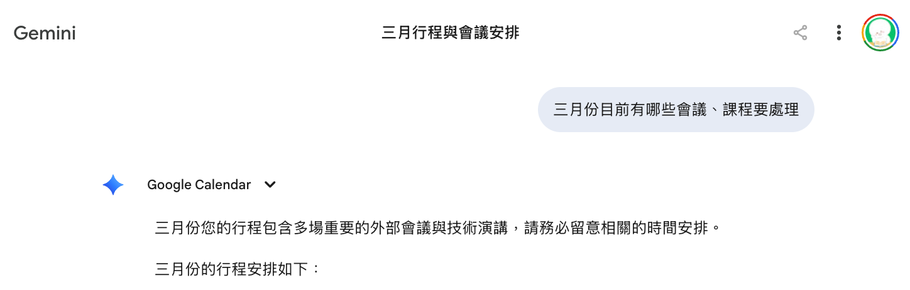

#### STEP 2：可以直接透過與 AI 對話來新增行程

```prompt [label="摘要影片內容並寫入日曆"]
我在 3/13 號下午 3-4 點需要在公司內舉辦技術分享，主題是之前在 YouTube 分享的影片，幫我摘要內容大綱後用陳述句寫入 Google 日曆說明，字數 100 字內。
[貼上影片連結]
```

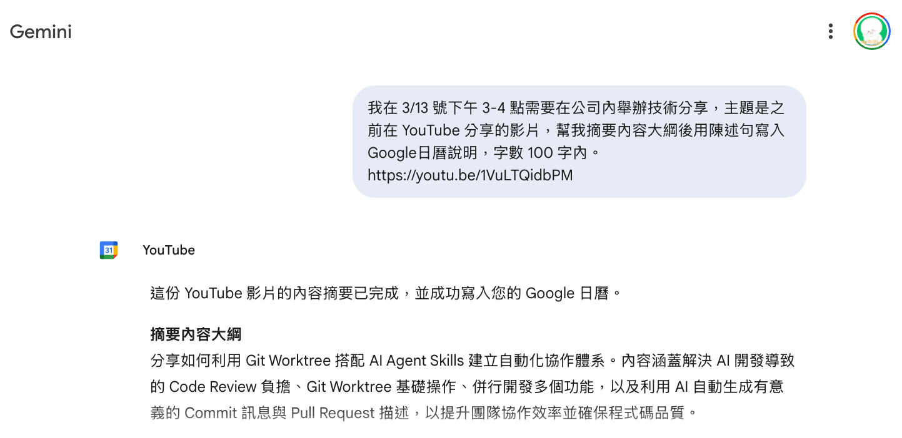

#### STEP 3：前往 Google 日曆確認有順利新增

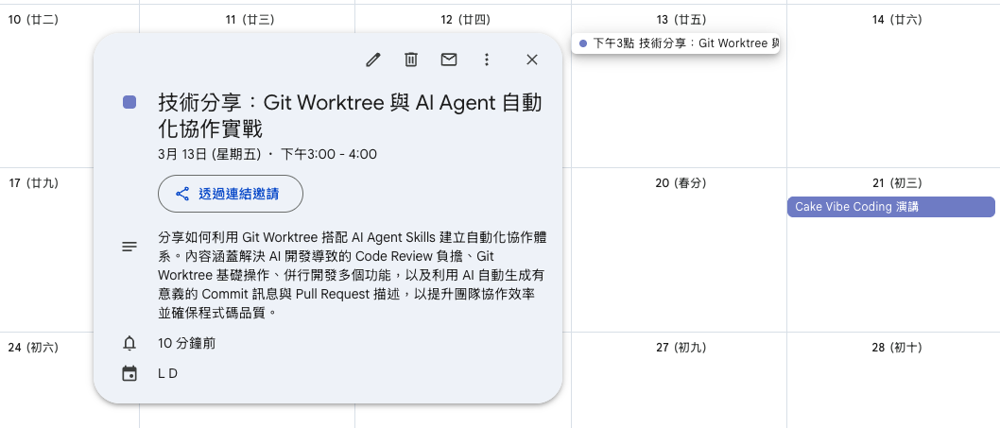

#### STEP 4：初步規劃旅遊行程也是可以的

```prompt [label="規劃旅遊行程並直接寫入日曆"]
我預計 5 月份要到日本東京旅遊，時間在 5/18~22
請幫我規劃旅遊行程，人數為 2 人，以中午到晚上行程為主，每個點的地址要確定
標題為「地點 + 大眾工具的搭乘方式」
完成後直接寫到日曆中
```

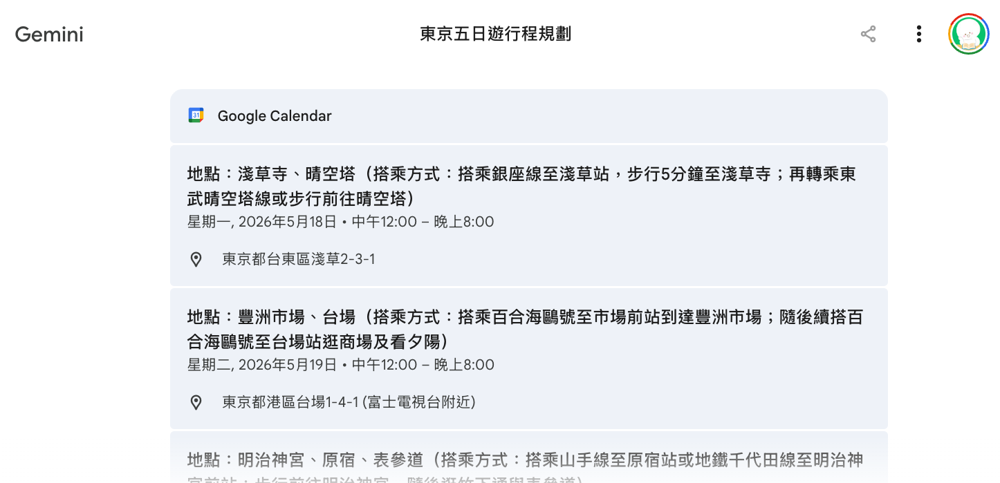

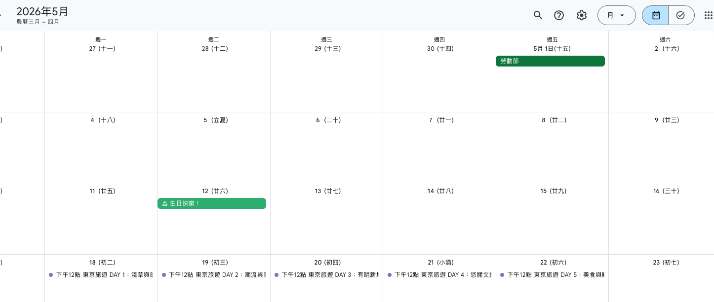

[warning title="⚠️ 小提醒"]
- 目前寫入「說明」的功能還不是很穩定，寫入後記得到日曆確認一遍
[/warning]

[lab-session title="回家練習" duration="10 分鐘" hint="有問題歡迎提出，你的問題可能是大家的問題"]
- STEP 1：在 Google Docs 用 Gemini 生成一份文件（企劃、公告、活動說明皆可），並插入表格與封面圖
- STEP 2：在 Google Sheets 生成一份模擬名單，請 AI 用函式彙整出分佈圖表
- STEP 3：在 Gemini 掛載第一堂建立的 NotebookLM 筆記本，提出一個綜合問題
[/lab-session]

---

# 結語：AI 時代的生存心法

> 工作並不會因為 AI 工具的出現而消失，但會因為 AI 工具的出現而改變。

## 五個心法

### 🧑‍⚖️ 只有專業人士，才有能力判斷對錯

- AI 已經達到「初階能力」的全才
- 除非真的了解背景知識，否則並沒有判斷 AI 答案對錯的能力

> **如果你過去從來沒有積累呢？**
> 那你要拿什麼判斷 AI 答案的好壞與正確性？AI 給了你一份看起來很專業的報告，你連它錯在哪都看不出來。

### ⚖️ AI 所導致的兩極化

- AI 是幫你開外掛，還是大腦外包？
- 想把事情做好的人，會做得更好
- 只想應付交差的，會快速墮落

> **不是 AI 做不到**
> 它只是誠實地`放大你的混亂`罷了——你的思路清晰，它放大你的清晰；你的需求混亂，它也如實放大那份混亂。

### 🎓 「因為你不是專家，所以我才找你當老師」

> **這句話聽起來荒謬，卻是 AI 時代的真實心態**
> 有人覺得 AI 什麼都會，專家不再必要——但沒有專家把關，你連 AI 錯在哪都不知道。

### 🎮 AI 可以突破能力範圍，但你對結果有掌控性嗎？

- 結果有「對錯」之分嗎？
- 我們有對作品的「鑑賞」能力嗎？
- 不滿意的地方，有辦法調整嗎？

### 🏔️ 站在巨人的肩膀，不代表自己就是巨人

- 如果沒打好根基，會更早遇到瓶頸（ex: Vibe Coding）
- 發生意外時，沒有收拾的能力
- 遇到挫折時，會更容易放棄

> **AI 解決不了的，都是中高階問題**
> 擁有專業知識的人，才能夠如臂使指；知道什麼是「好」，才有評斷標準。

[summary]
- 📝 **企劃七步驟** | 用角色切換與紅藍隊攻防，把「幫我寫企劃」的平均值變成能上台的版本
- 🤝 **Skill** | 打包對話成 Skill，換個主題一鍵重現，還能帶到 Gemini、Claude 跨平台使用，也能匯入別人的 Skill
- 🖼️ **Gamma** | Markdown 一鍵變簡報，圖片、卡片結構、智慧圖表都能調
- 🎞️ **AI 直接生成簡報** | ChatGPT 直接生成是圖片、Claude Skill 才可編輯，也能上傳公司模板照版型輸出
- ✨ **生成圖片** | 懶人包、行程、封面、產品圖都能生；同一段 Prompt 丟給兩個 AI 比對，給參考圖讓結果更可控
- 🛡️ **資安意識** | 匯入第三方 Skill 前先看發佈者與 Star 數，機密資訊不上傳給 AI
[/summary]

[qa-session title="Q&A 時間"]
[/qa-session]
