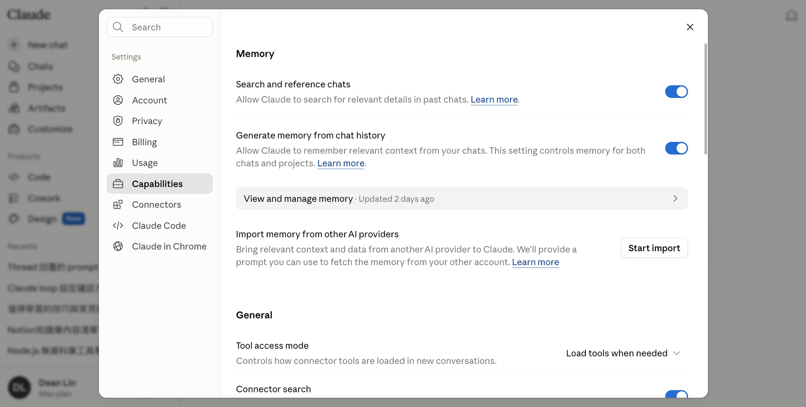
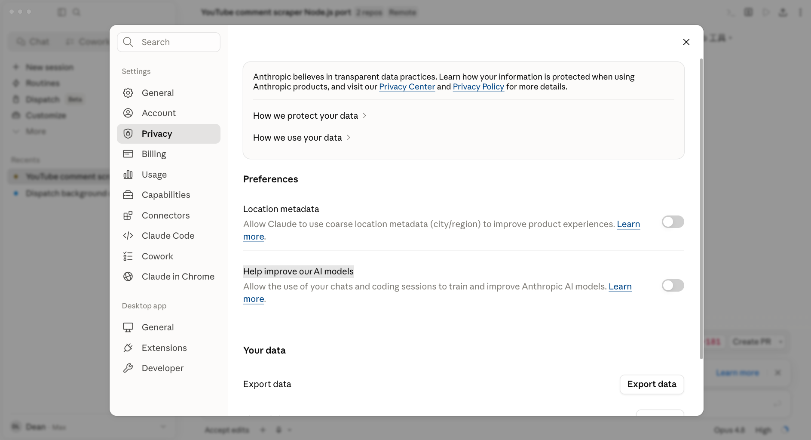
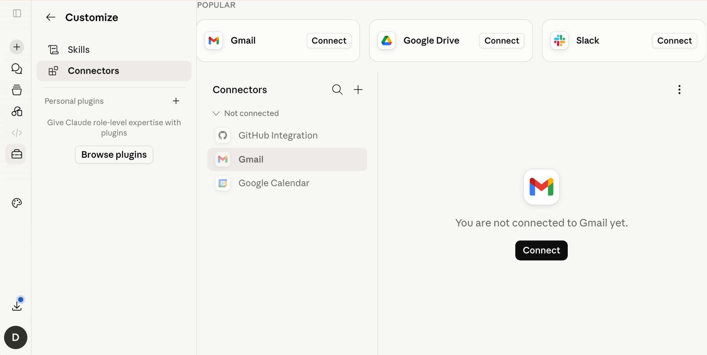
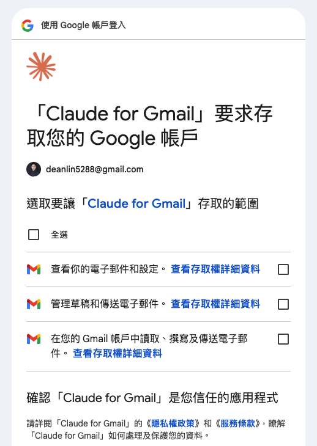

# 起手式：AI 的能力，取決於你給它哪些工具

> **為什麼別人的 AI 比我的強？**
> 不管使用的是 ChatGPT、Claude、Gemini，如果僅用聊天視窗與 AI 對話，那遠遠`無法發揮它的潛力`。

## 企業買了付費版，但員工使用率不高、成效不明顯

> **想讓 AI 落地，先讓大家看見案例**
> 只有實戰演練，才會知道`可以這樣做`，否則大部分的人僅使用基本的**對話功能、做重複的事**。
> 所以這堂課不只我做，也會讓大家實際動手。

### 🤔 痛點 1: 每一個 Prompt 都要重新交代

為了有**更好的品質**，每次開啟新對話與 AI 討論時，都要提供`背景資訊`，比如：

[flow]
1. **角色扮演** - 你是熟悉台灣中高端生活風格的社群行銷文案專家，擅長撰寫 KOL 體驗分享文，語氣真實有溫度，不像廣告
2. **背景資訊** - 品牌「黑寶科技」主打靜音馬達與零重力舒展技術，售價 NT$98,000，目標客群為 35–55 歲注重身體保養的上班族與家庭主力決策者，禁用「最強」「第一」「保證」等涉及不實廣告的字眼
3. **輸出結構** - 開頭用個人體驗情境帶入、中段呈現 2–3 個功能亮點、結尾加上 CTA 與 3–5 個 hashtag，全文控制在 500 字內
[/flow]
```prompt [label="寫提示詞需要花很多力氣"]
你是一位熟悉台灣中高端生活風格的社群行銷文案專家，擅長撰寫 KOL 體驗分享文，語氣真實、有溫度，不像廣告。

品牌：黑寶科技按摩椅
主打技術：靜音馬達、零重力舒展
售價：NT$98,000
目標客群：35–55 歲，注重身體保養的上班族與家庭主力決策者
禁用字：「最強」「第一」「保證」（涉及不實廣告）

請幫我寫一篇 KOL 體驗分享文：
- 開頭：用真實體驗情境帶入（例：下班腰痠、長途出差後的疲憊）
- 中段：自然帶出 2–3 個功能亮點
- 結尾：加上 CTA 與 3–5 個 hashtag
- 全文控制在 500 字內，語氣像真人分享而非業配
```

### 🤔 痛點 2: 生成結果不穩定、需要多次引導

[flow]
- **需要多次引導** - AI 第一次給出的結果通常`無法直接使用`，需要`多輪對話`才能到位；但關閉對話後，新對話窗又要**重頭磨合**。
- **受過去交談內容影響** - 討論不同主題如果`沒開新對話窗`，AI 也會`精神錯亂`；比如前面請他「寫正式的合約信」，後面又要求「生成按摩椅 KOL 文」，AI 回應品質會下降。
- **規則不夠明確** - 語言是模糊的，比如前面要求`語氣自然、不像業配`，但自然的`定義`是什麼？沒有明確的「句型範例」，每次 AI 生成的結果就像是抽獎。
[/flow]

> **提示詞很重要，但不是全部！**
> 現在 AI 回答問題時，會參考過去你跟他的`聊天記錄`。
> **操作路徑**: 左下角頭像 → Capabilities → Memory



### 🤔 痛點 3: 需要自己複製貼上動手操作

[flow]
- **Gmail 信件** - 要把信件內容複製貼給 AI 讀，AI 給出回覆建議後，還得自己切回信箱貼上內容再送出。
- **Notion 知識庫** - AI 幫你把一篇文章整理成重點摘要，但要建成知識庫，還是得自己開 Notion、新增頁面、一段段貼上、設分類標籤
- **Excel 填寫** - AI 告訴你該填什麼，但表單的欄位、公式、格式設定還是得自己動手。
[/flow]

> **人類比 AI 更像機器人**
> 人類的價值在於`決策`，而不是這些`瑣碎、重複`的任務上
> **如果這些痛點讓你感到共鳴，相信這堂課可以給您帶來幫助。**

## 了解使用時機、合作方式

### 🧭 使用時機

| 你做的事 | 使用 | 一句話搞懂 |
| --- | --- | --- |
| 讓 AI 讀我的 Gmail / 行事曆 / Notion | `Connector` | 給它「眼睛跟手」去碰你的工具 |
| 不想每次重講背景、品牌、語氣 | `Project` | 給它「參考資訊」與身分設定 |
| 把一套有效流程變成一鍵重複 | `Skill` | 給它「SOP 手冊」照步驟做 |
| 讓它真的去整理檔案、產出成品 | `Cowork` | 給它「工作桌」自己動手 |

### 🆚 Cowork vs Claude Code

- **Cowork** — 處理`電腦檔案`，適合可`重複執行`的桌面工作流程。
- **Claude Code** — 處理`程式專案`，偏向開發工具，建議搭配 `GitHub` 進行版本控制

> **Claude Code 能完成 Cowork 的所有任務**
> 儘管 Claude Code 更加萬能，但也代表`更加危險`。
> 如果沒有程式背景，當 AI `詢問權限、執行腳本`時，大多數人都會「接受」而非「確認」；只要搞錯`一次`就可能出現**資安危機或是電腦格式化**。

### 🔒 調整隱私權限

**操作路徑**: 左下角頭像 → Privacy → 將「Location metadata、Help improve our AI models」關閉




[lab-session title="🛠️ 實戰演練" duration="3 分鐘" hint="調整隱私權"]
- 在設定將「Location metadata、Help improve our AI models」關閉
[/lab-session]

---

# 串接日常工具：透過 Connector 讓 AI 長出眼睛和手
> 授權連接 Gmail、Google Calendar、Notion——一個主題搭一個實作，邊學邊做

## Gmail：整理信件、設計回信草稿

> **信箱爆炸，重要的信被淹沒**
>
> - 垃圾信、電子報、廣告太多，真正`要回的信被埋在下面`
> - 刪除信件太繁瑣，`容量快速耗盡`
> - 廣告一直來，卻懶得一封封`設定封鎖`

### 📥 讓 AI 幫你整理郵件、加標籤、設黑名單

#### 將 Gmail 加入 Connector

**操作路徑**: Customize → Connectors → 選擇 Gmail 點擊「Connect」





#### 整理郵件、加標籤、設黑名單

[flow]
1. 建立標籤 — 根據內容分出「重要、歸檔、刪除」
2. 廣告黑名單 — 找出重複的廣告寄件者，產出封鎖／篩選器清單
[/flow]

```prompt [label="整理 Gmail 信件"]
幫我整理 Gmail 信件夾
1. 閱讀信件後，根據內容建立「重要、歸檔、刪除」的標籤
2. 找出常寄廣告／電子報的寄件者，整理成一份可加入黑名單的清單
刪除或封鎖前先給我清單確認，不要直接執行。
```

[lab-session title="🛠️ 實戰演練" duration="10 分鐘" hint="整理你的 Gmail"]
- 在 Connector 授權連接你的 Gmail
- 套用上面的 Prompt，讓 AI 整理信件
- 可以透過標籤快速移除、封鎖信件
[/lab-session]

## 主題二：Google Calendar 寫入行程與參考資訊

> **痛點：資訊散落，行程要「貼來貼去」**
>
> - 會議時間在 Email、地點在訊息、連結在另一個頁面，建一個行程要切好幾個視窗
> - 手動複製貼上，常常漏帶會議連結或議程
> - 想找空檔還要自己一格一格看

### 📅 解法：一句話把零散資訊變成完整行程

[flow]
1. 直接生成事件 — 把一段 Email／訊息丟給它，自動抽出時間、地點、與會者
2. 帶入參考資訊 — 把會議連結、議程、注意事項一起寫進事件說明
3. 查空檔安排 — 問它哪個時段有空，直接幫你卡位
[/flow]

```prompt [label="把資訊轉成行事曆事件"]
這是一封會議邀請信（我貼在下面），請幫我在 Google Calendar 建立事件：
- 自動抓出日期、時間、地點
- 在事件說明裡附上會議連結與議程重點
- 如果時間和我現有行程衝突，先提醒我

（在此貼上信件或訊息內容）
```

[lab-session title="🛠️ 實戰演練 3：把散落資訊變成一個行程" duration="15 分鐘" hint="體會「不用再切視窗複製貼上」的差別"]
- 授權連接你的 Google Calendar
- 找一段含時間、地點、連結的 Email 或訊息，貼給 Claude
- 讓它建立行事曆事件，並把參考資訊寫進事件說明
- 再問它「我下週哪天下午有 2 小時空檔可以開會？」
[/lab-session]

## 主題三：讀取 Notion 知識庫，限定範圍搜尋

> **痛點：知識分散，不知道答案藏在哪一頁**
>
> - 資料寫在 Notion，但跨好幾頁，要找一個答案得翻半天
> - 不確定哪頁是最新的，怕引用到過期資訊
> - 希望 AI 只在「指定範圍」內找，而不是亂猜

### 📚 解法：連接 Notion，限定範圍問答並附出處

[flow]
1. 限定範圍 — 指定某個頁面或資料庫，AI 只在這個範圍內搜尋
2. 問答式查找 — 用白話問問題，讓它回答並附上來源頁面
3. 彙整輸出 — 請它把散落的重點整理成一張表或摘要
[/flow]

```prompt [label="在指定 Notion 範圍內查資料"]
請只在我提供的這個 Notion 頁面範圍內搜尋（不要用其他來源）：
① 回答我的問題，並附上你引用的頁面標題
② 如果範圍內找不到答案，直接說「範圍內查無資料」，不要自己編

我的問題是：（在此輸入你的問題）
```

> **講師會提供一個公開的 Notion 連結**，讓大家在同一個範圍內練習，不需要先有自己的知識庫。

[lab-session title="🛠️ 實戰演練 4：在公開 Notion 知識庫裡找答案" duration="15 分鐘" hint="使用講師提供的公開連結，重點在「限定範圍、附出處」"]
- 連接講師提供的公開 Notion 連結
- 用 Prompt 問一個問題，要求它「只在這個範圍內」回答並附出處
- 故意問一個範圍外的問題，看它會不會誠實說「查無資料」
- 請它把找到的重點，彙整成一張摘要表
[/lab-session]

[tags]
- [orange] 授權連接 = 給 AI 讀寫你資料的權限
- [orange] 守住最小權限原則，刪除／封鎖類操作一定要人工把關
[/tags]

---

# 建立專屬知識庫（Project）：不必每次重講背景
> 把品牌指南、產品資訊放進專案，設定角色與語氣，建立一個「已經懂你」的分身

## 痛點：背景每次重講，品質還不穩定

> **不同情境，要建立不同的 Project**
>
> Project 不是只開一個。寫文案的你，需要一個「懂品牌語氣」的分身；管專案的你，需要一個「記得規格與決策」的第二大腦。情境不同，放進去的知識庫就不同——這一節我們各建一個，附現成範例檔讓你直接套。

## Project 三層架構：一次設好，終生受用

### 🗂️ 把東西放對層級

- **第①層 指令** — 我是誰、語氣偏好、固定規則（角色、Do/Don't、輸出格式）
- **第②層 知識庫** — 長期固定資料，所有對話共用（指南、規格、範本、決策日誌）
- **第③層 對話** — 每天的單次任務（寫一則貼文、查一個結論）

> **核心心法：重複性的放指令／知識庫，單次性的留在對話**
>
> 關鍵提醒：Project 內各對話之間「記憶不互通」，重要設定一定要放在第①②層。
>
> 實測效果：從每次打 500 字背景，簡化到一句話接續任務，一個月省下 10 小時以上。

## 場景一：品牌文案 Project — 寫出「對調性」的文案

> **痛點：每次寫貼文都要重貼一遍品牌指南**
>
> - 語氣時鬆時緊，三個人寫出三種品牌個性
> - 新人不知道禁用詞、記錯產品價格，文案一改再改
> - 每次都要把品牌調性、產品資訊、好壞案例重貼一次

### 🎨 三層怎麼放（用範例檔對照）

- **指令層** — 貼上品牌語氣規則（角色、語氣 Do/Don't、輸出格式）
- **知識庫層** — 上傳品牌指南、產品資訊、文案範本與案例
- **對話層** — 每天只要說「幫我寫耶加雪菲到貨的 IG 貼文」

[download dir="brand-copywriting" label="下載「品牌文案 Project」範例包" desc="品牌指南、產品資訊、文案好壞案例、可直接貼的指令設定（解壓即用）"]

[lab-session title="🛠️ 實戰演練 5：打造品牌文案 Project" duration="20 分鐘" hint="把範例包四份檔案放進對應層級，感受「一句話就出稿」"]
- 下載範例包並解壓，新建一個 Project
- 把「Project-指令設定.md」內容貼進指令層
- 把品牌指南、產品資訊、文案範本三份上傳到知識庫層
- 開對話只說「幫我寫耶加雪菲到貨的 IG 貼文」，看它有沒有自動對齊語氣
- 故意問一個知識庫沒寫的品項價格，驗證它會不會誠實說「沒有資料」
[/lab-session]

## 場景二：專案記憶 Project — 記住規格與決策，隨時回憶

> **痛點：「我們當初為什麼這樣決定？」沒人記得**
>
> - 專案跑三個月，規格、會議結論、決策散落各處
> - 新人接手要翻三個月的訊息與文件
> - 反覆爭論早就拍板的事，只因為沒人記得理由

### 🧠 三層怎麼放（用範例檔對照）

- **指令層** — 設定成「專案記憶助理」：回答以文件為準、要附出處、找不到就說沒有
- **知識庫層** — 上傳專案規格書、會議記錄、決策日誌
- **對話層** — 隨時問「上次會議待辦有哪些」「為什麼放棄 LINE 登入」

> **進階：用決策日誌（Decision Log）留住「為什麼」**
>
> 複雜決定的當下，順手記一筆：決策、理由、取捨、重新評估時機。範例包裡的「決策日誌.md」就是現成格式，照抄即可。

[download dir="project-memory" label="下載「專案記憶 Project」範例包" desc="專案規格書、會議記錄、決策日誌、可直接貼的指令設定（解壓即用）"]

[lab-session title="🛠️ 實戰演練 6：打造專案記憶 Project" duration="20 分鐘" hint="重點在「回答要附出處、找不到要誠實說沒有」"]
- 下載範例包並解壓，新建一個 Project，貼上指令設定
- 把規格書、會議記錄、決策日誌上傳到知識庫層
- 問它「2026-04-19 會議的待辦有哪些？負責人是誰？」，看它能否附出處
- 問「我們為什麼第一版不導入 ML？」，驗證它會引用決策日誌 D-001
- 問一個文件沒寫的問題，確認它說「目前文件沒有記錄」而不是亂編
[/lab-session]

---

# 把好方法變成 SOP（Skill）：降低新人上手成本
> 將驗證有效的工作流固化為可重複執行的 Skill，讓流程改善一次、全員受惠

## 痛點：流程都在某個人腦袋裡

> **最會用 AI 的人請假，整條線就卡住**
>
> 新人「教學」靠口耳相傳，每個人做出來的品質還不一樣。單靠工程師一個個實作工作流，耗資源又無法規模化；真正能擴散的，是把流程「模組化」讓全公司複用。

## 不是並列，是把「行動層」疊在 Project 上

### 🔁 Project 給知識，Skill 給流程，相加才完整

- **Project = 讓 AI「知道事實」** — 你是誰、品牌規範是什麼（就是模組三那兩個知識庫）
- **Skill = 讓 AI「知道步驟」** — 在這個知識庫上，固定第一步、第二步怎麼做
- **相加 = 在你的知識庫裡，每次都用同一套對的流程做事** — 不換題目，直接幫剛建好的 Project 長出專屬 SOP

> **關鍵差別：同一句「幫我寫到貨貼文」**
> 只有 Project，靠背景隨機發揮；加上 Skill，每次都固定跑完「撈資料 → 套語氣 → 產三版 → 檢查禁用詞」四步。Skill 把「這個知識庫該怎麼用」固化下來。

[tags]
- [purple] 不換題目：直接拿模組三建好的 Project，長出它的專屬 SOP
- [purple] 流程改善一次，改 Skill 即可，全員受惠
[/tags]

### 📄 SKILL.md 五個欄位：把流程寫死

一個 Skill 就是一份 `SKILL.md`，固定五個欄位：**觸發時機 / 輸入 / 步驟 / 輸出格式 / 注意事項**。關鍵在「輸入」與「注意事項」都指向 Project 知識庫——讓流程跑在你的事實上，而不是 AI 的想像上。

### 範例一：延續「品牌文案 Project」→ 一鍵出稿 SOP

```prompt [label="SKILL.md：新品到貨貼文"]
# Skill 名稱：新品到貨 IG 貼文

## 觸發時機
當我說「幫我寫 ⟨品項⟩ 到貨貼文」時使用。

## 輸入
只給品項名稱；風味、價格、產地一律從 Project 知識庫取得，不要自己編。

## 步驟
1. 從知識庫撈出該品項的產品資訊
2. 依品牌語氣規則寫出三個版本（情境、產品力、限時行動）
3. 逐字檢查有無誤用禁用詞，違規就重寫
4. 每版標出建議 hashtag 與發文時段

## 輸出格式
三個版本並排，每版附「主打點」一句，最後附禁用詞自查結果。

## 注意事項
價格、產地以知識庫為準；查無資料就停下來問我，不要臆測。
```

### 範例二：延續「專案記憶 Project」→ 自動歸檔 SOP

```prompt [label="SKILL.md：週會記錄歸檔"]
# Skill 名稱：週會記錄歸檔

## 觸發時機
當我貼上會議記錄、說「歸檔這次週會」時使用。

## 輸入
本次會議的逐字記錄或筆記（我會貼上）。

## 步驟
1. 抽出待辦事項，每項標出負責人與截止日
2. 比對知識庫既有決策日誌，標記「沿用」或「推翻舊決策」
3. 若有新的重大決定，依「決策日誌.md」格式產出一筆 D-xxx 草稿
4. 列出與既有規格書衝突之處，提醒我確認

## 輸出格式
① 待辦清單（含負責人／截止日）② 決策變動 ③ 新增決策日誌草稿

## 注意事項
結論需對齊知識庫；找不到依據就標「待確認」，不要自行裁定。
```

### 範例三：Connector + Project + Skill 三合一 → 自動歸檔知識庫

> **這是把三個模組串起來的招牌示範**
>
> 建一個「知識庫管家 Project」，它的**指令層**寫死一條前置規則：看到連結就自動跑歸檔 Skill；Skill 再透過 Notion 連接器把整理好的知識卡寫進指定資料庫。你只要丟連結，剩下全自動。

[flow]
1. 貼上連結 — 你只丟一個網址，不用多說
2. Project 觸發 — 指令層的前置規則自動呼叫「連結轉知識卡」Skill
3. Skill 跑流程 — 讀取內容、摘要、分類、配標籤
4. Connector 寫入 — 透過 Notion 連接器新增一筆，回報頁面連結
[/flow]

先在 Project 指令層放這條前置規則，讓「貼連結」本身就是觸發動作：

```prompt [label="知識庫管家 Project：指令層前置規則"]
你是我的知識庫管家。

只要我貼上任何網址（不用多做說明），就自動執行「連結轉知識卡」Skill：
讀取內容 → 整理成知識卡 → 寫進我的 Notion 知識庫。

寫入前先把要存的欄位列給我確認，我點頭再寫。
```

再把這個會呼叫 Notion 的 Skill 寫好：

```prompt [label="SKILL.md：連結轉知識卡並歸檔 Notion"]
# Skill 名稱：連結轉知識卡

## 觸發時機
當我貼上一個網址時自動使用（已由 Project 指令層設定）。

## 輸入
一個網址（文章、影片、貼文皆可）。

## 步驟
1. 讀取連結內容，抽出標題、三點摘要、關鍵標籤
2. 對應知識庫既有分類；找不到對應就建議新分類並先問我
3. 透過 Notion 連接器，在指定資料庫新增一筆：標題／摘要／標籤／原始連結／日期
4. 回報「已歸檔到 ⟨分類⟩」與該頁連結

## 輸出格式
一句話確認＋ Notion 頁面連結，附三點摘要供快速回顧。

## 注意事項
寫入前先顯示欄位讓我確認；同一連結已存在就提醒、不重複建立。
```

[tags]
- [purple] Connector 給手、Project 給觸發、Skill 給流程——三者相加才有「丟連結就自動歸檔」
- [orange] 寫入類動作守住人工把關：先看欄位再核准
[/tags]

## 資安：Skill 是「可執行的指令」，不能亂裝

> **不經驗證的 Skill，就像把生產環境的鑰匙亂發**
>
> 從社群或市集下載的 Skill 可能藏有提示注入、資料外洩、權限提升等風險。

### 🛡️ 對策：內部審核 + 外部掃描

- **SkillSpector**（NVIDIA 開源）：掃描 64 種漏洞模式 + LLM 語意分析
- 能揪出「表裡不一」的指令（聲稱在總結 Log、實際在偷傳資料），給 0–100 風險評分
- 企業導入原則：內部 Skill 要有審核機制，外部 Skill 先掃描再用

[lab-session title="🛠️ 實戰演練 7：幫你的 Project 長出一個 Skill" duration="20 分鐘" hint="不換題目——直接拿模組三建好的 Project 加上 SOP"]
- 挑模組三建好的一個 Project（品牌文案 或 專案記憶）
- 想一件你在這個 Project 裡「每次都重複跑」的事
- 套用上面的 SKILL.md 骨架，把步驟、輸出、禁用規則寫死
- 呼叫這個 Skill 跑一次，確認它有去引用知識庫、有跑完每一步
- 故意給一個知識庫沒有的輸入，看它會不會誠實停下來問
[/lab-session]

[lab-session title="🛠️ 實戰演練 8：丟連結就自動歸檔的知識庫管家" duration="20 分鐘" hint="串起 Connector + Project + Skill，寫入前一定先看欄位再核准"]
- 連接你的 Notion，並指定一個資料庫當知識庫
- 新建「知識庫管家 Project」，把上面的前置規則貼進指令層
- 寫好「連結轉知識卡」Skill
- 貼一個文章連結，觀察它有沒有自動觸發、整理、並請你確認欄位
- 核准後到 Notion 看那一筆，再貼第二個連結驗證流程穩定
[/lab-session]

---

# 讓 AI 動手處理檔案（Cowork）：從給建議到交成品
> 多格式資料夾彙整、圖片批次改名、反向填 Excel、照片批量轉表格，但守住「AI 建議、人工核准」

## 痛點：「新增資料夾(3)」與爆滿的相簿

> **想整理卻不知從何下手**
>
> 桌面躺著一個叫「新增資料夾(3)」的混亂資料夾；iPhone 相簿 12,834 張照片，連拍、截圖、模糊照塞爆 iCloud——刪了怕誤刪，不刪要加錢。

## Cowork 直接動手的場景：選資料夾，不用一個個上傳

> **這就是 Cowork 跟聊天最大的差別**
>
> 聊天和 Project 要你「把檔案一個個上傳上去」；Cowork 直接讀你電腦的**資料夾**。一個塞滿 Word、Excel、PDF 的混亂資料夾，不用一份份拖上去，指一個路徑給它就能動手。

### 🧹 從苦工到成品

[flow]
1. 多格式彙整 — 一個資料夾混著 Word／Excel／PDF，選資料夾就好，自動讀完彙整成一份總表或摘要
2. 圖片批次重新命名 — 存了一堆截圖、照片，依內容或規則（日期＋主題）一次全部改名
3. 反向填 Excel 表單 — Excel 欄位難打？先讓它摸清表單規則，再從你的 Word／PDF 會議記錄抽出資訊自動填上
4. 特徵照片轉表格 — 一疊有特徵值的照片（發票、名片、單據），批量讀取直接寫進 Excel，不用一張張 key
[/flow]

[download dir="cowork-folder" label="下載「凌亂資料夾」範例包" desc="混了 PDF／Excel／截圖／便條的一包亂檔，附爛檔名圖片，給你練多格式彙整、批次改名與歸檔"]

> 沒有「夠亂」的資料夾可以練？用這包就好——裡面是刻意做亂的混合格式檔案，連檔名都故意取得很糟（`IMG_4821.png`、`截圖 2026-06-10…`），正好拿來練 Lab 9。

### 📊 重頭戲：讓 AI 反向搞定 Excel

> **Excel 表單真的不好打——那就別自己打**
>
> 欄位多、規則雜、格式還不能錯。與其人工一格格填，不如讓 Cowork **先摸清表單規則，再把既有資訊填進去**。來源通常是兩種：文件型（Word／PDF 會議記錄）、照片型（單據、名片、發票）。

```prompt [label="把既有資料反向填進 Excel"]
這個資料夾裡有一份 Excel 表單，和一些來源資料（Word／PDF 會議記錄，或一疊單據照片）。請：
① 先讀懂 Excel 的欄位與填寫規則，列給我確認
② 從來源資料逐筆抽出對應欄位的值，照規則填進去
③ 抽不到或不確定的格子先留空、標黃，不要自己編

填好先給我看一份對照（哪格填了什麼、來源是哪份），我核准再存檔。
```

[download dir="cowork-excel" label="下載「反向填 Excel」範例包" desc="行動項目追蹤表、費用報銷表（含填寫規則）＋ PDF 會議記錄＋ 20 張不同角度的單據照片，解壓即用"]

> **這包刻意設了一個「陷阱」**：會議記錄裡有一項待辦故意沒寫截止日。填表時就看 Cowork 會不會乖乖把那格留空標黃——這是檢驗它「不亂編」的關鍵一題。

### 📸 照片歸檔實測：12,834 → 4,000 張

- 用「只讀取、只標記」的掃描腳本產清單——腳本沒有刪除／搬移權限
- Claude 標出連拍重複、截圖、模糊、過期憑證
- 最終刪留決定權在人手上，作者實測成功降級 iCloud 方案

> **Cowork 的黃金原則**
> 讓 AI 做苦工（掃描、分類、建議），讓人做決定（核准、刪除）。

## 給決策者的一句話

### 💰 Cowork 的定位

- 社群比較：Cowork（Claude 家，專注文書／PDF／排版）vs Codex（OpenAI 家，工程師導向）
- 定位不同：Cowork 是給知識工作者的「交辦助理」，不是給工程師的寫程式工具

> **Live Demo 建議（留到最後當高潮）**
> 拿一個真的很亂的下載資料夾，當場讓 Cowork 整理——這是整堂課最有「Wow」效果的一段。

[lab-session title="🛠️ 實戰演練 9：讓 Cowork 整理一個資料夾" duration="15 分鐘" hint="全程守住「AI 建議、人工核准」，刪除前一定先看清單"]
- 挑一個真的很亂的資料夾（下載／桌面都行）；沒有的話用上方「凌亂資料夾」範例包
- 請 Cowork 先「只掃描、只分類、不刪除」，產出一份整理建議清單
- 檢視清單，確認分類邏輯沒問題
- 請它把 `IMG_4821.png`、`截圖…` 這種爛檔名，依內容改成看得懂的名字
- 再核准它執行歸檔，過程中刪除類動作一律由你拍板
[/lab-session]

[lab-session title="🛠️ 實戰演練 10：讓 Cowork 反向填 Excel" duration="15 分鐘" hint="先確認它讀懂的填寫規則，再核准存檔——抽不到的格子寧可留空"]
- 用上方「反向填 Excel」範例包（或自備：一份 Excel 表單 + Word／PDF 會議記錄／單據照片）
- 套用上面的 Prompt，先請它「讀懂欄位規則並列給你確認」
- 核對規則沒問題後，讓它從來源資料逐筆填入
- 檢查它標黃的「不確定格」——特別看「沒寫截止日的那筆」有沒有被留空，確認它沒有亂編
- 核准後存檔，比較跟你手動填的時間差
[/lab-session]

---

# 📌 課程總結：你帶走的不只是五個功能

[summary]
- 🧭 **四種武器決策表** | Connector 連工具、Project 給背景、Skill 固流程、Cowork 動手做
- 📥 **可直接用的 Prompt** | 訊息早晚摘要、Decision Log、SKILL.md 骨架
- 🗂️ **Project 三層心法** | 重複性放指令／知識庫，單次性留對話
- 🛡️ **貫穿全課的資安清單** | 關訓練、最小權限、Skill 掃描、人工核准
- 🔢 **用數字建立共鳴** | 9,847 封未讀、省 10 小時、12,834 張照片
[/summary]

[qa-session title="Q&A 時間"]
[/qa-session]
