# 起手式：AI 的能力，取決於你給它哪些工具

> **為什麼別人的 AI 比我的強？**
> 不管使用的是 ChatGPT、Claude、Gemini，如果僅用聊天視窗與 AI 對話，那遠遠`無法發揮它的潛力`。

## 企業買了付費版，但員工使用率不高、成效不明顯

> **想讓 AI 落地，先讓大家看見案例**
> 只有實戰演練，才會知道`可以這樣做`，否則大部分的人僅使用基本的**對話功能、做重複的事**。
> 所以這堂課不只我做，也會讓大家實際動手。

### 🤔 痛點 1: 每一個 Prompt 都要重新交代

為了有**更好的品質**，每次開啟新對話與 AI 討論時，都要提供`背景資訊`，比如：

[flow]
1. **角色扮演** - 你是熟悉台灣中高端生活風格的社群行銷文案專家，擅長撰寫 KOL 體驗分享文，語氣真實有溫度，不像廣告
2. **背景資訊** - 品牌「黑寶科技」主打靜音馬達與零重力舒展技術，售價 NT$98,000，目標客群為 35–55 歲注重身體保養的上班族與家庭主力決策者，禁用「最強」「第一」「保證」等涉及不實廣告的字眼
3. **輸出結構** - 開頭用個人體驗情境帶入、中段呈現 2–3 個功能亮點、結尾加上 CTA 與 3–5 個 hashtag，全文控制在 500 字內
[/flow]

```prompt [label="寫提示詞需要花很多力氣"]
你是一位熟悉台灣中高端生活風格的社群行銷文案專家，擅長撰寫 KOL 體驗分享文，語氣真實、有溫度，不像廣告。

品牌：黑寶科技按摩椅
主打技術：靜音馬達、零重力舒展
售價：NT$98,000
目標客群：35–55 歲，注重身體保養的上班族與家庭主力決策者
禁用字：「最強」「第一」「保證」（涉及不實廣告）

請幫我寫一篇 KOL 體驗分享文：
- 開頭：用真實體驗情境帶入（例：下班腰痠、長途出差後的疲憊）
- 中段：自然帶出 2–3 個功能亮點
- 結尾：加上 CTA 與 3–5 個 hashtag
- 全文控制在 500 字內，語氣像真人分享而非業配
```

### 🤔 痛點 2: 生成結果不穩定、需要多次引導

[flow]
- **需要多次引導** - AI 第一次給出的結果通常`無法直接使用`，需要`多輪對話`才能到位；但關閉對話後，新對話窗又要**重頭磨合**。
- **受過去交談內容影響** - 討論不同主題如果`沒開新對話窗`，AI 也會`精神錯亂`；比如前面請他「寫正式的合約信」，後面又要求「生成按摩椅 KOL 文」，AI 回應品質會下降。
- **規則不夠明確** - 語言是模糊的，比如前面要求`語氣自然、不像業配`，但自然的`定義`是什麼？沒有明確的「句型範例」，每次 AI 生成的結果就像是抽獎。
[/flow]

> **提示詞很重要，但不是全部！**
> 現在 AI 回答問題時，會參考過去你跟他的`聊天記錄`。
> **操作路徑**: 左下角頭像 → Capabilities → Memory


### 🤔 痛點 3: 需要自己複製貼上動手操作

[flow]
- **Gmail 信件** - 要把信件內容複製貼給 AI 讀，AI 給出回覆建議後，還得自己切回信箱貼上內容再送出。
- **Notion 知識庫** - AI 幫你把一篇文章整理成重點摘要，但要建成知識庫，還是得自己開 Notion、新增頁面、一段段貼上、設分類標籤
- **Excel 填寫** - AI 告訴你該填什麼，但表單的欄位、公式、格式設定還是得自己動手。
[/flow]

> **人類比 AI 更像機器人**
> 人類的價值在於`決策`，而不是這些`瑣碎、重複`的任務上
> **如果這些痛點讓你感到共鳴，相信這堂課可以給您帶來幫助。**

## 了解使用時機、合作方式

### 🧭 使用時機

| 你做的事 | 使用 | 一句話搞懂 |
| --- | --- | --- |
| 讓 AI 讀我的 Gmail / 行事曆 / Notion | `Connector` | 給它「眼睛跟手」去碰你的工具 |
| 不想每次重講背景、品牌、語氣 | `Project` | 給它「參考資訊」與身分設定 |
| 把一套有效流程變成一鍵重複 | `Skill` | 給它「SOP 手冊」照步驟做 |
| 讓它真的去整理檔案、產出成品 | `Cowork` | 給它「工作桌」自己動手 |

### 🆚 Cowork vs Claude Code

- **Cowork** — 處理`電腦檔案`，適合可`重複執行`的桌面工作流程。
- **Claude Code** — 處理`程式專案`，偏向開發工具，建議搭配 `GitHub` 進行版本控制

> **Claude Code 能完成 Cowork 的所有任務**
> 儘管 Claude Code 更加萬能，但也代表`更加危險`。
> 如果沒有程式背景，當 AI `詢問權限、執行腳本`時，大多數人都會「接受」而非「確認」；只要搞錯`一次`就可能出現**資安危機或是電腦格式化**。

## 設定隱私、客製化、工具使用權限

### 🔒 調整隱私權限

**建議下載桌面版**: 到[官網下載桌面 App](https://claude.ai/downloads) 可以讓 AI 有更多發揮的地方，比如 `Cowrok 要桌面版才能使用`。
**操作路徑**: 左下角頭像 → Settings → Privacy → 將「Location metadata、Help improve our AI models」關閉


### 🧑‍💻 讓 Claude 更了解你

**操作路徑**: 左下角頭像 → Settings → General
- **What best describes your work?**: 選擇自己的工作（ex: Consultant 顧問）
- **Instructions for Claude**: 你希望如何與 AI 協作（如無特別需求，空的也可）

```prompt [label="希望如何與 AI 協作的指令"]
- 回覆兼顧務實性與創新性
- 討論時邏輯清晰，層次分明
- 我提供的資訊不足時，適時提出 1 至 2 個反問，引導使用者反思
```


### 🦾 賦予 Claude 能力

**操作路徑**: 左下角頭像 → Settings → Capability

#### Memory
- **Search and reference chats**:  可以從過往對話中搜尋相關詳情
- **Generate memory from chat history**: 紀錄聊天的上下文，並儲存到到記憶（Memory）
- **Import memory from other AI providers**: 可以將 ChatGPT、Gemini 等其他 AI 的記憶匯入

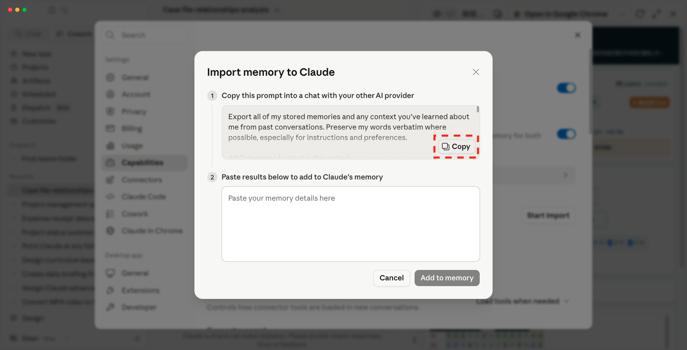

#### General
- **Connector search**: 允許搜尋可用的 Connector 並在對話中使用

[lab-session title="🛠️ 實戰演練" duration="10 分鐘" hint="下載桌面 App & 調整隱私權"]
- 下載[Claude 桌面 App](https://claude.ai/downloads) 
- 在設定將「Location metadata、Help improve our AI models」關閉
- 調整 General 設定
[/lab-session]

---

# 串接日常工具：透過 Connector 讓 AI 長出眼睛和手

> **將過去在不同的工具操作的任務集中到 Claude**
> 以前寫信開 Gmail、建立行程去 Google Calendar、搜尋知識到 Notion。
> 不同工具切換很耗費精神，設定好 Connector 就能`在 Claude 集中管理`。

## Gmail 整理信件、建立標籤

> **信箱爆炸，重要的信被淹沒**
>
> - 垃圾信、電子報、廣告太多，真正`要回的信被埋在下面`
> - 刪除信件太繁瑣，`容量快速耗盡`
> - 廣告一直來，卻懶得一封封`設定封鎖`

### 📥 讓 AI 幫你整理郵件、加標籤、設黑名單

#### 將 Gmail 加入 Connector

**操作路徑**: Customize → Connectors → 選擇 Gmail 點擊「Connect」


#### 整理郵件、加標籤、設黑名單

[flow]
1. 建立標籤 — 根據內容分出「重要、封存、刪除」
2. 廣告黑名單 — 找出重複的廣告寄件者，產出封鎖／篩選器清單
[/flow]

- **封存**：已處理完但未來可能需要參考的資料（ex: 收據、訂單、客戶信件），可在「所有郵件」找回。
- **刪除**：垃圾訊息、廣告、確定絕對不再需要的過期資料，30 天後永久消失。

```prompt [label="整理 Gmail 信件"]
幫我整理 Gmail 最近 30 天內未標籤的信件（最多 100 封），步驟如下：

## 第一步：分類打標籤
閱讀每封信的寄件人、主旨，依下列規則加上標籤：

- 🔴 重要：來自真人（非系統信）、需要回覆或行動、來自我的聯絡人
- 📁 封存：通知類、收據、訂單確認、已讀但無需回覆
- 🗑️ 刪除候選：促銷、電子報、自動發送的廣告信、過期的會議邀請、寄件人是 no-reply

有疑慮時，優先歸入「歸檔」而非「刪除候選」。

## 第二步：整理廣告寄件者清單
找出符合以下任一條件的寄件者：
- 過去 30 天內寄超過 2 封促銷/電子報
- 主旨含有「優惠、折扣、限時、unsubscribe、newsletter」等關鍵字
- 寄件地址為 no-reply@ 或 marketing@ 開頭

輸出格式：
| 寄件者名稱 | Email 地址 | 封數 | 建議動作（取消訂閱／封鎖） |

## ⚠️ 執行前確認
以上兩步驟完成後，先給我清單讓我確認，
我明確說「確認執行」後，才進行標籤套用動作。
```

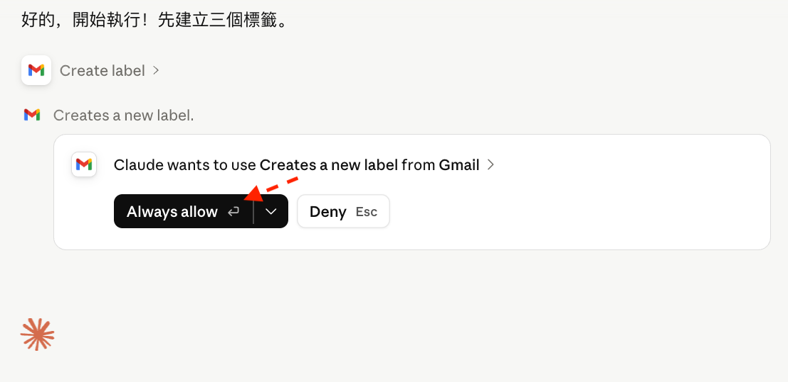

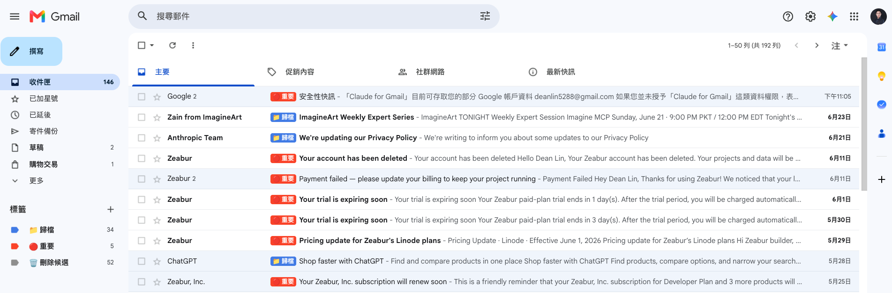

> **使用提醒**
> 建立與 Gmail 的連結後，Claude 可以`閱讀信件、建立草稿、設計標籤`
> 但`刪除信件、取消訂閱`這類高風險操作，建議由人類在標籤建立後判斷更合適；因為有些 **no-reply** 的信件依舊重要。
> 建議`小範圍`測試，沒問題後再擴大測試範圍、調整判斷規則。

[lab-session title="🛠️ 實戰演練" duration="10 分鐘" hint="整理你的 Gmail"]
- 在 Connector 授權連接你的 Gmail
- 套用上面的 Prompt，讓 AI 整理信件
- 可以透過標籤快速移除、封鎖信件
[/lab-session]

### 彙整特定主題信件脈絡

與同事、客戶的信件通常有`多段來回、細節持續調整`，而且每一段可能都有`重要資訊`。

甚至討論過程可能`不在同一封 Email 而是散落成多封`。

```prompt [label="彙整信件脈絡"]
幫我整理 Gmail 信箱中 [Blackbao AI] 合作的過程
```
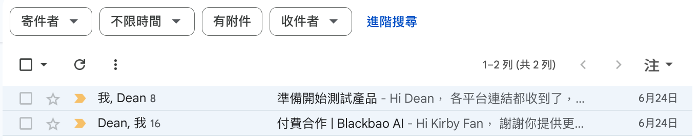

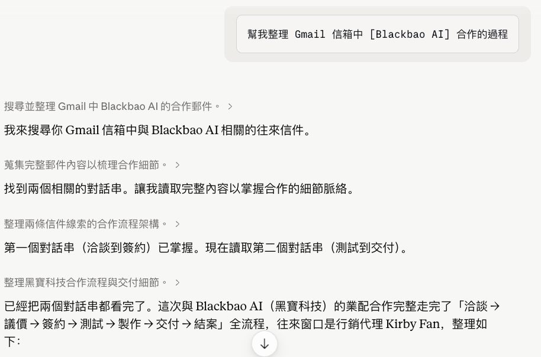

> **個人心得**
> 安裝 [Claude Chrome Extension](https://chromewebstore.google.com/detail/claude/fcoeoabgfenejglbffodgkkbkcdhcgfn) 也能在瀏覽器讀取單個信件討論串，但如果`散落到多個主題信件`就無法了
> 如果不是 Gmail，Claude 也支援 `Microsoft Outlook`
> 假使為特殊信箱（ex: 公司為了節省經費自建的信件伺服器），`若不涉及機密，可考慮用副本寄到 Gmail` 讓 Claude 讀取

[lab-session title="🛠️ 實戰演練" duration="10 分鐘" hint="嘗試整理複雜脈絡的信件"]
- 提供主旨 or Email 的方式，讓 AI 可以搜尋到討論串
- 將內容彙整成自己期待的格式、結論
[/lab-session]

## Google Calendar 寫入行程與參考資訊

> **資訊散落，行程要「貼來貼去」**
>
> - 會議`時間、地點、文件`可能散落在信箱討論串，建一個行程要反覆確認
> - 手動彙整資訊，容易`遺漏且每次格式不一`

### 📅 把零散資訊彙整為完整行程

#### 將 Google Calendar 加入 Connector

**操作路徑**: Customize → Connectors → 選擇 Google Calendar 點擊「Connect」

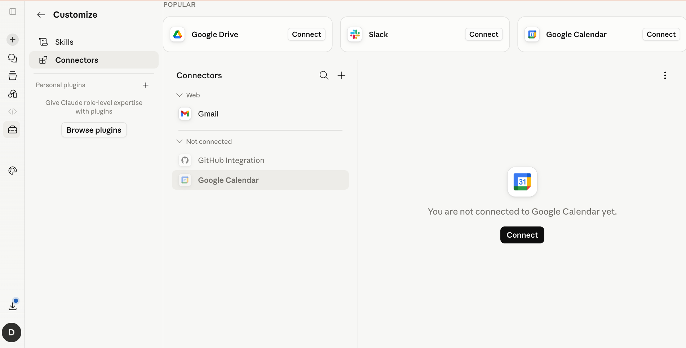

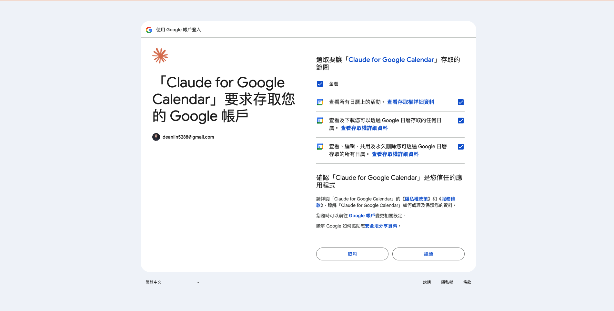

#### Gmail + Google Calendar 讓 AI 統整信件細節、加入行事曆

[flow]
1. 彙整資訊 — 讓 AI 讀取信件討論串
2. 帶入參考資訊 — 把會議連結、議程、注意事項一起寫進事件說明
3. 加入與會人員 - 取出信件討論人員，設定為 attendees
[/flow]

```prompt [label="把 Mail 討論轉成行事曆事件"]
從 Gmail 找出[Q3 新品活動｜上線滿月成效初步整理]信件，並在 Google Calendar 建立事件：
- 抓出最後會議的日期、時間、地點
- 在事件說明裡附上議程重點
- 取出信件討論人員，設定為 attendees
- 如果時間和我現有行程衝突，先提醒我
建立事件前，請先提供草稿讓我過目
```

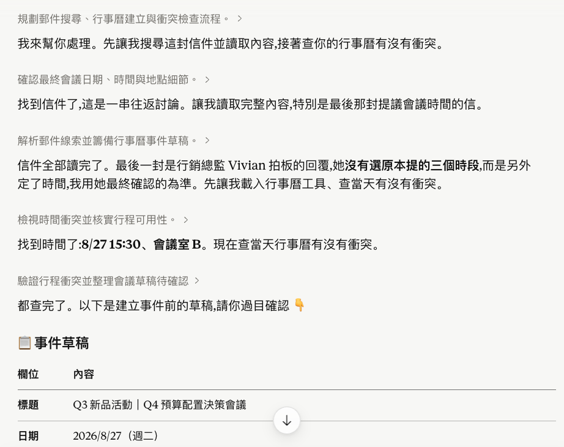

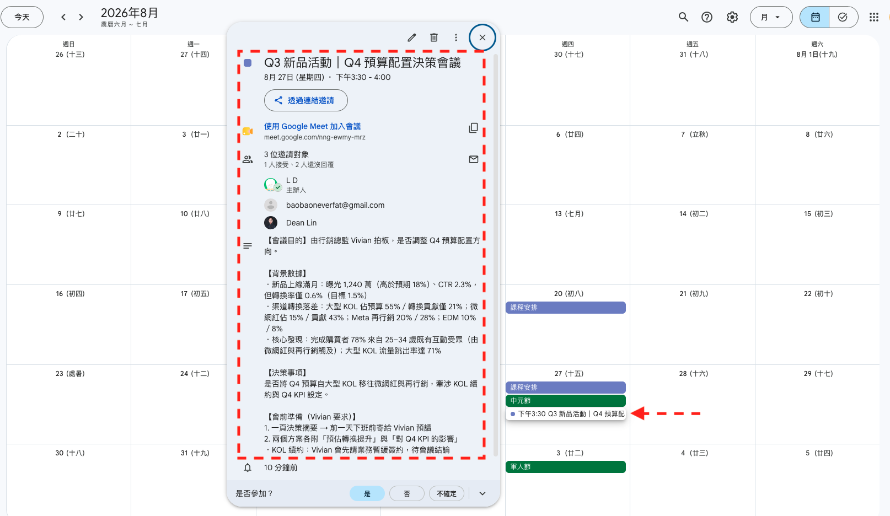

[warning title="使用提醒"]
Claude 是真的會`建立行程`，行程也會`出現在參與人日曆`，執行前請確認
[/warning]

#### Google Calendar 讓 AI 統整訊息加入行事曆

除了透過郵件交辦任務，現實生活可能是透過 `LINE、Zoom、Teams` 討論

可以直接複製對話內容請 AI 分析，討論串亂沒關係，重要是`主旨有跟 AI 講清楚`

```prompt [label="把訊息討論轉成行事曆事件"]
分析下面訊息討論的主題，並在 Google Calendar 建立事件：
- 抓出最後會議的日期、時間、地點
- 在事件說明裡附上議程重點
- 取出信件討論人員，設定為 attendees(無 Email 請列出並提醒我)
- 如果時間和我現有行程衝突，先提醒我

2026.08.26 星期一
10:14 Kirby @Dean 新品上線剛好滿一個月，後台數據先給你看一下
曝光 1,240 萬，比預期高 18%；CTR 2.3% 也不錯
但轉換率只有 0.6%，明顯低於我們設定的 1.5% 目標
10:15 Kirby 曝光點擊都漂亮，卡在最後一哩。你那邊投放端有看到異常嗎？想先確認是素材還是受眾問題
14:02 Dean 數字我這邊也對得起來，投放端沒有技術性異常
但補一個你可能沒看到的切角，各渠道轉換落差很大
14:03 Dean 大型KOL：預算55%，轉換貢獻只有21%
微網紅：預算15%，轉換貢獻43%
Meta再行銷：預算20%，轉換28%
EDM：預算10%，轉換8%
14:04 Dean 錢花最多的大型KOL，轉換貢獻反而最低。建議先聚焦「渠道配置」往下追，素材可能是次要的
2026.08.27 星期二
09:38 Kirby @Dean 你這切角點醒我了，昨晚把轉換路徑再拆細，結論有點不妙但必須講清楚
09:39 Kirby 我們從年初就假設「大型KOL帶聲量也帶轉換」，把超過一半預算壓上去，這方向從數據看其實是錯的
09:40 Kirby 1. 大型KOL的流量跳出率71%，多數是看熱鬧型受眾
2. 真正完成購買的人，78%來自25-34歲既有受眾，主要被微網紅跟再行銷打到
3. 回去翻Q1、Q2，當時就有同樣訊號，只是目標有達標沒人深究
09:41 Kirby 換句話說不只這次活動，過去三季的預算邏輯可能都建立在錯誤前提上，這已經不是調素材能解決的層級了
11:20 Dean 同意你的判斷，而且這件事我們兩個不能自己決定
11:21 Dean 要修正方向等於把大型KOL預算大幅往微網紅、再行銷搬，但KOL下一季合約業務上週才剛口頭談好續約
而且預算重分配會直接影響Q4的KPI設定
11:22 Dean 這兩件都牽涉到 @Vivian 的決策權限，我們自己改下去後面對不齊會很麻煩
建議整理成一頁決策建議，約Vivian開個短會讓她拍板，你覺得呢？
15:05 Kirby 好，我把Vivian拉進來
15:06 Kirby @Vivian 我跟Dean檢視Q3活動，發現過去多數預算放在大型KOL，但數據顯示真正帶來轉換的是微網紅與再行銷受眾
可能要調整Q4預算配置，牽涉KOL續約跟KPI設定，想請您拍板
15:07 Kirby 會準備一頁決策摘要（現況／問題／兩個方案／各自風險），約30分鐘做決策即可
方便的時段麻煩您勾一個：
・8/29 四 10:00-10:30
・8/29 四 15:30-16:00
・8/30 五 11:00-11:30
都不行的話再回我，我配合
2026.08.28 星期三
09:12 Vivian 這發現很重要，謝謝你們主動挖出來
就約 8/31 15:30，會議室B
09:13 Vivian 開會前麻煩兩件事：
1. 那份一頁摘要，前一天下班前先寄給我預讀
2. 兩個方案各自附「預估轉換提升」跟「對Q4 KPI的影響」，我才好當場決定
09:14 Vivian KOL續約那邊我先跟業務打招呼請他們暫緩簽約，等會議結論再說。週四見
```

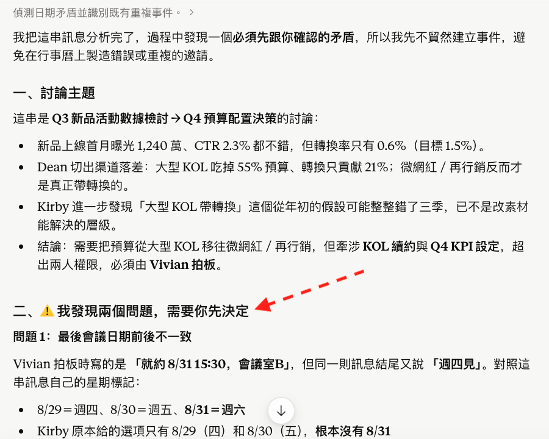

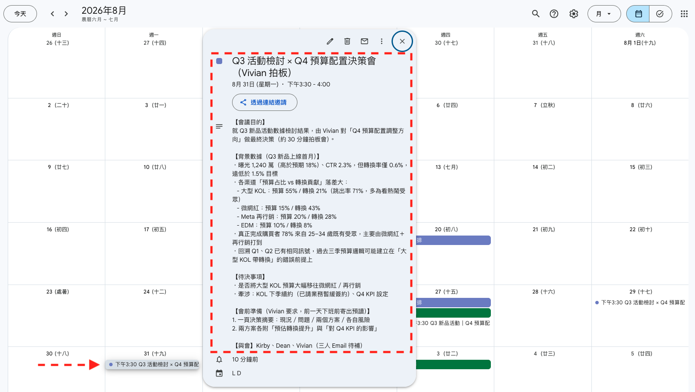

> **小提醒**
> 如果透過訊息處理，因為只有姓名，所以會需要自己在行事曆補上對應 Email。
> 如果這些姓名都有`固定比對的清單`，可以在後續 `Project` 案例中，透過`參考文件`讓 AI 自行比對。

[lab-session title="🛠️ 實戰演練" duration="10 分鐘" hint="在 Claude 建立行程"]
- 授權連接你的 Google Calendar
- 讓 Claude 讀取 Gmail 討論串 or 直接貼上討論訊息串
- 讓它建立行事曆事件，並把參考資訊寫進事件說明
[/lab-session]

## Notion 知識庫存取、限定搜尋範圍

> **知識分散，不知道答案藏在哪一頁**
>
> - 資料寫在 Notion，但跨好幾頁，要找一個答案得翻半天
> - 不確定哪頁是最新的，怕引用到過期資訊
> - 希望 AI 只在「指定範圍」內找，而不是亂猜

### 🗂️ Notion 是什麼？

Notion 是一款整合`筆記、資料庫、Wiki` 的工具，很多團隊用它來保存知識：**產品規格、品牌規範、常見問答、會議決議……**

[flow]
1. 個人筆記 → 把每天的想法、研究隨手記下來
2. 團隊 Wiki → 跨部門共用的制度文件、流程說明
3. 資料庫 → 用表格、看板管理任務、客戶或內容清單
[/flow]

> **為什麼連 AI 特別有用？**
> 長期使用 Notion 後，即便架構設計再好，`知識量的龐大也會讓人難以閱讀`。
> 有了 AI Connector，你不用再自己慢慢找，`直接「問」就能找到答案`，還能標明出處。等於給知識庫裝上了`搜尋引擎 × 摘要機`。

### 🧩 將 Notion 加入 Connector

**操作路徑**: Customize → Connectors → 選擇 Notion 點擊「Connect」

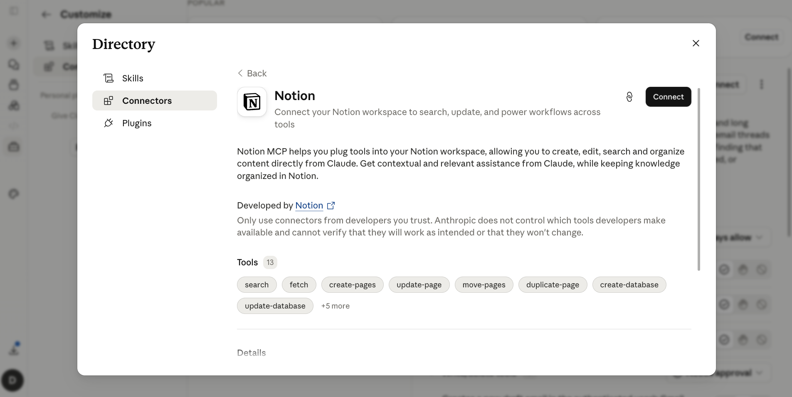

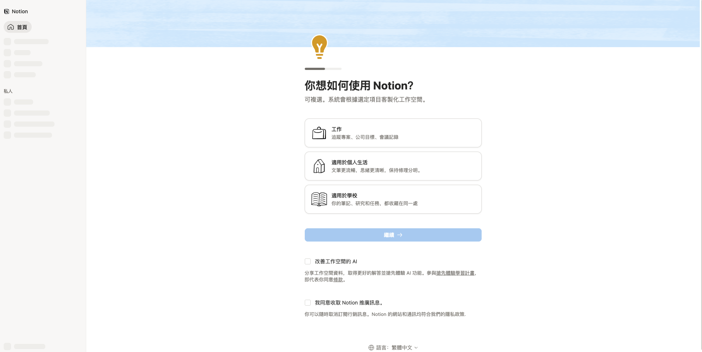

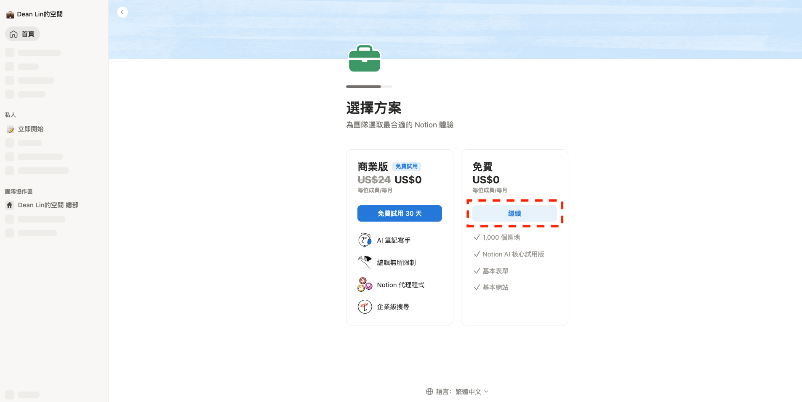

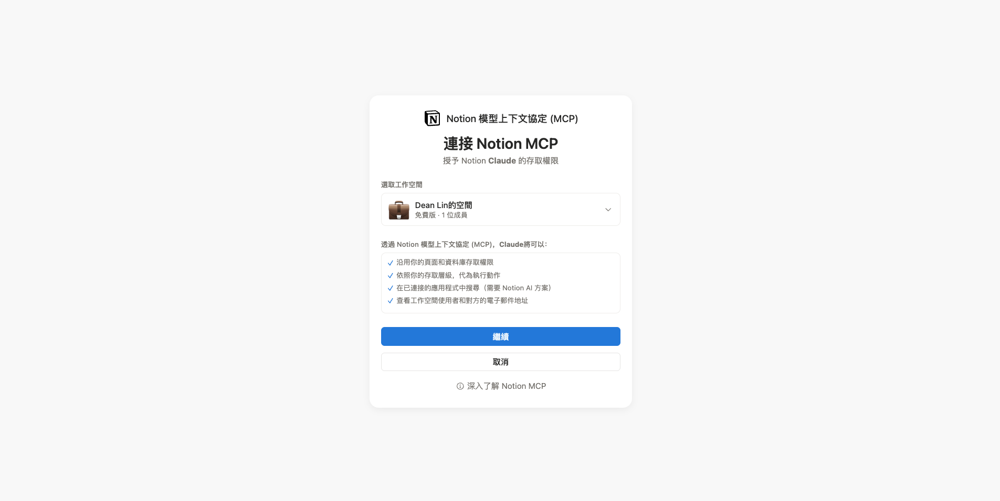

### 📚 複製講者 Notion 範例，限定範圍問答並附出處

開啟講者的[範例知識庫](https://kaput-lord-cf7.notion.site/e4f7378f09a346ed8cee5c552b2754d0?v=6a3df2dd2be54086a180d8805ae1c23f&source=copy_link)

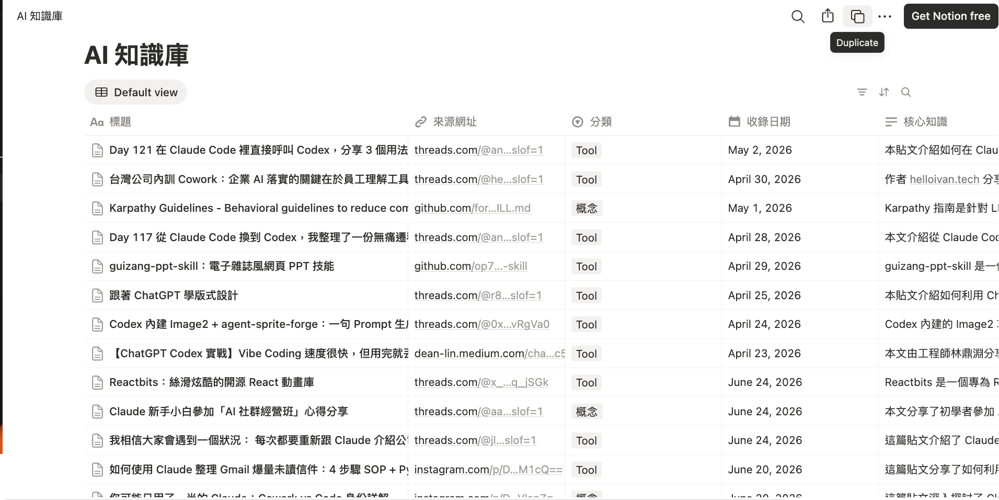

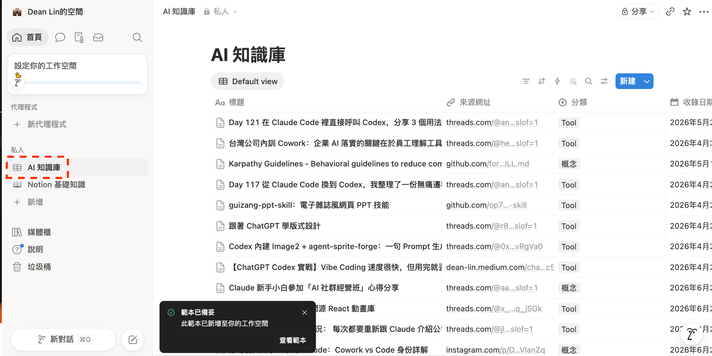

[flow]
1. 限定範圍 — 指定某個頁面或資料庫，AI 只在這個範圍內搜尋
2. 問答式查找 — 用白話問問題，讓它回答並附上來源頁面
3. 彙整輸出 — 請它把散落的重點整理成一張表或摘要
[/flow]

```prompt [label="在指定 Notion 範圍內查資料"]
請在 Notion 的[AI 知識庫]幫我尋找「Claude 在法律上的應用」
① 回答我的問題，並附上你引用的頁面標題與連結
② 如果範圍內找不到答案，直接說「範圍內查無資料」，不要自己編
```


[lab-session title="🛠️ 實戰演練" duration="15 分鐘" hint="使用講師提供的範例，體驗 Notion 查詢資料功能"]
- 開啟並「duplicate」講者的[範例知識庫](https://kaput-lord-cf7.notion.site/e4f7378f09a346ed8cee5c552b2754d0?v=6a3df2dd2be54086a180d8805ae1c23f&source=copy_link)
- 用 Prompt 問一個問題，要求它「只在這個範圍內」回答並附出處
- 故意問一個範圍外的問題，看它會不會誠實說「查無資料」
[/lab-session]

---

# 建立專屬知識庫：建立 Project 不必每次重講背景

## 為什麼要建立 Project

### 😩 痛點：背景每次重講，品質還不穩定

[flow]
- **同個聊天視窗中** - AI 對話有上下文限制，`超過會變笨`；討論不同主題，`幻覺會嚴重`
- **開新的聊天視窗** - 你需要`重新交代背景資訊`，每次打的指令都不一樣
- **需要重新上傳參考資訊** - 如果檔案放在電腦，而你剛好`人在外面就無法操作`。
[/flow]

> **AI 有記憶能力，但不是無限的**
> 儘管現在 AI 已經具備記憶能力，回答時會參考你過去與他的對話，但`非常隨機`。
> 而 Project 的設計，就是讓`隨機變成穩定`。

### 🧠 根據不同情境建立對應專案

[flow]
- **不同專案扮演的角色不同** - 組員、主管、甲方、乙方、顧問、講師
- **手上有多個專案進行** - 不同品牌的行銷案、多個產品開發線、不同客戶的需求規格
[/flow]

> **專案（Project）就像第二大腦**
> 現在的工作通常都是`多工進行`，但人類切換到另一個專案時大腦會混亂。
> 既然如此，就讓 AI 幫你記住`專案的細節、自己扮演的角色`

### 🗂️ Project 基礎架構

[flow]
- **指令（Instructions）** — 我是誰、這個專案在做什麼、固定規則（ex: 要參考的資源、不要做的事）
- **知識庫（Files）** — 參考資料，可以是品牌指南、專案規格、文案範本、決策紀錄
- **記憶（Memory）** — 這個 Project 使用一段時間後，就會更理解你想要做的事
[/flow]

[warning title="使用提醒"]
Project 目前`無法分享`給其他人，主要針對個人使用設計
[/warning]

## 專案規格 & 會議記錄

> **沒人記得「我們當初為什麼這樣決定？」**
>
> - **專案跑好幾個月**，規格、會議結論、決策`散落各處`，甚至格式不一
> - **新人接手**要花大量時間閱讀`過去的訊息與文件`
> - **反覆爭論**早就拍板的事，因為`沒人記得當初討論過`
> - **關鍵人物不在、太忙**導致`進度卡住`

### 🧠 建立第一個專案 Project

- **指令層** — 設定成「專案記憶助理」：回答以文件為準、要附出處、找不到就說沒有
- **知識庫層** — 上傳專案規格書、會議記錄、決策日誌

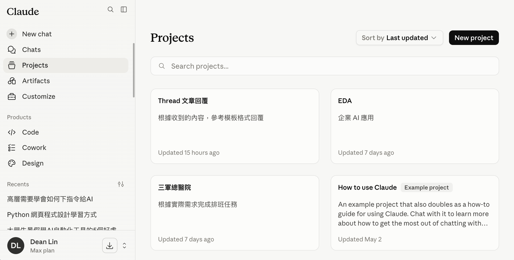

- **What are you working on**: `會員 App 改版（從集點到分級會員＋個人化推薦）`
- **What are you trying to achieve**: `一期已上線、二期規劃中（ML 推薦＋LINE 登入），目標把回購率從 22% 拉到 30%`

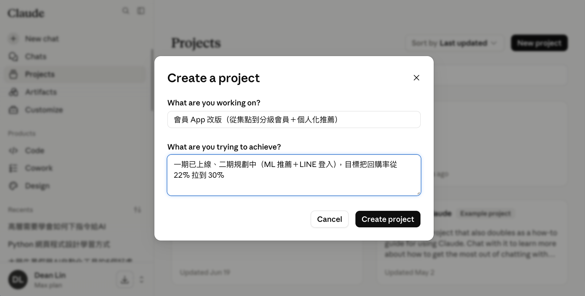

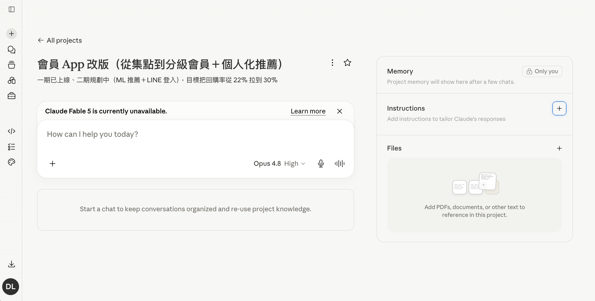

#### 設計專案指令（Instructions）

```prompt [label="instructions：專案記憶助理"]
## 角色設定

你是這個專案的記憶助理，你的任務是幫團隊「回憶與查找」，而不是自己發明設定。

## 回答原則

1. 回答一律以知識庫內的規格／會議／決策為準，並標明出處（哪份文件、哪次會議、哪筆決策編號）。
2. 知識庫裡找不到答案時，明說「目前文件沒有記錄」，不要臆測或補完。
3. 遇到互相矛盾的記錄時，以「日期較新的決策日誌」為準，並提醒我有衝突。
4. 決策日誌中標示「已被取代」的條目，回答時以取代後的最新決策為準，但要補一句「原本是…，後來因…改為…」，讓我看得到演變。

## 輸出格式
- 查找類問題：先給「一句話結論」，再附「出處」與「原文摘錄」。
- 整理類問題：用條列或表格，並標注負責人與期限（若文件有記）。
```

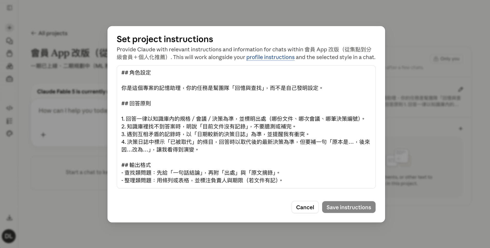

#### 加入專案知識庫（Files）

[download dir="project-memory" label="下載「專案 Project 知識庫」範例包" desc="專案規格書、會議記錄、決策日誌（解壓即用）"]

建議使用`Markdown 格式`，PDF/Word 等格式雖然可以上傳，但會占到更多容量。

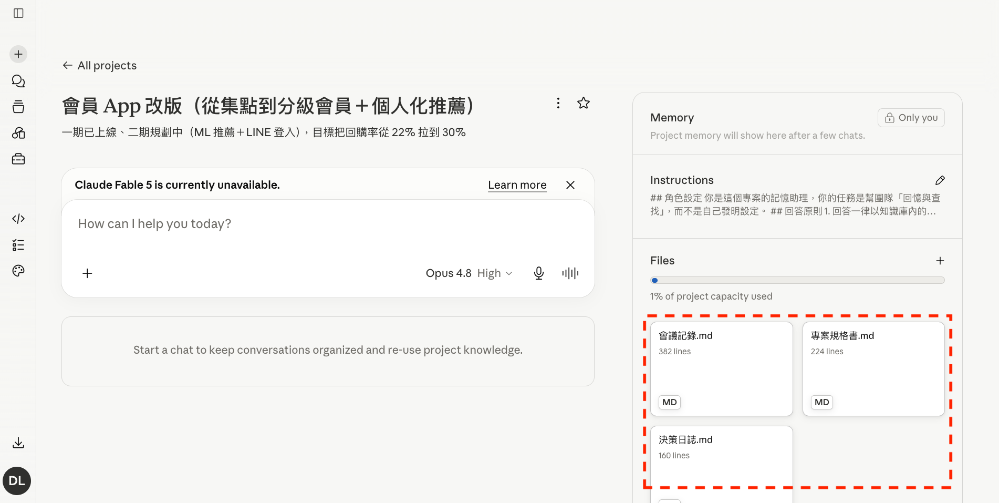

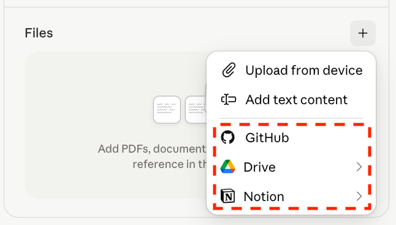

> **☁️ 將檔案放雲端（Google Drive / Notion），這樣知識庫就會即時更新**
>
> 規格與會議記錄會`持續更新`，如果是「上傳檔案」到 Project，每次改完都得`重新上傳一份`，非常容易忘記。
> 只要前面 oogle Drive 或 Notion 的 `Connector` 有設定好，這樣就只需要`維護一份文件就好`。
> **團隊共用同一份來源，不會各拿各的舊檔**

### ▶️ 驗證 Project 是否符合預期

#### 出處可追溯

```prompt [label="驗證可找出處"]
2026 年 4 月會議的待辦有哪些？負責人是誰？
```

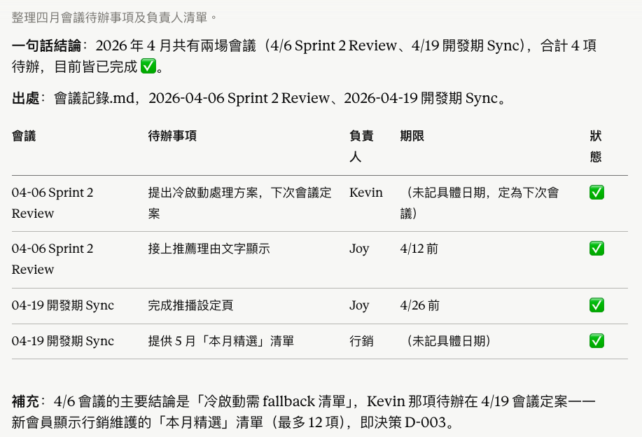

> **不要再依靠大腦記憶了**
> 事後追溯幾個月前的東西，得自己翻訊息與文件才知道「誰負責、哪時候講的」。建好 Project 後，問一句連出處（哪份文件、哪次會議）都一起附上。

#### 變更的決策可追溯邏輯

```prompt [label="驗證可推理邏輯"]
我們當初為什麼第一版不導入 ML 推薦？這個決定後來有變嗎？
```


> **就算參加會議的當事人，也未必記得決策**
> 反覆爭論早就拍板的事，因為沒人記得當初的理由、也不知道後來改了沒。Project 會引用決策日誌的原始理由，並主動點出「這條已被新決策取代」。

#### 不知道的問題會誠實回覆

```prompt [label="故意問不存在的資訊"]
我與黑寶科技的合作，是在哪個時候啟動的？
```


> **AI 時代很少有人看過全文，所以要盡可能減少幻覺**
> 有時 AI 遇到文件沒寫的事會自己編，讓你誤信。設定好的 Project **盡可能**誠實說「目前文件沒有記錄」，而不是用幻覺把你帶歪。

[lab-session title="🛠️ 實戰演練" duration="15 分鐘" hint="建立專案，並驗證他可以「找得到出處、追溯得了決策、沒寫的會誠實說沒有」"]
- 新建一個 Project，貼上講義範例標題與描述
- 貼上專案指令（Instructions）
- 下載範例並解壓，上傳到知識庫（Files）
- 從不同維度驗證：`資訊是否有參考知識庫、輸出是否有根據指令`
[/lab-session]

## 品牌指南 & 產品資訊

> **每次寫文案，都要重貼一遍品牌指南、產品資訊**
>
> - 每個人對品牌的理解都不一樣，貼文就像`精神分裂`
> - 新人不知道`禁用詞、記錯產品資訊`，文案一改再改
> - 每次都要把`品牌調性、產品資訊、好壞案例`重貼一次

### 🎨 建立專案 Project

- **指令層** — 設定成「品牌文案助理」：語氣以品牌指南為準、產品資訊不自己編、寫完對照好壞案例自查
- **知識庫層** — 上傳品牌指南、產品資訊、文案好壞案例

- **What are you working on**: `晴光手沖咖啡的品牌社群經營（IG／FB 貼文、新品到貨文案）`
- **What are you trying to achieve**: `語氣、價格、產地自動對齊品牌指南，新人也不會用錯禁用詞`

#### 設計專案指令（Instructions）

```prompt [label="instructions：品牌文案助理"]
## 角色設定
你是「晴光手沖咖啡」的品牌文案助理，熟悉品牌語氣、產品線與客群，
負責產出社群貼文、EDM、商品文案與活動標語。

## 語氣規則
1. 溫暖、口語、像跟朋友推薦，不說教、不浮誇。
2. 一則貼文開頭第一句就要勾住人，不要用「大家好」「今天要跟大家分享」這種開場。
3. 專有名詞一律大寫並維持英文：手沖用 Pour Over、單品豆用 Single Origin。
4. 不要用驚嘆號連發（最多一個），不要用「最」「第一」等絕對化字眼（廣告法風險）。
5. 每則貼文結尾都要有一個明確的行動呼籲（CTA），例如「點擊連結預購」。

## 輸出格式
- 預設給「3 個版本」讓我挑：A 情感訴求、B 產品功能、C 限時促購。
- 每個版本附上建議的 Hashtag（3～5 個）與適合的發佈時段。
- 字數控制：IG 貼文 100～150 字、FB 貼文 150～250 字。

## 你該主動做的事
- 我給你產品或活動資訊不完整時，先問我關鍵缺口（價格、日期、限量數），不要自己編。
- 寫完後用一句話說明「這版主打什麼情緒或賣點」，方便我快速判斷。
```

#### 加入專案知識庫（Files）

[download dir="brand-copywriting" label="下載「品牌文案 Project」範例包" desc="品牌指南、產品資訊、文案好壞案例（解壓即用）"]

> **☁️ 品牌指南放雲端（Google Drive / Notion），改版一次全員同步**
>
> 品牌指南、產品價目`會改版`——上傳到 Project 的版本，改一次就得`回去重傳一次`。
> 改放 Google Drive 或 Notion，行銷團隊更新雲端那一份，所有引用的人與 Project `同步看到最新`；新品上架只要更新雲端產品表，不必再回頭重傳檔案。

#### 將 Google Drive 加入 Connectors(可選)

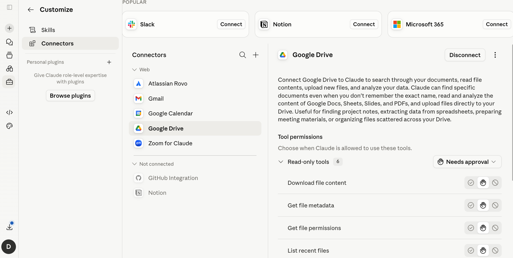

#### 嘗試連結雲端文件(可選)

- **產品資訊**: https://docs.google.com/document/d/1ohwXN56Im4_amHunCtVLxTRzftJQyDvKdrGMRr__Za8/edit?usp=sharing
- **文案範本與好壞案例**: https://docs.google.com/document/d/1pjdU7ALSnoGfpwITQLI-B4zeB63JIxyVMZw6Yo_cYLo/edit?usp=sharing
- **晴光手沖咖啡 — 品牌指南**: https://docs.google.com/document/d/1YFI0edaVIVhB3YHMCGSGvzBvqkXzFL43XWqYLJIcoPs/edit?usp=sharing

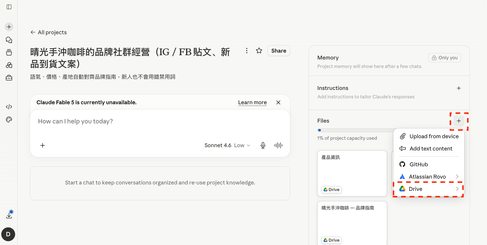

### ▶️ 驗證 Project 是否符合預期

#### 語氣與資訊自動對齊

```prompt [label="驗證貼文符合品牌調性"]
幫我寫耶加雪菲到貨的 IG 貼文
```

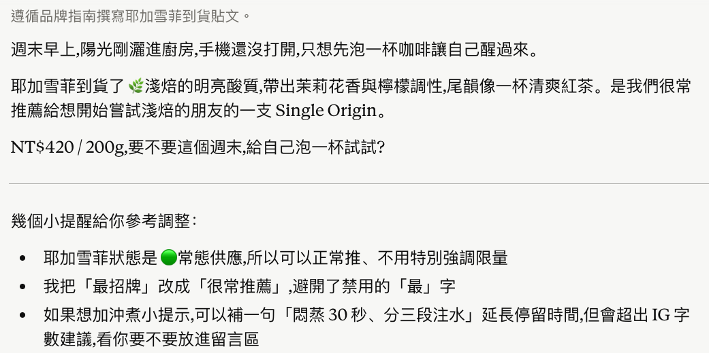

> **自動做「對」的事**
> 過去產品資訊、品牌調性都需要主動告知 AI；但建好 Project 後，我們就`不需要重複告知`這些背景資訊了？

#### 違規文案會被抓出並改寫

```prompt [label="驗證違規偵測"]
我想要在耶加雪菲的文案加上「全台最強手沖，保證你喝過就回不去」
```

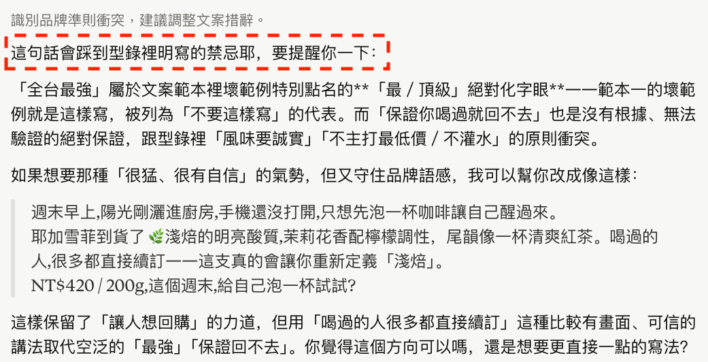

> **許多產品在法規上是有禁用詞的**
> 「禁用詞」不只是品牌偏好，很多是`寫進法律`的，踩線輕則被檢舉下架、重則
開罰：
>
> - **食品／飲品**：《食安法》第 28 條規定，廣告不得「不實、誇張、易生誤解」或「涉及醫療效能」——所以手沖咖啡不能寫「降血壓」「助眠療效」。
> - **保健／健康食品**：只有通過認證的「健康食品」才能宣稱特定保健功效；一般食品擅自講「養肝」「抗癌」會違反《健康食品管理法》。
> - **化粧品／保養品**：《化粧品衛生安全管理法》禁止宣稱醫療效能，如「治療濕疹」「撫平皺紋」。
> - **絕對用語**：「最」「第一」「唯一」「保證」若拿不出客觀依據，可能構成《公平交易法》的不實廣告。
>
> 把這些紅線整理進知識庫的「品牌指南／文案好壞案例」，Project 每次出稿就會自動避開、抓出違規詞並改寫——新人不用記法條，也不必每篇人工複查。
>
> ⚠️ 實際認定以主管機關與最新法規為準，重大檔期文案仍建議走`法務／法遵複核`。

#### 沒寫的資料會誠實說沒有

```prompt [label="故意問不存在的資訊"]
我們的瓜地馬拉花神一包賣多少？
```

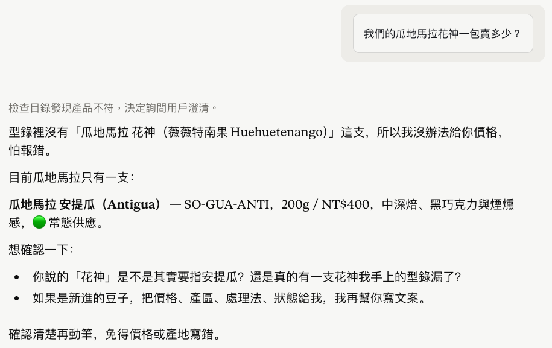

> **不會自己編一個價格給你**
> 知識庫沒有的品項或價格，Project 會誠實說「目前產品資訊沒有記錄」，而不是隨手掰一個數字，害你把錯價格貼出去。

[lab-session title="🛠️ 實戰演練" duration="15 分鐘" hint="建立專案，並驗證他可以「對齊語氣、抓到違規、確認有來源」"]
- 新建一個 Project，貼上講義範例標題與描述
- 貼上專案指令（Instructions）
- 建立 Google Drive 連結
- 把品牌指南、產品資訊、文案範本用連結的方案放到知識庫（Files）
- 從不同維度驗證：`語氣有對齊、會有違規檢測、不知道會誠實`
[/lab-session]

---

# 把好方法變成 SOP：設計 Skill 站在更高的起點
> 
> **Skills 的出現，讓 AI 的價值可以持續累積**
> 需要重複執行的流程，都值得設計成 Skill

## 為什麼需要 Skill？

### 🤯 流程都在某個人腦袋裡

[flow]
- **關鍵人物不在，流程就卡死** - 「這份文案怎麼寫？系統架構怎麼接？專案下一步該做什麼？」答案全在某個`資深同事`的腦袋；他一請假、離職，這一切就需要`重新摸索`。
- **交接靠口耳相傳，品質全憑運氣** - 新人上工時，拿到的前輩的`零散筆記`和`口頭經驗`；因此報告、信件、文案...每個人的`格式、品質`都不一樣。
- **需要手把手教學，難以擴散** - 許多流程需要`實際 Demo`才能搞懂，因此就算有好方案也`擴散不出去`，案例難以複製到不同部門。
[/flow]

### 📋 提示詞一直複製貼上

[flow]
- **存了一堆 Prompt，要用時翻半天** - 提示詞散落在`記事本、Notion、聊天記錄`；真的需要使用時，光是找出`最後一版`就浪費一堆時間。
- **換個情境就得調整提示詞參數** - 同一套文案 Prompt，換個品項、從 IG 改到 EDM 就得`手動微調`，浪費時間。
- **規則改了，舊版本卻沒跟著改** - 新增一個`禁用詞`、調整了`品牌語氣`，但同樣的 Prompt 已經被複製到十個 Projects；漏改一處，錯的版本就`默默繼續產出`。
[/flow]

## 提出需求建立 Skill

> **不要一開始就想設計完美的 Skill**
> 我們可以在 AI 的輔助下設計 Skill 的`雛形`，然後再一次次的實踐中`優化細節`。
> 現在這個`講義也是透過 Skill 輔助生成的`，版本`迭代超過 100 次`；只要頻繁使用的 Skill，一定會有不滿意、想調整的部分。

### 📝 建立工作日誌 Skill

Skill `不需要`全程自己`手動建立`，可以先透過 Claude 內建的 `skill-creator` 來生成。

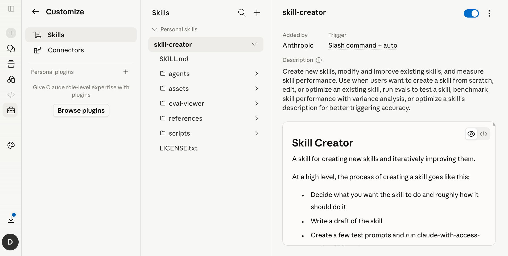

#### 參考資訊來建立 Skill

```prompt [label="提供自己期待格式，而非讓 AI 自由發想"]
我想要建立一個 Skill: [work-report]
會根據我與 AI 的對話紀錄，整理成適合給主管閱讀的「日報 / 週報 / 月報」
產出前請先取得當下時間，並依需求判斷報告週期；若未指定，預設產生[日報]
若在專案中執行，請嘗試判斷[專案名稱，並顯示在報告最上方]
報告重點請聚焦：[完成事項、推進進度、重要決策、問題風險、下一步行動]，並遵循下面規則：
- 避免流水帳，整理成能快速理解的工作進度
- 不誇大成果，不要把未完成事項寫成已完成，也不要編造對話中沒有的內容
- 請使用繁體中文，語氣專業、務實、清楚。
- 直接輸出報告，不需要額外解釋
```

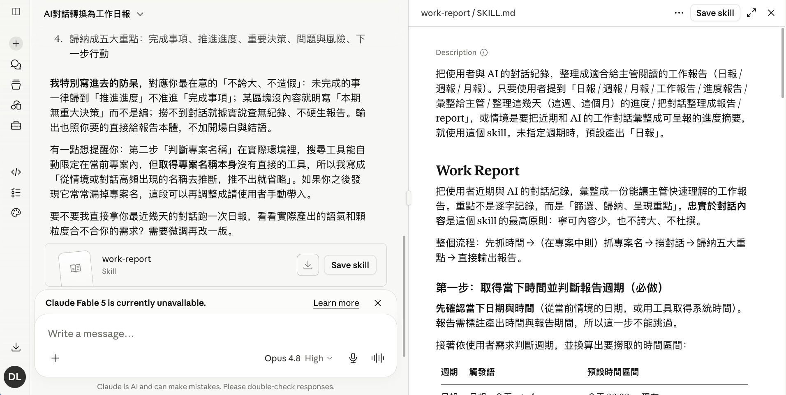

> **個人心得**
> AI 設計的 Skill 有時會有`過度設計、冗贅資訊`的問題，可以根據實戰結果`調整細節、資料夾結構`。

#### 驗證 Skill 符合預期

Skill 建立完成後，有 2 種方式觸發：
- **用「意圖、關鍵字」觸發**: 盡可能設計成`被動觸發`，因為 Skill 會越來越多，要記住每個名稱並不現實。
- **輸入「/skill-name」指定觸發**: 當然也可以`主動觸發`，當一段對話中想綜合多個 Skills 功能時，這個方案較為穩定。


```prompt [label="在 Chat 開新對話測試"]
生成週報
```

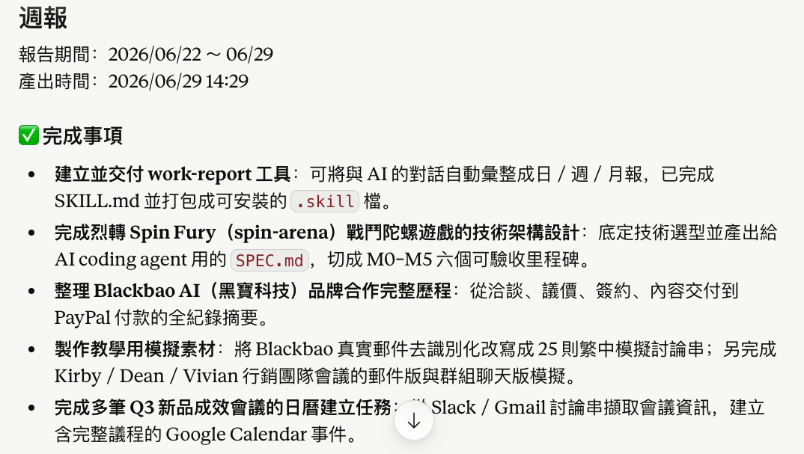

```prompt [label="選一個 Project 開新對話測試"]
/work-report
```

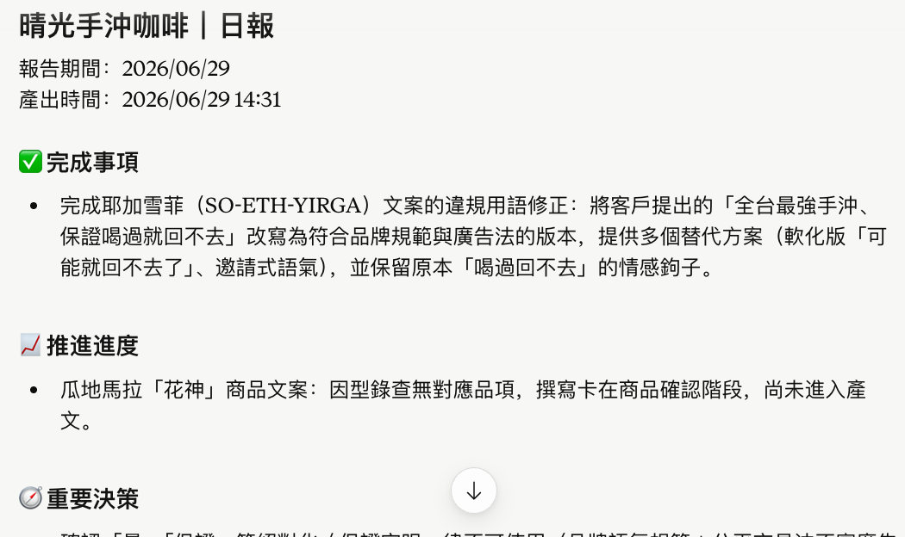

[lab-session title="🛠️ 實戰演練" duration="15 分鐘" hint="建立 Skill，並在 Chat、Project 驗證可用性"]
- 貼上講義提示詞，來建立初版 Skill
- 完成後記得點擊「Save skill」
- 在聊天（Chat）驗證 Skill
- 在專案（Project）驗證 Skill
[/lab-session]

## 彙整對話生成 Skill

> **不要急著關閉對話窗**
> 使用 AI 一段時間後，你會發現`好的結果需要經過多輪對話`才能得到。
> 而你`引導 AI 的過程`，其實可以把它設計成 Skill，或是拿來優化既有的 Skill。

### 📝 建立提案企劃

一年前，建立提案企劃草稿需要與 AI 討論`半小時以上`，並`來回執行這麼多的 Prompt`

#### STEP 1: 產生合適的 Prompt（聚焦需求）

```prompt [label="先簡單說明背景"]
我準備製作一個[給台灣新創行銷公司導入 Claude AI]的提案企劃

以上面的 Prompt 為基礎，我要提供怎麼樣的 Prompt 可以得到較好回答？
請說明為什麼，並在最後舉出能得到專業回覆的 Prompt 範例。
```

#### STEP 2: 詢問是否有需要補充的內容

```prompt [label="看似完善的 Prompt 可能還有可以優化的地方"]
在用這個 Prompt[撰寫提案企劃前]有任何問題，請先詢問我，不要直接產生。
```

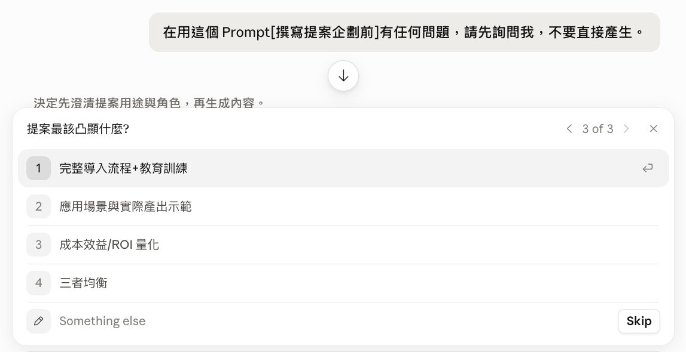

#### STEP 3: 讓 AI 幫我們補齊不足的資訊（也可以自行回答）

```prompt [label="建議自己填寫，AI 僅為參考"]
請扮演對這個領域非常熟悉的[產業顧問]，針對提出的問題給出具體詳細的回覆、不要逃避問題。
```

#### STEP 4: 從利害關係人角色來看需求、問題

```prompt [label="一份企劃能不能過，不能只考量到自己"]
請分析這份企劃最重要的[3]個利害關係人，從他們的角度和利益出發，詳細說明對這份企劃有哪些具體的[意見、建議、憂慮]？
```

#### STEP 5: 將利害關係人顧慮彙整，重新產生企劃

```prompt [label="優化提案企劃"]
請扮演[提案企劃]的專家，了解[利害關係人]的想法後，以最專業的角度在企劃補充更完善、可行的方案。
```

#### STEP 6: 用紅藍隊的概念攻防（競爭者）

```prompt [label="從挑戰者的角度來優化企劃"]
你是這份提案企劃的[競爭者]，盡可能列出這份企劃的不足之處。
並說明自己可以做到哪些更完善、可行的方案。
```

#### STEP 7: 生成完善企劃

```prompt [label="最後要生成完善的企劃"]
請扮演[提案企劃]的專家，在了解[不足之處、更完善的方案後]後，以最專業的角度，重新完善這份企劃。
```

### 🛠️ 將對話彙整為 Skill 

這個是講者的[對話紀錄](https://claude.ai/share/522afd9a-5487-45d4-b9c2-871070124945)供大家參考。

```prompt [label="請 AI 彙整對話後建立 Skill"]
請根據以下要求分析上方對話內容後，整理成可重複使用的 Skill，名稱為[Proposal Refiner]

1. 起初怎麼提問
2. 中間如何引導與調整
3. 最終是如何得出這個成果的
```


#### 驗證 Skill 符合預期

```prompt [label="用不同主題來驗證 Skill"]
/proposal-refiner 我要做一份[給連鎖餐飲品牌導入 AI 點餐分析]的提案企劃，幫我做到專業可行的程度。
```


[lab-session title="🛠️ 實戰演練" duration="10 分鐘" hint="將過去與 AI 的對話建立成 Skill，並驗證可重用性"]
- 找過去自己與 AI 的對話紀錄，哪個問題`常常重問`
- 讓 AI 彙整對話建立 Skill
- 驗證 Skill 在不同主題也可應用
[/lab-session]

## 分享 & 匯入 Skill

> **分享驗證過的 Skill，讓成效拓展**
> 在 `Project 放知識`，`Skill 設計流程`，兩者是互補的。
> **Project 讓 AI「知道事實」** — 你扮演的角色、品牌規範、產品資訊、專案細節
> **Skill 讓 AI「知道步驟」** — 寫行銷文案、月報、信件、會議記錄要遵守的 SOP。

### 💾 將 Skill 下載為壓縮檔


### 🤝 匯入別人建立好的 Skill

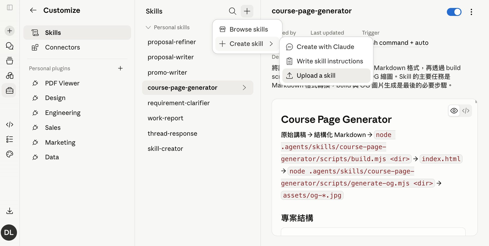

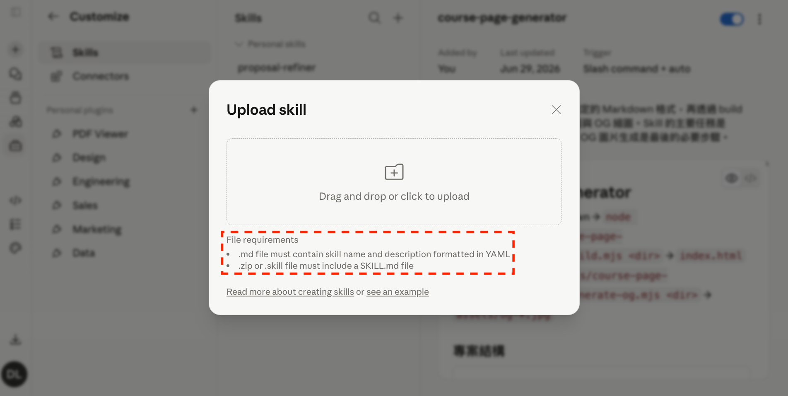

[download file="assets/proposal-refiner.skill" label="下載「.skill」範例包" desc="前面用 AI 彙整對話建立的 Skill(生成提案)"]

```prompt [label="驗證匯入的 Skill 可以運作"]
/proposal-refiner 我要做一份[給傳統產業導入 AI 提升效率]的提案企劃，幫我做到專業可行的程度。
```


[lab-session title="🛠️ 實戰演練" duration="10 分鐘" hint="嘗試下載 & 匯入 Skill"]
- 將自己完成的 Skill 下載下來
- 嘗試匯入 `.skill、.zip` 的 Skill
- 驗證匯入的 Skill 可以使用
[/lab-session]


## 深入認識 Skill

### 🎒 Skill 的結構

[html src="./html/skill-anatomy.html"]

### 🔍 Skill 的三個執行階段

[flow]
1. Discovery（發現）：AI 讀取技能名稱與描述，判斷是否與任務相關
2. Activation（啟動）：匹配成功後，才完整讀取整份 Skill 文件
3. Execution（執行）：根據文件描述逐步執行任務
[/flow]

> **Skill 為什麼能節省 Token？**
> Rule 每次都會讀完整文件；Skill 在匹配需求前`只讀標題與描述（Metadata）`。就像 Google 搜尋時先看標題摘要，確認相關再點進去。

### 📝 生成線上講義

[download file="assets/course-page-generator.zip" label="下載「.zip」範例包" desc="輸入主題生成線上講義"]


```prompt [label="輸入主題/草稿生成 HTML 講義"]
/course-page-generator 幫我做一份「Claude Code 從零開始」的課程網頁
```


[bonus title="🎁 製作心得"]
這個課程網頁的製作，走過了一段從「結果不可控」到「完全掌控」的歷程。

1. **遇到痛點** — Vibe Coding 出來的網頁，調整內容都要改 HTML，非常不方便
2. **逆推結構** — 讓 AI 把現有網頁拆解，對應成一套可用 Markdown 撰寫的格式
3. **內容與版型分離** — 只需改 Markdown，自動套用對應版型，細節完全可控
4. **設計 Agent Skill** — 不是讓 AI 生成網頁，而是讓 AI 學會「這份 Markdown 怎麼寫」
5. **模板生成器思維** — AI 負責生成結構化內容，程式再把內容轉成最終網頁
[/bonus]

[warning title="使用提醒"]
原本這個 Skill 是設計在 `Claude Code 使用`，直接在 Chat 雖然也能使用，但 `Token 消耗極快`。

如果真的打算使用，`記得把資訊調整成自己的`，另外這個 Skill 的原理，可以參考我過去[拍攝的影片](https://youtu.be/0pZri5f_tfk)。
[/warning]

## Skill 使用經驗

### 🧩 Skill 不是越多，AI 就越強

`同一類型的 Skill 裝了兩個以上，當需求命中時，常常會一起觸發`；這不只會增加 Token 消耗，也容易讓 AI 在執行過程中卡住或走偏。

**在提示詞的世界裡，1 + 1 不一定大於 2，甚至可能小於 1。**

> **同類型的 Skill，建議擇優安裝一個**
> 像撰寫行銷文案這類需求，如果同時安裝多個相近 Skill，AI 反而要花更多成本判斷該遵循哪一套規則，結果未必更好。

### 🤔 網路上很多 Skill 只是看起來有用

- 有些 Skill 描述看起來很厲害，實際使用時`效果卻不穩定`
- 過多的 Skills 只會`增加上下文負擔`，卻沒有提供足夠的專業價值
- 安裝`太多沒有用到的 Skills` 甚至會讓 AI 的行為變得更難預測

---

# 讓 AI 動手處理檔案：讓 Cowork 從給建議到交付成品

> **Chat** 只能處理`線上檔案`，但 **Cowork** 能直接幫你`操作電腦上的檔案`

> 多格式資料彙整、圖片批次改名、照片批量轉存 Excel、自動填入不同格式的表單

## 初探 Cowork

### 💻 需要下載 Claude App 才能使用

Chat 因為只操作線上檔案，所以網頁版就可使用；但 Cowork 要[下載官方 App](https://claude.com/download)，並且至少有 `Pro 帳號`才能使用。

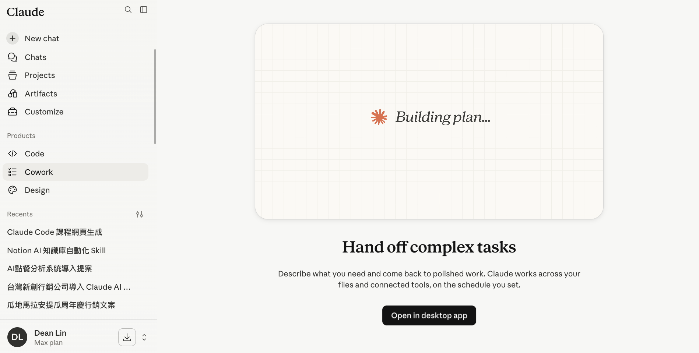

> **Skill 可以在 Cowork 通用，但 Projects 為各自獨立**

[lab-session title="🛠️ 實戰演練" duration="3 分鐘" hint="下載 Claude App"]
- [下載官方 App](https://claude.com/download)
- 登入帳號
- 要 Pro 付費版才能使用 Cowork
[/lab-session]

### 📁 可以直接選資料夾，不用一個個上傳

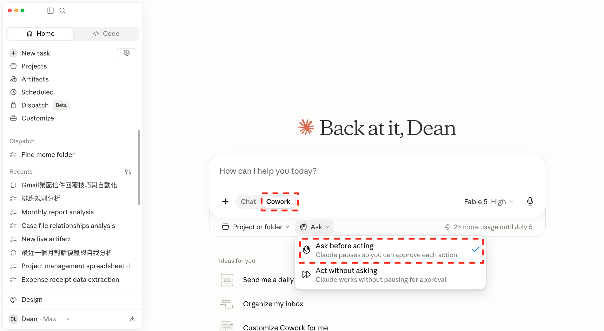

[warning title="使用提醒"]
Cowork 是有能力`新增/修改/刪除`電腦檔案的。

能力越大風險越大，你可以想想`如果事情做到一半，但額度沒了會發生什麼事`。
[/warning]

## 多格式資料彙整

> **專案資料夾塞滿 Word、Excel、PDF 不同格式的檔案**
>
> - 當你想彙整成一份`總表或摘要`，需要先辨識用到哪些檔案
> - 人工整理會因為每份格式不一（有的表格、有的純文字），`整理到一半就亂掉`
> - 網頁版的 Chat 需要`一份份上傳`，檔案一多就讓人崩潰

### 🗂️ 選一個資料夾，自動讀完彙整成目標檔案

Cowork 不用一份份拖檔案，`指定資料夾路徑`給它，它就會讀完裡面所有檔案，彙整成你要的總表或摘要。

[flow]
1. 選資料夾 — 把混著 Word／Excel／PDF 的資料夾指給它
2. 自動讀取 — 它逐份讀完，無視格式差異
3. 彙整輸出 — 整理成一份總表或重點摘要，每筆都標明來自哪個檔案
[/flow]

[download dir="cowork-folder" label="下載「凌亂資料夾」範例包" desc="混了 PDF／Excel／截圖／便條的一包亂檔"]

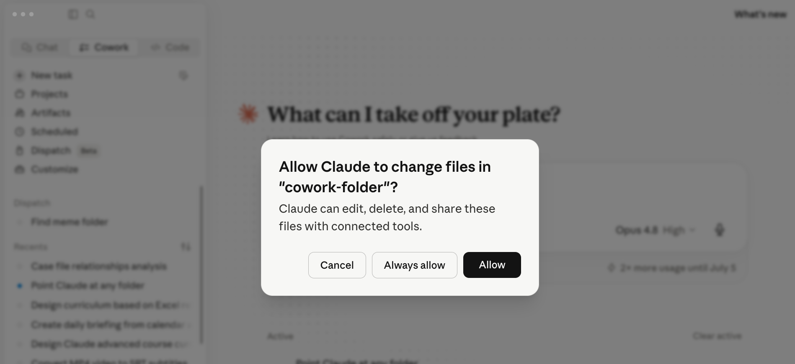

```prompt [label="把整個資料夾彙整成一份摘要"]
用摘要告訴我：「這是什麼專案、現在進度到哪、誰負責什麼、最近發生過什麼決定。」每個結論都標出處（檔名）。
```


[lab-session title="🛠️ 實戰演練" duration="10 分鐘" hint="指定一個資料夾，多格式資料彙整"]
- 用上方「凌亂資料夾」範例包，或自己挑一個混格式的資料夾
- 請 Cowork 讀完整個資料夾，彙整成一份總表或摘要
- 檢查它有沒有標明每筆資料的來源檔名
[/lab-session]

## 照片批量轉存 Excel

> **一疊發票、名片、單據，要一張張 key 進 Excel**
>
> - 特徵值（金額、日期、抬頭、電話）藏在照片裡，得`人工一張張看、一格格打`
> - 過人工處理，還`容易看錯數字、打錯欄位`
> - 量一大（幾十上百張），`整個下午都耗在 key-in`

### 📷 批量讀取照片，直接寫進 Excel

把一疊有特徵值的照片（ex: 發票、名片、單據）丟給 Cowork，它會`逐張讀出關鍵欄位`，直接整理進 Excel，不用你一張張 key。

[flow]
1. 指定照片資料夾 — 一疊發票／單據照片
2. 逐張辨識 — 抽出金額、日期、抬頭等特徵欄位
3. 寫進 Excel — 一張一列，並標明來源是哪張照片
[/flow]

[download dir="cowork-excel" label="下載「讀收據寫 Excel」範例包" desc="費用報銷表 Excel + 20 張不同角度的單據照片"]

```prompt [label="把一疊單據照片批量寫入 Excel"]
讀取[費用報銷表.xlsx]裡面的欄位後，分析[收據]內的照片：
① 逐張讀出要填寫欄位
② 寫入 Excel，一張照片一列，並在最後一欄標明來源照片檔名
③ 看不清楚或辨識不確定的格子先留空、標黃，不要自己猜數字
```

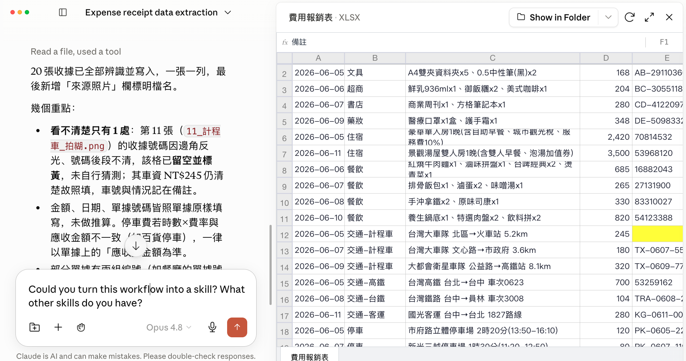

> **將驗證有效的 SOP 轉換 Skill**
> `如果流程會重複使用，就可以把它設計為 Skill`，這樣 AI 日後遇到類似問題時，不需要重頭再來一遍（因為毒）。

```prompt [label="將驗證過可重複使用的流程轉換為 Skill"]
幫我將這個工作流轉為 Skill
```

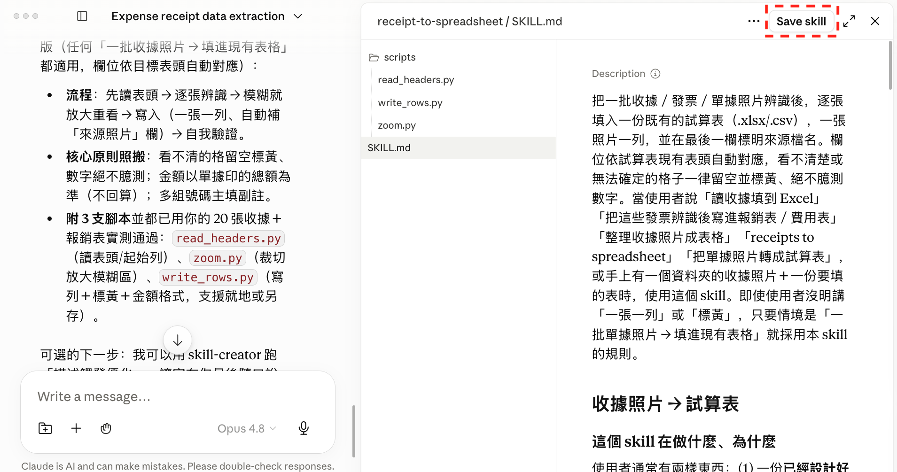

[lab-session title="🛠️ 實戰演練" duration="10 分鐘" hint="將收據照片批量寫入指定 Excel"]
- 下載範例包的 20 張單據照片
- 請 Cowork 逐張辨識，寫入指定 Excel（一張一列、標來源檔名）
- 核對辨識結果，特別看金額、日期有沒有讀錯
- 確認辨識不準的格子有留空標黃，而不是自己猜
- 將流程設計為 Skill
[/lab-session]

## 自動填入不同格式的表單

> **Excel 表單欄位多、規則雜**
>
> - 欄位一大堆、每格`填寫規則都不一樣`，人工填又慢又怕錯
> - 要填的資訊可能`散落在 Word／PDF/Markdown 文件`，得來回比對抄寫

### 📝 先摸清表單規則，再反向填入

與其人工一格格填，不如讓 Cowork **先讀懂 Excel 的欄位與規則，再從你的來源資料（ex: Word／PDF / Markdown 文件）抽出資訊自動填上**。

[flow]
1. 讀懂表單 — 先摸清 Excel 的欄位與填寫規則，列給你確認
2. 抽取來源 — 從 Word／PDF/Markdown 找出對應資訊
3. 對照核准 — 填好先給你看對照（哪格填什麼、來源哪份），核准再存
[/flow]

[download dir="cowork-form-fill" label="下載「彙整資訊填寫 Excel」範例包" desc="將散落的資訊自動填入 Excel"]


```prompt [label="把既有資料自動填進 Excel 表單"]
請根據下面步驟彙整資料，寫入[專案管理表.xlsx]：
1. 了解 Excel 的欄位與填寫規則
2. 從資料夾文件讀取所需資訊，用「純文字」的方式填入 Excel
3. 找不到或不確定的格子先留空、標黃，不要自己編
```


[lab-session title="🛠️ 實戰演練" duration="10 分鐘" hint="給範例讓 AI 了解填寫規則在寫入"]
- 下載「彙整資訊填寫 Excel」範例包
- 讓 AI 自動彙整不同格式的資訊到 Excel
- 檢查缺資料的部分有留空標黃，確認它沒亂編（ex: 專案概要[彙整資訊填寫 Excel]、參與人員[彙整資訊填寫 Excel]、任務清單[T-08]）
[/lab-session]

---

# 📌 課程總結：只有持續「實踐」，才能體驗 AI 帶來的幫助

[summary]
- 🔌 **Connector** | 透過授權，在 Claude 操作多個線上工具
- 🗂️ **Project** | 上傳知識庫、設定指令，免每次交代背景、專案分流
- ⚙️ **Skill** | 把好流程變 SOP，讓 AI 從「通才」變「專才」
- 🖥️ **Cowork** | 指定電腦資料夾，讓 Claude 接手電腦上的任務
[/summary]

### 🪞 AI 就像是一面鏡字：讓它回頭看看「你」

這堂課都在分享`AI 的技巧`，但如果你已經使用了一段時間，過去`問過的問題、踩過的坑、在意的細節`都已經默默被 AI 紀錄了。

你可以讓讓 AI 幫你**復盤**：看清自己怎麼思考、如何解決問題，再把那些`一再重複的提問，變成下一個專屬於你的 Skill`。

> **你問 AI 的問題，藏著你最想解決的事**
> 成長，不是學會多少新功能，而是越來越`清楚自己要什麼`。

```prompt [label="讓 AI 復盤你的成長軌跡"]
把最近一個月我跟你的對話抓出來，著重在使用者（我）的問題。

幫我復盤最近學了什麼，並回答以下問題：

1. 我向你詢問哪些種類的知識
2. 什麼樣的工具使用
3. 我正在解決什麼樣的問題
4. 我是怎麼樣解決問題的？切入點是什麼？在意的地方是什麼？都是怎麼樣下指令？
5. 有哪些我很常問的問題，但沒有建立成 Skill 的？
6. 你對我，有什麼有趣的洞見/長期的觀察

把以上的復盤，寫成 6 份不同的 .md 報告，並且裡面會需要把對話紀錄分門別類。
```

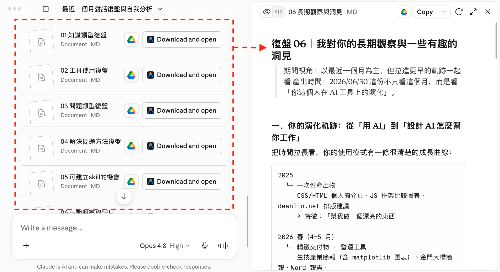

[qa-session title="Q&A 時間"]
[/qa-session]
