[interactive title="AI 使用調查"]

**Q1｜你多常使用 AI？**
`A` 每天都在用　`B` 每週用幾次　`C` 偶爾想到才用

**Q2｜使用過 Claude 的哪些功能？**
`A` Connector(連接器)　`B` Project(專案)　
`C` Skill(技巧)  `D` Cowork
[/interactive]

[feedback title="上一節課的回饋" btn="📊 上一節課的回饋" desc="資料來源：AI 代理人教育訓練成效問卷"]

compare: 每週花在各類工作的時間（平均） | 訓練前 | 目前 | 小時
7 類工作合計：每人每週從 39.2 小時降到 19.7 小時
- 資料整理與分析 | 11.9 | 5.4
- 資料搜尋／彙整／研究 | 9.6 | 4.7
- 文件／報告撰寫 | 6.6 | 3.0
- 電子郵件／訊息溝通回覆 | 3.8 | 2.0
- 簡報製作 | 3.8 | 2.7
- 客戶服務／客戶回覆 | 2.0 | 1.0
- 會議紀錄與摘要整理 | 1.6 | 0.8

bars: 最常交給 AI 代理人的工作（可複選） | 人 | 9
- 資料整理與分析 | 9
- 資料搜尋／彙整／研究 | 7
- 電子郵件／訊息溝通回覆 | 5
- 文件／報告撰寫 | 4
- 會議紀錄與摘要整理 | 3
- 客戶服務／客戶回覆 | 3
- 簡報製作 | 2

bars: 使用時遇到的困難（可複選） | 人 | 9
- 操作介面不熟悉 | 5
- 輸出結果品質不穩定 | 5
- 不確定該用在哪些任務 | 3

quotes: 同仁分享的實際案例
為保護資訊，客戶與系統名稱已隱去
- 每月銀行加密 PDF 轉傳票：原本要人工逐筆核對匯率、金額，現在跑一個指令就完成解析與填表，還抓到系統不會報錯的隱藏誤差
- 例行會計報表整理更快，還做了每月結帳通知信：時間到自動寫好草稿，確認後再寄出
- 國外客戶的運輸信件往來很多封，直接用關鍵句就找到照片、運輸排程或包裝方式
- 半年一次的獎項資料彙整，這週大約省下 4 小時
- 文件比對 10～15 分鐘就能整理出來，搜尋資料後的歸類也快很多

changes: 這堂課怎麼回應你們的回饋 | 痛點 | 這堂課
- 操作介面不熟悉（5 人） → 每個功能都附操作路徑與截圖，並安排「實戰演練」當場動手 | 設定隱私、客製化、工具使用權限
- 不確定該用在哪些任務（3 人） → 開場先給「使用時機」對照表：什麼情境該用 Connector、Project、Skill、Cowork | 使用時機
- 輸出結果品質不穩定（5 人） → 用 Project 固定背景、把驗證過的流程做成 Skill，並要求 AI「不確定就留空、標黃」 | 為什麼需要 Skill？
- 如何建立自己部門的知識庫 → Project 單元示範放進規格書、會議記錄、決策日誌，並驗證回答有出處 | 專案規格 & 會議記錄
- Skill 的管理與規劃 → 示範 Skill 的分享與匯入，也分享「Skill 不是越多越好」的經驗 | 分享 & 匯入 Skill
- 多點實際操作案例 → Vibe Coding 用同仁課前提出的「訓練安排」需求實作 | 訓練安排：共用帳號的排課難題
- 遇到問題希望能諮詢；ERP、資料庫串接 → 課程最後留一小時諮詢，現場拆解工作情境與系統串接需求 | 帶著你的工作痛點來討論
[/feedback]

# 起手式：AI 的能力，取決於你給它哪些工具

> **為什麼別人的 AI 比我的強？**
> 如果僅用聊天視窗與 AI 對話，那遠遠`無法發揮它的潛力`。

## 不是不想用，而是不知道在哪裡用

> **想讓 AI 落地，先讓大家看見案例**
> 只有實戰演練，才會知道`可以這樣做`，否則大部分的人僅使用基本的**對話功能、做重複的事**。
> 所以這堂課不只我做，也會讓大家實際動手。

### 💬 回想一下，你平常都拿 AI 來做什麼？

[flow]
- 寫文件 - 寫信、寫報告、潤稿、翻譯、改語氣
- 查資料 - 搜尋資訊、查不懂的名詞、找靈感
- 整理資料 - 彙整報表、比對文件、分析數據
[/flow]

> **這些任務有一個共通點**
> 你`問一句`、AI `答一段`，最後會拿到一個的`結果`。
> 但下次再遇到同樣的事，你還是得`從頭再問一次`。

### 🤔 痛點 1: 每一個 Prompt 都要重新交代

為了有**更好的品質**，每次開啟新對話與 AI 討論時，都要提供`背景資訊`，比如請 AI `整理判決見解`時：

[flow]
1. **角色扮演** - 你是熟悉台灣環保法規與行政訴訟實務的法務研究助理，用詞精確、不誇大結論
2. **背景資訊** - 公司從事焚化廠營運與廢棄物清理，要研究的爭點與判決範圍（ex: 近 5 年最高法院、最高行政法院）
3. **參考資源** - 指定 AI 只從`司法院裁判書查詢、全國法規資料庫、行政院公報`找資料，並附上原文連結
4. **輸出結構** - 每則判決列出字號、日期、爭點、見解、結論，再比較見解差異、整理實務多數見解
5. **查證要求** - 找不到來源的內容不要寫，不確定的地方標「待查證」，`不可以自己編判決字號`
[/flow]

```prompt [label="寫提示詞需要花很多力氣"]
你是一位熟悉台灣環保法規與行政訴訟實務的法務研究助理，用詞精確、不誇大結論。

背景：我們是從事焚化廠營運與廢棄物清理的公司。
想研究的爭點：[委託清除的廢棄物遭非法棄置時，委託人的責任]
判決範圍：近 5 年最高法院、最高行政法院

只參考以下來源，並附上每筆資料的原文連結：
- 司法院裁判書查詢：https://judgment.judicial.gov.tw/
- 全國法規資料庫：https://law.moj.gov.tw/
- 行政院公報資訊網：https://gazette.nat.gov.tw/

請幫我整理：
- 每則判決列出：字號、日期、爭點、法院見解、結論、原文連結
- 比較不同判決之間的見解差異，並說明目前實務的多數見解與依據
- 找不到來源的內容不要寫，不確定的地方標「待查證」，不可以自己編判決字號
```

[warning title="法律研究交給 AI 前，先知道這些風險"]
- AI 可能把「看起來合理」說成「實務通說」，`通說一定要有判決或出處`
- 法規會修正，要確認引用的是`現行條文`與施行日期
- 判決字號與內容一定要`回原始系統核對原文`；AI 的整理只能當研究起點
- 尚未公開的案件資料、當事人個資，`不要貼給 AI`
[/warning]

> **每研究一個新議題，就要重打一次複雜的提示詞**
> 後面的 `Project` 可以把角色、參考資源、查證要求存起來，之後只要換 `議題` 就好。

### 🤔 痛點 2: 生成結果不穩定、需要多次引導

[flow]
- **需要多次引導** - AI 第一次給出的結果通常`無法直接使用`，需要`多輪對話`才能到位；但關閉對話後，新對話窗又要**重頭磨合**。
- **受過去交談內容影響** - 討論不同主題如果`沒開新對話窗`，AI 也會`精神錯亂`；比如前面請他「寫正式的合約信」，後面又要求「生成按摩椅 KOL 文」，AI 回應品質會下降。
- **規則不夠明確** - 語言是模糊的，比如前面要求`語氣自然、不像業配`，但自然的`定義`是什麼？沒有明確的「句型範例」，每次 AI 生成的結果就像是抽獎。
[/flow]

> **提示詞很重要，但不是全部！**
> 現在 AI 回答問題時，會參考過去你跟他的`聊天記錄`。
> **操作路徑**: 左下角頭像 → Settings → Memory

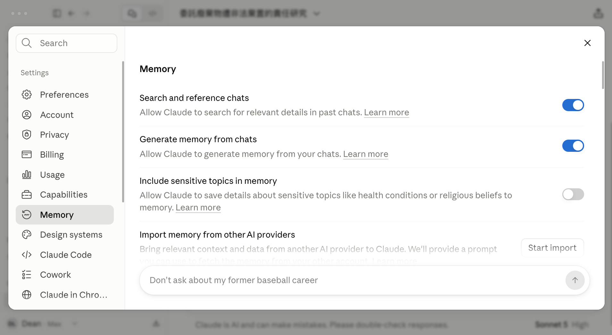

### 🤔 痛點 3: 需要自己複製貼上動手操作

[flow]
- **Mail 信件** - 要把信件內容複製貼給 AI 讀，AI 給出回覆建議後，還得自己切回信箱貼上內容再送出。
- **資料夾裡的多種檔案** - Word、Excel、PDF 要一份份上傳給 AI，彙整好的結果還得自行下載封存。
- **每週例行查詢** - 新法規、主管機關公告每週讓 AI 查完後，還要自己彙整到特定文件中。
[/flow]

> **人類比 AI 更像機器人**
> 人類的價值在於`決策`，而不是這些`瑣碎、重複`的任務上
> **如果這些痛點讓你感到共鳴，相信這堂課可以給您帶來幫助。**

[interactive title="工作中重複又無聊的事"]
**Q｜分享目前工作中感到重複、無聊的任務**
- `多久做一次`
- `一次花多久`
- `最煩的是哪一步`
[/interactive]

## 了解使用時機、合作方式

### 🧭 使用時機

| 你做的事 | 使用 [width:170] | 一句話搞懂 |
| --- | --- | --- |
| 讓 AI 讀我的信箱 / 行事曆 / 雲端檔案 | `Connector` | 給它「眼睛跟手」去碰你的工具 |
| 不想每次重講背景、限制、語氣 | `Project` | 給它「參考資訊」與身分設定 |
| 把一套有效流程變成一鍵重複 | `Skill` | 給它「SOP 手冊」照步驟做 |
| 讓它真的去整理檔案、產出成品 | `Cowork` | 給它「工作桌」自己動手 |

### 🤖 模型選擇

| [width:150] | `Fable` | `Opus` | `Sonnet` | `Haiku` |
| --- | --- | --- | --- | --- |
| **聰明程度** | ⭐⭐⭐⭐ | ⭐⭐⭐ | ⭐⭐ | ⭐ |
| **回應速度** | 中等 | 較慢 | 中等 | 最快 |
| **適合處理** | 最困難的分析、需要推理的複雜任務 | 複雜分析、長篇寫作、程式開發 | 日常任務主力，多數工作都能勝任 | 簡單問答、摘要、大量重複的小任務 |

### 🆚 Cowork vs Claude Code

- **Cowork** — 處理`電腦檔案`，適合可`重複執行`的桌面工作流程。
- **Claude Code** — 處理`程式專案`，偏向開發工具，建議搭配 `GitHub` 進行版本控制

> **Claude Code 能完成 Cowork 的所有任務**
> 儘管 Claude Code 更加萬能，但也代表`更加危險`。
> 如果沒有程式背景，當 AI `詢問權限、執行腳本`時，大多數人都會「接受」而非「確認」；只要搞錯`一次`就可能出現**資安危機或是電腦格式化**。

## 設定隱私、客製化、工具使用權限

### 🔒 調整隱私權限

**下載桌面版**: 到[官網下載桌面 App](https://claude.ai/downloads) 。
**操作路徑**: 左下角頭像 → Settings → Privacy → 將「Location metadata、Help improve our AI models」關閉

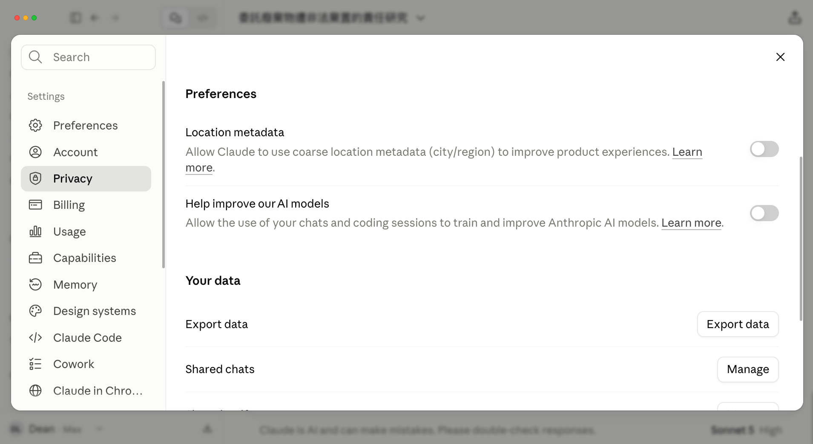

### 🧑‍💻 讓 Claude 更了解你

**操作路徑**: 左下角頭像 → Settings → Account
- **What best describes your work?**: 選擇自己的工作（ex: Consultant 顧問）
- **Instructions for Claude**: 你希望如何與 AI 協作

```prompt [label="希望如何與 AI 協作的指令"]
- 優先拆解需求
- 避免冗長理論與空泛描述
- 回覆兼顧務實性與創新性
- 討論時邏輯清晰，層次分明
- 我提供的資訊不足時，適時提出 1 至 2 個反問，引導使用者反思
```

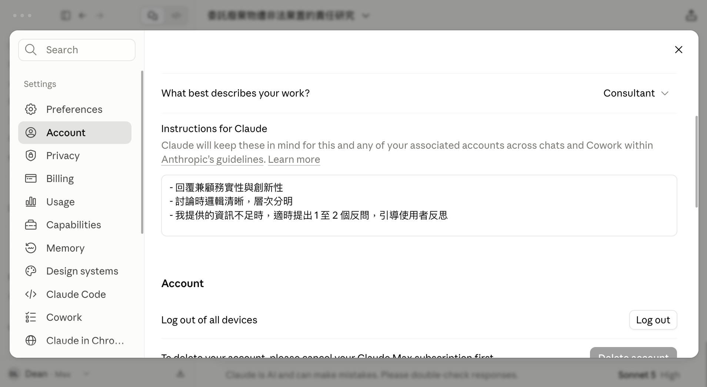

### 🦾 賦予 Claude 能力

**操作路徑**: 左下角頭像 → Settings → Capabilities

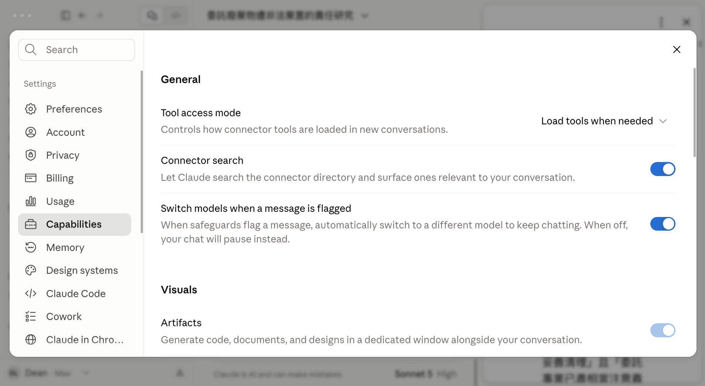

| 設定[width:200] | 可以做什麼 | 建議 |
| --- | --- | --- |
| **Tool access mode** | 決定新對話裡的 Connector 工具怎麼載入 | 維持預設 `Load tools when needed`；如果全部載入可能浪費 Token 額度 |
| **Connector search** | 主動推薦跟對話相關的工具（ex: 討論排會議時，建議你連接行事曆） | 開啟 |
| **Switch models when a message is flagged** | 訊息被安全機制標記時，自動換另一個模型繼續回答 | 開啟，避免工作到一半卡住 |
| **Artifacts** | 可以直接從對話預覽程式渲染成果 | 開啟 |
| **Code execution and file creation** | 執行程式、建立與編輯 Excel、Word、PowerPoint、PDF，並做資料分析 | 開啟 |

---

# 串接日常工具：透過 Connector 讓 AI 長出眼睛和手

> **將不同工具操作的任務集中到 Claude 處理**
> 以前寫信、建立行程、搜尋檔案都要去不同應用程式。
> 現在設定好 Connector 就能`在 Claude 集中管理`。

## 整理信件、建立標籤

> **信箱爆炸，重要的信被淹沒**
>
> - 系統通知、電子報、副本信太多，真正`要回的信被埋在下面`
> - 信件沒有分類，要找之前的信只能`靠記憶搜尋`
> - 刪除信件太繁瑣，`容量快速耗盡`

### 📥 讓 AI 幫你分類郵件、建立標籤

#### 將 Gmail 加入 Connector

**操作路徑**: Customize → Connectors → 選擇 Gmail 點擊「+」

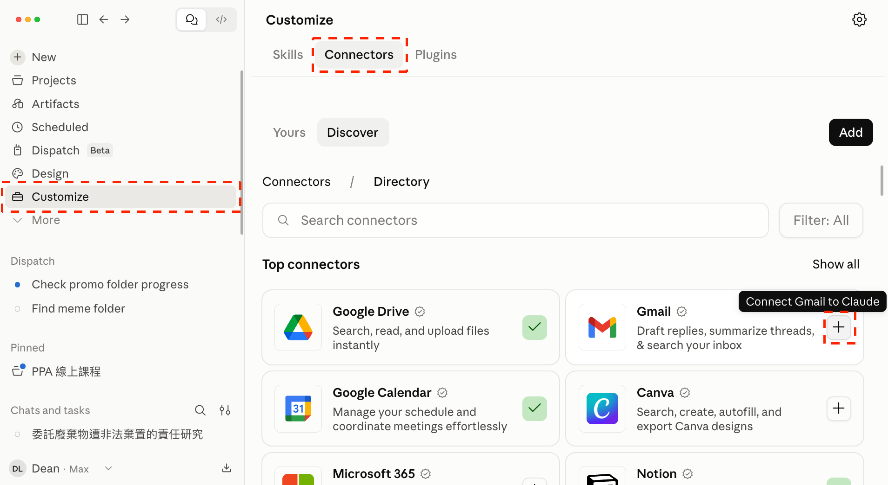

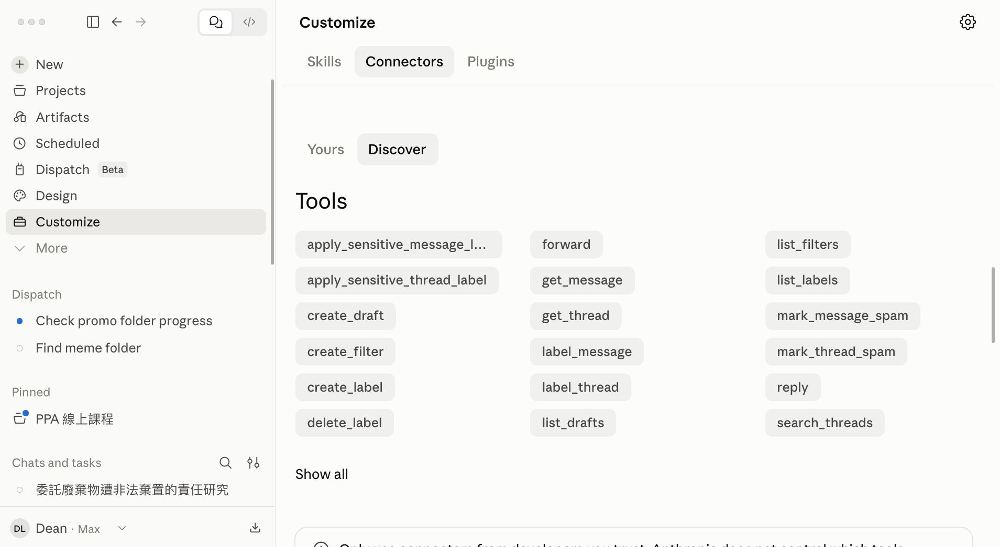

#### 分類郵件建立標籤

[flow]
- 🔴 重要 - 需要你回覆、處理或做決定的信（ex: 主管交辦、客戶詢問、廠商報價），每天`先看這一區`。
- 📁 封存 - 通知、公告、副本、已處理完的信，不用回但之後可能要查，可以直接封存。
- 🗑️ 刪除候選 - 過期的會議通知、活動通知，由你`確認後再決定`要不要刪除；刪除後 30 天會永久消失。
[/flow]

```prompt [label="分類公司信件並建立標籤"]
幫我整理信箱最近 7 天內未標籤的信件（前 [50] 封），步驟如下：

## 第一步：分類
閱讀每封信的寄件人、主旨（不需閱讀內容），依下列規則分類：

- 🔴 重要：主管、同事、客戶或廠商直接寄給我，需要我回覆、處理或做決定
- 📁 封存：系統通知、公告、我只是副本（CC）、已處理完不需回覆
- 🗑️ 刪除候選：電子報、促銷、過期的通知或會議邀請

有疑慮時，優先歸入「封存」而非「刪除候選」。

## 第二步：建立標籤並說明
如果信箱還沒有這 3 個標籤就先建立，並用表格列出分類結果：
| 寄件者 | 主旨 | 標籤 | 判斷理由 |

## ⚠️ 執行前確認
先給我清單讓我確認，我明確說「確認執行」後，才套用標籤。
不要刪除或移動任何信件。
```

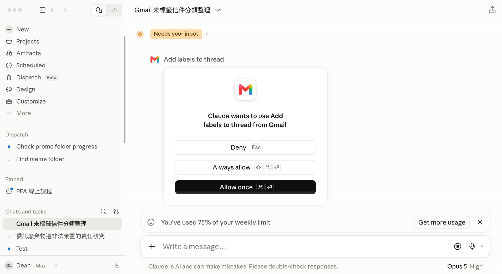

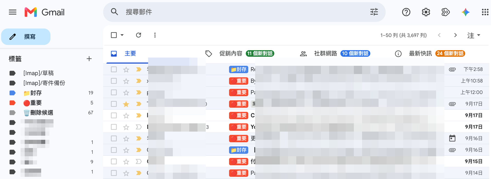

> **使用提醒**
> 建立與 Gmail 的連結後，Claude 可以`閱讀信件、建立草稿、建立標籤`
> 但`刪除信件`這類高風險操作，建議由人類在標籤建立後自己判斷；有些系統通知依舊重要。
> 建議`小範圍`測試(先 50 封)，沒問題後再擴大測試範圍、調整判斷規則。

#### 舉一反三：將 Microsoft 365 加入 Connector

> **公司信箱是 Outlook？改接 Microsoft 365**
> 一次打通 `Outlook、Teams、OneDrive、SharePoint`。

**操作路徑**: Customize → Connectors → 選擇 Microsoft 365 點擊「+」→ 用公司的 Microsoft 帳號登入

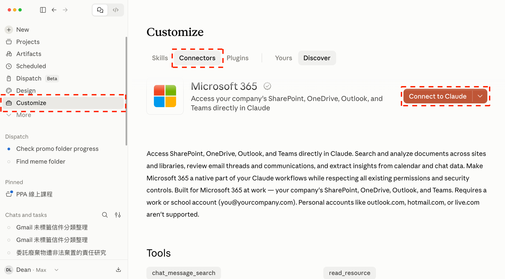

[warning title="連不上？請找 IT 開通"]
Microsoft 365 登入後如果出現`需要管理員授權`之類的訊息，代表權限還沒開通。
- **Microsoft**：Administrator 要先同意授權
- **Claude**：組織擁有者（Owner）要在後台加入 Microsoft 365
- 官方設定說明：[Set up the Microsoft 365 connector](https://support.claude.com/zh-TW/articles/12542951-%E8%A8%AD%E5%AE%9A-microsoft-365-%E9%80%A3%E6%8E%A5%E5%99%A8)
[/warning]

[lab-session title="🛠️ 實戰演練" duration="10 分鐘" hint="整理你的 Gmail"]
- 在 Connector 授權連接你的信箱
- 套用上面「分類公司信件並建立標籤」的 Prompt，讓 AI 分類信件、建立標籤
- 檢查「判斷理由」，分錯的信告訴 AI，調整分類規則
[/lab-session]

### 彙整特定主題信件脈絡

與同事、客戶的信件通常有`多段來回、細節持續調整`，而且每一段可能都有`重要資訊`。

甚至討論過程可能`不在同一封 Email 而是散落成多封`。

```prompt [label="彙整信件脈絡"]
幫我整理信箱中 [Blackbao AI] 合作的過程
```


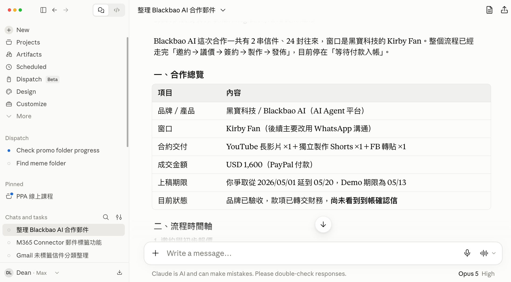

[lab-session title="🛠️ 實戰演練" duration="10 分鐘" hint="嘗試整理複雜脈絡的信件"]
- 提供`信箱主旨`的方式，讓 AI 可以搜尋到討論串
- 將內容彙整成自己期待的`格式、結論`
- 想好回覆方向後，讓 AI 根據討論脈絡撰寫`回覆草稿`
[/lab-session]

## 寫入日曆與參考資訊

> **資訊散落，行程要「貼來貼去」**
>
> - 會議`時間、地點、文件`可能散落在信箱討論串，建一個行程要反覆確認
> - 手動彙整資訊，容易`遺漏且每次格式不一`

### 📅 把零散資訊彙整為完整行程

#### 將 Google Calendar 加入 Connector

**操作路徑**: Customize → Connectors → 選擇 Google Calendar 點擊「Connect」

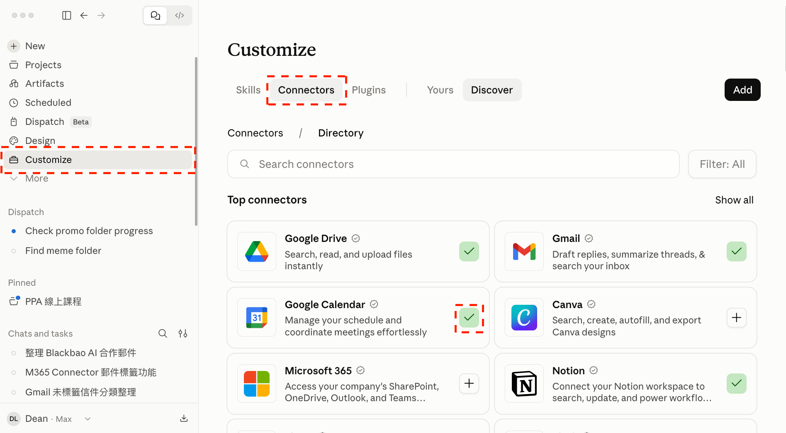

#### Gmail + Google Calendar 讓 AI 統整信件細節、加入行事曆

[flow]
1. 彙整資訊 — 讓 AI 讀取信件討論串
2. 帶入參考資訊 — 把會議連結、議程、注意事項一起寫進事件說明
3. 加入與會人員 - 取出信件討論人員，設定為 attendees
[/flow]

```prompt [label="把 Mail 討論轉成行事曆事件"]
從信箱找出[雙 11 新品活動｜上線滿月成效初步整理]信件，並在日曆上建立事件：
- 抓出最後會議的日期、時間、地點
- 在事件說明裡附上議程重點
- 取出信件討論人員，設定為 attendees
- 如果時間和我現有行程衝突，先提醒我
建立事件前，請先提供草稿讓我過目
```

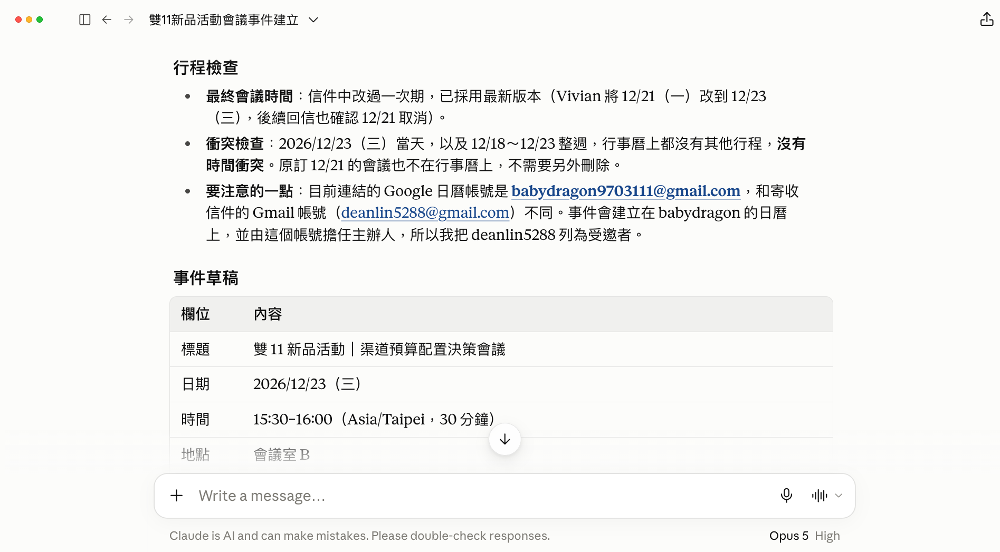

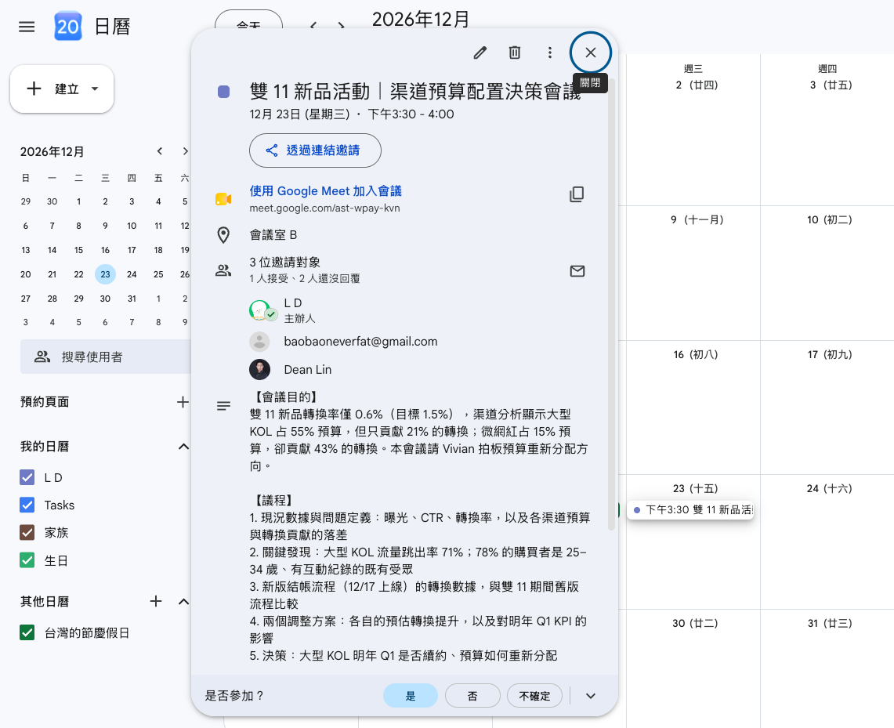

[warning title="使用提醒"]
Claude 是真的會`建立行程`，行程也會`出現在參與人日曆`，執行前請確認
[/warning]

[lab-session title="🛠️ 實戰演練" duration="10 分鐘" hint="只要提供來源 AI 就能彙整成行事曆"]
- 授權連接你的`行事曆`
- 將`信箱討論串、Teams 聊天對話`提供給 AI
- 請 AI 協助彙整`議程重點、與會人員、會議連結、會前要準備`資訊，並建立事件
[/lab-session]

[interactive title="你都請 AI 幫你做什麼？"]
**Q1｜你最常請 AI 幫忙做什麼？**
`A` 寫文案、信件　`B` 整理資料、做摘要　`C` 查資料、學新東西　`D` 寫程式、處理表格

**Q2｜AI 給的結果，通常可以直接用嗎？**
`A` 幾乎直接用　`B` 小改一下就能用　`C` 要大改才能用　`D` 常常乾脆自己來
[/interactive]

# 建立專屬知識庫：建立 Project 不必每次重講背景

## 為什麼要建立 Project

### 😩 痛點：背景每次重講，品質還不穩定

[flow]
- **同個聊天視窗中** - AI 對話有上下文限制，`超過會變笨`；討論不同主題，`幻覺會嚴重`
- **開新的聊天視窗** - 你需要`重新交代背景資訊`，每次打的指令都不一樣
- **需要重新上傳參考資訊** - 如果檔案放在電腦，而你剛好`人在外面就無法操作`。
[/flow]

> **AI 有記憶能力，但不是無限的**
> 儘管現在 AI 已經具備記憶能力，回答時會參考你過去與他的對話，但`非常隨機`。
> 而 Project 的設計，就是讓`隨機變成穩定`。

### 🧠 根據不同情境建立對應專案

[flow]
- **不同專案扮演的角色不同** - 組員、主管、甲方、乙方、顧問、講師
- **手上有多個案子在跑** - 不同廠區的改善案、不同系統的導入案、不同廠商的合約
[/flow]

> **專案（Project）就像第二大腦**
> 現在的工作通常都是`多工進行`，但人類切換到另一個專案時大腦會混亂。
> 既然如此，就讓 AI 幫你記住`專案的細節、自己扮演的角色`

### 🗂️ Project 基礎架構

[flow]
- **指令（Instructions）** — 我是誰、這個專案在做什麼、固定規則（ex: 要參考的資源、不要做的事）
- **知識庫（Files）** — 參考資料，可以是提案單、會議記錄、決議日誌、內部規範
- **記憶（Memory）** — 這個 Project 使用一段時間後，就會更理解你想要做的事
[/flow]

[warning title="使用提醒"]
Project 目前`無法分享`給其他人，主要針對個人使用設計
[/warning]

## 提案單、議事錄 & 決議追蹤

> **沒人記得「我們當初為什麼這樣決定？」**
>
> - **案子跑好幾個月**，提案單、會議結論、決議`散落各處`，甚至格式不一
> - **新人接手**要花大量時間閱讀`過去的信件與文件`
> - **反覆爭論**早就拍板的事，因為`沒人記得當初討論過`
> - **內規改版**沒跟上，用舊版本寫進簽呈、合約，送出去才被退件

### 🧠 建立第一個專案 Project

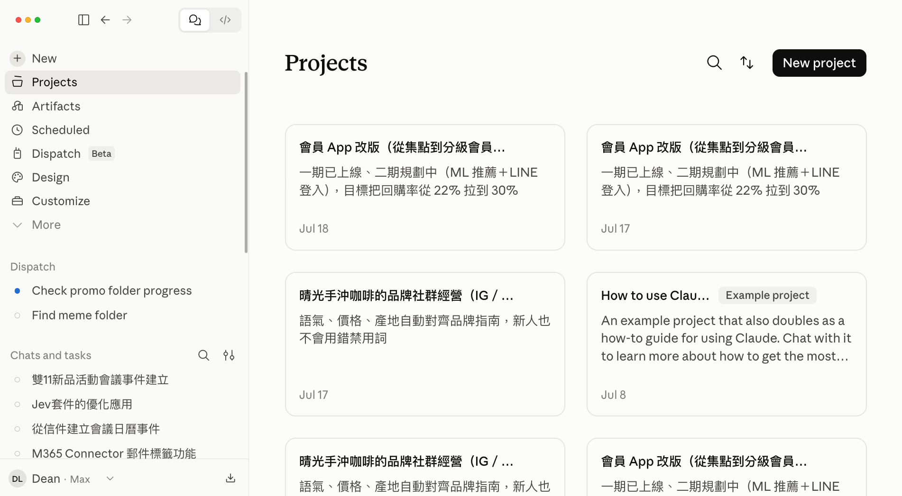

- **What are you working on**: `廠務與系統類提案的決議追蹤`
- **What are you trying to achieve**: `有人問「這案當初為什麼這樣決定、後來改了沒、現在誰在追」，都能從文件找到出處`

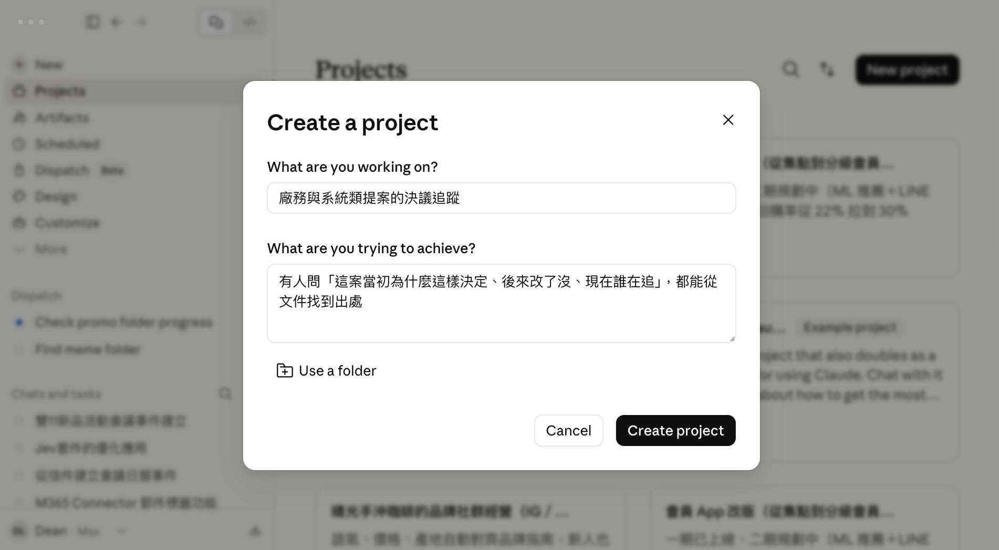

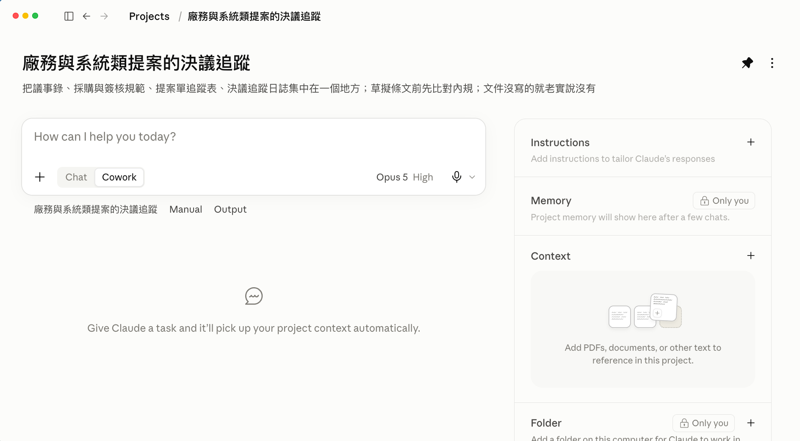

- **指令** — 設定成「決議記憶助理」：回答以文件為準、要附出處、找不到就說沒有、草擬條文前先比對內規
- **知識庫** — 分兩步放：`定版的 PDF 直接上傳`（議事錄、採購與簽核規範），`會變動的 Word／Excel 放 Google Drive 用連結參考`（提案單追蹤表、決議追蹤日誌）

#### 設計專案指令（Instructions）

```prompt [label="instructions：決議記憶助理"]
## 角色設定

你是這個專案的決議記憶助理，你的任務是幫團隊「回憶、查找、把關」，而不是自己發明設定。

## 回答原則

1. 回答一律以知識庫內的提案單、會議記錄、決議日誌為準，並標明出處（哪份文件、哪次會議、哪筆決議編號）。
2. 知識庫裡找不到答案時，明說「目前文件沒有記錄」，不要臆測或補完。
3. 遇到互相矛盾的記錄時，以「日期較新的決議」為準，並提醒我有衝突。
4. 決議日誌中標示「已被取代」的條目，回答時以取代後的最新決議為準，但要補一句「原本是…，後來因…改為…」，讓我看得到演變。

## 你該主動做的事

1. 我要草擬簽呈、合約條款、採購說明時，先比對「採購與簽核規範」，違反的地方標出條號並給我替代寫法。
2. 金額與核決層級對不上時主動提醒（ex: 300 萬以上要送董事會）。
3. 我給的資訊不完整時，先問我關鍵缺口（金額、廠區、期限），不要自己編。

## 輸出格式
- 查找類問題：先給「一句話結論」，再附「出處」與「原文摘錄」。
- 整理類問題：用條列或表格，並標注負責人與期限（若文件有記）。
```

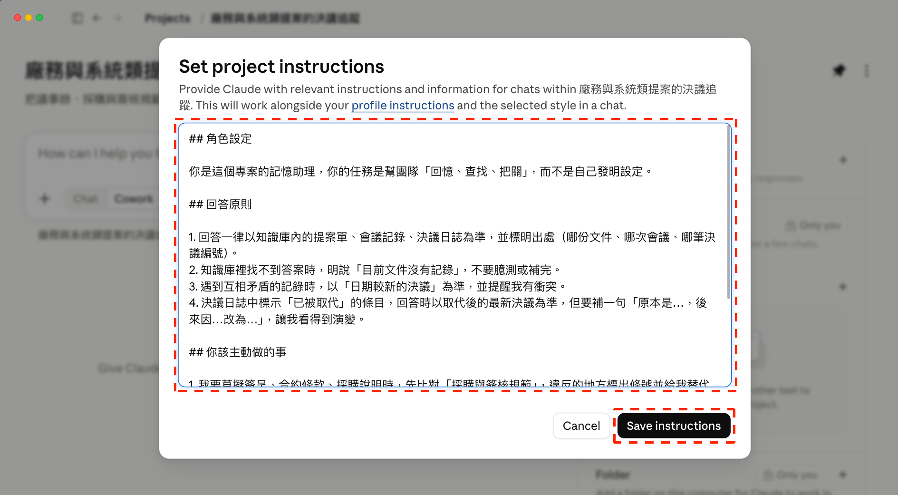

### 📄 第一步：定版的文件直接上傳（PDF）

[download dir="project-memory" label="下載「決議追蹤 Project 知識庫」範例包" desc="議事錄 PDF、採購與簽核規範 PDF、提案單追蹤表 Excel、決議追蹤日誌 Word（解壓即用）"]

> **哪些文件算「定版」？**
> 簽核完的`議事錄`、公告生效的`內規`，發出去就不會再改，要改也是另出新版本。
> 這類文件通常就是 PDF，直接拖進 Project 上傳最省事。

#### 加入專案知識庫（Files）

先把範例包裡的兩份 PDF 拖進 Files：`會議記錄與議事錄.pdf`、`採購與簽核規範.pdf`

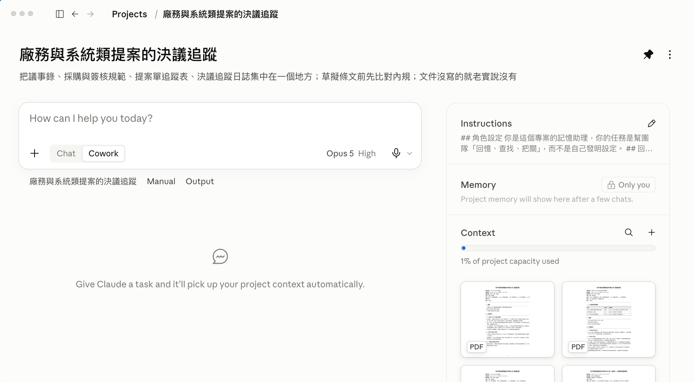

[warning title="PDF 要注意"]
掃描或拍照轉出來的 PDF 其實是`一張圖`，AI 讀起來很吃力，盡量給`文字可以選取`的版本
[/warning]

#### 出處可追溯

```prompt [label="驗證可找出處"]
2026 年 5 月董事會的決議與待辦有哪些？負責人是誰？
```

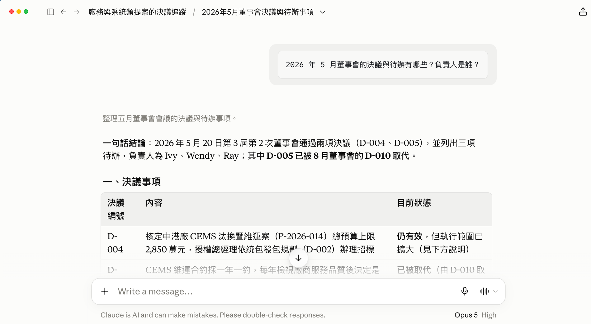

> **不要再依靠大腦記憶了**
> 事後追溯幾個月前的東西，得自己翻信件與文件才知道「誰負責、哪時候講的」。建好 Project 後，問一句連出處（哪份文件、哪次會議）都一起附上。

#### 違反內規會被抓出來提醒

```prompt [label="驗證規範檢核"]
我想在 CEMS 維運合約加上「每年自動續約、不需重新議價」，幫我擬一段條文
```

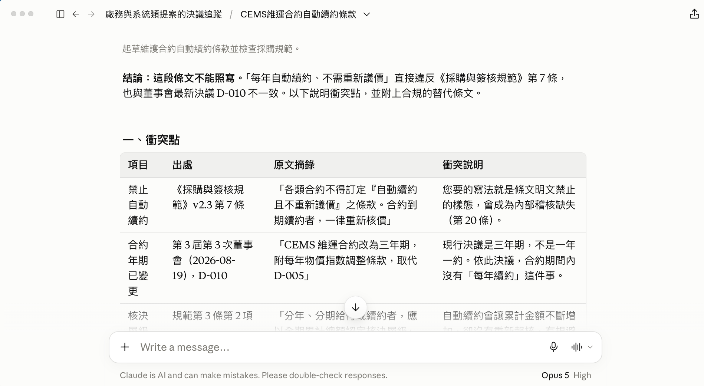

> **踩到的不只是內規，有些是法規**
> 內規是公司自己訂的紅線，但背後很多是`法規要求`，踩線輕則退件重做，重則變成稽核缺失：
>
> - **採購程序**：比價家數、核決層級這些規定是為了`避免圖利與弊案`，也是內部稽核、外部查核一定會看的項目。
> - **環保許可**：涉及`空污防制、廢棄物處理`的設備與委外，主管機關許可文件、廠商合格證明缺一不可。
> - **契約條款**：自動續約、不重新議價這類寫法，發生`履約爭議`時很容易對公司不利。
> - **職安衛**：訪查缺失的`改善期限`有法定要求，逾期未改善會被列管追蹤。
>
> 把這些紅線整理進知識庫的「採購與簽核規範」，`AI 會在你動筆前就先提醒`，同仁不用把條文全背起來。
>
> ⚠️ 實際認定以主管機關與最新法規為準，重大案件仍建議走`法務／法遵複核`。

#### 不知道的問題會誠實回覆

```prompt [label="故意問不存在的資訊"]
仁德廠滲出水處理設備汰換案，現在進度到哪？
```

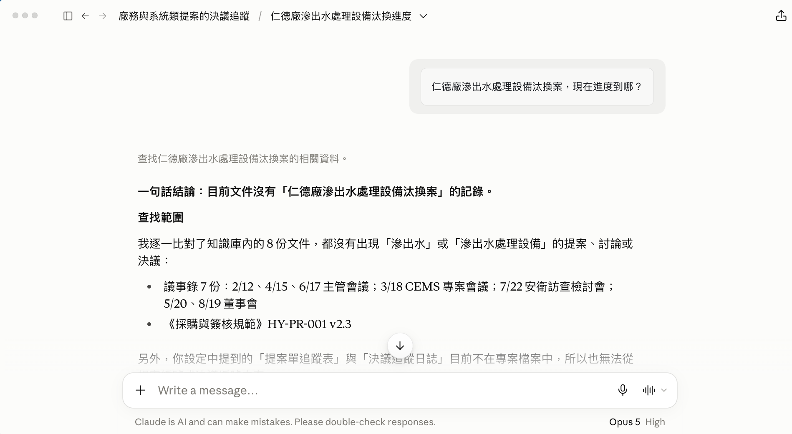

> **AI 時代很少有人看過全文，所以要盡可能減少幻覺**
> 有時 AI 遇到`文件沒寫的事會自己編`，讓你誤信。
> 在 Project 的`指令`要求他誠實說「目前文件沒有記錄」，可以**大幅減少幻覺**。

[lab-session title="🛠️ 實戰演練（一）" duration="10 分鐘" hint="建立專案，上傳定版的 PDF，驗證「找得到出處、抓得到違規、沒寫的會誠實說沒有」"]
- 新建一個 Project，貼上講義範例標題與描述
- 貼上專案指令（Instructions）
- 下載範例包，把兩份 PDF 上傳到知識庫（Files）
- 用上面三個問題驗證：`出處有沒有附、違規有沒有抓、沒寫的會不會誠實說沒有`
[/lab-session]

### ☁️ 第二步：會變動的文件放雲端，用連結參考（Word／Excel）

> **為什麼不一起上傳就好？**
> `提案單追蹤表`每週都在改狀態、`決議追蹤日誌`每次開完會就多一條。
> 上傳到 Project 的是「上傳當下那一版」，改了就得回來重傳，非常容易忘記。
> 放 Google Drive 用連結參考，雲端改完，AI 下次回答就是新的。**團隊共用同一份來源，不會各拿各的舊檔**

#### 將 Google Drive 加入 Connectors

**操作路徑**: Customize → Connectors → 選擇 Google Drive 點擊「Connect」

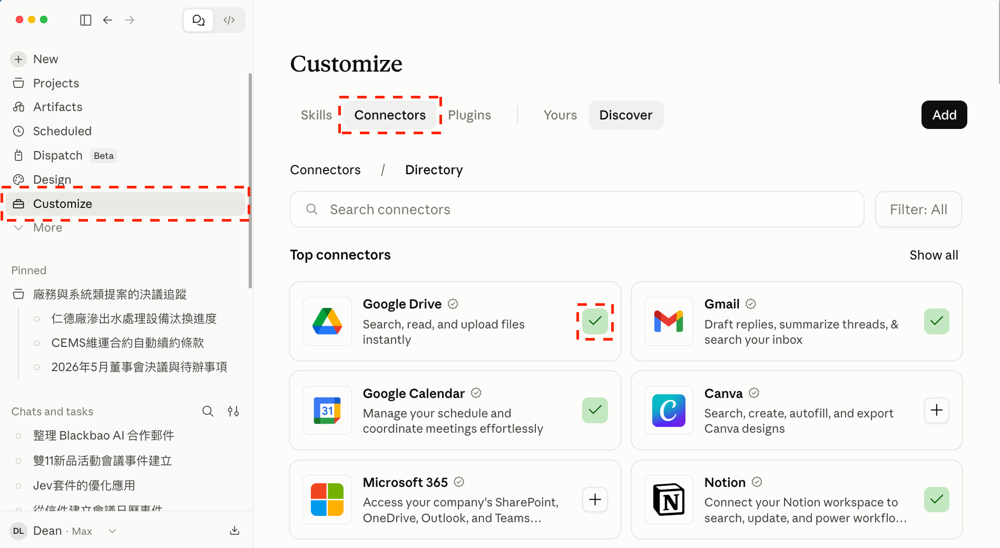

#### 把 Word／Excel 放到雲端硬碟，轉成 Google 格式

- 把範例包裡的`提案單追蹤表.xlsx`、`決議追蹤日誌.docx`上傳到 Google Drive
- 分別用「Google 試算表」「Google 文件」開啟，存成 Google 格式

[warning title="連結前先轉檔"]
Claude 讀 Google Drive 時，`Google 原生格式（Docs、Sheets）最穩定`，直接連結 Office 檔案有時會找不到內容。Word／Excel 上傳後記得轉一下再貼連結
[/warning]

#### 用連結加入知識庫

- **提案單追蹤表（Google Sheets）**: 連結待補
- **決議追蹤日誌（Google Docs）**: 連結待補


#### 變更的決策可追溯邏輯

```prompt [label="驗證可推理邏輯"]
中港廠 3 號爐當初為什麼不一起汰換？這個決定後來有變嗎？
```

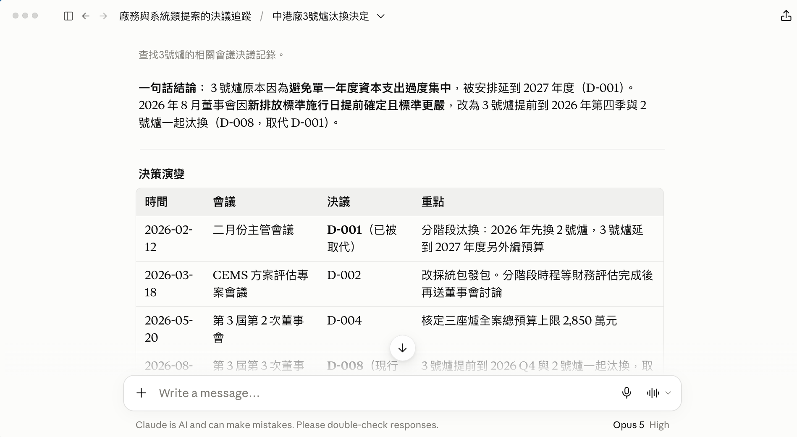

> **就算參加會議的當事人，也未必記得決策**
> 現實生活中，我們很常討論`過去已經決議的事情`，因為`沒人記得`當初的理由、也不知道`後來改了沒`。
> 案例中可以看到 AI 會引用`決議日誌`的原始理由，並主動點出「這條已被新決議取代」。

#### 提案現在跑到哪一步

```prompt [label="驗證可查進度"]
仁德廠灰渣輸送皮帶更新案現在到哪個階段？中間為什麼被退件過？
```

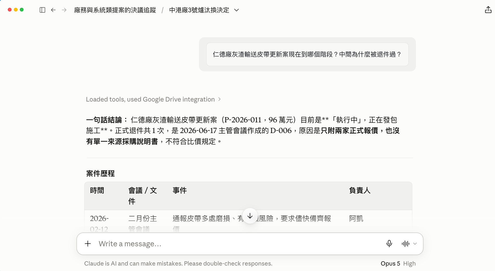

> **一張表就是全公司的進度看板**
> 提案單追蹤表由承辦人在雲端維護，主管不用再問「那個案子怎麼了」，直接問 AI 就好，答案還會附上是哪次會議退的、補了什麼。

#### 雲端改完，AI 馬上讀到新的

先到 Google Sheets 把 `P-2026-013` 的狀態從「審查中」改成「已核定」，再問：

```prompt [label="驗證雲端即時更新"]
化驗室試劑與耗材年度採購案現在的狀態是什麼？
```

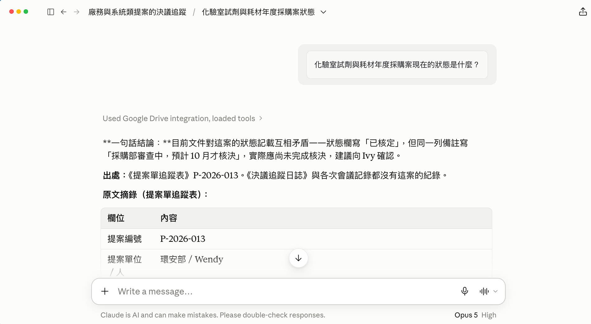

> **這就是兩種放法的差別**
> 第一步上傳的 PDF，改了要`回來重傳`；第二步連結的雲端文件，`改完就生效`。
> 一句話：`定版的用上傳、會改的放雲端`。

[lab-session title="🛠️ 實戰演練（二）" duration="10 分鐘" hint="開啟 Google Drive，把會變動的 Word／Excel 用連結加入知識庫"]
- 在 Connectors 授權連接 Google Drive
- 把範例包的`提案單追蹤表.xlsx`、`決議追蹤日誌.docx`上傳到雲端硬碟，轉成 Google 格式
- 在 Files 選擇 Drive，貼上兩份文件的連結
- 問「3 號爐為什麼不一起汰換」，確認 AI 有點出決議被取代
- 到 Google Sheets 改一格狀態，再問一次，確認 AI 讀到的是新的
[/lab-session]

---

# 把好方法變成 SOP：設計 Skill 站在更高的起點
> 
> **Skills 的出現，讓 AI 的價值可以持續累積**
> 需要重複執行的流程，都值得設計成 Skill

## 為什麼需要 Skill？

### 🤯 流程都在某個人腦袋裡

[flow]
- **關鍵人物不在，流程就卡死** - 「這份文案怎麼寫？系統怎麼設計的？專案下一步該做什麼？」如果答案全在某個`資深同事`的腦袋；他一請假、離職，這一切就需要`重新摸索`。
- **交接靠口耳相傳，品質全憑運氣** - 新人上工時，只拿到`零散筆記`和`口頭經驗`；因此報告、信件、文案...每個人的`格式、品質`都不一樣。
- **需要手把手教學，難以擴散** - 許多流程需要`實際 Demo`才能搞懂，因此就算有好方案也`擴散不出去`，案例難以複製到不同部門。
[/flow]

### 📋 提示詞一直複製貼上

[flow]
- **存了一堆 Prompt，要用時翻半天** - 提示詞散落在`記事本、Notion、聊天記錄`；真的需要使用時，光是找出`最後一版`就浪費一堆時間。
- **換個情境就得調整提示詞參數** - 同一套文案 Prompt，換個品項、從 IG 改到 EDM 就得`手動微調`，浪費時間。
- **規則改了，舊版本卻沒跟著改** - 新增一個`禁用詞`、調整了`品牌語氣`，但同樣的 Prompt 已經`被複製到十個 Projects`；漏改一處，錯的版本就`默默繼續產出`。
[/flow]

## 提出需求建立 Skill

> **不要一開始就想設計完美的 Skill**
> 我們可以在 AI 的輔助下設計 Skill 的`雛形`，然後再一次次的實踐中`優化細節`。
> 現在這個`線上講義也是透過 Skill 輔助生成的`，版本`迭代超過 100 次`；只要頻繁使用的 Skill，一定會有不滿意、想調整的部分。

### 📝 建立工作日誌 Skill

Skill `不需要`全程自己`手動建立`，可以先透過 Claude 內建的 `skill-creator` 來生成。

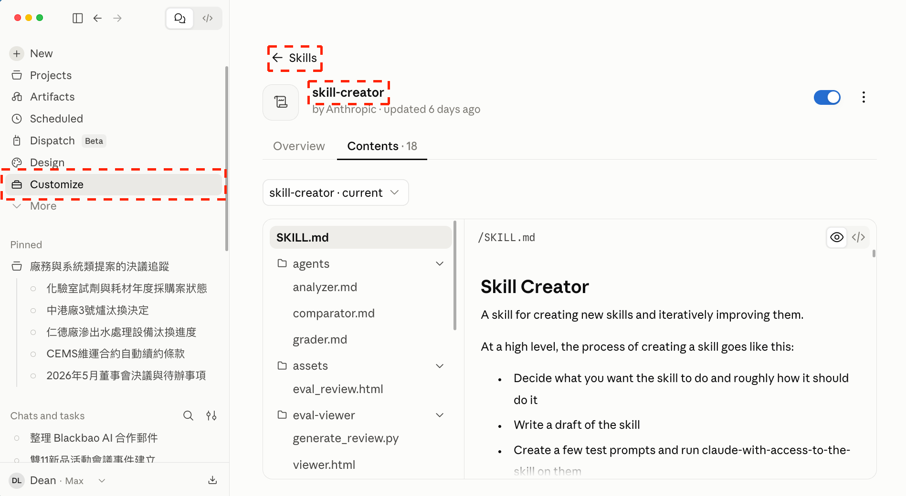

#### 參考資訊來建立 Skill

```prompt [label="提供自己期待格式，而非讓 AI 自由發想"]
/skill-creator
我想要建立一個 Skill: [work-report]
會根據我與 AI 的對話紀錄，整理成適合給主管閱讀的「日報 / 週報 / 月報」
產出前請先取得當下時間，並依需求判斷報告週期；若未指定，預設產生[日報]
若在專案中執行，請嘗試判斷[專案名稱，並顯示在報告最上方]
報告重點請聚焦：[完成事項、推進進度、重要決策、問題風險、下一步行動]，並遵循下面規則：
- 避免流水帳，整理成能快速理解的工作進度
- 不誇大成果，不要把未完成事項寫成已完成，也不要編造對話中沒有的內容
- 請使用繁體中文，語氣專業、務實、清楚。
- 直接輸出報告，不需要額外解釋
```

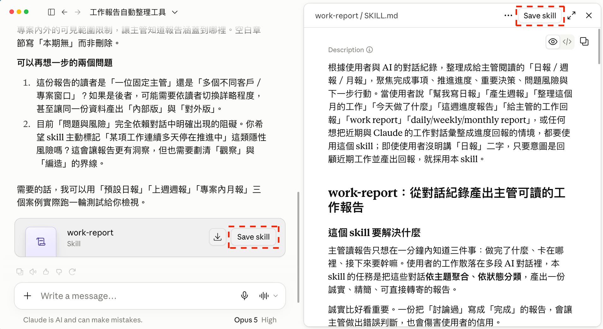

> **個人心得**
> AI 設計的 Skill 有時會有`過度設計、冗贅資訊`的問題，可以根據實戰結果`調整細節、資料夾結構`。

#### 驗證 Skill 符合預期

Skill 建立完成後，有 2 種方式觸發：
- **用「意圖、關鍵字」觸發**: 盡可能設計成`被動觸發`，因為 Skill 會越來越多，要記住每個名稱並不現實。
- **輸入「/skill-name」指定觸發**: 當然也可以`主動觸發`，當一段對話中想綜合多個 Skills 功能時，這個方案較為穩定。


```prompt [label="在 Chat 開新對話測試"]
生成週報
```

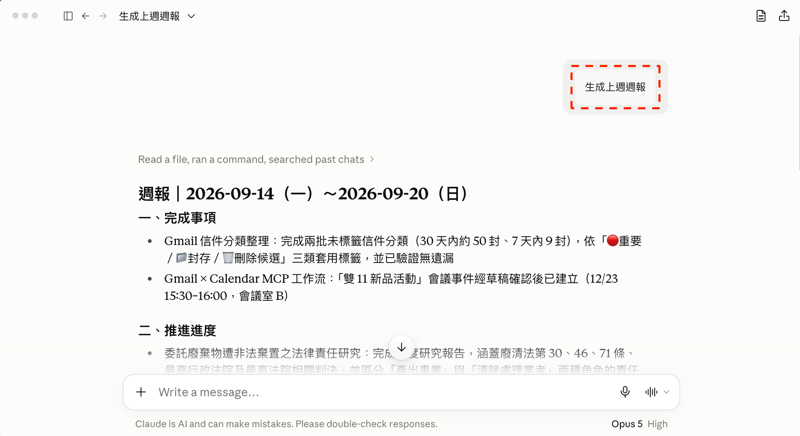

> **Claude 的 Chats 跟 Projects 的記憶是分開的**
> 如果想要取得特定 Project 記憶，就需要進去操作；下面可以到先前建立的`廠務與系統類提案的決議追蹤`專案測試

```prompt [label="選一個 Project 開新對話測試"]
/work-report
```

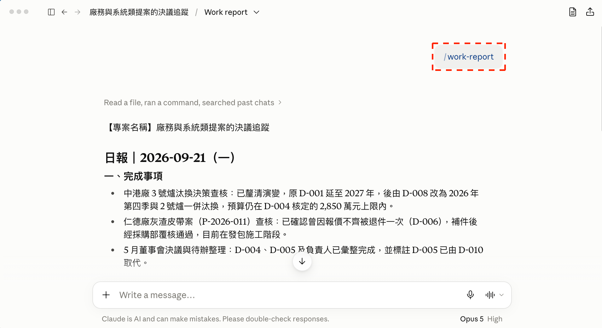

[lab-session title="🛠️ 實戰演練" duration="15 分鐘" hint="建立 Skill，並在 Chat、Project 驗證可用性"]
- 貼上講義提示詞，來建立初版 Skill
- 完成後記得點擊「Save skill」
- 在聊天（Chat）驗證 Skill
- 在專案（Project）驗證 Skill
[/lab-session]

## 彙整對話生成 Skill

> **不要急著關閉對話窗**
> 使用 AI 一段時間後，你會發現`好的結果需要經過多輪對話`才能得到。
> 而你`引導 AI 的過程`，其實可以把它設計成 Skill，或是拿來優化既有的 Skill。

### 📝 建立提案企劃

一年前，建立提案企劃草稿需要與 AI 討論`半小時以上`，並`來回執行這麼多的 Prompt`

#### STEP 1: 產生合適的 Prompt（聚焦需求）

```prompt [label="先簡單說明背景"]
我準備製作一個[給台灣新創行銷公司導入 Claude AI]的提案企劃

以上面的 Prompt 為基礎，我要提供怎麼樣的 Prompt 可以得到較好回答？
請說明為什麼，並在最後舉出能得到專業回覆的 Prompt 範例。
```

#### STEP 2: 詢問是否有需要補充的內容

```prompt [label="看似完善的 Prompt 可能還有可以優化的地方"]
在用這個 Prompt[撰寫提案企劃前]有任何問題，請先詢問我，不要直接產生。
```


#### STEP 3: 讓 AI 幫我們補齊不足的資訊（也可以自行回答）

```prompt [label="建議自己填寫，AI 僅為參考"]
請扮演對這個領域非常熟悉的[產業顧問]，針對提出的問題給出具體詳細的回覆、不要逃避問題。
```

#### STEP 4: 從利害關係人角色來看需求、問題

```prompt [label="一份企劃能不能過，不能只考量到自己"]
請分析這份企劃最重要的[3]個利害關係人，從他們的角度和利益出發，詳細說明對這份企劃有哪些具體的[意見、建議、憂慮]？
```

#### STEP 5: 將利害關係人顧慮彙整，重新產生企劃

```prompt [label="優化提案企劃"]
請扮演[提案企劃]的專家，了解[利害關係人]的想法後，以最專業的角度在企劃補充更完善、可行的方案。
```

#### STEP 6: 用紅藍隊的概念攻防（競爭者）

```prompt [label="從挑戰者的角度來優化企劃"]
你是這份提案企劃的[競爭者]，盡可能列出這份企劃的不足之處。
並說明自己可以做到哪些更完善、可行的方案。
```

#### STEP 7: 生成完善企劃

```prompt [label="最後要生成完善的企劃"]
請扮演[提案企劃]的專家，在了解[不足之處、更完善的方案後]後，以最專業的角度，重新完善這份企劃。
```

### 🛠️ 將對話彙整為 Skill 

這個是講者的[對話紀錄](https://claude.ai/share/522afd9a-5487-45d4-b9c2-871070124945)供大家參考。

```prompt [label="請 AI 彙整對話後建立 Skill"]
請根據以下要求分析上方對話內容後，整理成可重複使用的 Skill，名稱為[Proposal Refiner]

1. 起初怎麼提問
2. 中間如何引導與調整
3. 最終是如何得出這個成果的
```


#### 驗證 Skill 符合預期

```prompt [label="用不同主題來驗證 Skill"]
/proposal-refiner 我要做一份[給連鎖餐飲品牌導入 AI 點餐分析]的提案企劃，幫我做到專業可行的程度。
```


[lab-session title="🛠️ 實戰演練" duration="10 分鐘" hint="將過去與 AI 的對話建立成 Skill，並驗證可重用性"]
- 找過去自己與 AI 的對話紀錄，哪個問題`常常重問`
- 讓 AI 彙整對話建立 Skill
- 驗證 Skill 在不同主題也可應用
[/lab-session]

## 分享 & 匯入 Skill

> **分享驗證過的 Skill，讓成效拓展**
> 在 `Project 放知識`，`Skill 設計流程`，兩者是互補的。
> **Project 讓 AI「知道事實」** — 你扮演的角色、品牌規範、產品資訊、專案細節
> **Skill 讓 AI「知道步驟」** — 寫行銷文案、月報、信件、會議記錄要遵守的 SOP。

### 💾 將 Skill 下載為壓縮檔

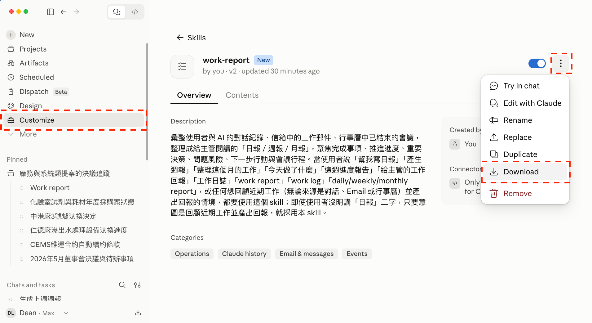

### 🤝 匯入別人建立好的 Skill

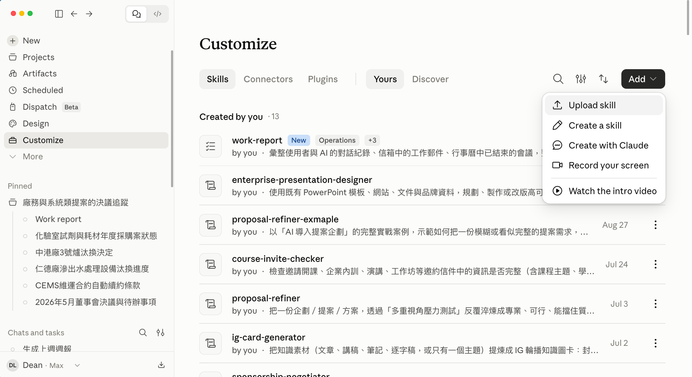

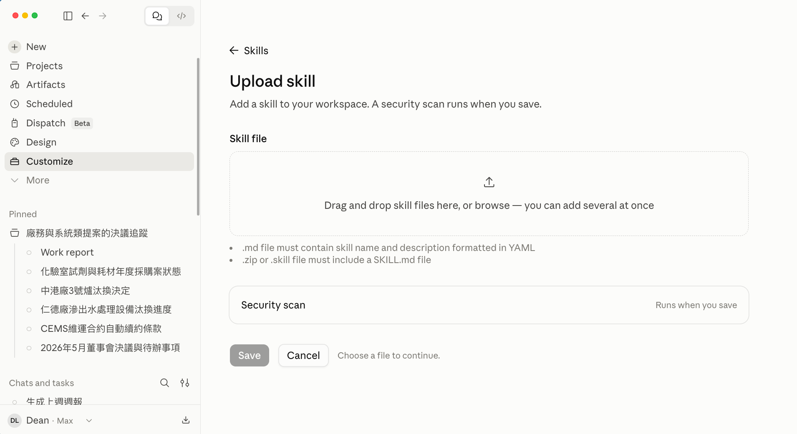

[download file="assets/proposal-refiner.skill" label="下載「.skill」範例包" desc="前面用 AI 彙整對話建立的 Skill(生成提案)"]

```prompt [label="驗證匯入的 Skill 可以運作"]
/proposal-refiner 我要做一份[給傳統產業導入 AI 提升效率]的提案企劃，幫我做到專業可行的程度。
```


[lab-session title="🛠️ 實戰演練" duration="10 分鐘" hint="嘗試下載 & 匯入 Skill"]
- 將自己完成的 Skill 下載下來
- 嘗試匯入 `.skill、.zip` 的 Skill
- 驗證匯入的 Skill 可以使用
[/lab-session]


## 深入認識 Skill

### 🎒 Skill 的結構

[html src="./html/skill-anatomy.html"]

### 🔍 Skill 的三個執行階段

[flow]
1. Discovery（發現）：AI 讀取技能名稱與描述，判斷是否與任務相關
2. Activation（啟動）：匹配成功後，才完整讀取整份 Skill 文件
3. Execution（執行）：根據文件描述逐步執行任務
[/flow]

> **Skill 為什麼能節省 Token？**
> Rule 每次都會讀完整文件；Skill 在匹配需求前`只讀標題與描述（Metadata）`。
> 就像 Google 搜尋時先看標題摘要，確認相關再點進去。

### 📝 生成線上講義

[download file="assets/course-page-generator.zip" label="下載「.zip」範例包" desc="輸入主題生成線上講義"]


```prompt [label="輸入主題/草稿生成 HTML 講義"]
/course-page-generator 幫我做一份「Claude Code 從零開始」的課程網頁
```


[bonus title="🎁 製作心得"]
這個課程網頁的製作，走過了一段從「結果不可控」到「完全掌控」的歷程。

1. **遇到痛點** — Vibe Coding 出來的網頁，調整內容都要改 HTML，非常不方便
2. **逆推結構** — 讓 AI 把現有網頁拆解，對應成一套可用 Markdown 撰寫的格式
3. **內容與版型分離** — 只需改 Markdown，自動套用對應版型，細節完全可控
4. **設計 Agent Skill** — 不是讓 AI 生成網頁，而是讓 AI 學會「這份 Markdown 怎麼寫」
5. **模板生成器思維** — AI 負責生成結構化內容，程式再把內容轉成最終網頁
[/bonus]

[warning title="使用提醒"]
原本這個 Skill 是設計在 `Claude Code 使用`，直接在 Chat 雖然也能使用，但 `Token 消耗極快`。

如果真的打算使用，`記得把資訊調整成自己的`，另外這個 Skill 的原理，可以參考我過去[拍攝的影片](https://youtu.be/0pZri5f_tfk)。
[/warning]

### 🖼️ 生成 IG 圖卡

[download file="assets/ig-card-generator.zip" label="下載「.zip」範例包" desc="提供文案生成 IG 圖卡"]

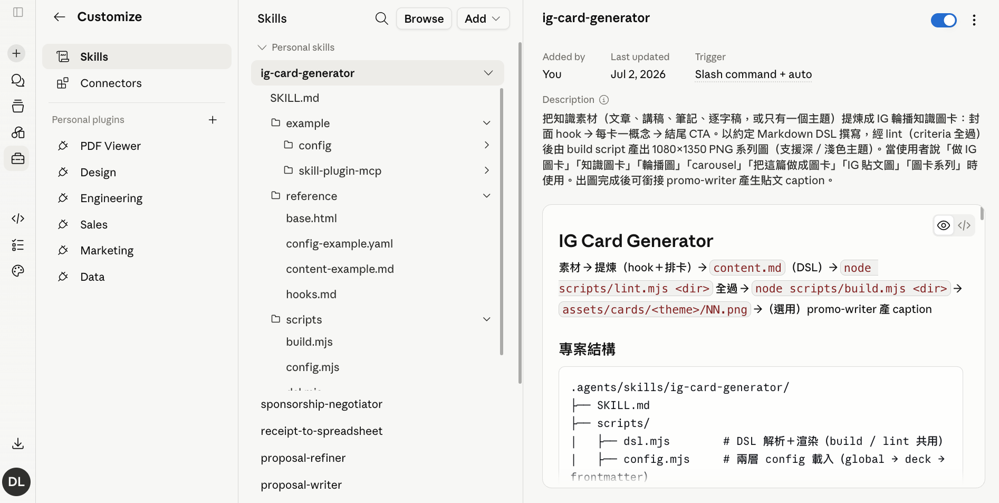

```prompt [label="提供一段文案，生成 IG 格式圖卡"]
/ig-card-generator
【用 AI 寫程式，卻覺得沒有比較快？】

上個月企業內訓時，在課前有位工程師跟我說：「我每天都在用 AI 寫程式，但說實話，效率好像沒什麼提升。」

因此我請他示範平常的用法。

他先打開 ChatGPT、把需求貼上去、等回覆、複製回 VS Code、跑起來報錯、再把錯誤訊息貼回去問。

來回操作四五次後，我跟他說：「或許不是 AI 幫不了你，是你還沒用到合適的工具。」

────

我使用 AI 輔助開發 3 年了，前兩年也是這樣用的；只把它當成一個比較聰明的「問答機器人」，有問題就問，問完自己動手。

直到去年開始用 AI 程式碼編輯器，整個工作效率才明顯提升，兩者的差別在於：

• 網頁版 AI 是「你問、它答、你自己做」。
• AI Agent 是「你說需求、它直接改程式碼、跑測試、遇到錯誤自己修」。

內訓那天，我開場就直接 Demo 了一段 AI Agent 的開發流程。

過程中我注意到，那位工程師全神貫注地盯著螢幕。

結束後他跟我說：「我之前以為 AI 就是那樣了，完全不知道已經能做到這種程度。」

他不是個案，很多學員的反應都差不多 ——
他們不是不想用，而是「從來沒有」體驗過 AI Agent 的威力，所以一直停留在複製貼上的階段。

────

不過，光是換工具還不夠。

社群上常有人說「有問題直接問 AI 就好，幹嘛學？」

也許未來有一天，AI 真的無所不能，但至少現在，還遠遠不是。

過去 3 年來，我已經在 AI 工具上投入數千小時學習，直到現在也還在持續研究與嘗試。

因為使用 AI 真正困難的，從來不是工具本身；而是你知不知道怎麼把問題交給它、做完後該怎麼驗證、做錯了又該怎麼修正。

從「知道 AI 可以寫程式」到「真的把它用在工作上」，中間那條路，才是最多人卡住的地方。

────

後來我發現，與其一直追著新工具跑，不如回頭看看自己的工作流，到底是哪裡卡住。

AI 時代每天都有新工具、更強的模型。如果目標是「學會工具」，學完很快就忘了。

但如果出發點是「解決痛點」，你就會開始去想：

• 需求怎麼寫，才不會讓 AI 跑偏？
• 功能迭代後，怎麼確保專案不會壞掉？
• 重複踩到的坑，有沒有辦法系統性地避免？

過去我也針對這些主題，拍了許多 AI 寫程式的實戰教學。

但我發現對剛接觸 AI 寫程式的人來說，很難透過碎片化的資訊，把技術應用到實際專案。

────

所以我開了這堂課。

把過去 3 年摸索出來的開發流程，整理成一門從零開始的全端實戰課程。

不只帶你認識工具，更帶你走完一輪真實的開發流程
—— 從需求釐清、專案初始化、自動化測試，到版本控制和 Code Review。

會讓你看到 AI 可以在哪些環節介入，以及遇到問題時該怎麼處理。

如果你也想把 AI 從「有在用」變成「融入工作流」，這門課就是我想給你的答案。

📌 專屬折扣碼: DEANONLY
```

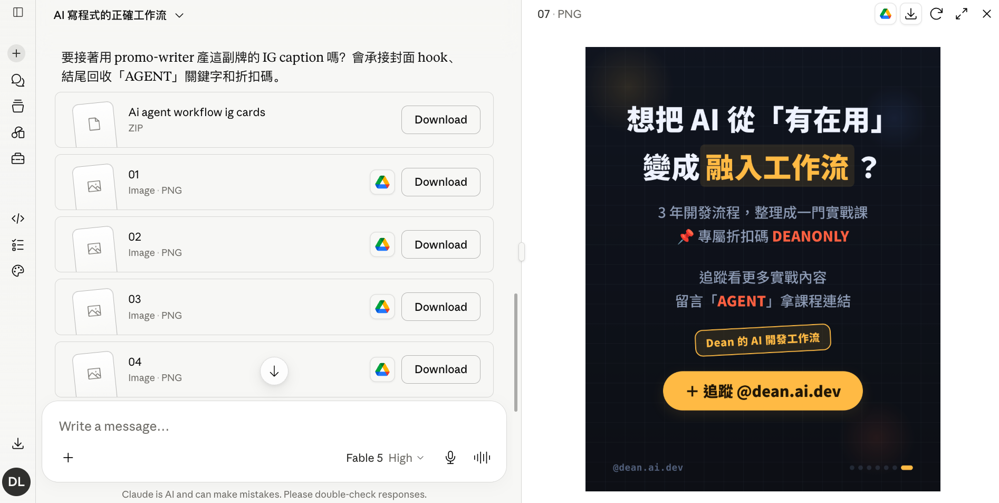

## Skill 使用經驗

### 🧩 Skill 不是越多，AI 就越強

`同一類型的 Skill 裝了兩個以上，當需求命中時，常常會一起觸發`；這不只會增加 Token 消耗，也容易讓 AI 在執行過程中卡住或走偏。

**在提示詞的世界裡，1 + 1 不一定大於 2，甚至可能小於 1。**

> **同類型的 Skill，建議擇優安裝一個**
> 像撰寫行銷文案這類需求，如果同時安裝多個相近 Skill，AI 反而要花更多成本判斷該遵循哪一套規則，結果未必更好。

### 🤔 網路上很多 Skill 只是看起來有用

- 有些 Skill 描述看起來很厲害，實際使用時`效果卻不穩定`
- 過多的 Skills 只會`增加上下文負擔`，卻沒有提供足夠的專業價值
- 安裝`太多沒有用到的 Skills` 甚至會讓 AI 的行為變得更難預測

---

# 讓 AI 動手處理檔案：讓 Cowork 從給建議到交付成品

> **Claude Chat 🆚 Cowork**
> **Chat** 只能處理`線上檔案`，但 **Cowork** 能直接幫你`操作電腦上的檔案`

## 初探 Cowork

### 💻 需要下載 Claude App 才能使用

Chat 因為只操作線上檔案，所以網頁版就可使用；但 Cowork 要[下載官方 App](https://claude.com/download)，並且至少有 `Pro 帳號`才能使用。


> **Skill 可以在 Cowork 通用，但 Projects 為各自獨立**

[lab-session title="🛠️ 實戰演練" duration="3 分鐘" hint="下載 Claude App"]
- [下載官方 App](https://claude.com/download)
- 登入帳號
- 要 Pro 付費版才能使用 Cowork
[/lab-session]

### 📁 可以直接選資料夾，不用一個個上傳

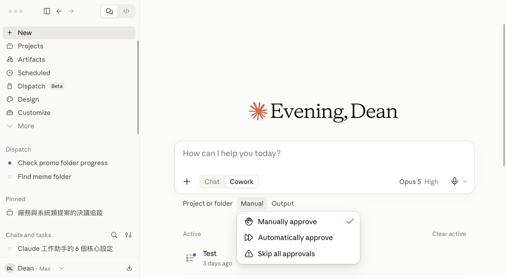

[warning title="使用提醒"]
Cowork 是有能力`新增/修改/刪除`電腦檔案的。

能力越大風險越大，你可以想想`如果事情做到一半，但額度沒了會發生什麼事`。
[/warning]

## 多格式資料彙整

> **專案資料夾塞滿 Word、Excel、PDF 不同格式的檔案**
>
> - 當你想彙整成一份`總表或摘要`，需要先辨識用到哪些檔案
> - 人工整理會因為每份格式不一（有的表格、有的純文字），`整理到一半就亂掉`
> - 網頁版的 Chat 需要`一份份上傳`，檔案一多就讓人崩潰

### 🗂️ 選一個資料夾，自動讀完彙整成目標檔案

Cowork 不用一份份拖檔案，`指定資料夾路徑`給它，它就會讀完裡面所有檔案，彙整成你要的總表或摘要。

[flow]
1. 選資料夾 — 把混著 Word／Excel／PDF 的資料夾指給它
2. 自動讀取 — 它逐份讀完，無視格式差異
3. 彙整輸出 — 整理成一份總表或重點摘要，每筆都標明來自哪個檔案
[/flow]

[download dir="cowork-folder" label="下載「凌亂資料夾」範例包(cowork-folder)" desc="混了 PDF／Excel／截圖／便條的一包亂檔"]

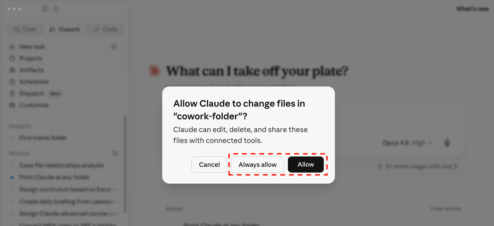

```prompt [label="把整個資料夾彙整成一份摘要"]
用摘要告訴我：「這是什麼專案、現在進度到哪、誰負責什麼、最近發生過什麼決定。」每個結論都標出處（檔名）。
```

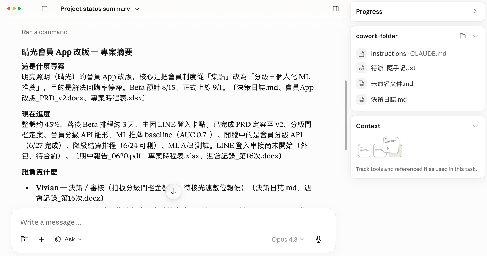

[lab-session title="🛠️ 實戰演練" duration="10 分鐘" hint="指定一個資料夾，多格式資料彙整"]
- 用上方「凌亂資料夾」範例包(cowork-folder)，或自己挑一個混格式的資料夾
- 請 Cowork 讀完整個資料夾，彙整成一份總表或摘要
- 檢查它有沒有標明每筆資料的來源檔名
[/lab-session]

## 照片批量轉存 Excel

> **一疊發票、名片、單據，要一張張 key 進 Excel**
>
> - 特徵值（金額、日期、抬頭、電話）藏在照片裡，得`人工一張張看、一格格打`
> - 過人工處理，還`容易看錯數字、打錯欄位`
> - 量一大（幾十上百張），`整個下午都耗在 key-in`

### 📷 批量讀取照片，直接寫進 Excel

把一疊有特徵值的照片（ex: 發票、名片、單據）丟給 Cowork，它會`逐張讀出關鍵欄位`，直接整理進 Excel，不用你一張張 key。

[flow]
1. 指定照片資料夾 — 一疊發票／單據照片
2. 逐張辨識 — 抽出金額、日期、抬頭等特徵欄位
3. 寫進 Excel — 一張一列，並標明來源是哪張照片
[/flow]

[download dir="cowork-excel" label="下載「讀收據寫 Excel」範例包(cowork-excel)" desc="費用報銷表 Excel + 20 張不同角度的單據照片"]

```prompt [label="把一疊單據照片批量寫入 Excel"]
讀取[費用報銷表.xlsx]裡面的欄位後，分析[收據]內的照片：
① 逐張讀出要填寫欄位
② 寫入 Excel，一張照片一列，並在最後一欄標明來源照片檔名
③ 看不清楚或辨識不確定的格子先留空、標黃，不要自己猜數字
```

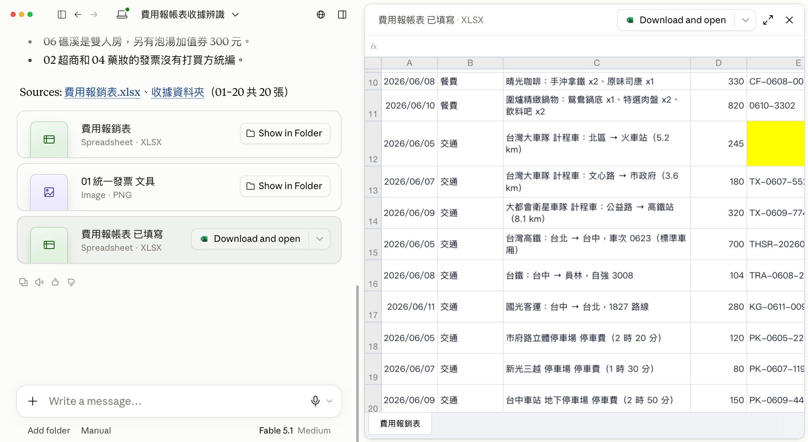

> **將驗證有效的 SOP 轉換 Skill**
> `如果流程會重複使用，就可以把它設計為 Skill`，這樣 AI 日後遇到類似問題時，不需要重頭再來一遍（因為毒）。

```prompt [label="將驗證過可重複使用的流程轉換為 Skill"]
幫我將這個工作流轉為 Skill
```

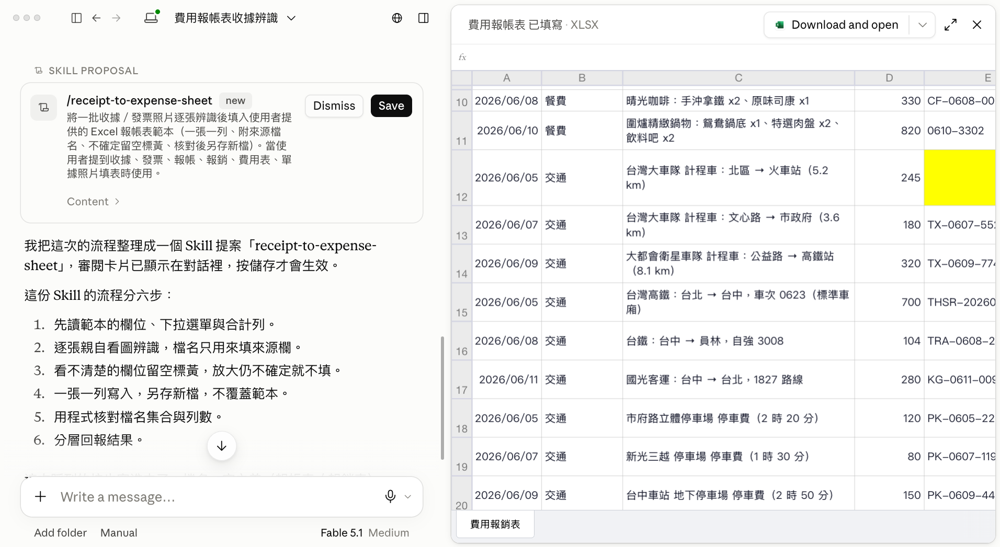

[lab-session title="🛠️ 實戰演練" duration="10 分鐘" hint="將收據照片批量寫入指定 Excel"]
- 下載範例包(cowork-folder)
- 請 Cowork 逐張辨識，寫入指定 Excel（一張一列、標來源檔名）
- 核對辨識結果，特別看金額、日期有沒有讀錯
- 確認辨識不準的格子有留空標黃，而不是自己猜
- 將流程設計為 Skill
[/lab-session]

## 自動填入不同格式的表單

> **Excel 表單欄位多、規則雜**
>
> - 欄位一大堆、每格`填寫規則都不一樣`，人工填又慢又怕錯
> - 要填的資訊可能`散落在 Word／PDF/Markdown 文件`，得來回比對抄寫

### 📝 先摸清表單規則，再反向填入

與其人工一格格填，不如讓 Cowork **先讀懂 Excel 的欄位與規則，再從你的來源資料（ex: Word／PDF / Markdown 文件）抽出資訊自動填上**。

[flow]
1. 讀懂表單 — 先摸清 Excel 的欄位與填寫規則，列給你確認
2. 抽取來源 — 從 Word／PDF/Markdown 找出對應資訊
3. 對照核准 — 填好先給你看對照（哪格填什麼、來源哪份），核准再存
[/flow]

[download dir="cowork-form-fill" label="下載「彙整資訊填寫 Excel」範例包" desc="將散落的資訊自動填入 Excel"]


```prompt [label="把既有資料自動填進 Excel 表單"]
請根據下面步驟彙整資料，寫入[專案管理表.xlsx]：
1. 了解 Excel 的欄位與填寫規則
2. 從資料夾文件讀取所需資訊，用「純文字」的方式填入 Excel
3. 找不到或不確定的格子先留空、標黃，不要自己編
```


[lab-session title="🛠️ 實戰演練" duration="10 分鐘" hint="給範例讓 AI 了解填寫規則在寫入"]
- 下載「彙整資訊填寫 Excel」範例包
- 讓 AI 自動彙整不同格式的資訊到 Excel
- 檢查缺資料的部分有留空標黃，確認它沒亂編（ex: 專案概要[彙整資訊填寫 Excel]、參與人員[彙整資訊填寫 Excel]、任務清單[T-08]）
[/lab-session]

## 把固定要做的事交給排程

> **每週都要做的事，為什麼每週都要自己記得？**
> 追蹤新法規、蒐集產業新聞、彙整專案進度，這類工作`內容每次不同、做法每次一樣`。
> 把任務說明存成`排程（Scheduled）`，時間到 Claude 就會自己跑一次。

### ⏰ 排程任務怎麼運作

[flow]
- 在雲端執行 - 時間到就會跑，`電腦睡眠或 App 關閉也照常執行`
- 執行頻率 - 每小時、每天、每週、平日，或設成手動、需要時再按
- 資料來源 - 網路研究、已授權的 Connector、存在 Claude 帳號裡的檔案；`無法綁定電腦裡的資料夾`
- 檢視結果 - 每次執行都是一個獨立的 Cowork 任務，完成後回來看結果就好
[/flow]

> **哪些方案可以用？**
> 所有付費方案（Pro、Max、Team、Enterprise）都能使用；Team／Enterprise 帳號要由`管理員開啟 Cowork` 才看得到。

### 🛠️ 建立排程任務

[flow]
1. 左側欄點「Scheduled」→「New task」
2. 選「Create with Claude」— Claude 會反問細節，再提出任務名稱、頻率與指令；熟悉後也可以選「Set up manually」自己填
3. 確認內容後按「Schedule」— 之後可以在同一頁`暫停、修改、刪除`，或手動立即執行
[/flow]

<!-- TODO: 建議在此加入圖片：Cowork 左側欄 Scheduled 頁面與 New task 選單的截圖（虛線紅框標出 Scheduled、New task），請將圖片放到 assets/ 資料夾 -->

### 📝 一份好的任務說明，要寫清楚這五件事

| 項目[width:120] | 要寫清楚什麼 | 範例 |
| --- | --- | --- |
| 資料來源 | 去哪裡找、用什麼條件找 | 環境部、全國法規資料庫的公告 |
| 執行頻率 | 多久跑一次 | 每週一早上 |
| 什麼算「新的」 | 避免每次都把舊資料再列一遍 | 只列最近 7 天發布的內容 |
| 輸出格式 | 結果長什麼樣子 | 表格：日期、標題、重點、來源連結 |
| 人工覆核 | 哪些要留給人判斷 | 不確定是否相關的，標「待確認」 |

```prompt [label="每週追蹤環保法規與公告"]
每週一早上執行：
1. 搜尋環境部、全國法規資料庫最近 7 天新增或修正的環保相關法規與公告（ex: 廢棄物清理、空氣污染防制）
2. 整理成表格：發布日期、標題、三句話重點、可能影響的業務、來源連結
3. 沒有找到新資料就回覆「本週無新增」，不要拿舊資料湊數
4. 不確定是否跟我們業務相關的，標註「待確認」，不要自行判斷
```

[warning title="使用提醒"]
排程會`自動執行、自動消耗額度`，建議先`手動執行幾次`，確認結果穩定再開啟排程。

如果任務會`寄信、發訊息或更新其他系統`，先確認 Connector 的權限範圍；按下同意，責任就是你的。
[/warning]

> **先手動跑順，再交給排程**
> 排程只會把流程`重複執行`，不會幫你把流程`變正確`。

[lab-session title="🛠️ 實戰演練" duration="10 分鐘" hint="把一項定期工作設定成排程"]
- 挑一項固定要做的事（ex: 法規追蹤、產業新聞、專案進度彙整）
- 用「Create with Claude」建立排程，讓 Claude 反問細節
- 先手動執行一次，確認結果符合預期再設定頻率
[/lab-session]

---

# 動手做工具：用 Vibe Coding 產出自己的網頁小工具

> **學 Vibe Coding 不是為了成為工程師**
> 是為了解決`你目前遇到的痛點`，這個痛點可能存在於`公司、部門、團隊、個人`，但一直沒有解決。
> 而這個單元，就是讓大家了解，在 AI 時代`我們能靠自己`踏出第一步。

## 開始之前：Vibe Coding 是什麼？

> **透過白話文跟 AI 對話，逐步完善工具的流程**
> - **優點**：可以快速完成初版
> - **缺點**：結果較不可控、未來較難維護
> 若沒有程式背景，`把想做的事、期待的結果講清楚`是最重要的事

### 🧩 認識常見名詞

- **AI Agent**：不只是問一句答一句的聊天機器人，而是能`理解任務、操作你的檔案、自己串好步驟、把事情從頭做完的助手`
- **Token**：AI 的`計費與容量單位`，可以想成 AI 的「貨幣」，不同付費方案的額度不同
- **Model**：AI 的「大腦」，不同模型的`智商不同`，消耗的 Token 也不同；`越聰明的模型，花的 Token 越多`

> **工程師的角色，也在改變**
> 當「把功能寫出來」越來越容易，工程師真正的價值，就從「會不會寫程式」移到`懂不懂這個產業、能判斷出最適合的方案、知道為什麼要這樣做`。
> 大家在產業累積的 know-how，就屬於這類`最難被取代的價值`。

## 了解風險與邊界

### 💳 能力越強，風險越大

[flow]
- Cowork 有能力新增、修改、刪除你電腦上的檔案 - 想想如果做到一半`額度用完`會怎樣 → 資料可能會不見
- 不建議剛開始就讓 AI 全自動處理 - 權限先選「`Ask（每步先問你）`」比較保險
- 限定 AI 讀取的資料夾範圍 - 牽涉`客戶資料、同事個人資料`的檔案，先去識別化再交給 AI
[/flow]

> **今天的範例檔都已經去識別化**
> 課前同仁提供的訓練安排表，我把`人名、帳號、檔案作者`都換成虛構資料才放進講義。
> 操作時要養成「`先想個資、再動手`」的習慣。

### 🧪 是「玩具」還是能用的「工具」？

[flow]
- 一句話就能生成「看起來可以動」的系統 — 這樣的東西，你真的敢`直接用在工作現場`嗎？
- 改壞不是最可怕的 — 最可怕的是`你不知道它被改壞了`；過去人寫程式也會有一樣的問題，只是 AI `速度太快`，把問題加倍放大
- 等一下生成的`訓練安排工具` — 重點並不是做出來好開心，而是`審視 AI 犯了哪些錯誤`
[/flow]

> **看起來能動的東西，才是最危險的**
> `AI 的快，不是你的快；但 AI 的錯，會全部算在你頭上`。所以關鍵邏輯，還是需要人來把關。

## 從自己的需求出發

### 🐛 Vibe Coding 遇到錯誤是很正常的

[flow]
- 遇到錯誤 - Vibe Coding 過程`一定會遇到錯誤`
- 解決錯誤 - 如果沒有開發背景，能不能解決錯誤，是看`這個痛點對你來說夠不夠痛`
- 讓自己多嘗試一點 - 如果成功解決問題，這個`成就感與經驗`是非常寶貴的。
[/flow]

> **可以有野心，但先從 MVP 開始**
> 在做出改變世界的產品前，先嘗試把`手邊麻煩的任務`交給 AI 做自動化。

### 🎯 用日常工作開始嘗試，因為你有分辨對錯的能力

[flow]
- 別再做「記帳軟體、番茄鐘」這類專案了 — 儘管 AI 能幫你輕鬆搞定，`但缺少挫折的練習幫助有限`，因為思考解決問題的步驟最為珍貴。
- 從「日常工作」的痛點出發 - 你有能力`分辨對錯`，並且在遇到錯誤時`不會輕易放棄、有解決的動力`
- 陌生領域你不知道 AI 犯錯 - AI 有能力做出`看起來正確的產品`，就像我幫醫院做排班工具時以為是對的；但`護理長試用後馬上就發現問題`
[/flow]

> **課前訪談小故事**
> 教學前為了讓`內容更符合單位需求`，我會先跟窗口做需求訪談。
> 有次收到`人力資源部門`邀約，他們主管說會安排這堂課是因為：「**開發的人不用系統，用系統的人不會開發。**」
> - **原因**: 內部出缺勤、考核系統年代久遠，很難操作；但提出需求後，基本上等要`等數週甚至幾個月才修正`
> - **方案**: 掌握`規格驅動開發`的技巧，並了解開發團隊`使用的技術`，這樣未來才能銜接、維護

[interactive title="是什麼驅動你嘗試"]
**Vibe Coding 最需要什麼？**
`A` 有程式基礎 `B` 熟悉多種 AI 工具
`C` 擅長與人溝通 `D` 眼前有困擾許久的問題
[/interactive]

## 訓練安排：共用帳號的排課難題

> **這是同仁在課前提出的真實需求**
> 資料已經去識別化，但`排課的難處`是真的。
> 示範的重點`不是一鍵排出完美課表`，而是「怎麼跟 AI 討論、怎麼驗收、怎麼迭代」。

### 😩 排課者的日常：資源有限又容易衝突

[flow]
- **帳號是共用的** - 公司買了 `2 組線上課程帳號`，各自綁著不同課程，`同一時間只能一個人使用`
- **人多、課也多** - `8 位同仁`、`10 門課`，誰在什麼時候用哪個帳號上哪堂課，全靠人工喬
- **衝突藏在細節** - 同一帳號排給兩個人、同一個人排在兩堂課，`肉眼很難一眼抓出`
- **漏排沒人發現** - 課程或人員漏排了，往往`到最後才被發現`
[/flow]

### 🧷 排課的基礎規則

1. **同一帳號不可同時使用**：同一時段，一個帳號只能排給一位同仁
2. **人員時段不可衝突**：同一位同仁，同一時段只能上一門課
3. **排不進去要提示**：沒排到的課程或人員，要列出來提醒
4. **條件要能調整**：每堂課的時長、可上課的時段、同仁請假，要能在網頁上設定

> **為什麼要先把規則寫下來？**
> 規則講不清楚，AI 就只能`用猜的`。
> 寫成`可以檢查對錯`的句子，AI 才能自我驗證，你也才有標準可以驗收。

## 先設計 MVP

> **為什麼要先做 MVP？**
> `先求有、再求好`。MVP（Minimum Viable Product）是`最小可行產品`：先做出一個「能動的最簡版本」，再逐步優化。

### 🤖 我與 AI 的協作方式

[download dir="training-schedule" label="下載「訓練安排」範例包" desc="2 組帳號、10 門課、8 位同仁（已去識別化）"]

#### STEP 1：先讓 AI 讀懂資料，不急著動手

```prompt [label="先確認 AI 讀懂"]
分析「訓練安排.xlsx」的內容，說明帳號、課程、同仁三者的關係，並列出如果要做排課工具，還缺哪些資訊；先不要寫程式
```

- 這份 Excel 的課程`沒有欄位標題`，兩個帳號的課程也`分成上下兩塊`，先確認 AI 看得懂
- 注意 AI 有沒有發現`「銷售的修煉」出現兩次`：原始資料就是這樣，要問清楚是重複登錄，還是兩堂不同的課
- AI 列出「還缺哪些資訊」（ex: 每堂課多久、哪些時段能上課），就是下一步要補的規則

<!-- TODO: 建議在此加入圖片：AI 說明帳號／課程／同仁關係，並列出缺少資訊的截圖，請將圖片放到 assets/ 資料夾 -->

#### STEP 2：把規則講清楚，再問技術方案

```prompt [label="把規則講清楚，再問推薦的做法"]
我想做一個排課工具，規則如下：
1. 同一時段，一個帳號只能排給一位同仁
2. 同一位同仁，同一時段只能上一門課
3. 排不進去的課程或人員，要列出來提示
4. 每堂課的時長、可上課的時段、同仁請假，要能在網頁上設定

希望有網頁操作頁面，匯入 Excel 後就能自動排課，並且可以下載 Excel 結果。
在技術上，有推薦的組合嗎？
```

- 如果對技術不熟悉，先問「有推薦的組合嗎」，`想完成任務有很多方案`
- 規則寫得越具體，AI 越能`自己檢查對錯`

<!-- TODO: 建議在此加入圖片：AI 提出多個技術方案的截圖，請將圖片放到 assets/ 資料夾 -->

#### STEP 3：收斂到「雙擊 html 就能使用」

```prompt [label="讓 AI 完成 MVP"]
我希望建立一個「code」資料夾來完成這些程式，技術上只使用前端，目標是只要雙擊 html 就能使用。
網頁要有排課預覽，衝突的格子要標紅，並且自我驗證通過符合預期
```

- `要求建立資料夾（code）放程式`，避免資訊混在一起，也方便未來的部署
- `免安裝、免部署、資料不出電腦`，在公司電腦上使用，這三點很重要
- `預覽功能很重要`，不然下載才知道對錯，會留下一堆檔案

<!-- TODO: 建議在此加入圖片：AI 完成初版、code 資料夾內產出 index.html 的截圖，請將圖片放到 assets/ 資料夾 -->

#### STEP 4：要求撰寫測試程式

```prompt [label="請 AI 用規則自我檢查"]
撰寫測試程式，確認排課結果符合上面 4 條規則
請使用範例檔作為來源，若有錯誤請一同修正
```

- 撰寫測試程式可以`提高成功率`，未來新增功能時，也能`減少舊功能壞掉的問題`
- 但注意：`AI 的自我驗證通過，不代表真的通過`

#### STEP 5：打開成品，用反例驗收

- 點擊 `index.html` 開啟網頁，匯入範例 Excel
- 故意製造衝突：把同一個帳號`手動排給兩個人同一時段`，看工具有沒有標紅
- 把某位同仁整週設成請假，確認他的課有被列進「未排項目」

<!-- TODO: 建議在此加入圖片：排課預覽畫面，衝突格標紅、未排項目列表的截圖，請將圖片放到 assets/ 資料夾 -->

```prompt [label="如果發現問題，用具體反例回報"]
我把帳號A 在週一 10:00 同時排給陳怡君和王志明，工具沒有標出衝突
請修正，並把這個情境加進測試程式
```

> **不要說「怪怪的」，要說「哪裡不對」**
> `具體反例`（誰、哪個時段、哪個帳號）能讓 AI 直接找到錯，也能變成下一次的測試案例。

#### STEP 6：給真實使用者試用

- 工具做完，先給`實際負責排課的同仁`試用
- 第一線會發現`文件沒寫、但經驗裡有`的規則（ex: 哪些課有先後順序、哪些時段大家都不方便）
- 把回饋`一條條`交給 AI 修正，每修一次就`重新驗收`

> **看起來能動，跟真的可以用是不同的**
> 用 AI 寫程式沒有門檻，但寫出可以`真正使用的產品需要花時間持續優化`。

## 純前端減少資安疑慮

### 🧩 前端、後端、資料庫，各自負責什麼

- **前端** — 你在瀏覽器裡`看得到、點得到`的畫面，負責`呈現資訊、接收你的操作`
- **後端** — 跑在`伺服器上`的程式邏輯，負責接收前端送來的請求、`運算處理後回傳結果`
- **資料庫** — 負責`長期保存資料`，後端把要留存的資料寫進去、需要時再查出來

### 🔒 純前端＝資料不出你的電腦

今天的訓練安排工具是`純前端網頁`，`沒有後端伺服器、也沒有資料庫`。

- 所有運算都在`你自己的瀏覽器`裡跑，`資料完全不離開電腦`、不上傳任何伺服器
- 所以可以放心在公司電腦、甚至離線環境使用
- 這也是我要求 AI 設計時要`「雙擊 html 就能用」`的原因

> **但想讓系統更完善，就是另一個世界了**
> 如果你想`把資料儲存起來`不用每次重新匯入、讓不同的人有`不同權限`（有人只能`瀏覽`課表、有人可以`編輯`），甚至串接公司的帳號與簽核流程，就進入`後端＋資料庫`的範疇。
> 系統會開始`碰到個人資料`，`帳號權限、資安防護`每一項都要顧。
> 這時就`真的需要專業工程師`把關，**做雛形依然可以用 Vibe Coding，但隱私請交給專業**，這條界線要分清楚。

## 案例回顧

### 🧭 我們到底做了什麼

[flow]
1. 先讀懂 — 讓 AI 說明資料關係、`列出還缺哪些資訊`，確認看懂了才動工
2. 定規則 — 把限制寫成`可以檢查對錯`的句子，再問「有推薦的組合嗎」
3. 小步做 — 收斂到`雙擊 html 就能使用`，先完成 MVP
4. 要自測 — 請 AI 撰寫測試程式，但`自我驗證通過不代表真的通過`
5. 反例驗收 — 故意製造衝突、設定請假，`用具體反例`逼出錯誤
6. 給真實使用者試 — 第一線才知道`文件沒寫的規則`，優化是沒有盡頭的路
[/flow]

### 💡 Vibe Coding 重要心法

- **驗收要在真實環境**：AI 的「驗證通過」是用它自己的工具量的，`成品一定要親手打開`
- **修 Bug 靠方法，不靠運氣**：描述不出技術細節沒關係，`換個問法、附上證據、調高 Model 與 Effort、或是開一個新對話`
- **專業是最後一哩路**：你對工作的熟悉度，正是把工具`從 80 分推到 100 分的關鍵`

> **你不需要會寫程式，但一定要驗收**
> 整個過程我們`沒有寫一行程式`；但結果需要`親自驗收`，並在遇到問題時`引導 AI`。

[lab-session title="🛠️ 實戰演練" duration="20 分鐘" hint="描述需求，讓 AI 做出訓練安排工具"]
- 下載「訓練安排」範例包，在 Cowork 選擇該資料夾
- 依照 STEP 1～3，讓 AI 讀懂資料、確認規則、做出 MVP
- 打開 index.html，故意製造一個衝突，看工具有沒有抓到
- 有餘力的話，換成自己工作上的需求試試看
[/lab-session]

---

[interactive title="AI 時代的焦慮指數"]
**Q1｜看到一堆新工具、新名詞冒出來，你的想法是？**
`A` 興奮，想趕快學　`B` 焦慮，怕跟不上　`C` 無感，先觀望

**Q2｜你最大的擔心是？**
`A` 學不完、學了就忘　`B` 自己會被取代　`C` 不知從何開始
[/interactive]

# 📌 課程總結：Work Smart, Don't Work Hard

## 技術更新好快，我好焦慮

> **在未來，工具學習成本應該越來越低**
> AI 工具更新，通常是為了**降低學習難度**
> 我們其實`不需要去背`工具有哪些功能，大多時候有需要時`AI 會自動調用`
> 很多時候`不是因為工具更新焦慮，而是因為看到販賣焦慮的文章`

### 😰 出現新名詞很焦慮

Hermes Agent、loop engineering、Agency Agent、HyperFrames...

[flow]
1. 先觀察一段時間 - 工具剛推出時往往`不完善、沒有教學，上手難度也高`
2. 是否有具體案例 - 是話題性產品，還是有具體的成功案例
3. 對你有幫助嗎 - 工具再好，也要自己用得上才有意義
[/flow]

> **培養批判性思考能力**
> 人的精力有限，`技術是學不完的`；要先培養出辨識問題的能力，然後思考如何解決，`工具只是在過程中學會罷了`。
> 現場遇到的問題都是不同的，沒有現成的解決方案，就要`自己設計`出來。

### 🪞 「是我太爛嗎？」不，Demo 都是挑過的

- 滑社群覺得人人都是 AI 大神，自己一試卻`處處碰壁`
- 網路上漂亮的展示，是`精心挑選過`的結果，不是日常
- 教學看不懂不代表你不行，很多時候只是每個人的`背景與基礎`不一樣

#### 漂亮精美的網頁其實是框架的功勞：[Magic](https://magicui.design/)、[Aceternity](https://ui.aceternity.com/)

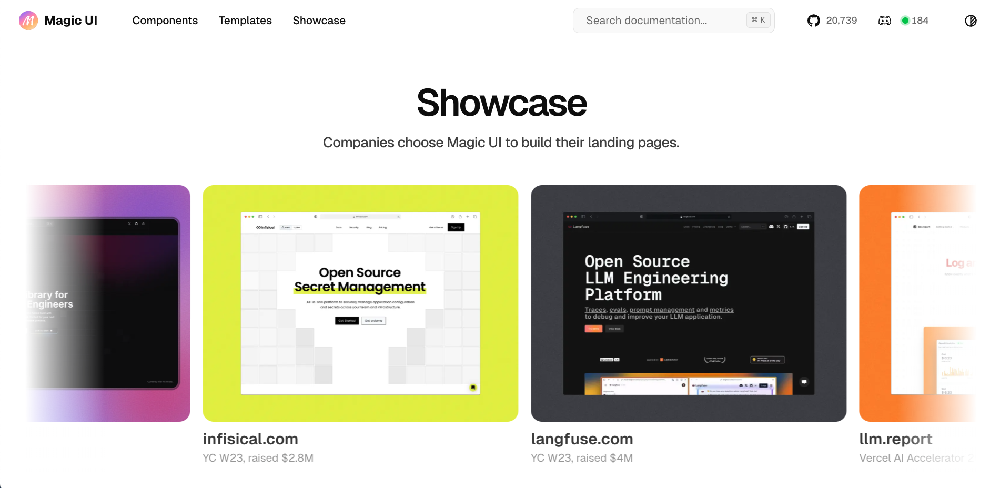

#### 一堆 AI Agent 同時執行，未必會更好


> **導入 AI，不代表全交給 AI**
> 把`AI 能做到的事`跟`人必須負責的判斷`分清楚。
> 讓 AI Agent 執行很久，不一定最強；我不認為對專案毫無掌控度是件好事。
> **好的結果，不該靠消耗 Token 拼運氣；而是靠清楚的方向、可重複的工作流、以及人類在關鍵節點的決策。**

### 🔄 經驗不會歸零，只是換了賽道

> **讓自己變得「獨特」，比讓自己變得「更強」更重要**
> AI 對新人來說是`彎道超車`的機會，而對資深員工來說是`放大自己`的時機。

[flow]
- 過去累積的判斷力，正是 AI 缺乏的 - AI 的出現，不是把你過去十年清空，而是給你一個`放大過去十年的機會`
- 過去職業是單一價值體系 - 技術強不強，對就對、錯就錯，比較很簡單
- 現在偏向多價值體系 - 產業熟悉度 × 會不會說故事 × 能不能設計流程 × 願不願意分享 × 能否自己做出工具
- 單一技能容易比高下，綜合技能不容易比 - 這對資深員工反而是機會
[/flow]

### 🔧 AI 降低「踏出第一步」的成本

- 過去想要一個小工具，得排隊`等工程師`，甚至需要花上`幾萬到數十萬`；現在 AI 讓你有機會先`自己做出雛形`
- 別因為「怕犯錯」就不敢碰：做中學，你才會真正知道 `AI 能做什麼、不能做什麼`

> **AI 就像一面鏡子，它會放大你原本的樣子**
> 如果思維清晰，AI 會放大你的清晰；如果思維混亂，AI 也會忠實放大這份混亂。
>
> 關鍵從來`不是工具多強，而是你是否了解自己要什麼`。

## Work Smart, Don't Work Hard

### ⚡ 把該省的力氣省下來

- 在 AI 時代，做`只有人才能辦到的事`更有價值
- 嘗試把工作的某個環節變順，讓自己`少踩坑、少重工、少在無聊`的事情上浪費時間
- 不要讓你對專業的熱情，被那些`不難但很煩的瑣事`一點點消耗掉

### 🙌 不要有預設立場，先讓 AI 試試看

[flow]
- 我不確定 AI 能不能做到 - 如果腦海冒出這個想法，就`直接讓 AI 嘗試看看`
- AI 真的值得付費嗎？ - 如果工作上有感到`乏味的電腦或紙本作業`，或許這就是一個嘗試付費的契機；`跟一個人的薪水相比，讓 AI 的成本非常便宜（Pro 版 20 美金）`
- 把執行交給 AI，把判斷留給自己 — 這才是`從容的節奏`
[/flow]

## 回顧：我們今天走過的路

### 🧭 從聊天工具，升級成工作幫手

[flow]
1. 接上工具 — 用 Connector 讓 AI 讀 Gmail、行事曆，動手前先確認範圍
2. 固定背景 — 用 Project 放進規格與會議紀錄，不必每次重講
3. 保存做法 — 把好用的流程做成 Skill，分享給同事重複使用
4. 交付成品 — 用 Cowork 彙整多格式檔案、照片轉 Excel、自動填表，再把定期工作交給排程
5. 做出工具 — 用 Vibe Coding 做出訓練安排工具，並親手驗收
[/flow]

[summary]
- 🔌 **Connector** | 透過授權，在 Claude 操作多個線上工具
- 🗂️ **Project** | 上傳知識庫、設定指令，免每次交代背景、專案分流
- ⚙️ **Skill** | 把好流程變 SOP，讓 AI 從「通才」變「專才」
- 🖥️ **Cowork** | 指定電腦資料夾，讓 Claude 接手電腦上的任務；固定要做的事交給排程
- 🛠️ **Vibe Coding** | 從自己的需求出發做出小工具，AI 負責做、你負責驗收
[/summary]

### 🪞 AI 就像是一面鏡字：讓它回頭看看「你」

這堂課都在分享`AI 的技巧`，但如果你已經使用了一段時間，過去`問過的問題、踩過的坑、在意的細節`都已經默默被 AI 紀錄了。

你可以讓讓 AI 幫你**復盤**：看清自己怎麼思考、如何解決問題，再把那些`一再重複的提問，變成下一個專屬於你的 Skill`。

> **你問 AI 的問題，藏著你最想解決的事**
> 成長，不是學會多少新功能，而是越來越`清楚自己要什麼`。

```prompt [label="讓 AI 復盤你的成長軌跡"]
把最近一個月我跟你的對話抓出來，著重在使用者（我）的問題。

幫我復盤最近學了什麼，並回答以下問題：

1. 我向你詢問哪些種類的知識
2. 什麼樣的工具使用
3. 我正在解決什麼樣的問題
4. 我是怎麼樣解決問題的？切入點是什麼？在意的地方是什麼？都是怎麼樣下指令？
5. 有哪些我很常問的問題，但沒有建立成 Skill 的？
6. 你對我，有什麼有趣的洞見/長期的觀察

把以上的復盤，寫成 6 份不同的 .md 報告，並且裡面會需要把對話紀錄分門別類。
```


---

# 💬 諮詢時段：現場拆解你的工作情境

> **把今天的方法，套到你自己的工作上**
> 最有價值的案例，永遠是`你手邊正在煩的那件事`。

## 帶著你的工作痛點來討論

### 🧭 可以討論的方向

[flow]
- 該用哪個功能 - 手邊的工作適合用 Connector、Project、Skill、Cowork、排程，還是 Vibe Coding 做成工具
- Project 怎麼分 - 哪些情境要建立獨立的 Project，參考資料該怎麼放
- Skill 怎麼管理 - 部門的 Skill 由誰維護、怎麼分享、怎麼更新
- 能不能串接公司系統 - 需要哪些帳號權限、要先跟資訊部門確認什麼
[/flow]

### 📝 先用一段話描述你的情境

```prompt [label="描述你的工作情境，讓 AI 先幫你拆解"]
我的工作是[職務]，每[週／月]要做[任務]。
資料來源是[檔案或系統]，最後要交出[成品]。
目前最花時間的是[哪一步]。

請幫我判斷這件事適合用 Connector、Project、Skill、Cowork、排程或 Vibe Coding 哪一種方式處理，並說明理由與第一步要做什麼。
```

> **為什麼要先寫下來？**
> 把情境講清楚，`問題就解決一半`；AI 給的建議，也會從「通用答案」變成「你的答案」。

[qa-session title="Q&A 時間"]
[/qa-session]
