[interactive title="AI 工具使用調查"]
日常開發時，**已經有在用 AI 的請「`+1`」**
還在觀望、公司不給用，**不熟悉 AI 的請「`+2`」**
[/interactive]

# 時代趨勢：當 AI 接手開發，工程師的核心價值在哪？

> 老闆、主管、員工心中的 AI，是 3 個完全不同的東西。

## 一間公司，三套對 AI 完全不同的劇本

### 🏢 三個角色，三種 AI

- **老闆的 AI 是「砍預算」** —— 導入 AI 節省人力資源
- **主管的 AI 是「衝 KPI」** —— 以前交付 1 個功能，現在請你交 3 個
- **員工的 AI 是「保飯碗」** —— 只要產出的比同事快，我就是倖存者

### ⚠️ 3 種期待同時發生，業力引爆！

[flow]
1. KPI 變高 — 大家拚速度
2. 讓 AI 代替思考 — 需求直接丟出去
3. Code Review 量爆增 — 沒人有時間認真看
4. 放棄理解直接合併 — 團隊集體責任感下降
5. 上線後錯誤暴增 — 你寫得更少，卻要為更多東西負責
[/flow]

> **不管 AI 多強大，總要有人按下「同意」**
> 當按下去的那刻，`責任就歸屬於你`；你寫得更少，但你要`為更多的東西負責`。
>
> 過去工程師的同意按鈕主要在同事間的「Merge pull request」，但現在 `AI 的每次改動`，其實都等同於一次「Merge pull request」

## 核心價值正在遷移

> 老闆、主管可能會問你：「AI 到底有沒有用？」
>
> 想回答這題，靠的`不是工具熟練度`，而是你是否真的`將 AI 導入工作流`。
>
> **而這件事本身，就是 AI 時代最稀缺的軟實力。**

### 🧭 從「會寫」轉向「會判斷、會設計、會整合」

- **能判斷** —— AI 給的方案，哪一個會在三個月後變成技術債？
- **能設計** —— 怎麼把這份判斷標準，變成 AI 下次也會遵守的規則？
- **能整合** —— 怎麼讓個人、團隊、跨部門的工作流串起來？

> **當人人都能寫程式**
> 過去程式碼很昂貴，是因為只有經過專業訓練的人才能完成；但現在 AI 生成的程式已經媲美專業工程師，而且**效率與產出是人類的 10 倍以上**。

### 💥 過去能用的 KPI，現在通通失靈

- **寫了幾行程式？** AI 五分鐘可以噴出 5000 行
- **完成幾個 issue？** AI 可以根據 Spec 產出你期望的 issue 數量
- **消耗多少 Token？** Token 其實與產出品質、產能沒有正相關
- **commit / PR 幾次？** 寫好 Skill，拆成幾個都可以，看你想做給誰看
- **修了幾個 Bug？** AI 很擅長製造 Bug，自產自銷小意思

> **AI 時代，KPI 造假的成本趨近於零**
> 過去主管可以從以上標準，來衡量一個員工的努力程度，但現在 `AI 造假太過輕鬆`。
>
> 如果繼續拿這些當 KPI，可能帳面上人人超標，實際上`產品卻沒有變得更好`。

## 新衡量標準：良率、恢復力、累積資產

### ✅ 交付成果良率

- 交付給 QA 後，回報的 `Bug 數`
- 系統上線後，出現 Bug 的`影響範圍`
- 修好的 Bug，是否`導致其他問題`

> **寫得多 ≠ 寫得對**
> 就算「過程」都交給 AI 執行，人還是要為「結果」負責。
> 善用 AI 可以讓 Bug 變少、PR 有規範、規格思考的更全面。

### 🛟 意外恢復速度

- 線上錯誤從`發生到修復的平均時間`
- 從拿到報錯訊息，到`定位出問題的時間`
- 客訴從進來到`解決的速度`

> **產品不是上線就沒事了，那只是挑戰的開始**
> 如果系統設計時沒考量到`工作日誌`，程式沒有設計`log、try-catch`；當意外發生時，**人與 AI 都沒有足夠的判斷依據**。

### 📈 可累積的資產

- 類似的任務，是否有設計為團隊、專案的 `Skill / Workflow`
- 當系統持續迭代時，`Spec 規格文件有在維護嗎`？
- 三個月前寫的功能，人與 AI 還能`找得到並理解嗎`？

> **打造 AI 時代的複利效應**
> 可以從以上細節判斷 AI 是否`有導入工作流`，以及專案是否具備`可維護性`。
> 當`專案週期拉長`，這些設計會`越來越有價值`。

---

# 迷思拆解：AI 做事很快，但為何專案速度沒有變快？

> 花錢訂閱了 AI 工具，但 AI 輸出的結果總是不符預期，自己還要重做。

[interactive title="AI 開發痛點"]
覺得 AI 結果**常常不如預期的請「`+1`」**
同個問題 AI **一直鬼打牆的請「`+2`」**
[/interactive]

## AI 不是神器，但它會放大使用者的思維

> **不要被價值百萬的 Prompt、Skills，或人人都能用 AI 賺錢騙了！**
> 這世界（目前）不存在萬用的 Prompt，好的結果都需要客製化。
> 如果你`思維混亂，AI 也會忠實放大這份混亂`。

### 🎨 如果想設計「個人形象網頁」

AI 已經足夠聰明，現在一個指令就能生成網頁，但**結果是你要的嗎**？

```Prompt [label="簡單的指令"]
幫我設計個人形象網頁
```

指令很重要，但`提供的內容、設計的流程、優化的細節`同樣重要。

[flow]
1. 內容彙整 — 提供完整的個人背景資訊（可以不同格式）
2. 敘事優化 — 讓 AI 找出亮點，並撰寫有吸引力的履歷
3. 框架選擇 — 可以指定框架，或套用 Skill 來生成網頁
4. 持續優化 — 檢查 RWD 是否完善、結構與描述是否符合預期
[/flow]

> 如果不會下 Prompt、不知道要提供哪些資料，直接跟 AI 討論吧！

### 🐞 AI Debug 卡關，可能是資訊不足

如果全部決策都交給 AI，失去自己的獨立思考，**那能力會快速下滑**。

[flow]
1. AI 並非萬能 — 把錯誤 log 丟給 AI，怎麼樣都找不到 root cause
2. log 資訊足夠嗎？ — 可能根本沒有足夠資訊可以分辨錯誤來源
3. 燒 Token 不會有結果 — 如果方向錯了，那 AI 執行再多次也不會得到答案
4. 換個角度 — 請 AI 優化 log，讓資訊完整到足以解決問題。
[/flow]

> **AI 不會自動補上你沒給的東西**
> 生成式 AI 可能每次的回覆都不一樣，但你`提供的資訊很大程度決定了回應品質`。
> 下次 AI Debug 卡住時，先確認`提供的資訊是否充足`。

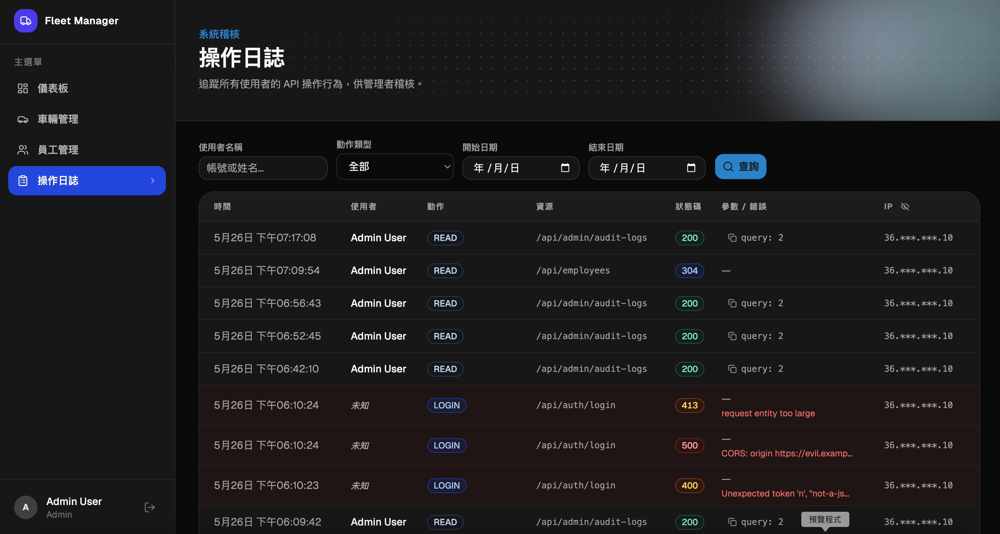

### 📋 自救檢查清單

如果發現 AI 跟你鬼打牆的時候，可以從以下面向調整：

- 提供給 AI 的 Prompt，有沒有明確的`目標、格式、限制、脈絡`？
- 任務的範圍是不是太大？能否拆成`最小可行性方案`？
- AI 不會讀心術，是否有`成功的標準`給 AI 參考、驗證？
- AI 回答錯誤時，請`明確指出問題`，而不是只說`你做錯了`
- 若某個問題時常遇到，可以`設計成 Skill`

---

# 能力轉移：AI 帶不走的 3 件事，與 8 個翻車現場

> **沒有資工背景真的能完成系統嗎？**
> AI 模型會越來越聰明，但知道方向的人才能抵達目標。**如果有能力把規格（SPEC）寫得足夠完善，那 AI 讀取規格後就有機會直接完成功能了。**
> AI 時代，**寫程式不是「門檻」只是「過程」**；工程師需要培養寫程式以外的技能，而 PM、UI/UX 也能參與到實際的開發。
> **甚至完全沒有程式背景，但對自身專業足夠了解的人，能獨立完成系統。**

## 找出可持續培養的技能

### 🧩 需求可能是一句話，但你要想得足夠深入

[flow]
1. 開始都是不確定 - 任何需求，在一開始都是模糊的
2. 把模糊聚焦 - 嘗試在提示詞最後加一句 `這是初步需求，請先反問我你不確定的地方`
3. 把不確定變成確定 - 真實世界沒有完美解答，只有適合當下的選擇，還有能負責的人。
4. 是否有彈性 - 現在的設計，是否有考量到未來擴充性
[/flow]

> **人的思維一定存在盲點，AI 也是**
> 如果 AI 完成的結果跟預期不同，通常是因為**沒有把需求講清楚。**
> 而人要做的就是把這些細節補充得足夠完善，就算是相同領域的系統，也可能因為流程、體制差異，**設計起來完全不同**。
> **AI 可以協助發散思維，但經驗能幫助你做出更合適的決策。**

### 🔄 把「一次性的解法」變成「可重複的流程」

[flow]
1. 列出重複任務 - 撰寫 PR、Commit、Test Case、Spec、Work Log
2. 將它製作成 Skill - 設定觸發時機、執行步驟、參考資源
3. 持續優化 - 不可能一開始就完美，但可以持續優化
4. 共享資源 - 如果團隊都遵從相同模板，可降低資訊摩擦，共同進步
[/flow]

> **Skill 不只能運用在程式領域**
> **過去解決過的問題，不應該再花時間解決第二次**，教會 AI 一次，他就永遠記得怎麼做。
> - [拍 YouTube 影片](https://youtu.be/0pZri5f_tfk)：「提供音訊檔 → 自動轉字幕 → 標重點字卡 → 生成多平台宣傳文」
> - [設計課程講義](https://youtu.be/xe00zJEtuMo)：「提供文字草稿/主題 → 自動轉 Markdown 文件 → 生成 HTML 網頁」

### 🔍 不要只是「看起來能動」

**看起來能動的東西，才是最危險的**

#### AI 的快，不是你的快；但 AI 的錯，會全部算在你頭上

[flow]
1. 了解 AI 做了什麼 - 如果看不懂，請跟 AI 討論，`不要無腦 Accept`
2. 證明功能正確 - 設計 `Lint、導入測試`，確保產品底線
3. 讓開發穩定上線 - 了解 Git Flow，認識`版本控制`與`分支策略`
4. 讓驗證自動發生 - 透過 CI/CD `檢查格式、測試功能`，並設定要`保護的 Branch`
[/flow]

> **知道自己在做什麼**
> **AI 降低了寫程式的門檻，但不代表你可以完全相信它。**
> 我使用了什麼`框架`？`前端、後端、資料`庫是什麼？出錯時如何`判斷問題`？

## AI 常見陷阱

> **不能預設 AI 幫你設計好一切**
> 很多都是「`有人想到，然後逼 AI 補上`」才會設計。那個「有人」，現在就是你。
>
> 能不能成為那個「有人」，靠的不是寫 Code 的速度，而是`需求判斷、流程設計、品質控管`。機會不等人，但機會不會留給爛產品。

### 🔓 把敏感資料寫在前端

- 將登入的`帳號密碼、API Key、驗證邏輯`寫在前端 JS
- `按 F12` 就能看到密碼、看到金鑰
- API Key 通常綁信用卡 —— 這代表`你的卡會被刷爆`

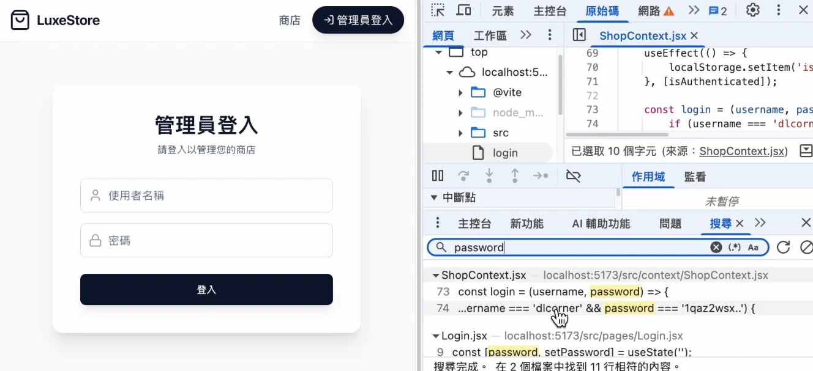

### 📝 暫存資料當永久資料

- 有時 AI 只是把資料存在`變數或 localStorage`
- 刷新頁面、換瀏覽器 → `資料全消失`

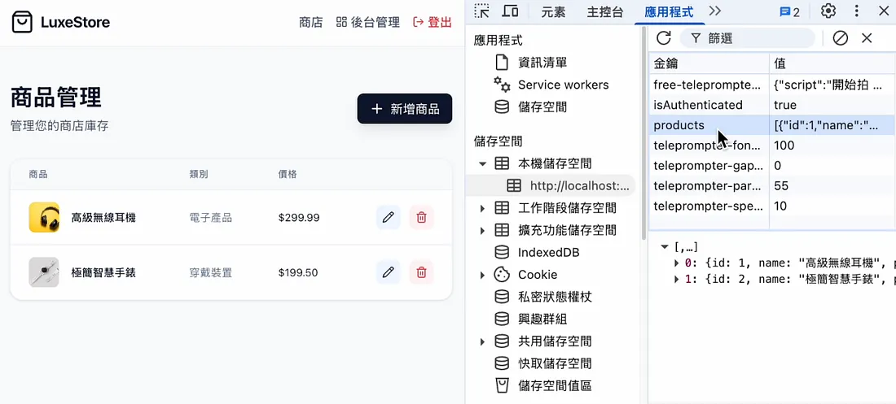

### 🚪 頁面/API沒做權限控管

- 前端做了「登入頁」外，`每個頁面`都要檢查權限
- 後端的「API」，`每隻 API`都要確認權限
- 避免有人`猜前端網頁路徑、測試沒權限的後端 API`

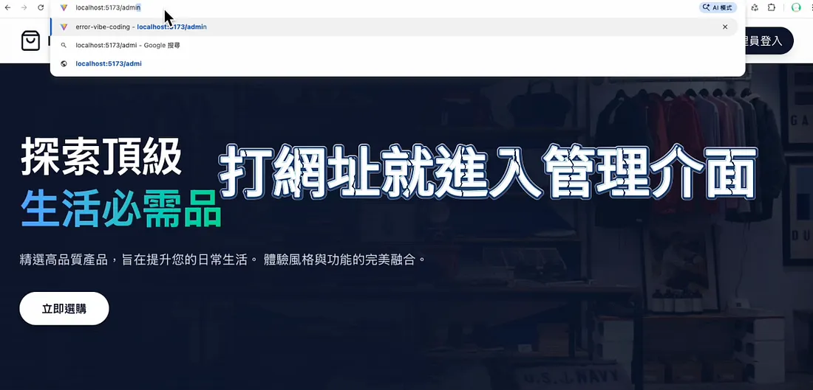

> **權限沒設計好的後果**
> - 客戶個資外洩、產品訂單被篡改
> - 經濟損失 + 影響品牌信譽 + 法律責任

### 🛂 沒有限制 API 呼叫次數

1. 假使系統登入的 API `沒有次數限制`
2. 代表使用者可以嘗試不同密碼組合去`暴力破解`

### 🗄️ 選錯資料庫 & 密碼明文

- 用 **Redis** 當主資料庫 —— `伺服器重啟，資料就消失`
- **密碼明碼**存在 users 表 —— `外洩就全部裸奔`

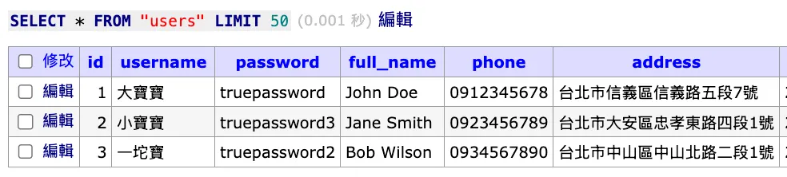

### .env 推上 GitHub，沒有設計 .gitignore

- **.env ** 通常會`存放隱私資料`（資料庫帳密/API Key）
- 沒設計 **.gitignore**，會導致你把 node_modules、dist、log 這類 `體積大、數量多的檔案` 加入版本控制。

[interactive title="翻車經驗分享"]
前面分享了許多常見的翻車經驗，如果有身旁**看過類似經驗，可以在留言區「`+1`」**
也歡迎在聊天室**分享你看過最瞎的翻車現場**！
[/interactive]

---

# 現場視角：為什麼 AI 會放大彼此的差距

> 從「工具、心態、思維」分享自己看見的開發現場。

## 挑選合適的工具
> **不要再當搬運工了！**
> 網頁版的 AI 只能告訴你該怎麼做，AI Agent 能直接幫你完成工作。

### 🌐 網頁版 AI 的痛點

**1. 需要打開瀏覽器操作：** 開啟`新對話`後，又得重講專案背景
**2. 難以給予完整上下文：** 手動複製`程式碼`、`錯誤訊息`，AI 無法了解專案全貌（功能相依性、資料夾結構），容易誤判
**3. 要自己手動修改程式：** AI 給予答案後，你要`自行編輯程式`，但容易發生貼錯、少貼的狀況
**4. 驗證與測試要自己做：** 不管提示詞再好，AI 還是可能犯錯，`來回溝通成本高`

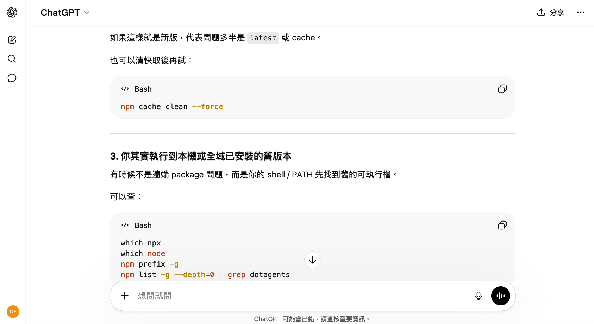

### 🖥️ AI Agent 的優勢

**1. 看到整個專案的檔案和程式內容：**不只是一段段貼給 AI，而是`讓 AI 了解你全部的程式脈絡`，減少誤判。
**2. 可以直接增修檔案執行指令：**在調整完程式後，可以`直接測試確定符合預期`，不需要複製貼上來回確認。
**3. 查專案非常方便：**專案功能對應的程式、函式呼叫路徑，甚至可以`知道當初是誰寫`的這段程式。

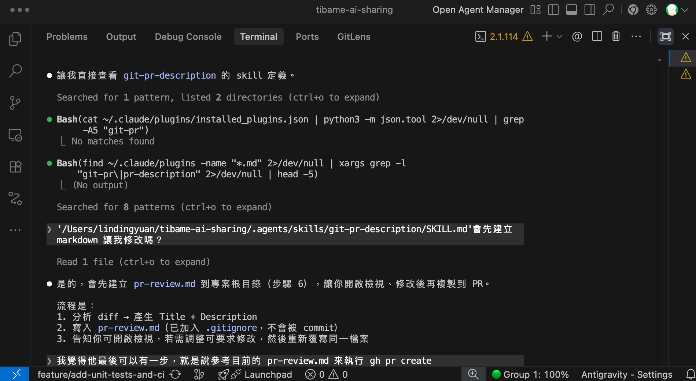

## 心態要積極，但不要盲從 

> **是我太爛嗎？**
> 社群媒體上，好像每個人用 AI 就能輕鬆完成專案，但我卻處處碰壁。

### 🌟 網路上的 Demo 都是精心挑選過的

#### 漂亮精美的網頁其實是框架的功勞：[Magic](https://magicui.design/)、[Aceternity](https://ui.aceternity.com/)


#### 一堆 AI Agent 同時執行，未必會更好

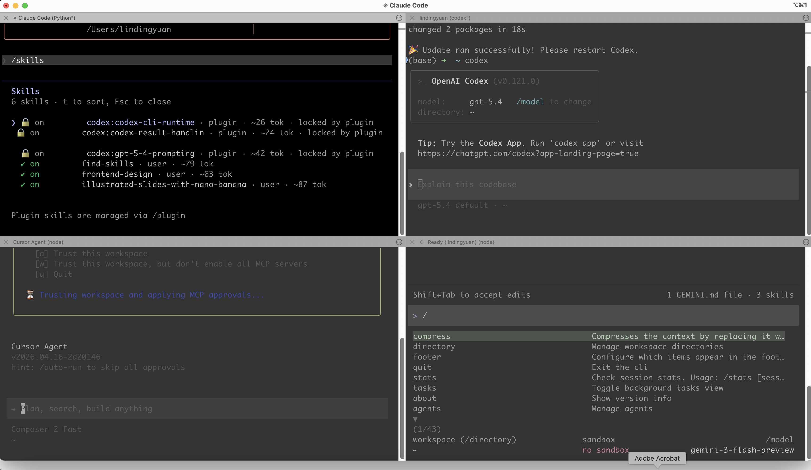

> **導入 AI，不代表全交給 AI**  
> 把`AI 能做到的事`跟`人必須負責的判斷`分清楚。
> 讓 AI Agent 執行很久，不一定最強；我不認為對專案毫無掌控度是件好事。
> **好的結果，不該靠消耗 Token 拼運氣；而是靠清楚的方向、可重複的工作流、以及人類在關鍵節點的決策。**

### 😰 出現新名詞很焦慮

Hermes Agent、Agency Agent、HyperFrames、Guardrails AI...

[flow]
1. 先觀察一段時間 - 工具剛推出時往往不完善、沒有教學，上手難度也高
2. 是否有具體案例 - 是話題性產品，還是有具體的成功案例
3. 對你有幫助嗎 - 工具再好，也要自己用得上才有意義
[/flow]

> **培養批判性思考能力**
> 人的精力有限，`技術是學不完的`；要先培養出辨識問題的能力，然後思考如何解決，`工具只是在過程中學會罷了`。
> 現場遇到的問題都是不同的，沒有現成的解決方案，就要`自己設計`出來。

## 思維要改變，善用過去經驗

> **在 AI 領域，不要有過剩的自尊心**
> 很多資深工程師想嘗試 AI 工具，但害怕犯錯，也不好意思詢問；最後容易卡在原地，充滿焦慮。

### 🛤️ 經驗不會歸零，是賽道換了

- 在沒有 AI 的時代，你已經掌握了`底層邏輯、軟體工程、設計模式`
- 對 AI 給予的回覆，有經驗的人才能判斷出`這段程式未來會不會變技術債`
- AI 的出現，不是把你過去十年清空，是給你一個`放大過去十年的機會`

### 🎯 從「單一價值體系」到「多價值體系」

- **過去職涯是單一價值體系**：技術強不強，對就對、錯就錯，比較很簡單
- **現在偏向多價值體系**：程式能力 × 產業熟悉度 × 會不會說故事 × 能不能設計流程 × 願不願意分享
- **單一技能容易比高下，綜合技能不容易比**，這對資深工程師反而是機會

> **讓自己變得「獨特」，比讓自己變得「更強」更重要**
> 你已經有「技術」，再繼續深入`產業 Know-how、表達能力、流程設計`，你在市場就會擁有難以取代的優勢。

### 🧱 理解「底層邏輯」，工具就會變成可替換的元件

[flow]
1. 工具的取代性非常高 - 你不需要同時掌握多個 AI 工具，但要了解能`通用`的技巧。
2. 認識通用技巧 - Rule、Workflow、MCP、Skill
3. 掌握專案流程 - Spec、Lint、Test Case、Git Flow、CI/CD
[/flow]

> **工具永遠在更新，但底蘊可以持續累積**
> 在課堂上我希望不是「我講、你聽」的單向學習，而是`雙向交流`。
> 每個人都有自己獨特的背景與 Know-how，那些「`跟我不一樣的看法`」，在交流後我們都會有收穫。

---

# 實戰開箱：將 AI 導入工作流

> **Work Smart, Don't Work Hard**  
> 在 AI 時代，寫了多少行程式、完成幾個 feature、修了多少 bug，已經不像過去那麼重要了。
> 但如果能把某個`協作環節變順`，讓大家`少踩坑、少重工、少在無聊的事情上浪費時間`，那會給你帶來 **Credit** 與 **可累積的職涯資本**。

## 不管 Prompt 多完美，AI 都可能犯錯

> **把 AI 犯錯當成必然**
> 比起讓 AI 永不犯錯，更重要的是設計當 AI 犯錯時警告的通知！

### 🗂️ 每堂課都會有 Git Repo 讓大家練習

- 會有影片回放，讓大家複習
- 搭配設計好的專案與 Prompt，可以快速理解如何使用

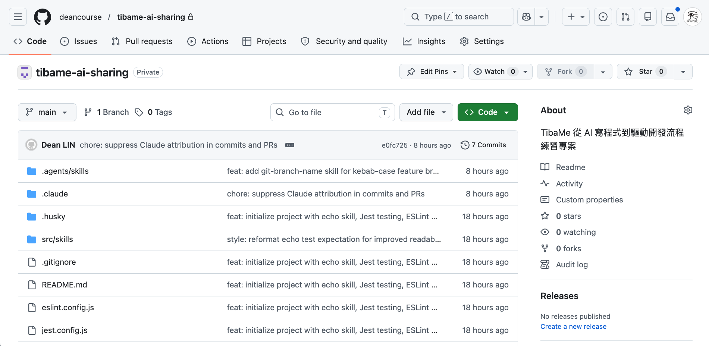

### 🚀 懂技術會讓 AI 效能加倍

**1. AI 有一定隨機性：**即使有 Rules 規範，AI 生成的格式（ex: 縮排、引號）可能`每次都不一樣`，而且有可能`動到原有邏輯`。
**2. 加上 Pre-commit：**Commit 前確保專案 `Coding Style 一致性、測試都通過`。

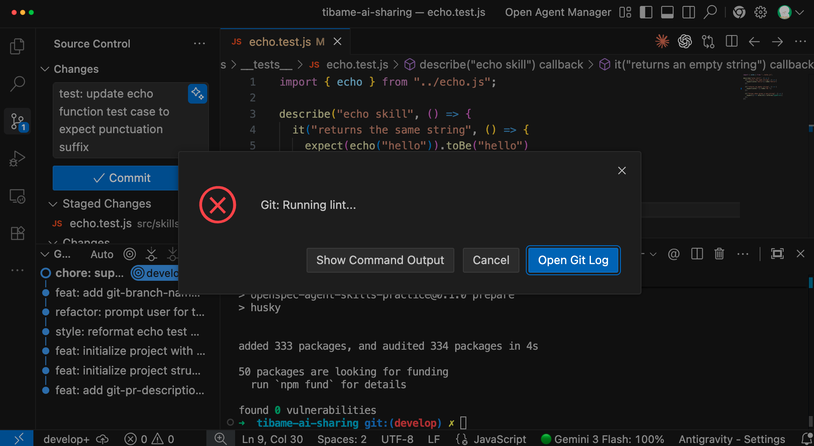

### 🤖 可以使用不同的 AI Agent

雖然課程講的是 Claude Code，但 Cursor、Codex、Antigravity 這些`主流工具都支援 MCP / Rules / Commands / Skills`。

每個 AI Agent 的路徑稍不同，可以使用 [dotagents](https://github.com/dean9703111/dotagents) 來協助建立 symlinks。

```prompt [label="將 Agent Skills 同步到指定的 AI Agent"]
npx @dean9703111/dotagents
```

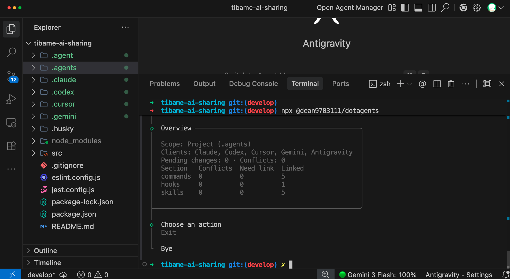

## 新專案:規格驅動開發（SDD）

### 🔧 為什麼需要 OpenSpec？

- AI 寫程式越來越快，但`專案越改越亂，甚至越改越壞`
- 關鍵人物離職，沒有文件，`系統知識直接斷層`
- **解法：**白話文對話 → AI 自動建立規格文件 → 根據規格驅動開發

### 📋 OpenSpec 如何建立文件規格

[flow]
1. proposal.md — 確認目標與範圍
2. design.md — 技術選型與風險評估
3. specs/ — 按功能分類的詳細規格
4. task.md — 任務清單，完成自動打勾
[/flow]

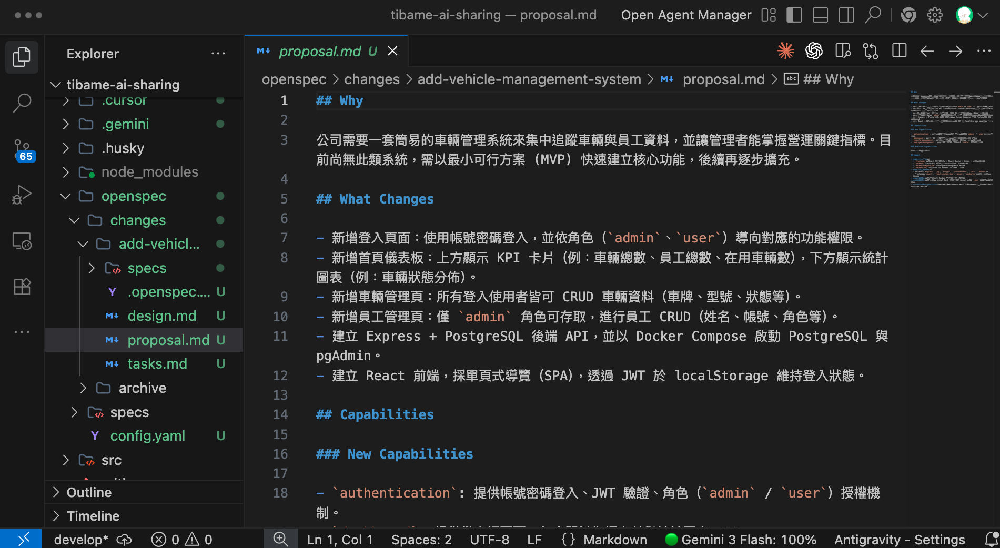

## 舊專案:如何完成從 1 到 100 迭代

### 📄 AI 如何協助專案迭代？

**1. CLAUDE.md：**讓 AI 知道要怎麼`做事`
**2. openspec/config.yaml：**了解`規劃`時要參考的資訊

#### 用 OpenSpec 迭代新功能

[flow]
1. 閱讀專案既有架構、功能 — 確認要新增還是修改
2. 開始設計規格文件 - 一樣跑「proposal ⭢ design ⭢ specs ⭢ task」
3. 完成任務後，彙整河道原有規格 - 對快速迭代、多人合作專案幫助極大。
[/flow]

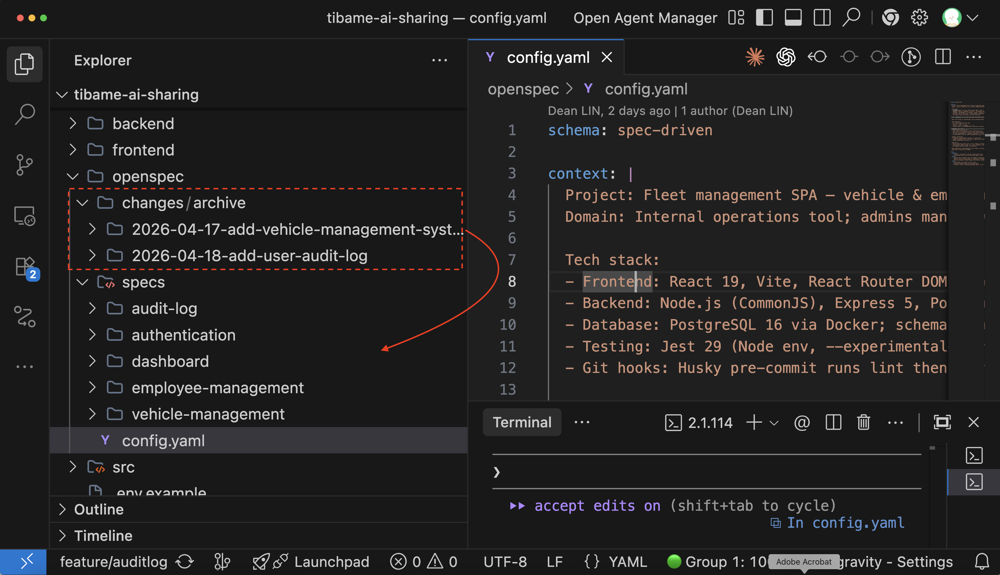

> **為什麼 1 到 100 比 0 到 1 更難？**
> 如果沒有規格文件，下次改功能時 AI 不知道之前的設計邏輯，可能把同一個功能`重複寫好幾次`，或`改 A 壞 B`。
>
> 用 OpenSpec 每次迭代都會在 `Source Control 留下規格變更`，AI 跟人類都有文件可以參考。關鍵人物離職最痛的不是少了一個人，而是系統知識直接斷層。


## 導入測試：讓維護與擴充更有底氣
> 市場不會為爛產品買單；加入自動化測試，是 Vibe Coding **從玩具走向產品的關鍵**

### 🛡️ 為什麼 Vibe Coding 一定要測試？

[flow]
1. 穩定性 — 請 AI 修 bug，結果舊功能壞掉
2. 複雜度 — 功能越多，人工測試越不可能覆蓋全部
3. 擴充性 — 功能間有相依性，修改可能引發連鎖影響
[/flow]

### 🔄 建立適合專案的測試工作流

[flow]
1. 建立資料夾 — 存放測試清單
2. AI 撰寫清單 — 類型、說明、輸入、期待輸出
3. 人類 Review — 確認情境有無遺漏
4. AI 撰寫測試 — 描述與文件一致
5. 自主驗證 — 最多嘗試 5 次
[/flow]

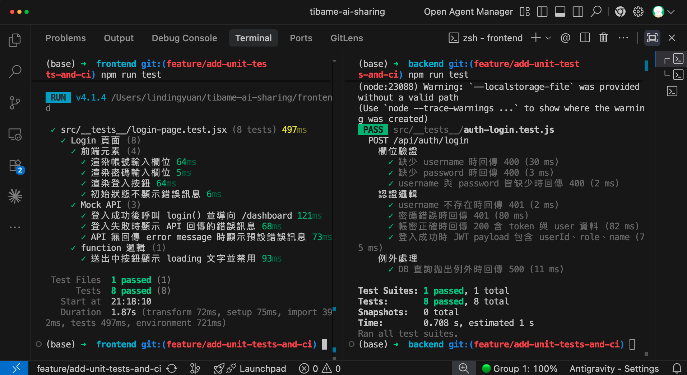

> **從玩具到產品，差的就是測試**
> 很多時候 AI 只是修好了眼前的錯誤，但過程中改壞了過去的邏輯。**千萬不要嫌寫測試浪費時間，測試其實是在幫你加速開發。**
>
> 現在儘管有 AI 輔助撰寫測試程式，我們還是要仔細檢查 AI 給的測試情境是否合理、有遺漏。

### 💡 實務建議
- 不要一口氣生成所有測試，先放`一個檔案確認結果符合預期`
- 每個頁面/模組有獨立的測試程式，方便`定位問題`
- 測試案例會隨規格變更而調整，`不可能一次到位`

## 建立自動化測試（CI/CD）

### 🔁 自動化測試流程
- `每次推送`到 GitHub 都觸發測試
- 測試完畢生成`覆蓋率報告`
- 設定 `Branch Protection Rule`，測試通過才能合併到主分支

> **測試覆蓋率不需追求 100%**
> 重要邏輯都包含在測試程式內，才是最重要的；**有了測試，規格書上的功能才能被真正驗證**。

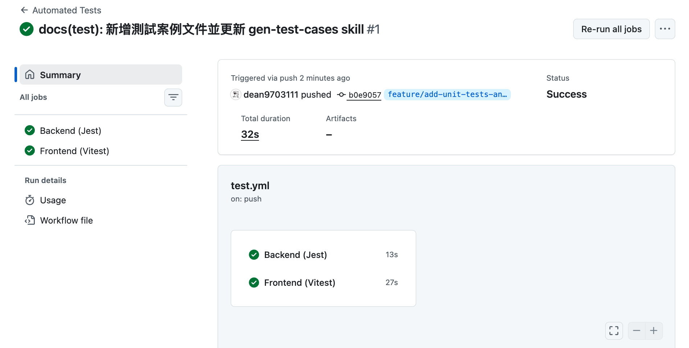

## 建立適合的 Agent Skills

> **建立客製化 Skill 的重要性**
> 每間公司都有自己的工作流，不同專案也有各自的情境；而 Agent Skills 讓每次達成的目標，成為下次的起點。
> **根據需求建立 Agent Skills，畢竟能實際給予幫助的，才是好的 Skill。**
## 拆分 Commit 讓變更可以被追蹤

### 📝 為什麼需要 Commit Skill？
- 分析變更的檔案 → 判斷應拆成幾個 commit → 分段提交
- 不同功能的修改分開 commit，讓邏輯可被追蹤
- 保持好習慣：每做完一件事就 commit，不要多功能混一起

[tags]
- [orange] 人工手打：耗時且風格不一致
- [purple] AI 自動生成：長短隨機、中英混雜
- [green] 解法：git-smart-commit Skill
[/tags]

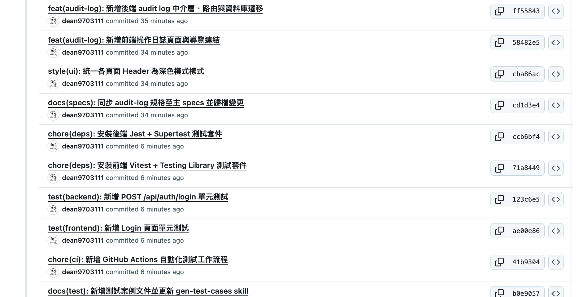

> **為什麼 Agent Skills 可以節省 Token?**
> 因為只讀取 Meta data（name、description），description 的重點不是描述 Skill 要做什麼，而是**在哪些情境會被觸發**。

### 🔀 設計 PR 讓 Code Review 更輕鬆

- 比對當前分支與目標分支的差異
- 讀取 commit 訊息與變更檔案
- 參考 `pr-template` 生成 Title 與 Description（漸進式揭露）

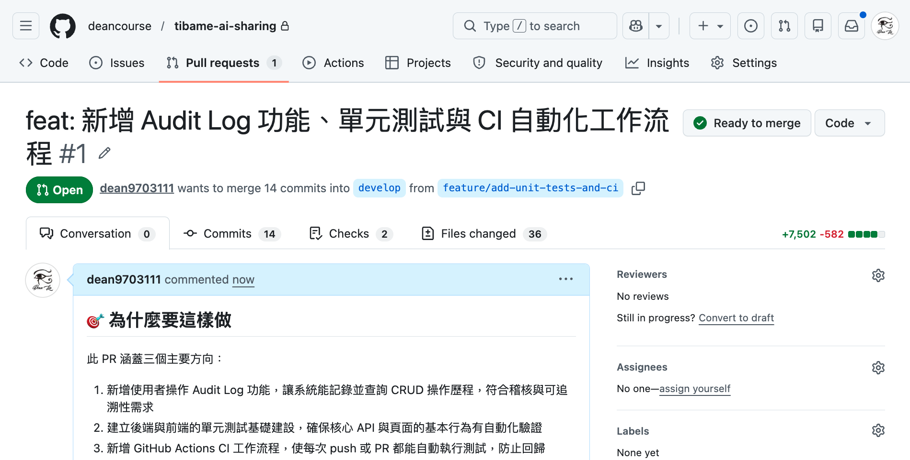

> **人，才是 AI 的瓶頸**
> Code Review 的速度已經跟不上 AI 寫程式的速度。當人成為 AI 的瓶頸時，要去想的是如何**降低門檻，而不是放棄審核。**
>
> **設計 Commit、PR 的 Skill 就是透過優化流程讓開發更順暢。**雖然每一步都是 AI 在執行，但如果沒有實務經驗，其實不知道怎麼串起這些工具。**真正值錢的不是工具本身，而是知道什麼時候用、怎麼組合。**

## 透過 Git Worktree 提升協作效率

### 🌳 讓每個 AI Agent 有獨立的工作區

- 多人協作專案時，你可能要同時撰寫**新功能、Code Review、修 Bug**
- 用 Git Stash 時常會混亂
- 使用 Worktree 可以區隔工作區，AI 可以獨立運作

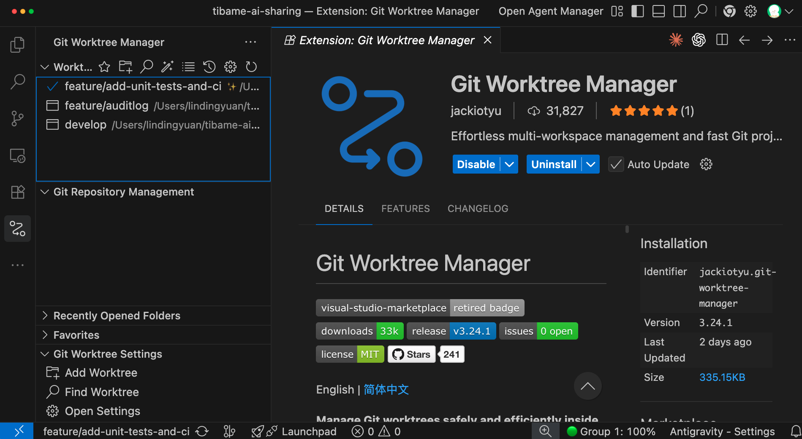

> **使用心得**
> **Git Worktree 主要的目的不是「平行開發」，而是方便處理不同性質的「任務」。**
> AI 執行的效率已經非常高了，與其平行開發後解衝突，還不如把精力放在 Code Review 上面確保專案穩定性。

## 讓 AI 幫你操作工具（MCP）

> **MCP 是 AI 的那雙「手」**
> Rules、Skills 教 AI 怎麼做事，但`只能操作電腦上的工具`。
> MCP 讓 AI 真的能伸手去操作外部服務 —— `查資料庫、打 API、把專案部署上線`。

### 🧪 自動建立 Postman Collection 測試 API

[flow]
1. 讀取專案 API — AI 掃描 Routing 與 Controller，盤點有哪些 Endpoint
2. 產生 Collection — 透過 MCP 直接在 Postman 建立對應的請求
3. 帶入測試情境 — 自動填好 `Header、參數、預期回應`
4. 驗證結果 — 實際打一次 API，確認行為符合規格
[/flow]

> **AI 讓體力活變自動化**
> - **過去**：建立 Request 要自己手動填參數，規格一改又要重來一輪。
> - **現在**：讓 AI 透過 MCP 操作 Postman，把這段重複勞動交出去，你只要負責確認`情境有沒有漏`。

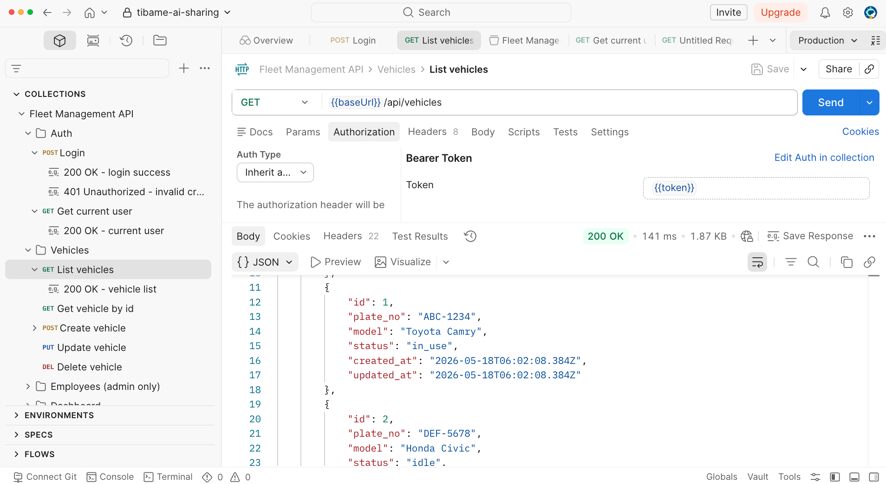

### ☁️ 透過 Zeabur 完成線上部署

[flow]
1. 連接平台 — 透過 MCP 串接 Zeabur，讓 AI 取得部署權限
2. 設定環境 — 由 AI 建立服務、填入`環境變數與資料庫設定`
3. 觸發部署 — 直接從對話完成上線，不用切到 Dashboard 點選
4. 確認狀態 — AI 回報部署結果與線上網址，出錯也能即時抓 log
[/flow]

> **部署不該是上線前的最後一道坎**
> 很多 Demo 都停在「上線」前一步，是因為部署設定瑣碎又容易出錯。
> 把流程交給 AI 操作，你能更快看到成果，也可以`快速迭代、加速驗證`。

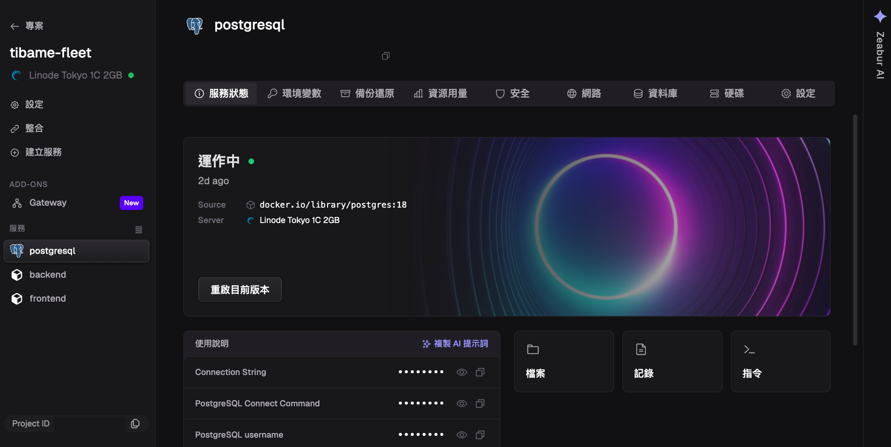

> 在 https://zeabur.com 購買伺服器或 AI Hub 額度，結帳時輸入我的推薦碼「`deanlin`」，即可享受折扣優惠～

---

# 總結：掌握可以跟 AI 一起成長的能力

[summary]
- 🧭 **價值移動** | 工程師的核心，從「寫程式」往**能判斷、能設計、能整合**移動
- 📊 **評估改寫** | 過去看寫幾行程式、完成幾張 Tickets，未來看**良率、恢復力、累積資產**
- 🪞 **底層沒變** | AI 是放大鏡 ——「**拆解、定義、驗證、負責**」一個都不能省
- 🛠️ **技術打底** | 掌握 **Rules / Commands / Skills / MCP**，提高與 AI 協作效率
- ⚙️ **流程可靠** | 用 **SDD** 規格驅動、**Commit / PR Skills**、**測試與 CI/CD**，讓產品從「看起來能動」變成「上線穩定」
[/summary]

[bonus title="🎁 幕後製作心得"]
這個課程網頁的製作，走過了一段從「結果不可控」到「完全掌控」的歷程。

1. **遇到痛點** — Vibe Coding 出來的網頁，調整內容都要改 HTML，非常不方便
2. **逆推結構** — 讓 AI 把現有網頁拆解，對應成一套可用 Markdown 撰寫的格式
3. **內容與版型分離** — 只需改 Markdown，自動套用對應版型，細節完全可控
4. **設計 Agent Skill** — 不是讓 AI 生成網頁，而是讓 AI 學會「這份 Markdown 怎麼寫」
5. **模板生成器思維** — AI 負責生成結構化內容，程式再把內容轉成最終網頁
[/bonus]

## 課程時間

#### 課程共分為 3 次直播，並提供永久回放
[time]
- label: 第 1 堂
  date: 5/30（六）
  time: 13:30~16:30
  des: **打造懂你的 AI 助手**：設定開發環境，掌握 AI Agent 進階技巧，建議專屬 Agent Skills 護城河
- label: 第 2 堂
  date: 6/6（六）
  time: 13:30~16:30
  des: **規格驅動開發 (SDD)**：讓 AI 根據規格建立系統，並搭配自製 Skill 優化開發流程，同時用 MCP 操作外部工具
- label: 第 3 堂
  date: 6/13（六）
  time: 13:30~16:30
  des: **團隊協作與專案部署**：建立自動化測試，了解 Worktree 應用時機，並將專案部署上線
[/time]

---

# 直播優惠：輸入折扣碼

## 感謝參與今日直播

#### 結帳輸入「202605」，享優惠價再折 1,000 元 ( 優惠只到 2026/5/28 23:59 )

| [報名 Claude AI 全端開發工作流](https://tibame.tw/Zmnts) |
| :---: | 
 | {max-width=300px} |


[qa-session title="Q&A 時間"]
- Q: 我完全沒有程式背景，可以學嗎？
  A: 可以。AI 不會讓你「不需要懂技術」，而是讓你「可以一邊做一邊學技術」。這堂課的設計是讓你在實作中累積技術概念，而不是讓你假裝懂 —— 沒有前後端與資料庫的概念，你是沒有能力判斷 AI 給的資訊是否正確的。
- Q: 我已經用過很多 AI 工具，這堂課還適合我嗎？
  A: 適合。如果你常常在「換工具、換框架、換 Prompt」但成果沒有累積，你需要的是「方法」，不是「更多工具」。
- Q: 如果我 Cursor / Antigravity / Claude Code 都熟了呢？
  A: 這堂課工具操作只佔不到 20%，其他 80% 是 Rule、Workflow、Skill、Spec、測試、Code Review、團隊協作這些「跨工具的方法」。就算明年出了更強的 AI 工具，這些方法都還會留下來。
- Q: 中途有跟不上的內容怎麼辦？
  A: 課程提供完整錄影回放、每堂課的程式碼 / 提示詞 / Skill 模板都在講義上，課後也有專屬 LINE 群可以詢問。
- Q: 學完後，我會變強嗎？
  A: 學完後，你會更「清楚」如何將 AI 導入開發流程。強不強，看你願不願意把學到的東西，套到自己的工作流上。只有動手把知識轉化成自己實際能用到的，那才會變成你的。
[/qa-session]