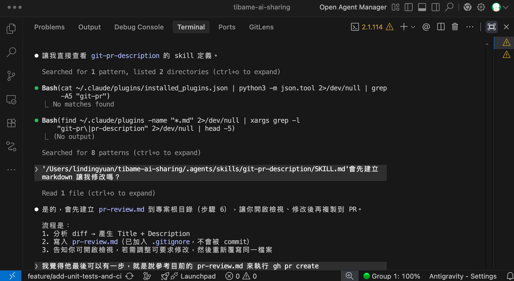
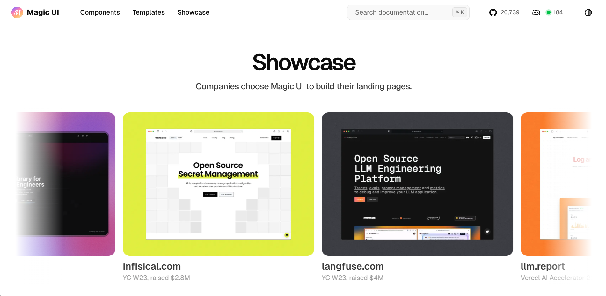
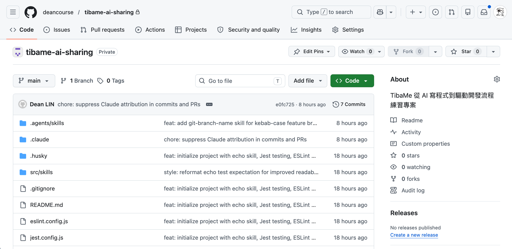
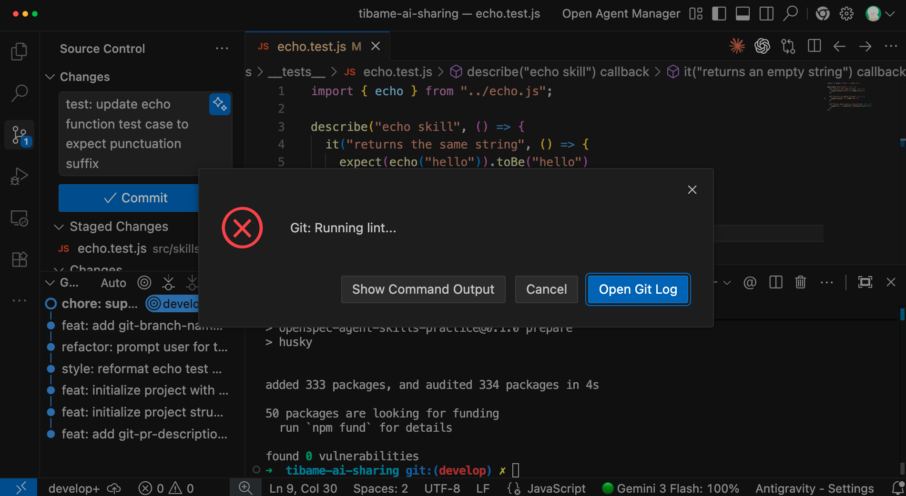
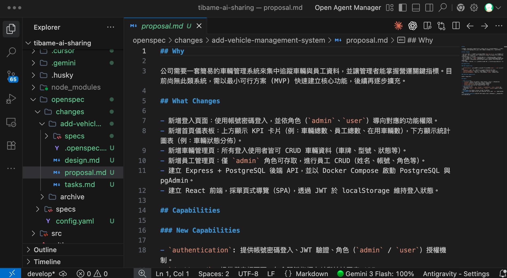
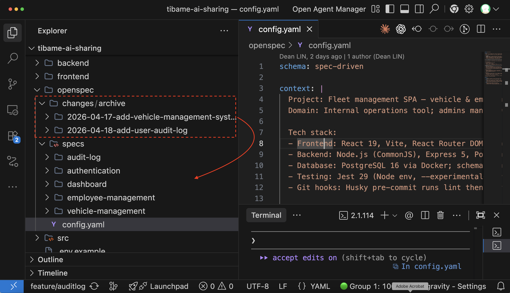
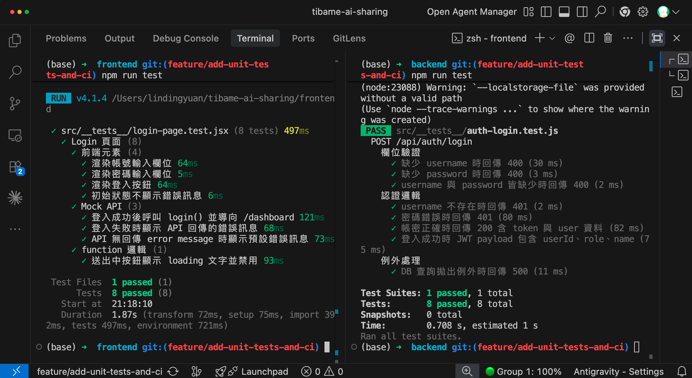
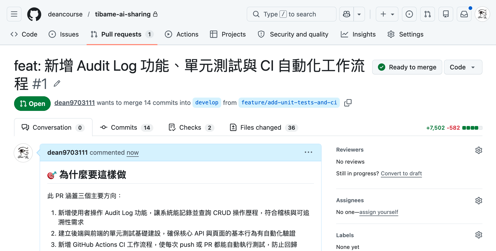
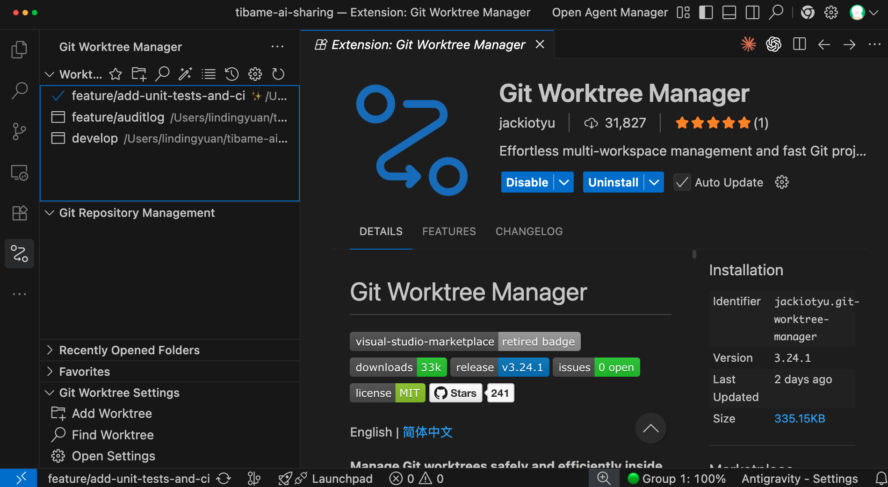

# 常見痛點：穩定性不足、難以維護、無法驗證

> 一句話 AI 就能生成有前端、後端、資料庫的系統，但...你敢用嗎？

## 不要讓 AI 的「快」，變成未來的「債」

### 😓 三大痛點

- **穩定性**：請 AI 解決目前的問題，改完後發現過去正常的功能被改壞了
- **複雜度**：功能持續增加，靠人工逐一確認流程，耗時又容易有遺漏
- **擴充性**：架構逐漸複雜後，任何修改都可能引發連鎖影響，出狀況時連問題都不知道如何定位

> **如果這些個問題能引起你的共鳴，恭喜你！**
> 這代表你已經進入了下一個階段，開始思考如何讓 Vibe Coding 的成果真正可靠。
> 其實在沒有 AI 的時代，這些問題就已經存在；**但 AI 寫程式速度太快，所以這些問題被加倍放大。**

### 💪 將 AI 導入工作流

[flow]
1. Lint — 檢查程式碼風格，避免 AI 生成`風格不一致`，留下`多餘程式`，增加 Code Review 負擔。
2. OpenSpec - `讓 AI 根據規格文件做事`，完成從 0 到 1 的建立，更處理從 1 到 100 的迭代
3. 客製化 Agent Skills - 拆分 Commit 讓`邏輯可被追朔`、定義 Branch `命名規則`、設計 PR 方便 `Code Review`
4. 導入測試 - 確保`新功能`符合預期，`舊功能`執行穩定，並透過`測試覆蓋率報告`了解實際狀況
5. Git Flow - 加入`版本控制`與`分支策略`，確保出包時有回頭路，以及不影響到正式版本
6. CI/CD - 透過自動化工作流`檢查格式、測試功能`，並設定要`保護的 Branch`
[/flow]


---

# AI 時代下的迷思：從解決痛點的過程，學習工具

## 挑選合適的工具
> **不要再當搬運工了！**
> 網頁版的 AI 只能告訴你該怎麼做，AI Agent 能直接幫你完成工作。

### 🌐 網頁版 AI 的痛點

**1. 需要打開瀏覽器操作：** 開啟`新對話`後，又得重講專案背景
**2. 難以給予完整上下文：** 手動複製`程式碼`、`錯誤訊息`，AI 無法了解專案全貌（功能相依性、資料夾結構），容易誤判
**3. 要自己手動修改程式：** AI 給予答案後，你要`自行編輯程式`，但容易發生貼錯、少貼的狀況
**4. 驗證與測試要自己做：** 不管提示詞再好，AI 還是可能犯錯，`來回溝通成本高`


### 🖥️ AI Agent 的優勢

**1. 看到整個專案的檔案和程式內容：**不只是一段段貼給 AI，而是`讓 AI 了解你全部的程式脈絡`，減少誤判。
**2. 可以直接增修檔案執行指令：**在調整完程式後，可以`直接測試確定符合預期`，不需要複製貼上來回確認。
**3. 查專案非常方便：**專案功能對應的程式、函式呼叫路徑，甚至可以`知道當初是誰寫`的這段程式。



## 了解 AI 的能力範圍，而不是盲從 

> **是我太爛嗎？**
> 社群媒體上，好像每個人用 AI 就能輕鬆完成專案，但我卻處處碰壁。

### 🌟 網路上的 Demo 都是精心挑選過的

#### 漂亮精美的網頁其實是框架的功勞：[Magic](https://magicui.design/)、[Aceternity](https://ui.aceternity.com/)



#### 一堆 AI Agent 同時執行，未必會更好


> **導入 AI，不代表全交給 AI**  
> 把`AI 能做到的事`跟`人必須負責的判斷`分清楚。
> 讓 AI Agent 執行很久，不一定最強；我不認為對專案毫無掌控度是件好事。
> **好的結果，不該靠消耗 Token 拼運氣；而是靠清楚的方向、可重複的工作流、以及人類在關鍵節點的決策。**

### 😰 出現新名詞很焦慮

[flow]
1. 先觀察一段時間 - 工具剛推出時往往不完善、沒有教學，上手難度也高
2. 是否有具體案例 - 是話題性產品，還是有具體的成功案例
3. 對你有幫助嗎 - 工具再好，也要自己用得上才有意義
[/flow]

> **培養批判性思考能力**
> 人的精力有限，`技術是學不完的`；要先培養出辨識問題的能力，然後思考如何解決，`工具只是在過程中學會罷了`。
> 現場遇到的問題都是不同的，沒有現成的解決方案，就要`自己設計`出來。

---

# 前置作業：課程會用到的工具、技術

## AI 是大腦，工具是雙手

### 🛠️ 環境準備
- **[Git](https://git-scm.com/install/windows)** — 版本控制工具，用來追蹤每次改動
- **[GitHub 帳號](https://github.com)** — 雲端 Git 儲存庫，用來管理專案
- **[nvm](https://github.com/nvm-sh/nvm)** — Node.js 版本管理工具，方便切換
- **[Python](https://www.python.org/downloads/)** — Agent Skills 的 scripts 大部分使用 Python 撰寫
- **[Cursor](https://cursor.com/)**、**[Antigravity](https://antigravity.google/)**、**[VSCode](https://code.visualstudio.com/)** — 安裝任一款程式碼編輯器（IDE）
- **[Docker](https://www.docker.com/)** — 獲得一致的開發環境

### ⚙️ 初探 MCP / Rules / Commands / Skills

**1. MCP：**透過標準介面`呼叫其他工具的 API`，操作方式較穩定、可預期
**2. Rules：**`專案的規範`，通常不會寫太多，因為會佔用到上下文的空間
**3. Skills：**把日常工作中執行任務的細節、技巧、判斷模式放進去，AI 遇到`相關任務時會主動觸發`
**4. Commands：**可以設計完整工作流（ex: 執行多個 Skills），要`手動觸發`

---

# 開發實戰：將 AI 導入工作流
> **Work Smart, Don't Work Hard**  
> 在 AI 時代，寫了多少行程式、完成幾個 feature、修了多少 bug，已經不像過去那麼重要了。
> 但如果能把某個協作環節變順，讓大家少踩坑、少重工、少在無聊的事情上浪費時間，那會給你帶來 **Credit** 與 **可累積的職涯資本**。

## 不管 Prompt 多完美，AI 都可能犯錯

> **把 AI 犯錯當成必然**
> 比起讓 AI 永不犯錯，更重要的是設計當 AI 犯錯時警告的通知！

### 🗂️ 每堂課都會有 Git Repo 讓大家練習

- 會有影片回放，讓大家複習
- 搭配設計好的專案與 Prompt，可以快速理解如何使用



### 🚀 懂技術會讓 AI 效能加倍

**1. AI 有一定隨機性：**即使有 Rules 規範，AI 生成的格式（ex: 縮排、引號）可能`每次都不一樣`，而且有可能`動到原有邏輯`。
**2. 加上 Pre-commit：**Commit 前確保專案 `Coding Style 一致性、測試都通過`。




### 🤖 可以使用不同的 AI Agent

雖然課程講的是 Claude Code，但 Cursor、Codex、Antigravity 這些`主流工具都支援 MCP / Rules / Commands / Skills`。

每個 AI Agent 的路徑稍不同，可以使用 [dotagents](https://github.com/dean9703111/dotagents) 來協助建立 symlinks。

```prompt [label="將 Agent Skills 同步到指定的 AI Agent"]
npx @dean9703111/dotagents
```


## 新專案:規格驅動開發（SDD）

### 🔧 為什麼需要 OpenSpec？

- AI 寫程式越來越快，但專案越改越亂，甚至越改越壞
- 關鍵人物離職，沒有文件，系統知識直接斷層
- **解法：**白話文對話 → AI 自動建立規格文件 → 根據規格驅動開發

### 📋 OpenSpec 如何建立文件規格

[flow]
1. proposal.md — 確認目標與範圍
2. design.md — 技術選型與風險評估
3. specs/ — 按功能分類的詳細規格
4. task.md — 任務清單，完成自動打勾
[/flow]



## 舊專案:如何完成從 1 到 100 迭代

### 📄 AI 如何協助專案迭代？

**1. CLAUDE.md：**讓 AI 知道要怎麼`做事`
**2. openspec/config.yaml：**了解`規劃`時要參考的資訊

#### 用 OpenSpec 迭代新功能

[flow]
1. 閱讀專案既有架構、功能 — 確認要新增還是修改
2. 開始設計規格文件 - 一樣跑「proposal ⭢ design ⭢ specs ⭢ task」
3. 完成任務後，彙整河道原有規格 - 對快速迭代、多人合作專案幫助極大。
[/flow]



> **為什麼 1 到 100 比 0 到 1 更難？**
> 如果沒有規格文件，下次改功能時 AI 不知道之前的設計邏輯，可能把同一個功能重複寫好幾次，或改 A 壞 B。
>
> 用 OpenSpec 每次迭代都會在 Source Control 留下規格變更，AI 跟人類都有文件可以參考。關鍵人物離職最痛的不是少了一個人，而是系統知識直接斷層。


## 導入測試：讓維護與擴充更有底氣
> 市場不會為爛產品買單；加入自動化測試，是 Vibe Coding **從玩具走向產品的關鍵**

### 🛡️ 為什麼 Vibe Coding 一定要測試？

[flow]
1. 穩定性 — 請 AI 修 bug，結果舊功能壞掉
2. 複雜度 — 功能越多，人工測試越不可能覆蓋全部
3. 擴充性 — 功能間有相依性，修改可能引發連鎖影響
[/flow]

### 🔄 建立適合專案的測試工作流

[flow]
1. 建立資料夾 — 存放測試清單
2. AI 撰寫清單 — 類型、說明、輸入、期待輸出
3. 人類 Review — 確認情境有無遺漏
4. AI 撰寫測試 — 描述與文件一致
5. 自主驗證 — 最多嘗試 5 次
[/flow]



> **從玩具到產品，差的就是測試**
> 很多時候 AI 只是修好了眼前的錯誤，但過程中改壞了過去的邏輯。**千萬不要嫌寫測試浪費時間，測試其實是在幫你加速開發。**
>
> 現在儘管有 AI 輔助撰寫測試程式，我們還是要仔細檢查 AI 給的測試情境是否合理、有遺漏。

### 💡 實務建議
- 不要一口氣生成所有測試，先放一個檔案確認結果符合預期
- 每個頁面/模組有獨立的測試程式，方便定位問題
- 測試案例會隨規格變更而調整，不可能一次到位

## 建立自動化測試（CI/CD）

### 🔁 自動化測試流程
- 每次推送到 GitHub 都觸發測試
- 測試完畢生成覆蓋率報告
- 設定 Branch Protection Rule，測試通過才能合併到主分支

> **測試覆蓋率不需追求 100%**
> 重要邏輯都包含在測試程式內，才是最重要的；有了測試，規格書上的功能才能被真正驗證。


# 專案協作:建立適合的 Agent Skills

> **建立客製化 Skill 的重要性**
> 每間公司都有自己的工作流，不同專案也有各自的情境；而 Agent Skills 讓每次達成的目標，成為下次的起點。
> **根據需求建立 Agent Skills，畢竟能實際給予幫助的，才是好的 Skill。**
## 拆分 Commit 讓變更可以被追蹤

### 📝 為什麼需要 Commit Skill？
- 分析變更的檔案 → 判斷應拆成幾個 commit → 分段提交
- 不同功能的修改分開 commit，讓邏輯可被追蹤
- 保持好習慣：每做完一件事就 commit，不要多功能混一起

[tags]
- [orange] 人工手打：耗時且風格不一致
- [purple] AI 自動生成：長短隨機、中英混雜
- [green] 解法：git-smart-commit Skill
[/tags]


> **為什麼 Agent Skills 可以節省 Token?**
> 因為只讀取 Meta data（name、description），description 的重點不是描述 Skill 要做什麼，而是**在哪些情境會被觸發**。

## 設計 PR 讓 Code Review 更輕鬆

### 🔀 git-pr-description Skill

- 比對當前分支與目標分支的差異
- 讀取 commit 訊息與變更檔案
- 參考 `pr-template` 生成 Title 與 Description（漸進式揭露）



> **人，才是 AI 的瓶頸**
> Code Review 的速度已經跟不上 AI 寫程式的速度。當人成為 AI 的瓶頸時，要去想的是如何**降低門檻，而不是放棄審核。**
>
> **設計 Commit、PR 的 Skill 就是透過優化流程讓開發更順暢。**雖然每一步都是 AI 在執行，但如果沒有實務經驗，其實不知道怎麼串起這些工具。**真正值錢的不是工具本身，而是知道什麼時候用、怎麼組合。**

## 透過 Git Worktree 提升協作效率

### 🌳 讓每個 AI Agent 有獨立的工作區

- 多人協作專案時，你可能要同時撰寫**新功能、Code Review、修 Bug**
- 用 Git Stash 時常會混亂
- 使用 Worktree 可以區隔工作區，AI 可以獨立運作



> **使用心得**
> Git Worktree 主要的目的不是「平行開發」，而是方便處理不同性質的「任務」。
> AI 執行的效率已經非常高了，與其平行開發後解衝突，還不如把精力放在 Code Review 上面確保專案穩定性。

---

# 總結：今天的三大主軸

[summary]
- 🏗️ **痛點** | AI 寫程式很快，但**穩定性不足、難以維護、無法驗證**，這些問題在 AI 時代被加倍放大
- 🛠️ **技術** | 安裝系統環境、理解 **MCP / Rules / Commands / Skills** 核心概念，打好與 AI 協作的基礎
- ⚙️ **方案** | 用 **SDD** 規格驅動開發、設計 **Commit / Branch / PR Skills**，**導入測試與 CI/CD**，讓流程可靠可追蹤
[/summary]

[bonus title="🎁 幕後製作心得"]
這個課程網頁的製作，走過了一段從「結果不可控」到「完全掌控」的歷程。

1. **遇到痛點** — Vibe Coding 出來的網頁，調整內容都要改 HTML，非常不方便
2. **逆推結構** — 讓 AI 把現有網頁拆解，對應成一套可用 Markdown 撰寫的格式
3. **內容與版型分離** — 只需改 Markdown，自動套用對應版型，細節完全可控
4. **設計 Agent Skill** — 不是讓 AI 生成網頁，而是讓 AI 學會「這份 Markdown 怎麼寫」
5. **模板生成器思維** — AI 負責生成結構化內容，程式再把內容轉成最終網頁
[/bonus]

## 課程時間

#### 課程共分為 3 次直播，並提供永久回放
[time]
- label: 第 1 堂
  date: 5/30（六）
  time: 13:30~16:30
  des: **打造懂你的 AI 助手**：建立專屬 Agent Skills 護城河
- label: 第 2 堂
  date: 6/6（六）
  time: 13:30~16:30
  des: **規格驅動開發 (SDD)**：用 Agent Skills 讓 AI 照著規格精準建置系統
- label: 第 3 堂
  date: 6/13（六）
  time: 13:30~16:30
  des: **高標準團隊協作**：建立自動化測試與多 Agent 並行工作流
[/time]

---

# 直播優惠：輸入折扣碼

## 感謝參與今日直播

#### 結帳輸入「20260423」，享優惠價再折 1,000 元 ( 優惠只到 2026/4/23 23:59 )

| [報名 Claude AI 全端開發工作流](https://tibame.tw/Zmnts) |
| :---: | 
 | {max-width=300px} |

[qa-session title="Q&A 時間"]
[/qa-session]
