[time]
- label: 第 1 堂
  date: 5/30（六）
  time: 13:30~16:30
  des: **打造懂你的 AI 助手**：設定開發環境，掌握 AI Agent 進階技巧，建議專屬 Agent Skills 護城河
  active: true
- label: 第 2 堂
  date: 6/6（六）
  time: 13:30~16:30
  des: **規格驅動開發 (SDD)**：讓 AI 根據規格建立全端系統，並搭配自製 Skill 優化開發流程
- label: 第 3 堂
  date: 6/13（六）
  time: 13:30~16:30
  des: **團隊協作與專案部署**：建立自動化測試，了解 Worktree 應用時機，同時用 MCP 操作外部工具將專案部署上線
[/time]

# 為什麼使用 IDE：我厭倦在 AI 工具間複製貼上
> 網頁版的 AI 只能告訴你該怎麼做，AI Agent 能直接幫你完成工作

## 工具越多，流程越碎

### ‍💻 一開始的工作方式

[flow]
1. 工程師 — 程式碼編輯器（IDE），就是用來寫程式的
2. 創作文章、資料彙整 — 靠 ChatGPT、NotebookLM
3. 簡報製作 — 先生成 Markdown 初稿，再交給 Gamma
[/flow]

> **不同任務要切換不同工具**
> 我認為自己對 AI 工具很熟悉，但`學習的成本太高`了，而且`流程很瑣碎`。

### 😩 痛點 1：複製貼上讓人煩躁

- **資料格式往往不統一**：Word / PDF / PPT / Web Link
- **重複內容難辨真假**：不同來源可能描述不同、甚至相反
- **NotebookLM 能用但感覺自己像機器人**：「上傳 → 複製 → 貼上」的動作無趣又耗時

### 🎬 痛點 2：瑣碎的事情太多

- **影片創作**：每支影片都要處理`腳本設計、字卡規劃、音效建議、宣傳導流`
- **課程講義**：就算 Gamma 簡報很好用，但需要承受`伺服器壞掉、格式受限`等問題
- **商業提案**：純文字`缺乏吸引力`、Word 完成後輸出 PDF `很麻煩`

> **不要讓熱情被瑣事消耗**
> - 這些事情各自不難，但加在一起`非常耗時`。
> - 沒有成就感的事情`重複做`，會越來越不想做。
> - 工具掌握在別人手上，就要承擔`風險、限制`。

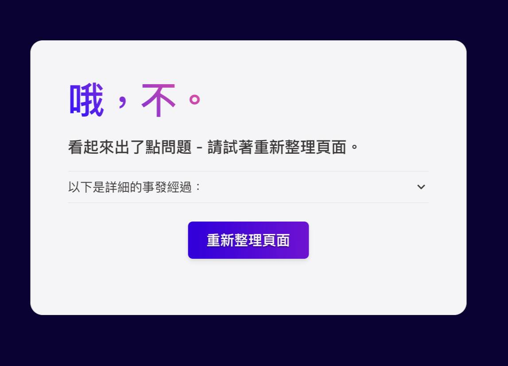

## 轉念：讓 AI 代勞

> 於是我開始思考 — **有哪些任務可以交給 AI 處理？**
> 有沒有可能，把任務集中到`一個工具搞定`？

[flow]
1. 格式轉換 — Word / PDF / PPT 丟進來，AI `自動解析`
2. 資訊彙整 — `去除重複資訊、合併重點`
3. 內容生成 — 影片腳本、字卡、宣傳文案`一條龍`產出
4. 流程自動化 — 設計工作流，讓 AI `自動執行每一步`
[/flow]

> **這就是 AI Agent 的潛力：**
> 不只是「問一句答一句」的聊天機器人，而是能`理解你的任務脈絡、操作你的檔案、串接多個步驟`，幫你從頭到尾把事情做完的 AI 助手。

---

# 前製作業：初探 Claude Code & 確認開發環境

## AI 是大腦，工具是雙手

> AI Agent 能做多少事，取決於你給它多少`工具`。

### 🛠️ 確認開發環境

- **[Git](https://git-scm.com/install/windows)** — 版本控制工具，用來追蹤每次改動
- **[GitHub 帳號](https://github.com)** — 雲端 Git 儲存庫，用來管理專案
- **[nvm](https://github.com/nvm-sh/nvm)** — Node.js 版本管理工具，方便切換
- **[Python](https://www.python.org/downloads/)** — Agent Skills 的 scripts 大部分使用 Python 撰寫
- **[Cursor](https://cursor.com/)**、**[Antigravity](https://antigravity.google/)**、**[VSCode](https://code.visualstudio.com/)** — 安裝任一款程式碼編輯器（IDE）
- **[iTerm2](https://iterm2.com/)**、**[cmux](https://cmux.com/zh-TW)**：這些終端機（terminal）在 `Mac` 都有不錯的體驗；`Windows` 可使用原生的 Powershell
- **[Claude 帳號](https://claude.ai/)** — 目前 Claude Code 需要 Pro 級別以上才能使用

#### 確認 Git & GitHub 帳號

```terminal [label="確認 Git 版本與帳號設定"]
git --version
git config --global user.name
git config --global user.email
```

> **若尚未設定，請執行**
> git config --global user.name "你的名字"
> git config --global user.email "你的 Email"

#### 安裝 nvm & 確認版本

**macOS / Linux**

```terminal [label="安裝 nvm"]
curl -o- https://raw.githubusercontent.com/nvm-sh/nvm/v0.40.4/install.sh | bash
```

**Windows**
前往 **[github.com/coreybutler/nvm-windows/releases](https://github.com/coreybutler/nvm-windows/releases)** 下載最新的 `nvm-setup.exe` 安裝程式

安裝完成後，**重新開啟終端機**，確認版本：

```terminal [label="確認 nvm 版本"]
nvm -v
```

#### 安裝最新版本的 Node.js 

```terminal [label="安裝 Node.js（透過 nvm）"]
nvm install --lts
nvm use --lts
node -v
```

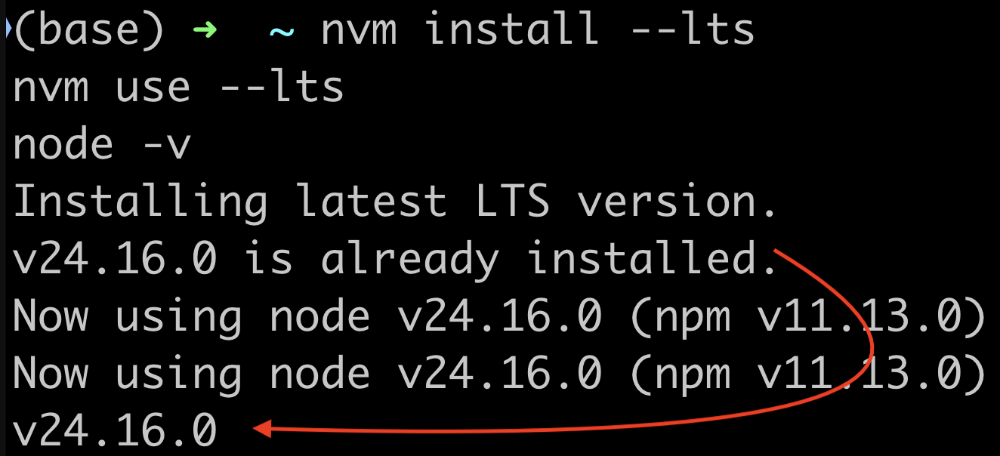

#### 確認 Python 版本

**macOS / Linux**：可透過 alias 讓 python 指向 python3 版本

```terminal [label="確認 Python 版本"]
python3 --version
pip3 --version
```

**Windows**

```terminal [label="確認 Python 版本（Windows PowerShell）"]
python --version
pip --version
```

#### 用 Alias 統一 Python 版本

AI 在使用 Python 指令時，有可能使用 `python3 xxx` or `python xxx`。

而 pip 安裝的套件會相依於 python 版本，假使電腦有多個版本，就容易發生`套件找不到重新安裝的問題`。

所以建議透過 `alias` 別名的方式來統一。

```prompt [label="用 alias 統一 python 版本"]
請協助我檢查目前電腦上的 Python 與 pip 指向哪個版本
幫我設定 alias，我希望 python、python3 與 pip、pip3 都指向一樣的版本，避免套件版本飄移
```

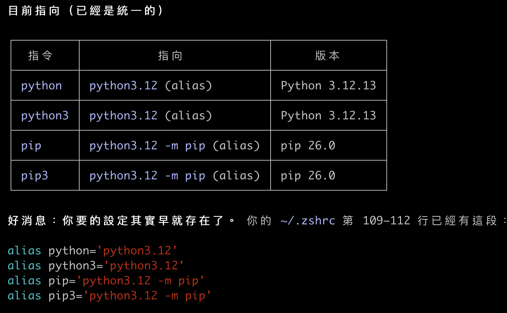

[lab-session title="🛠️  實作練習"]
- 確認 Git & GitHub 帳號
- 確認 nvm & Node.js 版本
- 確認 Python 版本
[/lab-session]

## 在終端機使用 Claude Code

### 🛠️ 安裝 Claude Code

**macOS, Linux, WSL**

```terminal [label="安裝 Claude Code"]
curl -fsSL https://claude.ai/install.sh | bash
```

**Windows PowerShell**

```terminal [label="安裝 Claude Code"]
irm https://claude.ai/install.ps1 | iex
```

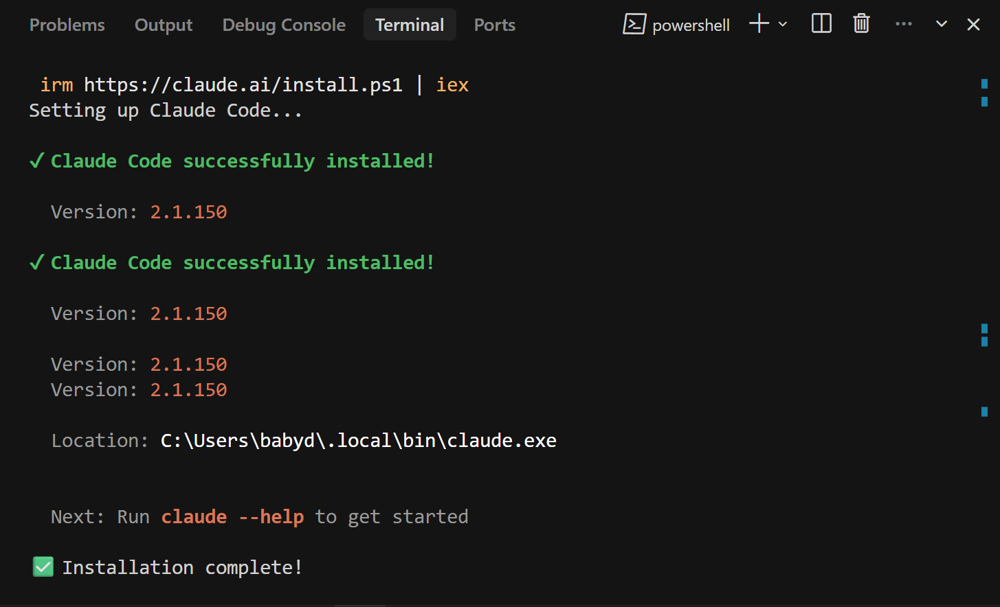

### 🚀 啟動 Claude Code

```terminal [label="啟動 Claude Code"]
claude
```

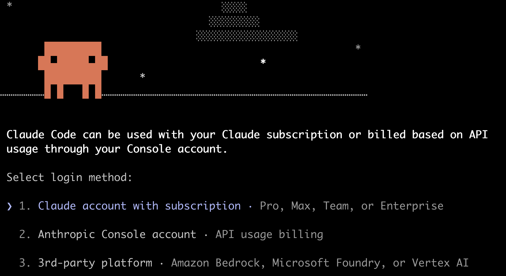

> **Windows 小提醒**
> 如果想要貼上資訊，點擊滑鼠右鍵即可。

## 在 IDE 使用 Claude Code

### 🧩 從 Extensions 安裝

如果不習慣終端機操作，安裝 Claude Code 外掛也能使用大部分的功能；**但用一段時間後，終究是會回到終端機操作**。

1. 打開側邊欄 `Extensions`
2. 搜尋 `Claude Code`
3. 點擊 `Install`

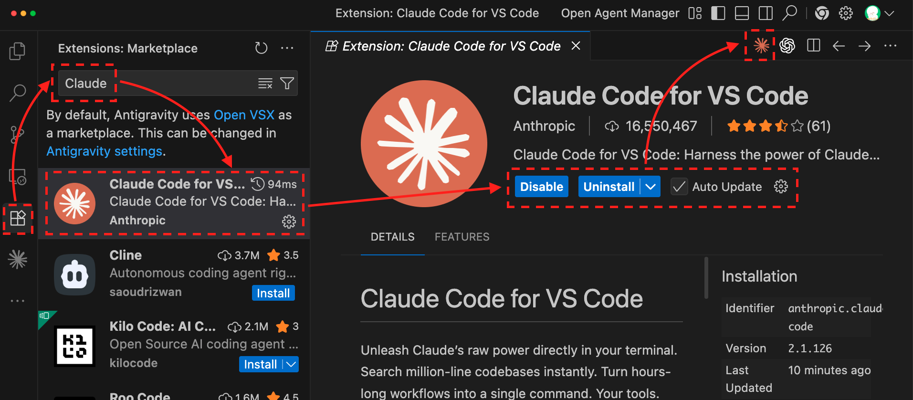

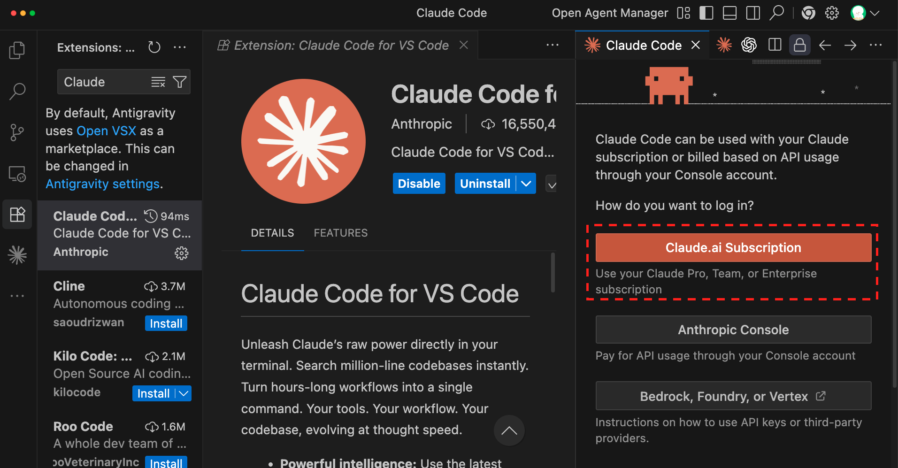

### 🛡️ 調整隱私設定

Help improve Claude 默認為 `true`，請調整為 `false`。

```prompt [label="調整隱私設定"]
/privacy-settings
```

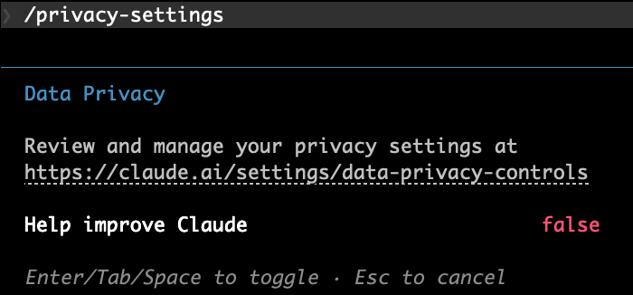

### 🚫 禁止 Claude 使用危險指令

AI 執行的指令是無法完全預期的，為了減少損失，可以透過設定來阻止危險操作。

```prompt [label="要求修改設定"]
我希望 Claude 在默認的 settings 禁止下面的指令（其他原有設定要保留）：
- 刪除：rm -rf, rm -fr, rm -r, rm -R, rm -f
- 最高權限：sudo
- 磁碟破壞：dd, mkfs, diskutil erase
- 權限濫用：chmod 777, chmod -R 777
- Git 不可逆操作：reset --hard, push --force, push -f, clean -f, branch -D
- 系統關機/重開：shutdown, reboot
- 檔案清空：: >, truncate
完成後給我看設定檔
```

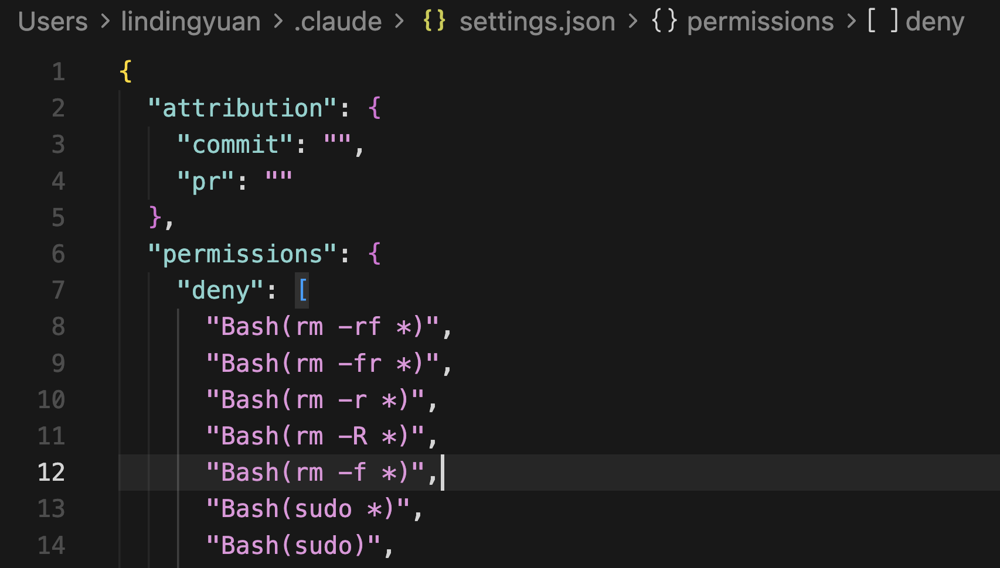

完成後建議`重啟 Claude`確認設定生效。

```prompt [label="確認 Claude 當前專案權限設定"]
/permissions
```

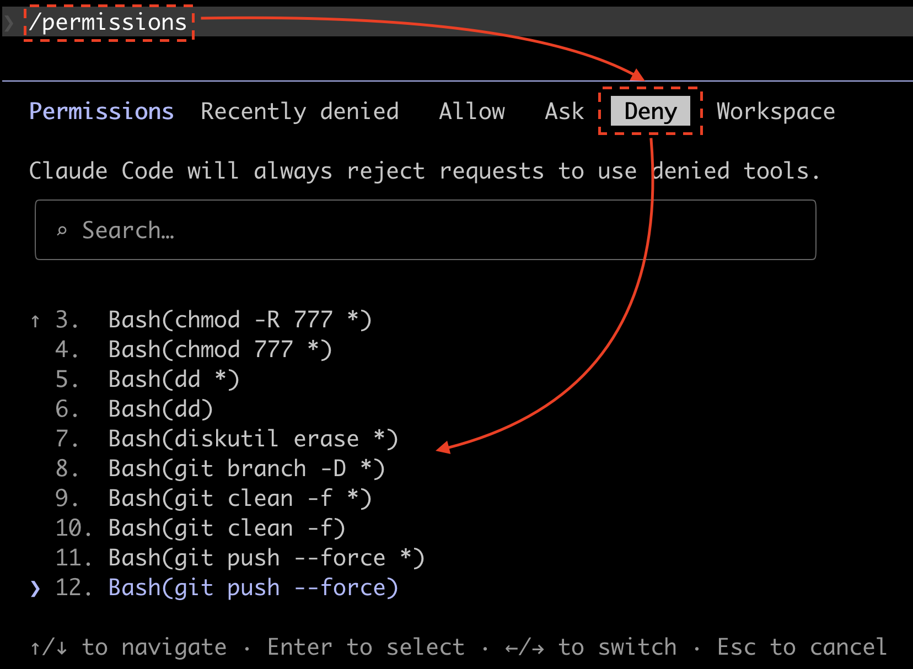

> **可以進一步設計成 hook**
> - Claude 的 `permissions.deny` 是用**前綴字串比對**，比如："Bash(rm -rf *)", "Bash(sudo *)", "Bash(dd *)"
> - PreToolUse Hook 在 `settings.json 的 hooks 腳本`，解析**整串指令、正規表示式比對**，比如：bash -c "rm -rf ..."

```prompt [label="加入 hook 增加防護"]
幫我將設定加入到 PreToolUse Hook 增加防護
```

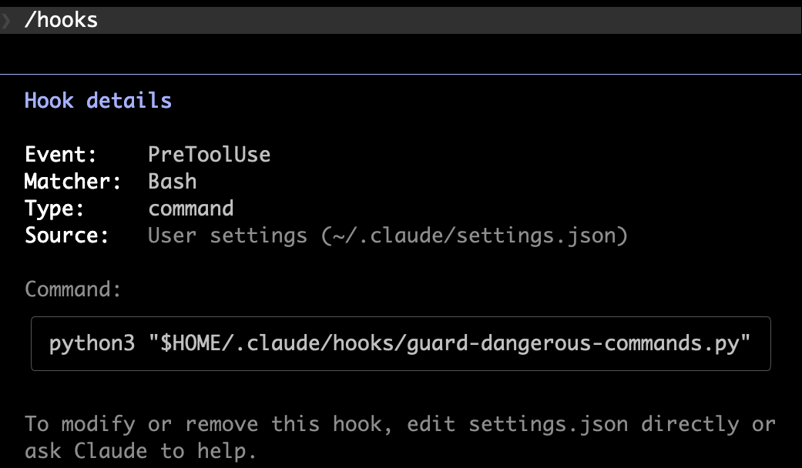

[lab-session title="🛠️  實作練習"]
- 在終端機使用 Claude Code
- 在 IDE 使用 Claude Code
- 調整隱私設定
- 禁止 Claude 使用危險指令
- 確認指令的禁止有生效（不要在根目錄測試）
[/lab-session]

### 📂 了解 Claude Code 工作目錄

[html src="./html/claude-folder-structure.html"]

> **Tips**
> .claude/ 就像給 Claude 一本專屬手冊：告訴它你是誰（**設定**）、你可以做什麼（**權限**）、你想怎麼做（**規則**）、你希望它自動完成什麼（**技能**），以及特別的角色（**代理**）。
> 專案層級放在 your-project/.claude/，使用者層級放在 ~/.claude/，**兩者會合併生效，專案設定優先。**

### ⚙️ 了解 Rules / Commands / Skills / MCP 應用場景

**1. Rules（CLAUDE.md）：**`每次對話都會參考`，記錄專案技術、規範、注意事項；不要寫太多，會佔用上下文空間
**2. Skills：**把日常工作中執行任務的細節、技巧、判斷模式放進去，AI 遇到`相關任務時會主動觸發`
**3. Commands：**可以設計完整工作流（ex: 執行多個 Skills），要`手動觸發`
**4. MCP：**透過標準介面`呼叫其他工具的 API`，操作方式較穩定、可預期

### 🤖 Claude 不同操作模式

| 模式 | 無需詢問即可執行的操作 | 最適合 |
| --- | --- | --- |
| **default** | 僅讀取 | 入門、敏感工作 |
| **acceptEdits** | 讀取、檔案編輯和常見檔案系統命令（mkdir、touch、mv、cp 等） | 迭代您正在審查的程式碼 |
| **plan** | 僅讀取 | 在變更前探索程式碼庫 |
| **auto** | 所有操作，具有背景安全檢查 | 長時間執行的任務、減少提示疲勞 |
| **dontAsk** | 僅預先批准的工具 | 鎖定的 CI 和指令碼 |
| **bypassPermissions** | 除受保護路徑外的所有操作 | 僅隔離容器和 VM |

> **Tips:**
> **對話時**：可以按 Shift+Tab 循環「default → acceptEdits → plan」
> **啟動時**：可以用「claude --permission-mode `plan`」來設定

### 🤖 Claude 不同模型

- **Opus** — 推理能力最強，適合需要深度分析的架構設計、複雜 Debug、長篇規格撰寫
- **Sonnet**— 速度與品質平衡，日常開發、寫程式、改 Bug 首選
- **Haiku** — 最快最省，適合：簡單問答、格式轉換等不需要推理的任務

```prompt [label="可根據任務調整 Model"]
/model
```

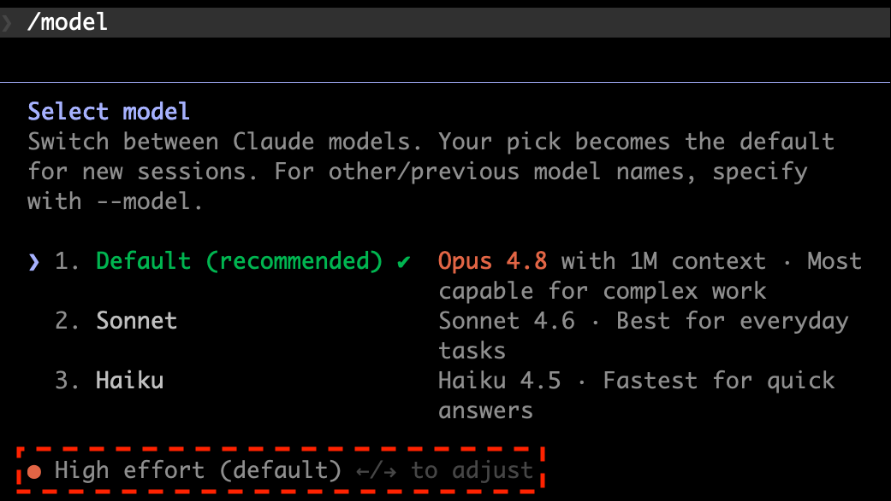

### 📊 設定 Status Line

Context 被壓縮（Compact）、Claude 忘記前面資訊、額度耗盡時，如果沒有 Status Line 完全不會意識到。

```terminal [label="了解目前 Claude Code 額度"]
npx @kamranahmedse/claude-statusline
```

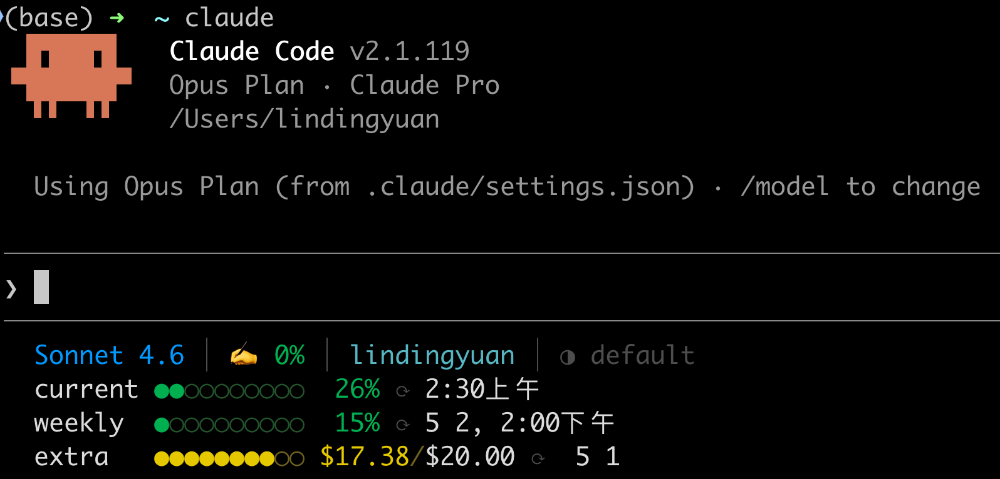

#### Windows 可能會遇到的問題

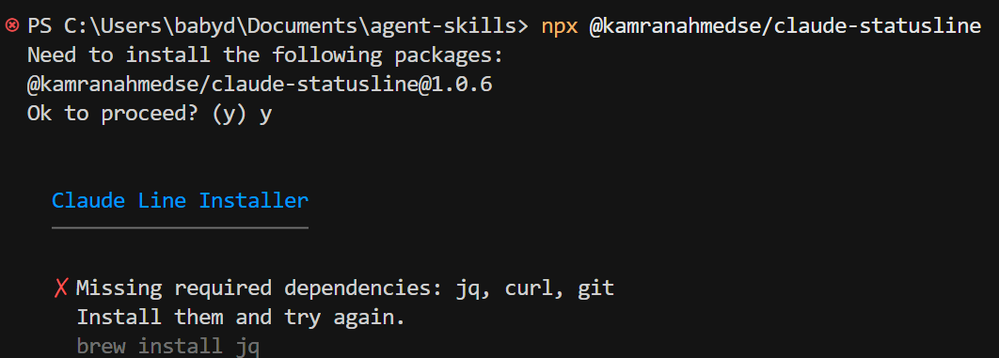

如果安裝失敗，可以請 Claude 協助安裝事宜

```prompt [label="請 Claude 協助環境設定"]
我是 Windows 環境，請幫我安裝 npx @kamranahmedse/claude-statusline
```

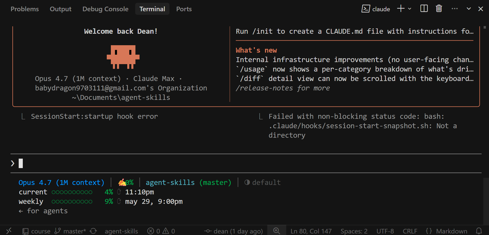

[lab-session title="🛠️  實作練習"]
- 設定 Status Line
[/lab-session]

### 📝 補充說明

#### 不希望 Claude 成為 Commit & PR 合作者

打開 `~/.claude/settings.json`，加上下面的設定

```code [label="加上 attribution"]
{
  "attribution": {
    "commit": "",
    "pr": ""
  }
}
```

#### Python 設定 alias 對應（Mac）

如果電腦環境中有安裝多個 Python 版本，可能會遇到 `python` 與 `python3` 指令執行時版本不同問題。

為了減少意外，建議設定 alias，讓兩個指令指向 `同一個 Python 版本`。

```prompt [label="請 AI 協助設定"]
請幫我將 python 與 python3 透過 alias 設定指向同一個版本
```

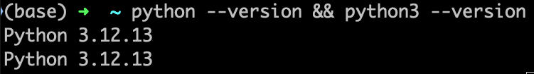

---

# 實戰操作：體驗 AI Agent & Agent Skills 的各項能力

## 下載課程範例

### 🗂️ 課程範例 Repository

[下載或 Fork 練習用 Repository](https://github.com/deancourse/tibame-lesson1) 後，可以跟著課程進度操作

```terminal [label="僅 Clone 課程 main branch Repo"]
git clone git@github.com:deancourse/tibame-lesson1.git
cd tibame-lesson1
```

> **還沒設定 SSH Key？**
> 如果 clone 失敗，代表尚未設定 GitHub SSH 金鑰。
> 請參考 [GitHub 官方教學](https://docs.github.com/en/authentication/connecting-to-github-with-ssh) 完成設定。

### 🤖 可以使用不同的 AI Agent

雖然課程講的是 Claude Code，但 Cursor、Codex、Antigravity 這些`主流工具都支援  Rules / Commands / Skills`。

每個 AI Agent 的路徑稍不同，可以使用 [dotagents](https://github.com/dean9703111/dotagents) 來協助建立 symlinks。

```prompt [label="將 Agent Skills 同步到指定的 AI Agent"]
npx @dean9703111/dotagents
```


[lab-session title="🛠️  實作練習"]
- 下載 [課程範例](https://github.com/deancourse/tibame-lesson1)
- 安裝 dotagents: `npx @dean9703111/dotagents`
[/lab-session]

## 了解 AI Agent 能力範圍

> **如果不確定 AI 能不能搞定**
> 先讓 AI 嘗試看看吧，跟**一個人的薪水相比，Token 還是便宜非常多的**。

### 批量整理圖片檔

現在 AI Agent 已經具備`多模態（Multimodal）`能力，下面用**識別圖片**做為範例。

#### 資料夾拖入終端機，讓 AI 了解讀取範圍

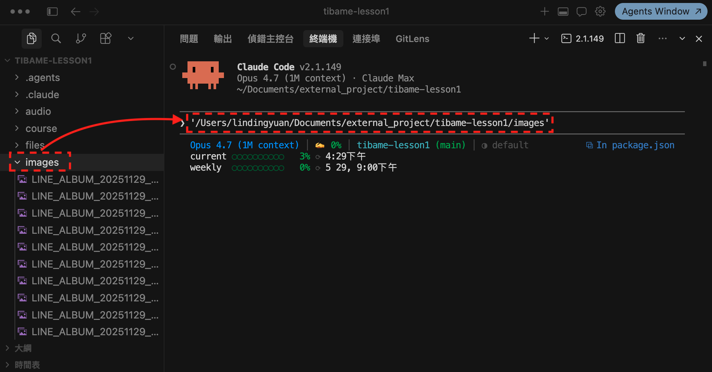

```prompt [label="讓 AI 辨識圖片完成分類"]
辨識圖片、重新命名，並在 images 資料夾下，根據主題建立並分類到對應資料夾
```

#### 確認 AI 可以辨識圖片、完成分類

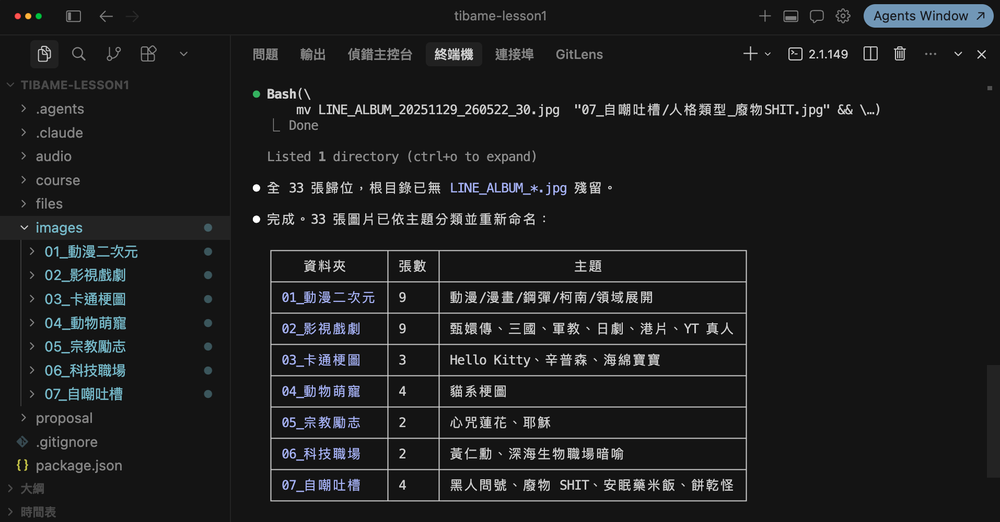

> **AI 未必都用相同方案處理**
> 這次 AI 採用「`mv`」的方案來重新命名，但如果用「`cp`」的方案來複製，原本的檔案就會全部留下來，因為我們有禁止「`rm`」這類的刪除指令。

### 彙整不同格式資訊

儘管 AI 可以讀取不同格式，但目前 `PDF/Word/PPT/Excel` 這類格式還是無法讀取；但如果透過 `Python` 就能夠辦到了。

#### 不同主題建議用新對話窗

如果不同主題還用相同對話窗，會`降低對話品質`，且容易`浪費 Token`。

```prompt [label="開啟新對話窗"]
/clear
```


#### 使用「@」來指定資料夾/檔案

除了可以拖曳資料夾/檔案到終端機外，如果大概知道`名稱`，可以用`@`來`搜尋與指定`。

```prompt [label="@可選擇資料夾/檔案"]
@
```

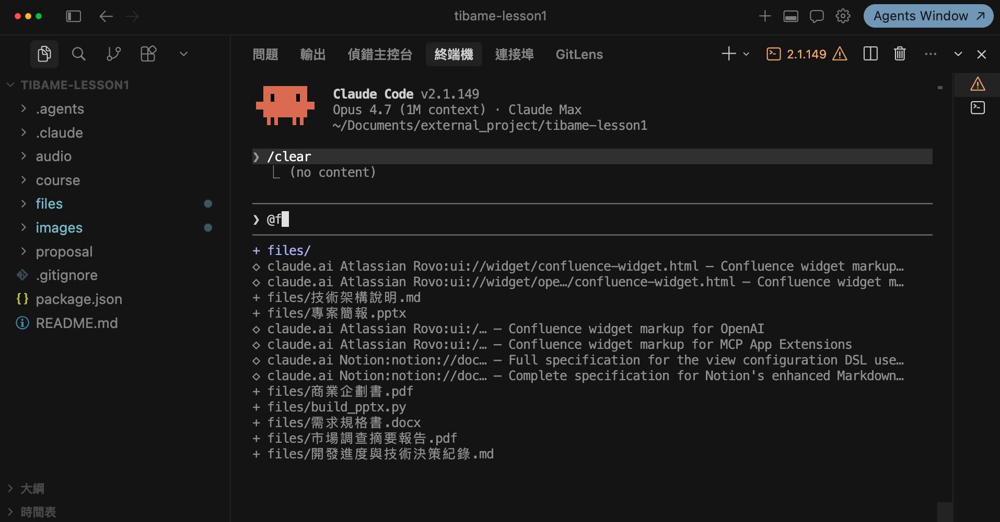

#### 透過 Python 套件彙整資訊

AI Agent 也可以用它`快速檢索、分析、統整資訊`。

但它目前只能檢索「**文字檔**」（Markdown / txt / JavaScript / Python 等），遇到 Word / PPT / PDF `預設無法解析`；不過有了 Python，這一切就變成了可能。

```prompt [label="提取文件內容"]
資料夾有 pdf/ppt/doc 等多種格式的文件，我想請你用 python 套件把所有文件內的「文字」取出來，並確定可以用繁體中文顯示。
並建立一個「doc」的資料夾，用 Markdown 的格式儲存，並整理文字結構，設計合適的大標、中標、小標，方便閱讀。
```

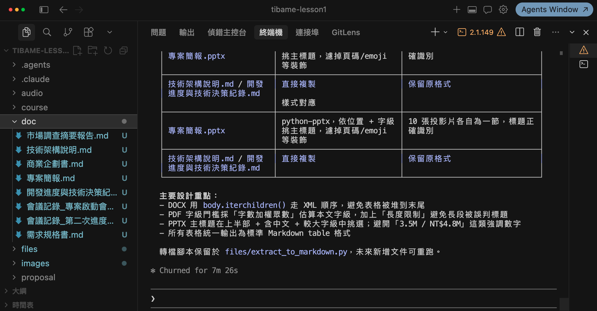

> **AI Agent 會自動設計執行步驟**
> **安裝 Python 套件 → 解析文件 → 建立資料夾並儲存**
> 完成後，「doc」就能看到提取的內容，`省去手動複製貼上的步驟`；NotebookLM 原理也差不多，都是把`不同格式的資源先轉換為文字檔`

#### 提取文件資訊

文字提取完成後，把「doc」資料夾拖到 AI 對話框，讓 AI 知道要處理的範圍，接著讓他彙整資訊

```prompt [label="AI Agent 除了彙整資訊外，也是有 RAG 功能"]
統整出 ShareBox 專案的目標、團隊、時程與預算。
若發生內容不一，請指出來源。
```

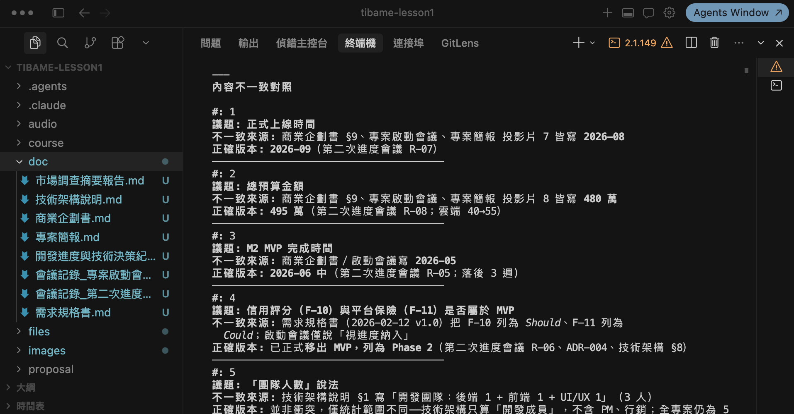

[lab-session title="🛠️  實作練習"]
- 批量整理圖片檔，了解`多模態（Multimodal）`能力
- 彙整不同格式資訊，確認`Python`可以順利被 AI Agent 使用
- 用`/clear`開啟新對話，用`@`指定資料夾/檔案，`選擇幾行`重點閱讀
- 了解如何`限制讀取`範圍，**減少 Token 浪費**並**提升 AI 品質**
[/lab-session]

## 認識 Agent Skills

### 🎒 Skill 的結構

#### 每個 Skill 會存在一個資料夾下方

[html src="./html/skill-anatomy.html"]

### 🔍 Skill 的三個執行階段

[flow]
1. Discovery（發現）：AI 讀取技能名稱與描述，判斷是否與任務相關
2. Activation（啟動）：匹配成功後，才完整讀取整份 Skill 文件
3. Execution（執行）：根據文件描述逐步執行任務
[/flow]

> **Skill 為什麼能節省 Token？**
> Rule 每次都會讀完整文件；Skill 在匹配需求前`只讀標題與描述（Metadata）`。就像 Google 搜尋時先看標題摘要，確認相關再點進去。

## Agent Skills 實戰

> **目標讓 Skill 自動觸發**
> 只要對應的關鍵字有對應到，就能觸發 Skill，這樣我們就不需要去背誦。

### 🎙️ 讀取音訊轉成逐字稿

#### Skill 執行順序

AI 偵測到「音檔 → 字幕」意圖 → 載入 `audio-to-srt` Skill → 依 workflow 執行：

1. 驗證系統有 `uv` 與 `ffmpeg`（`uv` 會自動找 Python ≥ 3.9，缺了才下載）
2. 依平台自動挑 backend：
   - macOS Apple Silicon → `mlx-whisper`
   - Linux/Windows + NVIDIA → `faster-whisper`
   - 其他（CPU-only）→ `openai-whisper`
3. 強制 `UTF-8 stdio`（PYTHONIOENCODING=utf-8 + PYTHONUTF8=1），確保 Windows 中文 console 能正確輸出
4. 跑 `.agents/skills/audio-to-srt/scripts/run.sh audio/audio-example.m4a`，`uv` 第一次會把 backend 套件裝進快取環境
5. `自動分行`（每行 22 字）、`合併間隔 < 0.3 秒`的片段
6. 輸出 SRT 字幕檔到 `<audio_dir>/origin.srt`

```prompt [label="比對到關鍵字更容易觸發 Skill"]
把 audio/audio-example.m4a 轉成 SRT 字幕
```

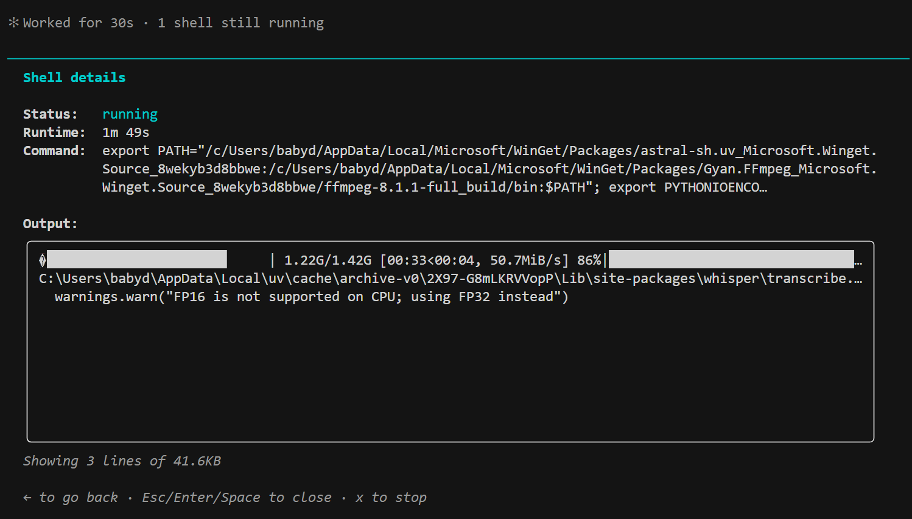


> **此 Skill 可以幫你確認**
> 1. 電腦的 `Python` 是否順利安裝
> 2. 未安裝的套件是否自動安裝（透過 `uv`）
> 3. AI Agent 具備執行 `scripts` 程式的能力

### 📄 輸入主題/草稿生成 HTML 講義

#### Skill 執行順序

AI 載入 `course-page-generator` Skill，依 workflow 執行：

1. **判斷輸入類型**（只有主題？有講稿？有現成資料夾？）
2. 若只有主題，自動展開大綱、決定資料夾名（kebab-case），並掃描 repo 既有慣例（例如本 repo 用 `course/`）
3. 把內容轉成**約定格式的 Markdown**（`content.md`）
4. 讀 `course/config/global.yaml` 注入講者資訊、社群連結、SEO 預設值
5. 跑 build：`node .agents/skills/course-page-generator/scripts/build.mjs course/<目錄>`
6. 產 OG 縮圖：`node .agents/skills/course-page-generator/scripts/generate-og.mjs course/<目錄>`

#### 情境 A：提供主題生成講義

```prompt [label="觸發 Skill 就會使用對應的 Template"]
幫我做一份「Claude Code 從零開始」的課程網頁
```

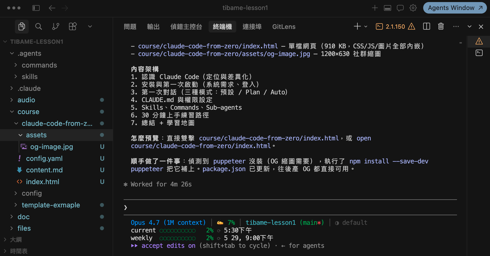


> **此 Skill 可以幫你確認**
> 1. 電腦的 `Node.js` 是否順利安裝
> 2. 未安裝的套件是否自動安裝（透過 `npm`）
> 3. AI Agent 會去參考 `refernce` 的文件與 `scripts` 來生成網頁

#### 情境 B：提供草稿生成講義

```prompt [label="觸發 Skill 就會使用對應的 Template"]
參考 course/template-exmaple/README.md，幫我做成課程網頁
```

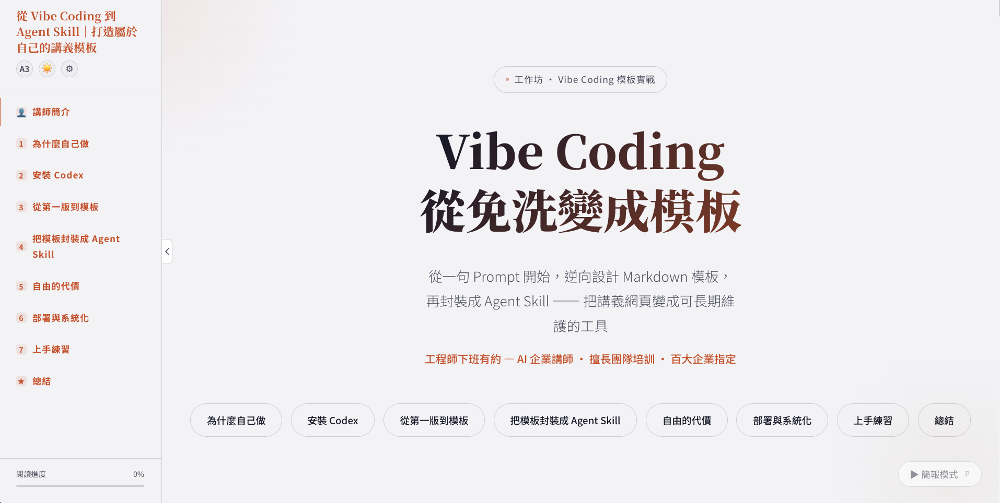

[bonus title="🎁 製作心得"]
這個課程網頁的製作，走過了一段從「結果不可控」到「完全掌控」的歷程。

1. **遇到痛點** — Vibe Coding 出來的網頁，調整內容都要改 HTML，非常不方便
2. **逆推結構** — 讓 AI 把現有網頁拆解，對應成一套可用 Markdown 撰寫的格式
3. **內容與版型分離** — 只需改 Markdown，自動套用對應版型，細節完全可控
4. **設計 Agent Skill** — 不是讓 AI 生成網頁，而是讓 AI 學會「這份 Markdown 怎麼寫」
5. **模板生成器思維** — AI 負責生成結構化內容，程式再把內容轉成最終網頁
[/bonus]

### 📑 提供課綱生成提案 PDF

#### Skill 執行順序

AI 載入 `proposal-writer` Skill，依 workflow 執行：

1. **確定提案資料夾**：`proposal/todo/<客戶名稱>/`（狀態慣例 `todo` / `processing` / `done`）
2. 閱讀使用者課綱，理解主軸、痛點、會教到的工具
3. 套用版型寫 `README.md`，**六大區塊順序固定**：
   - 課程簡介 / 使用工具 / 預計成效 / 適合對象 / 課程目錄 / 課程大綱
4. 讀 `proposal/config.yaml` 取講師介紹與品牌色（不寫在 README，build 時注入 PDF）
5. 跑 `node build-pdf.mjs proposal/todo/<客戶名稱>` 產 PDF

```prompt [label="生成 PDF 格式提案"]
proposal/exmaple.md 把這份課綱寫成提案，客戶是「黑寶科技」
```


> **技術選擇**
> 製作 PDF 這個任務，其實 **Python 跟 Node.js 都可以達成**。
> 就看你想要哪種方案，`世界上沒有最好的選擇，只有是適合當下的選擇`。

[lab-session title="🛠️  實作練習"]
- 讀取音訊轉成逐字稿（SRT）
- 輸入主題/草稿生成 HTML 講義
- 提供課綱生成提案 PDF
[/lab-session]

## 使用 Command 技巧

> **Command 與 Skill 的差別**
> - **Skill**: AI 看到關鍵字`自動`載入
> - **Command**: 使用者`主動`觸發

### 🎯 強制驅動 Skill

Claude 只要輸入`/`就能看到安裝好的 Skills；透過選擇的方式就可以`強制驅動`，而非被動觸發。

```prompt [label="用「/」強制驅動 Skill"]
/srt-enhancer audio/origin.srt
```

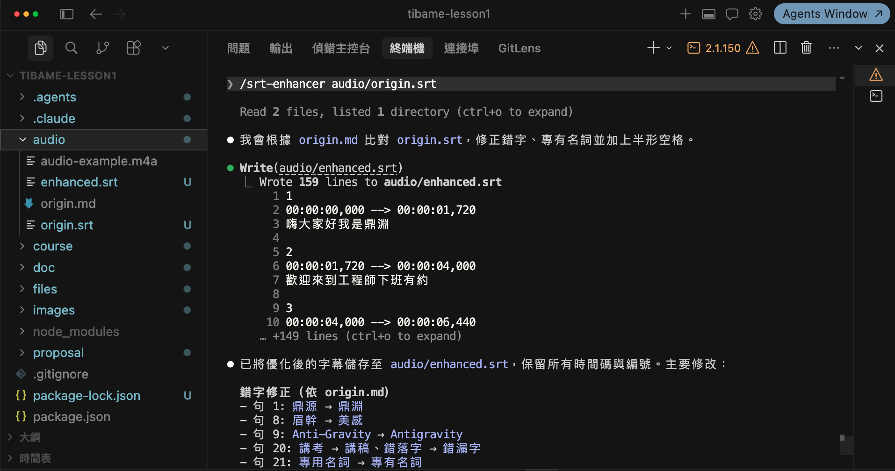

### 🔗 串接多個 Skills

> **執行前請先移除過去檔案**
> 先前透過 Skill 建立了`origin.srt、enhanced.srt`，要做這類整合執行時，請先移除確保環境乾淨。

#### 設計 Command

1. 建議直接指定 Skill 的`名稱(name)`
2. 可以制定明確的`執行步驟`、`判斷依據`

[flow]
1. 轉字幕（audio-to-srt） — 使用`audio-to-srt`的 Skill 將音檔轉成逐字稿
2. 優化字幕（srt-enhancer） — 使用`srt-enhancer`的 Skill 來優化「STEP 1」的逐字稿
3. 設計字卡（srt-card-annotator） — 使用srt-card-annotator`的 Skill，參考「STEP 2」的優化後的逐字稿來生成字卡
4. 影片介紹（srt-social-summary） — 使用`srt-social-summary`的 Skill，參考「STEP 2」的優化後的逐字稿來生成影片介紹
[/flow]

```prompt [label="串接多個 Skills"]
/video-srt-card-des audio/audio-example.m4a
```

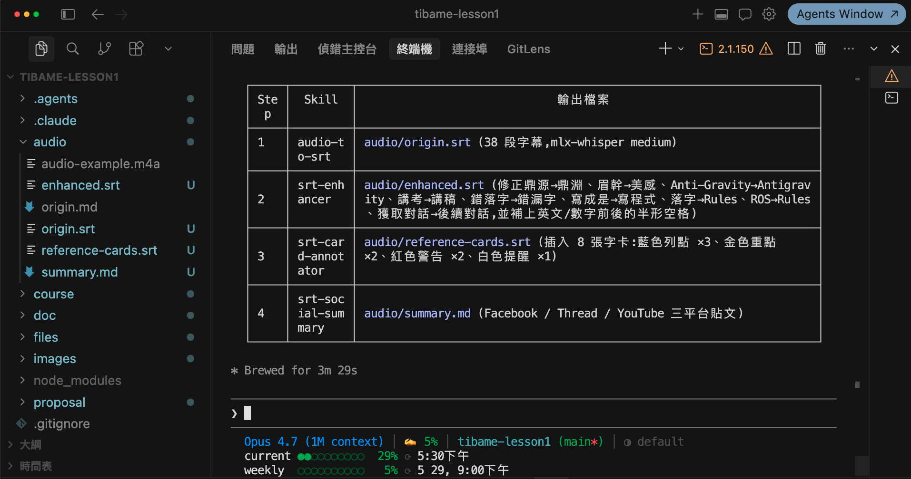

> **設計 Skill 的小技巧**
> 1. 一個 Skill 專心`做好一件事`
> 2. 有點類似寫程式時，`單一責任原則`（Single Responsibility Principle）
> 3. 這樣可讓維護更容易，`減少改 A 壞 B` 的問題

### 🧐 尋找需要的 Skills

#### 使用「/find-skills」搜尋 Skills

這是 [Vercel Labs](https://github.com/vercel-labs/skills) 推出的 meta-skill，能用自然語言搜尋 [skills.sh](https://skills.sh) 上 6,700+ 個 skills 並協助安裝。

**安裝**

```terminal [label="安裝 find-skills"]
npx skills add https://github.com/vercel-labs/skills --skill find-skills
```

> **安裝後重啟 Claude Code**，新 skill 才會被載入。
> 想看目前所有 skills，可以用 `npx skills list`。

**使用**

```prompt [label="搜尋需要的 Skills"]
/find-skills 前端美化
```

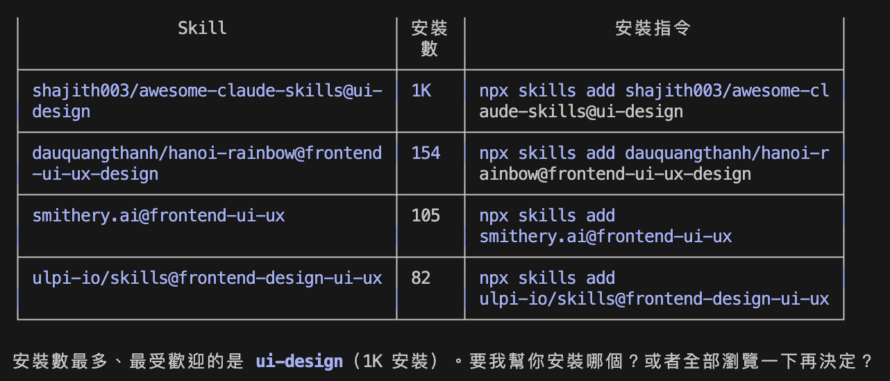

#### 可參考的網路資源

- [SkillAgent Skills Marketplace](https://skillsmp.com/)
- [awesome-claude-skills](https://github.com/ComposioHQ/awesome-claude-skills/)
- [UI UX Pro Max](https://ui-ux-pro-max-skill.nextlevelbuilder.io/)

### ⚠️ 安裝第三方 Skill 前，確認這三點

- **來源可信**：從信任的管道安裝，GitHub 上可參考 Star 數量初步判斷
- **Scripts 安全**：查看 `scripts` 目錄下有沒有危險操作（呼叫外部 URL、修改檔案、存取敏感資料）
- **SKILL.md 內容**：確認是否有敏感指令，例如把 `.env` 傳送到特定網址

### ✅ Skill 使用經驗

#### Skill 不是裝越多，AI 就越強

`同一類型的 Skill 裝了兩個以上，當需求命中時，常常會一起觸發`；這不只會增加 Token 消耗，也容易讓 AI 在執行過程中卡住或走偏。

**在提示詞的世界裡，1 + 1 不一定大於 2，甚至可能小於 1。**

> **同類型的 Skill，建議擇優安裝一個**
> 像前端網頁生成這類需求，如果同時安裝多個相近 Skill，AI 反而要花更多成本判斷該遵循哪一套規則，結果未必更好。

#### 很多 Skill 只是看起來有用

- 有些 Skill 描述看起來很厲害，實際使用時`效果卻不穩定`
- 過多的 Skills 只會`增加上下文負擔`，卻沒有提供足夠的專業價值
- 安裝`跟專案無關的 Skills` 甚至會讓 AI 的行為變得更難預測

# 建立 Skill：根據自身需求建立專屬 Skill

> Skill 的出現，讓 AI 的價值可以持續累積。只要教會一次，他就永遠記得怎麼做。

## 哪些任務值得設計成 Skill?

### ✅ 適合做成 Skill 的情境

- **重複性高**：每週、每個專案都會做（commit message、PR 描述、release notes）
- **流程明確**：步驟可以列出 SOP，不需要每次重新思考
- **產出可驗證**：跑完能立刻看出對錯，有明確的結果

> **不要在 CLAUDE.md 或 rule 寫太多**
> 這兩者都會`佔用到上下文`，而且`觸發不太穩定`；可以評估是否拆成 Skill 更為合適。

### ⚠️ 不建議做成 Skill 的情境

- **一次性任務**：寫過就不會再做，直接對話更省事
- **判斷依賴情境**：每次狀況都不同，硬寫 SOP 反而`限制 AI 發揮`

> Skill 不是越多越好。先判斷任務本質，再決定要不要花時間設計。

## 建立專屬 Skill

### 🛠️ 生成 Skill 初版

#### 安裝 skill-creator

不要從零開始寫 `SKILL.md`，用 [Anthropic 官方](https://github.com/anthropics/skills) 的 `skill-creator` 對話產生骨架，再來微調。

```terminal [label="安裝 skill-creator"]
claude plugin install skill-creator@claude-plugins-official
```

> 安裝後重啟 Claude Code，`/skill-creator` 才會生效。

#### 使用 skill-creator 生成

```prompt [label="呼叫 skill-creator"]
/skill-creator 設計 commit 變更訊息
```

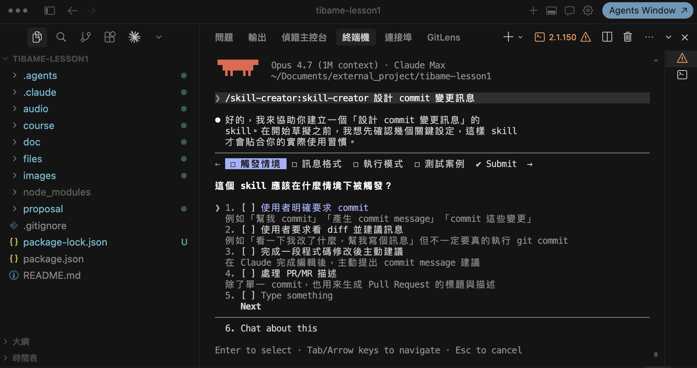

#### 確認 Skill 有順利生成

生成好的 Skill 會存放在 `.agents/skills` 資料夾下

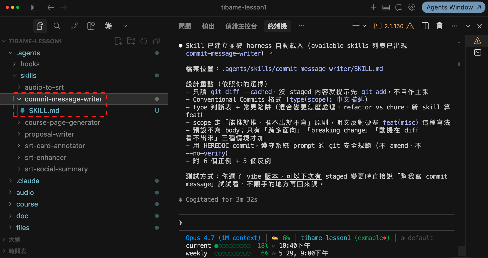

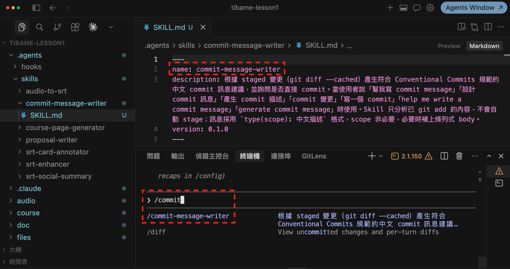

### 🧪 驗證 Skill 符合預期

```prompt [label="觸發 Skill"]
幫我生成 commit
```

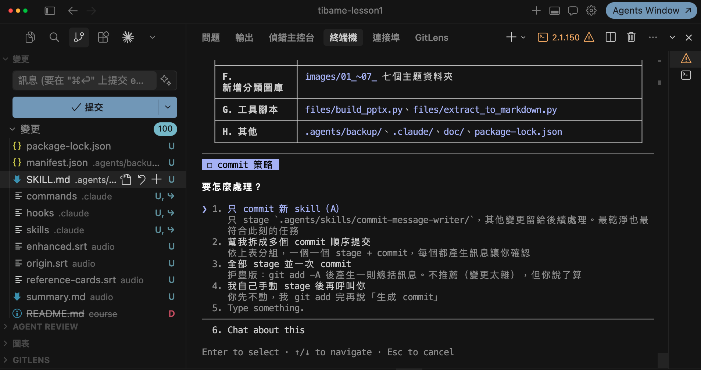

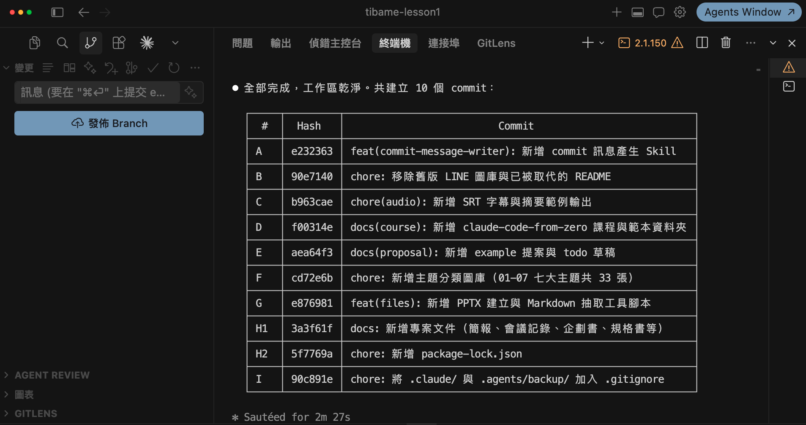

> **Skill 製作心得**
> 建立 Skill `不需要想太多`，前面那些複雜的 Skill，也都是用`模糊指令`或是`簡單範例`開頭的。
> Skill 一開始`不可能完美`，但你**會用到的 Skill 就會在實戰中快速迭代**，至於那些**用不到或少用的沒有更新必要**，但要找時間移除。


### 🔧 優化 Skill 方向

第一版能跑只是起點，依實際使用結果反覆優化：

- **觸發不到** → `description` 加更具體的情境關鍵字
- **觸發過頭** → `description` 收斂，補上邊界說明
- **產出不穩** → 把細節與參考資源挪到 `reference/`，主文聚焦在執行步驟
- **吃太多 token** → 確定性高的邏輯改寫成 `scripts/`，SKILL.md 只負責呼叫

> **Skill 優化方式**
> - **給予具體方向**：可以是參考輸出結果、範例圖片
> - **請他說明如何做到的**：如果是經過多輪對話才得到目標結果，可以讓 AI 分析如何做到
> - **與 AI 討論**：自己想不到，可以跟 AI 討論方向

```prompt [label="討論 Skill 優化方向"]
生成 commit 的 Skill，有哪些優化的方向，目標是更能應對不同情境，並且希望 commit 訊息有固定的規範，讓格式一致
```

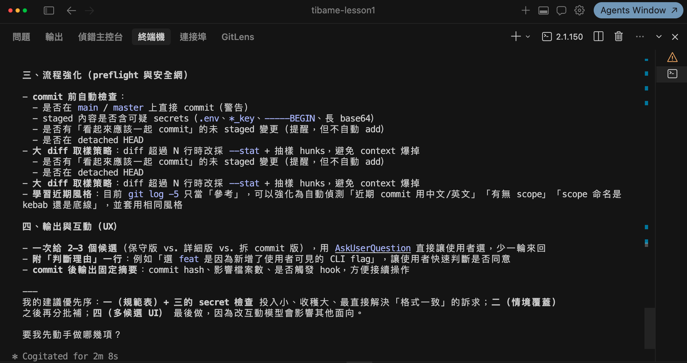

```prompt [label="讓 AI 優化 Skill"]
這些方向都很重要，從 Skill 整體的角度幫我做整體優化
```

> **避免過度設計**
> 有時 AI 會將 Skill 設計的非常完善，但`完善的代價是 Token 消耗更多`，需評估是否有必要性。

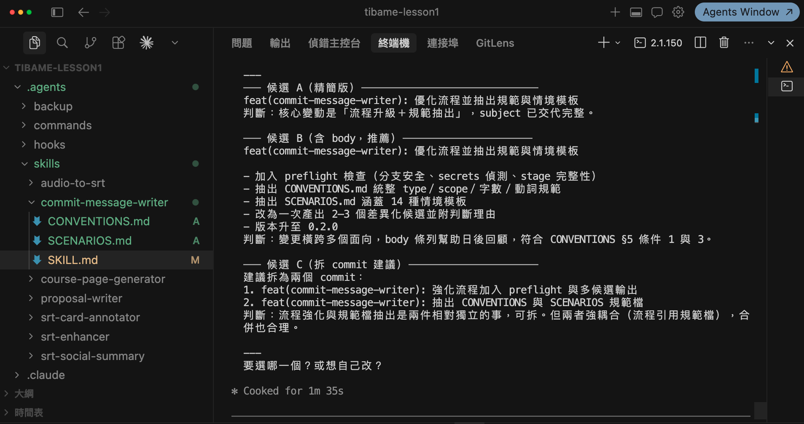

---

# 總結：打造可維護的 AI 工作流

[summary]
- 🧱 **把任務交給 AI Agent** | 不再為了字幕、提案、講義在多個工具間複製貼上，**把工作流收斂到 Claude Code 一個入口**
- 🛡️ **環境與權限先設好** | 禁止危險指令、調整隱私設定、依任務挑對 Mode 與 Model，**讓 AI 走得快也走得穩**
- 🧩 **Skills / Commands 各司其職** | 自動觸發的歸 Skill、手動串接的歸 Command，**選對工具才事半功倍**
- 🛠️ **打造可累積的專屬 Skill** | 用 `skill-creator` 生初版，依「觸發 / 產出 / Token」三方向迭代；**讓 AI 的經驗從一次性對話，變成團隊資產**
[/summary]

### 🚀 回家第一件事：把今天學到的東西「跑起來」

挑一個你實際會用到的場景 — `commit 訊息`、`音檔轉字幕`、`整理筆記`、`回客戶信`⋯⋯任選一個，用 `skill-creator` 做出第一版 Skill。

- **不要追求完善** — 能跑、能省下一次手動操作，就值得提交
- **記得回頭審視** — 觀察 Skill 是否被自動觸發、產出符不符預期、Token 有沒有暴衝
- **把 Skill 留下來** — 下一堂課我們會帶你把這個草版優化成真正能用的工具

### 🔮 下一堂預告：規格驅動開發（SDD）

> 一句話 AI 就能生成有前端、後端、資料庫的系統，但...**你敢直接交付給客戶嗎？**

- 🚨 **不要讓 AI 的「快」，變成未來的「債」** — 沒有規格，今天省下的時間明天會用 bug 還回來
- 📐 用 **OpenSpec** 讓 AI 照規格做事，從 0 到 1 建系統、從 1 到 100 做迭代
- 🔁 設計 **Commit / PR / Worktree** Skill，讓 AI 寫的 code 可追溯、可協作、可 code review
- 🧪 導入測試 + **MCP**，把舊功能守住的同時，連接外部工具讓 Agent 真的能動手

[qa-session title="Q&A 時間"]
[/qa-session]