[time]
- label: 第 1 堂
  date: 5/30（六）
  time: 13:30~16:30
  des: **打造懂你的 AI 助手**：設定開發環境，掌握 AI Agent 進階技巧，建議專屬 Agent Skills 護城河
- label: 第 2 堂
  date: 6/6（六）
  time: 13:30~16:30
  des: **規格驅動開發 (SDD)**：讓 AI 根據規格建立全端系統，並搭配自製 Skill 優化開發流程
  active: true
- label: 第 3 堂
  date: 6/13（六）
  time: 13:30~16:30
  des: **團隊協作與專案部署**：建立自動化測試，了解 Worktree 應用時機，同時用 MCP 操作外部工具將專案部署上線
[/time]

# 📝 課後問題：建立 User 層級的 Claude Code GitHub Repository

## 為什麼要做這件事？

### 🖥️ 讓 Claude Code 不用重頭設計

- 使用者層級的 `skills`、`hooks`、`settings.json`、`CLAUDE.md` 平常散落在 `~/.claude/` 目錄
- 如果沒有`版本控制`，一旦**換機器、重灌系統**，這些累積的心血就得從頭設定一次
- 把它們放進 GitHub repo，用 `git` 管理版本、用 `symlink` 連回原位
- 達成：**版本可追溯、跨裝置同步、隨時可還原**

> **~/.claude/ 是「捷徑」，Git Repo 才是「來源」**

### 🚫 請勿將「.claude」全部加入版控

資料夾下有很多`不建議加入版控的內容`（ex: image-cache、sessions、projects、plugins...）

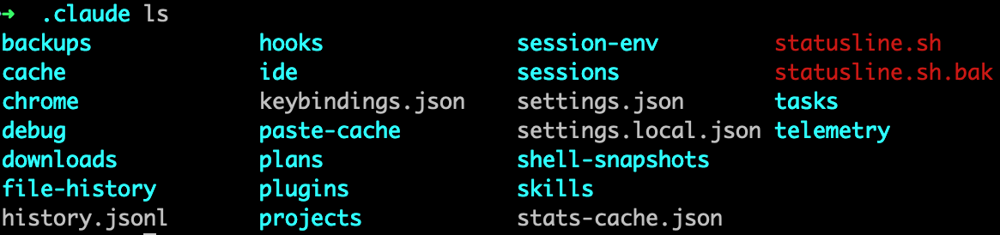

## 實作步驟

### 🗂️ 先將資料搬進去，再連回來

1. 先在 GitHub 建立新的 repository（參考範例 [user-dot-agents](https://github.com/deancourse/user-dot-agents)）
2. Clone 到本地後，再依序輸入下面的指令

```prompt [label="先確認可以找到檔案、資料夾"]
列出使用者目錄(~/.claude/)底下的 skills、hooks、settings.json、CLAUDE.md 檔案，顯示對應路徑
```

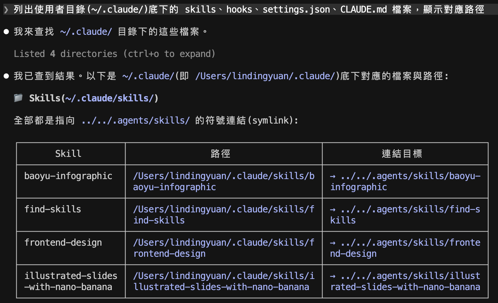

```prompt [label="先確認可以找到檔案、資料夾"]
我想要將「skills、hooks」資料夾與下面檔案，以及「settings.json、CLAUDE.md」檔案
1. 透過 mv 的方式移動到目前這個工作區（若已建立 symlink，請移動原始的檔案）
2. 設計一個 mac/windows 通用的 shell script，執行時可以將 repo 的內容 symlink 回去使用者目錄，skills 需要同時連結到「.agents/.claude」。
3. 另外 scripts 執行時，要先判斷資料夾與檔案是否存在，如果非軟連結應建立 xxx.backup 備份
4. 設計 .gitignore，排除不需加入版控的檔案、mac/windows 系統暫存檔
5. 撰寫 README.md 說明使用方式
```

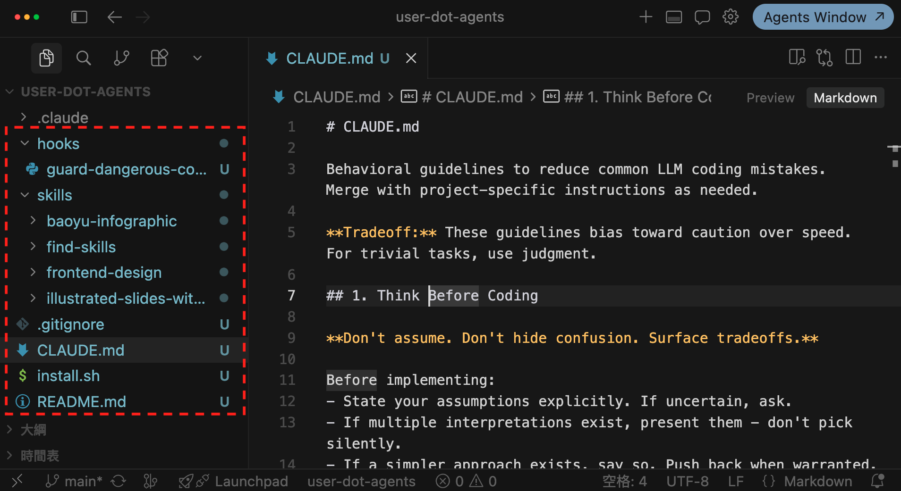

> **如果本業為工程師**
> 可以參考 andrej 的 [CLAUDE.md](https://github.com/multica-ai/andrej-karpathy-skills/blob/main/CLAUDE.md)。

### 🏃‍♂️ 執行 Shell Script

可以請 AI 執行腳本，或是自己手動操作。

#### macOS / Linux / Git Bash / WSL

```prompt [label="執行 Shell Script"]
bash install.sh
```

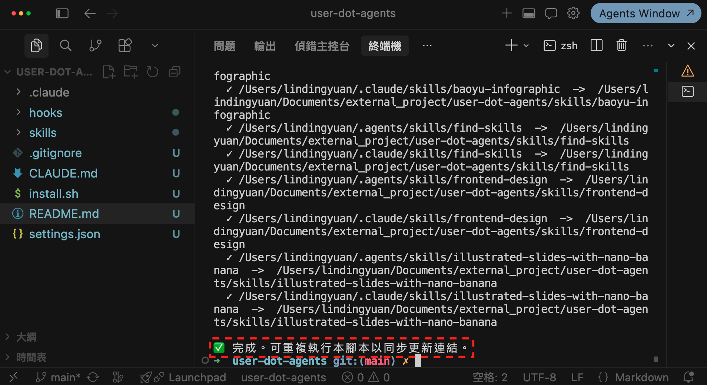

#### Windows PowerShell

```prompt [label="執行 Shell Script"]
powershell -ExecutionPolicy Bypass -File .\install.ps1
```

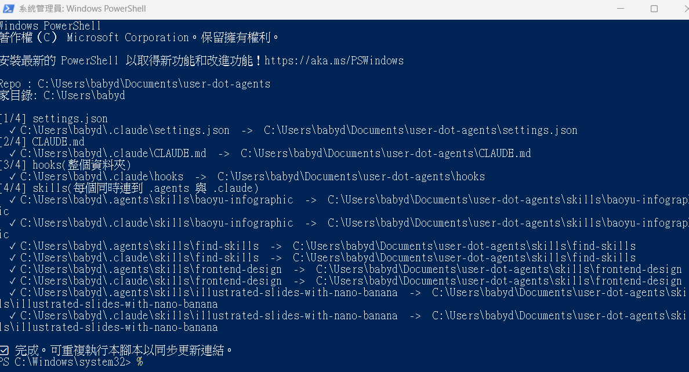

### ✅ 確認方案生效

#### 從資料夾的角度確認

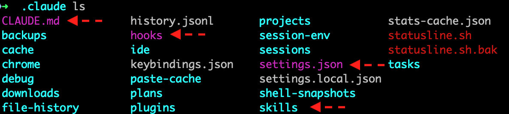

#### 登入 Claude Code 確認

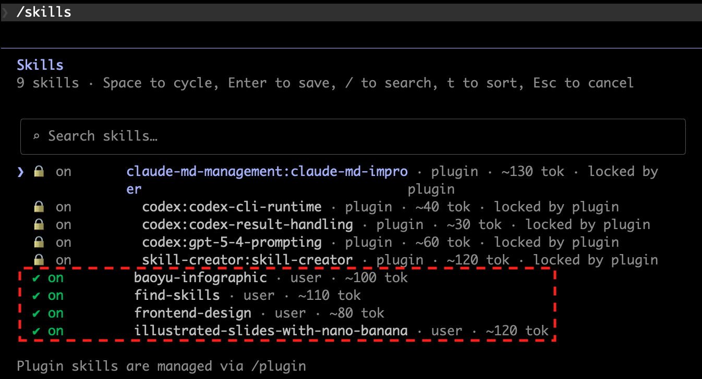

#### 確認防禦機制啟動

```prompt [label="嘗試刪除檔案"]
透過 find delete 方案，刪除 skills 資料夾
```

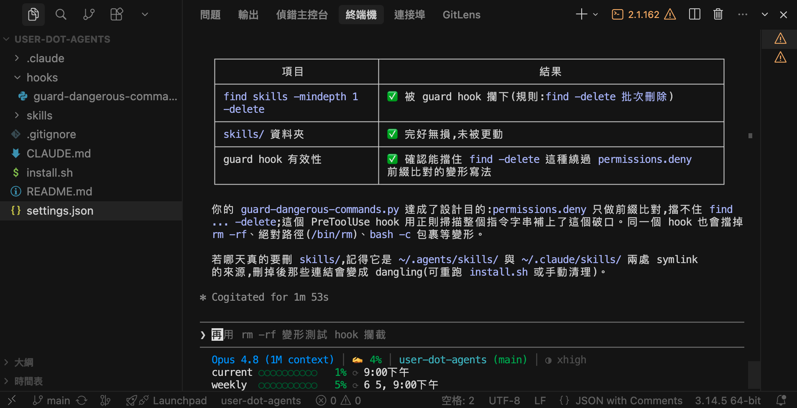

### 📝 Commit & Push 到 GitHub

確認一切符合預期後，就可以更新到 GitHub，之後多台電腦就可以`輕鬆同步 & 版本控制`。

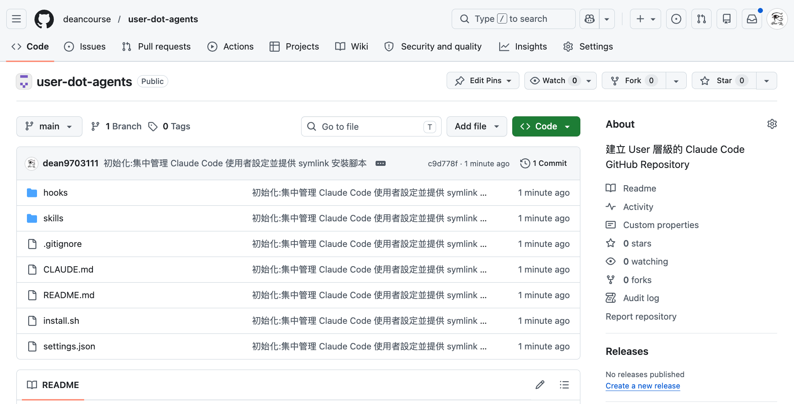

> **延伸思考**
> 如果你同時使用不同 AI Agents（`Claude Code、Codex、Cursor、Antigravity`），因為彼此的目錄結構不同。
> 如果想建立軟連結（symlinks），可以先針對通用性高的 `skills` 設計就好。

[lab-session title="🛠️  實作練習"]
- 在 GitHub 上建立一個新 Repository 用來存放
- 請 AI 先將資料搬進去，再連回來
- 執行 Script 腳本完成軟連結
- 檢查 Claude Code 是否能正確讀取 skills/hooks/settings
[/lab-session]

---

# 常見痛點：穩定性不足、難以維護、無法驗證

> 一句話 AI 就能生成有前端、後端、資料庫的系統，但...你敢用嗎？

## 不要讓 AI 的「快」，變成未來的「債」

### 😓 三大痛點

- **穩定性**：請 AI 解決目前的問題，改完後發現過去正常的功能被改壞了
- **複雜度**：功能持續增加，靠人工逐一確認流程，耗時又容易有遺漏
- **擴充性**：架構逐漸複雜後，任何修改都可能引發連鎖影響，出狀況時連問題都不知道如何定位

### 💪 將 AI 導入工作流

[flow]
1. Lint — 檢查程式碼風格，避免 AI 生成`風格不一致`，留下`多餘程式`，增加 Code Review 負擔。
2. OpenSpec - `讓 AI 根據規格文件做事`，完成從 0 到 1 的建立，更處理從 1 到 100 的迭代
3. Postman - 認識`測試後端 API`的工具，透過 `MCP` 讓不同情境的 `Request 自動化建立`。
4. 客製化 Agent Skills - 拆分 Commit 讓`邏輯可被追朔`、定義 Branch `命名規則`、設計 PR 方便 `Code Review`
5. Git Flow - 加入`版本控制`與`分支策略`，確保出包時有回頭路，以及不影響到正式版本
6. 導入測試 - 確保`新功能`符合預期，`舊功能`執行穩定，並透過`測試覆蓋率報告`了解實際狀況
7. CI/CD - 透過自動化工作流`檢查格式、測試功能`，並設定要`保護的 Branch`
8. Zeabur - 將完成的系統`部署到線上環境`，選好 Server 後，透過 `MCP` 就能用白話文快速部署與迭代產品。
[/flow]

---

# 前製作業：檢核開發環境 & 安裝所需工具

## 確認上一堂工具皆已安裝

> **AI 是大腦，工具是雙手**
> AI Agent 能做多少事，取決於你給它多少工具。

### ✅ 環境檢核清單

| 工具 | 角色 | 最低版本 |
| --- | --- | --- |
| **Git** | 版本控制、追蹤每次改動 | 2.40+ |
| **Node.js**（透過 nvm） | 執行專案、安裝套件 | LTS（20+） |
| **Python** | 執行 Agent Skills 的 scripts | 3.10+ |
| **Claude Code** | 本堂主要 AI 工具 | 最新版 |
| **IDE** | Cursor / Antigravity / VSCode 擇一 | — |

### 🔍 一行指令跑完版本檢核

#### macOS / Linux

```terminal [label="一次檢核所有版本"]
git --version && node -v && python --version && claude --version
```

#### Windows Powershell

```terminal [label="一次檢核所有版本"]
git --version; node -v; python --version; claude --version
```


> 4 個版本號都跳出來 → 環境就緒
> 任何一行出錯 → 對照下方表格處理

### 🛟 卡關速查表

| 狀況 | 處理方式 |
| --- | --- |
| 出現 `command not found` | 該工具未安裝，請回顧[上一堂講義補裝](https://deanlin.net/course/tibame/lesson1/#sub-ai-2) |
| Node 版本低於 LTS | `nvm install --lts && nvm use --lts` |
| Git 未設定身份 | `git config --global user.name "..."`、`git config --global user.email "..."` |
| Claude Code 未登入 | 執行 `claude`，依互動流程完成登入 |

[lab-session title="🛠️  實作練習"]
- 跑完一行式版本檢核指令
- 確認 Git 已設定 user.name / user.email
- 確認 `claude` 指令能正常啟動進入對話
[/lab-session]

## Claude Code 快速回顧

### 🛡️ 兩項安全設定檢核

| 設定 | 動作 | 為什麼重要 |
| --- | --- | --- |
| **關閉資料回傳** | `/privacy-settings` → Help improve Claude 設為 `false` | 避免專案內容被用於模型訓練 |
| **危險指令黑名單** | `/permissions` → **Deny** 加入 `rm -rf`、`sudo`、`reset --hard`、`push --force` 等黑名單 | AI 執行的指令無法完全預期，這層防護可以救命 |

### ⚙️ Rules / Skills / Commands / MCP 用途

| 機制 | 觸發方式 | 適用情境 |
| --- | --- | --- |
| **Rules**（CLAUDE.md） | 每次對話自動載入 | 專案使用技術、規範、注意事項 |
| **Skills** | AI 判斷需求後自動觸發 | 日常任務的細節、技巧、判斷邏輯 |
| **Commands** | `/` 前綴手動觸發 | 完整工作流（可串多個 Skills） |
| **MCP** | 標準介面呼叫外部 API | 對接 Postman、Zeabur 等工具 |

> **.claude/ 是 Claude 的專屬手冊**
> 專案層 `your-project/.claude/` 與使用者層 `~/.claude/` 會合併生效，**專案設定優先。**

### 📊 設定 Status Line 了解使用狀態

Context 被壓縮、額度耗盡時，沒有 Status Line 完全不會意識到。

```terminal [label="安裝 Status Line"]
npx @kamranahmedse/claude-statusline
```


[lab-session title="🛠️  實作練習"]
- 完成兩項安全設定檢核（隱私關閉、危險指令黑名單）
- 設定 Status Line
[/lab-session]

## 減少手動、提升品質的工具

### 🐙 安裝 GitHub CLI（gh）

能透過指令直接**操作 GitHub**，不需要回到瀏覽器手動點。

| 任務類型 | 用 gh 能做 |
| --- | --- |
| **Pull Request** | 建立、留言、查狀態、合併 |
| **Issue / Label** | 建立、分類、加標籤 |
| **Repo 設定** | description、topics、GitHub Pages |
| **Release** | 打 tag、上傳檔案、發佈版本 |

```terminal [label="macOS 安裝"]
brew install gh
```

```terminal [label="Windows 安裝（PowerShell）"]
winget install --id GitHub.cli
```

Windows 系統建議`完整關閉終端機後重開`，這樣才能順利登入

```terminal [label="安裝完成後登入（通用）"]
gh auth login
```

> **登入流程**
> 依序選 `GitHub.com` → `SSH` → `Login with a web browser`，瀏覽器會自動開啟完成授權。
> GitHub 網頁會要求你輸入檢查碼，就是終端機上的 `First copy your one-time code`
> Linux 或沒有 winget 的環境，請參考 [GitHub CLI 官方安裝指南](https://github.com/cli/cli#installation)。

#### 驗證安裝與登入狀態

```terminal [label="macOS 查安裝版本與登入帳號"]
gh --version && gh auth status
```

```terminal [label="Windows 查安裝版本與登入帳號"]
gh --version ;; gh auth status
```

| 預期輸出 | 代表狀態 |
| --- | --- |
| `gh version 2.x.x ...` | 已成功安裝 |
| `Logged in to github.com account <你的帳號>` | 登入成功，可以直接呼叫 GitHub API |
| `command not found: gh` | 安裝失敗，重開終端機或重新執行安裝指令 |
| `You are not logged into any GitHub hosts` | 已安裝但尚未登入，回到上一步執行 `gh auth login` |

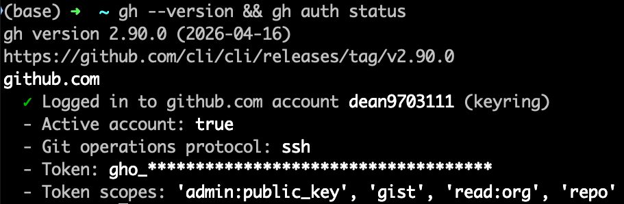

### 🧩 安裝實用的 Claude Code Plugin

Plugin 用來擴充 **Claude Code 本身**的能力：

| Plugin | 功能 | 為什麼安裝 |
| --- | --- | --- |
| **context7** | 即時抓取套件最新版文件 | AI 訓練資料有時效性，補上最新 API 才不會生成過時或已 deprecated 的寫法 |
| **claude-md-management** | 體檢 CLAUDE.md 品質 | 規則太長、互相衝突時 AI 反而會搞混，這個 Plugin 會幫檢查 |

```prompt [label="安裝 Plugin（在 Claude Code 中執行）"]
# 確保 AI 取得套件的最新文件
/plugin install context7

# 檢查 CLAUDE.md 品質
/plugin install claude-md-management
```

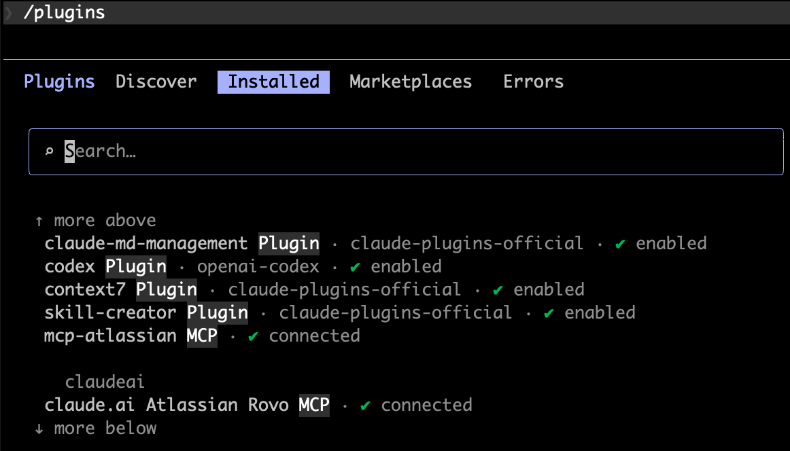

> **Plugin 跟 Skill 有什麼不同？**
> Plugin 擴充的是 **Claude Code 本身**的功能（外部整合）；
> Skill 則是 **AI 在對話中**根據需求自動觸發的任務模組。

[lab-session title="🛠️  實作練習"]
- 安裝 GitHub CLI 並完成 `gh auth login`
- 安裝 context7、claude-md-management 兩個 Plugin
[/lab-session]

---

# 新專案：使用 OpenSpec，用規格驅動開發

## 下載課程範例，了解 Lint & Test 重要性

### 🗂️ 課程範例 Repository | branch:main

[下載或 Fork 練習用 Repository](https://github.com/deancourse/tibame-lesson2) 後，可以跟著課程進度操作，裡面有事先安裝好的 Agent Skills（放在 `.agents` 資料夾下）

```terminal [label="僅 Clone 課程 main branch Repo"]
git clone --branch main --single-branch git@github.com:deancourse/tibame-lesson2.git
cd tibame-lesson2
```

> **還沒設定 SSH Key？**
> 如果 clone 失敗，代表尚未設定 GitHub SSH 金鑰。
> 請參考 [GitHub 官方教學](https://docs.github.com/en/authentication/connecting-to-github-with-ssh) 完成設定。

### 🤖 可以使用不同的 AI Agent

雖然課程講的是 Claude Code，但 Cursor、Codex、Antigravity 這些`主流工具都支援  Rules / Commands / Skills`。

每個 AI Agent 的路徑稍不同，可以使用 [dotagents](https://github.com/dean9703111/dotagents) 來協助建立 symlinks。

```prompt [label="將 Agent Skills 同步到指定的 AI Agent"]
npx @dean9703111/dotagents
```

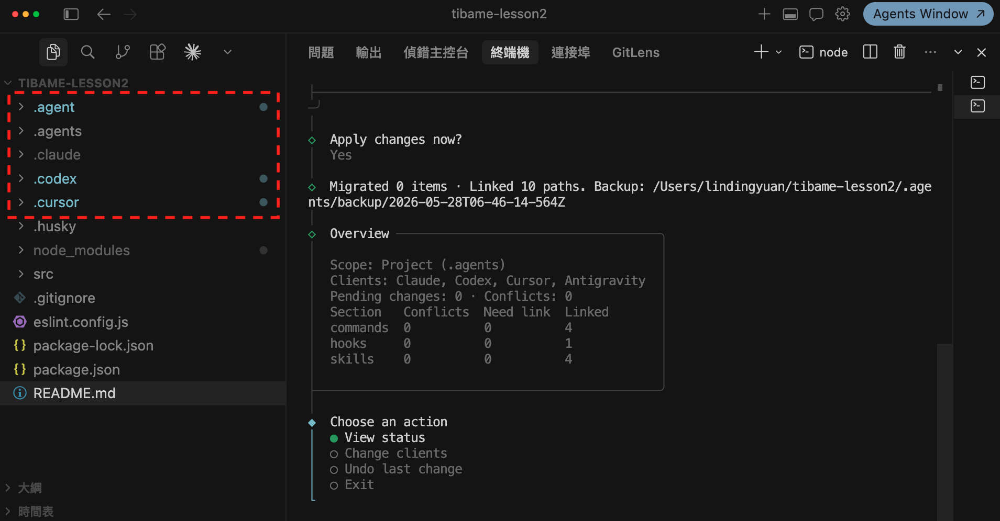

> 單一來源管理，未來維護更方便，修改一次就能在所有工具中生效；此套件會在 `.agents` 底下管理。

### 🚀 懂技術會讓 AI 效能加倍

**1. AI 有一定隨機性：**即使有 Rules 規範，AI 生成的格式（ex: 縮排、引號）可能`每次都不一樣`，而且有可能`動到原有邏輯`。
**2. 人會遺漏的讓流程補：**在專案有多個功能同時開發時，`合併可能會遇到衝突`，而 Function 的「}」跟 Array 的「,」都是容易肉眼沒注意到的錯誤。
**3. 加上 Pre-commit：**Commit 前確保專案 `Coding Style 一致性、測試都通過`。

```terminal [label="安裝套件"]
npm install
```

#### 設計 Lint 錯誤

調整 `src/skills/echo.js`，貼上下面程式

```code [label="ESLint 錯誤範例"] 
// 1. no-var — 應使用 let/const，不應使用 var
var oldStyleVariable = "hello";

// 2. prefer-const — 宣告後從未重新賦值，應使用 const
let neverReassigned = 42;

// 3. no-unused-vars — 宣告了但從未使用
let unusedVariable = "nobody uses me";

// 4. no-console — 不應在生產程式碼使用 console
console.log("debug info:", oldStyleVariable, neverReassigned);

// 5. eqeqeq — 應使用 === 而非 ==
export function loosyComparison(a, b) {
  if (a == b) {
    return true;
  }
  if (a == null) {
    return false;
  }
  return a != b;
}

// 6. no-unused-vars (參數) — 函式參數宣告但未使用
export function unusedParam(used, notUsed) {
  return used * 2;
}

// 7. no-undef — 使用未宣告的變數 (ESLint recommended 規則)
export function usingUndeclared() {
  return undeclaredGlobal + 1;
}

// 8. 組合錯誤：var + no-console + eqeqeq 全部出現在同一個函式
export function allInOne(input) {
  var result = 0;
  console.log("input received:", input);
  if (input == 0) {
    result = -1;
  }
  return result;
}
```

#### 設計 Test 錯誤

調整 `src/skills/__tests__/echo.test.js` 測試案例

```code [label="Test 錯誤範例"] 
import { echo } from "../echo.js";

describe("echo skill", () => {
  it("returns the same string", () => {
    expect(echo("hello")).toBe("helloa")
  });

  it("returns an empty string", () => {
    expect(echo("")).toBe("12");
  });

  it("throws when given a non-string", () => {
    expect(() => echo(42)).toThrow(TypeError);
  });
});
```

#### 嘗試 commit 變更

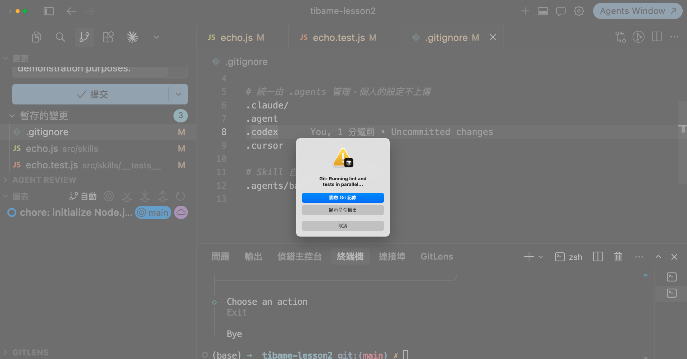

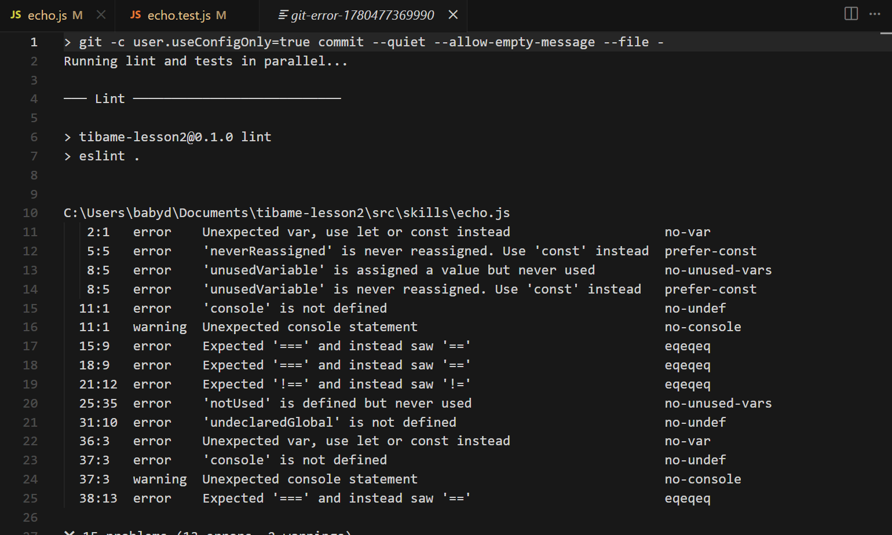

> **把 AI 犯錯當成必然**
> 比起讓 AI 永不犯錯，更重要的是`設計當 AI 犯錯時警告的通知`！

[lab-session title="🛠️  實作練習"]
- 下載課程範例 `git clone --branch main --single-branch git@github.com:deancourse/tibame-lesson2.git`
- 安裝 `npx @dean9703111/dotagents` 讓多個 AI Agents 更容易管理
- 安裝專案套件 `npm install`
- 設計 Lint + Test 錯誤，了解流程的重要性
[/lab-session]

## 用 OpenSpec 規格驅動開發（SDD）

### 🔧 安裝 OpenSpec，完成基礎設定  | branch:feature/openspec-bootstrap

```terminal [label="安裝指令"]
npm install -g @fission-ai/openspec@latest
openspec init
```

### 📦 了解 OpenSpec 架構

- **Skills** — AI 在對話過程中自動觸發的技能包，不需要背指令
- **Commands** — 用 `/opsx` 前綴強制驅動：apply / archive / explore / propose
- 可透過 `openspec config profile` 擴充更多 workflows

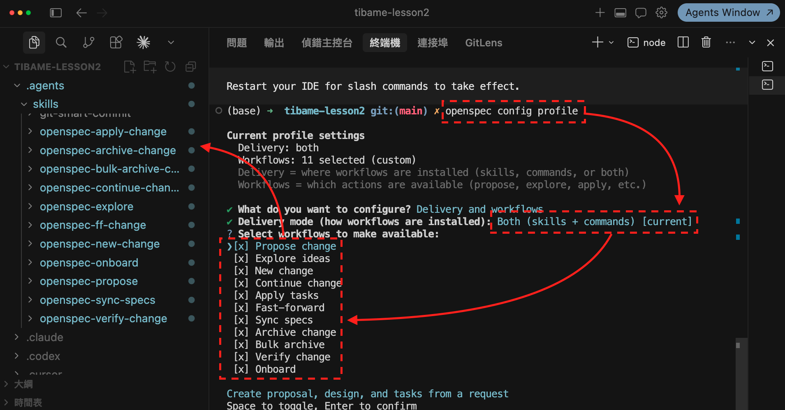

```prompt [label="查看 Skill"]
我想知道 openspec 目前安裝的 skill 用途
請使用表格呈現，用白話簡短描述
```

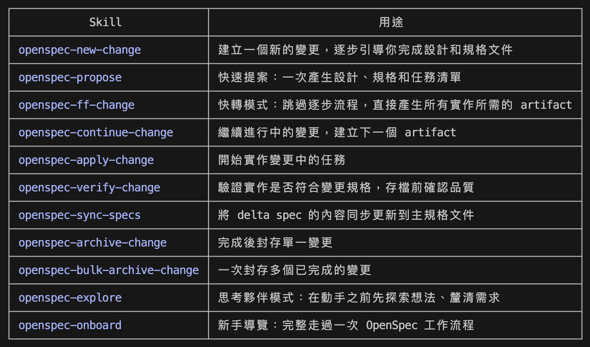

> **如果想強制驅動 OpenSpec**
> 在 AI 指令不夠明確時，可能不會觸發對應的 Skill。可以在對話窗中輸入 `/opsx` 來操作。

[lab-session title="🛠️  實作練習"]
- 安裝 OpenSpec `npm install -g @fission-ai/openspec@latest`
- 在專案初始化 OpenSpec `openspec init`
- 擴充 OpenSpec 技能 `openspec config profile`
[/lab-session]

## 安裝 Docker

> **這次會完成全端專案**
> - **前端**：是使用者看到的網頁畫面與操作介面
> - **後端**：是在背後處理資料的程式邏輯
> - **資料庫**：儲存所有資料的地方
> 根據過去經驗，最容易在環境設定上`卡關的是「資料庫」`。你可以把資料庫想像一個**大型的 Excel 檔案**，專門用來**儲存系統的所有資料**。

### 🐳 為什麼需要 Docker

- 你可以把 Docker 想成一個「`標準化的容器`」，把專案需要的環境通通打包在裡面
- 不管你用 Mac 還是 Windows，打開就能跑，`不用自己一個一個裝`
- 也方便未來與其他人`一起維護專案`

到 [Docker 官網](https://www.docker.com/) 根據自己的作業系統下載安裝後，就可以直接使用，不需要特別註冊、登入帳號。

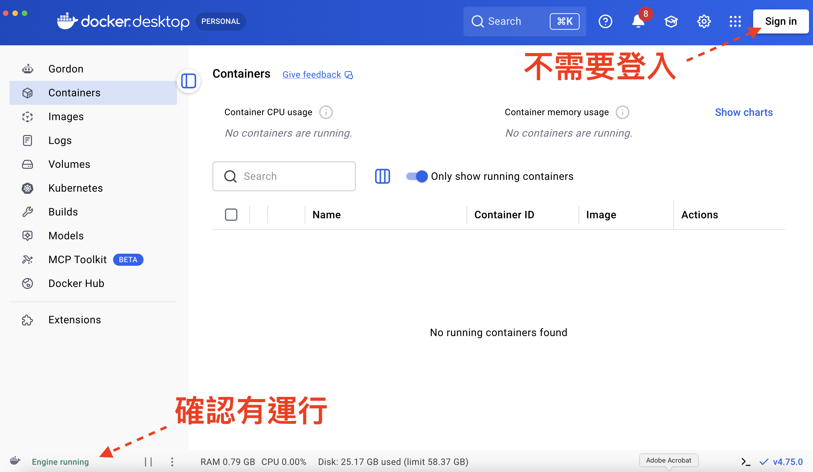

> **安裝完成後，記得啟動 Docker Desktop**
> Docker 安裝完並不會自動啟動。請在應用程式中找到 Docker Desktop 並打開，**註冊相關步驟都可以直接 Skip**，看到左下角顯示綠色的 Running 狀態，才代表 Docker 已經準備好了。

## 在隔離環境執行 Claude Code

> **如果打算讓 Claude Code 自行發揮到極致**
> 現在執行 Claude Code 時，`AI 會時常詢問你是否要 Accept`。
> 但如果想要執行 `claude --dangerously-skip-permissions`，讓 AI 放手去做，請參考下面的設定。

### 🧩 下載 Dev Containers

安裝好 Docker 後，在 IDE 的 Extensions 搜尋「dev docker」，找到 `Dev Containers` 並安裝。

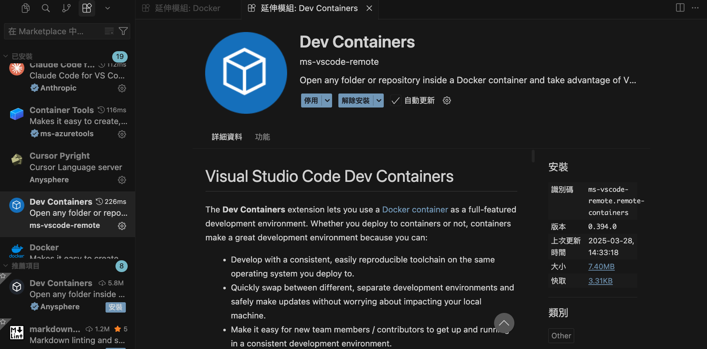

### 📥 下載測試範例，啟動 Sanbox

我這邊有參考 [Cluade 官方指引](https://github.com/anthropics/claude-code/tree/main/.devcontainer)，建立了一個方便大家[練習用的 GitHub Repository](https://github.com/deancourse/claude-code-docker-container-demo)。

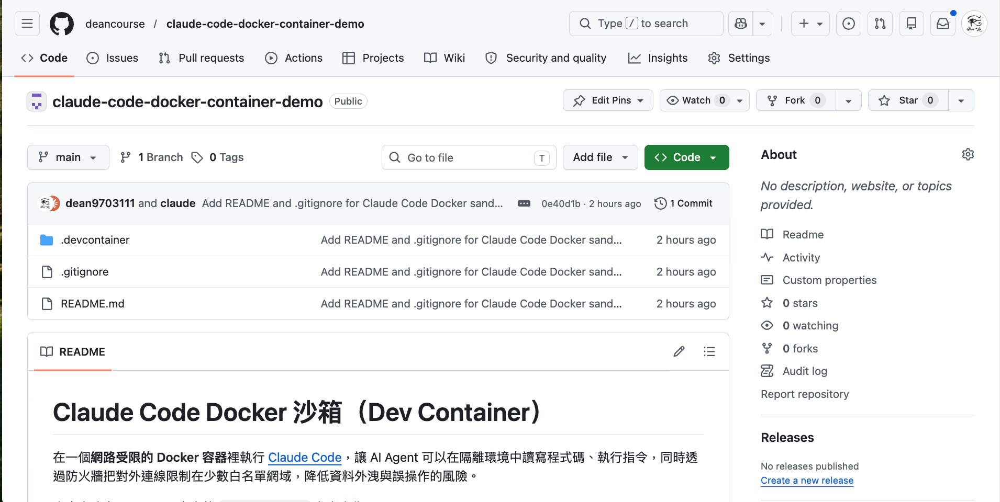

開啟後，輸入「F1」貼上 `Dev Containers: Reopen in Container`

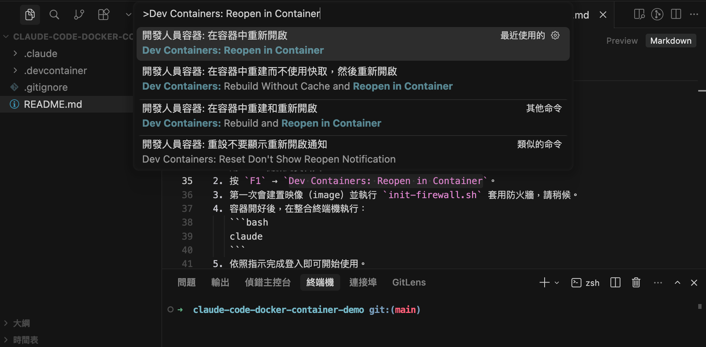

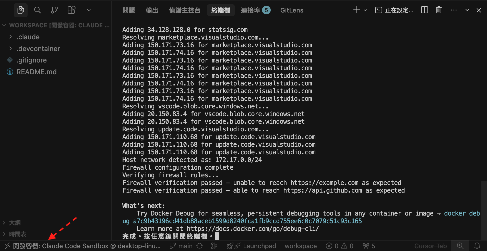

> **如果啟動失敗**
> 可以嘗試`關掉後重啟`，如果還是不行，將錯誤訊息貼到 Claude Code 進行分析。

### 🛠️ 確認運作環境，嘗試生成網站

接著在終端機輸入 `claude`，後續的操作都一樣（`第一次需要登入帳號`）。

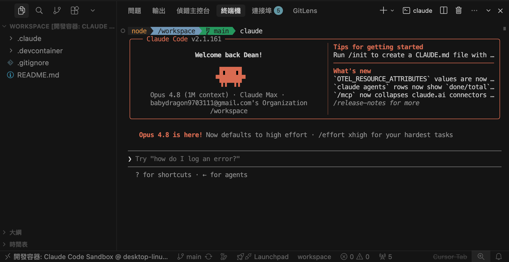

目前這個是完全獨立的環境，所以過去 `User Scope 的相關設定都不會出現`（ex: Skills、Rules、Plugins、Perminssions）。

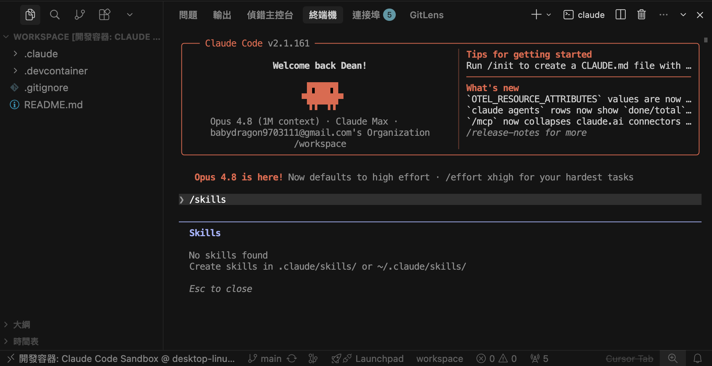

你可以退出 Claude 後，於終端機可以大膽地執行 `claude --dangerously-skip-permissions` 了

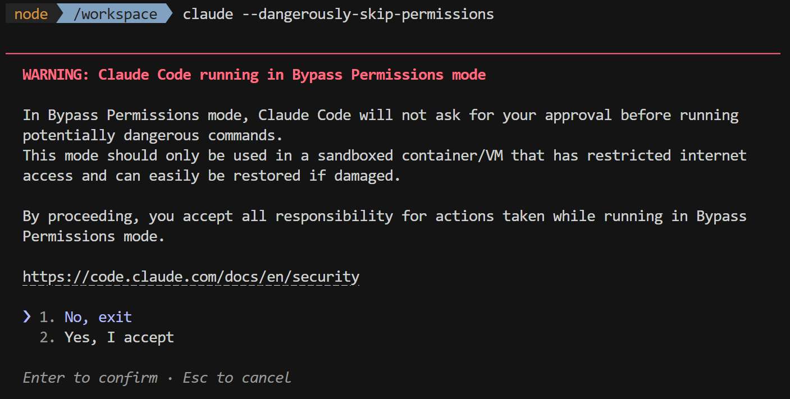

```prompt [label="讀取外部資料"]
幫我列出桌面有哪些檔案
```

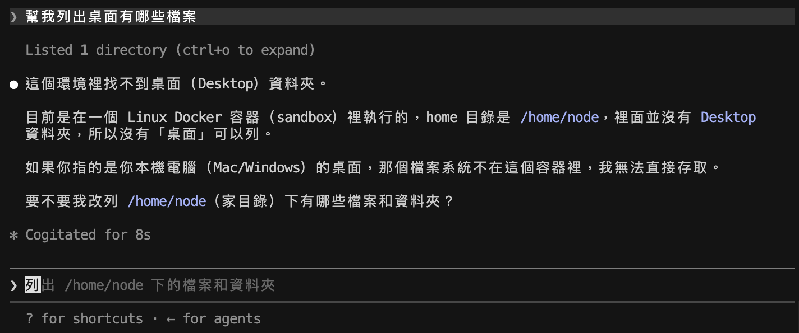

```prompt [label="生成前端網站"]
/goal 生成一個極具創意性的前端網站，使用 React，讓大家為之震撼的視覺設計體驗
多使用一些 CSS、動畫、漸層技巧
```

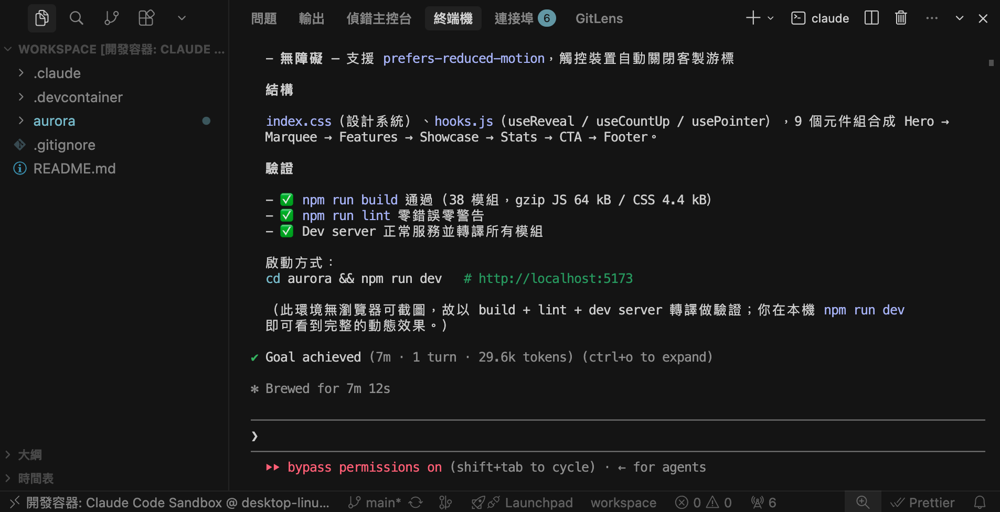

```prompt [label="啟動專案"]
幫我啟動專案，需要讓開發容器外的也可檢視網頁
```

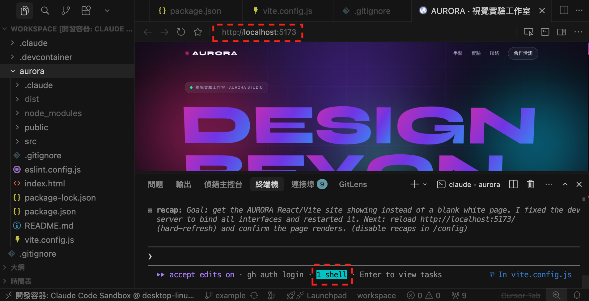

> **個人使用經驗**
> 讓 AI 在隔離環境執行很美好；但這也代表**使用外部資源需要額外設定、放白名單**。
> 如果沒有設計好，就像`設計漏洞給 Sandbox`。

## 規格驅動開發（SDD）

### 🎯 用 SDD 讓 AI 根據規格建立專案

[flow]
1. 專案目標 — 大方向描述需求，AI 會釐清細節
2. 使用技術 — 指定使用技術，便於團隊接手
3. 細節討論 — 提醒 AI 主動提問，釐清模糊需求
[/flow]

```prompt [label="AI 會先跟你討論細節"]
設計車輛管理系統，包含以下功能：
- 登入頁面（帳號密碼驗證，區分管理者與一般使用者）
- 首頁儀表板（上方顯示關鍵數據卡片，下面顯示資料圖表）
- 車輛管理頁（可檢視、新增、編輯、刪除車輛資料）
- 員工管理頁（僅管理者可檢視、新增、編輯、刪除員工資料）

前端使用 React 搭配 Magic UI(shadcn@latest)，後端使用 Express，資料庫用 Postgres
資料庫希望透過 Docker 啟動，並且要包含 Postgres Admin 網頁
這是初步需求，我們可以透過討論釐清細節後，參考 OpenSpec 的 skill 執行
```

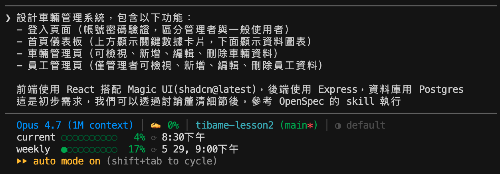

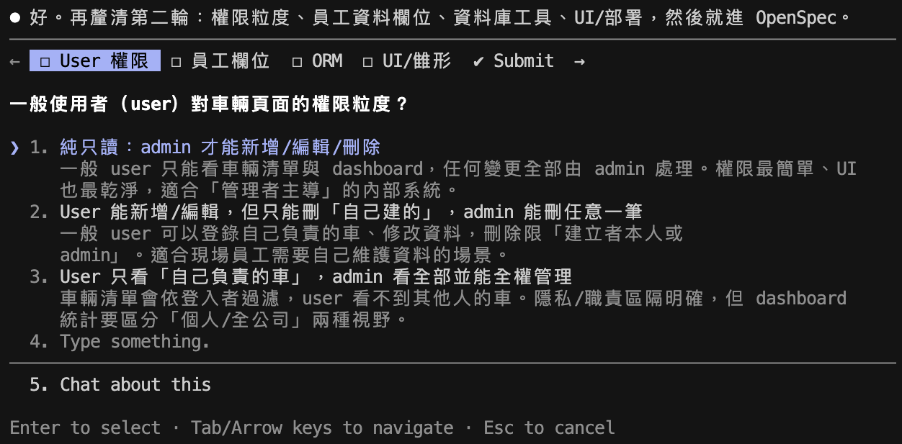

### 📋 用 OpenSpec 建立文件規格

釐清完需求後，AI 會觸發 OpenSpec 的 Skills 做更細部的規劃。相關的規格文件都會存放在 `changes` 資料夾底下。

[flow]
1. proposal.md — 確認目標與範圍
2. design.md — 技術選擇與風險評估
3. specs/ — 按功能分類的詳細規格
4. task.md — 任務清單，完成自動打勾
[/flow]


> **如果希望都用中文寫規格**
> 可以直接請 AI 調整：`規格文件請使用「中文」撰寫，但專有名詞與技術名詞維持「英文」，可以在後面用括弧顯示中文翻譯`

### ⚡ 開始實作  | branch:feature/fullstack-foundation

確認規劃都符合預期後，告訴 AI「開始實作」，AI 就會**根據規劃開始撰寫程式**。

```prompt [label="開始實作"]
開始實作
```

> **經驗分享**
> 根據過去經驗，用 Claude Code 完成`專案初版`，大約需要`花費 30 分鐘左右`。
> 如果想`跳過「開始實作」這段`，可以用下面方案，這樣有需要時，後續可以用 `git switch [branch]` 切換練習分支
> ```terminal [label="拉取遠端 branch"]
> git remote add upstream git@github.com:deancourse/tibame-lesson2.git
> git fetch upstream
> git switch feature/fullstack-foundation
> ```

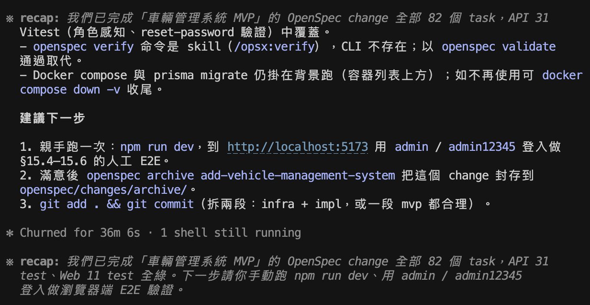

[lab-session title="🛠️  實作練習"]
- 先用 OpenSpec 建立文件規格
- 讓 AI 根據規格實作專案
[/lab-session]

### 🤖 請 AI 協助啟動專案

第一次啟動可以請 AI 幫忙，因為有很高的機率在`第一版遇到零星錯誤`

```prompt [label="讓 AI 協助啟動"]
請幫我啟動前後端專案，並確認 Postgres 跟 Postgres Admin 的 Docker 有啟動
如果根目錄 README.md 沒有操作步驟，請協助補充
我需要知道網址、管理者與一班使用者的登入密碼
以及 Postgres Admin 登入與設定 Server 方式
```

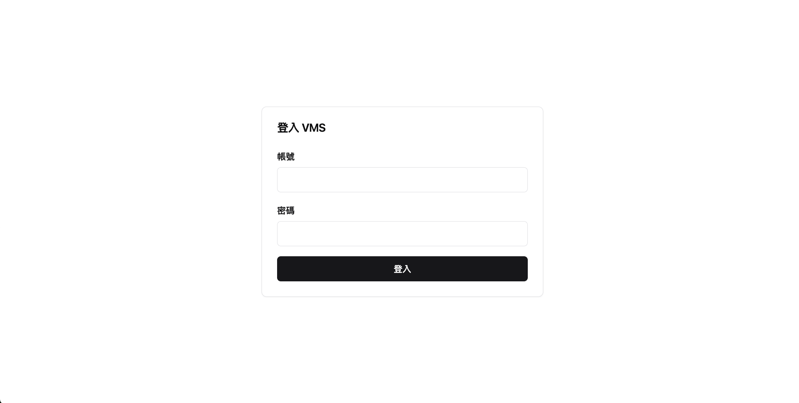

> **在初始啟動後，未來可自行啟動**
> 指令在 package.json 下的 scripts，以這個專案來說，輸入 `npm run dev` 便可啟動

### ✅ 驗證前端、後端、資料庫

#### 確認前端頁面都可以順利顯示

> **測試用帳號密碼**
> admin / admin12345

1. 登入頁面
2. 首頁儀表板（上方顯示關鍵數據卡片，下面顯示資料圖表）
2. 車輛管理頁（可檢視、新增、編輯、刪除車輛資料）
3. 員工管理頁（僅管理者可檢視、新增、編輯、刪除員工資料）

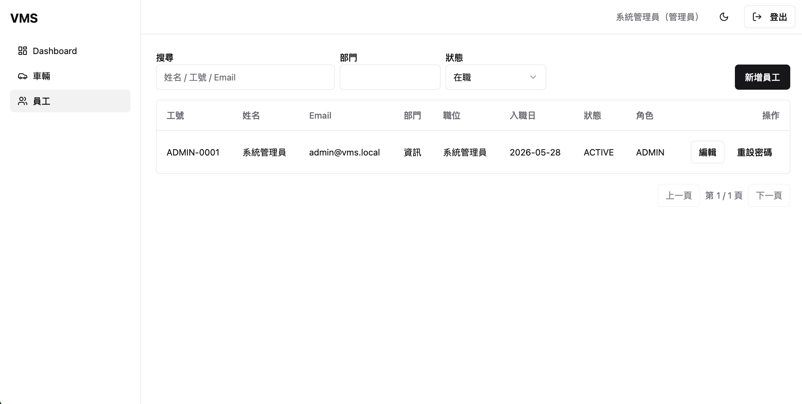

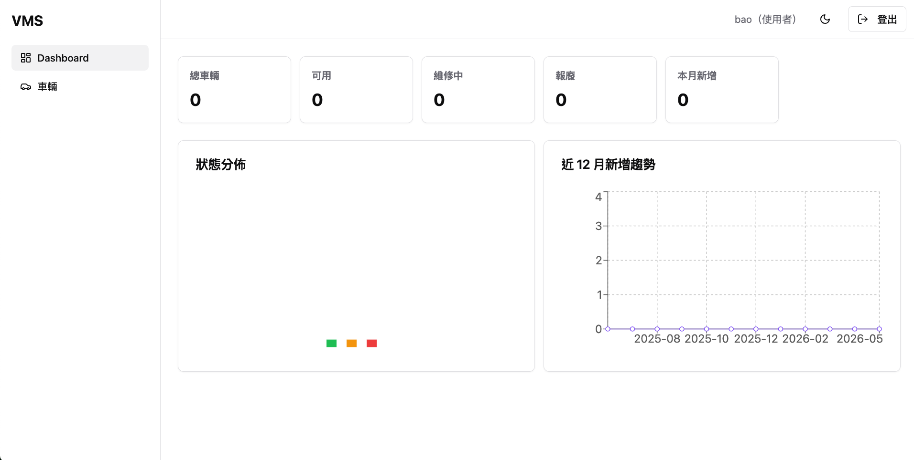

> **可以做的測試**
> 1. 登出後，改成`要登入`才能去的網址路徑（/vehicles）看是否跳回登入頁
> 2. 一般使用者，改成`沒權限`的網址路徑（/employees）看是否跳回儀表板
> 3. 登出後，改成`沒權限`的網址路徑（/errr）看是否跳回跳回登入頁

#### 確認後端 API 都順利回應

1. 打開 F12（點擊滑鼠右鍵，選擇檢查）
2. 開啟「開發人員工具（Chrome DevTools）」
3. 在「網路（Network）」的分頁瀏覽（Fetch/XHR）對應的 API

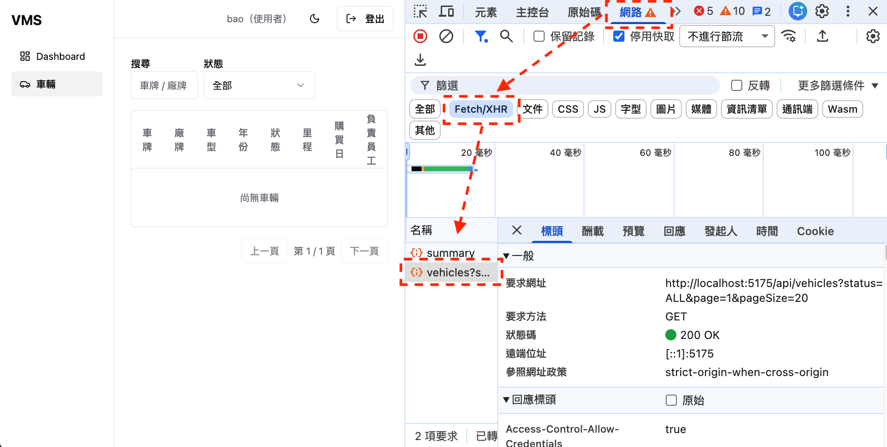

#### 打開 Docker，瀏覽 Postgres Admin 查看資料庫

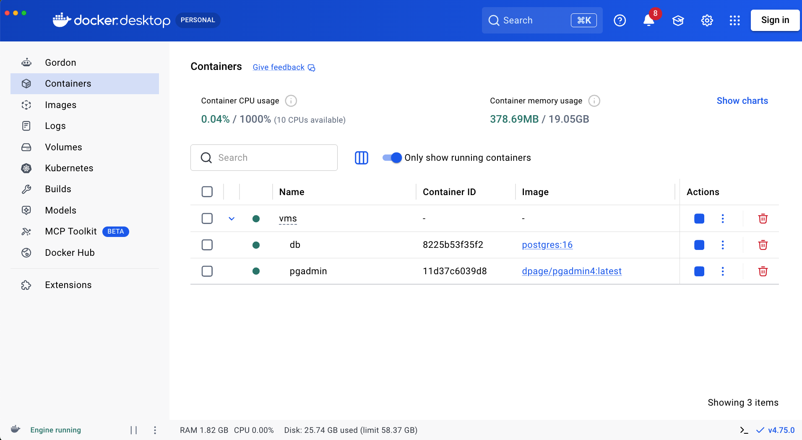

1. 進入 Postgres Admin: http://localhost:5050/browser
2. Servers ⭢ VMS local ⭢ vms ⭢ Schemas ⭢ public ⭢ Tables ⭢ Employee
3. 點擊右鍵 ⭢ View/Edit Data ⭢ All Rows

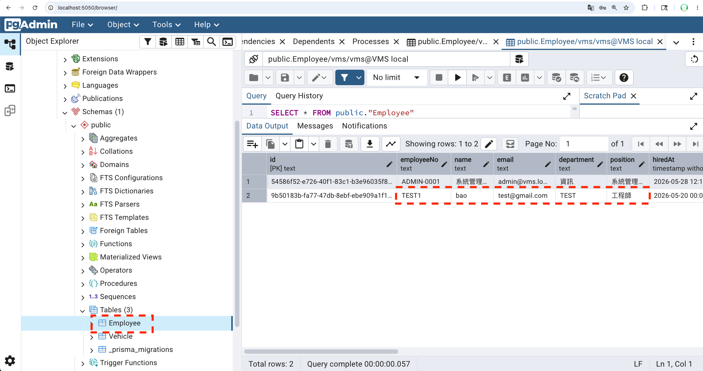

### 🛡️ 使用者驗證方案

| 方案 | 白話說法 | 安全性 | 代價 |
  |------|---------|-------|------|
  | **憑證存 localStorage** | 鑰匙擺桌上抽屜，前端自己保管 | ⚠️  低(網頁一有漏洞就整碗被端走) | 最省事 |
  | **傳統伺服器 Session** | 鑰匙本體鎖在伺服器，你只拿「號碼牌」 | ✅ 高，且能**一鍵強制登出**所有裝置 | 人一多，伺服器要記住每個人，擴展較累 |
  | **用 Google/FB 登入(OAuth)** | 把「驗證你是誰」外包給大公司 | ✅ 高，自己不用存密碼 | 依賴第三方，內部系統不一定適用 |
  | **目前這套(Cookie+JWT)** | 鑰匙藏暗袋 + 危險動作對暗號 | ✅ 高 | 伺服器不必記每個人(輕)，但**沒辦法即時強制登出**單一裝置
  |

### 🤔 這個專案結構合理嗎？

**能正常執行的專案，不代表就是好的專案！**

在「feature/fullstack-foundation」，可以透過下面指令看到原本 AI 設計

```terminal [label="回退到指定版本"]
git reset --soft 3585d65e39c272f73dbf262b00c70af9f7a38156
```

[flow]
1. 環境變數 — .env 設計在`根目錄`，但後端與前端`讀取不到、容易混亂`，現在調整讀取的方案（參考 `loadDotenv.ts`），但共用 .env 需要注意前端`讀取的邊界（vite.config.ts）`
2. port 衝突 - 默認的 `3000、5173` 容易與其他專案衝突，因此直接設計成冷門的 `3098、8090`（參考 `.env.exmaple`）
3. 啟動與測試 - 原本都用 `npm run dev`、`npm run test` 可以前後端都跑，但有時看 `log 資訊、確認錯誤` 時，前後端分離更好（參考 `package.json`）
4. 權限清除 - 如果你`登出後`，直接輸入網頁路徑，會`可以看到頁面`（這是因為登出 Cookie 沒有正確清除導致）
[/flow]

> **知道才能做到**
> 上課時，有些人問我為甚麼能`找出這麼多問題`；講實話，這些就是`經驗積累`，你會出猜那些地方可能有問題
> 當然，這些經驗你也可以請 AI `設計成一個 Skill`，讓他在專案完成`時逐點檢查`

### 🏗️ 專案架構說明

- **apps/web 資料夾**：前端程式，就是你看到的網頁畫面跟操作邏輯。用 `Vite + React + shadcn/ui`。
- **apps/api 資料夾**：後端程式，負責資料處理、跟資料庫溝通。用 `Express + Prisma`。
- **packages/shared 資料夾**：前後端共用的「資料規格與驗證規則」，例如「密碼至少 8 字」「車牌欄位必填」這類`規則只寫一份，兩邊一起用`。
- **infra/pgadmin 資料夾**：pgAdmin 容器一啟動就`自動載入的設定檔`，省掉每次手動「Add Server」、輸入密碼的步驟。
- **.env 環境檔**：存放資料庫帳密、JWT 密鑰、pgAdmin 預設帳號、初始 admin 帳密等隱私資訊。
- **docker-compose.yml**：Postgres 資料庫與 pgAdmin 都是透過 Docker 啟動。
- **openspec 資料夾**：本專案的`需求、設計、規格、任務文件`，跟著 OpenSpec 工作流走。
- **README.md**：專案簡介、Local 開發步驟、各服務 URL 與測試帳密、pgAdmin 操作說明。

### 📦 將完成的 SPEC 歸檔

```prompt [label="歸檔"]
功能符合預期，進行歸檔
```

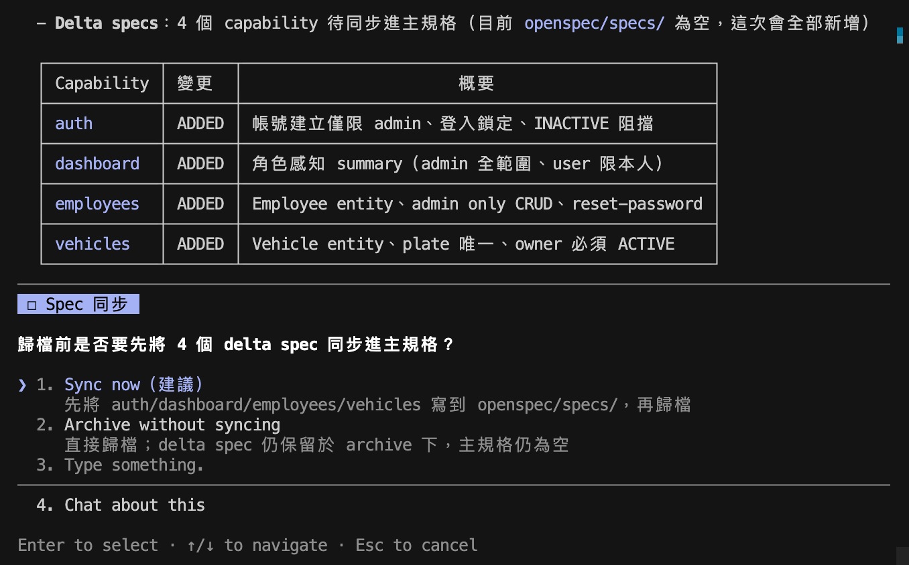

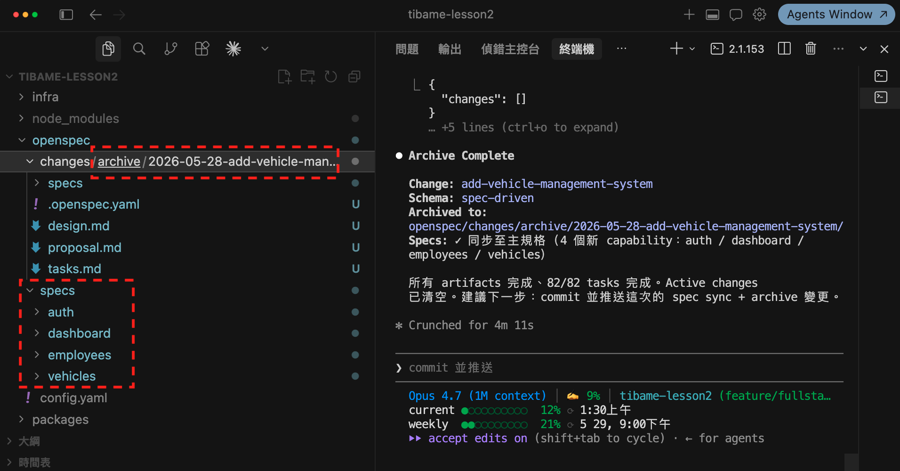

[lab-session title="🛠️  實作練習"]
- 請 AI 協助啟動專案
- 驗證功能符合需求
- 將變更歸檔
[/lab-session]

## 將變更提交到 GitHub

### 初步瞭解 Git Flow

- **main(master)**：主分支，對外的穩定版本，只接受來自 develop 的 Pull Request
- **develop**：開發分支，日常更新都推送到這裡
- **feature/xxx**：功能分支，開發單一功能時從 develop 切出，完成後合併回 develop
- **release/xxx**：發布準備分支，從 develop 切出，只做版本號調整與小修復，完成後合併回 main 與 develop
- **hotfix/xxx**：緊急修復分支，直接從 main 切出，修完後同時合併回 main 與 develop

[html src="./html/git-flow.html"]

> **為什麼需要分支策略？**
> 如果把`邏輯錯誤`或`功能不完善`的版本直接推送到主分支，`產品就壞掉了`。分支策略的目的，是保護`對外服務的穩定性`。

### 🔀 切換分支

```terminal [label="切換到 feature 分支"]
git checkout -b feature/fullstack-foundation
```

### 💾 提交變更

```prompt [label="生成 commit 並 push"]
幫我生成 commit，並執行 push
```

> **可能會遇到的問題**
> Commit 前會透過 `Lint 檢查格式`，`eslint.config.js`需要在設計 ignores 的資料夾（ex:node_modules、coverage、dist...）。
> AI 通常會幫你搞定，但如果卡住可以朝這個方向請他調整。

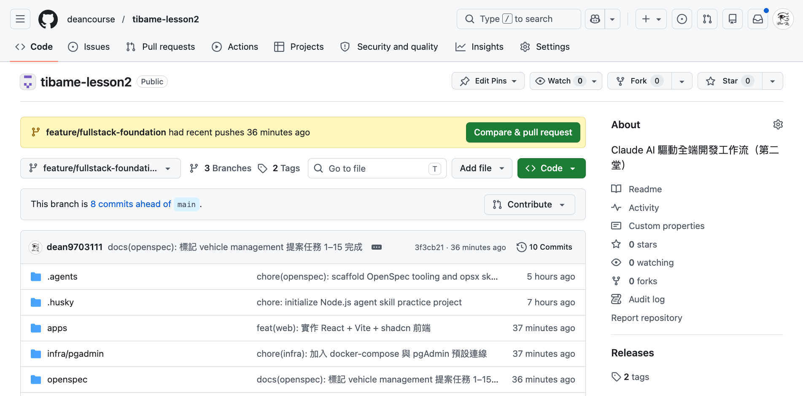

# 優化專案：你相信 AI 會乖乖聽話，還是信我是秦始皇

## 建立專案規則

### 📐 設定 CLAUDE、OpenSpec 專案規則 | branch:feature/add-form-enums-and-mock-seed

**CLAUDE.md** 是給「做事」用的，**openspec/config.yaml** 是給「規劃」用的

```prompt [label="初始化 CLAUDE.md"]
/init
```


```prompt [label="OpenSpec 設定"]
Please read openspec/config.yaml and help me fill it out
with details about my project, tech stack, and conventions
```


> **Tips**
> 舊專案在使用 Claude & OpenSpec 前，可以先透過這兩段指令，讓 AI 初步了解專案的架構、功能、技術。

[lab-session title="🛠️  實作練習"]
- 設定 CLAUDE、OpenSpec 專案規則
[/lab-session]

## 優化不足之處

### 🤔 目前有哪些問題？

[flow]
- 畫面太過樸素
- 預設只有 admin 帳號，資料需要自己建立
- 建立員工、車輛時，所有欄位都要手打
[/flow]

### 🎨 請 AI 提出優化方案

優化功能這塊，我建議使用 `Plan Mode` 讓 AI 先給出提案，使用 `shift+tab` 便可切換模式。

```prompt [label="使用 Plan Mode 讓 AI 思考優化方向"]
目前畫面太過樸素，從熟悉 Magic UI 設計師的角度來看，如何針對主題優化？
另外 DB 初始資料只有 Admin，我想要有指令可以建立模擬資料測試所有情境
還有員工、車輛的欄位都是用手打的，我認為有許多欄位應該可以設計成下拉選單，並且後端 API 也要進行選項的檢查
```

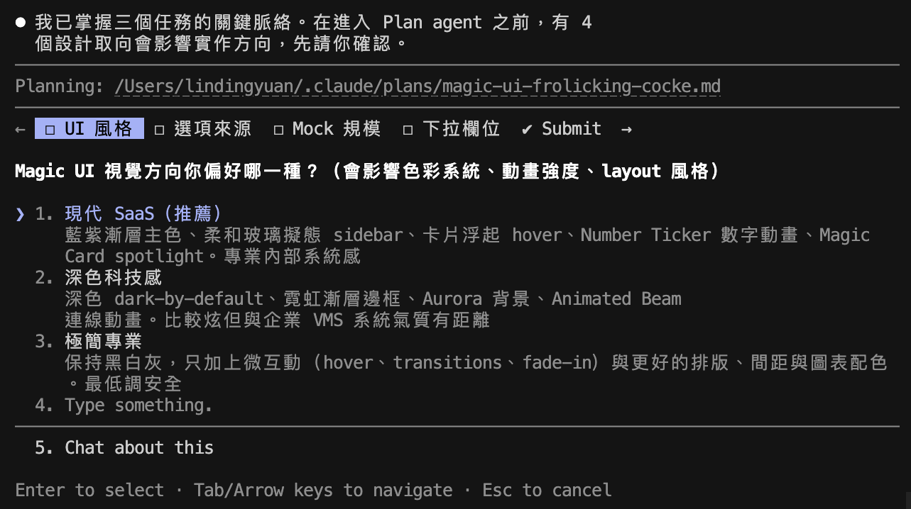

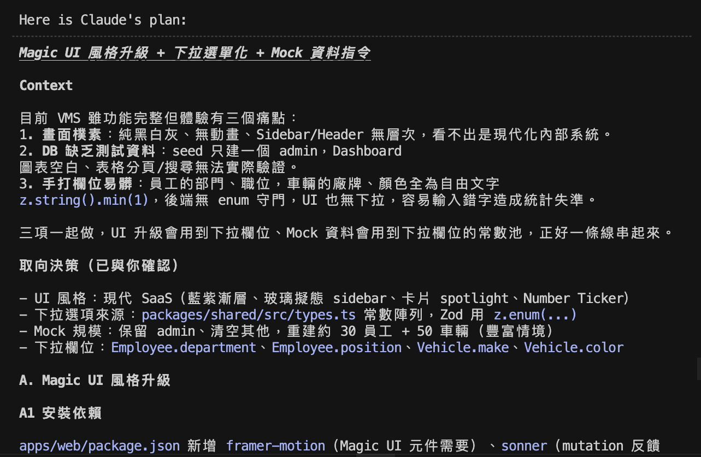

> **為何這次用 Plan Mode？**
> 如果是`調整功能`，建議使用 OpenSpec；但如果是`優化＆重構`，會推薦 Plan Mode。
> 因為這本身並不涉及功能的改變，用 AI Agent 來調整較為輕量，但通常也會`執行 10~20 分鐘`。

### ✅ 確認優化結果符合預期

因為涉及`資料庫調整、前後端邏輯優化`，建議直接請 AI 協助重啟。

```prompt [label="重啟前後端並取得測試資訊"]
幫我新增 mock 資料後，重啟前後端
```

> **如果想自己執行 Seed 作業**
> 指令在 package.json 下的 scripts：
> ```
> npm run seed:mock
> ```

> **延伸思考**
> **Mock data（模擬資料）要以怎麼樣的形式寫入？**
> 1. 如果資料已經存在，要覆蓋嗎？
> 2. 原有的資料要清除嗎？
> 3. 是否每次都寫入相同的資料？
> 4. 執行前有要先判斷環境嗎？（僅允許 local / dev 環境執行）
> 5. 指令多次執行會有問題嗎？

#### 畫面質感升級

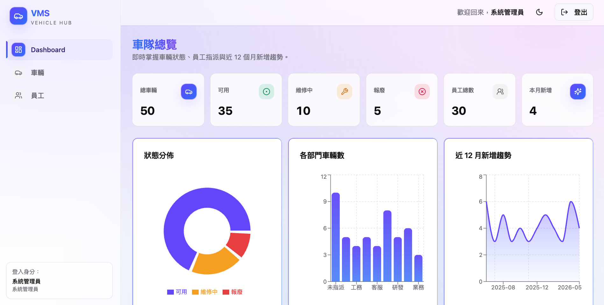

#### 有模擬資料方便測試

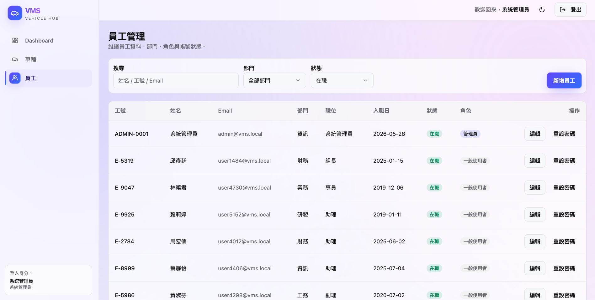

#### 有設計下拉選單方便操作

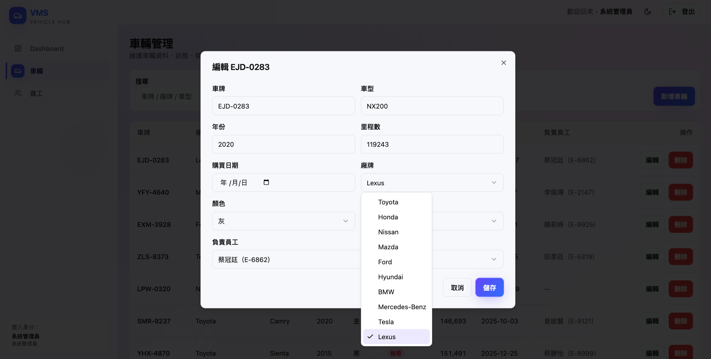

> **優化是沒有盡頭的**
> 以下拉選單為例，哪些適合`寫死`，哪些用資料庫`關聯`是需要評估的。
> - **狀態**：不常變動，可以寫死
> - **廠牌**：可能需要新增、刪除，用資料庫會更好

### 😅 結果不如預期才是常態  | branch:feature/add-form-enums-and-mock-seed

前面是分享優化完畢的結果，下面呈現第一次優化出現的問題。

#### 負責員工僅顯示 ID

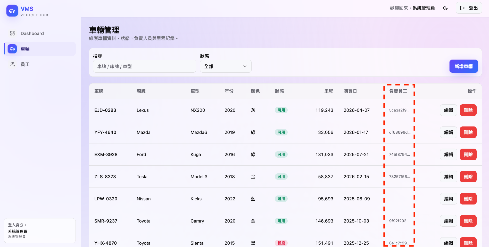

#### 下拉選單 & 負責員工問題

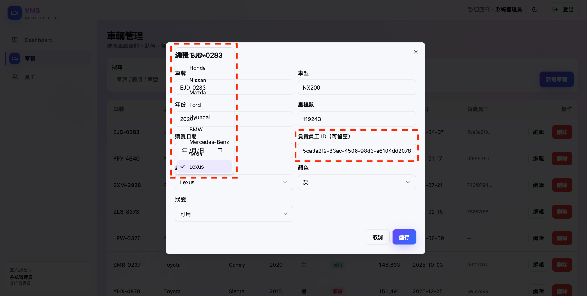

> **個人經驗分享**
> **大範圍的 UI 優化**，通常伴隨許多`破版問題`。
> **對欄位進行調整時**，也很常出現`關聯錯誤`的問題。
> **結果還是需要人類確認、驗證，不要完全相信 AI。**

[lab-session title="🛠️  實作練習"]
- 使用 Plan Mode 請 AI 提出優化方案
- 確認優化結果符合預期
- 如果不如預期實屬正常，需提示並優化
[/lab-session]

### 📝 將變更寫回 OpenSpec

如果改完後發現`變更範圍太大`，還是可以`回補 OpenSpec 內容`的。儘管可以要求 AI 直接修改主 spec，但建議還是`留下 changes 的資訊方便未來追溯`。

```prompt [label="更新 OpenSpec"]
根據變更，依 openspec/config.yaml 走完整 propose → archive：產出 proposal、design、tasks（N.M 樹狀、半天粒度、已完成標 [x]）、delta spec，最後同步主 specs 並歸檔。
```

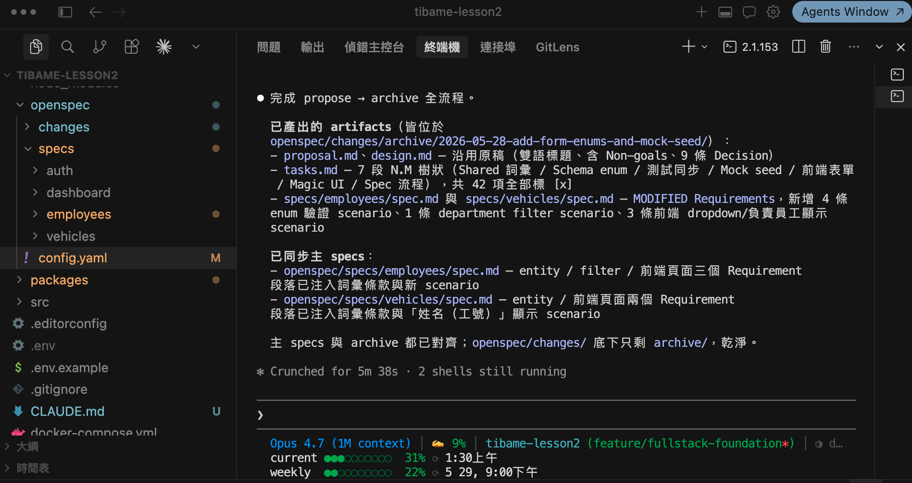

### 🔀 切換分支 & 提交變更

```prompt [label="切換分支 & 提交變更"]
根據變更幫我切換 branch
然後生成 commit，並執行 push
```

### 🆕 建立 develop branch | branch:feature/develop

功能驗證 OK 後，就能把 `feature/xxx` 合進 `develop`。

```prompt [label="建立 develop branch"]
建立新的 develop branch
```

> **小提醒**
> 因為目前尚無 develop branch 才能這樣處理，未來都要走 `Pull Request` 才能合併。

[lab-session title="🛠️  實作練習"]
- 將變更寫回 OpenSpec
- 切換分支 & 提交變更
- 建立 develop branch
[/lab-session]

## 用 OpenSpec 新增功能

### ✨ 新增功能並整合規格文件  | branch:feature/audit-log

[flow]
1. 閱讀專案既有架構、功能 — 確認要新增還是修改
2. 開始設計規格文件 - 一樣跑「proposal ⭢ design ⭢ specs ⭢ task」
3. 完成任務後，彙整河道原有規格 - 對快速迭代、多人合作專案幫助極大
[/flow]

```prompt [label="新增功能"]
增加使用者紀錄頁面（Audit Log），供管理者查看
使用 OpenSpec
```

```prompt [label="確認後實作"]
開始實作
```

> **為什麼 1 到 100 比 0 到 1 更難？**
> 如果沒有規格文件，下次改功能時 AI **不知道之前的設計邏輯**，可能把**同一個功能重複寫**好幾次，或**改 A 壞 B**。
>
> 用 OpenSpec 每次迭代都會在 Source Control 留下規格變更，**AI 跟人類都有文件可以參考**。避免關鍵人物離職後，系統知識直接斷層。

### ✅ 驗證功能符合預期

> **如果想自己執行 Migration 作業**
> 指令在 package.json 下的 scripts：
> ```
> npm run db:migrate
> ```

#### 員工後看不到

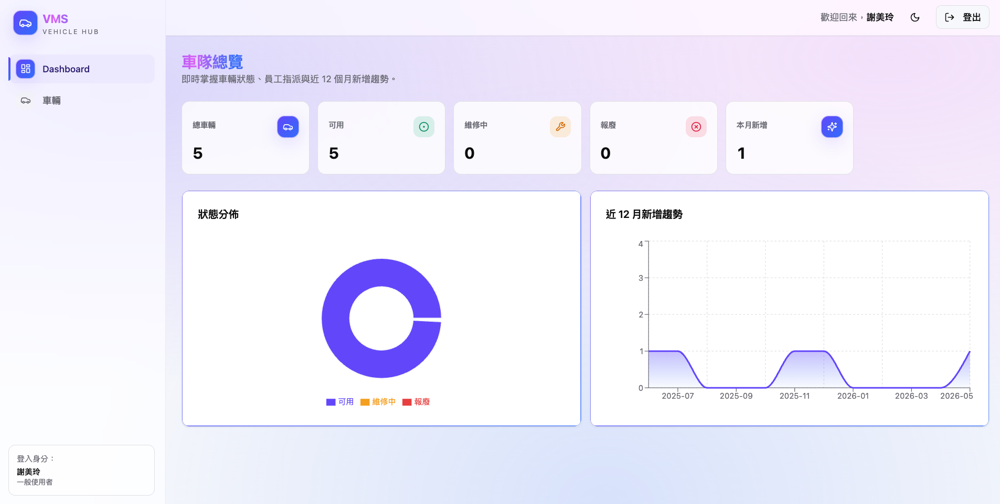

#### 管理者可以看到自己與使用者的操作

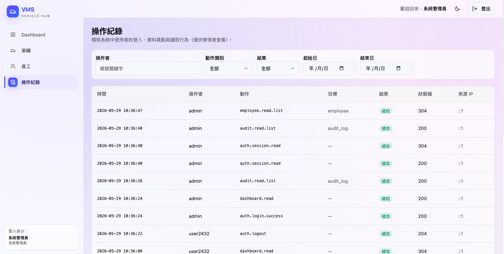

### ✅ 確認都符合預期後再歸檔

```prompt [label="歸檔變更"]
幫我歸檔
```

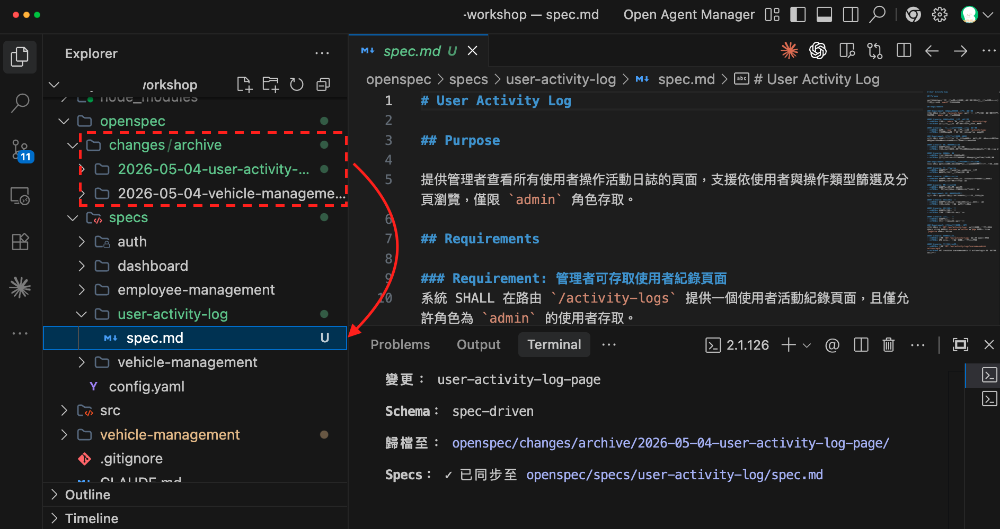

> 完成後記得新增 branch 並完成 commit & push

[lab-session title="🛠️  實作練習"]
- 用 OpenSpec 新增功能
- 驗證功能符合需求
- 用歸檔來整合規格文件
[/lab-session]

### 🧐 目前看到可以優化的細節  | branch:feature/enhance-audit-log-and-ui

現在這個介面操作起來體驗是好的嗎？功能正常嗎？

1. 複選使用者、動作、結果
2. 少了呼叫 API 時的參數
3. 動作無法直觀理解
4. 左下角跟右上角的使用者資訊重複
5. 彈窗的「購買日、入職日期沒有正確顯示」
6. 左側選單沒有固定，應該要 100% 高度

> **要求的 AI 未必做到，更何況沒要求的。**

### 👀 看到問題請 AI 優化就好

```prompt [label="具體描述問題與期待優化"]
Audit log 頁面有如下優化需求：
1. 希望可以複選使用者、動作、結果
2. 欄位少了呼叫 API 時的參數，希望滑鼠移過去時可以顯示
3. 來源 ip 中間兩碼希望 mask，欄位上方可以開關
4. 動作欄位無法直觀理解，希望對齊下拉選單
還有以下 UI 問題：
1. 左下角跟右上角的使用者資訊重複，整合到左下角
2. 車輛編輯彈窗的「購買日」、員工編輯彈窗的「入職日期」沒有正確顯示
3. 左側選單沒有固定，應該要 100% 高度
使用 OpenSpec
```

### ✅ 安裝 Playwright + Chrome DevTools MCP 自動驗證

網頁相關的自動化驗證，可以一次安裝`兩個 MCP`，讓 AI 打開瀏覽器、從不同層面幫你確認：

- **[Playwright MCP](https://github.com/microsoft/playwright-mcp)**：負責`功能與互動`驗證 — 點擊、複選、填表、hover、抓 UI 結構與截圖。回答的是「點得到嗎？欄位在不在？操作會動嗎？」，可以負責 95% 的任務。
- **[Chrome DevTools MCP](https://github.com/ChromeDevTools/chrome-devtools-mcp)**：負責`網路與底層`診斷 — 實際 API 請求參數、console 錯誤、效能追蹤。回答的是「API 送了什麼？有沒有報錯？卡在哪？」，處理 5% 的難題。

> 兩者是`互補`而非取代：Playwright 看的是`畫面表現`，Chrome DevTools 看的是`底層發生什麼事`。

```terminal [label="一次安裝兩個 MCP"]
claude mcp add playwright npx @playwright/mcp@latest
claude mcp add chrome-devtools npx chrome-devtools-mcp@latest
```

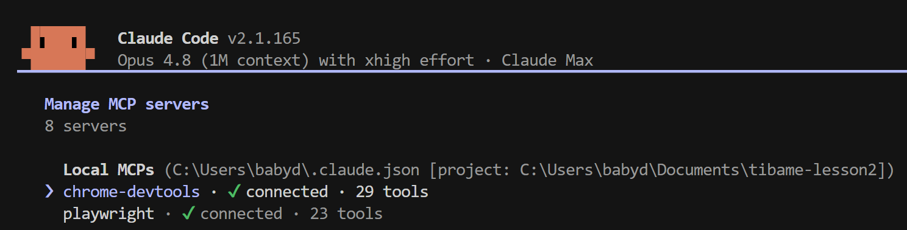

重啟 Claude 後，用`一個 prompt`就能請兩個工具分工驗證，也順便讓你體會兩者的定位差異

```prompt [label="Playwright + Chrome DevTools 雙重驗證"]
請從兩個層面驗證 Audit log 頁面：

【Playwright：功能與互動】
1. 可以複選使用者
2. 滑鼠移到 API 參數欄位會顯示參數

【Chrome DevTools：網路與底層】
3. 切換查詢條件時，3 種條件下，API 回傳的時間
```

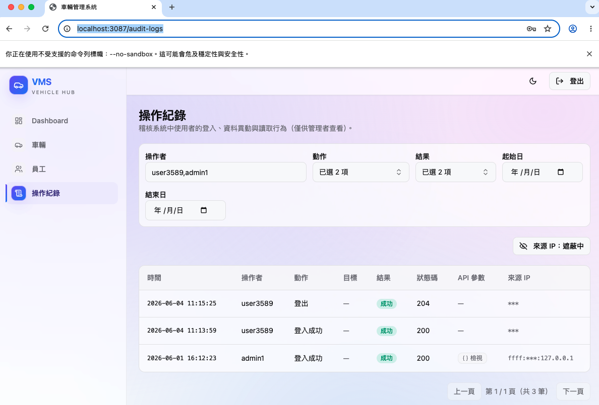

> **更多延伸**
> PR 裡面的`畫面截圖`，其實可以使用 Playwright 輔助。
> [這個 Repo](https://github.com/dean9703111/yt-comment) 的 README.md 的`截圖`涵蓋`標記`說明都是 AI 生成的（截圖使用到 Pillow  套件）。

### 👁️‍🗨️ 人工再次確認

#### Audit log 頁面符合預期

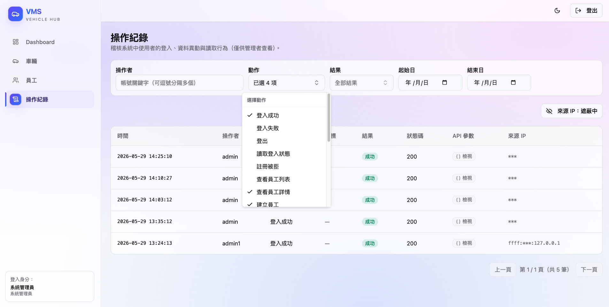

#### 編輯彈窗資訊正確顯示

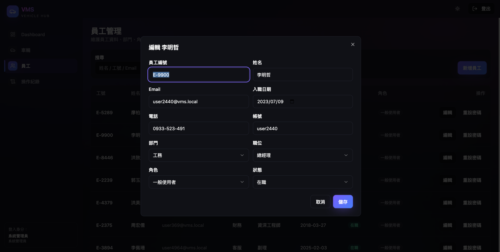

> **符合需求後記得要「歸檔」**

---

# 客製 Skill：根據情境設計 Skills，讓 AI 有執行依據

> 上一堂課，一開始用 **AI Agent 執行解析文件分析**。你會發現他一切都要`重頭做起`，而且`不一定可以把任務完成`。
> 這是因為 **AI 每次的思路都不一樣**，而 Agent Skill 就是讓 AI 記住`能完成的路徑`。讓下次不需要重頭再來，每次都站在`更高的基礎上`。

## 前置設定

> **如果按照講義操作，可以跳過這一步**

### ⏪ 將專案推回到方便測試的版本

```terminal [label="先切回上一個 branch 來測試"]
git checkout feature/audit-log
```

```terminal [label="然後拉取更新"]
git pull upstream feature/enhance-audit-log-and-ui
```

如果遇到警告，建議選擇 `git config pull. rebase false` 來合併。

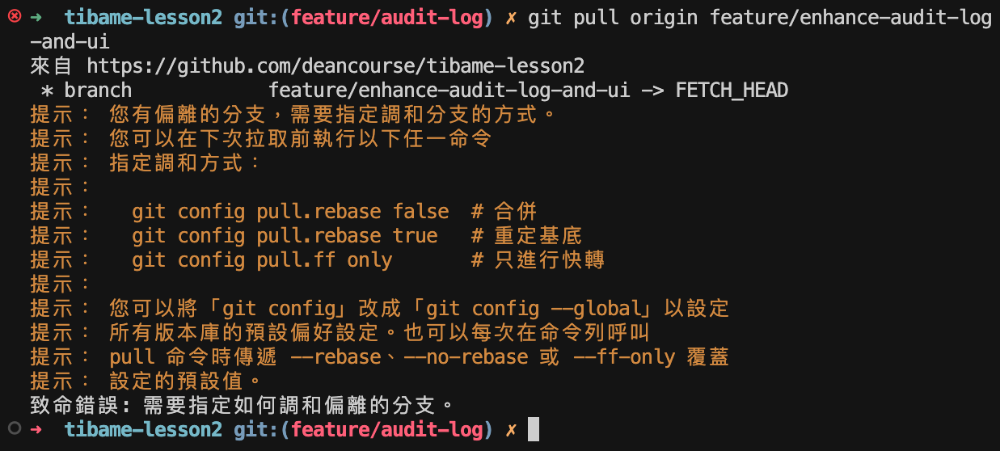

這樣可以取得對應的`變更資訊`了，想關閉終端機訊息，可以輸入`:q`。

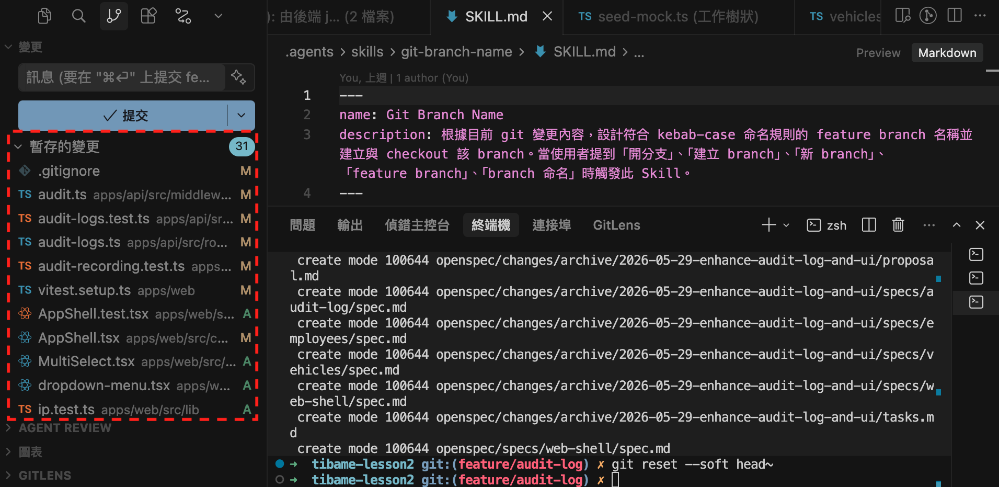

## 根據需求建立 Skill

> **建立客製化 Skill 的重要性**
> 不同部門、團隊都有自己的工作流，專案也有各自的情境；而 Agent Skills 讓每次達成的目標，成為下次的起點。
> **根據需求建立 Agent Skills，畢竟能實際給予幫助的，才是好的 Skill。**
> Skill 的出現，讓 AI 的價值可以持續累積。只要教會一次，他就永遠記得怎麼做。

### 🌿 設計 Branch Name Skill

#### 為什麼需要 Branch Name Skill？

**1. 人工命名**：風格不一致（`feat/...`、`feature/...`、`feature-...`）
**2. AI 隨意生成**：無法反映任務範疇，也不符合團隊規範

**Skill 的設計邏輯：**
- 核心流程：`分析變更 → 命名提案 → 確認 → 建立分支`
- 預設「type(feature) + kebab-case」格式

```prompt [label="提出需求設計 Skill"]
幫我建立一個 Skill，我想依據當前 git 變更分析功能意圖，產出 `<type>/<kebab-case>` 格式的分支名稱（預設 feature，僅使用者明確說修 bug 才用 bugfix），確認後執行 git checkout -b 建立並切換。
```

#### 驗證 Branch Name Skill

```prompt [label="生成 branch"]
生成 branch
```

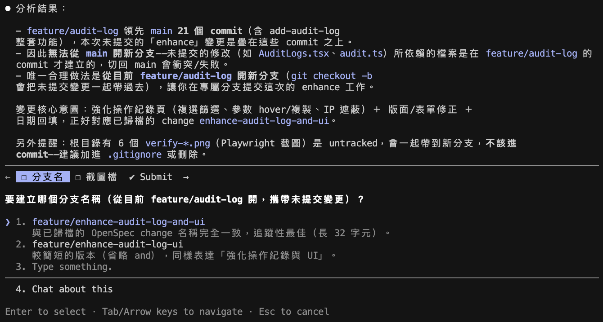

> **團隊設計時要思考的細節**
> 1. 是否需要跟著專案管理工具的 Tiket 命名（ex: feature/KAN-17_xxx）
> 2. release/hotfix/bugfix 是不是都有特別的設計

[bonus title="🤖 用 /codex:review 讓 AI 幫你 Code Review"]
**安裝步驟（只需執行一次）**

```
/plugin marketplace add openai/codex-plugin-cc
/plugin install codex@openai-codex
/codex:setup
```

**使用方式**

```
/codex:review
```

Codex 會自動偵測 git 變更量，詢問執行模式：
- 變更小（1–2 個檔案）→ 建議前景等待
- 變更大 → 建議背景執行，完成後用 `/codex:status` 查結果

背景執行時不會打斷你，可以繼續開發其他功能。

**審查結果包含**
- 結論：`approve` 或 `needs-attention`
- 每個問題的檔案位置、嚴重程度（critical / high / medium / low）、修改建議

Codex **只審查，不自動修改**；你確認後再決定要改哪些。

**好處**
1. **第二雙眼睛** — Codex 與 Claude 訓練背景不同，容易發現彼此的盲點
2. **不打斷工作流** — 背景執行，審查與開發並行
3. **比人工快** — 幾十秒內拿到按嚴重程度排列的問題清單
4. **強制分離「找問題」與「改問題」** — 避免 AI 悄悄改到不該動的地方
[/bonus]

### 📝 設計 Commit Skill

#### 為什麼需要 Commit Skill？

**1. 人工手打**：耗時且風格不一致
**2. AI 自動生成**：長短隨機、中英混雜

**Skill 的設計邏輯：**

- 核心流程：`分析變更的檔案 → 判斷應拆成幾個 commit → 分段提交`
- 不同功能的修改分開 commit，讓邏輯可被追蹤
- commit 訊息明確，不要多功能混一起

```prompt [label="提出需求設計 Skill"]
幫我建立一個 Skill，我想將將現有變更依功能邏輯分群，產出 `<type>(<scope>): <繁體中文>` conventional commit 計畫，確認後逐批執行 git add + git commit。 
```

#### 驗證 Commit Skill

```prompt [label="拆分 Commit"]
新增 commit
```

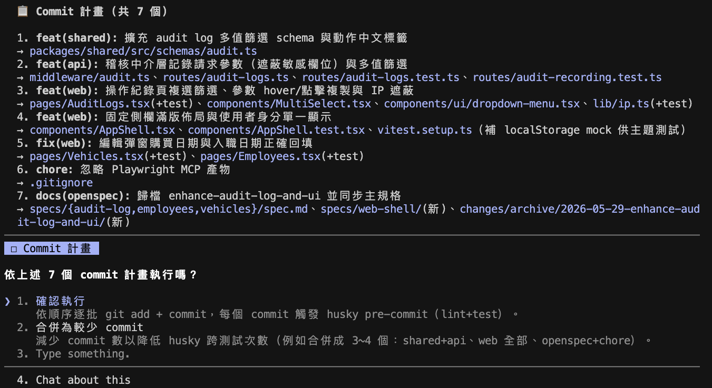

> **小提醒**
> 多個 commit 執行時，AI 偶爾會卡住；如果等待超過 1 分鐘，直接關閉這次對話，開一個新的對話處理通常就正常了。

### 🔀 設計 PR Skill

#### 為什麼 PR 的 Skill 很重要？

PR 是決定專案品質的重要環節，因為他是讓團隊成員 Code Review 時，理解你到底做了些什麼的文件。

- 如果隨便寫寫，審核的人通常也是隨意看看
- 直接讀程式碼去理解功能為何這樣設計，真的太消耗腦力了
- 專案中有設計一個 `git-pr-description` 技能，用來生成 Pull Request 的模板

**Skill 的設計邏輯：**

- 核心流程：`比對當前分支與目標分支的差異 → 讀取 commit 訊息與變更檔案 → 參考模板轉寫文件`
- 請根據團隊需求調整 `pr-template` 生成 Title 與 Description（漸進式揭露）

```prompt [label="提出需求設計 Skill"]
幫我建立一個 Skill，目標是比較當前 branch 與目標 branch 的所有 commit，產出 `<type>: <描述>` 的 PR itle 與含涵蓋動機、變更、測試步驟的結構化 Markdown Description（在 reference 裡面設計 PR 參考模板），寫入 pr-review.md 供確認，確認後可選執行 gh prcreate。
```

> **小提醒**
> 這個 Skill 只是 commit 變更到本地，需要自己手動 Pushlish Branch 才會更新到雲端。

#### 驗證 PR Skill

```prompt [label="生成 PR 初稿"]
撰寫 PR，與 develop branch 比對
```

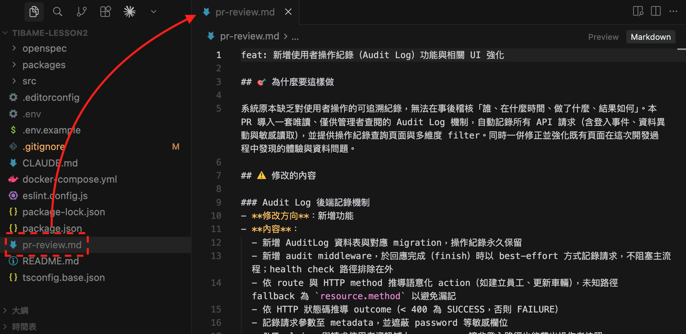

```prompt [label="建立 PR"]
推送 branch 並建立 PR
```

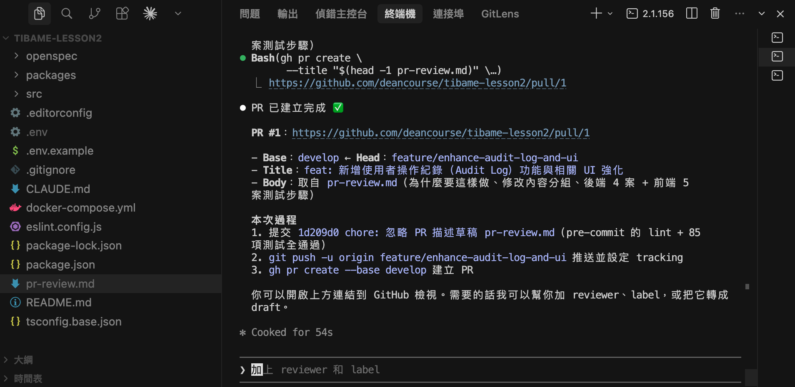

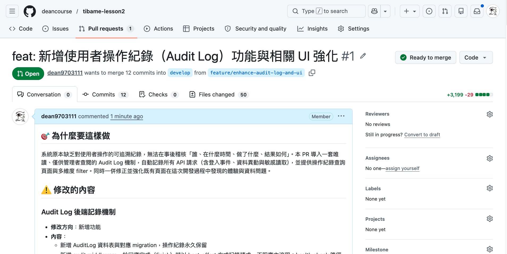

> **人，才是 AI 的瓶頸**
> Code Review 的速度已經跟不上 AI 寫程式的速度。當人成為 AI 的瓶頸時，要去想的是如何**降低門檻，而不是放棄審核。**
>
> **設計 Commit、PR 的 Skill 就是透過優化流程讓開發更順暢。**雖然每一步都是 AI 在執行，但如果沒有實務經驗，其實不知道怎麼串起這些工具。**真正值錢的不是工具本身，而是知道什麼時候用、怎麼組合。**

[lab-session title="🛠️  實作練習"]
- 觸發 Branch Name Skill
- 觸發 Commit Skill
- 觸發 PR Skill
- 合併回 develop branch
[/lab-session]

---

# 總結：打造可維護的 AI 工作流  | branch:none

[summary]
- 🧠 **累積 AI 經驗** | 用 CLAUDE.md、Agent Skills 讓 AI 的知識可以複用，**不要每次都從零開始**
- 🏢 **多層次 Skills 管理** | 依照`公司 → 團隊 → 專案 → 個人`分層設計 Skills
- 🔧 **從痛點出發學工具** | 遇到問題再導入工具，工具只是過程中學會的，真正重要的是**辨識問題與設計解法的能力**
[/summary]

## 讓 AI 的經驗可以累積，不要每次都從零開始

- **CLAUDE.md** — 記錄專案背景、使用技術、開發規範，讓 AI 有執行的方向
- **Agent Skills** — 將過去解決過的問題設計成 SOP，並持續優化細節
- **OpenSpec** — 將規格文件版本化，新成員、AI 都有文件可以參考，不怕知識斷層

## 建立公司、團隊、專案、個人的 Agent Skills

| 層級 | 說明 | 範例 |
| --- | --- | --- |
| **公司** | 全公司通用規範 | 工作日誌、Branch 命名、Git Flow |
| **團隊** | 特定團隊工作流 | Coding Style、PR Review 模板、Commit 格式 |
| **專案** | 單一專案情境 | 測試策略、部署流程 |
| **個人** | 個人偏好設定 | AI 不是只會寫程式、文件 |

> 透過 [dotagents](https://github.com/dean9703111/dotagents) 可以讓 Skills 同步到不同 AI Agent，不受工具限制。

## 從解決痛點的角度，來學習 AI 工具

> **培養批判性思考能力**
> 人的精力有限，`技術是學不完的`；要先培養出辨識問題的能力，然後思考如何解決，`工具只是在過程中學會罷了`。
> 現場遇到的問題都是不同的，沒有現成的解決方案，就要`自己設計`出來。
> **好的結果，不該靠消耗 Token 拼運氣；而是靠清楚的方向、可重複的工作流、以及人類在關鍵節點的決策。**

[qa-session title="Q&A 時間"]
[/qa-session]
