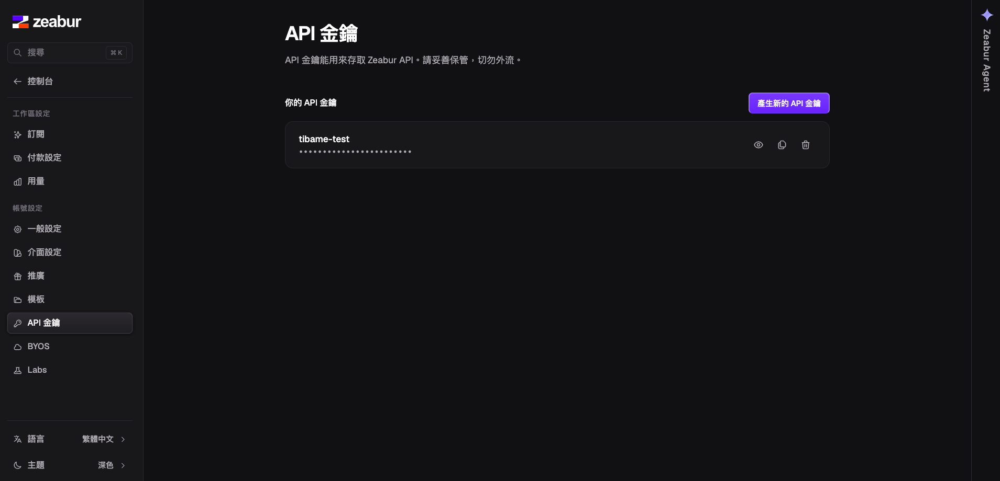
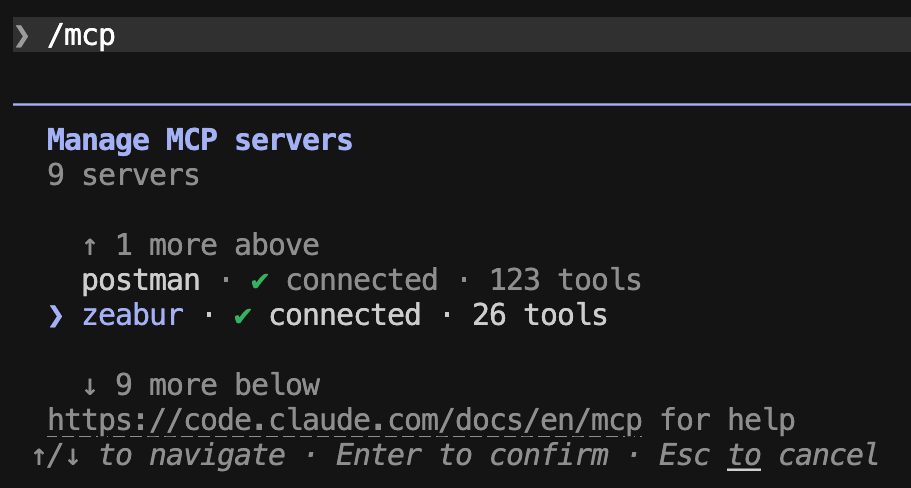

[time]
- label: 第 1 堂
  date: 5/30（六）
  time: 13:30~16:30
  des: **打造懂你的 AI 助手**：設定開發環境，掌握 AI Agent 進階技巧，建立專屬 Agent Skills 護城河
  link: [課程講義](https://deanlin.net/course/tibame/lesson1)
- label: 第 2 堂
  date: 6/6（六）
  time: 13:30~16:30
  des: **規格驅動開發 (SDD)**：讓 AI 根據規格建立全端系統，並搭配自製 Skill 優化開發流程
  link: [課程講義](https://deanlin.net/course/tibame/lesson2)
- label: 第 3 堂
  date: 6/13（六）
  time: 13:30~16:30
  des: **團隊協作與專案部署**：建立自動化測試，了解 Worktree 應用時機，同時用 MCP 操作外部工具將專案部署上線
  active: true
[/time]

# 課前回顧：全端系統可以在電腦運行了

## 建立 User 層級的 Claude Code GitHub Repository

### 🖥️ 讓 Claude Code 不用重頭設計

- 使用者層級的 `skills`、`hooks`、`settings.json`、`CLAUDE.md` 平常散落在 `~/.claude/` 目錄
- 如果沒有`版本控制`，一旦**換機器、重灌系統**，這些累積的心血就得從頭設定一次
- 把它們放進 GitHub repo，用 `git` 管理版本、用 `symlink` 連回原位
- 達成：**版本可追溯、跨裝置同步、隨時可還原、專案有更好的起點**


> **參考資源**
> - [講者範例 Repository](https://github.com/deancourse/user-dot-agents)
> - 建議跟著[講義步驟實作](https://deanlin.net/course/tibame/lesson2/#user-claude-code-github-repository)

### 🤖 AI 的成果可能不完全正確

上週的範例 Repository 其實有個小問題，由於 Shell Script 是給`每個 Skill` 個別建立 symlink，而不是給 `skills 資料夾`建立 symlink。

因此會有如下問題：
1. 在`user-dot-agents`底下建立的 Skill，需要**執行 Script 才會同步**到 User 層級的`~/.claude/skills`中
2. 當 Skill 新增到 User 層級的`~/.claude/skills`時，`user-dot-agents`下的 Skill **不會自動更新**

```prompt [label="修復問題"]
目前的 script 好像不是直接同步 skills 資料夾，而是根據下面資料夾同步，這樣我新增 skill 時，不會自動建立軟連結，請協助修改
```

有興趣了解差異的可以看 [commit 變更](https://github.com/deancourse/user-dot-agents/commit/c5d88595e3bb1bfa0f22477aac7720658e78357b)


### ✅ 確認同步生效

```prompt [label="讓 Claude 找出來源"]
目前 User 層級的 CLAUDE.md、hooks、skills、settings.json，原始資料夾與檔案在哪裡？
```


> **這個 Repository 可以放在電腦的任何位置**
> 我們是透過`symlink`來建立**資料夾、檔案**之間的軟連結，因此專案放在任何位置皆可。
> 重要的是變更時記得`commit`與`push`來更新，並且更新後其他台電腦要`pull`下載更新。
> 如果害怕**忘記這些操作**，可以跟 AI 討論設計 `Shell Script`，設計概念如下：
> - 登入電腦後，自動拉取最新檔案（若有衝突會引導使用者進入專案處理）
> - 每 30 分檢查是否有變更
> - 有變更才需要執行 commit 與 push
> - commit 訊息可以使用「auto sync user agents: YYYY-MM-DD HH:mm:ss」

## 在隔離環境（Sandbox）執行 Claude Code

### 🐳 安裝 Docker

到 [Docker 官網](https://www.docker.com/) 根據自己的作業系統下載安裝後，就可以直接使用，不需要特別註冊、登入帳號。


> **安裝完成後，記得啟動 Docker Desktop**
> Docker 安裝完並不會自動啟動。請在應用程式中找到 Docker Desktop 並打開，**註冊相關步驟都可以直接 Skip**，看到左下角顯示綠色的 Running 狀態，才代表 Docker 已經準備好了。
> 也可以在終端機執行 `docker --version` 來確認有安裝成功。

### 🏝️ 在隔離環境執行 Claude Code

#### 下載 Dev Containers

在 IDE 的 Extensions 搜尋「Dev Containers」 並安裝。


#### 下載測試範例，啟動 Sanbox

可以下載[練習用的 GitHub Repository](https://github.com/deancourse/claude-code-docker-container-demo)體驗。


開啟後，輸入「F1」貼上 `Dev Containers: Reopen in Container`


> **如果啟動失敗**
> 可以嘗試`關掉後重啟`，如果還是不行，將錯誤訊息貼到 Claude Code 進行分析。
> Windows 可以嘗試 `wsl --update` 更新到新版。

#### 確認讀取不到外部資訊，在隔離環境運作

在終端機輸入 `claude`，第一次需要登入帳號。

目前這個是完全獨立的環境，所以過去 `User Scope 的相關設定都不會出現`（ex: Skills、Rules、Plugins、Perminssions）。


隔離環境可以透過 `claude --dangerously-skip-permissions` 啟動，這時給 Claude 任務時，**除了會跟你釐清細節外，執行過程不會再詢問權限相關問題**。

```prompt [label="讀取外部資料"]
幫我列出桌面有哪些檔案
```


### 🎯 用 OpenSpec 規格驅動開發（SDD）

- **Skills** — AI 在對話過程中自動觸發的技能包，不需要背指令
- **Commands** — 用 `/opsx` 前綴強制驅動：apply / archive / explore / propose
- 可透過 `openspec config profile` 擴充更多 workflows

```terminal [label="安裝 OpenSpec"]
npm install -g @fission-ai/openspec@latest
openspec init
```

#### STEP 1: 提出需求觸發 OpenSpec Skill 進行規劃

```prompt [label="觸發 OpenSpec Skill(propose)"]
設計車輛管理系統，包含以下功能：
- 登入頁面（帳號密碼驗證，區分管理者與一般使用者）
- 首頁儀表板（上方顯示關鍵數據卡片，下面顯示資料圖表）
- 車輛管理頁（可檢視、新增、編輯、刪除車輛資料）
- 員工管理頁（僅管理者可檢視、新增、編輯、刪除員工資料）

前端使用 React 搭配 Magic UI(shadcn@latest)，後端使用 Express，資料庫用 Postgres
資料庫希望透過 Docker 啟動，並且要包含 Postgres Admin 網頁
這是初步需求，我們可以透過討論釐清細節後，參考 OpenSpec 的 skill 執行
```

#### STEP 2: 確認規劃符合需求後，根據 Spec 規劃執行

```prompt [label="開始實作(apply)"]
開始實作
```

提出需求後觸發 OpenSpec 的 Skills 後，相關的規格文件都會存放在 `changes` 資料夾底下。

[flow]
1. proposal.md — 確認目標與範圍
2. design.md — 技術選擇與風險評估
3. specs/ — 按功能分類的詳細規格
4. task.md — 任務清單，完成自動打勾
[/flow]


#### STEP 3: 確認結果符合預期後進入歸檔

```prompt [label="歸檔（sync + archive）"]
功能符合預期，進行歸檔
```


### 🤖 讓 AI 執行專案時有規則

**CLAUDE.md** 是給「做事」用的，**openspec/config.yaml** 是給「規劃」用的

```prompt [label="初始化 CLAUDE.md"]
/init
```


```prompt [label="OpenSpec 設定"]
Please read openspec/config.yaml and help me fill it out
with details about my project, tech stack, and conventions
```


> **legacy（既有）專案**
> 如果想在舊專案`導入 Claude Code、OpenSpec`，執行完上面的指令後，AI 執行的品質會好很多。

### 🛡️ 讓 AI 犯錯時被擋下

- `Lint + pre-commit`：commit 前自動擋掉格式錯誤與測試失敗
- `Git Flow`：main / develop / feature 分支策略，出包有回頭路
- 重點不是讓 AI 不犯錯，而是`設計讓錯誤被攔截`的機制


### 🧩 把經驗沉澱成 Skill

- 根據公司、團隊客製 `Branch Name / Commit / PR` 個 Skill，讓 AI 有規範可循
- Skill 的價值：教會一次，下次都站在`更高的起點`


> **能「做出來」不等於能「交付」**
> 上一堂的系統功能跑得起來，但你敢直接交給別人用嗎？
> 怎麼確定`改 A 不會壞 B`、怎麼讓別人`在自己的電腦也跑得起來`——這正是這一堂要補上的。

### 🎯 這一堂，補上「品質」與「上線」的最後一哩

[flow]
1. 導入測試 — 了解測試注意事項、用 Skill 生成`測試案例`
2. 加入自動化 - 用 `CI/CD` 守住品質，並設定要`保護的 Branch`
3. 團隊協作 - 認識 `Worktree` 使用時機，讓協作更輕鬆
4. 使用 MCP — 讓 AI 協助建立 `Postman Requests`，驗證 API 更靈活
4. 部署上線 — 將前後端打包成 `Docker image`，透過 `Zeabur` 白話文部署迭代
[/flow]

---

# 導入測試：讓維護與擴充更有底氣

> 市場不會為爛產品買單；加入自動化測試，是 Vibe Coding **從玩具走向產品的關鍵**

## 上週專案存在什麼問題？

### 🗂️ 下載課程範例 Repository | branch:main

[下載或 Fork 練習用 Repository](https://github.com/deancourse/tibame-lesson3) 後，可以跟著課程進度操作。

```terminal [label="僅 Clone 課程 main branch Repo"]
git clone --branch main --single-branch git@github.com:deancourse/tibame-lesson3.git
cd tibame-lesson3
```

> **還沒設定 SSH Key？**
> 如果 clone 失敗，代表尚未設定 GitHub SSH 金鑰。
> 請參考 [GitHub 官方教學](https://docs.github.com/en/authentication/connecting-to-github-with-ssh) 完成設定。

#### 同步 Skills 到不同 AI Agent

```prompt [label="將 Agent Skills 同步到指定的 AI Agent"]
npx @dean9703111/dotagents
```


> 單一來源管理，未來維護更方便，修改一次就能在所有工具中生效；此套件會在 `.agents` 底下管理。

### 🚀 啟動專案

你可以執行請 AI 幫忙啟動專案，但一個專案`如果想長期維護，至少要知道如何手動啟動`。

```terminal [label="完成專案初始化"]
cp .env.example .env          # 第一次先複製出來、按需修改
docker compose up -d          # 啟 db (Postgres) + pgadmin (5050)
npm install                   # 安裝所有 workspace 依賴
npm run db:migrate            # 建立 schema
npm run seed                  # 建立第一個 admin（讀 .env 的 SEED_ADMIN_*）
npm run seed:mock             # 選用：塞 30 員工 + 50 車輛模擬資料，方便看 dashboard / 分頁
```


> **小提醒**
> 如果 `Docker Conatiner 啟動失敗`的問題，通常原因如下：
> 1. 若出現**指令錯誤**，可能是因為 Docker 版本較舊，建議升級，或是改用 `docker-compose up -d` 啟動
> 2. 若`卡在 Starting 狀態`，通常是因為有`port 衝突`，可以到 Docker Desktop 查看。

```terminal [label="啟動專案"]
npm run dev
```

啟動完成後，可以進入 local 本地網址: http://localhost:3087

登入帳號密碼:
- **帳號**: admin
- **密碼**: admin12345


[lab-session title="🛠️  實作練習"]
- 下載課程[範例 Repository](https://github.com/deancourse/tibame-lesson3)
- 同步 Skills 到不同 AI Agent: `npx @dean9703111/dotagents`
- 啟動專案，並登入確認前後端與資料庫皆順利啟動
[/lab-session]

### ⚠️ AI 生成的測試可能會污染資料庫

就算沒有要求，AI 有時也會主動`撰寫測試程式`；但測試程式不是有寫就好，還需要考量到許多面向。

```terminal [label="開新終端機執行測試指令"]
npm run test
```

在執行上次 AI 自動寫的程式時，會有如下`嚴重問題`：
1. 後端測試程式會`污染資料庫`
2. 測試行為被`寫入 Audit Log（使用者紀錄）`
3. 執行越多次，`資料庫越亂`；甚至重複執行，`預期通過卻出現錯誤`


因為無法登入，所以可以到 PGAdmin 頁面看資料發生了什麼事: http://localhost:5050/browser/


## 將後端測試改為 TestDB

> 不是要 AI「不要動資料庫」，而是`給它一個動了也沒關係的資料庫`。

### 🛠️ 兩種方案：MockDB 與 TestDB

> MockDB 是`模擬別人`，TestDB 是`隔離自己`。

| 方案 | 它在模擬什麼 | 使用情境 |
| --- | --- | --- |
| **MockDB** | 模擬`外部系統 / 第三方 API`的回應格式 | 後端要呼叫金流、簡訊、其他微服務，但測試時不想真的打對方 API，可以用 Mock 模擬對方不同情境回應的資料 |
| **TestDB** | 你`自己系統`專用的測試資料庫 | 驗證自己的 API 是否正確，但不想動到正式 DB，就另開一個一樣的 DB 供測試使用 |

- **MockDB**：我不在乎對方 API 背後邏輯，我只在乎`它回應的的格式`，所以根本不需要真資料庫，模擬回應就好。
- **TestDB**：要確認`自己寫的 API 業務邏輯`都符合預期，會牽涉到`資料庫真實行為`，所以一定要有一個真的（但可拋棄的）資料庫。

### 🤖 讓後端測試改用 TestDB | branch:feature/isolate-api-test-database

> 這堂課沒有使用第三方 API 服務，所以設計 TestDB 示範

```prompt [label="讓後端測試改用 TestDB"]
目前的 API 測試會改寫實際的 DB
我希望執行測試時，會有專屬的 TestDB，並確保每次測試都是乾淨的環境
且 PGAdmin 也能觀察測試結果
若涉及指令、規則，完成任務後更新 CLAUDE.md、README.md
```

待 AI 修改完畢後，`先復原專案 DB 資料`；這樣才能驗證執行測試時`不會對原有 DB 造成影響`。

```terminal [label="復原專案 DB"]
npm run seed                  # 建立第一個 admin（讀 .env 的 SEED_ADMIN_*）
npm run seed:mock             # 選用：塞 30 員工 + 50 車輛模擬資料，方便看 dashboard / 分頁
```

#### 驗證結果符合預期

```terminal [label="重啟 PGAdmin 讓測試 DB 也能看見"]
! docker compose restart pgadmin
```

然後執行測試指令，確認不會動到原有 DB，並且 PGAdmin 也可看到測試 DB

```terminal [label="執行測試"]
npm run test
```


> **了解 PR 的重要性**
> 為了讓大家更清楚`專案脈絡`，**每個 branch 都有[建立 PR](https://github.com/deancourse/tibame-lesson3/pull/1)**
> 這樣回顧調整內容時，會更輕鬆。

[lab-session title="🛠️  實作練習"]
- 執行 `npm run test` 了解測試會污染資料庫
- 讓後端測試`改用 TestDB`
- 透過 `seed 指令` 將資料還原
- 執行 `npm run test` 確認確認不會動到原有 DB，並且 PGAdmin 也可看到測試 DB
[/lab-session]

## 建立適合專案的測試工作流

### 🔀 驗證生成測試的 Skill | branch:feature/restructure-tests-with-type-groups

[flow]
1. 建立資料夾 — 存放測試清單
2. AI 撰寫清單 — 類型、說明、輸入、期待輸出
3. 人類 Review — 確認情境有無遺漏
4. AI 撰寫測試 — 描述與文件一致
5. 自主驗證 — 最多嘗試 5 次
[/flow]

```prompt [label="描述要測試情境"]
列出「登入」操作，前後端會涉及的檔案
並根據 gen-test-cases skill 建立測試文件
```

#### 人類要確認測試清單符合預期


#### 確認生成的測試運作正常


> **在實戰過程中，你會持續優化 Agent Skill**
> [這個 PR](https://github.com/deancourse/tibame-lesson3/pull/2) 是與前面 `feature/isolate-api-test-database` 比對的。
> 除了優化測試程式外，也優化了既有 Agent Skill 的設計。

### 💡 實務建議
- 不要一口氣生成所有情境的測試，`根據情境設計`會更好理解
- 每個頁面/模組有`獨立的測試程式`，方便定位問題
- 測試案例會隨規格變更而調整，`不可能一次到位`

> **千萬不要嫌寫測試浪費時間，測試其實是在幫你加速開發。**
> 現在儘管有 AI 輔助撰寫測試程式，我們還是要仔細檢查 AI 給的測試情境是否合理、有遺漏。

[lab-session title="🛠️  實作練習"]
- 觸發生成測試的 Skill
- 確認測試清單符合預期
- 驗證測試程式運行如預期
[/lab-session]

# 加入自動化：用 CI/CD 守住專案品質，設定 Branch Rule

## 為什麼專案需要 CI/CD？

> **把「人類會忘記做的事」，變成「推上 GitHub 就自動發生的事」。**

### 🤔 白話理解 CI/CD

| 名詞 | 白話翻譯 | 在做什麼 |
| --- | --- | --- |
| **CI**（Continuous Integration，持續整合） | 「每次交作業，自動批改」 | 每次 push / 開 PR，自動跑`測試、Lint、Build`，確認你的程式跟大家的`合得起來` |
| **CD**（Continuous Deployment，持續部署） | 「批改通過，自動上架」 | 確認沒問題後，自動`打包、部署`到測試或正式環境 |

在 GitHub 上，這一切由 **GitHub Actions** 完成：在 Repository 根目錄 `.github/workflows/` 放一份 YAML 設定檔，描述「`什麼事件發生`時，要`依序做哪些事`」，GitHub 就會幫你在雲端的乾淨機器上執行。

### 🧠 哪些「人類會忘記的事」可以交給它？

回想一下，這些事你是不是`偶爾`會忘：

- 改完程式，**忘記跑測試**就直接 push
- 只測了自己改的部分，**沒發現改 A 壞了 B**
- 合併前**忘記確認 Lint / Build** 有沒有過
- 上線流程靠記憶力：**漏了一個步驟**，半夜被叫起來救火

CI/CD 的價值不是「做得比人好」，而是**它永遠不會忘記、不會偷懶、不會看心情**——每一次 push 都用同一套標準檢查。

> **在 AI 寫程式的年代尤其重要**
> AI 產出程式的速度遠超過人類 Review 的速度，`你不可能每次都手動驗證所有功能`。
> CI/CD 就是那道**不管是人還是 AI 寫的 Code，都得通過的關卡**。

### 📐 設計 CI/CD 的兩個關鍵思維

**1️⃣ 階段化設計（先快後慢，越早失敗越省錢）**

把檢查依「速度」排序成關卡，前面的關卡失敗就`直接喊停`，不浪費時間跑後面的：

[flow]
1. Lint / 格式檢查 — 幾秒鐘，最快發現低級錯誤
2. 單元測試 — 幾十秒，驗證邏輯正確
3. 整合測試 / Build — 幾分鐘，驗證整體合得起來
4. 部署 — 前面全過才執行，確保上線的是好東西
[/flow]

如果順序倒過來——先花 10 分鐘 Build 完才發現一個分號打錯，那就是在`浪費等待時間`。

**2️⃣ 平行執行（互不依賴的事，就同時做）**

- `前端測試`和`後端測試`互不相干，拆成兩個 job **同時跑**，總時間取決於最慢的那個，而不是兩者相加
- 原則：**有依賴關係的用階段串起來，沒依賴關係的就平行攤開**

> **CI 跑越快，大家越願意用**
> 一條要等 30 分鐘的 CI，工程師會想盡辦法繞過它；一條 3 分鐘的 CI，大家會自然依賴它。
> `階段化 + 平行化`就是在買「願意被檢查」這件事。

## 加入 GitHub Action 自動化

### 🔁 設計 GitHub Action 要做的事 | branch:add-github-actions-ci

- 每次推送到 GitHub 都`觸發測試`
- 先`檢查 Lint`，然後前後端`平行測試`
- 測試完畢生成`覆蓋率報告`

```prompt [label="自動化測試"]
在 GitHub Action 加入自動化流程
每一個分支(branch)將更新推送到 GitHub 時都會觸發
先檢查 Lint，然後前後端平行測試
測試完畢後，要生成覆蓋率報告讓我下載
若現有資源不足以完成目標，請安裝對應套件
```


### ✅ 驗證 GitHub Action 符合預期

```prompt [label="設計完成後記得提交"]
切換 branch、設計 commit、然後 push
```

到 [GitHub 頁面](https://github.com/)，切換到 Actions 分頁，確認有成功觸發。


> **測試覆蓋率不需追求 100%**
> 重要邏輯都包含在測試程式內，才是最重要的；有了測試，規格書上的功能才能被真正驗證。
> **人記不住的，就交給 AI 吧**，[這是第一版 GitHub Action 執行的狀況](https://github.com/deancourse/tibame-lesson3/actions/runs/27251992685) 。

[lab-session title="🛠️  實作練習"]
- 加入 GitHub Action 自動化
- 切換 branch
- 生成 commit
- Push 到 GitHub
- 到 GitHub 的 Actions 頁面確認有順利觸發
[/lab-session]

## 更新專案使用套件

> 套件升級就像`牙痛`：拖得越久，治療成本越高；但過去「看牙」實在太痛，所以大家能拖就拖。

### 🤔 為什麼套件版本要更新？

- **安全漏洞**：舊版套件的 `CVE 漏洞`是公開資訊，等於告訴駭客「我家的門鎖壞在哪」；許多資安事件的源頭就是`一個沒更新的套件`
- **Bug 與效能**：你遇到的詭異問題，很可能`新版早就修好了`，不更新等於一直繞路
- **生態系一直往前走**：Node.js、框架、周邊套件彼此牽動，`拖越久落差越大`，最後想升都升不動
- **越晚升越貴**：小版本一路跟，每次改一點；拖到被迫`一次跳好幾個大版本`，就是把小手術拖成大刀

### 😖 過去升級版本，為什麼大家能拖就拖？

| 挑戰 | 發生了什麼 |
| --- | --- |
| **相依性地獄** | 套件之間互相依賴，升了 A 卻壞了 B，`牽一髮動全身` |
| **不向前相容** | 大版本常有 `Breaking Changes`，API 用法整個改掉，原本正常的程式直接壞 |
| **遷移文件苦工** | 要逐一啃 `Changelog / Migration Guide`，跨好幾個版本時，文件得一版一版讀 |
| **看不到商業價值** | 升級完`畫面長一樣、功能沒變多`，對老闆來說像是「花一週什麼都沒做」 |
| **沒測試就是賭博** | 沒有自動化測試的團隊，升級後`不知道壞了什麼`，只能上線後等使用者回報 |

所以許多團隊都是在**不得已**（資安稽核、套件停止維護、新功能被卡）的狀態下才升級——但這樣累積的隱患更多。

> **現在的局面不一樣了**
> 前面我們已經補上`自動化測試`與 `CI/CD`，升級後**壞了什麼馬上看得到**；
> 而啃 Changelog、改 Breaking Changes 這些苦工，正好是 **AI 最擅長的事**。
> 過去「不划算」的升級任務，現在變成`可定期安排的例行維護`。

### 🆙 更新專案套件版本、GitHub Action 使用工具 | branch:feature/upgrade-major-dependencies

1. AI 安裝的`套件未必是最新版本`，因此可能**會有漏洞**
2. 剛剛設計的`GitHub Action`，裡面有許多**工具是舊版所以會出現警告**。

```prompt [label="確保 AI 取得套件的最新文件"]
/plugin install context7
```

安裝完成後，`Claude 重啟才能找到 context7` 並使用。

```prompt [label="使用 contenxt7"]
使用 contenxt7 檢查專案前後端套件版本、以及 GitHub Action 工具，並協助更新到最新版本。
並確認更新後，自動化測試沒有出現錯誤。
```


> **個人經驗**
> 這次升級橫跨多個大版本（React 19、Express 5、Prisma 7…），放在過去至少是`以週為單位`的工程；
> 有了 AI 搭配自動化測試，一個指令就能完成大部分苦工。詳細的變更可以[參考這個 PR](https://github.com/deancourse/tibame-lesson3/pull/4)。

### ✅ 驗證更新後的內容符合預期

就算基礎的測試全都通過，還是建議大家要`親手跑一次流程`。

```terminal [label="確認專案可以順利啟動"]
npm install  # lockfile 大改（React 19、Express 5、Prisma 7…），必須重裝
npm run db:generate --workspace apps/api   # 產生 Prisma client 到 src/generated/（不進版控）
npm run dev
```


```terminal [label="確認專案測試都通過"]
npm run test
```


[lab-session title="🛠️  實作練習"]
- 更新專案套件版本、GitHub Action 使用工具
- 驗證更新後的內容符合預期
- 切換 branch
- 生成 commit
- Push 到 GitHub
[/lab-session]

## 設計保護 Branch 的規則

> **Branch 保護就像機場安檢**：不管你是誰、再怎麼趕時間，`沒通過檢查就是不能登機`。
> 程式碼也一樣——**只有通過測試、通過 Review 的變更，才能進入 `main/develop`**，沒有例外。

### 🤔 為什麼重要的 Branch 需要保護？

`main`（正式）和 `develop`（開發）是**所有人共用的基準**。

大家的分支（branch）都從這裡長出來、最後也都合併回這裡。一旦它壞了，影響的不是一個人，而是`整個團隊 + 線上的使用者`。

沒有保護規則時，這些事`隨時可能發生`：

| 情境 | 後果 |
| --- | --- |
| 手滑直接 `push` 到 main | 沒測過的程式`直接進到正式版`，全團隊跟著踩雷 |
| 趕時間跳過測試就合併 | 「我改很小應該沒事」——`出事的永遠是這句話` |
| AI Agent 推錯分支 | AI 執行力強、動作快，`推錯目標時破壞力也大` |
| 沒人 Review 就合併 | 問題上線後才被使用者發現，`修復成本最高` |

**保護規則的本質：把「靠自覺」變成「靠制度」。**

- 規則不是不信任誰，而是`讓對的流程成為唯一的路`。想合進受保護的分支，就必須`走 PR、過測試`，沒有例外
- 還記得前面建好的 `CI/CD` 嗎？只要測試不過，**合併按鈕直接變灰色**，而不只是「亮紅燈提醒你」

### 🛡️ 設計保護 Branch 的規則

**免費版必須為「Public」的 Repo 才能進行設定**

- 設定 `main` / `develop` 為保護分支
- 只有「通過測試」的分支才能合併


- name 的部分你可以輸入「Protect main/develop branch」
- 「Enforcement status」切換到 Active 才會生效


- Target branch 需要**分兩次**加入，選擇「Add target ⭢ Include by pattern」
- 先輸入 `main` 按 Add，再輸入 `develop` 按 Add（不能用逗號寫在同一筆，否則 Applies to 0 targets）


#### Branch rules

- 把`Require a pull request before merging`這個必須「用 PR 才能合併的選項」打勾。
- 將`Require status checks to pass`打勾，以及下面的`Require branches to be up to date before merging`」`也打勾，這是在設定「測試必須通過才能合併」。
- 點擊`Add Checks`，搜尋 test，然後把他打勾，這就是要檢查的項目。


完成上述設定後，滑到最下面點擊`Create`便可建立 Rule。


### 🎯 模擬失敗情境，確認會擋住 | branch:feature/test-fail-condition

#### STEP 1：故意把測試案例弄失敗

編輯後端 API 的測試程式 `apps/api/src/routes/auth.test.ts`，故意讓判斷結果不匹配。


#### STEP 2：繞過 pre-commit 檢查


```terminal [label="繞過 pre-commit 檢查並 Push"]
git checkout -b feature/test-fail-condition
git add apps/api/src/routes/auth.test.ts
git commit --no-verify -m "test fail condition"
git push --set-upstream origin feature/test-fail-condition
git checkout feature/upgrade-major-dependencies // 最後切回來上一個分支避免後續錯誤
```

#### STEP 3：建立「Pull request」

確認合併目標為「develop」時是否會無法合併，參考[範例 PR](https://github.com/deancourse/tibame-lesson3/pull/6)。


[lab-session title="🛠️  實作練習"]
- 確認目前為 Public Repo
- 設計保護 Branch 的規則
- 故意把測試案例弄失敗後更新到雲端
- 確認合併目標為「develop」時會無法合併
[/lab-session]

# 認識 Git Worktree：了解多人專案協作技巧

> **讓同一個專案「分身」出好幾個資料夾，每個資料夾各停在不同分支，互不干擾。**

## 當專案有多個分支同時進行

### 😵 先看沒有 Worktree 時的日常 | branch:feature/upgrade-major-dependencies

你正在 `feature/A-function` 分支寫新功能，寫到一半：

1. 同事敲你：「幫我 Review 一下程式（`feature/B-function`）」
2. QA 測試敲你：「版本有 Bug，請修復（`release/1.0.0`）」

如果你只有一個資料夾，就代表只能停在一個分支，只好：
1. 把寫到一半的程式用 `git stash` 暫存
2. 切對應分支處理
3. 處理完再切回來，用 `git stash pop` 把暫存撈出來。

> **實戰經驗**
> 如果一個專案`同時處理多個任務`，那`git stash`暫存的東西，往往會在切來切去、恢復的過程搞丟。

## Git Worktree 提高協作效率

### 🌳 Worktree 概念：與其切來切去，不如多開幾個資料夾

- `git worktree` 可以替同一個專案**多開幾個資料夾**，每個資料夾`各自停在一個分支`
- 它們**共用同一份 Git 紀錄**——不是笨重的「整包再 clone 一次」，而是輕量的分身
- 寫到一半的東西`原封不動留在原資料夾`，你只是「走到另一個房間做另一件事」，回來繼續就好

打開 Extentions，搜尋 `Git Worktree Manager` 來安裝外掛。


### 🆚 開發、Review、修 Bug 三線並行

| 工作情境 | 沒有 Worktree | 有 Worktree |
| --- | --- | --- |
| **開發新功能** | 跟其他任務搶同一個資料夾 | 在`獨立資料夾`安心開發，不影響主線 |
| **Code Review** | 先 stash 手上的工作再切分支 | `直接開一個資料夾`看別人的分支 |
| **修緊急 Bug** | 打斷開發、暫存半成品 | 用有問題的分支`另開一個資料夾`修 |

> **使用心得**
> **Git Worktree 主要的目的不是「平行開發」，而是方便處理不同性質的「任務」。**
> AI 執行的效率已經非常高了，與其平行開發後解衝突，還不如**把精力放在 Code Review 上面確保專案穩定性**。

## 使用 pnpm 減少硬碟浪費

### 💽 全局安裝 pnpm

因為 Git Worktree 會`建立多個工作目錄`，而 Node.js 專案的 `node_modules 動輒上百 MB`。

如果用 npm 安裝會消耗大量硬碟資源，因此我推薦大家`使用 pnpm 這款套件`。

pnpm 會將`所有套件存放在電腦的一個共用儲存區`，各專案的 `node_modules 則是透過連結指向同一份套件`。

```terminal [label="全局安裝"]
npm install -g pnpm 
```

### 🆕 在新的 Worktree 工作區設計 pnpm 環境 | branch:feature/pnpm-demo

1. 點擊「Add Worktree」
2. 選擇「Create New branch」
3. 輸入「feature/pnpm-demo」


因為 pnpm 跟 npm 安裝方式略有不同，可以請 Claude 協助設計

```prompt [label="請 AI 協助設定並安裝"]
我想要讓專案也可以透過「pnpm install」安裝套件，幫我設計環境，並確認可以啟動專案，處理安裝環境這塊即可
完成後將操作寫入 README.md 文件
```

### 🧩 透過 pnpm 安裝套件、啟動專案

```terminal [label="安裝專案套件"]
pnpm install
```


```terminal [label="啟動專案"]
cp .env.example .env
pnpm run dev
```


> **向前相容的重要性**
> 雖然 pnpm 很好用，但也要考量到`並非所有人都使用`；且導入新功能，建議以最`小影響範圍來導入`。

[lab-session title="🛠️  實作練習"]
- 建立一個新的 Worktree 工作區（建議使用 Git Worktree Manager）
- `npm install -g pnpm` 全局安裝 pnpm，減少硬碟浪費
- 切到 `feature/pnpm` 分支
- 在新的 Worktree 工作區透過 pnpm 安裝套件 `pnpm install`
- 在新的 Worktree 工作區開啟 AI Agent 處理任務，原資料夾繼續開發
- 確認兩邊工作互不影響
- 任務完成後，移除 Worktree 工作區（若不移除，資料夾會越來越多）
[/lab-session]

---

# 初探 Postman：測試後端 API 更靈活

## 為什麼需要 Postman？

> 網頁用 `F12 → Network` 只能看到「前端打的 API」。
> 真正要驗證後端，需要一個能`主動發出 Request`、能`重複執行`、能`模擬不同身份`的工具。

### 🤔 只靠瀏覽器測 API 的三個痛點 | branch:feature/upgrade-major-dependencies

- **被動**：F12 只看得到前端`觸發`的請求（Request），但實務上有`很多 API 不會在網頁顯示`（ex: 第三方 API）。
- **難重現**：想測「缺欄位、沒權限、Token 過期」這些`錯誤情境`，瀏覽器很難實現。
- **無法累積**：今天測過的請求（Request），明天又要從頭點一次，`情境沒有被保存下來`

> **經驗分享**
> 許多管理後台，`操作路徑極為複雜`；如果用瀏覽器光是要點到對應的測試情境，都需要花許多力氣。
> 這樣不如使用`Postman`來精準打擊，不需要透過瀏覽器慢慢來。

### 📮 Postman 是後端 API 的測試台

把每一支 API 變成一張可重複執行的「Request 卡片」，存好`網址、Header、Body`，按一下就能驗證後端回應。

到 [Postman 官網下載頁](https://www.postman.com/downloads/) 依作業系統下載安裝。


> **請註冊並登入帳號**
> 後面要用的 `MCP` 功能需要登入；用 Email 或 Google 註冊都可以，**免費方案就夠本堂課使用**。

### 🔗 結合 MCP，讓 AI 幫你建立與測試

Postman 提供官方 MCP Server，串上後 AI 就能`直接幫你建立 Request、設定變數、甚至跑測試`。

| 沒有 MCP | 有了 MCP |
| --- | --- |
| 一支一支手動填 URL、Header、Body | 用白話文描述情境，AI 自動建立 Request |
| 錯誤情境要自己想、自己湊 | AI 依規格補齊`正確 / 錯誤 / 權限`各種案例 |
| 改一次 API 要回頭逐張改 | 請 AI 依最新規格批次更新 |

## 安裝 Postman MCP 與 Token 設定

### 🔑 取得 Postman API Key

MCP 需要一把 API Key 來代表「你」操作 Postman。

登入 Postman 後，點右上角 **Settings** → **Account settings** → **API keys** → **Generate API Key**


> **API Key 等於你的帳號權限**
> 這把金鑰`不要 commit 進 Git`、不要貼到公開頻道。如果外洩，可以透過 **Regenerate** 重新產生即可。

```terminal [label="把金鑰放進環境變數"]
export POSTMAN_API_KEY="你剛剛產生的金鑰"
```

### 🔌 在 Claude Code 設定 Postman MCP

用 `claude mcp add` 把官方 MCP Server 接進來（金鑰透過環境變數帶入，不要寫死在指令裡）。

```terminal [label="新增 Postman MCP（HTTP 遠端 Server）"]
claude mcp add --transport http postman https://mcp.postman.com/mcp \
  --header "Authorization: Bearer ${POSTMAN_API_KEY}"
```


#### 驗證 MCP 是否連線成功

```prompt [label="在 Claude Code 中確認"]
/mcp
```

| 預期狀態 | 代表意義 |
| --- | --- |
| `postman ✔ connected` | 連線成功，AI 已可呼叫 Postman 工具 |
| `postman ✘ failed` | 金鑰錯誤或過期，回上一步重新產生 API Key |
| 清單中沒有 `postman` | 指令未成功執行，重新跑一次 `claude mcp add` |


[lab-session title="🛠️  實作練習"]
- 下載並安裝 Postman，完成註冊登入
- 產生 Postman API Key 並設定環境變數
- 用 `claude mcp add` 接上 Postman MCP
- 用 `export POSTMAN_API_KEY="xxx"` 把金鑰設定在環境變數
- 用 `/mcp` 確認連線（connected）
[/lab-session]

## 根據專案 API 設計 Request

> **好的 Request 集合 = 一份活的 API 文件**
> 每支 API 都要寫清楚`描述`、抽出`變數`，並涵蓋`正確、錯誤、不同權限`的情境，
> 這樣 Request 不只是測試，更是團隊可以照著操作的說明書。

### 🚀 讓 AI 建好整組 Collection

可以直接請 AI 讀專案後端 API，把`環境、變數、所有 API 與各種情境`一次建立完善。

```prompt [label="一次建立完整的 Postman Collection"]
使用 Postman MCP 建立「tibame-practice」的 Workspace

並參考專案後端 API，幫我建立一整組「VMS」測試 Collection：

1. 建立「VMS Local」環境，環境變數含 base_url（預設 http://localhost:3087/api）、admin_token、user_token
2. 依後端功能分類子資料夾，命名規則：名稱（英文），比如：車輛（vehicle）
3. 每個 API 端點只建一支 Request，Request 名稱清楚標示方法與功能以及 api path（如「取得車輛 - vehicles/{id}」），預設參數帶入可成功執行的正確情境；但登入的 Request 要有 Admin 跟一般 User，這樣方便切換測試
4. 登入 Request 加 post-response script：依回應角色自動把 csrfToken 寫入 admin_token / user_token；建立類 Request 自動把回應 id 存成環境變數供後續請求引用
```


> **瑣碎的任務，就交給 AI 吧！**
> 變數、Token 自動寫入、各種情境彼此是有關聯的；與其分多次補，不如`一次給足上下文`，讓 AI 照規格把整組建完，你只要負責確認`情境有沒有漏`。

### 🧪 在 Postman 驗證不同情境

AI 建好後，回到 Postman `親手執行`來確認後端回應符合預期。

#### 🔐 登入 API：先拿到 Token

| 情境 | 輸入 | 預期回應 |
| --- | --- | --- |
| ✅ 正確登入 | `admin / admin12345` | `200`，回傳 `token`（自動寫入變數） |
| ❌ 密碼錯誤 | `admin / wrong` | `401 Unauthorized` |
| ❌ 缺欄位 | 只給 `username` | `400 Bad Request` |


#### 🚗 車輛 API：完整 CRUD 與錯誤

| 情境 | 方法 / 路徑 | 預期回應 |
| --- | --- | --- |
| ✅ 查詢列表 | `GET {{base_url}}/vehicles` | `200`，回傳車輛陣列 |
| ❌ 欄位驗證 | `POST` 缺車牌 / 廠牌不在選項內 | `400 Bad Request` |
| ❌ 查無資料 | `GET {{base_url}}/vehicles/99999` | `404 Not Found` |
| ❌ 未帶 Token | 任一車輛 API 不帶 `Authorization` | `401 Unauthorized` |


> **後端有做選項檢查，Request 也要驗**
> 前面優化時把廠牌、狀態設計成`下拉選單`，後端 API 也會檢查選項。
> 記得跑一張`故意送出不存在選項`的 Request，確認後端真的擋下來（回 `400`）。

#### 👥 員工 API：切換 Token 驗證權限

員工管理`僅管理者可操作`，切換 `admin_token` / `user_token` 就能驗證權限控管是否確實。

| 身份 | 使用變數 | 存取員工 API | 預期回應 |
| --- | --- | --- | --- |
| 管理者 | `{{admin_token}}` | 可檢視 / 新增 / 編輯 / 刪除 | `200 / 201` |
| 一般使用者 | `{{user_token}}` | 不允許 | `403 Forbidden` |
| 未登入 | 不帶 Token | 不允許 | `401 Unauthorized` |


[lab-session title="🛠️  實作練習"]
- 用一段指令請 AI 建好整組 VMS Collection（環境、變數、所有 API 與情境）
- 在 Postman 驗證登入 / 車輛 / 員工的正確、錯誤、權限情境
[/lab-session]


---


---

# 部署上線：用 Docker 打包，靠 MCP 一句話發佈

> **能在 localhost 跑，不等於能交付**
> 產品要讓別人用得到，必須先`打包成標準化的 image`，再`部署到雲端`並掛上 `HTTPS`。
> 這一段循序漸進：先用 Docker 打包，再用 Zeabur MCP 部署，最後補上基礎的網路防護。

## 用 Docker 把專案打包成 image

### 🐳 為什麼要先做出 image？

還記得第二堂用 Docker 跑 Postgres 嗎？那時 Docker 幫我們`把資料庫環境標準化`；
現在要上線，換成`把整個專案`打包成一份 image。

- **環境一致**：image 把 `Node 版本、套件、設定`通通鎖在裡面，避免「在我電腦可以跑」
- **一次打包、到處執行**：本地 build 出來的 image，Zeabur 拿去跑`結果一模一樣`
- **可重現**：每次部署都是`同一份基底`，出問題容易回溯是程式還是環境

> **資料庫不用自己打包**
> Postgres 這類服務 Zeabur 直接提供，我們`只打包自己的前後端程式`，資料庫到雲端再接上去就好。

### 📝 請 AI 寫 Dockerfile

把專案丟給 AI，請它依專案結構產生 `Dockerfile` 與 `.dockerignore`。

```prompt [label="生成 Dockerfile"]
參考專案結構，幫後端服務寫一份多階段建置（multi-stage build）的 Dockerfile：
1. build 階段安裝套件、編譯
2. 最終映像只保留執行所需檔案，基底用輕量的 node:20-alpine
3. 對外開放 3000 port，啟動指令為正式環境的 start
同時建立 .dockerignore，排除 node_modules、.env、.git，避免 image 過大或把機密打包進去
```

> **為什麼要 multi-stage 與 .dockerignore？**
> `multi-stage` 讓最終 image 不含編譯工具，`體積更小、攻擊面更少`；
> `.dockerignore` 確保 `.env`、金鑰`不會被打包進 image`，這是上線前最容易踩的雷。


### 🔨 本地 build 並跑起來驗證

上雲之前，先在本地確認 image `build 得起來、跑得動`。

```terminal [label="build 出 image"]
docker build -t vms-backend .
```

```terminal [label="跑起來測試（對應 3000 port）"]
docker run --rm -p 3000:3000 --env-file .env vms-backend
```

打開瀏覽器或用 Postman 打 `http://localhost:3000`，確認回應正常，就代表 image 沒問題。

> **本地能跑，雲端才有意義**
> 如果 image 在本地就起不來，丟到雲端只會`更難 debug`。先在熟悉的環境驗證，是最省時間的做法。

[lab-session title="🛠️  實作時間" duration="15 分鐘" hint="有問題歡迎提出，你的問題可能是大家的問題"]
- 請 AI 產生 Dockerfile 與 .dockerignore
- 確認 .dockerignore 有排除 .env、node_modules
- 本地 docker build 出 image
- docker run 跑起來，用瀏覽器或 Postman 驗證回應正常
[/lab-session]

## 用 Zeabur 把產品搬上雲端

> **第一次靠手動引導，之後全交給 MCP**
> 建立專案、`選擇機房`這種「一次性的決定」我們手動在後台做；
> 真正每天會`重複`的部署與迭代，再交給 MCP 用白話文處理。

### ☁️ 為什麼選 Zeabur 這類託管平台？

| 自己租 VM | 用 Zeabur |
| --- | --- |
| 要自己裝環境、設防火牆、上 SSL | 平台`自動處理`建置、TLS、網域 |
| 出事要自己 SSH 進去查 | 後台或 MCP `直接看 logs` |
| 擴充要自己調設定 | 介面上`點一下`或請 AI 處理 |

對個人與小團隊，把`維運瑣事交給平台`，才能把時間留給產品本身。

### 🌏 建立專案、選擇機房（一次性引導）

到 [Zeabur](https://zeabur.com/) 用 GitHub 登入後：

[flow]
1. 建立 Project — 點 `Create Project`，取一個專案名稱
2. 選擇機房（Region）— 挑`離使用者最近`的節點，例如台灣使用者選 `Tokyo`
3. 確認方案 — 免費方案足夠本堂課練習，正式營運再升級
[/flow]

> **機房為什麼要選近的？**
> 機房離使用者越近，`網路延遲越低`、體驗越好；台灣使用者選東京通常比選美國節點快得多。
> 這個選擇`部署後不易更動`，所以放在最前面手動決定。


### 🔑 取得 Zeabur API Key

MCP 需要一把 API Key 代表「你」操作 Zeabur。

1. 進入 **Dashboard → Settings → API Keys**
2. 點 **Generate new API key**
3. 點眼睛圖示顯示金鑰，立刻`複製保存`

> **金鑰只會顯示這一次**
> Zeabur 的 API Key`關閉頁面後就看不到`，請當下就存好。`不要 commit 進 Git`；外洩就回同一頁刪除後重新產生。



[lab-session title="🛠️  實作練習"]
- 用 GitHub 登入 Zeabur
- 建立 Project 並選擇離你最近的機房
- 產生 API Key 並安全保存
[/lab-session]

## 接上 Zeabur MCP，用白話文部署

> **官方文件是唯一真實來源**
> MCP 的套件名稱與啟動方式會隨版本更新，請以 [Zeabur MCP 官方文件](https://zeabur.com/docs/en-US/mcp) 為準，本段是目前可運作的範例。

### 🔌 在 Claude Code 設定 Zeabur MCP

一樣把金鑰`透過環境變數`帶入，不要寫死在指令裡。

```terminal [label="先把 Token 放進環境變數"]
export ZEABUR_TOKEN="你剛剛產生的 API Key"
```

```terminal [label="新增 Zeabur MCP（透過 npx 啟動）"]
claude mcp add zeabur -e ZEABUR_TOKEN=${ZEABUR_TOKEN} -- npx -y @zeabur/mcp-server
```

#### 驗證 MCP 是否連線成功

```prompt [label="在 Claude Code 中確認"]
/mcp
```

| 預期狀態 | 代表意義 |
| --- | --- |
| `zeabur ✔ connected` | 連線成功，AI 已可操作 Zeabur |
| `zeabur ✘ failed` | Token 錯誤或過期，回上一步重新產生 |
| 清單中沒有 `zeabur` | 指令未成功執行，重新跑一次 `claude mcp add` |



### 🧩 更省事的選擇：Zeabur 官方 Skill（免 API Key）

除了 MCP，Zeabur 也提供`官方的 Claude Code Skill`。它把`部署、查 log、綁網域、管資料庫`等操作包成一組 Skill，`不需要自己產 API Key`，一行指令安裝完就能用白話文操作。

```terminal [label="安裝 Zeabur 官方 Skill（在終端機執行）"]
claude plugin marketplace add zeabur/zeabur-claude-plugin
claude plugin install zeabur@zeabur
```

> **Skill 與 MCP 差在哪？該用哪個？**
> 兩者都能讓 AI 操作 Zeabur，挑一個順手的即可，不必兩個都裝。

| 比較 | Zeabur MCP | Zeabur 官方 Skill |
| --- | --- | --- |
| 設定成本 | 要`自己產 API Key`、設環境變數 | `一行指令安裝`，免 API Key |
| 接入方式 | `claude mcp add` 接 Server | `claude plugin install` 裝 plugin |
| 適合 | 想`完全掌握`連線細節 | 想`最快上手`、少設定 |

> **官方文件是唯一真實來源**
> 安裝指令與 Skill 清單會隨版本更新，請以 [Zeabur Agent Skills 頁面](https://zeabur.com/zh-TW/skills) 與 [Claude Code Skills 官方文件](https://zeabur.com/docs/en-US/developer/claude-code-skills) 為準。

### 🚀 一句話完成第一次部署

連上後，直接用白話文請 AI 部署。AI 會`建立服務、上傳 image、設定 port`。

```prompt [label="部署到 Zeabur"]
用 Zeabur MCP 把這個專案部署到我剛建立的 Project：
1. 後端用我們的 Dockerfile 建置成服務
2. 另外建立一個 Postgres 服務給後端使用
3. 部署完成後給我服務的網址
```

> **為什麼能「一句話」就部署？**
> MCP 把 Zeabur 的`建立服務、設定、查 log`都變成 AI 能呼叫的工具，
> 你描述`想達成的結果`，AI 負責`一步步呼叫 API`，不用在後台來回點。


### 🔧 部署後的迭代也靠 MCP

上線不是結束，後續調整一樣用白話文交給 AI。

| 想做的事 | 對 AI 說 |
| --- | --- |
| 設定環境變數 | 「把 DATABASE_URL、JWT_SECRET 設到後端服務的環境變數」 |
| 綁定網域 + HTTPS | 「幫後端服務綁一個 Zeabur 提供的網域，並確認有 HTTPS」 |
| 查錯誤 | 「抓最近的部署 log，看看為什麼啟動失敗」 |
| 重新部署 | 「我推了新的程式，幫我重新部署後端服務」 |

> **環境變數要在雲端設定，不要寫進 image**
> 資料庫連線、JWT 密鑰這些`會因環境不同`的值，要在 Zeabur 的`環境變數`設定；
> 這樣同一份 image 在本地、雲端都能用，金鑰也`不會被打包`進去。

[lab-session title="🛠️  實作時間" duration="20 分鐘" hint="有問題歡迎提出，你的問題可能是大家的問題"]
- 接上 Zeabur（任選一種）：用 `claude mcp add` 接 MCP（需 API Key），或用 `claude plugin install zeabur@zeabur` 裝官方 Skill
- 請 AI 部署後端與 Postgres 服務，拿到對外網址
- 請 AI 設定必要的環境變數，綁定網域並確認 HTTPS
- 打開網址，確認線上服務可以正常登入
[/lab-session]

## 上線前的基礎網路防護

> **公開到網路上，就會有人來敲門**
> 服務一上線，掃描機器人`幾分鐘內`就會找上門。上線前先補上這幾道基本防線。

### 🛡️ 五個一定要做的防護

| 防護項目 | 為什麼重要 | 怎麼做 |
| --- | --- | --- |
| **強制 HTTPS** | 沒加密的連線，`帳密、Token 會被攔截` | Zeabur 綁定網域後`自動發 TLS 憑證`，確認用 https 進站 |
| **機密放環境變數** | 金鑰寫死在程式裡，`一推上 Git 就外洩` | DB 密碼、JWT 密鑰`一律用環境變數`，`.env 不進 Git` |
| **設定 CORS 白名單** | 開放 `*` 等於`誰都能打你的 API` | 只允許`自己的前端網域`跨域存取 |
| **資料庫不對公網** | DB 直接暴露，`等於把金庫門打開` | 用 Zeabur `專案內部網路`連線，不對外開 port |
| **換掉預設帳密** | `admin / admin12345` 是教學用，`上線等於沒鎖門` | 上線前`改成強密碼`，移除測試帳號 |

### 🤖 請 AI 幫你做上線前體檢

不用自己逐項檢查，先請 AI 對照清單掃一遍。

```prompt [label="上線前安全體檢"]
這個專案準備部署上線，幫我做一次基礎的安全檢查：
1. 檢查是否有金鑰、密碼寫死在程式碼裡，應改用環境變數
2. 檢查 CORS 設定是否限制在我的前端網域，而不是開放 *
3. 確認資料庫只走內部網路、沒有對公網開放
4. 列出仍使用預設 / 測試帳密的地方
逐項回報現況與建議的修法
```

> **防護是`持續`的，不是`一次性`的**
> 這裡列的是`最低標`。隨著使用者變多，再逐步加上`登入頻率限制`、`錯誤訊息不洩漏細節`、`相依套件定期更新`等防護。

[lab-session title="🛠️  實作時間" duration="15 分鐘" hint="有問題歡迎提出，你的問題可能是大家的問題"]
- 請 AI 做一次上線前安全體檢
- 確認機密都走環境變數、`.env` 沒進 Git
- 把預設帳密改成強密碼
- 確認線上服務走 HTTPS、資料庫沒有對公網開放
[/lab-session]

---


# 技術名詞：了解這系列課程用到的技術

> 用分類的方向來呈現所有技術，說明功能與在專案的使用時機