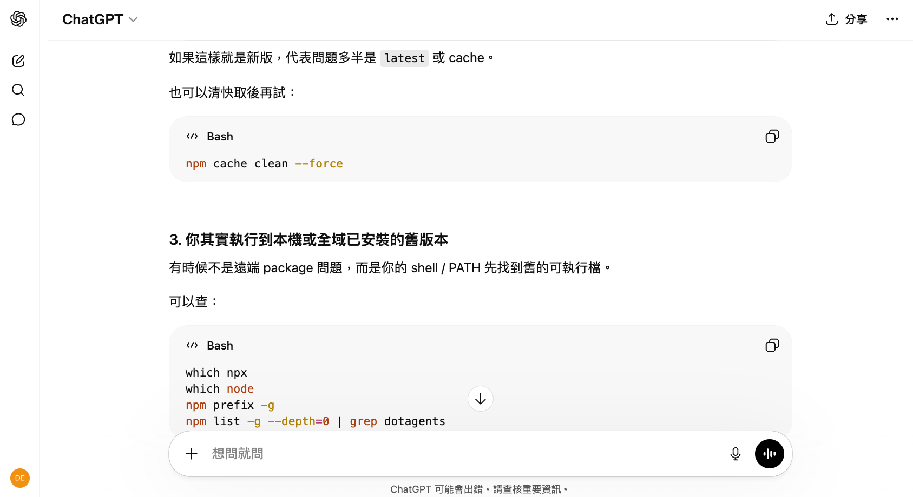
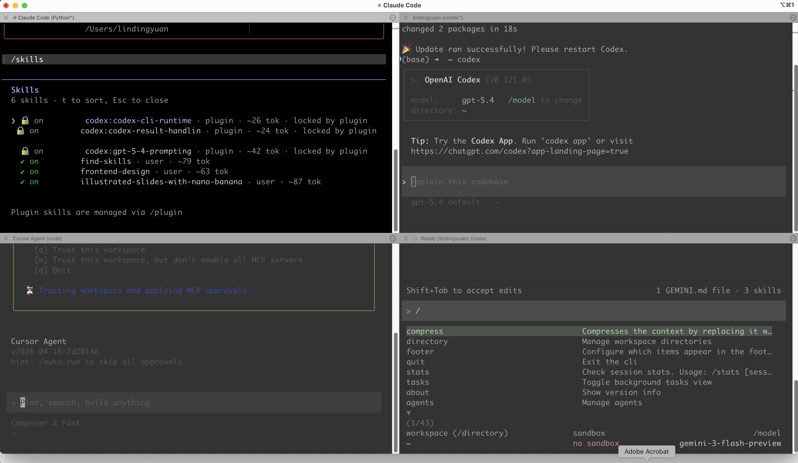
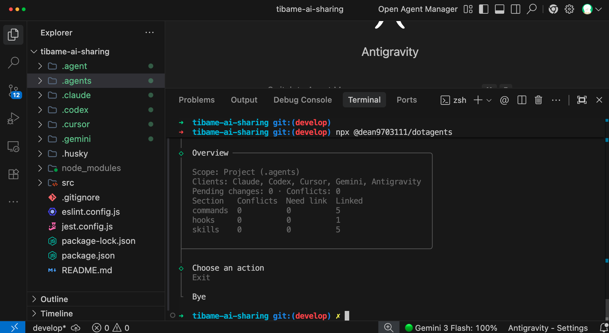
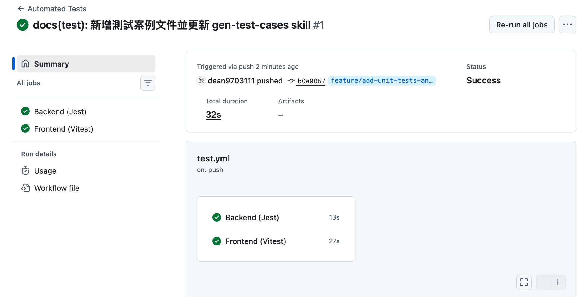

# 常見痛點：穩定性不足、難以維護、無法驗證

> 一句話 AI 就能生成有前端、後端、資料庫的系統，但...你敢用嗎？

## 不要讓 AI 的「快」，變成未來的「債」

### 😓 三大痛點

- **穩定性**：請 AI 解決目前的問題，改完後發現過去正常的功能被改壞了
- **複雜度**：功能持續增加，靠人工逐一確認流程，耗時又容易有遺漏
- **擴充性**：架構逐漸複雜後，任何修改都可能引發連鎖影響，出狀況時連問題都不知道如何定位

> **如果這些個問題能引起你的共鳴，恭喜你！**
> 這代表你已經進入了下一個階段，開始思考如何讓 Vibe Coding 的成果真正可靠。
> 其實在沒有 AI 的時代，這些問題就已經存在；**但 AI 寫程式速度太快，所以這些問題被加倍放大。**

### 💪 將 AI 導入工作流

[flow]
1. Lint — 檢查程式碼風格，避免 AI 生成`風格不一致`，留下`多餘程式`，增加 Code Review 負擔。
2. OpenSpec - `讓 AI 根據規格文件做事`，完成從 0 到 1 的建立，更處理從 1 到 100 的迭代
3. 客製化 Agent Skills - 拆分 Commit 讓`邏輯可被追朔`、定義 Branch `命名規則`、設計 PR 方便 `Code Review`
4. 導入測試 - 確保`新功能`符合預期，`舊功能`執行穩定，並透過`測試覆蓋率報告`了解實際狀況
5. Git Flow - 加入`版本控制`與`分支策略`，確保出包時有回頭路，以及不影響到正式版本
6. CI/CD - 透過自動化工作流`檢查格式、測試功能`，並設定要`保護的 Branch`
[/flow]


---

# AI 時代下的迷思：從解決痛點的過程，學習工具

## 挑選合適的工具
> **不要再當搬運工了！**
> 網頁版的 AI 只能告訴你該怎麼做，AI Agent 能直接幫你完成工作。

### 🌐 網頁版 AI 的痛點

**1. 需要打開瀏覽器操作：** 開啟`新對話`後，又得重講專案背景
**2. 難以給予完整上下文：** 手動複製`程式碼`、`錯誤訊息`，AI 無法了解專案全貌（功能相依性、資料夾結構），容易誤判
**3. 要自己手動修改程式：** AI 給予答案後，你要`自行編輯程式`，但容易發生貼錯、少貼的狀況
**4. 驗證與測試要自己做：** 不管提示詞再好，AI 還是可能犯錯，`來回溝通成本高`



### 🖥️ AI Agent 的優勢

**1. 看到整個專案的檔案和程式內容：**不只是一段段貼給 AI，而是`讓 AI 了解你全部的程式脈絡`，減少誤判。
**2. 可以直接增修檔案執行指令：**在調整完程式後，可以`直接測試確定符合預期`，不需要複製貼上來回確認。
**3. 查專案非常方便：**專案功能對應的程式、函式呼叫路徑，甚至可以`知道當初是誰寫`的這段程式。


## 了解 AI 的能力範圍，而不是盲從 

> **是我太爛嗎？**
> 社群媒體上，好像每個人用 AI 就能輕鬆完成專案，但我卻處處碰壁。

### 🌟 網路上的 Demo 都是精心挑選過的

#### 漂亮精美的網頁其實是框架的功勞：[Magic](https://magicui.design/)、[Aceternity](https://ui.aceternity.com/)


#### 一堆 AI Agent 同時執行，未必會更好



> **導入 AI，不代表全交給 AI**  
> 把`AI 能做到的事`跟`人必須負責的判斷`分清楚。
> 讓 AI Agent 執行很久，不一定最強；我不認為對專案毫無掌控度是件好事。
> **好的結果，不該靠消耗 Token 拼運氣；而是靠清楚的方向、可重複的工作流、以及人類在關鍵節點的決策。**

### 😰 出現新名詞很焦慮

[flow]
1. 先觀察一段時間 - 工具剛推出時往往不完善、沒有教學，上手難度也高
2. 是否有具體案例 - 是話題性產品，還是有具體的成功案例
3. 對你有幫助嗎 - 工具再好，也要自己用得上才有意義
[/flow]

> **培養批判性思考能力**
> 人的精力有限，`技術是學不完的`；要先培養出辨識問題的能力，然後思考如何解決，`工具只是在過程中學會罷了`。
> 現場遇到的問題都是不同的，沒有現成的解決方案，就要`自己設計`出來。

---

# 前置作業：課程會用到的工具、技術

## AI 是大腦，工具是雙手

### 🛠️ 環境準備
- **[Git](https://git-scm.com/install/windows)** — 版本控制工具，用來追蹤每次改動
- **[GitHub 帳號](https://github.com)** — 雲端 Git 儲存庫，用來管理專案
- **[nvm](https://github.com/nvm-sh/nvm)** — Node.js 版本管理工具，方便切換
- **[Python](https://www.python.org/downloads/)** — Agent Skills 的 scripts 大部分使用 Python 撰寫
- **[Cursor](https://cursor.com/)**、**[Antigravity](https://antigravity.google/)**、**[VSCode](https://code.visualstudio.com/)** — 安裝任一款程式碼編輯器（IDE）
- **[Docker](https://www.docker.com/)** — 獲得一致的開發環境
- **[cmux](https://cmux.com/zh-TW)** - 更好使用的終端機工具
- **[Claude 帳號](https://claude.ai/)** — 目前 Claude Code 需要 Pro 級別以上才能使用

```terminal [label="安裝 Node.js（透過 nvm）"]
nvm install --lts
nvm use --lts
node -v
```

#### macOS, Linux, WSL

```terminal [label="安裝 Claude"]
curl -fsSL https://claude.ai/install.sh | bash
```

#### Windows PowerShell

```terminal [label="安裝 Claude"]
irm https://claude.ai/install.ps1 | iex
```

#### Windows CMD

```terminal [label="安裝 Claude"]
curl -fsSL https://claude.ai/install.cmd -o install.cmd && install.cmd && del install.cmd
```
### 🖥️ 用終端機使用 Claude Code

```terminal [label="啟動 Claude"]
claude
```
[第一次啟動，會需要登入 Claude 帳號](./assets/login-claude.png)

### 📂 了解 Claude Code 工作目錄

[html]
<!DOCTYPE html>
<html lang="zh-Hant">
<head>
<meta charset="UTF-8">
<meta name="viewport" content="width=device-width, initial-scale=1.0">
<title>解析 .claude/ 資料夾結構</title>
<link href="https://fonts.googleapis.com/css2?family=Noto+Sans+TC:wght@400;500;700;900&family=JetBrains+Mono:wght@400;500;600&display=swap" rel="stylesheet">
<style>
  :root {
    --bg: #faf8f5;
    --card: #ffffff;
    --text: #1a1a1a;
    --text-secondary: #5c5c5c;
    --border: #e8e4df;
    --accent-project: #d35400;
    --accent-user: #2c7a7b;
    --folder: #e67e22;
    --file-json: #3498db;
    --file-md: #8e44ad;
    --file-skill: #27ae60;
    --file-agent: #e74c3c;
    --highlight: #fff8e1;
    --tag-bg: #f0ebe3;
    --shadow: 0 2px 12px rgba(0,0,0,0.06);
    --radius: 10px;
    --line-color: #d5cfc7;
  }

  * { margin: 0; padding: 0; box-sizing: border-box; }

  body {
    font-family: 'Noto Sans TC', sans-serif;
    background: var(--bg);
    color: var(--text);
    line-height: 1.7;
    padding: 24px 16px;
    max-width: 820px;
    margin: 0 auto;
  }

  h1 {
    font-size: 1.75rem;
    font-weight: 900;
    text-align: center;
    margin-bottom: 8px;
    letter-spacing: 0.5px;
  }
  h1 span.icon { font-size: 1.5rem; margin-right: 6px; }

  .subtitle {
    text-align: center;
    color: var(--text-secondary);
    font-size: 0.88rem;
    margin-bottom: 28px;
  }

  /* Tab switcher */
  .tabs {
    display: flex;
    gap: 6px;
    justify-content: center;
    margin-bottom: 24px;
  }
  .tab-btn {
    padding: 10px 22px;
    border: 2px solid var(--border);
    border-radius: 99px;
    background: var(--card);
    font-family: inherit;
    font-size: 0.9rem;
    font-weight: 700;
    cursor: pointer;
    transition: all 0.2s;
    color: var(--text-secondary);
    display: flex;
    align-items: center;
    gap: 6px;
  }
  .tab-btn:hover { border-color: #bbb; }
  .tab-btn.active-project {
    border-color: var(--accent-project);
    color: var(--accent-project);
    background: #fef5ed;
  }
  .tab-btn.active-user {
    border-color: var(--accent-user);
    color: var(--accent-user);
    background: #edf7f7;
  }
  .tab-btn .dot {
    width: 8px; height: 8px;
    border-radius: 50%;
    display: inline-block;
  }
  .tab-btn .dot.project-dot { background: var(--accent-project); }
  .tab-btn .dot.user-dot { background: var(--accent-user); }

  .tab-content { display: none; }
  .tab-content.active { display: block; }

  /* Tree */
  .tree {
    background: var(--card);
    border: 1px solid var(--border);
    border-radius: var(--radius);
    padding: 20px 18px;
    box-shadow: var(--shadow);
  }

  .tree ul {
    list-style: none;
    padding-left: 22px;
    position: relative;
  }
  .tree > ul { padding-left: 0; }

  .tree ul::before {
    content: '';
    position: absolute;
    left: 8px;
    top: 0;
    bottom: 14px;
    width: 1.5px;
    background: var(--line-color);
  }
  .tree > ul::before { display: none; }

  .tree li {
    position: relative;
    padding: 3px 0;
  }

  .tree ul > li::before {
    content: '';
    position: absolute;
    left: -14px;
    top: 16px;
    width: 14px;
    height: 1.5px;
    background: var(--line-color);
  }

  .node {
    display: inline-flex;
    align-items: center;
    gap: 6px;
    cursor: pointer;
    padding: 4px 10px;
    border-radius: 6px;
    transition: background 0.15s;
    font-size: 0.9rem;
    user-select: none;
  }
  .node:hover { background: var(--highlight); }

  .node .icon {
    font-size: 1rem;
    flex-shrink: 0;
    width: 20px;
    text-align: center;
  }

  .node .name {
    font-family: 'JetBrains Mono', monospace;
    font-size: 0.84rem;
    font-weight: 600;
  }
  .node .name.folder-name { color: var(--folder); }
  .node .name.json-name { color: var(--file-json); }
  .node .name.md-name { color: var(--file-md); }
  .node .name.skill-name { color: var(--file-skill); }
  .node .name.agent-name { color: var(--file-agent); }

  .node .toggle {
    font-size: 0.7rem;
    color: #999;
    transition: transform 0.2s;
    margin-left: 2px;
  }
  .node .toggle.open { transform: rotate(90deg); }

  .node .tag {
    font-family: 'Noto Sans TC', sans-serif;
    font-size: 0.7rem;
    font-weight: 500;
    padding: 1px 8px;
    border-radius: 99px;
    background: var(--tag-bg);
    color: var(--text-secondary);
    white-space: nowrap;
  }
  .tag.git { background: #e8f5e9; color: #2e7d32; }
  .tag.gitignore { background: #fff3e0; color: #e65100; }
  .tag.personal { background: #fce4ec; color: #c62828; }

  .children { overflow: hidden; transition: max-height 0.3s ease; }
  .children.collapsed { max-height: 0 !important; }

  /* Description tooltip */
  .desc-panel {
    margin: 6px 0 8px 34px;
    padding: 10px 14px;
    background: #fdfcfa;
    border-left: 3px solid var(--border);
    border-radius: 0 6px 6px 0;
    font-size: 0.82rem;
    color: var(--text-secondary);
    line-height: 1.65;
    display: none;
  }
  .desc-panel.show { display: block; animation: fadeIn 0.2s ease; }

  @keyframes fadeIn {
    from { opacity: 0; transform: translateY(-4px); }
    to { opacity: 1; transform: translateY(0); }
  }

  .legend {
    display: flex;
    flex-wrap: wrap;
    gap: 12px;
    justify-content: center;
    margin-top: 20px;
    font-size: 0.78rem;
    color: var(--text-secondary);
  }
  .legend span { display: flex; align-items: center; gap: 4px; }

  .footer-note {
    text-align: center;
    margin-top: 24px;
    padding: 16px;
    background: var(--highlight);
    border-radius: var(--radius);
    font-size: 0.82rem;
    line-height: 1.7;
    color: var(--text-secondary);
  }
  .footer-note strong { color: var(--text); }

  .scope-badge {
    display: inline-block;
    font-size: 0.68rem;
    font-weight: 700;
    padding: 2px 8px;
    border-radius: 4px;
    margin-left: 6px;
    vertical-align: middle;
  }
  .scope-badge.shared { background: #e8f5e9; color: #2e7d32; }
  .scope-badge.local { background: #fff3e0; color: #e65100; }
</style>
</head>
<body>
<div class="tabs">
  <button class="tab-btn active-project" data-tab="project" onclick="switchTab('project')">
    <span class="dot project-dot"></span>專案層級 .claude/
  </button>
  <button class="tab-btn" data-tab="user" onclick="switchTab('user')">
    <span class="dot user-dot"></span>使用者層級 ~/.claude/
  </button>
</div>

<!-- ========== PROJECT TAB ========== -->
<div class="tab-content active" id="tab-project">
<div class="tree" id="tree-project"></div>
</div>

<!-- ========== USER TAB ========== -->
<div class="tab-content" id="tab-user">
<div class="tree" id="tree-user"></div>
</div>

<div class="legend">
  <span>📂 資料夾</span>
  <span style="color:var(--file-json)">⚙ JSON 設定</span>
  <span style="color:var(--file-md)">📝 Markdown</span>
  <span style="color:var(--file-skill)">◇ Skill</span>
  <span style="color:var(--file-agent)">🤖 Agent</span>
</div>

<script>
// ===== DATA =====
const projectTree = {
  name: 'your-project/', nameClass: 'folder-name', icon: '📂', folder: true, open: true,
  children: [
    { name: 'CLAUDE.md', nameClass: 'md-name', icon: '📝', tags: ['commit to git'],
      desc: '主要文件（Claude read first）：這是你的專案設說明書，Claude 優先閱讀，包含核心專案資訊。' },
    { name: 'CLAUDE.local.md', nameClass: 'md-name', icon: '🔒', tags: ['.gitignore'],
      desc: '個人設定（僅你可見）：這裡的設定只對你自己的 Claude 實例生效，用來覆蓋 CLAUDE.md 的內容。' },
    { name: '.claude/', nameClass: 'folder-name', icon: '📂', folder: true, open: true,
      desc: '這是 Claude 的專用設定與知識庫資料夾。',
      children: [
        { name: 'settings.json', nameClass: 'json-name', icon: '⚙️', tags: ['commit to git'],
          desc: '專案規範與設定：定義 Claude 的預設權限（如檔案存取）和全域專案設定。預設提交到 Git，團隊共用。' },
        { name: 'settings.local.json', nameClass: 'json-name', icon: '🔒', tags: ['.gitignore'],
          desc: '個人權限覆蓋：覆蓋全域權限設定，僅你可見。（務必 Git 忽略！）' },
        { name: 'commands/', nameClass: 'folder-name', icon: '📂', folder: true,
          desc: '自定義指令（斜線）：這些檔案定義了你的專案專用指令，你可以用 / 按鍵觸發。已與 skills 合併，舊檔案仍可使用。',
          children: [
            { name: 'review.md', nameClass: 'md-name', icon: '📝',
              desc: '觸發指令：/project:review — 自定義的程式碼審查指令。' },
            { name: 'fix-issue.md', nameClass: 'md-name', icon: '📝',
              desc: '觸發指令：/project:fix-issue — 自動修復 issue 的工作流。' },
            { name: 'deploy.md', nameClass: 'md-name', icon: '📝',
              desc: '觸發指令：/project:deploy — 部署流程自動化指令。' }
          ]
        },
        { name: 'rules/', nameClass: 'folder-name', icon: '📂', folder: true,
          desc: '專案規則與規範：這裡是 Claude 理解你的專案準個模組，讓 Claude 更好理解和最佳實踐的地方。',
          children: [
            { name: 'code-style.md', nameClass: 'md-name', icon: '📝',
              desc: '程式碼風格規範：定義你的 coding style、命名規則、格式偏好。' },
            { name: 'testing.md', nameClass: 'md-name', icon: '📝',
              desc: '測試規範：定義如何寫測試、測試框架選擇、覆蓋率要求。' },
            { name: 'api-conventions.md', nameClass: 'md-name', icon: '📝',
              desc: 'API 慣例：定義 API 設計規範、端點命名、錯誤處理模式。' }
          ]
        },
        { name: 'skills/', nameClass: 'folder-name', icon: '📂', folder: true,
          desc: '自動化工作流：此資料夾中的 SKILL.md 文件，定義了在特定事件發生時，Claude 自動執行的工作流。',
          children: [
            { name: 'security-review/', nameClass: 'skill-name', icon: '◇', folder: true,
              desc: '安全審查技能：提交代碼前自動進行安全審查。',
              children: [
                { name: 'SKILL.md', nameClass: 'skill-name', icon: '📄',
                  desc: '技能定義檔：包含 YAML frontmatter（name, description）和具體指令，Claude 會根據描述自動觸發。' }
              ]
            },
            { name: 'deploy/', nameClass: 'skill-name', icon: '◇', folder: true,
              desc: '部署技能：自動觸發的部署工作流。',
              children: [
                { name: 'SKILL.md', nameClass: 'skill-name', icon: '📄',
                  desc: '技能定義檔：定義部署時 Claude 要自動執行的步驟與檢查項目。' }
              ]
            }
          ]
        },
        { name: 'agents/', nameClass: 'folder-name', icon: '📂', folder: true,
          desc: '子代理定義：這裡是你可以定義具有特定角色、知識、權限的子代理的地方。每個代理在獨立的 context window 中運作。',
          children: [
            { name: 'code-reviewer.md', nameClass: 'agent-name', icon: '🤖',
              desc: '代碼審查代理：具有唯讀存取權限，專門做程式碼審查。可指定 model（如 haiku）和限定 tools（Read, Grep, Glob）。' },
            { name: 'security-auditor.md', nameClass: 'agent-name', icon: '🤖',
              desc: '安全稽核代理：專用安全工具存取，高隔離度。只能讀取檔案，不能寫入，確保安全審計的獨立性。' }
          ]
        }
      ]
    }
  ]
};

const userTree = {
  name: '~/', nameClass: 'folder-name', icon: '🏠', folder: true, open: true,
  children: [
    { name: 'CLAUDE.md', nameClass: 'md-name', icon: '📝',
      desc: '全域使用者記憶：跨所有專案生效的個人偏好與指令。優先級低於專案的 CLAUDE.md。' },
    { name: '.claude/', nameClass: 'folder-name', icon: '📂', folder: true, open: true,
      desc: '使用者層級的 Claude 設定根目錄，跨所有專案生效。',
      children: [
        { name: 'settings.json', nameClass: 'json-name', icon: '⚙️',
          desc: '全域使用者設定：你的個人預設偏好，包括慣用模型（如 claude-opus-4-5）、主題、清理週期等。優先級低於專案設定。' },
        { name: 'settings.local.json', nameClass: 'json-name', icon: '🔒',
          desc: '使用者本機設定：個人機器專屬設定，不同步到其他裝置。' },
        { name: 'credentials.json', nameClass: 'json-name', icon: '🔑',
          desc: '認證資訊：儲存 API Key 和登入 token。由 Claude Code 自動管理，請勿手動修改。' },
        { name: 'skills/', nameClass: 'folder-name', icon: '📂', folder: true,
          desc: '個人全域技能：放在這裡的技能跨所有專案可用，不需要每個專案重複設定。',
          children: [
            { name: 'my-skill/', nameClass: 'skill-name', icon: '◇', folder: true,
              children: [
                { name: 'SKILL.md', nameClass: 'skill-name', icon: '📄',
                  desc: '個人技能定義檔：定義你自己的可重用工作流，在任何專案中都能自動觸發或用 /skill-name 呼叫。' }
              ]
            }
          ]
        },
        { name: 'agents/', nameClass: 'folder-name', icon: '📂', folder: true,
          desc: '個人全域代理：定義在這裡的代理跨所有專案可用。',
          children: [
            { name: 'my-agent.md', nameClass: 'agent-name', icon: '🤖',
              desc: '個人代理定義：你的常用子代理，可指定 model、tools、自訂 system prompt。在任何專案中都可被 Claude 呼叫。' }
          ]
        },
        { name: 'projects/', nameClass: 'folder-name', icon: '📂', folder: true,
          desc: '專案記憶快取：Claude Code 為每個專案自動建立的記憶目錄，儲存 auto-memory 資料。',
          children: [
            { name: '<project-hash>/', nameClass: 'folder-name', icon: '📂', folder: true,
              children: [
                { name: 'memory/', nameClass: 'folder-name', icon: '📂', folder: true,
                  desc: '自動記憶目錄：Claude 在對話中學到的事情會自動存在這裡，下次啟動時會自動讀取。' }
              ]
            }
          ]
        },
        { name: 'todos/', nameClass: 'folder-name', icon: '📂', folder: true,
          desc: 'Claude 的待辦清單：Claude Code 用來追蹤未完成任務的目錄。' },
      ]
    }
  ]
};

// ===== RENDER =====
let activeDescId = null;

function renderNode(node, depth = 0) {
  const li = document.createElement('li');
  const nodeEl = document.createElement('div');
  nodeEl.className = 'node';

  // Icon
  const iconSpan = document.createElement('span');
  iconSpan.className = 'icon';
  iconSpan.textContent = node.icon || '📄';
  nodeEl.appendChild(iconSpan);

  // Toggle arrow for folders
  if (node.folder) {
    const toggle = document.createElement('span');
    toggle.className = 'toggle' + (node.open ? ' open' : '');
    toggle.textContent = '▶';
    nodeEl.appendChild(toggle);
  }

  // Name
  const nameSpan = document.createElement('span');
  nameSpan.className = 'name ' + (node.nameClass || '');
  nameSpan.textContent = node.name;
  nodeEl.appendChild(nameSpan);

  // Tags
  if (node.tags) {
    node.tags.forEach(t => {
      const tag = document.createElement('span');
      tag.className = 'tag' + (t === 'commit to git' ? ' git' : t === '.gitignore' ? ' gitignore' : '');
      tag.textContent = t;
      nodeEl.appendChild(tag);
    });
  }

  li.appendChild(nodeEl);

  // Description panel
  const descId = 'desc-' + Math.random().toString(36).slice(2, 9);
  if (node.desc) {
    const descPanel = document.createElement('div');
    descPanel.className = 'desc-panel';
    descPanel.id = descId;
    descPanel.textContent = node.desc;
    li.appendChild(descPanel);
  }

  // Children
  let childrenContainer = null;
  if (node.children) {
    childrenContainer = document.createElement('div');
    childrenContainer.className = 'children' + (node.open ? '' : ' collapsed');
    const ul = document.createElement('ul');
    node.children.forEach(child => ul.appendChild(renderNode(child, depth + 1)));
    childrenContainer.appendChild(ul);
    li.appendChild(childrenContainer);
  }

  // Click behavior
  nodeEl.addEventListener('click', (e) => {
    e.stopPropagation();

    // Toggle folder
    if (node.folder && childrenContainer) {
      const toggle = nodeEl.querySelector('.toggle');
      childrenContainer.classList.toggle('collapsed');
      toggle.classList.toggle('open');
    }

    // Toggle description
    if (node.desc) {
      const panel = document.getElementById(descId);
      if (activeDescId && activeDescId !== descId) {
        const prev = document.getElementById(activeDescId);
        if (prev) prev.classList.remove('show');
      }
      panel.classList.toggle('show');
      activeDescId = panel.classList.contains('show') ? descId : null;
    }
  });

  return li;
}

function renderTree(containerId, data) {
  const container = document.getElementById(containerId);
  const ul = document.createElement('ul');
  ul.appendChild(renderNode(data));
  container.appendChild(ul);
}

function switchTab(tab) {
  document.querySelectorAll('.tab-content').forEach(el => el.classList.remove('active'));
  document.querySelectorAll('.tab-btn').forEach(el => {
    el.classList.remove('active-project', 'active-user');
  });
  document.getElementById('tab-' + tab).classList.add('active');
  const btn = document.querySelector(`[data-tab="${tab}"]`);
  btn.classList.add(tab === 'project' ? 'active-project' : 'active-user');
  activeDescId = null;
}

renderTree('tree-project', projectTree);
renderTree('tree-user', userTree);
</script>
</body>
</html>
[/html]

> **Tips**
> .claude/ 就像給 Claude 一本專屬手冊：告訴它你是誰（設定）、你可以做什麼（權限）、你想怎麼做（規則）、你希望它自動完成什麼（技能），以及特別的角色（代理）。
> 專案層級放在 your-project/.claude/，使用者層級放在 ~/.claude/，兩者會合併生效，專案設定優先。

### ⚙️ 初探 MCP / Rules / Commands / Skills

**1. MCP：**透過標準介面`呼叫其他工具的 API`，操作方式較穩定、可預期
**2. Rules：**`專案的規範`，通常不會寫太多，因為會佔用到上下文的空間
**3. Skills：**把日常工作中執行任務的細節、技巧、判斷模式放進去，AI 遇到`相關任務時會主動觸發`
**4. Commands：**可以設計完整工作流（ex: 執行多個 Skills），要`手動觸發`

### 🚫 禁止 Claude 使用危險指令

AI 會執行的指令是無法完全預期的，為了減少悲劇發現，我們可以透過設定來阻止。

```prompt [label="要求修改設定"]
我希望 Claude 在默認的 settings 禁止下面的指令（其他原有設定要保留）：
- 刪除：rm -rf, rm -fr, rm -r, rm -R, rm -f
- 最高權限：sudo
- 磁碟破壞：dd, mkfs, diskutil erase
- 權限濫用：chmod 777, chmod -R 777
- Git 不可逆操作：reset --hard, push --force, push -f, clean -f, branch -D
- 系統關機/重開：shutdown, reboot
- 檔案清空：: >, truncate
完成後給我看設定檔
```

---

# 開發實戰：將 AI 導入開發工作流
> **Work Smart, Don't Work Hard**  
> 在 AI 時代，寫了多少行程式、完成幾個 feature、修了多少 bug，已經不像過去那麼重要了。
> 但如果能把某個協作環節變順，讓大家少踩坑、少重工、少在無聊的事情上浪費時間，那會給你帶來 **Credit** 與 **可累積的職涯資本**。

## 不管 Prompt 多完美，AI 都可能犯錯

> **把 AI 犯錯當成必然**
> 比起讓 AI 永不犯錯，更重要的是設計當 AI 犯錯時警告的通知！

### 🗂️ 課程範例 Repository

[下載 Repository](https://github.com/deancourse/tku-ai-sharing) 後，可以跟著課程進度操作，裡面有事先安裝好的 Agent Skills（放在 `.agents` 資料夾下）

```terminal [label="Clone 課程 Repo"]
git clone git@github.com:deancourse/tku-ai-sharing.git
cd cake-2026-build-with-ai
```

> **還沒設定 SSH Key？**
> 如果 clone 失敗，代表尚未設定 GitHub SSH 金鑰。
> 請參考 [GitHub 官方教學](https://docs.github.com/en/authentication/connecting-to-github-with-ssh) 完成設定，或改用 HTTPS：`https://github.com/deancourse/cake-2026-build-with-ai.git`

### 🚀 懂技術會讓 AI 效能加倍

**1. AI 有一定隨機性：**即使有 Rules 規範，AI 生成的格式（ex: 縮排、引號）可能`每次都不一樣`，而且有可能`動到原有邏輯`。
**2. 加上 Pre-commit：**Commit 前確保專案 `Coding Style 一致性、測試都通過`。


### 🤖 可以使用不同的 AI Agent

雖然課程講的是 Claude Code，但 Cursor、Codex、Antigravity 這些`主流工具都支援 MCP / Rules / Commands / Skills`。

每個 AI Agent 的路徑稍不同，可以使用 [dotagents](https://github.com/dean9703111/dotagents) 來協助建立 symlinks。

```prompt [label="將 Agent Skills 同步到指定的 AI Agent"]
npx @dean9703111/dotagents
```



## 新專案:規格驅動開發（SDD）

### 🔧 為什麼需要 OpenSpec？

- AI 寫程式越來越快，但專案越改越亂，甚至越改越壞
- 關鍵人物離職，沒有文件，系統知識直接斷層
- **解法：**白話文對話 → AI 自動建立規格文件 → 根據規格驅動開發

### 📦 安裝與初始化

```terminal [label="安裝指令"]
npm install -g @fission-ai/openspec@latest
openspec init
```

- **Skills** — AI 在對話過程中自動觸發的技能包，不需要背指令
- **Commands** — 用 `/opsx` 前綴強制驅動：apply / archive / explore / propose
- 可透過 `openspec config profile` 擴充更多 workflows

```prompt [label="查看 Skill"]
我想知道 openspec 目前安裝的 skill 用途
請使用表格呈現，用白話簡短描述
```

### 🎯 Prompt 設計三要素

[flow]
1. 專案目標 — 大方向描述需求，AI 會釐清細節
2. 使用技術 — 指定使用技術，便於團隊接手
3. 細節討論 — 提醒 AI 主動提問，釐清模糊需求
[/flow]

> 使用「Plan Mode」，並請 AI 與自己釐清細節會得到更好的結果；下面 Prompt 是讓大家快速體驗完整流程

```prompt [label="建立 MVP 系統"]
設計車輛管理系統，包含以下功能：
- 登入頁面（帳號密碼驗證，區分管理者與一般使用者）
- 首頁儀表板（上方顯示關鍵數據卡片，下面顯示資料圖表）
- 車輛管理頁（可檢視、新增、編輯、刪除車輛資料）
- 員工管理頁（僅管理者可檢視、新增、編輯、刪除員工資料）

前端使用 React 搭配 Magic UI，使用 MSW Mock API 模擬後端回應
參考 openspec 的 skill 執行，以最小可行性方案來規劃
```

### 📋 OpenSpec 如何建立文件規格

[flow]
1. proposal.md — 確認目標與範圍
2. design.md — 技術選型與風險評估
3. specs/ — 按功能分類的詳細規格
4. task.md — 任務清單，完成自動打勾
[/flow]

```prompt [label="開始實作"]
開始實作
```

### 🚀 啟動專案進行歸檔

第一次啟動可以請 AI 幫忙，因為 AI 有很高的機率在第一版遇到零星錯誤

```prompt [label="讓 AI 協助啟動"]
請幫我啟動專案
```

初步確認功能符合預期後，請他將變更歸檔

```prompt [label="歸檔"]
功能符合預期，進行歸檔
```

> **AI 正在改變企業決策**
> 過去出缺勤、考核這類內部系統，企業通常找廠商購買、支付年費維護。但 Vibe Coding 的出現正讓企業做出不同的選擇。
>
> 有些企業導入 Vibe Coding 的目標不是取代工程師，而是讓熟悉業務的人有能力設計出符合使用需求的產品原型，再交給工程師做優化與維護。
>
> 用 OpenSpec 建立規格文件 — 就是讓這個交接過程有據可循，而不是一團無文件的程式碼丟過去。

## 建立專案規則

### 📐 生成 CLAUDE、OpenSpec 專案參考規則

**CLAUDE.md** 是給「做事」用的，**openspec/config.yaml** 是給「規劃」用的

```prompt [label="初始化規則"]
/init
```

```prompt [label="OpenSpec 設定"]
Please read openspec/config.yaml and help me fill it out
with details about my project, tech stack, and conventions
```

### 🗂️ 設計 README.md、.gitignore 並加入版控

初版完成後，要加入版控；未來更新時，才會清楚 AI 到底改了哪些細節

```prompt [label="設計 .gitignore、README.md"]
請幫我設計專案的「.gitignore」但「.claude、openspec」要加入版本控制
並且將「專案簡介與啟動方式」寫入 README.md
```

> 先使用內建的 AI 來 Generate Commit，Commit 後將變更 Sync Changes 更新上去

## 舊專案:如何完成從 1 到 100 迭代

### ✨ 用 OpenSpec 新增新功能

[flow]
1. 閱讀專案既有架構、功能 — 確認要新增還是修改
2. 開始設計規格文件 - 一樣跑「proposal ⭢ design ⭢ specs ⭢ task」
3. 完成任務後，彙整河道原有規格 - 對快速迭代、多人合作專案幫助極大。
[/flow]

```prompt [label="新增功能"]
增加使用者紀錄頁面，供管理者查看
使用 OpenSpec
```

```prompt [label="確認後實作"]
開始實作
```

> **為什麼 1 到 100 比 0 到 1 更難？**
> 如果沒有規格文件，下次改功能時 AI 不知道之前的設計邏輯，可能把同一個功能重複寫好幾次，或改 A 壞 B。
>
> 用 OpenSpec 每次迭代都會在 Source Control 留下規格變更，AI 跟人類都有文件可以參考。關鍵人物離職最痛的不是少了一個人，而是系統知識直接斷層。

```prompt [label="歸檔變更"]
幫我歸檔
```


> **為什麼 1 到 100 比 0 到 1 更難？**
> 如果沒有規格文件，下次改功能時 AI 不知道之前的設計邏輯，可能把同一個功能重複寫好幾次，或改 A 壞 B。
>
> 用 OpenSpec 每次迭代都會在 Source Control 留下規格變更，AI 跟人類都有文件可以參考。關鍵人物離職最痛的不是少了一個人，而是系統知識直接斷層。

```prompt [label="新增分支"]
生成 branch
```

## 導入測試：讓維護與擴充更有底氣
> 市場不會為爛產品買單；加入自動化測試，是 Vibe Coding **從玩具走向產品的關鍵**

### 🛡️ 為什麼 Vibe Coding 一定要測試？

[flow]
1. 穩定性 — 請 AI 修 bug，結果舊功能壞掉
2. 複雜度 — 功能越多，人工測試越不可能覆蓋全部
3. 擴充性 — 功能間有相依性，修改可能引發連鎖影響
[/flow]

### 🔄 建立適合專案的測試工作流

[flow]
1. 建立資料夾 — 存放測試清單
2. AI 撰寫清單 — 類型、說明、輸入、期待輸出
3. 人類 Review — 確認情境有無遺漏
4. AI 撰寫測試 — 描述與文件一致
5. 自主驗證 — 最多嘗試 5 次
[/flow]

```prompt [label="生成測試案例"]
（拖入要測試的檔案，ex: src/pages/LoginPage.tsx）
生成測試
```

> **從玩具到產品，差的就是測試**
> 很多時候 AI 只是修好了眼前的錯誤，但過程中改壞了過去的邏輯。**千萬不要嫌寫測試浪費時間，測試其實是在幫你加速開發。**
>
> 現在儘管有 AI 輔助撰寫測試程式，我們還是要仔細檢查 AI 給的測試情境是否合理、有遺漏。

### 💡 實務建議
- 不要一口氣生成所有測試，先放一個檔案確認結果符合預期
- 每個頁面/模組有獨立的測試程式，方便定位問題
- 測試案例會隨規格變更而調整，不可能一次到位

## 建立自動化測試（CI/CD）

### 🔁 自動化測試流程
- 每次推送到 GitHub 都觸發測試
- 測試完畢生成覆蓋率報告
- 設定 Branch Protection Rule，測試通過才能合併到主分支

> **測試覆蓋率不需追求 100%**
> 重要邏輯都包含在測試程式內，才是最重要的；有了測試，規格書上的功能才能被真正驗證。

```prompt [label="自動化測試"]
我希望在 GitHub Action 加入自動化測試的流程
每一個分支將更新推送到 GitHub 都會觸發一次自動化測試
```



# 專案協作:建立適合的 Agent Skills

> **建立客製化 Skill 的重要性**
> 每間公司都有自己的工作流，不同專案也有各自的情境；而 Agent Skills 讓每次達成的目標，成為下次的起點。
> **根據需求建立 Agent Skills，畢竟能實際給予幫助的，才是好的 Skill。**
## 拆分 Commit 讓變更可以被追蹤

### 📝 為什麼需要 Commit Skill？
- 分析變更的檔案 → 判斷應拆成幾個 commit → 分段提交
- 不同功能的修改分開 commit，讓邏輯可被追蹤
- 保持好習慣：每做完一件事就 commit，不要多功能混一起

[tags]
- [orange] 人工手打：耗時且風格不一致
- [purple] AI 自動生成：長短隨機、中英混雜
- [green] 解法：git-smart-commit Skill
[/tags]

```prompt [label="拆分 Commit"]
新增 commit
```


> **為什麼 Agent Skills 可以節省 Token?**
> 因為只讀取 Meta data（name、description），description 的重點不是描述 Skill 要做什麼，而是**在哪些情境會被觸發**。

## 設計 PR 讓 Code Review 更輕鬆

### 🔀 git-pr-description Skill

- 比對當前分支與目標分支的差異
- 讀取 commit 訊息與變更檔案
- 參考 `pr-template` 生成 Title 與 Description（漸進式揭露）

```prompt [label="生成 PR"]
撰寫 PR，與 develop branch 比對
```


> **人，才是 AI 的瓶頸**
> Code Review 的速度已經跟不上 AI 寫程式的速度。當人成為 AI 的瓶頸時，要去想的是如何**降低門檻，而不是放棄審核。**
>
> **設計 Commit、PR 的 Skill 就是透過優化流程讓開發更順暢。**雖然每一步都是 AI 在執行，但如果沒有實務經驗，其實不知道怎麼串起這些工具。**真正值錢的不是工具本身，而是知道什麼時候用、怎麼組合。**

## 透過 Git Worktree 提升協作效率

### 🌳 讓每個 AI Agent 有獨立的工作區

- 多人協作專案時，你可能要同時撰寫**新功能、Code Review、修 Bug**
- 用 Git Stash 時常會混亂
- 使用 Worktree 可以區隔工作區，AI 可以獨立運作


> **使用心得**
> Git Worktree 主要的目的不是「平行開發」，而是方便處理不同性質的「任務」。
> AI 執行的效率已經非常高了，與其平行開發後解衝突，還不如把精力放在 Code Review 上面確保專案穩定性。

---

# 總結：今天的三大主軸

[summary]
- 🏗️ **痛點** | AI 寫程式很快，但**穩定性不足、難以維護、無法驗證**，這些問題在 AI 時代被加倍放大
- 🛠️ **技術** | 安裝系統環境、理解 **MCP / Rules / Commands / Skills** 核心概念，打好與 AI 協作的基礎
- ⚙️ **方案** | 用 **SDD** 規格驅動開發、設計 **Commit / Branch / PR Skills**，**導入測試與 CI/CD**，讓流程可靠可追蹤
[/summary]

[bonus title="🎁 幕後製作心得"]
這個課程網頁的製作，走過了一段從「結果不可控」到「完全掌控」的歷程。

1. **遇到痛點** — Vibe Coding 出來的網頁，調整內容都要改 HTML，非常不方便
2. **逆推結構** — 讓 AI 把現有網頁拆解，對應成一套可用 Markdown 撰寫的格式
3. **內容與版型分離** — 只需改 Markdown，自動套用對應版型，細節完全可控
4. **設計 Agent Skill** — 不是讓 AI 生成網頁，而是讓 AI 學會「這份 Markdown 怎麼寫」
5. **模板生成器思維** — AI 負責生成結構化內容，程式再把內容轉成最終網頁
[/bonus]

[qa-session title="Q&A 時間"]
[/qa-session]
