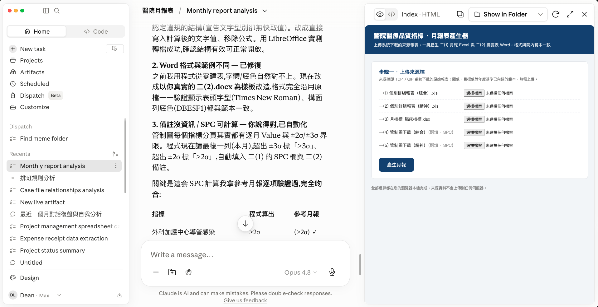
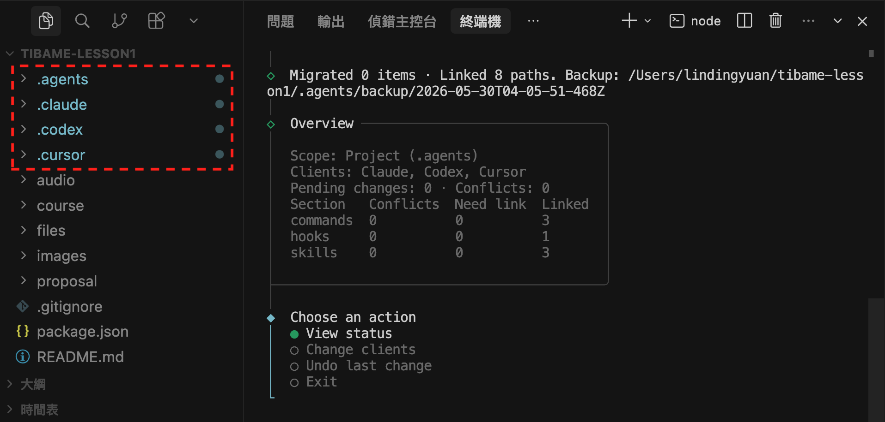
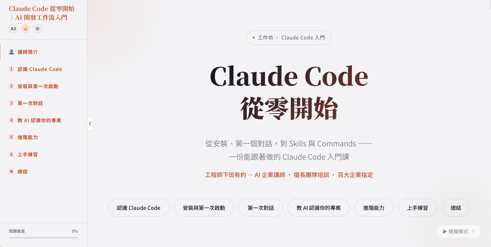
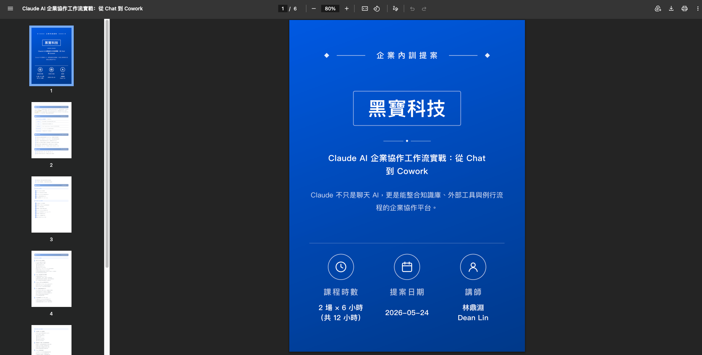
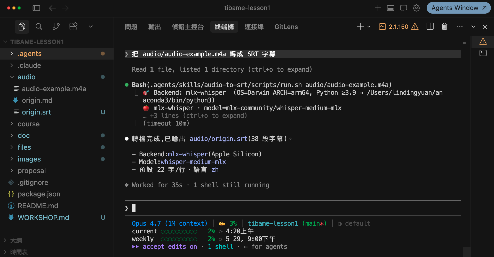

[interactive title="開場調查：你和 AI 的距離"]
現場舉手、線上留言區打上代號都可以，先讓我認識一下大家 👋

**Q1｜你用 AI（ChatGPT／Claude／Gemini…）的頻率是？**
`A` 幾乎每天　`B` 偶爾用用　`C` 幾乎沒碰過

**Q2｜你有付費訂閱過 AI 嗎？**
`A` 有，還在用　`B` 只用過免費版　`C` 完全沒用過
[/interactive]

# 關鍵心法：AI 浪潮下的減壓工作哲學

## 沒有基礎也可以寫程式嗎？

> **學 Vibe Coding 不是為了成為工程師**
> Vibe Coding 是為了解決`你目前遇到的痛點`，這個痛點可能存在於`公司、部門、團隊、個人`，但一直沒有解決。
> 而這堂課，就是讓大家了解，在 AI 時代`原來我能靠自己`踏出第一步。

### 我過去分享了十幾部教學影片

[youtube id="2hbYCe_E5aU" title="Vibe Coding 學習地圖"]


### 在科技公司、政府機關、學術機構教學

[flow]
- 科技公司 — 目標是把 AI 導入開發的每個環節`撰寫規格、版本控制、自動化測試、團隊合作`
- 政府機關 — 想透過 AI 提升`行政效率、資料整合、決策品質`
- 學術機構 — 老師更在意 AI 在`優化教材、加快備課、快速出題`的應用
[/flow]


### 🧰 需求不同，適合的工具也不同

[flow]
- **工程師** - 習慣用 IDE（程式碼編輯器），因此會選 Claude Code、Codex、Cursor 這類專業的工具，但門檻較高
- **政府機關、學術機構** - Claude App、ChatGPT、Gemini 就很夠用，適合 Vibe Coding 入門。
[/flow]


> **不用追「最專業」的工具，選擇「能解決你問題」的工具**
> 能把手上的問題解決掉，那就是對你最好的工具。

### 🤔 工具太多不知道如何選

| 需求 | ChatGPT（OpenAI） | Gemini（Google） | Claude（Anthropic） |
|---|:---:|:---:|:---:|
| 日常應用（問答、寫作、生成圖片） | 差異不大 | 差異不大 | 無法生成圖片 |
| 直接存取／操作你電腦的檔案 | Codex App | Antigravity App | Cowork |
| 撰寫程式、做自動化專案 | Codex CLI | Gemini CLI | Claude Code CLI |

> **工具有差異，但沒有想像中的大**
> **三大巨頭你追我趕**：一家出新功能，另外兩家很快跟上，`大部分功能都有對標產品`。

[interactive title="你的 AI 使用體驗"]
**Q1｜請 AI 幫忙時，你最常遇到哪種狀況？**
`A` 結果不如預期　`B` 同個問題一直鬼打牆　`C` 還算滿意好用

**Q2｜目前 AI 在你的工作裡是？**
`A` 每天的好幫手　`B` 偶爾試試看　`C` 還沒真的用上
[/interactive]

## 從自己的需求出發

### 🐛 Vibe Coding 遇到錯誤是很正常的

[flow]
- 遇到錯誤 - Vibe Coding 過程`一定會遇到錯誤`
- 解決錯誤 - 如果沒有開發背景，能不能解決錯誤，是看`這個痛點對你來說夠不夠痛`
- 讓自己多嘗試一點 - 如果成功解決問題，這個`成就感與經驗`是非常寶貴的。
[/flow]

> **我們可以有野心，但先從 MVP 開始**
> 不要想如何做出改變世界的產品，先嘗試把手邊麻煩的任務交給 AI 做自動化。

### 🎯 用日常工作開始嘗試，因為你有分辨對錯的能力

[flow]
- 別再做「記帳軟體」這類練習專案了 — 因為 AI 可以幫你輕鬆搞定，`缺少挫折的學習曲線幫助不大`，因為製作過程缺乏思考。
- 從「日常工作」的痛點出發 - 你有能力`分辨對錯`，在遇到錯誤時`解決的動力才夠`
- 陌生領域你不知道 AI 犯錯 - AI 有能力做出`看起來正確的產品`，但如果是你熟悉的流程，一眼就能看出問題
[/flow]

> **課前訪談小故事**
> 教學前為了讓`內容更符合單位需求`，我會先跟窗口做需求訪談。
> 有次收到`人力資源部門`邀約，他們主管說會安排這堂課是因為：「開發的人不用系統，用系統的人不會開發。」
> - **原因**: 內部出缺勤、考核系統年代久遠，很難操作；但開發的工程師都不在了，新需求在技術部門的權重太低
> - **方案**: 掌握`規格驅動開發`的技巧，並了解開發團隊`使用的技術`，這樣未來才能銜接、維護

### 🎁 如果今天分享的案例有錯，其實是好事

[flow]
- 永遠保持判斷能力 - 不要`完全相信 AI 的建議`，講師的範例`也未必絕對正確`
- 如果案例有錯 - 現場`直接舉手`，線上`可以留言`；錯誤不可怕，怕的是沒人發現。
- 培養解決問題的能力 - `發現錯誤、定義錯誤、解決錯誤`，這才是 AI 時代不會淘汰的能力。
- 假使一切都很順暢 - 通常是`挑過的情境`，實務操作一定會遇到阻礙
- 能挑出我的錯 - 代表你`對自己的工作非常熟悉`
[/flow]

## AI 設計的月報表、排班工具

> **AI 能做出什麼成果？**
> 這兩個工具是 Claude 參考`醫院範本案例（已去除敏感資訊）`製作出來的。

### 📊 月報表

- 痛點：品質指標月報要逐筆對數值、判燈號、看 SPC 圖、再複製貼到 WORD 摘要表
- 成品：AI 讀來源報表 → 自動填值判燈號 → 產出摘要表

[download dir="project-memory" label="下載「月報表」完成範例包" desc="解壓後有月報表相關檔案"]




### 🗓️ 排班

- 痛點：護理師排班要顧最低人力、連續天數、11 小時休息、包班……
- 成品：AI 給初版 → 逐條檢查有沒有違規 → 標出來讓你決定

[download dir="project-memory" label="下載「排班」完成範例包" desc="解壓後有排版相關檔案"]


> **呈現結果，是為了讓你相信「辦得到」**
> 但請記住：這些成品不是「一句話靠一句話就能生成」，**中間有方法、有風險、也有失敗**。這些都是`今天要分享的重點`。
> 另外就算指令相同，`每次生成的結果都會有差異`，因為生成式 AI 的本質是「文字接龍」。

## AI 的能力是全方位的

> **不同身份讓我更深挖 AI 的潛力**
> 我這個人很貪心，本業是工程師，副業是講師、作家、YouTuber。
> 所以我持續嘗試`更有效率的工作方式`。

### 📥 可以下載講者 GitHub 範例練習

[下載或 Fork 練習用 Repository](https://github.com/deancourse/tsgh) 後，可以跟著課程進度操作

```terminal [label="下載範例 Repository"]
git clone git@github.com:deancourse/tsgh.git
cd tsgh
```

> **這堂課為什麼選擇 Cowork 而非 Claude Code？**
> 因為 Cowork `不需要安裝環境，有內建的 Sandbox`（Linux 環境）
> 而 Claude Code `需要安裝 Git/nvm/Node.js/Python/IDE(程式碼編輯器)...` 等多個工具，AI 才能順利做事；且需要在終端機下指令，門檻較高

### 🤖 可以使用不同的 AI Agent

每個 AI Agent 的路徑稍不同，可以使用 [dotagents](https://github.com/dean9703111/dotagents) 來協助建立 symlinks。

```prompt [label="將 Agent Skills 同步到指定的 AI Agent"]
npx @dean9703111/dotagents
```



### 📝 輸入主題生成線上講義

```prompt [label="觸發 Skill 就會使用對應的 Template"]
幫我做一份「Claude Cowork 從零開始」的課程網頁
```



[bonus title="🎁 製作心得"]
這個課程網頁的製作，走過了一段從「結果不可控」到「完全掌控」的歷程。

1. **遇到痛點** — Vibe Coding 出來的網頁，調整內容都要改 HTML，非常不方便
2. **逆推結構** — 讓 AI 把現有網頁拆解，對應成一套可用 Markdown 撰寫的格式
3. **內容與版型分離** — 只需改 Markdown，自動套用對應版型，細節完全可控
4. **設計 Agent Skill** — 不是讓 AI 生成網頁，而是讓 AI 學會「這份 Markdown 怎麼寫」
5. **模板生成器思維** — AI 負責生成結構化內容，程式再把內容轉成最終網頁
[/bonus]

### 📝 課程提案 PDF

[download file="assets/course-page-generator.zip" label="下載範例包" desc="輸入主題生成線上講義"]

```prompt [label="生成 PDF 格式提案"]
把 proposal/example.md 這份課綱寫成提案，客戶是「黑寶科技」
```



### 🔉 讀取音訊轉成逐字稿

[download file="assets/course-page-generator.zip" label="下載範例包" desc="輸入主題生成線上講義"]

```prompt [label="比對到關鍵字更容易觸發 Skill"]
把 audio/audio-example.m4a 轉成 SRT 字幕
```



[interactive title="你的『AI 焦慮』指數"]
**Q1｜看到一堆新工具、新名詞冒出來，你的第一反應是？**
`A` 興奮，想趕快學　`B` 焦慮，怕跟不上　`C` 無感，先觀望

**Q2｜你最大的擔心其實是？**
`A` 學不完、學了就忘　`B` 自己會被取代　`C` 不知從何開始
[/interactive]

## 技術更新好快，我好焦慮

> **未來工具學習成本應該越來越低**
> AI 工具更新，通常是為了**降低學習難度**
> 工具有哪些功能`根本不應該去背`，大多時候有需要時`AI 會自動調用`
> 很多時候`不是因為工具更新焦慮，而是因為看到販賣焦慮的文章`

### 😰 出現新名詞很焦慮

Hermes Agent、Agency Agent、HyperFrames、Guardrails AI...

[flow]
1. 先觀察一段時間 - 工具剛推出時往往不完善、沒有教學，上手難度也高
2. 是否有具體案例 - 是話題性產品，還是有具體的成功案例
3. 對你有幫助嗎 - 工具再好，也要自己用得上才有意義
[/flow]

> **培養批判性思考能力**
> 人的精力有限，`技術是學不完的`；要先培養出辨識問題的能力，然後思考如何解決，`工具只是在過程中學會罷了`。
> 現場遇到的問題都是不同的，沒有現成的解決方案，就要`自己設計`出來。

### 🪞 「是我太爛嗎？」不，Demo 都是挑過的

- 滑社群覺得人人都是 AI 大神，自己一試卻`處處碰壁`
- 網路上漂亮的展示，是`精心挑選過`的結果，不是日常
- 教學看不懂不代表你不行，很多時候只是每個人的`背景與基礎`不一樣

### 🔄 經驗不會歸零，只是換了賽道

> **讓自己變得「獨特」，比讓自己變得「更強」更重要**

[flow]
-  過去累積的判斷力，正是 AI 缺乏的 - AI 的出現，不是把你過去十年清空，而是給你一個放大過去十年的機會
- 過去職業是單一價值體系 - 技術強不強，對就對、錯就錯，比較很簡單
- 現在偏向多價值體系 - 產業熟悉度 × 會不會說故事 × 能不能設計流程 × 願不願意分享 x 能否自己做出工具
- 單一技能容易比高下，綜合技能不容易比 - 這對資深員工反而是機會
[/flow]

### 🔧 AI 降低「踏出第一步」的成本

- 過去想要一個小工具，得排隊`等工程師`、可能花上`幾萬到數十萬`；現在 AI 讓你有機會先`自己做出雛形`
- 別因為「怕做錯」就不敢碰：做中學，你才會真正知道 `AI 能做什麼、不能做什麼`

> **AI 就像一面鏡子，它會放大你原本的樣子**
> 如果你思維清晰，AI 會放大你的清晰；如果你思維混亂，AI 也會忠實放大這份混亂。
>
> 關鍵從來`不是工具多強，而是你想清楚了沒有`。

## Work Smart, Don't Work Hard

### ⚡ 把該省的力氣省下來

- 在 AI 時代，做`只有人才能辦到的事`更有價值
- 如果把某個環節變順，讓自己`少踩坑、少重工、少在無聊`的事情上浪費時間
- 不要讓你對專業的熱情，被那些`不難但很煩的瑣事`一點一點消耗掉

### 🙌 不敢試？先讓 AI 試試看

[flow]
- 我不確定 AI 能不能做到 - 如果腦海冒出這個想法，就`直接讓 AI 嘗試看看`
- AI 真的值得付費嗎？ - 如果工作上有感到`乏味的電腦或紙本作業`，或許這就是一個嘗試付費的契機；`跟一個人的薪水相比，讓 AI 的成本非常便宜（Pro 版 20 美金）`
- 把執行交給 AI，把判斷留給自己 — 這才是`從容的節奏`
[/flow]

---

# 初探 Claude：遇見你的數位助理

> **為什麼別人的 AI 比我的強？**
> 不管使用的是 ChatGPT、Claude、Gemini，如果僅用聊天視窗與 AI 對話，那遠遠`無法發揮它的潛力`。

## 了解使用時機、合作方式

### 🧭 使用時機

| 你做的事 | 使用 | 一句話搞懂 |
| --- | --- | --- |
| 不想每次重講背景、語氣 | `Project` | 給它「參考資訊」與身分設定 |
| 把一套有效流程變成一鍵重複 | `Skill` | 給它「SOP 手冊」照步驟做 |
| 讓它真的去整理檔案、產出成品 | `Cowork` | 給它「工作桌」自己動手 |

### 🆚 Cowork vs Claude Code

- **Cowork** — 處理`電腦檔案`，適合可`重複執行`的桌面工作流程。
- **Claude Code** — 處理`程式專案`，偏向開發工具，建議搭配 `GitHub` 進行版本控制

> **Claude Code 能完成 Cowork 的所有任務**
> 儘管 Claude Code 更加萬能，但也代表`更加危險`。
> 如果沒有程式背景，當 AI `詢問權限、執行腳本`時，大多數人都會「接受」而非「確認」；只要搞錯`一次`就可能出現**資安危機或是電腦格式化**。

## 設定隱私、客製化、工具使用權限

### 🔒 調整隱私權限

**建議下載桌面版**: 到[官網下載桌面 App](https://claude.ai/downloads) 可以讓 AI 有更多發揮的地方，比如 `Cowrok 要桌面版才能使用`。
**操作路徑**: 左下角頭像 → Settings → Privacy → 將「Location metadata、Help improve our AI models」關閉


### 🧑‍💻 讓 Claude 更了解你

**操作路徑**: 左下角頭像 → Settings → General
- **What best describes your work?**: 選擇自己的工作（ex: Consultant 顧問）
- **Instructions for Claude**: 你希望如何與 AI 協作（如無特別需求，空的也可）

```prompt [label="希望如何與 AI 協作的指令"]
- 回覆兼顧務實性與創新性
- 討論時邏輯清晰，層次分明
- 我提供的資訊不足時，適時提出 1 至 2 個反問，引導使用者反思
```


### 🦾 賦予 Claude 能力

**操作路徑**: 左下角頭像 → Settings → Capability

#### Memory
- **Search and reference chats**:  可以從過往對話中搜尋相關詳情
- **Generate memory from chat history**: 紀錄聊天的上下文，並儲存到到記憶（Memory）
- **Import memory from other AI providers**: 可以將 ChatGPT、Gemini 等其他 AI 的記憶匯入


#### General
- **Connector search**: 允許搜尋可用的 Connector 並在對話中使用

[lab-session title="🛠️ 實戰演練" duration="10 分鐘" hint="下載桌面 App & 調整隱私權"]
- 下載[Claude 桌面 App](https://claude.ai/downloads) 
- 在設定將「Location metadata、Help improve our AI models」關閉
- 調整 General 設定
[/lab-session]


## Vibe Coding 到底是什麼

### 📐 一句話講清楚
- **Vibe Coding：全憑感覺跟 AI 對話、邊聊邊生成東西的做法；快是快，但結果不可控、也較難維護**
- 對你而言，重點不是「寫程式」，而是「把想做的事講清楚，讓 AI 動手」

### 🧩 幾個名詞，用生活比喻就懂
- **AI Agent**：不只是問一句答一句的聊天機器人，而是能理解任務、操作你的檔案、自己串好多步驟、把事情從頭做完的助手
- **Token**：AI 的計費與容量單位，可以想成 AI 的「貨幣」，用越多花越多
- **AI 是大腦，工具是雙手**：AI 要接上工具（讀檔案、上網、操作軟體）才有能力幫你做事

## 網頁版，還是「會動手」的 AI？

### 🔁 網頁版 AI 像「搬運工」
- 網頁版（在瀏覽器聊天）只能「告訴你該怎麼做」，你要自己複製、貼上、修改、驗證
- 這種來回，與其說是協作，更像搬運工——效率低、出錯率還高

### 🤖 Cowork／Claude Code 能「直接幫你做完」
- Claude 的 **Cowork**（桌面版）能直接讀取你電腦裡的檔案，幫你動手整理、產出
- **Claude Code** 更萬能，適合處理程式專案，通常搭配 GitHub 做版本控制
- 差別一句話：網頁版給你建議，這兩個直接幫你把工作完成
- **給初學者的順序**：先從 Cowork 上手就好，別一開始就跳進 Claude Code——等真的要做版本控制、處理程式專案時再說

### 🙋 「我完全沒有程式背景，能打造自己的系統嗎？」
- 我曾教一群 HR 用 AI 做工具——他們天天用打卡、考核系統，最清楚哪裡不順、哪裡該改
- 關鍵不是會不會寫程式，而是**你最懂自己的需求**：這份 know-how，外部工程師未必抓得到
- 做出雛形後，再交付工程師做細節優化與資安把關——不是取代工程師，而是分工變了
- 不管你是醫療、行政還是其他領域，no-coding 工具讓每個人都能踏出第一步

> **工程師的角色，也在改變**
> 當「把功能寫出來」越來越容易，工程師真正的價值，就從「會不會寫程式」移到「懂不懂這個產業、知不知道為什麼要做」。你在臨床累積的 know-how，正是這種最難被取代的價值。

### 🧰 再進一步：把重複的 SOP 變成「Skill」
- 如果一件事你**每次都照同一套 SOP 在做**，就能把它打包成一個 Skill，之後一鍵重跑
- 我自己的例子：把「語音轉逐字稿 → 校正時間線 → 修錯別字」整套流程做成 Skill，省下大把時間
- 你手上的 SOP（交班紀錄、衛教單、月報整理…）一樣能這樣打包，還能分享給同事一起用
- 定位一句話：**Cowork 是「這次幫我做」，Skill 是「以後每次都照這套做」**
- Skill 裡雖然可以包 Python、Node.js，但你不用會寫——先用 Cowork 上手，Skill 是下一步

[interactive title="你對 AI「動手」的信任度"]
**Q1｜讓 AI 直接讀、改你電腦裡的檔案，你的感覺是？**
`A` 放心交給它　`B` 可以，但我要盯著　`C` 有點怕怕的

**Q2｜如果換成「病人相關」的檔案呢？**
`A` 一樣可以　`B` 去識別化後才行　`C` 絕對不碰
[/interactive]

## 先講清楚：風險與邊界

[warning title="沒有程式背景，這個風險你一定要知道"]
- Claude Code 很萬能，但也代表更危險
- 當 AI 詢問權限、要執行腳本時，沒有程式背景的人多半會直接按「接受」而不是「確認」
- 只要搞錯一次，就可能造成資安事故，甚至電腦被格式化
- 所以剛開始，寧可慢、寧可每一步都自己看過
[/warning]

### 💳 能力越大，風險越大
- Cowork 有能力新增、修改、刪除你電腦上的檔案——想想如果做到一半額度用完會怎樣
- 剛開始使用時，權限選「Ask（每步先問你）」比較保險
- 醫療資料尤其敏感：牽涉病人資訊的檔案，先確認能不能給、給哪些

### 🧾 付費才有的功能，先說在前面
- **Cowork 需要下載官方 App，而且至少要 Pro（付費）帳號**才能使用
- 網頁版點 Cowork 只會提醒你要用桌面版 App
- 今天這段是我 Demo 給你看，讓你知道「值不值得為它付費」

### 🧪 是「玩具」還是能用的「產品」？
- 一句話就能生出有前端、後端、資料庫的系統，但——你敢直接用嗎？
- 改壞不是最可怕的，**最可怕的是你不知道它被改壞了**
- 這些問題在 AI 之前就存在，只是 AI 太快、把問題加倍放大
- 對醫療更是如此：AI 生成的衛教單、病摘、報表，是「能直接用」還是只是「看起來對」？

> **看起來能動的東西，才是最危險的**
> AI 的快，不是你的快；AI 的錯，卻全部算在你頭上。所以每一個關鍵節點，都需要人來把關。

---

[interactive title="你手上的『瑣事』"]
**Q1｜下面哪種重複工作，最吃掉你的時間？**
`A` 報表／數據整理　`B` 排班／人力調配　`C` 交班／紀錄文書　`D` 每種都有

**Q2｜這些事你現在主要靠什麼做？**
`A` 純手工　`B` Excel 公式　`C` 現成系統（但很難用）
[/interactive]

# 案例一：月報表自動化，把一個下午變成雙擊一下

> 回到開場那份月報表，我用 Cowork 從零做給你看——重點不是程式，是「怎麼跟 AI 協作、怎麼驗證」。

## 先看痛點：這份月報，每個月吃掉你多少時間

### 😮‍💨 現況有多耗時
- 於 TCPI／QIP 系統提報後，下載一(1)~(5) 來源報表
- 更新月報數值：本院分子／分母／數值要用 VLOOKUP 比對來源報表
- 燈號用 IF 公式判斷、SPC 圖要人工看是否 >2σ／>3σ、再依燈號整列填色
- 最後把紅燈／黃燈指標，依構面分類複製到 WORD 摘要表
- **一份約 40–60 分鐘，最卡在 SPC 逐筆確認與 WORD 表格分類貼上**

### 🔍 痛點拆解：時間到底卡在哪

[flow]
- 抄與比對 — 分子／分母／數值一格格 VLOOKUP 比對來源報表，`一格錯，整份數字就歪`
- 判燈號 — IF 公式判紅黃綠，SPC 圖還得`人工盯 >2σ／>3σ`，一張張看眼睛很快就花
- 分類貼上 — 紅黃燈指標`依構面手動剪貼`進 WORD 摘要表，格式還不能跑掉
[/flow]

> **為什麼這件事「不難，卻很煩」？**
> 每一步都是`機械式`的抄、比、貼，不需要判斷力，卻`最吃時間、也最容易出錯`。
> 這正是 AI 最該接手的部分——把你從`重複勞動`裡放出來，只留下`最後把關`那一下。

## Cowork 起手式：一次只做一件事

### 🚦 開始前的三個習慣
- **選整個資料夾**：不用一份份上傳，把路徑指給 Cowork，它會讀完裡面所有檔案
- **權限先選 Ask**：每一步先問過你，看清楚再放行
- **一次只聚焦一件事**：不同任務分開對話，不然 AI 容易精神錯亂

[flow]
1. 指定資料夾 → 讓 Cowork 讀完所有檔案
2. 先讀懂規則 → 讓它把「要做什麼、依什麼規則」列出來給你確認
3. 再動手執行 → 一步一驗，不確定就停下來問
[/flow]

> **不要一開始就想設計出完美的流程**
> 我這份講義本身也是用 AI 輔助生成、迭代超過 100 次才成形的。先做出雛形，再在一次次實踐中優化——**錯誤與失敗，是正常的過程，不是你的問題。**

## 真實對話還原：我當時為什麼這樣做

> 以下每個 STEP 都取自我與 Cowork 的`真實對話紀錄`：全程約 1.5 小時，我只說了 7 句話，就從「讀資料夾」做到「雙擊即用的月報產生器」。
> 這個案例最精彩的部分在後半段：**AI 說做不到的，未必真的做不到；AI 說修好了的，也未必真的修好了。**

#### STEP 1：先讓 AI 讀懂 9 份文件的關聯性

```prompt [label="第一句話，只做一件事"]
閱讀「月報表」資料夾後，先分析每份文件的關聯性，然後說明月報產生的規則
```

- 資料夾裡有 9 份文件：來源報表、現行成品範本、規則說明混在一起
- 先確認 AI 分得清`哪些是原料、哪些是成品、哪些是規則`，資料流向對了才談自動化
- AI 整理出「來源 → 主報表 → 摘要表」的資料流與五條規則，我`看過沒問題`才進下一步

#### STEP 2：先問技術方案，並立下驗收底線

```prompt [label="覺得方案合理，再投入"]
我想要透過程式，讓我只要提供這些來源檔案，月報表就能夠產生
希望有網頁的操作頁面，期待下載的月報表，與參考的月報表在格式上是一致的
在技術上，有推薦的組合嗎？
```

- 一樣先問「有推薦的組合嗎」，不直接下令開工
- `格式一致`是硬需求——月報要交出去給長官看，格式跑掉就不能用
- AI 這時也誠實標出風險：SPC 判讀`不確定能不能自動化`（這個伏筆後面會爆）

#### STEP 3：收斂到「雙擊 html 就能使用」

```prompt [label="從使用場景反推架構"]
我希望建立一個「code」資料夾來完成這些程式，如果希望技術上只使用前端是可以完成的嗎？我希望最後只要雙擊 html 就能使用
```

- 免安裝、免部署、`資料不出電腦`——醫院場景下這三點比技術先進更重要
- 一樣用問句探可行性，AI 確認可行並給出取捨後才動工

#### STEP 4：授權執行，並要求「初步驗證」

```prompt [label="預期會有第二輪，所以只要求「初步」"]
好的，幫我執行，並且在完成後進行初步驗證，確認可以符合需求
```

- AI 花了 15 分鐘建置＋自我驗證，回報「燈號 100% 正確、格式保留全通過」
- 但注意：`AI 的自我驗證通過，不代表真的通過`——下一步就見真章

#### STEP 5：打開成品驗收，用專業直覺推翻 AI 的假設

```prompt [label="AI 說有疑慮的，我用資料直覺反問"]
我發現兩個問題：
1. 輸出的 Excel 無法順利開啟，應該是格式問題
2. Word 下載後，發現格式（字體顏色、表格底色）與範例不同，並且備注沒有對應的資訊，上面你提到有疑慮不知如何計算的，我看在管制圖的表格應該都能算出來？
```

- 我`實際打開檔案`驗收，立刻抓到 AI 自我驗證沒抓到的問題
- 更關鍵的是第 2 點後半：AI 之前判斷 SPC「可能要人工處理」，但我知道`管制圖表格裡一定藏著算得出來的數字`
- 重新深挖後證實我是對的——每個分頁都有完整的逐月數值與 σ 界限，`SPC 可以全自動`
- 天天經手這些報表的人才有這種直覺：`不要被動接受 AI 的「做不到」`

#### STEP 6：不接受「已修復」，要求換驗證方法

```prompt [label="修不好，就要求它換方法論"]
Word 部分初步符合預期，但是 Excel 依舊打不開，我希望你可以扮演專業的 JS 工程師來確認與驗證並解決問題
```

- AI 上一輪宣稱「修好了、測試通過」，但 Excel `依舊打不開`——它用的驗證工具比真正的 Excel 寬鬆
- 我不描述技術細節（我也不知道根因），只要求它`扮演專業工程師、重新確認與驗證`
- AI 這才逐項鑑識出深層根因，並做出架構級修正：不再整份重寫檔案，改成`只動要改的格子、其餘原封不動`
- 這次它學乖了，最後反過來`請我實際用 Excel 開啟確認`——驗收權回到人手上

#### STEP 7：交付時劃清邊界

```prompt [label="區分「開發過程」與「最終交付物」"]
我想要在 GitHub 建立這個 Repository，只要網路程式的部分即可
```

- 做的過程會產生很多驗證腳本、測試輸出檔，但`交付物只要能跑的那幾個檔案`
- 「只要網路程式的部分即可」一句話，AI 就整理出乾淨的發佈資料夾，並排除所有含資料的 Excel

## 這個案例教會我的事

> **回頭看，這個案例教會我最重要的一課**
> AI 的「驗證通過」是用它自己的工具量的，`成品一定要用真實環境親手打開`。
> 而你對資料的熟悉度（「管制圖裡應該算得出來」），正是把工具從 80 分推到 100 分的關鍵。

> **醫療數據，寧可留白也不要幻覺**
> 「不確定就標黃、不要自己編」這條，在別的行業是好習慣，在醫療是底線。

[download dir="月報表" label="下載「月報表」範例包" desc="來源報表、月報 Excel、WORD 摘要表、閾值公式（皆為虛擬範例，解壓即用）"]

---

# 案例二：護理師排班，從排一整天變成「AI 排、你校準」

> 這題比月報表難得多——它是一個「有很多硬規則要同時滿足」的問題。我要示範的不是「一鍵排出完美班表」，而是「怎麼跟 AI 一起逼近、並且抓出違規」。

## 先看痛點：排班為什麼這麼難

### 😩 排班者的日常：規則多到記不住

- **一次要顧十幾條硬規則**：最低人力、連續天數、11 小時休息、包班……漏一條就得整段重排
- **牽一髮動全身**：改一個人的班，`連鎖影響`前後好幾天、好幾個人
- **對錯藏在細節**：違規的那一格`肉眼很難一眼抓出`，靠人工檢查又慢又累
- **每個月都要重來**：這不是做一次就好，是`月月循環`的固定折磨

### 🧷 排班的硬約束（越詳細，AI 越幫得上）

[tags]
- [blue] 最低人力 D:16／E:16／N:14
- [blue] 連續上班 D≤5／E≤5／N≤4 天
- [orange] 不能 N 接 D（大夜後不接白班）
- [orange] 換班別至少連續休息 11 小時
- [purple] 每日 D／E／N 小組長 ≥ 2
- [purple] 2 週至少 2 例假、4 週至少 8 例假
- [green] 每日正常工時 ≤ 10 小時、4 週 ≤ 160 小時
[/tags]

## 真實對話還原：我當時為什麼這樣做

> 以下每個 STEP 都取自我與 Cowork 的`真實對話紀錄`：全程約 2.5 小時，我只說了十幾句話，就從「讀資料夾」做到「雙擊即用的排班產生器」。
> 重點不是指令本身，而是**每一步背後的判斷**。

#### STEP 1：先讓 AI 讀懂規則，不急著動手

```prompt [label="第一句話，只做一件事"]
閱讀「排班」資料夾後，先分析裡面的規則，並逐點列出
```

- 資料夾裡是一份 Word 規則文件＋一份藏著 3421 個驗證公式的 Excel 班表
- 先確認 AI `讀得懂你的資料`——尤其是那些「寫在 Excel 公式裡、沒寫進文件」的規則
- AI 列出九大規則、還反問我兩個問題，`確認它真的讀懂了`，我才進下一步

#### STEP 2：先問技術方案，不直接下令開工

```prompt [label="覺得方案合理，再投入"]
我想要透過程式，讓我只要上傳上個月份的班表，下個月份的班表就能夠產生
希望有網頁的操作頁面，期待下載的班表，與上傳的班表在格式上是一致的，並且公式都還有保留
在技術上，有推薦的組合嗎？
```

- 這一步只問「有推薦的組合嗎」——`先聽方案、確認合理，再讓它動手`
- 同時立下貫穿全場的兩條驗收底線：`格式一致`、`公式保留`

#### STEP 3：要 MVP，而且要「自我驗證通過」

```prompt [label="把驗收條件寫進指令裡"]
我希望建立一個「code」資料夾來完成這些程式，希望設計上有彈性、能自動讀取排班月份的日期總數，先幫我完成 MVP，並且自我驗證通過符合預期
```

- 排班結果有幾千個格子，我不可能逐格人工驗收，所以`要求 AI 自帶測試迴圈`
- AI 因此建了一個「不依賴排班引擎」的獨立驗證器，8 項端到端測試全過才交付

#### STEP 4：想換架構時，先用「問句」探可行性

```prompt [label="從最終使用者的體驗反推架構"]
如果我希望使用前端網頁的方式實現，雙擊 html 就能操作，不依賴 Python，是有辦法做到的嗎？
```

- Python 版能跑，但現場的護理師`不會安裝 Python`——工具做得再對，用不起來就是白做
- 用問句而不是命令：AI 先實測「公式與兩萬多個樣式格都能保留」才動工，`避免重寫到一半才發現不可行`
- AI 拋出選擇題（求解器怎麼選、要不要單一檔案）時，`決策權在我手上`

#### STEP 5：從「能排」到「可用」，用自己的工作流提需求

```prompt [label="這四點都不是程式問題，是排班者的日常"]
初步看起來是符合預期的，但我希望在結果的部分，可以更清晰的顯示：
1. 可以包含姓名
2. 有上個月份最後 7 天的狀況，方便我比對
3. 如果有違反規則的，希望能有不同顏色再對應欄位顯示
4. 希望下方會自動載入所有人員，有預先請假的可以手動設定，並且有重新產生月報表的功能
```

- 對照上月銜接、一眼看出違規、手動輸入預假——這些是`只有天天排班的人才知道`的需求
- 你最懂自己的流程，這份 know-how 正是 AI（和外部工程師）最缺的資訊

#### STEP 6：發現不對勁，用「具體反例」糾錯

```prompt [label="不說「怪怪的」，直接給反例"]
我發現你沒有正確讀取到上傳的年份、月份，另外當月份的節假日，有辦法透過讀取 API 的方式標注嗎？範例中的端午節並不是每個月都需要的
另外網頁的結果為什麼上個月 7 天後，接著就是 10 呢？應該從 1 開始才對
```

- `端午節不是每個月都有`、`7 天後怎麼接 10`——具體反例才逼得出設計層的錯（AI 偷偷沿用了範本的日期欄）
- 有趣的是：AI 反問後我才發現`自己「應該從 1 開始」也說錯了`——醫院班表本來就是 10 號起的循環週期
- 對焦是`雙向的`：AI 會錯，人也會錯，具體案例攤開來才對得齊

#### STEP 7：用「輸入 → 期待輸出」的範例代替需求文件

```prompt [label="一組具體例子，勝過三段抽象描述"]
如果上傳的是 5 月 10~月底 + 6 月 1~月底；那輸出的應該要是 6 月 10~月底 + 7 月 1~月底才對
```

- 與其解釋「週期自動推算」的邏輯，不如直接`給一組範例讓 AI 自己歸納規格`
- 這一輪之後，Excel 輸出定案

#### STEP 8：做好的功能也能推翻，迭代到符合直覺為止

```prompt [label="用商量語氣，推翻上一版設計"]
以這個案例來說，上傳的是 5 6 月，那網頁模擬的結果應該是 6 7 月才對
現在是 567 月，應該從 6/10 開始到 7 月底，6/10~6月底應該灰色，更合理嗎
```

- 已經做好、測試也全過的畫面，`不符合直覺就推翻`——工具是給人用的，不是給測試過的
- AI 給的選項都不合意時，我直接自己打字回答：「上傳的是 2 個月，灰色的是後面那個月 10~月底」
- 這次修改牽動了排班語意（沿用月鎖定、只新排下個月），AI 順勢抓出 13 個休假違規並修掉，自動測試累積到 `30 項全過`

## 踩過的坑：三次翻修，才摸清現場的規則

> 上面那 8 個 STEP 是「順著走」的版本；真實情況是，光「讓大家天數平均」這一件事，我就`來回改了三四版`。這些坑之所以值得記錄，是因為`每一個都是現場護理長點出來、我才恍然大悟`的。

### 🔁 工作量平衡，來回改了三四版

「讓每個人天數盡量平均」聽起來很簡單，做起來卻`一直按下葫蘆浮起瓢`：

| 版本 | 我當時的想法（白話） | 排出來的結果 |
|------|------|------|
| 第 1 版 | 誰上過這個班，就讓誰繼續上 | A 階平均 22 天、E 階才 14 天，還有兩個人`整月 0 班` |
| 第 2 版 | 那改成讓資淺的人優先排 | 資淺的補上來了，但`沒包班的資深幾乎沒班`（最少只有 1 天） |
| 第 3 版 | 那把「包班的人」放到最優先 | 包班者`天天被選、排滿 23 天`，其他人只吃得到 14 天 |
| 第 4 版（定案） | 只認一條：`天數最少的人，絕對優先` | 全體 71 人收斂到 `17~22 天`，落差大幅縮小 |

> **「平均」兩個字，做起來一點都不平均**
> 我試過「誰熟悉排誰」「資淺優先」「包班優先」，每一種都會`顧了一群、爆了另一群`。
> 最後發現，死守`一條最單純`的規則（天數最少的先排）反而最公平。而`哪一版才算公平`，是天天看班表的人`一眼`就能判斷的。

### 🧩 那些「我原本一個都不懂」的規則

下面這些，我`一開始完全不知道`，全是跟護理長`一句句問`出來的——有的甚至`沒寫在文件裡，是藏在 Excel 公式`中：

- **例假一定要排到**：護理師有「2 週至少 2 天例假、4 週至少 8 天休假」的規定。AI 起初都`事後才補`，常常補不回來。後來改成`每天排班前先攔一道`——誰「再不休今天就註定違規」，就`強制他今天休`；`保證不違規，而不是壞了再補`。
- **一個月最多兩種班別**：一個人一個月最多只能上兩種班（白班／小夜／大夜），AI 一度排出`三種`。加一條規則：用滿兩種就`不再開第三種`。
- **週末休假要公平**：原本完全沒管週末，結果`有人整月週末都沒休`。改成「週末上班少的人優先上」，還在`最後一個週末`強制保底，實測`人人至少休到一個週末日`。
- 還有很多這種小地方——像把「第 12 天」改成`真實日期 7/12`、把「人數不夠」講清楚成「`D 班缺 8 人`」——都是`現場一用就發現`、回頭請 AI 改的。

> **工程師陌生的名詞，正是你的日常**
> 「包班」「例假」「階」「大夜接白班」——這些對工程師是`天書`，對你卻是`每天在處理的事`。
> 你不用會寫程式，但你`一眼就知道哪裡不對`；這份判斷力，正是 AI 和外部工程師`最缺`的東西。

### 🕵️ 最隱蔽的坑：看起來對，其實是「假資料」

這是整個案例`最危險`的一個坑：AI 產生下個月班表時，畫面上與上傳檔`重疊`的那段（例如 6/10~6/30），一度是它`自己重新亂排`的——`完全沒有沿用`你上傳、真正排好的班表。

- 畫面看起來`一切正常`、格式也對，但那段數字`根本是編的`
- 這種錯`最可怕`，因為它`不會報錯`，你不盯著看`根本不會發現`
- 後來要求它`沿用上傳檔的真實班表`來銜接，才修正

> **會動，不代表是對的**
> 呼應前面月報表那一課：`AI 說「好了」，不等於真的好了`。愈是`看起來正常`的產出，愈要用`你熟悉的真實資料`去對——因為`假資料，最會偽裝成真的`。

## 前端、後端、資料庫：這個工具為什麼不用擔心資安

### 🍽️ 用餐廳比喻，三個詞就懂

- **前端** — 你`看得到、點得到`的畫面（像餐廳的`用餐區`和`菜單`）
- **後端** — 背後`處理事情`的程式邏輯（像`廚房`，客人看不到）
- **資料庫** — `存放資料`的地方（像`倉庫、冰箱`，東西都收在這）

### 🔒 純前端＝資料不出你的電腦

今天兩個工具（月報表、排班）都是`純前端網頁`——只有「用餐區」，`沒有廚房、也沒有倉庫`。

- 所有運算都在`你自己的瀏覽器`裡跑，`資料完全不出這台電腦`、不上傳任何伺服器
- 所以`沒有資安疑慮`，可以放心在醫院電腦、甚至離線環境使用
- 這也是我一路堅持`「雙擊 html 就能用」`的原因

> **但只要想「上網共用」，就是另一個世界了**
> 如果哪天你想`跨科室共用、從手機連線、把資料存進資料庫`（有了廚房和倉庫），就進入`後端＋資料庫`的範疇——`病人隱私、帳號權限、資安防護`每一項都要顧。
> 這時就`真的需要專業工程師`把關，`不是 Vibe Coding 一句話`能解決的。**做雛形你來，守隱私交給專業**——這條界線要分清楚。

## 這個案例教會我的事

> **回頭看，我的每一步其實只有一個原則**
> 先讀懂 → 問方案 → 小步做＋自動驗證 → 具體反例糾錯 → 迭代到符合直覺。
> 執行與測試都交給 AI，`我只負責判斷與決策`——這就是「AI 排、你校準」。

> **最懂這套系統的，是現場的你，不是工程師**
> 上面那些規則——`包班、例假、一個月最多兩種班、週末輪休`——我一開始`一個都不懂`，全是`跟護理長一句句問`出來的。
> 工程師對這些`陌生`，就像大家一開始對`技術`陌生一樣；差別只在於：`技術可以問 AI，但現場的 know-how 只有你有`。
> 這就是 Vibe Coding 真正的魅力——`把做工具的主導權，交回到最懂需求的人手上`。

> **也要誠實說：它還有「寫死」的限制**
> 有些門檻（像各階的天數上限）目前是`照現行範本抄進去`的，`護理長哪個月改了規則，工具不會自動跟著變`。
> 交付一個工具，`把「它還做不到什麼」講清楚`，跟秀出它的厲害`一樣重要`。

[warning title="排班這題，人一定要在迴路裡"]
- 這是最佳化問題，AI 很容易「默默違反」某一條規則
- 你看不懂程式沒關係，但你看得懂「哪一格違規」——把關就交給你的專業
- 目標是把一整天的工作，變成「AI 排、你校準」的半小時
[/warning]

[download dir="排班" label="下載「排班」範例包" desc="現行班表與排班規則說明（虛擬範例，解壓即用）"]

---

# 把成品交出去：放上 GitHub

> 這段是 Demo，讓你看見「成熟的做法長什麼樣」。每一步我都會帶到，但你回去不一定要這樣做（見最後那張卡片）。

### 🗂️ 為什麼要放 GitHub
- 成品（那些自動化腳本）需要一個「家」，才不會散落在桌面各處
- GitHub 提供**版本控制**：改壞了可以退回上一版，這正好治「不知道被改壞」的痛
- 也方便你把同一套流程，之後在別的月份、別的科室重複使用

### 🧭 Claude Code 幫你完成的步驟

```prompt [label="讓 Claude Code 幫你上傳，並解釋每一步"]
請幫我把這個資料夾變成一個 Git 專案並上傳到 GitHub，
每一步都先跟我說明你要做什麼、為什麼：
1. 初始化 Git（git init）
2. 建立 .gitignore，排除敏感資料（例如含病人資訊的檔案、帳密）
3. 第一次提交（git commit）
4. 在 GitHub 建立 repo 並推上去（git push）
過程中若要執行指令，先讓我確認再執行。
```

[flow]
1. git init — 把資料夾納入版本控制
2. .gitignore — 先排除敏感／病人資料，不該上傳的別上傳
3. git commit — 存下這個版本（等於一個「還原點」）
4. git push — 推上 GitHub，成品有了家
5. 之後每次改動 — 再 commit 一次，隨時能回溯
[/flow]

[warning title="上傳前，敏感資料先擋下來"]
- 病人資訊、帳號密碼、API 金鑰，絕對不要推上公開的 GitHub
- 一律先用 .gitignore 排除，並確認 repo 設為 Private
- 不確定的檔案，就先不要上傳
[/warning]

> **你回去的第一步，其實很簡單**
> GitHub 是「進階版」的保管方式，看看就好、不用有壓力。真正屬於你、能帶回家的，是今天這些 prompt——**回去的第一步，就是把你手上那份 SOP，貼給 Claude，請它先幫你讀懂。**

---

# 📌 帶走這些就夠了

[summary]
- 🪞 **AI 是鏡子** | 它放大的是你的思路，先想清楚再動手，工具才是助力不是亂源
- 🧭 **別追工具，追問題** | 觀察 → 看案例 → 對你有沒有幫助，三步判斷，不焦慮
- 🧩 **一次只做一件事** | 先讀懂規則、列出來確認，再一步一驗地動手
- 🟨 **不確定就留白** | 醫療數據寧可標黃，也不要讓 AI 用幻覺把你帶歪
- 🙋 **人在關鍵節點把關** | AI 排、你校準；AI 生成、你負責按下同意的那一刻
- 🚀 **從一份 SOP 開始** | 回去的第一步，把手上最煩的那份流程，貼給 Claude 讀懂
[/summary]

[qa-session title="Q&A 時間"]
[/qa-session]

---

# 🧰 附錄：想更進一步，先把環境準備好

> **今天用 Cowork 就夠了——免安裝、開箱即用，這也是我挑它當主角的原因。**
> 但如果你想再往前一步：把前面 Demo 過的那些 Skill 也跑起來（音檔轉字幕、一鍵生成講義／提案），或改用更萬能的 Claude Code，就得先幫電腦裝上幾樣「工具」。
> 這段是`回家慢慢弄`的參考，不用現場跟上；真的卡住，把畫面截圖丟給 AI，它會一步步帶你裝。

## 先搞懂：為什麼要裝這些

### 🧠 AI 是大腦，這些工具是它的雙手

- 開場那兩個成品（月報表、排班），Cowork `內建環境`就能跑，你什麼都不用裝
- 但像`音檔轉字幕`要用到 Python、`生成講義／提案`要用到 Node.js —— 這些就是 AI 動手的「雙手」
- 沒有這些工具，AI 就算知道怎麼做，也是`有腦無手`

> **看不懂沒關係，你只要知道「它們是裝給 AI 用的」**
> 就像你不用會修引擎也能開車。工具裝好後交給 AI 調用就行，`你負責判斷、它負責動手`。

## 建議安裝的工具清單

### 📋 一張表看懂：裝什麼、為什麼

| 工具 | 一句話說它是什麼 | 為什麼要裝 | 哪裡拿 |
| --- | --- | --- | --- |
| **Git** | 專案的「時光機」 | 改壞了能退回上一個版本 | [git-scm.com](https://git-scm.com/) |
| **GitHub 帳號** | 雲端「保險箱」 | 成品存上雲、跨裝置同步 | [github.com](https://github.com) |
| **nvm ＋ Node.js** | 一顆「引擎」 | 跑生成講義／提案的 Skill | [nvm](https://github.com/nvm-sh/nvm) |
| **Python** | 另一顆「引擎」 | 跑音檔轉字幕這類 Skill | [python.org](https://www.python.org/downloads/) |
| **IDE（程式碼編輯器）** | AI 的「工作桌」 | Cursor／VSCode 擇一即可 | [VSCode](https://code.visualstudio.com/) |
| **Claude 帳號（Pro 以上）** | 一張「門票」 | Cowork、Claude Code 都要它 | [claude.ai](https://claude.ai/) |

> **不用一次全裝**
> 想跑哪個 Skill，就裝它需要的那顆「引擎」就好；全部裝齊，是為了體驗完整流程。

## 怎麼裝：Mac 與 Windows 分開看

> **看到「終端機」不用怕**
> 它就是`用打字下指令`的視窗：`Mac` 用「終端機（Terminal）」、`Windows` 用「PowerShell」。下面只列最關鍵的指令，其餘交給 AI 補完。

### 🔧 Git ＆ GitHub 帳號

先確認裝了沒、身份設了沒：

```terminal [label="確認 Git 版本與帳號設定"]
git --version
git config --global user.name
git config --global user.email
```

> **若名字或 Email 是空的，請補上**
> git config --global user.name "你的名字"
> git config --global user.email "你的 Email"

### ⚙️ nvm ＆ Node.js

我們`不直接裝 Node.js`，而是先裝 `nvm`（Node 的版本管理員），之後要升級、切換版本都方便。

**Mac / Linux**

```terminal [label="安裝 nvm"]
curl -o- https://raw.githubusercontent.com/nvm-sh/nvm/v0.40.4/install.sh | bash
```

**Windows**：到 [nvm-windows releases](https://github.com/coreybutler/nvm-windows/releases) 下載 `nvm-setup.exe` 安裝。

裝完 nvm，`重開終端機`，再裝 Node.js：

```terminal [label="安裝並確認 Node.js"]
nvm install --lts
nvm use --lts
node -v
```

### 🐍 Python

**Mac / Linux**

```terminal [label="確認 Python 版本"]
python3 --version
pip3 --version
```

**Windows**

```terminal [label="確認 Python 版本"]
python --version
pip --version
```

> **電腦有多個 Python 版本，套件裝了卻找不到？**
> 交給 AI 就好：「請幫我檢查目前 python 與 pip 指向哪個版本，並設定 alias 讓 python、python3、pip、pip3 都指向同一個版本，避免`套件版本飄移`」。

### 🤖 Claude Code（想更萬能，再裝這個）

Cowork 免安裝就能用；`Claude Code` 是它更萬能的兄弟，但要自己裝、也要在終端機操作。

**Mac / Linux / WSL**

```terminal [label="安裝 Claude Code"]
curl -fsSL https://claude.ai/install.sh | bash
```

**Windows PowerShell**

```terminal [label="安裝 Claude Code"]
irm https://claude.ai/install.ps1 | iex
```


裝完輸入 `claude` 啟動，第一次會請你`登入 Claude 帳號`。

[warning title="Claude Code 更萬能，也更危險"]
- 它能直接新增、修改、刪除你電腦上的檔案，能力比 Cowork 大得多
- 沒有程式背景時，AI 問「要不要執行」，多數人會直覺按「接受」—— 只要錯一次就可能出事
- 剛開始寧可慢：權限選「每步先問」，看清楚再放行
- 醫療電腦若有安裝限制，`先問過資訊室`再動手
[/warning]

## 裝完怎麼驗收：一行指令確認全部就緒

### ✅ 一次檢核所有版本

還記得前面「確認環境設定完成」那行指令嗎？裝完就用它一次驗收：

#### Mac / Linux

```terminal [label="一次檢核所有版本"]
git --version && node -v && python --version && claude --version
```

#### Windows PowerShell

```terminal [label="一次檢核所有版本"]
git --version; node -v; python --version; claude --version
```


> **只想用 Cowork？**
> 那你`不必裝 Claude Code`，最後一段 `claude --version` 跳出「找不到指令」是正常的，其餘三個有出來就夠今天用了。

### 🛟 卡關速查表

| 狀況 | 處理方式 |
| --- | --- |
| 出現 `command not found` | 該工具還沒裝，回上面對應段落補裝 |
| Node 版本偏低 | `nvm install --lts && nvm use --lts` |
| Git 沒設定身份 | 補上 `git config --global user.name / user.email` |
| Claude Code 打不開 | 執行 `claude`，依畫面完成登入 |

[warning title="裝不起來很正常，不是你的問題"]
- 環境設定本來就是最容易卡的一關，`連工程師都常卡`
- 每台電腦狀況都不同，出錯是常態，不用自我懷疑
- 最好的除錯夥伴就是 AI：把錯誤訊息`原封不動`複製或截圖丟給它，請它一步步帶你解
[/warning]
