[interactive title="AI 工具使用調查"]
線上同仁可以一起`留言互動`，認識一下大家 👋

**Q1｜用 AI（ChatGPT／Claude／Gemini…）的頻率是？**
`A` 幾乎每天　`B` 偶爾用用　`C` 幾乎沒碰過

**Q2｜有付費訂閱過 AI 嗎？**
`A` 有　`B` 只用過免費版　`C` 訂閱過但是退了
[/interactive]

# ⚖️ 課前必讀：主管機關的 AI 使用指引

> **在醫院用 AI，要思考的不只是 AI 有多強，而是可以在什麼場景用**
> 衛福部已於 115 年 5 月 29 日函頒《醫療機構應用生成式人工智慧指引》（衛部醫字第 1151663164 號）。
> 今天課程中的每一個操作，都請放在這份指引的框架下思考——`它就是醫療場域使用 AI 的遊戲規則`。

## 指引懶人包

### 📜 指引在講什麼

[flow]
- **適用對象** — 預備導入或已導入生成式 AI 的`公私立醫院及診所`；情境涵蓋`病歷撰寫輔助、臨床決策支援、行政文書撰擬、病人溝通工具`
- **指引性質** — 屬`行政指導`而非強制規定，但機構仍應依實際情況與`個人資料保護法、醫療法`等法令採取適當管理措施
- **管理框架** — 依導入流程分為`導入前評估 → 導入與整合 → 導入後使用與監管`三階段、九項注意事項
[/flow]

### ⚠️ 指引點名的六大風險

[flow]
- **輸出結果風險** — AI 可能產出`看似合理但實際不正確`的內容（幻覺），如編造不存在的文獻
- **使用者依賴風險** — 過度信任 AI、把產出當最終結論，`判斷能力反而退化`
- **資安攻擊風險** — 提示詞注入（prompt injection）、資料中毒與`資料外洩`等資安威脅
- **資料來源風險** — 取用`過期、不正確或不完整`的外部資料，直接影響產出品質
- **基礎模型風險** — 模型建置時`內嵌的系統性偏差`，影響判斷的正確性與公平性
- **服務中斷風險** — 依賴外部服務商，可能遇到`服務停止、模型下架`或版本更新
[/flow]

> **為什麼今天的課會一直提醒你「驗證、留白、把關」？**
> 因為六大風險中`最貼近日常使用`的，就是前兩項：AI 可能`編造看似合理的內容`（ex: 不存在的文獻、錯誤的藥物交互作用資訊），而人一旦`過度信任`，把 AI 產出當最終結論，臨床判斷能力反而會退化（deskilling）。
> 今天所有案例養成的操作習慣，都是在提醒大家這兩件事。

### ✅ 上完課後，請守住這四條底線

[flow]
1. **人負最終責任** — AI 是`輔助工具`，臨床醫師、行政主管等決策人員`負最終判斷責任`；醫事人員製作病歷文書，仍應`確實審核與簽章`
2. **病人個資不外流** — 病歷、影像、語音都是敏感資料；未經機構評估核准，`不要把可識別病人資料`貼給外部 AI 服務，練習一律`先去識別化`
3. **個人測試 ≠ 機構導入** — 個人研究、教育示範可`參照指引原則`辦理；一旦涉及`真實病人資料或臨床作業流程`，就屬導入階段，應依指引與院內程序執行
4. **臨床用途另有規矩** — 今天的案例都屬`行政作業輔助`（報表、排班、文書）；若用途涉及`診斷、治療`，可能屬`醫療器材`範疇，必要時應向食藥署申請屬性判斷
[/flow]

[warning title="今天所有練習，都使用去識別化的虛擬範例"]
課程中的月報表、排班、單據照片等範例包，皆為`已去除敏感資訊的虛擬資料`。
回到工作場域想拿`真實資料`試試看之前，請先確認`院內規範與主責單位`的意見，這是指引要求的「導入前評估」第一步。
[/warning]

[download file="assets/醫療機構應用生成式人工智慧指引規定【1150529】.pdf" label="下載《醫療機構應用生成式人工智慧指引》全文" desc="115 年 5 月 29 日衛部醫字第 1151663164 號函"]

---

# 關鍵心法：AI 浪潮下的減壓工作哲學

## AI 除了聊天還可以製作工具

### 💬 回想一下，你平常都拿 AI 來做什麼？

[flow]
- 寫文件 - 寫信、寫報告、潤稿、翻譯、改語氣
- 查資料 - 搜尋資訊、查不懂的名詞、找靈感
- 問答 - 丟一個問題問它的意見、整理一大段文字幫我摘要重點
[/flow]

> **這些任務有一個共通點**
> 你`問一句`、AI `答一段`，最後會拿到一段可以複製貼上的`文字`。
> 但下次再遇到同樣的事，你還是得`從頭再問一次`。

### 🛠️ 現在 AI 不只會「回答」，還能「幫你做事」

> **掌握進階的 AI 技巧**
> 現在它能`接上日常工具`讀寫資料、把`重複的流程`設計為技能，甚至幫你`做出一個工具`。
> 這些技巧，才是`導入 AI 自動化工作流`的關鍵。

[flow]
- 允許讀寫雲端檔案 - 用 `Connector` 讓 AI 接上你的工具，自己去讀 Gmail、Google Calendar、Notion
- 設計自己的第二大腦 - 分類建立 `Project`，將原本需要大腦記憶的「專案資訊、會議紀錄、公司規範、行動指南」放進去
- 建立可重用的方法 - 把 SOP 設計成 `Skill`，一句話就能重複執行，讓 AI 從通才變專才
- 整理檔案、做出產品 - 透過 `Cowork` 幫助整理電腦上的檔案，根據需求建立能輸出穩定結果的程式
[/flow]

## 設定隱私、客製化、工具使用權限

### 🔒 調整隱私權限

**建議下載桌面版**: 到[官網下載桌面 App](https://claude.ai/downloads) 可以讓 AI 有更多發揮的地方，比如 `Cowrok 要桌面版才能使用`。
**操作路徑**: 左下角頭像 → Settings → Privacy → 將「Location metadata、Help improve our AI models」關閉

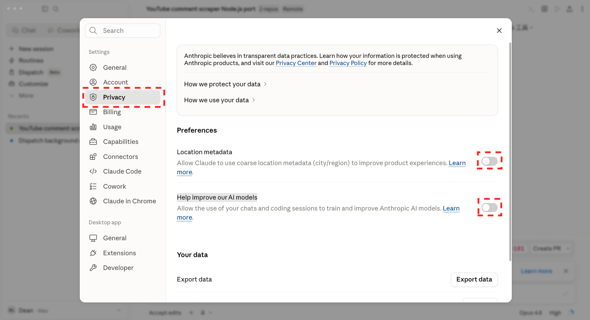

### 🧑‍💻 讓 Claude 更了解你

**操作路徑**: 左下角頭像 → Settings → General
- **What best describes your work?**: 選擇自己的工作（ex: Consultant 顧問）
- **Instructions for Claude**: 你希望如何與 AI 協作（如無特別需求，空的也可）

```prompt [label="希望如何與 AI 協作的指令"]
- 回覆兼顧務實性與創新性
- 討論時邏輯清晰，層次分明
- 我提供的資訊不足時，適時提出 1 至 2 個反問，引導使用者反思
```

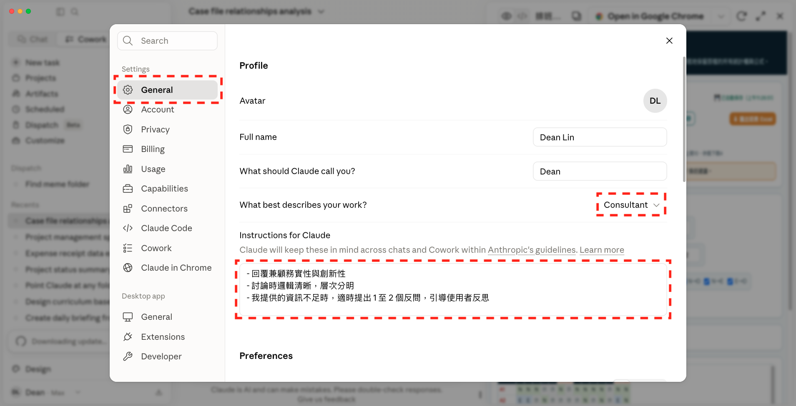

### 🦾 賦予 Claude 能力

**操作路徑**: 左下角頭像 → Settings → Capability

#### Memory
- **Search and reference chats**:  可以從過往對話中搜尋相關詳情
- **Generate memory from chat history**: 紀錄聊天的上下文，並儲存到到記憶（Memory）
- **Import memory from other AI providers**: 可以將 ChatGPT、Gemini 等其他 AI 的記憶匯入


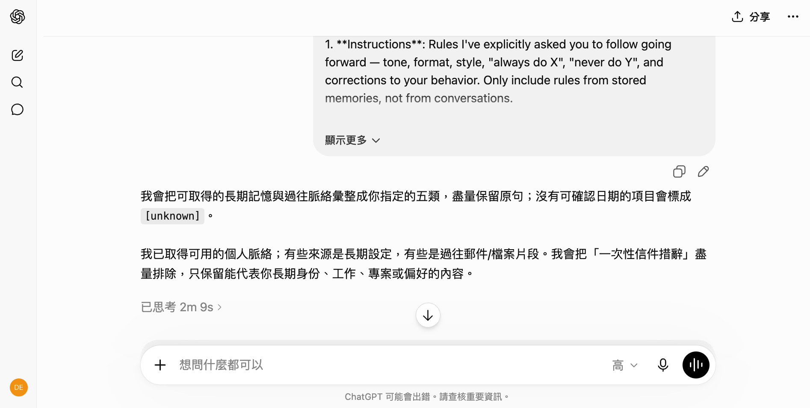

#### General
- **Connector search**: 允許搜尋可用的 Connector 並在對話中使用（ex: Gmail、Google Calendar...）

## Connector：讓 AI 操作外部工具

> **原本 AI 只看得到你貼給它的東西**
> 你得先複製貼上，它才讀得到。
> `Connector` 就像幫 AI `接上你的工具`（ex: Gmail、行事曆、雲端檔案），它就能`自己去讀寫`。
> **我們不需要像機器人一樣複製貼上**

### 🚀 前往 Connector 加入常用工具

**操作路徑**: Customize → Connectors
**常用工具**: Gmail、Google Calendar、Google Drive、Notion

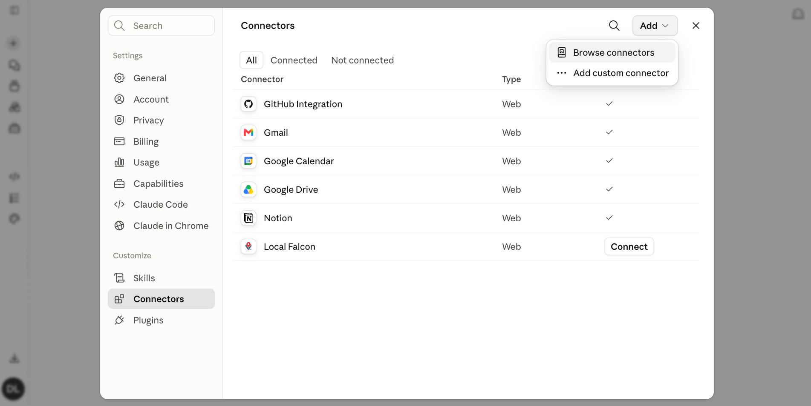


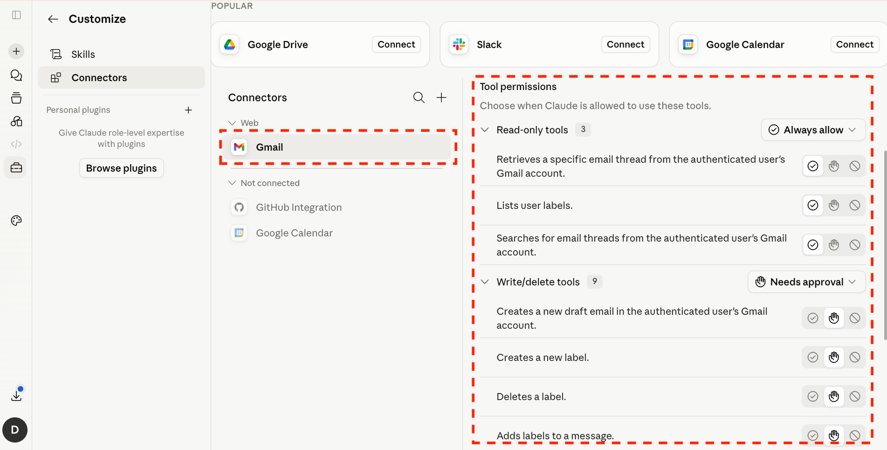

### 📧 整理 Gmail 郵件、加標籤

> **信箱爆炸，重要的信被淹沒**
>
> - 垃圾信、電子報、廣告太多，真正`要回的信被埋在下面`
> - 刪除信件太繁瑣，`容量快速耗盡`
> - 廣告一直來，卻懶得一封封`設定封鎖`

```prompt [label="整理 Gmail 信件"]
幫我整理 Gmail 最近 30 天內未標籤的信件（最多 [50] 封），步驟如下：

## 第一步：分類打標籤
閱讀每封信的寄件人、主旨（不需閱讀內容），依下列規則加上標籤：

- 🔴 重要：來自真人（非系統信）、需要回覆或行動、來自我的聯絡人
- 📁 封存：通知類、收據、訂單確認、已讀但無需回覆
- 🗑️ 刪除候選：促銷、電子報、自動發送的廣告信、過期的會議邀請、寄件人是 no-reply

有疑慮時，優先歸入「歸檔」而非「刪除候選」。

## 第二步：整理廣告寄件者清單
找出符合以下任一條件的寄件者：
- 過去 30 天內寄超過 2 封促銷/電子報
- 主旨含有「優惠、折扣、限時、unsubscribe、newsletter」等關鍵字
- 寄件地址為 no-reply@ 或 marketing@ 開頭

輸出格式：
| 寄件者名稱 | Email 地址 | 封數 | 建議動作（取消訂閱／封鎖） |

## ⚠️ 執行前確認
以上兩步驟完成後，先給我清單讓我確認，
我明確說「確認執行」後，才進行標籤套用動作。
```


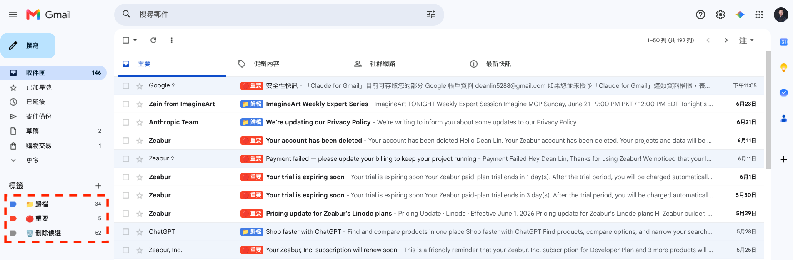

> **使用提醒**
> 建立與 Gmail 的連結後，Claude 可以`閱讀信件、建立草稿、設計標籤`
> 但`刪除信件、取消訂閱`這類高風險操作，建議由人類在標籤建立後判斷更合適；因為有些 **no-reply** 的信件依舊重要。
> 建議`小範圍`測試(先 50 封)，沒問題後再擴大測試範圍、調整判斷規則。

### 📬 彙整特定主題信件脈絡

與同事、客戶的信件通常有`多段來回、細節持續調整`，而且每一段可能都有`重要資訊`。

甚至討論過程可能`不在同一封 Email 而是散落成多封`。

```prompt [label="彙整信件脈絡"]
幫我整理 Gmail 信箱中 [Blackbao AI] 合作的過程
```


> **個人心得**
> 如果不是 Gmail，Claude 也支援 `Microsoft Outlook`
> 假使為特殊信箱（ex: 公司為了節省經費自建的信件伺服器），`若不涉及機密，可考慮用副本寄到 Gmail` 讓 Claude 讀取

[warning title="若使用醫院信箱，請先想到個資與院內規範"]
公務信件常夾帶`病人姓名、病歷號`等可識別個資；把信件`轉寄到外部信箱`讓 AI 讀取前，務必先確認`院內資安規範`是否允許。
依衛福部指引，個資的蒐集、處理與利用皆須符合`個人資料保護法`——`方便`不能大於`合規`。
[/warning]

### 📅 把零散資訊彙整為完整行程

> **資訊散落，行程要「貼來貼去」**
>
> - 會議`時間、地點、文件`可能散落在信箱討論串，建一個行程要反覆確認
> - 手動彙整資訊，容易`遺漏且每次格式不一`
> 現實生活可能是透過 `LINE、Zoom、Teams` 討論；可以直接複製對話內容請 AI 分析，討論串亂沒關係，重要是`目標有跟 AI 講清楚`。

[flow]
1. 彙整資訊 — 讓 AI 讀取信件討論串
2. 帶入參考資訊 — 把議程、注意事項一起寫進事件說明
3. 加入與會人員 - 取出討論人員，設定為 attendees（若找不到對應 Mail 要提醒）
[/flow]

```prompt [label="把訊息討論轉成行事曆事件"]
分析下面訊息討論的主題，並在 Google Calendar 建立事件：
- 抓出最後會議的日期、時間、地點
- 在事件說明裡附上議程重點
- 取出信件討論人員，設定為 attendees(無 Email 請列出並提醒我)
- 如果時間和我現有行程衝突，先提醒我

2026.09.21 星期一
09:22 Nina @Alan 新版搜尋上線剛好滿一週，監控數據先給你看一下
p50 延遲 180ms，比舊版還快 12%；可用率 99.95% 也守住了
但 p99 延遲飆到 4.2 秒，遠超我們設定的 800ms 上限
09:23 Nina 平均都漂亮，就是尾端炸掉。你那邊 API 層有看到異常嗎？想先確認是查詢邏輯還是資料量問題
13:47 Alan 數字我這邊也對得起來，API 層沒有技術性錯誤
但補一個你可能沒注意到的切角，不同查詢類型的尾端落差很大
13:48 Alan 關鍵字搜尋：流量 60%，p99 320ms
篩選＋排序：流量 25%，p99 1.1 秒
跨分類聚合：流量 10%，p99 4.2 秒
歷史紀錄查詢：流量 5%，p99 5.8 秒
13:49 Alan 流量最少的兩種查詢，尾端延遲反而最誇張。建議先聚焦「查詢走的資料路徑」往下追，索引調校可能是次要的
2026.09.22 星期二
09:05 Nina @Alan 你這切角點醒我了，昨晚把慢查詢的執行計畫再拆細，結論有點不妙但必須講清楚
09:06 Nina 我們從專案初期就假設「單一主資料庫撐得住所有查詢」，把聚合、排序全塞在同一層，這方向從數據看其實是錯的
09:07 Nina 1. 那幾種慢查詢全都在做跨表即時聚合，每次都掃全表
2. 真正卡住的不是新功能，是底層沒有讀寫分離跟預聚合，尖峰時互相搶鎖
3. 回去翻上兩季的監控，當時尾端就偶爾爆，只是沒破 SLA 沒人深究
09:08 Nina 換句話說不只這次改版，過去兩季的架構假設可能都建立在錯誤前提上，這已經不是加索引能解決的層級了
11:34 Alan 同意你的判斷，而且這件事我們兩個不能自己決定
11:35 Alan 要修正等於把查詢層拆出來做讀寫分離加快取，工程量橫跨兩三個 sprint，會直接吃掉 Q4 既定的功能排程
而且我們雲端資料庫的方案上個月才剛續約綁一年，架構一動可能得重談規格
11:36 Alan 這兩件都牽涉到 @Marcus 的決策權限，我們自己動下去後面對不齊會很麻煩
建議整理成一頁決策建議，約 Marcus 開個短會讓他拍板，你覺得呢？
15:12 Nina 好，我把 Marcus 拉進來
15:13 Nina @Marcus 我跟 Alan 檢視新版搜尋，發現尾端延遲爆的根因不是新功能，是底層架構從一開始就沒做讀寫分離
可能要動查詢層重構，牽涉 Q4 排程跟雲端資料庫合約，想請您拍板
15:14 Nina 會準備一頁決策摘要（現況／根因／兩個方案／各自風險），約 30 分鐘做決策即可
方便的時段麻煩您勾一個：
・9/23 三 10:00-10:30
・9/23 三 15:30-16:00
・9/24 四 11:00-11:30
都不行的話再回我，我配合
2026.09.22 星期二
09:20 Marcus 這根因挖得好，謝謝你們主動追到底
就約 9/24 15:30，會議室A
09:21 Marcus 開會前麻煩兩件事：
1. 那份一頁摘要，前一天下班前先寄給我預讀
2. 兩個方案各自附「預估 p99 改善幅度」跟「對 Q4 排程的衝擊」，我才好當場決定
09:22 Marcus 雲端合約那邊我先跟採購打招呼請他們暫緩調整方案，等會議結論再說。週四見
```


### 📚 存取 Notion 知識庫存取、限定搜尋範圍

> **知識分散，不知道答案藏在哪一頁**
>
> - 資料寫在 Notion，但跨好幾頁，要`找一個答案得翻半天`
> - 不確定哪頁是最新的，怕`引用到過期資訊`
> - 希望 AI 只在「`指定範圍`」內找，而不是亂猜

開啟講者的[範例知識庫](https://kaput-lord-cf7.notion.site/e4f7378f09a346ed8cee5c552b2754d0?v=6a3df2dd2be54086a180d8805ae1c23f&source=copy_link)

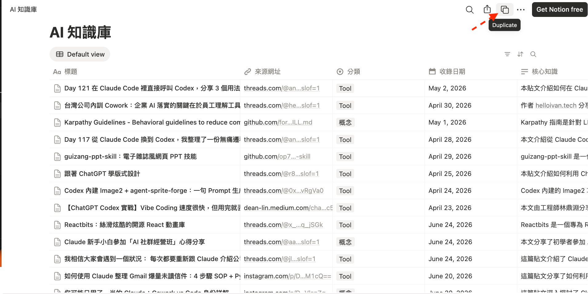


[flow]
1. 限定範圍 — 指定某個頁面或資料庫，AI 只在這個範圍內搜尋
2. 問答式查找 — 用白話問問題，讓它回答並附上來源頁面
3. 彙整輸出 — 請它把散落的重點整理成一張表或摘要
[/flow]

```prompt [label="在指定 Notion 範圍內查資料"]
請在 Notion 的[AI 知識庫]幫我尋找「Claude 在法律上的應用」
① 回答我的問題，並附上你引用的頁面標題與連結
② 如果範圍內找不到答案，直接說「範圍內查無資料」，不要自己編
```

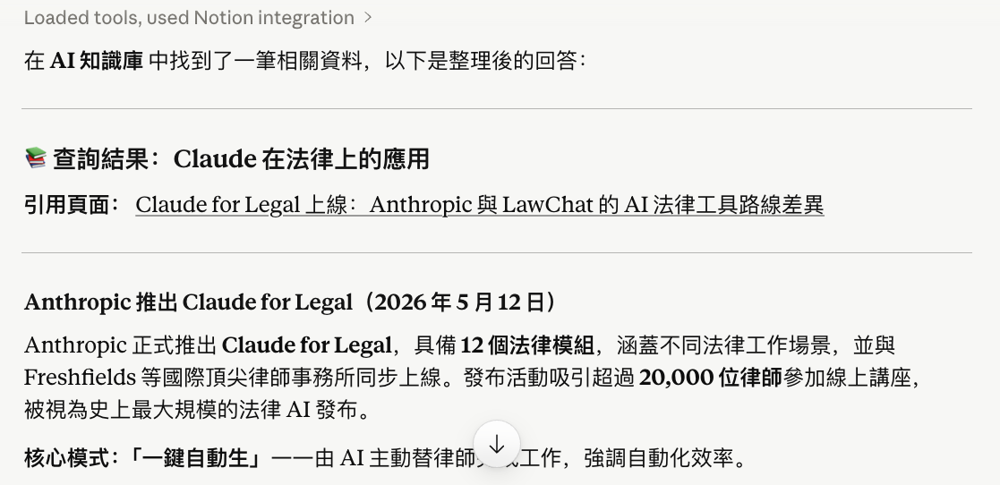

[interactive title="平常跟 AI 怎麼互動？"]
**Q1｜你最常請 AI 幫忙做什麼？**
`A` 寫文案、信件　`B` 整理資料、做摘要　`C` 查資料、學新東西　`D` 寫程式、處理表格

**Q2｜AI 給的結果，通常可以直接用嗎？**
`A` 幾乎直接用　`B` 小改一下就能用　`C` 要大改才能用　`D` 常常乾脆自己來
[/interactive]

## Project：建立專屬知識庫

### 😩 痛點：背景每次重講，品質還不穩定

[flow]
- **同個聊天視窗中** - AI 對話有上下文限制，`超過會變笨`；討論不同主題，`幻覺會嚴重`
- **開新的聊天視窗** - 你需要`重新交代背景資訊`，每次打的指令都不一樣
- **需要重新上傳參考資訊** - 如果檔案放在電腦，而你剛好`人在外面就無法操作`。
[/flow]

> **AI 有記憶能力，但不是無限的**
> 儘管現在 AI 已經具備記憶能力，回答時會參考你過去與他的對話，但`非常隨機`。
> 而 Project 的設計，就是讓`隨機變成穩定`。

### 🧠 根據不同情境建立對應專案

[flow]
- **不同專案扮演的角色不同** - 組員、主管、甲方、乙方
- **手上有多個專案進行** - 每個專案背後的知識庫都不一樣
[/flow]

> **專案（Project）就像第二大腦**
> 現在的工作通常都是`多工進行`，但人類切換到另一個專案時大腦會混亂。
> 既然如此，就讓 AI 幫你記住`專案的細節、自己扮演的角色`

### 🗂️ Project 基礎架構

[flow]
- **指令（Instructions）** — 我是誰、這個專案在做什麼、固定規則（ex: 要參考的資源、不要做的事）
- **知識庫（Files）** — 參考資料，可以是品牌指南、專案規格、文案範本、決策紀錄
- **記憶（Memory）** — 這個 Project 使用一段時間後，就會更理解你想要做的事
[/flow]

[warning title="使用提醒"]
Project 目前`無法分享`給其他人，主要針對個人使用設計
[/warning]

### 🧠 建立第一個專案 Project

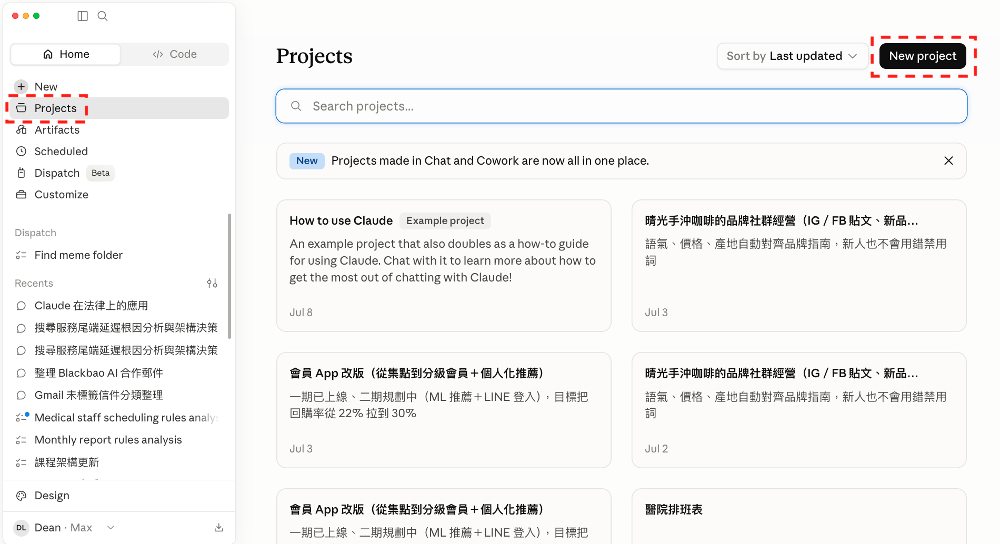

- **What are you working on**: `會員 App 改版（從集點到分級會員＋個人化推薦）`
- **What are you trying to achieve**: `一期已上線、二期規劃中（ML 推薦＋LINE 登入），目標把回購率從 22% 拉到 30%`

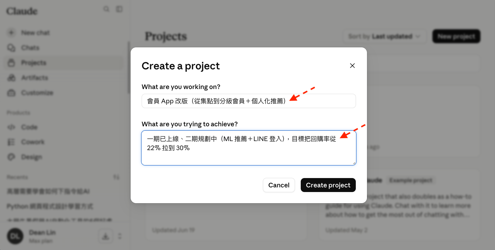


- **指令** — 設定成「專案記憶助理」：回答以文件為準、要附出處、找不到就說沒有
- **知識庫** — 上傳專案規格書、會議記錄、決策日誌

#### 設計專案指令（Instructions）

```prompt [label="instructions：專案記憶助理"]
## 角色設定

你是這個專案的記憶助理，你的任務是幫團隊「回憶與查找」，而不是自己發明設定。

## 回答原則

1. 回答一律以知識庫內的規格／會議／決策為準，並標明出處（哪份文件、哪次會議、哪筆決策編號）。
2. 知識庫裡找不到答案時，明說「目前文件沒有記錄」，不要臆測或補完。
3. 遇到互相矛盾的記錄時，以「日期較新的決策日誌」為準，並提醒我有衝突。
4. 決策日誌中標示「已被取代」的條目，回答時以取代後的最新決策為準，但要補一句「原本是…，後來因…改為…」，讓我看得到演變。

## 輸出格式
- 查找類問題：先給「一句話結論」，再附「出處」與「原文摘錄」。
- 整理類問題：用條列或表格，並標注負責人與期限（若文件有記）。
```

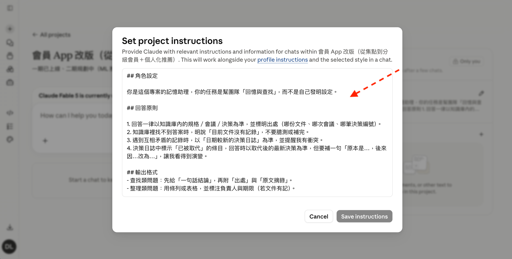

#### 加入專案知識庫（Files）

[download file="assets/project-memory.zip" label="下載「專案 Project 知識庫」範例包" desc="專案規格書、會議記錄、決策日誌（解壓即用）"]

建議使用`Markdown 格式`，PDF/Word 等格式雖然可以上傳，但會占到更多容量。

[warning title="上傳前，先過個資這一關"]
放進 Project 的文件，`等於交給外部 AI 服務處理`。
會議記錄、規格書若含`病人或員工的可識別資訊`，請先`去識別化`，或依院內規範取得核准後再上傳——這就是指引說的「資料保護評估」精神。
[/warning]


> **☁️ 將檔案放雲端（Google Drive / Notion），這樣知識庫就會即時更新**
>
> 規格與會議記錄會`持續更新`，如果是「上傳檔案」到 Project，每次改完都得`重新上傳一份`，非常容易忘記。
> 只要前面 Google Drive 或 Notion 的 `Connector` 有設定好，這樣就只需要`維護一份文件就好`。
> **團隊共用同一份來源，不會各拿各的舊檔**

### ▶️ 驗證 Project 是否符合預期

#### 出處可追溯

```prompt [label="驗證可找出處"]
2026 年 4 月會議的待辦有哪些？負責人是誰？
```


> **不要再依靠大腦記憶了**
> 事後追溯幾個月前的東西，得自己翻訊息與文件才知道「誰負責、哪時候講的」。建好 Project 後，問一句連出處（哪份文件、哪次會議）都一起附上。

#### 變更的決策可追溯邏輯

```prompt [label="驗證可推理邏輯"]
我們當初為什麼第一版不導入 ML 推薦？這個決定後來有變嗎？
```

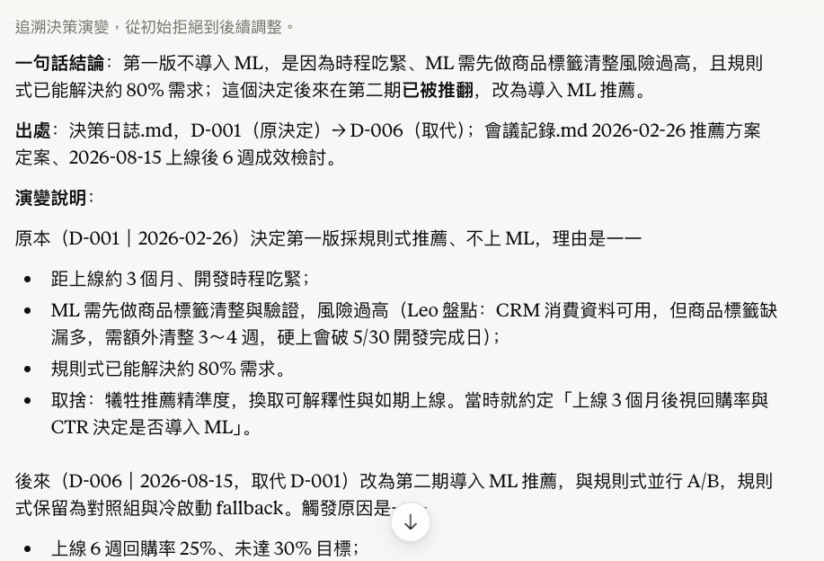

> **就算參加會議的當事人，也未必記得決策**
> 現實生活中，我們很常討論`過去已經決議的事情`，因為`沒人記得`當初的理由、也不知道`後來改了沒`。
> 案例中可以看到 AI 會引用`決策日誌`的原始理由，並主動點出「這條已被新決策取代」。

#### 不知道的問題會誠實回覆

```prompt [label="故意問不存在的資訊"]
我與黑寶科技的合作，是在哪個時候啟動的？
```

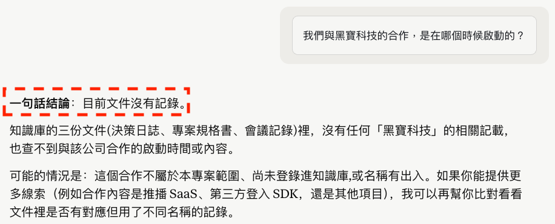

> **AI 時代很少有人看過全文，所以要盡可能減少幻覺**
> 有時 AI 遇到`文件沒寫的事會自己編`，讓你誤信。
> 在 Project 的`指令`要求他誠實說「目前文件沒有記錄」，可以**大幅減少幻覺**。

### 🤯 流程都在某個人腦袋裡

[flow]
- **關鍵人物不在，流程就卡死** - 「這份文案怎麼寫？系統怎麼設計的？專案下一步該做什麼？」如果答案全在某個`資深同事`的腦袋；他一請假、離職，這一切就需要`重新摸索`。
- **交接靠口耳相傳，品質全憑運氣** - 新人上工時，只拿到`零散筆記`和`口頭經驗`；因此報告、信件、文案...每個人的`格式、品質`都不一樣。
- **需要手把手教學，難以擴散** - 許多流程需要`實際 Demo`才能搞懂，因此就算有好方案也`擴散不出去`，案例難以複製到不同部門。
[/flow]

### 📋 提示詞一直複製貼上

[flow]
- **存了一堆 Prompt，要用時翻半天** - 提示詞散落在`記事本、Notion、聊天記錄`；真的需要使用時，光是找出`最後一版`就浪費一堆時間。
- **換個情境就得調整提示詞參數** - 同一套文案 Prompt，換個品項、從 IG 改到 EDM 就得`手動微調`，浪費時間。
- **規則改了，舊版本卻沒跟著改** - 新增一個`禁用詞`、調整了`品牌語氣`，但同樣的 Prompt 已經`被複製到十個 Projects`；漏改一處，錯的版本就`默默繼續產出`。
[/flow]

## Skill：把好方法變成 SOP

> **Skills 的出現，讓 AI 的價值可以持續累積**
> 需要重複執行的流程，都值得設計成 Skill

### 📝 建立工作日誌 Skill

Skill `不需要`全程自己`手動建立`，可以先透過 Claude 內建的 `skill-creator` 來生成。

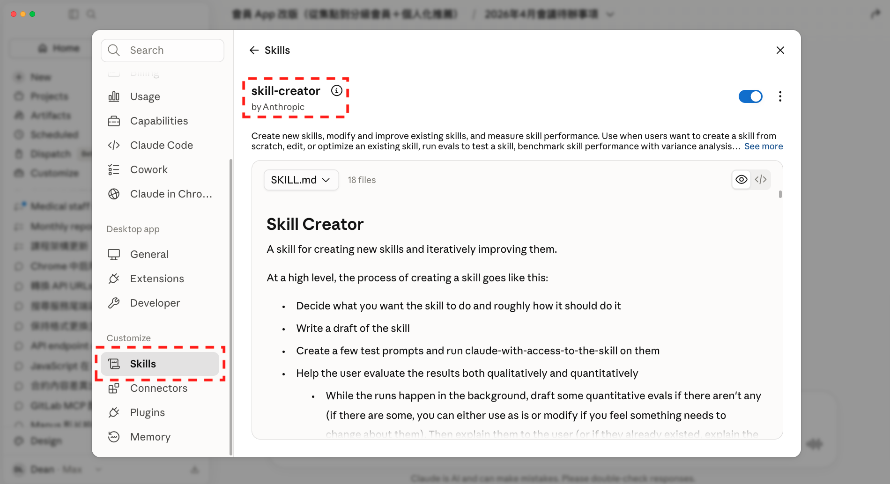

#### 參考資訊來建立 Skill

```prompt [label="提供自己期待格式，而非讓 AI 自由發想"]
/skill-creator
我想要建立一個 Skill: [work-report]
會根據我與 AI 的對話紀錄，整理成適合給主管閱讀的「日報 / 週報 / 月報」
產出前請先取得當下時間，並依需求判斷報告週期；若未指定，預設產生[日報]
若在專案中執行，請嘗試判斷[專案名稱，並顯示在報告最上方]
報告重點請聚焦：[完成事項、推進進度、重要決策、問題風險、下一步行動]，並遵循下面規則：
- 避免流水帳，整理成能快速理解的工作進度
- 不誇大成果，不要把未完成事項寫成已完成，也不要編造對話中沒有的內容
- 請使用繁體中文，語氣專業、務實、清楚。
- 直接輸出報告，不需要額外解釋
```

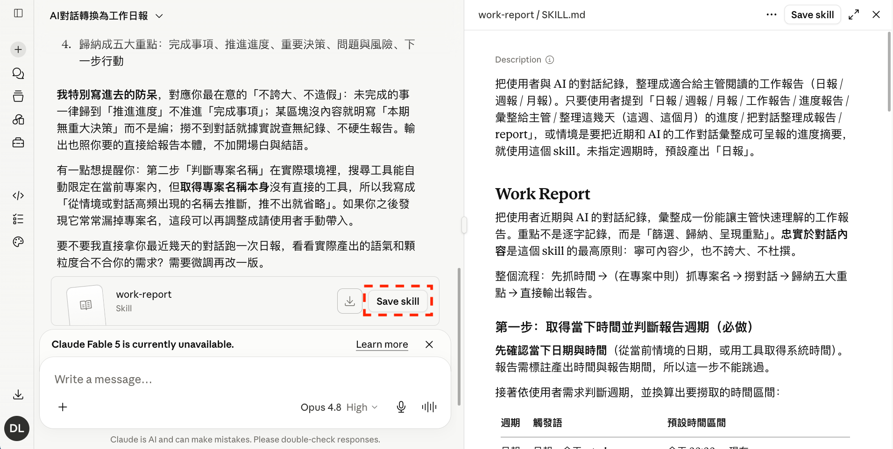

> **個人心得**
> AI 設計的 Skill 有時會有`過度設計、冗贅資訊`的問題，可以根據實戰結果`調整細節`。

#### 驗證 Skill 符合預期

Skill 建立完成後，有 2 種方式觸發：
- **用「意圖、關鍵字」觸發**: 盡可能設計成`被動觸發`，因為 Skill 會越來越多，要記住每個名稱並不現實。
- **輸入「/skill-name」指定觸發**: 當然也可以`主動觸發`，當一段對話中想綜合多個 Skills 功能時，這個方案較為穩定。


```prompt [label="在 Chat 開新對話測試"]
生成週報
```

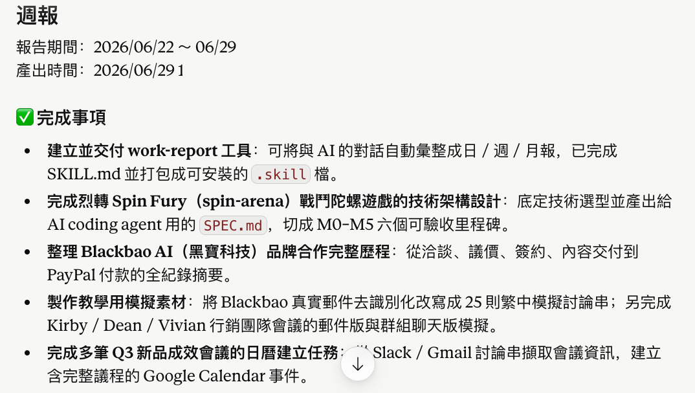

> **Claude 的 Chats 跟 Projects 的記憶是分開的**
> 如果想要取得特定 Project 記憶，就需要進去操作；下面可以到先前建立的`晴光手沖咖啡的品牌社群經營（IG／FB 貼文、新品到貨文案）`

```prompt [label="選一個 Project 開新對話測試"]
/work-report
```

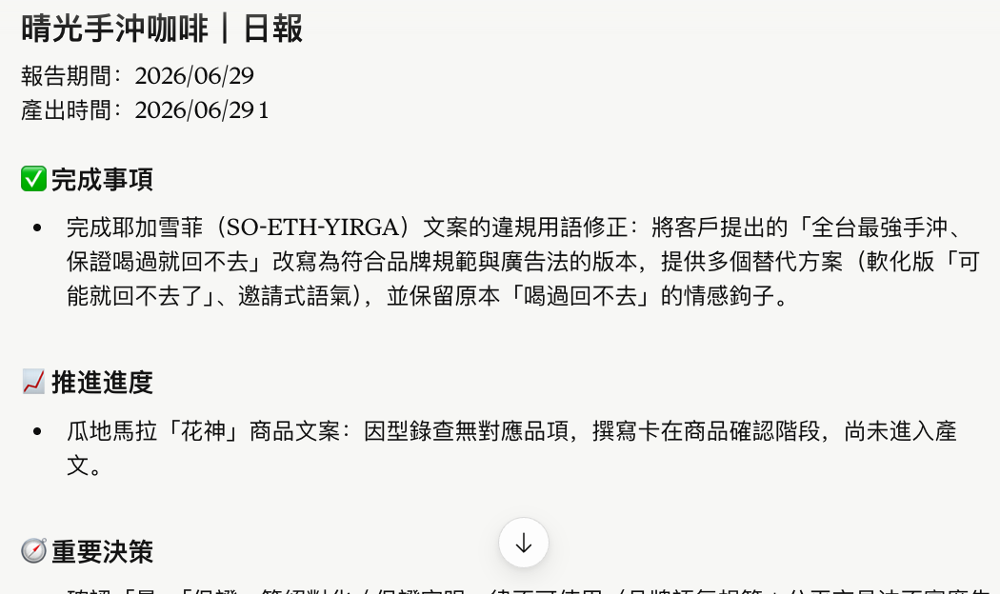

### 📝 彙整對話生成 Skill

> **不要急著關閉對話窗**
> 使用 AI 一段時間後，你會發現`好的結果需要經過多輪對話`才能得到。
> 而你`引導 AI 的過程`，其實可以把它設計成 Skill，或是拿來優化既有的 Skill。

一年前，建立提案企劃草稿需要與 AI 討論`半小時以上`，並`來回執行這麼多的 Prompt`

#### STEP 1: 產生合適的 Prompt（聚焦需求）

```prompt [label="先簡單說明背景"]
我準備製作一個[給台灣新創行銷公司導入 Claude AI]的提案企劃

以上面的 Prompt 為基礎，我要提供怎麼樣的 Prompt 可以得到較好回答？
請說明為什麼，並在最後舉出能得到專業回覆的 Prompt 範例。
```

#### STEP 2: 詢問是否有需要補充的內容

```prompt [label="看似完善的 Prompt 可能還有可以優化的地方"]
在用這個 Prompt[撰寫提案企劃前]有任何問題，請先詢問我，不要直接產生。
```

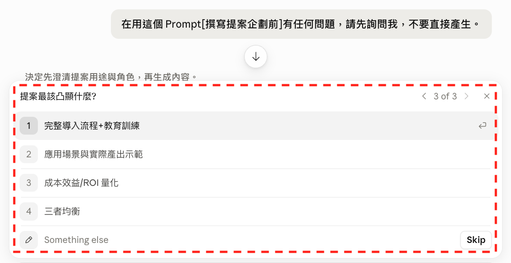

#### STEP 3: 讓 AI 幫我們補齊不足的資訊（也可以自行回答）

```prompt [label="建議自己填寫，AI 僅為參考"]
請扮演對這個領域非常熟悉的[產業顧問]，針對提出的問題給出具體詳細的回覆、不要逃避問題。
```

#### STEP 4: 從利害關係人角色來看需求、問題

```prompt [label="一份企劃能不能過，不能只考量到自己"]
請分析這份企劃最重要的[3]個利害關係人，從他們的角度和利益出發，詳細說明對這份企劃有哪些具體的[意見、建議、憂慮]？
```

#### STEP 5: 將利害關係人顧慮彙整，重新產生企劃

```prompt [label="優化提案企劃"]
請扮演[提案企劃]的專家，了解[利害關係人]的想法後，以最專業的角度在企劃補充更完善、可行的方案。
```

#### STEP 6: 用紅藍隊的概念攻防（競爭者）

```prompt [label="從挑戰者的角度來優化企劃"]
你是這份提案企劃的[競爭者]，盡可能列出這份企劃的不足之處。
並說明自己可以做到哪些更完善、可行的方案。
```

#### STEP 7: 生成完善企劃

```prompt [label="最後要生成完善的企劃"]
請扮演[提案企劃]的專家，在了解[不足之處、更完善的方案後]後，以最專業的角度，重新完善這份企劃。
```

### 🛠️ 將對話彙整為 Skill 

這個是講者的[對話紀錄](https://claude.ai/share/522afd9a-5487-45d4-b9c2-871070124945)供大家參考。

```prompt [label="請 AI 彙整對話後建立 Skill"]
請根據以下要求分析上方對話內容後，整理成可重複使用的 Skill，名稱為[Proposal Refiner]

1. 起初怎麼提問
2. 中間如何引導與調整
3. 最終是如何得出這個成果的
```


#### 驗證 Skill 符合預期

```prompt [label="用不同主題來驗證 Skill"]
/proposal-refiner 我要做一份[給連鎖餐飲品牌導入 AI 點餐分析]的提案企劃，幫我做到專業可行的程度。
```

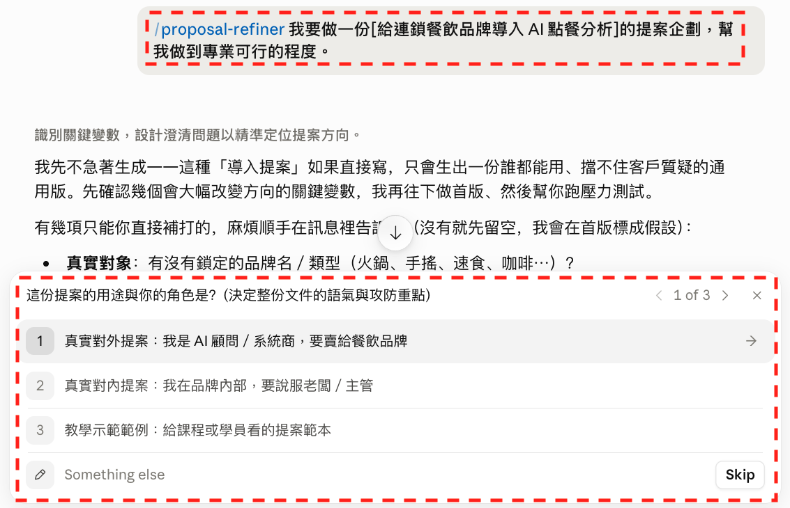

> **不要一開始就想設計完美的 Skill**
> 我們可以在 AI 的輔助下設計 Skill 的`雛形`，然後再一次次的實踐中`優化細節`。
> 現在這個`線上講義也是透過 Skill 輔助生成的`，版本`迭代超過 100 次`；只要頻繁使用的 Skill，一定會有不滿意、想調整的部分。

### 💾 分享 & 匯入 Skill

> **分享驗證過的 Skill，讓成效拓展**
> 在 `Project 放知識`，`Skill 設計流程`，兩者是互補的。
> **Project 讓 AI「知道事實」** — 你扮演的角色、品牌規範、產品資訊、專案細節
> **Skill 讓 AI「知道步驟」** — 寫行銷文案、月報、信件、會議記錄要遵守的 SOP。

#### 將 Skill 下載為壓縮檔

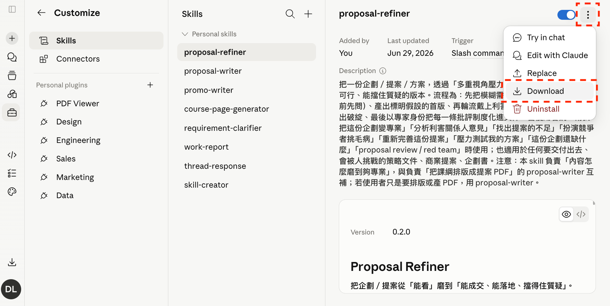

#### 匯入別人建立好的 Skill

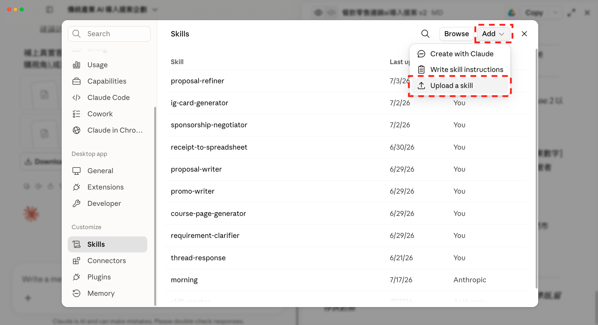


[download file="assets/proposal-refiner.skill" label="下載「.skill」範例包" desc="前面用 AI 彙整對話建立的 Skill(生成提案)"]

```prompt [label="驗證匯入的 Skill 可以運作"]
/proposal-refiner 我要做一份[給傳統產業導入 AI 提升效率]的提案企劃，幫我做到專業可行的程度。
```


### 🎒 認識 Skill 的結構

[html src="./html/skill-anatomy.html"]

### 🔍 Skill 的三個執行階段

[flow]
1. Discovery（發現）：AI 讀取技能名稱與描述，判斷是否與任務相關
2. Activation（啟動）：匹配成功後，才完整讀取整份 Skill 文件
3. Execution（執行）：根據文件描述逐步執行任務
[/flow]

> **Skill 為什麼能節省 Token？**
> Rule 每次都會讀完整文件；Skill 在匹配需求前`只讀標題與描述（Metadata）`。
> 就像 Google 搜尋時先看標題摘要，確認相關再點進去。

### 📝 生成線上講義

[download file="assets/course-page-generator.zip" label="下載「.zip」範例包" desc="輸入主題生成線上講義"]

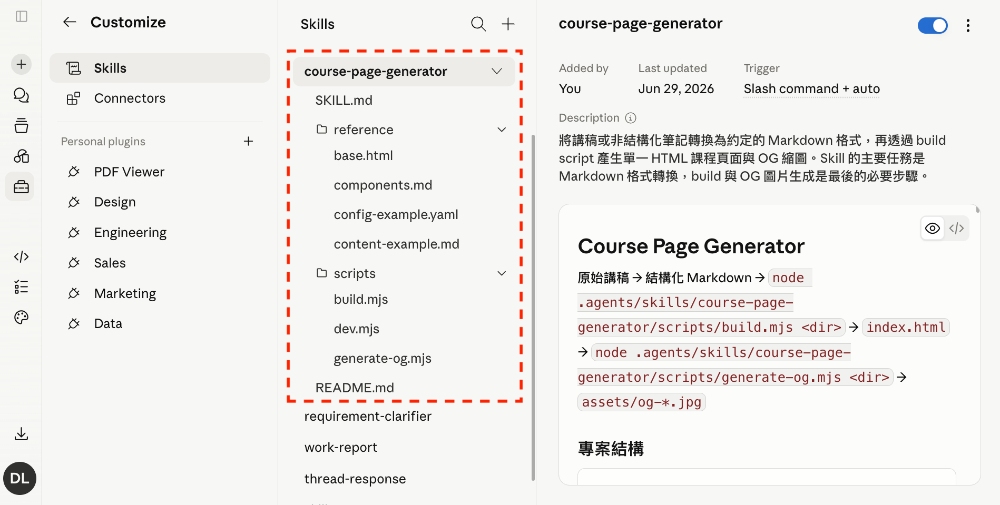

```prompt [label="輸入主題/草稿生成 HTML 講義"]
/course-page-generator 幫我做一份「Claude Code 從零開始」的課程網頁
```


[bonus title="🎁 製作心得"]
這個課程網頁的製作，走過了一段從「結果不可控」到「完全掌控」的歷程。

1. **遇到痛點** — Vibe Coding 出來的網頁，調整內容都要改 HTML，非常不方便
2. **逆推結構** — 讓 AI 把現有網頁拆解，對應成一套可用 Markdown 撰寫的格式
3. **內容與版型分離** — 只需改 Markdown，自動套用對應版型，細節完全可控
4. **設計 Agent Skill** — 不是讓 AI 生成網頁，而是讓 AI 學會「這份 Markdown 怎麼寫」
5. **模板生成器思維** — AI 負責生成結構化內容，程式再把內容轉成最終網頁
[/bonus]

[warning title="使用提醒"]
原本這個 Skill 是設計在 `Claude Code 使用`，直接在 Chat 雖然也能使用，但 `Token 消耗極快`。

如果真的打算使用，`記得把資訊調整成自己的`，另外這個 Skill 的原理，可以參考我過去[拍攝的影片](https://youtu.be/0pZri5f_tfk)。
[/warning]

### 🖼️ 生成 IG 圖卡

[download file="assets/ig-card-generator.zip" label="下載「.zip」範例包" desc="提供文案生成 IG 圖卡"]


```prompt [label="提供一段文案，生成 IG 格式圖卡"]
/ig-card-generator
【用 AI 寫程式，卻覺得沒有比較快？】

上個月企業內訓時，在課前有位工程師跟我說：「我每天都在用 AI 寫程式，但說實話，效率好像沒什麼提升。」

因此我請他示範平常的用法。

他先打開 ChatGPT、把需求貼上去、等回覆、複製回 VS Code、跑起來報錯、再把錯誤訊息貼回去問。

來回操作四五次後，我跟他說：「或許不是 AI 幫不了你，是你還沒用到合適的工具。」

────

我使用 AI 輔助開發 3 年了，前兩年也是這樣用的；只把它當成一個比較聰明的「問答機器人」，有問題就問，問完自己動手。

直到去年開始用 AI 程式碼編輯器，整個工作效率才明顯提升，兩者的差別在於：

• 網頁版 AI 是「你問、它答、你自己做」。
• AI Agent 是「你說需求、它直接改程式碼、跑測試、遇到錯誤自己修」。

內訓那天，我開場就直接 Demo 了一段 AI Agent 的開發流程。

過程中我注意到，那位工程師全神貫注地盯著螢幕。

結束後他跟我說：「我之前以為 AI 就是那樣了，完全不知道已經能做到這種程度。」

他不是個案，很多學員的反應都差不多 ——
他們不是不想用，而是「從來沒有」體驗過 AI Agent 的威力，所以一直停留在複製貼上的階段。

────

不過，光是換工具還不夠。

社群上常有人說「有問題直接問 AI 就好，幹嘛學？」

也許未來有一天，AI 真的無所不能，但至少現在，還遠遠不是。

過去 3 年來，我已經在 AI 工具上投入數千小時學習，直到現在也還在持續研究與嘗試。

因為使用 AI 真正困難的，從來不是工具本身；而是你知不知道怎麼把問題交給它、做完後該怎麼驗證、做錯了又該怎麼修正。

從「知道 AI 可以寫程式」到「真的把它用在工作上」，中間那條路，才是最多人卡住的地方。

────

後來我發現，與其一直追著新工具跑，不如回頭看看自己的工作流，到底是哪裡卡住。

AI 時代每天都有新工具、更強的模型。如果目標是「學會工具」，學完很快就忘了。

但如果出發點是「解決痛點」，你就會開始去想：

• 需求怎麼寫，才不會讓 AI 跑偏？
• 功能迭代後，怎麼確保專案不會壞掉？
• 重複踩到的坑，有沒有辦法系統性地避免？

過去我也針對這些主題，拍了許多 AI 寫程式的實戰教學。

但我發現對剛接觸 AI 寫程式的人來說，很難透過碎片化的資訊，把技術應用到實際專案。

────

所以我開了這堂課。

把過去 3 年摸索出來的開發流程，整理成一門從零開始的全端實戰課程。

不只帶你認識工具，更帶你走完一輪真實的開發流程
—— 從需求釐清、專案初始化、自動化測試，到版本控制和 Code Review。

會讓你看到 AI 可以在哪些環節介入，以及遇到問題時該怎麼處理。

如果你也想把 AI 從「有在用」變成「融入工作流」，這門課就是我想給你的答案。

📌 專屬折扣碼: DEANONLY
```


### 我是一個很貪心的工程師

> **不同身份讓我更深挖 AI 的潛力**
> 我這個人很貪心，本業是工程師，副業是講師、作家、YouTuber。
> 所以我持續嘗試`更有效率的工作方式`。
> 不是我的時間比別人多，而是把`重複性的任務`都交給 AI 處理，把自己留給`真正需要判斷的事`。

[flow]
1. 辨識重複任務 — 把工作中`重複性高、做法固定`的部分挑出來
2. 交給 AI 處理 — 整理成 SOP（Skill），讓 AI 照規則自動完成
3. 專注親自判斷 — 只做真正有意義、`需要我做決策`的事，並驗證 AI 的成果
4. 嘗試新工具 — 持續尋找`更有效率的做法`，讓這個循環越轉越快
[/flow]

### 🧩 Skill 不是越多，AI 就越強

`同一類型的 Skill 裝了兩個以上，當需求命中時，常常會一起觸發`；這不只會增加 Token 消耗，也容易讓 AI 在執行過程中卡住或走偏。

**在提示詞的世界裡，1 + 1 不一定大於 2，甚至可能小於 1。**

> **同類型的 Skill，建議擇優安裝一個**
> 像撰寫行銷文案這類需求，如果同時安裝多個相近 Skill，AI 反而要花更多成本判斷該遵循哪一套規則，結果未必更好。

### 🤔 網路上很多 Skill 只是看起來有用

- 有些 Skill 描述看起來很厲害，實際使用時`效果卻不穩定`
- 過多的 Skills 只會`增加上下文負擔`，卻沒有提供足夠的專業價值
- 安裝`太多沒有用到的 Skills` 甚至會讓 AI 的行為變得更難預測

# 初探 Claude Cowork

## 讓 AI 動手處理檔案

> **Claude Chat 🆚 Cowork**
> **Chat** 只能處理`線上檔案`，但 **Cowork** 能直接幫你`操作電腦上的檔案`

### 💻 需要下載 Claude App 才能使用

Chat 因為只操作線上檔案，所以網頁版就可使用；但 Cowork 要[下載官方 App](https://claude.com/download)，並且至少有 `Pro 帳號`才能使用。

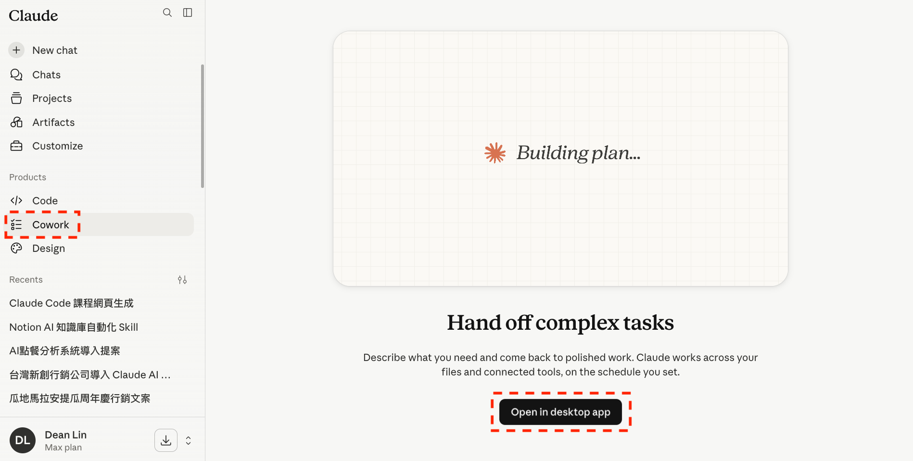

### 📁 可以直接選資料夾，不用一個個上傳


[warning title="使用提醒"]
Cowork 是有能力`新增/修改/刪除`電腦檔案的。

能力越大風險越大，你可以想想`如果事情做到一半，但額度沒了會發生什麼事`。
[/warning]

### 📷 批量讀取照片，直接寫進 Excel

> **一疊發票、名片、單據，要一張張 key 進 Excel**
>
> - 特徵值（金額、日期、抬頭、電話）藏在照片裡，得`人工一張張看、一格格打`
> - 過人工處理，還`容易看錯數字、打錯欄位`
> - 量一大（幾十上百張），`整個下午都耗在 key-in`

把一疊有特徵值的照片（ex: 發票、名片、單據）丟給 Cowork，它會`逐張讀出關鍵欄位`，直接整理進 Excel，不用你一張張 key。

[flow]
1. 指定照片資料夾 — 一疊發票／單據照片
2. 逐張辨識 — 抽出金額、日期、抬頭等特徵欄位
3. 寫進 Excel — 一張一列，並標明來源是哪張照片
[/flow]

[download file="assets/cowork-excel.zip" label="下載「讀收據寫 Excel」範例包(cowork-excel)" desc="費用報銷表 Excel + 20 張不同角度的單據照片"]

```prompt [label="把一疊單據照片批量寫入 Excel"]
讀取[費用報銷表.xlsx]裡面的欄位後，分析[收據]內的照片：
① 逐張讀出要填寫欄位
② 寫入 Excel，一張照片一列，並在最後一欄標明來源照片檔名
③ 看不清楚或辨識不確定的格子先留空、標黃，不要自己猜數字
```

> **「不確定就留空、標黃」是提醒 AI 的「輸出結果風險」**
> 衛福部指引特別提醒：生成式 AI 可能產出`看似合理但實際不正確`的內容。
> 要求 AI `不要自己猜數字`，就是把`幻覺`擋在資料源頭的第一道防線；若照片含`病人可識別資訊`，處理前也記得先確認授權與去識別化。

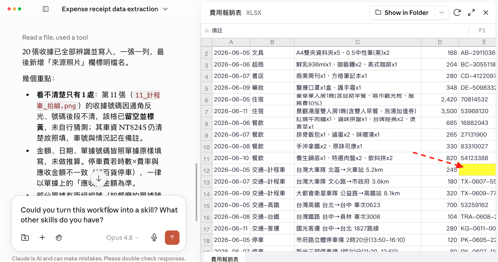

> **將驗證有效的 SOP 轉換 Skill**
> `如果流程會重複使用，就可以把它設計為 Skill`，這樣 AI 日後遇到類似問題時，不需要重頭再來一遍。
> 生成式 AI 本質是`文字接龍`，但如果搭配 Skill，且執行涵蓋`程式腳本`，這就能夠讓輸出變穩定。

```prompt [label="將驗證過可重複使用的流程轉換為 Skill"]
幫我將這個工作流轉為 Skill
```


### 📝 自動填入不同格式的表單

> **Excel 表單欄位多、規則雜**
>
> - 欄位一大堆、每格`填寫規則都不一樣`，人工填又慢又怕錯
> - 要填的資訊可能`散落在 Word／PDF/Markdown 文件`，得來回比對抄寫

與其人工一格格填，不如讓 Cowork **先讀懂 Excel 的欄位與規則，再從你的來源資料（ex: Word／PDF / Markdown 文件）抽出資訊自動填上**。

[flow]
1. 讀懂表單 — 先摸清 Excel 的欄位與填寫規則，列給你確認
2. 抽取來源 — 從 Word/PDF/Markdown 找出對應資訊
3. 對照核准 — 填好先給你看對照（哪格填什麼、來源哪份），核准再存
[/flow]

[download file="assets/cowork-form-fill.zip" label="下載「彙整資訊填寫 Excel」範例包" desc="將散落的資訊自動填入 Excel"]

```prompt [label="把既有資料自動填進 Excel 表單"]
請根據下面步驟彙整資料，寫入[專案管理表.xlsx]：
1. 了解 Excel 的欄位與填寫規則
2. 從資料夾文件讀取所需資訊，用「純文字」的方式填入 Excel
3. 找不到或不確定的格子先留空、標黃，不要自己編
```

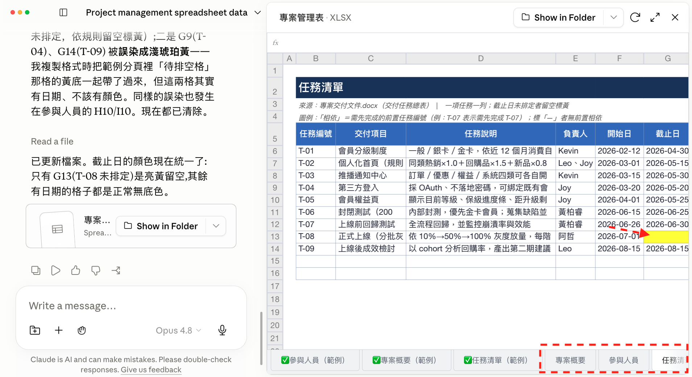

## 沒有基礎也可以寫程式嗎？

> **學 Vibe Coding 不是為了成為工程師**
> Vibe Coding 是為了解決`你目前遇到的痛點`，這個痛點可能存在於`公司、部門、團隊、個人`，但一直沒有解決。
> 而這堂課，就是讓大家了解，在 AI 時代`我們能靠自己`踏出第一步。

### 我過去分享了十幾部教學影片

[youtube id="2hbYCe_E5aU" title="Vibe Coding 學習地圖"]

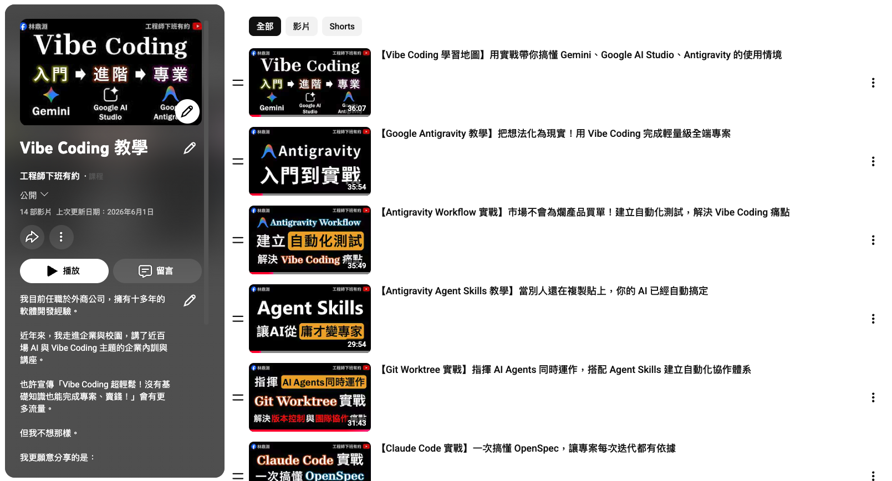

### 在科技公司、政府機關、學術機構教學

[flow]
- 科技公司 — 目標是把 AI 導入開發的每個環節`撰寫規格、版本控制、自動化測試、團隊合作`
- 政府機關 — 想透過 AI 提升`行政效率、資料整合、決策品質`
- 學術機構 — 老師期待 AI 能幫忙`優化教材、加快備課、快速出題`
[/flow]

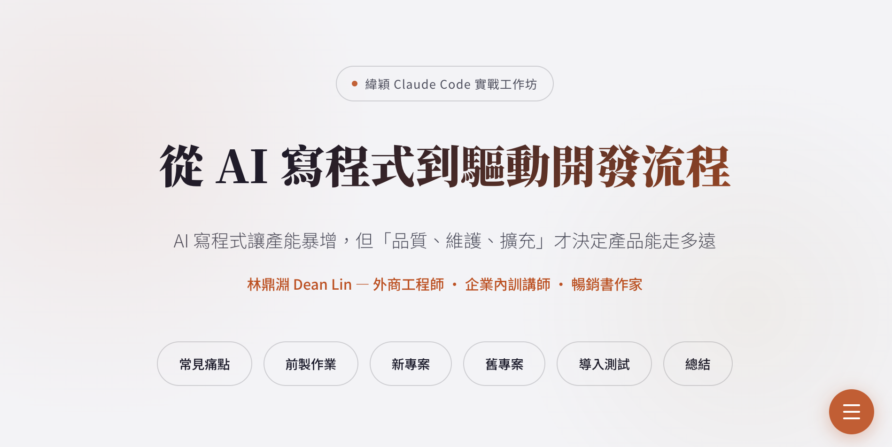

### 🧰 需求不同，適合的工具也不同

[flow]
- **工程師** - 習慣用 IDE（程式碼編輯器），因此會選 Claude Code、Codex、Cursor 這類專業的工具，學習門檻較高
- **政府機關、學術機構** - Claude App、ChatGPT、Gemini 就很夠用，適合 Vibe Coding 入門。
[/flow]

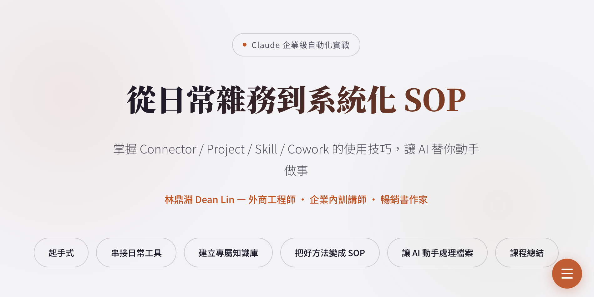

> **新手不要追「最專業」的工具，先選「能解決問題」的工具**
> 能解決手上的問題，那就是最好的工具。

### 🤔 工具太多不知道如何選

| 需求 | ChatGPT（OpenAI） | Gemini（Google） | Claude（Anthropic） |
|---|:---:|:---:|:---:|
| 日常應用（問答、寫作、生成圖片） | 差異不大 | 差異不大 | 無法生成圖片 |
| 直接存取／操作你電腦的檔案 | Codex App | Antigravity App | Cowork |
| 撰寫程式、做自動化專案 | Codex CLI | Antigravity CLI | Claude Code CLI |

> **工具有差異，但沒有想像中的大**
> **三大巨頭你追我趕**：一家出新功能，另外兩家很快跟上，`大部分功能都有對標產品`。

### 🤖 Claude Code 能完成 Cowork 的所有任務

- 儘管 Claude Code 功能更完善，但也`更加危險`。
- 如果沒有程式背景，當 AI `詢問權限、執行腳本`時，大多數人都會「接受」而非「確認」；只要搞錯`一次`就可能出現**資安危機或是電腦格式化**。

### 🆚 這堂課為什麼選擇 Cowork 而非 Claude Code？

[flow]
- Cowork — `不需要安裝環境，有內建的 Sandbox`（Linux 環境），打開就能開始做事
- Claude Code — `需要安裝 Git/nvm/Node.js/Python/IDE(程式碼編輯器)...` 等多個工具，AI 才能順利做事
[/flow]

> **從門檻低的工具開始，先體驗 AI 能帶來的幫助**
> Claude Code 建議在`終端機下指令`，相對門檻較高，可以作爲未來的學習項目；而 Cowork 打開就能用。

[interactive title="是什麼驅動你嘗試"]
**Vibe Coding 最需要什麼？**
`A` 有程式基礎 `B` 熟悉多種 AI 工具
`C` 擅長與人溝通 `D` 眼前有困擾許久的問題
[/interactive]

## 從自己的需求出發

### 🐛 Vibe Coding 遇到錯誤是很正常的

[flow]
- 遇到錯誤 - Vibe Coding 過程`一定會遇到錯誤`
- 解決錯誤 - 如果沒有開發背景，能不能解決錯誤，是看`這個痛點對你來說夠不夠痛`
- 讓自己多嘗試一點 - 如果成功解決問題，這個`成就感與經驗`是非常寶貴的。
[/flow]

> **可以有野心，但先從 MVP 開始**
> 在做出改變世界的產品前，先嘗試把`手邊麻煩的任務`交給 AI 做自動化。

### 🎯 用日常工作開始嘗試，因為你有分辨對錯的能力

[flow]
- 別再做「記帳軟體、番茄鐘」這類專案了 — 儘管 AI 能幫你輕鬆搞定，`但缺少挫折的練習幫助有限`，因為思考解決問題的步驟最為珍貴。
- 從「日常工作」的痛點出發 - 你有能力`分辨對錯`，並且在遇到錯誤時`不會輕易放棄、有解決的動力`
- 陌生領域你不知道 AI 犯錯 - AI 有能力做出`看起來正確的產品`，就像我一開始做月報、排版工具時以為是對的；但`護理長試用後馬上就能點出問題`
[/flow]

> **課前訪談小故事**
> 教學前為了讓`內容更符合單位需求`，我會先跟窗口做需求訪談。
> 有次收到`人力資源部門`邀約，他們主管說會安排這堂課是因為：「**開發的人不用系統，用系統的人不會開發。**」
> - **原因**: 內部出缺勤、考核系統年代久遠，很難操作；但提出需求後，基本上等要`等數週甚至幾個月才修正`
> - **方案**: 掌握`規格驅動開發`的技巧，並了解開發團隊`使用的技術`，這樣未來才能銜接、維護

### 🎁 如果今天分享的案例有錯，其實是好事

[flow]
- 永遠保持判斷能力 - 不要`完全相信 AI 的建議`，講師的範例`也未必絕對正確`
- 如果案例有錯 - 現場`直接舉手`，線上`可以留言`；錯誤不可怕，怕的是沒人發現。
- 培養解決問題的能力 - `發現錯誤、定義錯誤、解決錯誤`，這才是 AI 時代不會淘汰的能力。
- 假使一切都很順暢 - 講義案例都是`挑過的情境`，實務上`一定會遇到阻礙`
- 能挑出我的錯 - 代表你`對自己的工作非常熟悉`
[/flow]

## AI 設計的月報表、排班工具

> **AI 能做出什麼成果？**
> 這兩個工具是 Claude 參考`醫院範本案例（已去除敏感資訊）`製作出來的。

### 📊 月報表

- **痛點**：品質指標月報要逐筆對數值、判燈號、看 SPC 圖、再複製貼到 WORD 摘要表
- **成品**：AI 讀來源報表 → 自動填值判燈號 → 產出摘要表

#### 體驗網址: https://deanlin.net/hospital-monthly-report/

[download file="assets/月報表參考資源.zip" label="下載「月報表參考資源」" desc="解壓後有月報表相關檔案"]

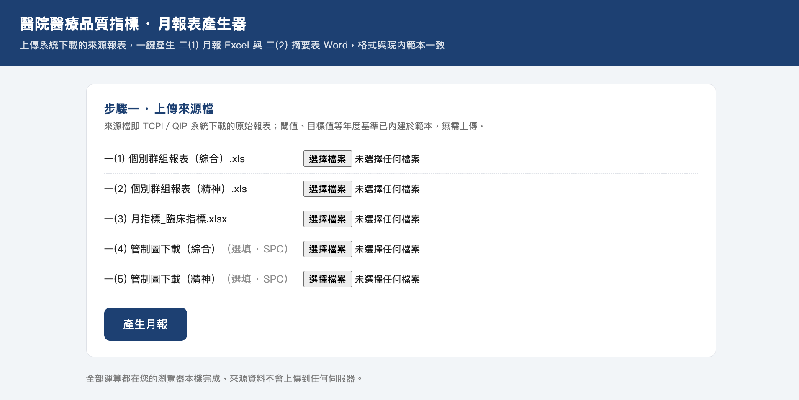

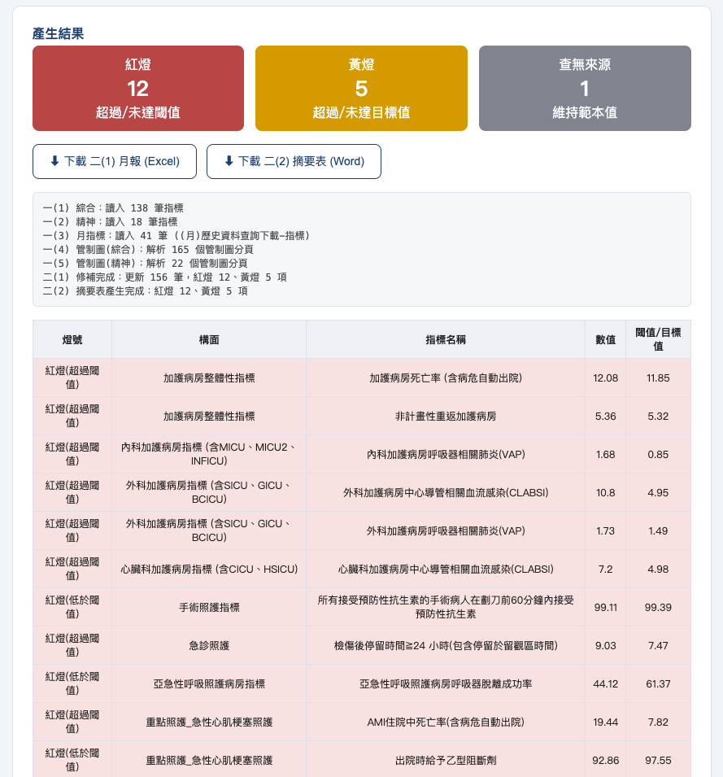

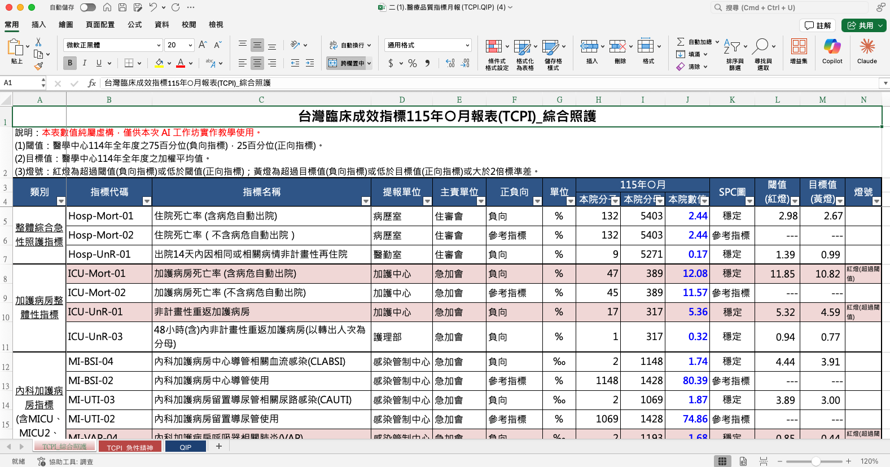

### 🗓️ 排班

- **痛點**：護理師排班要顧最低人力、連續天數、11 小時休息、包班……
- **成品**：AI 給初版 → 逐條檢查有沒有違規 → 標出來讓你決定

#### 體驗網址: https://deanlin.net/nurse-shift-scheduler/

[download file="assets/排班參考資源.zip" label="下載「排班參考資源」" desc="解壓後有排班相關檔案"]

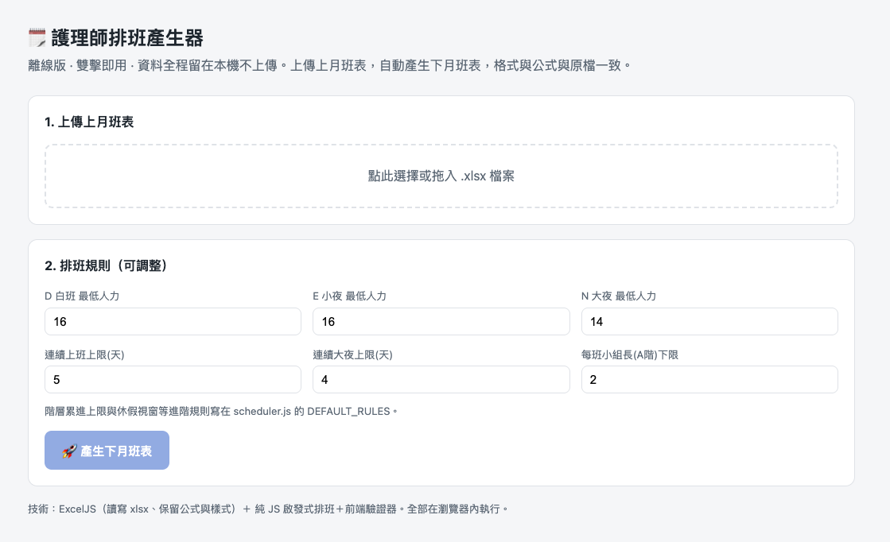

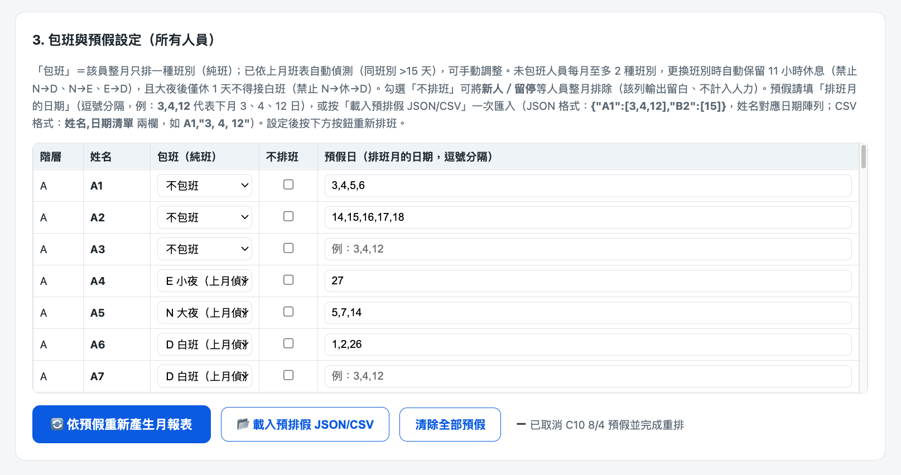

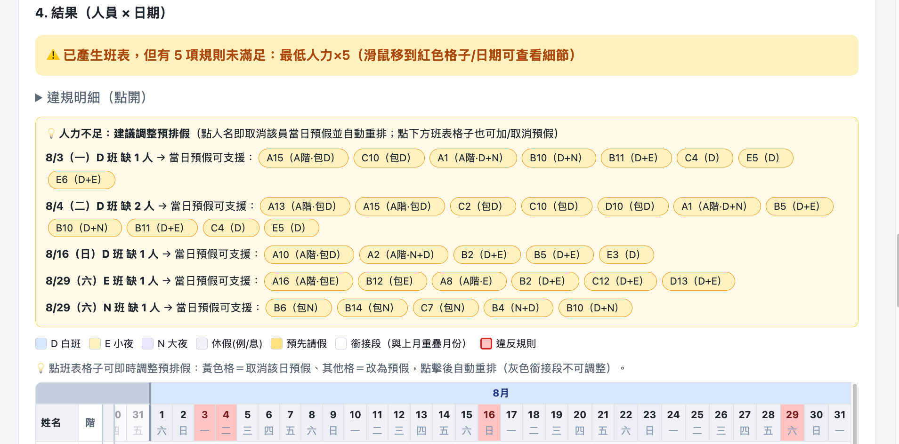

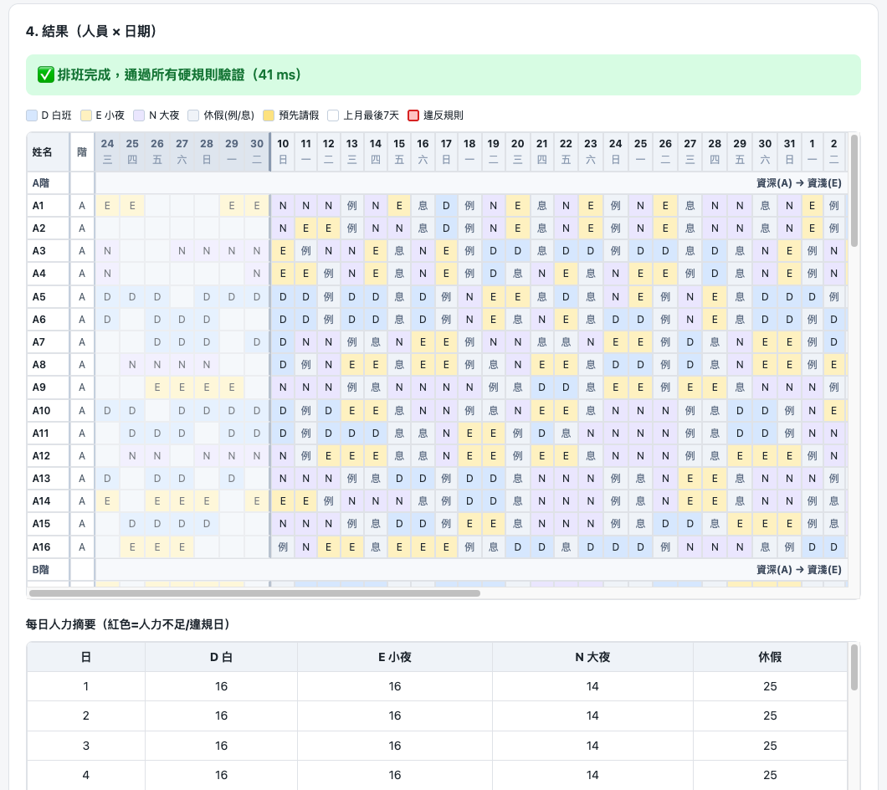

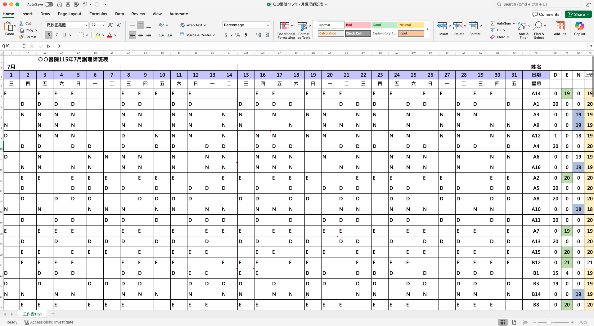

> **呈現結果，先讓大家了解 AI「辦得到」**
> 但這些成品不是「靠一句話就能生成」，**中間有方法、有風險、也有失敗**。這些都是`今天要分享的重點`。
> 另外就算指令相同，`每次生成的結果都會有差異`，因為生成式 AI 的本質是「文字接龍」。

[interactive title="AI 時代的焦慮指數"]
**Q1｜看到一堆新工具、新名詞冒出來，你的想法是？**
`A` 興奮，想趕快學　`B` 焦慮，怕跟不上　`C` 無感，先觀望

**Q2｜你最大的擔心是？**
`A` 學不完、學了就忘　`B` 自己會被取代　`C` 不知從何開始
[/interactive]

## 技術更新好快，我好焦慮

> **在未來，工具學習成本應該越來越低**
> AI 工具更新，通常是為了**降低學習難度**
> 我們其實`不需要去背`工具有哪些功能，大多時候有需要時`AI 會自動調用`
> 很多時候`不是因為工具更新焦慮，而是因為看到販賣焦慮的文章`

### 😰 出現新名詞很焦慮

Hermes Agent、loop engineering、Agency Agent、HyperFrames...

[flow]
1. 先觀察一段時間 - 工具剛推出時往往`不完善、沒有教學，上手難度也高`
2. 是否有具體案例 - 是話題性產品，還是有具體的成功案例
3. 對你有幫助嗎 - 工具再好，也要自己用得上才有意義
[/flow]

> **培養批判性思考能力**
> 人的精力有限，`技術是學不完的`；要先培養出辨識問題的能力，然後思考如何解決，`工具只是在過程中學會罷了`。
> 現場遇到的問題都是不同的，沒有現成的解決方案，就要`自己設計`出來。

### 🪞 「是我太爛嗎？」不，Demo 都是挑過的

- 滑社群覺得人人都是 AI 大神，自己一試卻`處處碰壁`
- 網路上漂亮的展示，是`精心挑選過`的結果，不是日常
- 教學看不懂不代表你不行，很多時候只是每個人的`背景與基礎`不一樣

#### 漂亮精美的網頁其實是框架的功勞：[Magic](https://magicui.design/)、[Aceternity](https://ui.aceternity.com/)


#### 一堆 AI Agent 同時執行，未必會更好


> **導入 AI，不代表全交給 AI**  
> 把`AI 能做到的事`跟`人必須負責的判斷`分清楚。
> 讓 AI Agent 執行很久，不一定最強；我不認為對專案毫無掌控度是件好事。
> **好的結果，不該靠消耗 Token 拼運氣；而是靠清楚的方向、可重複的工作流、以及人類在關鍵節點的決策。**

### 🔄 經驗不會歸零，只是換了賽道

> **讓自己變得「獨特」，比讓自己變得「更強」更重要**
> AI 對新人來說是`彎道超車`的機會，而對資深員工來說是`放大自己`的時機。

[flow]
- 過去累積的判斷力，正是 AI 缺乏的 - AI 的出現，不是把你過去十年清空，而是給你一個`放大過去十年的機會`
- 過去職業是單一價值體系 - 技術強不強，對就對、錯就錯，比較很簡單
- 現在偏向多價值體系 - 產業熟悉度 × 會不會說故事 × 能不能設計流程 × 願不願意分享 x 能否自己做出工具
- 單一技能容易比高下，綜合技能不容易比 - 這對資深員工反而是機會
[/flow]

### 🔧 AI 降低「踏出第一步」的成本

- 過去想要一個小工具，得排隊`等工程師`，甚至需要花上`幾萬到數十萬`；現在 AI 讓你有機會先`自己做出雛形`
- 別因為「怕犯錯」就不敢碰：做中學，你才會真正知道 `AI 能做什麼、不能做什麼`

> **AI 就像一面鏡子，它會放大你原本的樣子**
> 如果思維清晰，AI 會放大你的清晰；如果思維混亂，AI 也會忠實放大這份混亂。
>
> 關鍵從來`不是工具多強，而是你是否了解自己要什麼`。

## Work Smart, Don't Work Hard

### ⚡ 把該省的力氣省下來

- 在 AI 時代，做`只有人才能辦到的事`更有價值
- 嘗試把工作的某個環節變順，讓自己`少踩坑、少重工、少在無聊`的事情上浪費時間
- 不要讓你對專業的熱情，被那些`不難但很煩的瑣事`一點點消耗掉

### 🙌 不要有預設立場，先讓 AI 試試看

[flow]
- 我不確定 AI 能不能做到 - 如果腦海冒出這個想法，就`直接讓 AI 嘗試看看`
- AI 真的值得付費嗎？ - 如果工作上有感到`乏味的電腦或紙本作業`，或許這就是一個嘗試付費的契機；`跟一個人的薪水相比，讓 AI 的成本非常便宜（Pro 版 20 美金）`
- 把執行交給 AI，把判斷留給自己 — 這才是`從容的節奏`
[/flow]

---

[interactive title="你對 AI「動手」的信任度"]
**Q1｜讓 AI 直接讀、改你電腦裡的檔案，你的感覺是？**
`A` 放心交給它　`B` 可以，但我要盯著　`C` 有點怕怕的

**Q2｜如果換成「病人相關」的檔案呢？**
`A` 一樣可以　`B` 去識別化後才行　`C` 絕對不碰
[/interactive]

# 在開始之前：我們要為自己的行為負責

## Vibe Coding 是什麼？

> **透過白話文跟 AI 對話，逐步完善工具的流程**
> - **優點**：可以快速完成初版
> - **缺點**：結果較不可控、未來較難維護
> 若沒有程式背景，`把想做的事、期待的結果講清楚`是最重要的事

### 🧩 認識常見名詞

- **AI Agent**：不只是問一句答一句的聊天機器人，而是能`理解任務、操作你的檔案、自己串好步驟、把事情從頭做完的助手`
- **Token**：AI 的`計費與容量單位`，可以想成 AI 的「貨幣」，不同付費方案的額度不同
- **Model**：AI 的「大腦」，不同模型的`智商不同`，消耗的 Token 也不同；`越聰明的模型，花的 Token 越多`

> **工程師的角色，也在改變**
> 當「把功能寫出來」越來越容易，工程師真正的價值，就從「會不會寫程式」移到`懂不懂這個產業、能判斷出最適合的方案、知道為什麼要這樣做`。
> 大家在產業累積的 know-how，就屬於這類`最難被取代的價值`。

## 了解風險與邊界

### 💳 能力越強，風險越大

[flow]
- Cowork 有能力新增、修改、刪除你電腦上的檔案 - 想想如果做到一半`額度用完`會怎樣 → 資料可能會不見
- 不建議剛開始就讓 AI 全自動處理 - 建議權限選「`Manual（每步先問你）`」比較保險
- 限定 AI 讀取的資料夾範圍 - 醫療資料尤其敏感，像牽涉`病人資訊的檔案、同事的個人資料`
[/flow]

> **這不僅是建議，還是主管機關的要求**
> 衛福部的指引中，要求導入前完成`資料保護評估`：檢視資料`蒐集、處理、儲存、利用`過程的合法性與安全性。
> 操作時要養成「`先想個資、再動手`」的習慣。

### 🧪 是「玩具」還是能用的「工具」？

[flow]
- 一句話就能生成「看起來可以動」的系統 — 這樣的東西，你真的敢`直接用在工作現場`嗎？
- 改壞不是最可怕的 — 最可怕的是`你不知道它被改壞了`；過去人寫程式也會有一樣的問題，只是 AI `速度太快`，把問題加倍放大
- 醫療產業，更要特別注意 — 等一下生成的`報表、排班系統`，重點並不是做出來好開心，而是`審視 AI 犯了哪些錯誤`。
[/flow]

> **看起來能動的東西，才是最危險的**
> `AI 的快，不是你的快；但 AI 的錯，會全部算在你頭上`。所以關鍵邏輯，還是需要人來把關。

### 🧾 Claude Cowork 是付費才有的功能

- **Cowork 需要下載官方 App，而且至少要 Pro（付費）帳號**才能使用
- 網頁版點 Cowork 只會提醒你要用桌面版 App
- 可以先透過我的 Demo 來評估工具`是否直得付費`


# 報表自動化：只要規則明確，AI 就能自動化

> **從零開始示範，是為了讓大家知道會遇到哪些問題**
> 比起最後的成果，中間`協作、驗證、修復`的過程更重要。

## 吃掉工作時間的月報

### 😮‍💨 來源數據很多

- 於 TCPI／QIP 系統提報後，下載一(1)~(5) 來源報表
- 更新月報數值：本院分子／分母／數值要用 VLOOKUP 比對來源報表
- 燈號用 IF 公式判斷、SPC 圖要人工看是否 >2σ／>3σ、再依燈號整列填色
- 最後把紅燈／黃燈指標，依構面分類複製到 WORD 摘要表
- **一份約 40–60 分鐘，最卡在 SPC 逐筆確認與 WORD 表格分類貼上**

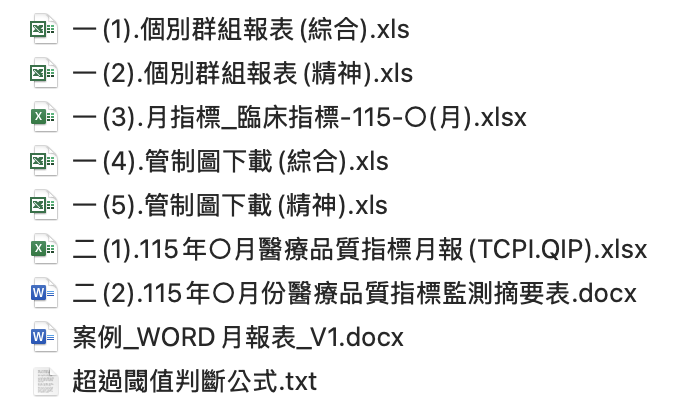

### 🔍 痛點拆解：時間到底卡在哪

[flow]
- 抄與比對 — 分子／分母／數值一格格 VLOOKUP 比對來源報表，`一格錯，整份數據就錯`
- 判燈號 — IF 公式判紅黃綠，SPC 圖還得`人工盯 >2σ／>3σ`，一張張看眼睛很快就花
- 分類貼上 — 紅黃燈指標`依構面手動剪貼`進 WORD 摘要表，格式還不能跑掉
[/flow]

> **這件事「不難，卻很煩」**
> 每一步都是`機械式`的抄、比、貼，不需要判斷力，卻`最吃時間、也最容易出錯`。
> 這正是 AI 最該接手的部分——把你從`重複勞動`裡放出來，只留下`最後把關`那一下。

## 一次只做一件事

### 🚦 我們與 AI 認知需要同步

[flow]
1. 指定資料夾 → 讓 Cowork 讀完所有檔案（請注意資料已經去識別化）
2. 先選 Manual → 每一步先問過你，看清楚再放行
2. 讓 AI 讀懂規則 → 讓它把「要做什麼、依什麼規則」列出來給你確認
3. 再讓 AI 動手執行 → 一步一驗，不確定就停下來問
[/flow]

[download file="assets/月報表範例.zip" label="下載「月報表範例」" desc="解壓後有月報表相關檔案"]

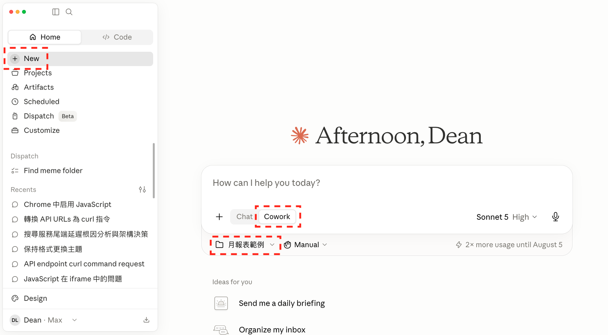

> **不要想著讓 AI 一口氣搞定一切**
> 我這份講義本身也是用 AI 輔助生成、迭代超過 100 次才成形的。先做出雛形，再在一次次實踐中優化——**錯誤與失敗，是正常的過程，不是你的問題。**

### 🤖 我與 AI 的協作方式

#### STEP 1：先讓 AI 讀懂 9 份文件的關聯性

```prompt [label="先弄清楚文件關聯性"]
先分析資料夾下每份文件的關聯性，然後說明月報產生的規則
```

- 資料夾裡有 9 份文件：`來源報表、現行成品範本、規則說明`混在一起
- 先確認 AI 分得清`哪些是原料、哪些是成品、哪些是規則`，資料流向對了再讓 AI 開始寫程式
- AI 整理出「來源 → 主報表 → 摘要表」的資料流

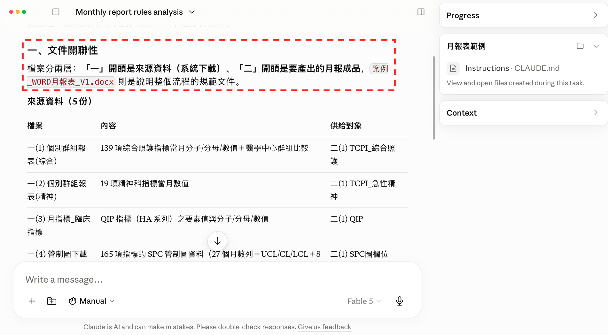

#### STEP 2：先問技術方案，並立下驗收底線

```prompt [label="確認自己想要的方案是否能夠達成"]
我想要透過程式，讓我只要提供對應來源檔案，就能夠產生月報表
希望可以用純網頁方式操作，並希望下載的月報表，與參考的月報表在格式上是一致的
在技術上，有推薦的組合嗎？
```

- 如果對技術不熟悉，先問「有推薦的組合嗎」
- `格式一致`是必要需求，月報要交出去給長官看，格式跑掉就不能用

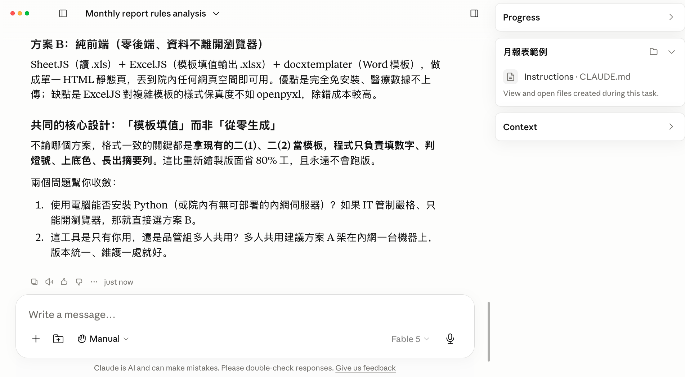

#### STEP 3：收斂到「雙擊 html 就能使用」

```prompt [label="讓 AI 完成初步版本"]
我希望建立一個「code」資料夾來完成這些程式，希望技術上只使用前端，目標是只要雙擊 html 就能使用
```

- `要求建立資料夾（code）放程式`，這是避免資訊混在一起，也方便未來的部署
- `免安裝、免部署、資料不出電腦`，在醫院場景下，這三點很重要
- 此時你可以稍微休息一下，`AI 通常會執行 10 分鐘以上`

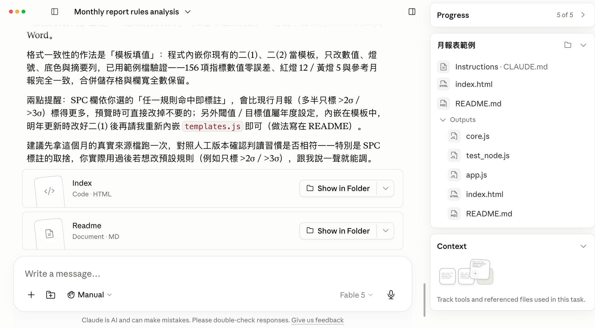

#### STEP 4：要求撰寫測試程式

```prompt [label="通常第一版會有問題，所以請 AI 自測"]
撰寫測試程式，確保功能符合需求
請使用範例檔作為來源，並驗證輸出檔結構相同
若有錯誤請一同修正
```

- 撰寫測試程式，可以`提高成功率`，並在未來新增功能時，可以`減少舊功能壞掉的問題`，讓工具更穩定
- 但注意：`AI 的自我驗證通過，不代表真的通過`

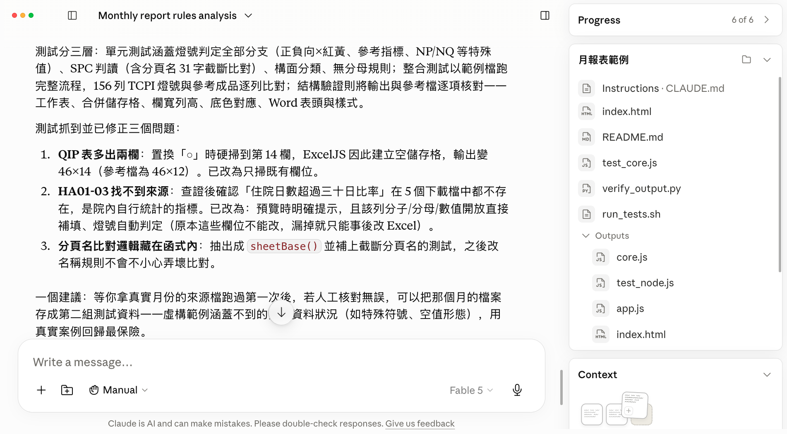

#### STEP 5：打開成品驗收

點擊`index.html`檔案開啟網頁，並上傳範例檔案

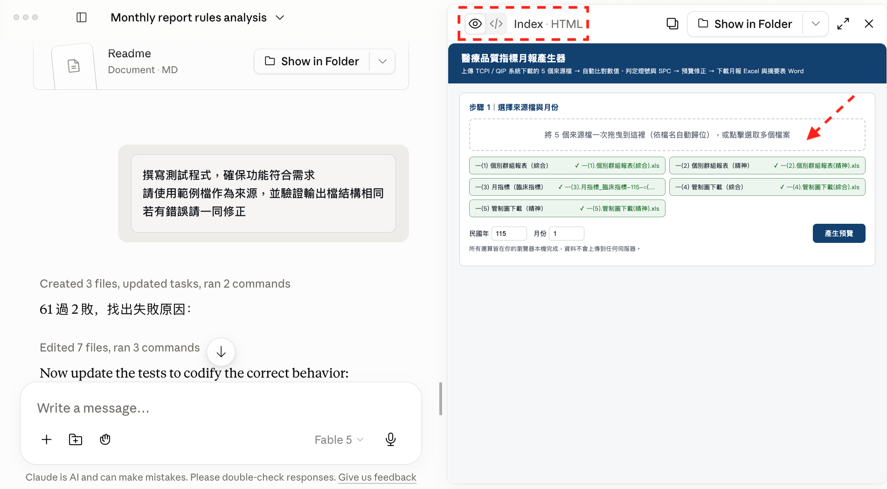

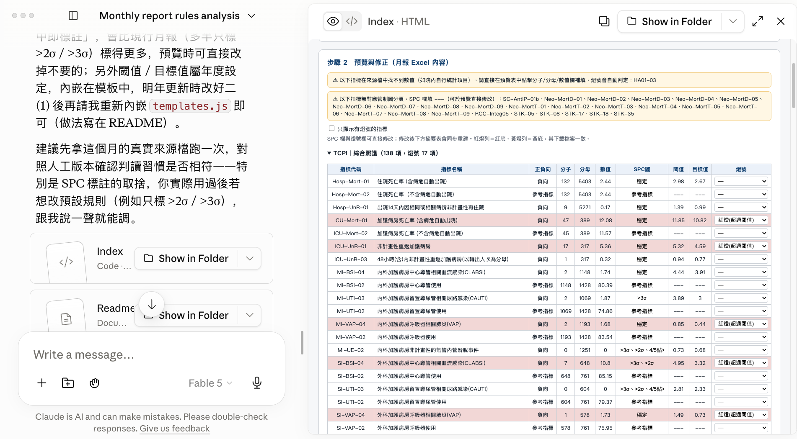

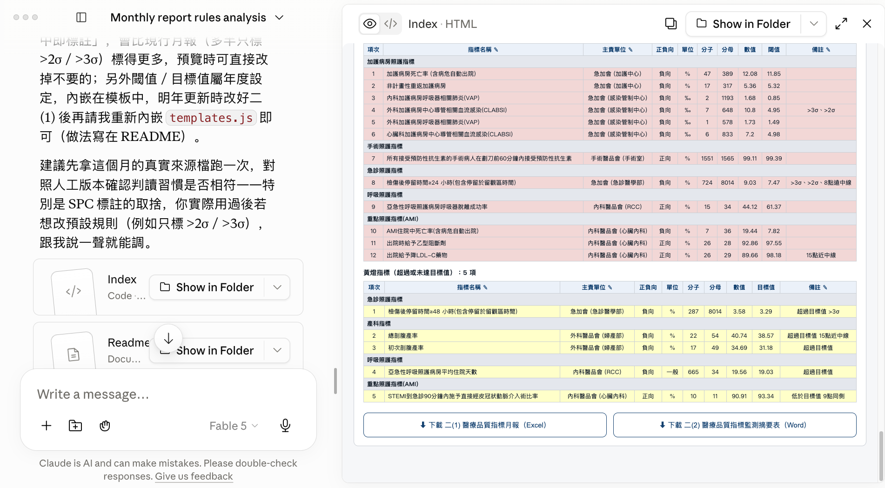

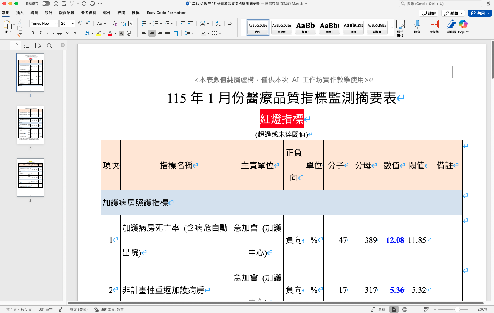

報表呈現的資訊`是否正確`，需要專家才有辦法確認，平常沒經手過的人是沒有這個敏銳度的

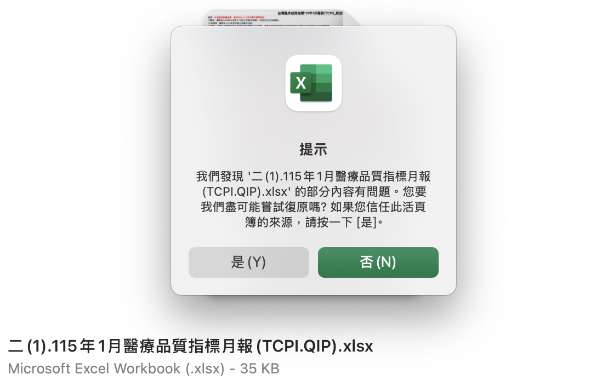

```prompt [label="如果有問題，可以文字加上圖片提供給 AI"]
我發輸出的 Excel 無法順利開啟，應該是格式問題
```

> **請 AI 修正時，他可能騙你**
> Excel 格式壞掉的問題，講者時常遇到 AI 修復後還是錯誤的狀況。

#### STEP 6：如果還是無法開啟，換個詢問方式

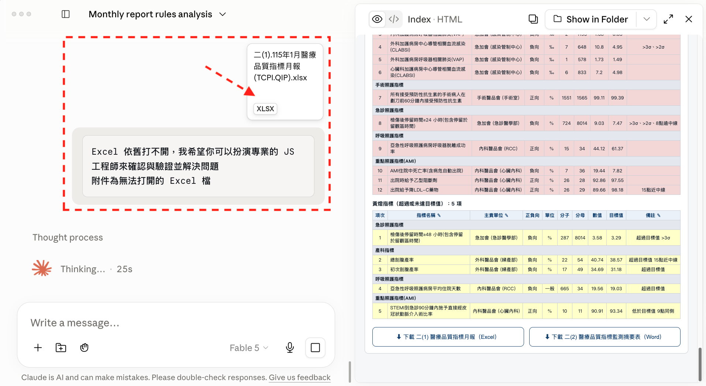

```prompt [label="修不好，就要求它換方法論"]
Excel 依舊打不開，我希望你可以扮演專業的 JS 工程師來確認與驗證並解決問題
附件為無法打開的 Excel 檔
```

- AI 上一輪宣稱「修好了、測試通過」，但 Excel `依舊打不開`
- 可以提供更明確的「提示詞」與「參考檔案」，這邊我讓它`扮演專業工程師、重新確認與驗證，並附上錯誤檔案`
- 請 AI 修正 Bug 時，選擇`更聰明的 Model 並將 Effort 調高能增加成功率`

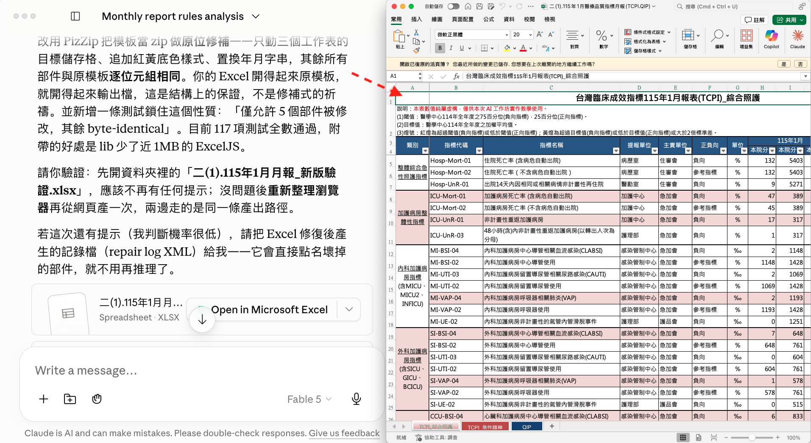

## 案例回顧

### 🧭 我們如何與 AI 協作

[flow]
1. 讀懂文件 — 先讓 AI 分清 9 份文件`哪些是原料、哪些是成品、哪些是規則`，確認資料流向沒錯才開工
2. 對齊方案 — 不直接下令開工，先問「`有推薦的組合嗎`」，並立下`格式一致`這條驗收底線
3. 明確目標 — 把需求收斂成「`雙擊 html 就能使用`」：免安裝、免部署、資料不出電腦
4. 要求自測 — 請 AI 撰寫測試程式，`提高成功率`，也讓未來加功能時更穩定
5. 親手驗收 — 實際打開網頁、下載 Excel／Word，`人工驗證馬上抓到 AI 自己沒發現的問題`
6. 換法修復 — 修不好就換個問法：`給角色（專業工程師）、給證據（錯誤檔案）、換更聰明的 Model`
[/flow]

### 💡 Vibe Coding 重要心法

- **驗收要在真實環境**：AI 的「驗證通過」是用它自己的工具量的，`成品一定要用真實環境親手打開`
- **修 Bug 靠方法，不靠運氣**：描述不出技術細節沒關係，`換個問法、附上證據、調高 Model 與 Effort、或是開一個新對話`
- **專業是最後一哩路**：你對資料的熟悉度，正是把工具`從 80 分推到 100 分的關鍵`

> **你不需要會寫程式，但一定要驗收**
> 整個過程我們`沒有寫一行程式`；但結果需要`親自驗收`，並在遇到問題時`引導 AI`。

[warning title="若打算正式導入請從多角度進行驗證"]
依衛福部指引，AI 在醫療場域是`輔助工具`，`行政主管與經辦人負最終判斷責任`，AI 產出的月報`必須經人工覆核`才能上呈。
另外，自己做的工具若要`全院正式導入`，記得依指引經`主責單位`完成風險盤點與評估，而不是個人默默上線。
[/warning]

---

# 護理師排班：從排一整天變成「AI 排、你校準」

> **這個情境比月報表難很多**
> 它是一個`有很多規則要同時滿足`的問題。
> 示範的重點`不是一鍵排出完美班表`，而是「怎麼跟 AI 討論、技術框架調整評估、實戰應用的優化。」

## 排班為什麼這麼難

### 😩 排班者的日常：規則複雜又容易衝突

[flow]
- **一次要顧十幾條規則** - 最低人力、連續天數、11 小時休息、包班……漏一條就得整段重排
- **牽一髮動全身** - 改一個人的班，`連鎖影響`前後好幾天、好幾個人
- **對錯藏在細節** - 違規的那一格`肉眼很難一眼抓出`，靠人工檢查又慢又累
- **每個月都要重來** - 這不是做一次就好，是`月月循環`的固定折磨
[/flow]

### 🧷 排班的基礎規則

1. **每班最低人力需求**：D:16／E:16／N:14
2. **連續上班天數**：D 最多 5 天／E 最多 5 天／N 最多 4 天
3. **排班階層分為 5 階**（資深 A～資淺 E）：每階層每天上班人數上限`如 Excel 表內公式`
4. **不能 N off D**：不能`大夜後又接白班`
5. **包班與班別限制**：包班（同班別 >15，`綠底、藍底`人員，每月會變動）以`純班（一種班別）`為原則；未包班人員每月`至多 2 種班別`；更換班別時，至少應有`連續 11 小時`的休息時間
6. **小組長人力**：每日 D、E、N 小組長都要 `≥ 2`
7. **新人不排班**
8. **標示黃色＝預排假**：不排班
9. **例假與休息日**：2 週內至少 `2 日例假`；4 週內至少 `8 日例假及休息日`（休息日可補休、特休）；六、日休假總次數盡量`各人員平均`
10. **工時上限**：每日正常工時 `≤ 10 小時`、4 週總正常工時 `≤ 160 小時`

> **這讓我回想起當兵時的哨表**
> 日哨夜哨的哨點不同、資深資淺能站的崗位不同、每班哨最短間隔時間、如何安排休假讓重要哨點都有人，在人力不足時的狀態下如何盡可能公平。

## 先設計 MVP

> **為什麼要先做 MVP？**
> `先求有、再求好`。MVP（Minimum Viable Product）是`最小可行產品`：先做出一個「能動的最簡版本」，再逐步優化。

### 🤖 我與 AI 的協作方式

[download file="assets/排班範例.zip" label="下載「排班範例」" desc="解壓後有排班相關檔案"]

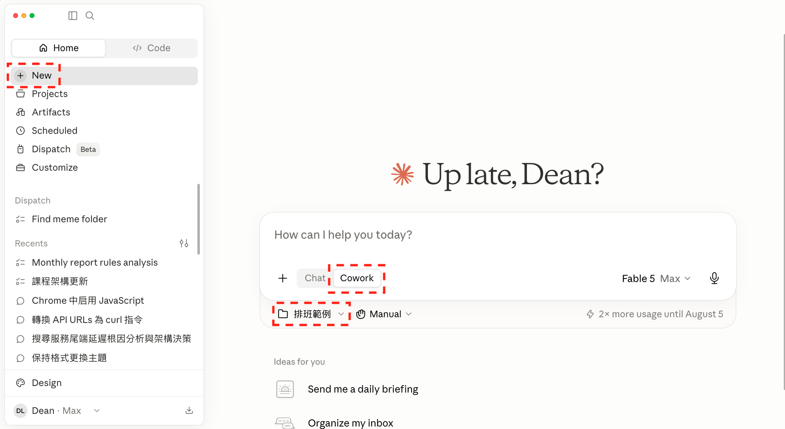

#### STEP 1：先讓 AI 讀懂規則，不急著動手

```prompt [label="先確認 AI 讀懂"]
分析「案例_醫事人員排班_V2.docx」的規則，並確認「ER班表檔案(修)_V2.xlsx」已存在的公式；不用驗證，先確認既有規則
```

- 資料夾內是一份 `Word 規則文件`＋一份`藏著 3421 個驗證公式`的 Excel 班表
- 先確認 AI `讀得懂你的資料`，包含「寫在 Excel 公式裡、沒寫進文件」的規則
- 相比於前面的月報表，這次 `AI 在分析時會花更多的時間`

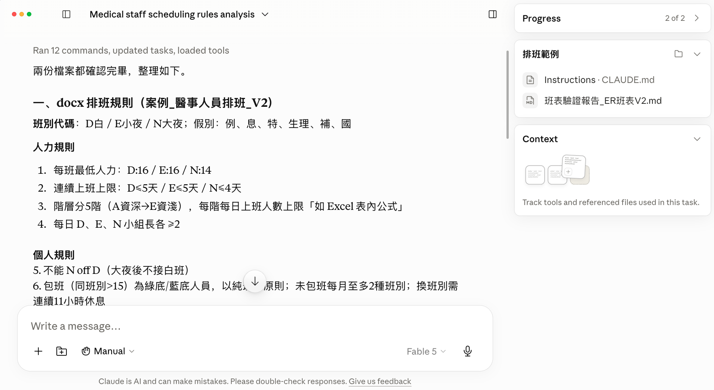

#### STEP 2：先問技術方案，不直接下令開工

```prompt [label="先詢問技術方案"]
我想要透過程式，讓我只要上傳上個月份的班表（如範例檔），下個月份的班表就能夠產生
希望有網頁的操作頁面，期待下載的班表，與上傳的班表在格式上是一致的，並且公式都還有保留
在技術上，有推薦的組合嗎？
```

- 先讓 AI 有推薦技術：`想完成任務有很多方案`
- 設定兩個最重要的規則：`格式一致`、`公式保留`

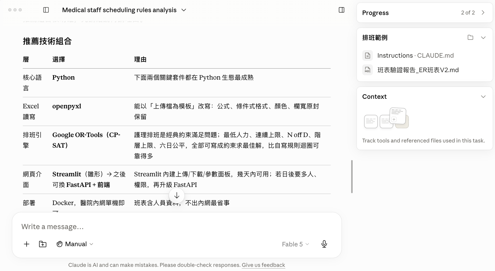

#### STEP 3：先設計 MVP，並且要「自我驗證通過」

```prompt [label="把驗收條件寫進指令裡"]
我希望建立一個「code」資料夾來完成這些程式，希望網頁設計上有彈性並有預覽功能，且自我驗證通過符合預期
```

- `要求建立資料夾（Code）放程式`，這是避免資訊混在一起，也方便未來的部署
- `預覽功能很重要`，不然下載才知道對錯會留下一堆檔案
- 排班結果有幾千個格子，難以逐格人工驗收，所以`要求 AI 先自行測試`

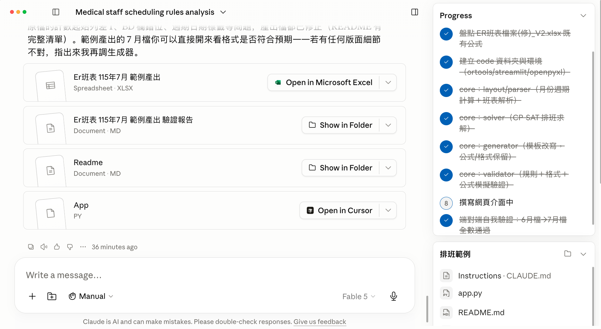

#### STEP 4：想換架構時，先用「問句」討論可行性

```prompt [label="最佳解未必是最適合的解"]
如果我希望使用前端網頁的方式實現，雙擊 html 就能操作，不依賴 Python，是有辦法做到的嗎？
我希望公式與樣式都保留
```

- Python 版能跑，但`安裝 Python、啟動專案`需要花時間建立環境
- 用問句而不是命令，讓 AI 評估「公式與樣式格都能保留」才動工，`避免重寫到一半才發現不可行`

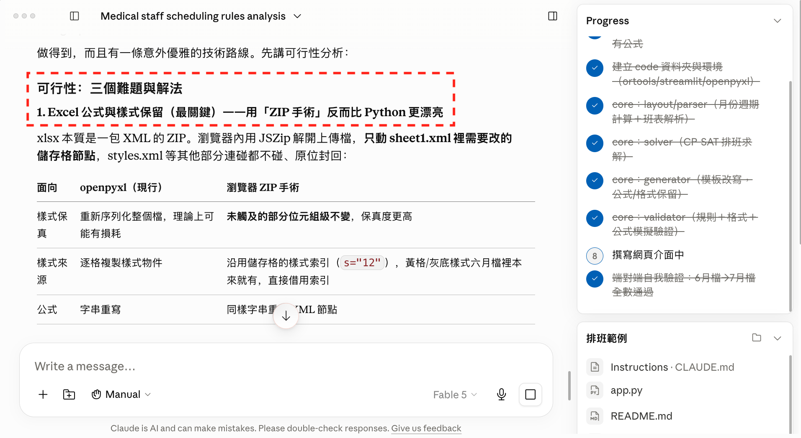

#### STEP 5：驗證生成的結果是否能用

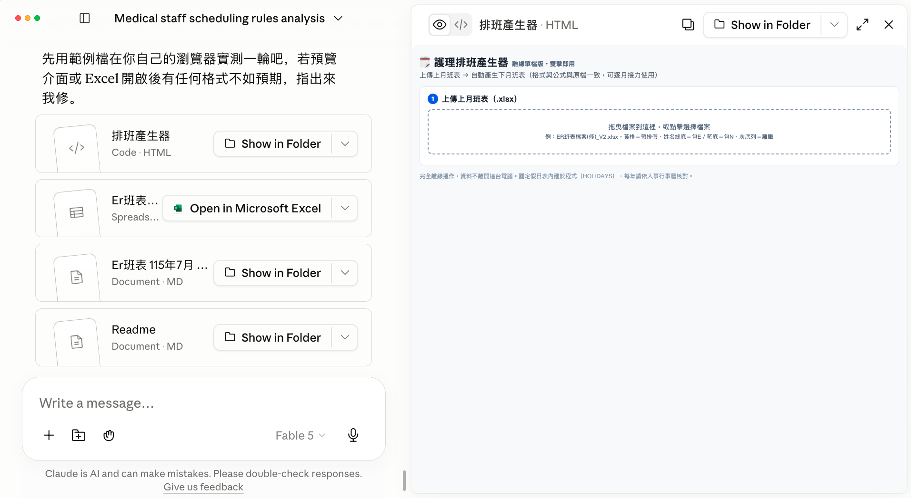

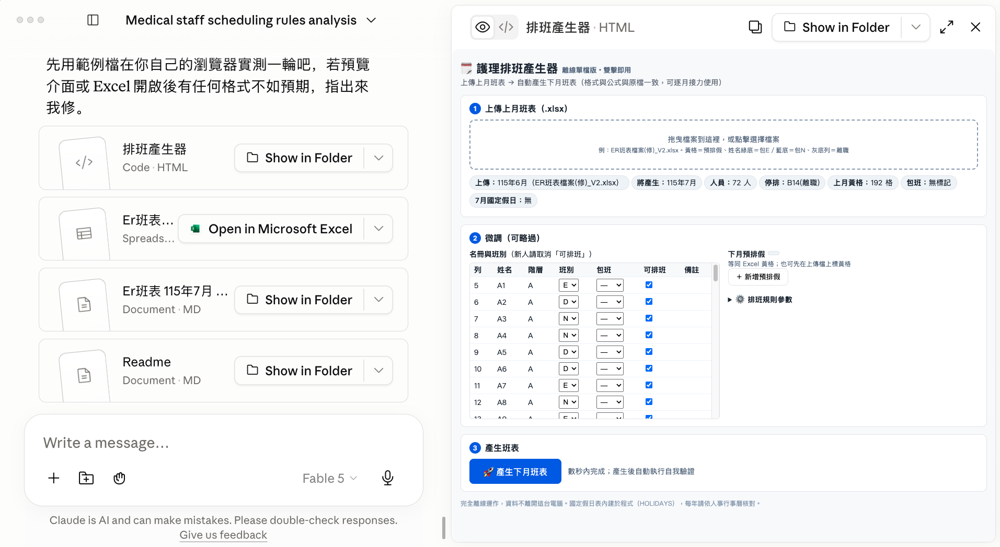

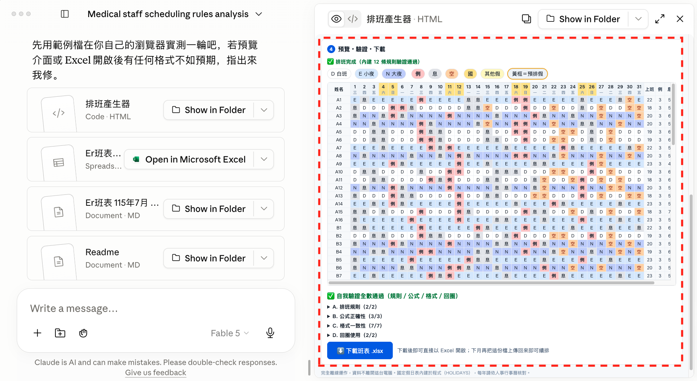

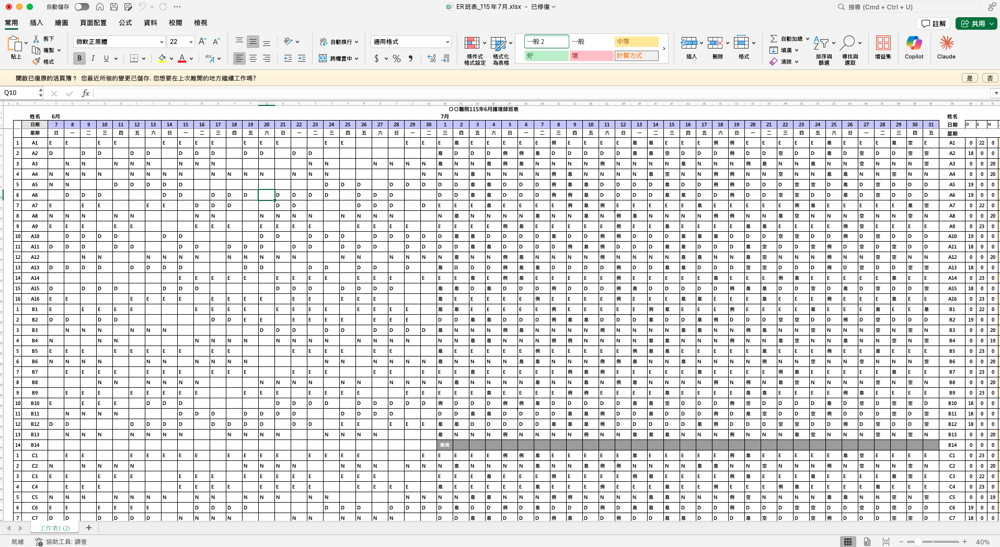

> **看起來能動，跟真的可以用是不同的**
> 用 AI 寫程式沒有門檻，但寫出可以`真正使用的產品需要花時間持續優化`。

## 優化是沒有盡頭的路

### 🙏 經過第一線實戰才會發現問題

#### 第 1 次試用

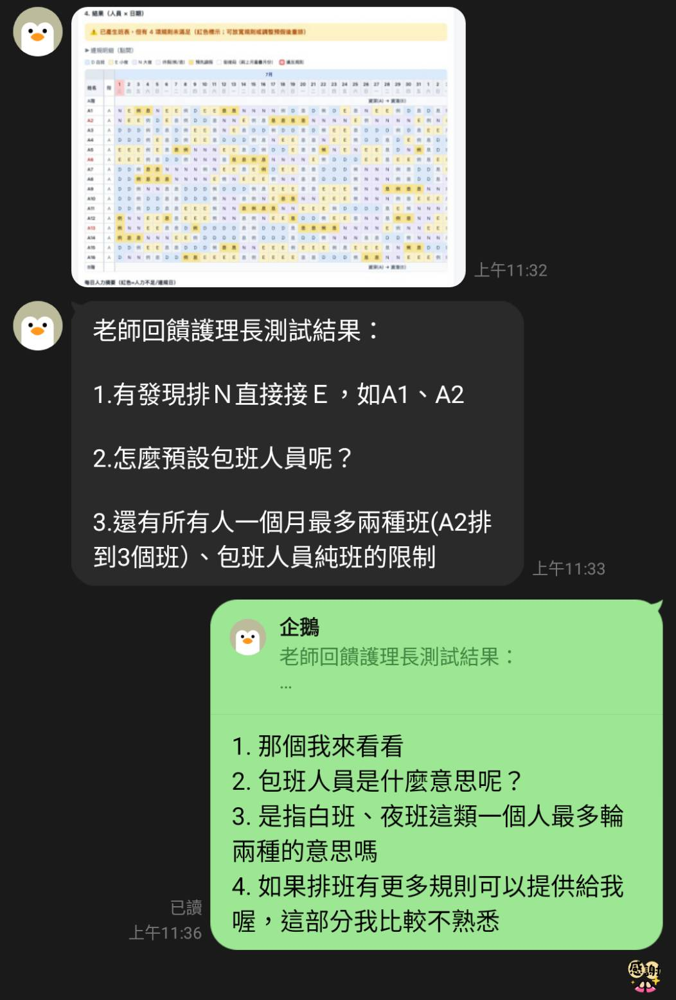

- 工具給第一線試用後，`很多外行人沒注意到的地雷就會被揭露`
- 護理長一眼就抓出`N 接 E`的違規班型，也點出我`沒預設包班人員`、漏了`每月最多 2 種班別`的限制

#### 第 2 次試用

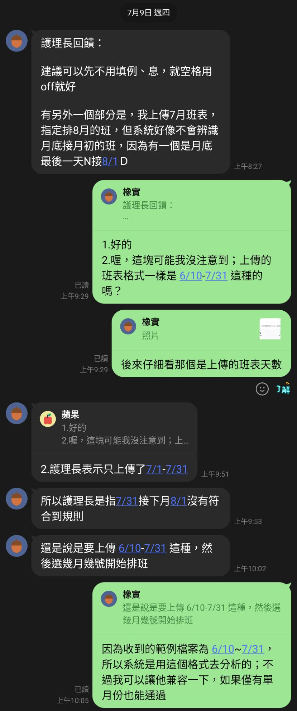

- 指出`跨月銜接的盲點`：上傳 7 月班表排 8 月，系統卻讓 `7/31 的 N 接 8/1 的 D`
- 因為系統是照範例檔 `6/10～7/31` 的跨月格式去分析，所以遇到`只上傳了單月`的情境時，工具沒考量到`相容性問題`

#### 第 3 次試用

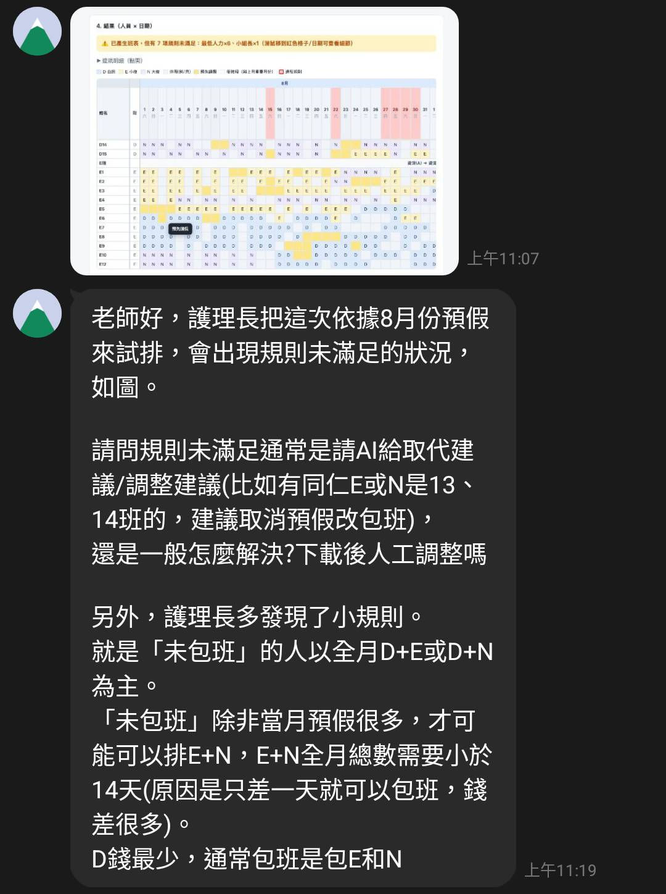

- 有些細節`不在文件而在經驗`
    - 未包班的人以 `D+E 或 D+N` 為主
    - E+N 全月總數要`小於 14 天`（只差一天就能包班，`錢差很多`）

> **真實的使用者會發現問題**
> 工具做完不是結束，`真實使用者試用過`，它才會進化成「能用」的樣子。
> Vibe Coding 製作工具的重點`不在於會不會寫程式`，而是你是否具備`知道哪裡不對`的判斷了；而正是 AI 和外部工程師`最缺`的東西。

## 純前端減少資安疑慮

### 🧩 前端、後端、資料庫，各自負責什麼

- **前端** — 你在瀏覽器裡`看得到、點得到`的畫面，負責`呈現資訊、接收你的操作`
- **後端** — 跑在`伺服器上`的程式邏輯，負責接收前端送來的請求、`運算處理後回傳結果`
- **資料庫** — 負責`長期保存資料`，後端把要留存的資料寫進去、需要時再查出來

### 🔒 純前端＝資料不出你的電腦

今天兩個工具（月報表、排班）都是`純前端網頁`，`沒有後端伺服器、也沒有資料庫`。

- 所有運算都在`你自己的瀏覽器`裡跑，`資料完全不離開電腦`、不上傳任何伺服器
- 所以`沒有資安疑慮`，可以放心在醫院電腦、甚至離線環境使用
- 這也是我要求 AI 設計時要`「雙擊 html 就能用」`的原因

> **但想讓系統更完善，就是另一個世界了**
> 如果你想`把資料儲存起來`不用每次重新上傳、讓不同的人有`不同權限`（有人只能`瀏覽`班表、有人可以`編輯`），甚至涵蓋`請假`等流程，就進入`後端＋資料庫`的範疇。
> 系統會開始`碰到個人隱私資訊`，`帳號權限、資安防護`每一項都要顧。
> 這時就`真的需要專業工程師`把關，**做雛形依然可以用 Vibe Coding，但隱私請交給專業**，這條界線要分清楚。

## 案例回顧

### 🧭 我們到底做了什麼

[flow]
1. 先讀懂 — 讓 AI 讀懂 Word 規則＋`藏在 Excel 公式裡的規則`，列出規則、反問確認後才動工
2. 問方案 — 先問「有推薦的組合嗎」，立下`格式一致、公式保留`兩條底線；想換架構（Python → 雙擊 html）也`先用問句確認可行`
3. 小步做 — 先完成 MVP，並要求 AI `自我驗證通過`：幾千個格子，不可能人工逐格驗
4. 反例糾錯 — 不說「怪怪的」，`用具體反例`（端午節不是每月都有、7 天後接 10）逼出設計層的錯
5. 迭代到直覺 — 用自己的排班工作流提需求：對照上月、違規標色、手動預假，`做好的功能也能推翻重做`
6. 給真實使用者試 — 護理長試排抓出`跨月盲點與包班等規則問題`，讓我們看到優化是沒有盡頭的路
[/flow]

### 💡 經驗是非常重要的

- **AI 排、你校準**：執行與測試都交給 AI，`你只負責判斷與決策`
- **現場的 know-how 只有你有**：包班、例假、兩種班上限……我一開始`一個都不懂`，全是`護理長回饋後`我才注意到的；工程師對這些陌生，就像你對技術陌生，但`技術可以問 AI，現場的 know-how 沒得問`

> **這就是 Vibe Coding 真正的魅力**
> 把做工具的主導權，`交回到最懂需求的人手上`。

---

# 加入 Git 版控：否則某次 AI 改壞就沒有回頭路了

## 為什麼要加入版本控制

### 🗂️ 給成品一個「家」，還附贈後悔藥

- 成品需要一個「家」，才不會`散落在桌面各處`，換電腦、重灌就找不回來
- GitHub 提供**版本控制**：`每次上傳都是一個「還原點」`，哪天 AI 改壞了，隨時可以`退回上一版`，這正好治「不知道被改壞」的痛
- 放上 GitHub 之後，還能透過 **GitHub Pages** 把工具`變成一個網址`，傳給同事就能直接用

> **不用打指令，也能用 GitHub**
> 很多人以為 GitHub 是工程師專用，其實今天要做的事`全程用滑鼠點一點、檔案拖一拖`就能完成——因為前面我們已經請 AI 把程式都收在 `code` 資料夾裡了。

## GitHub 網頁端上傳操作

### 🛠️ 建立專案，把檔案拖上去

如果你今天沒有跟到前面的實作，可以直接下載這兩個成品範例，`解壓縮後拉到網頁上`就能跟著做：

[download file="assets/月報完成範例.zip" label="下載「月報完成範例」成品" desc="解壓後即為要上傳的網頁工具檔案"]

[download file="assets/排班完成範例.zip" label="下載「排班完成範例」成品" desc="解壓後即為要上傳的網頁工具檔案"]

#### STEP 1：註冊／登入 GitHub

- 到 [github.com](https://github.com) 註冊帳號，`有 Email 就能辦`，免費
- 登入後，點右上角的「**＋**」→「**New repository**」

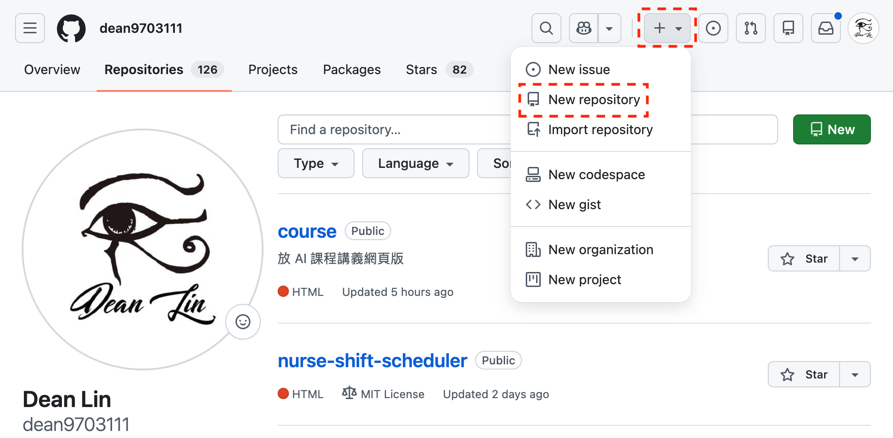

#### STEP 2：建立新專案（Repository）

- **Repository name** 填英文名稱（ex: `monthly-report-tool`）
- 選擇 **Public**（免費版的 GitHub Pages `需要公開專案`才能使用）
- 其他選項維持預設，按「**Create repository**」

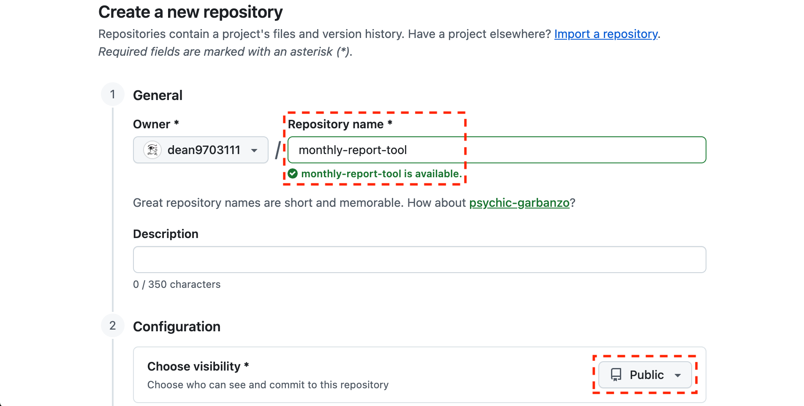

#### STEP 3：把檔案拖進網頁

- 在專案頁面點「**uploading an existing file**」
- 把解壓縮後`資料夾裡的所有檔案`全選，`直接拖進上傳區`
- 確認清單裡有 `index.html`——它是網頁的`預設入口`，**檔名不能改**
- 按下「**Commit changes**」完成上傳，這就是你的`第一個還原點`

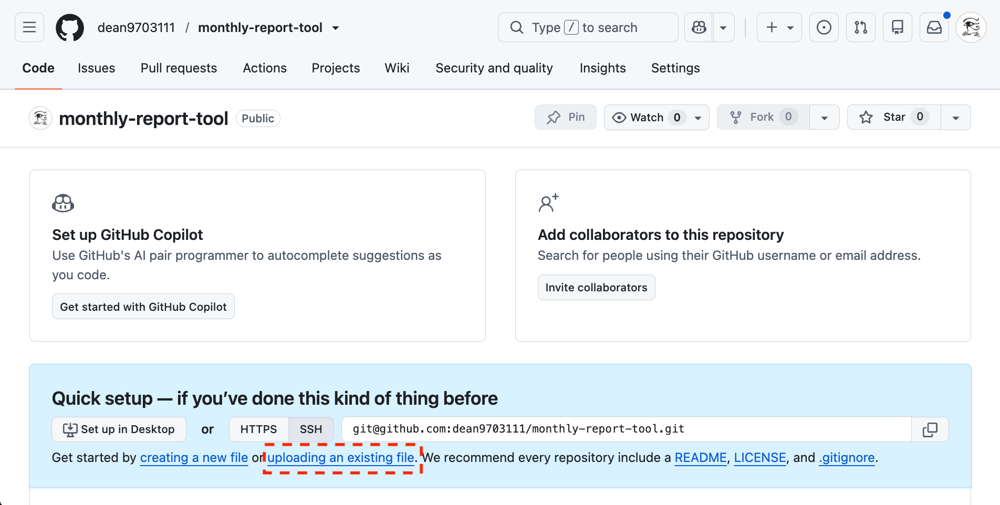

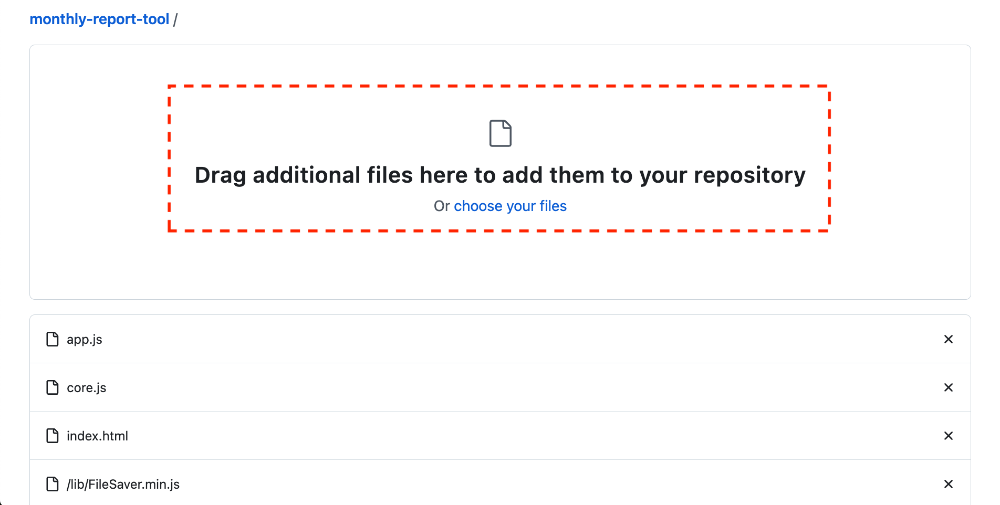

#### STEP 4：基礎驗證

- 回到專案首頁，`確認檔案都出現在列表裡`，尤其是 `index.html`
- 點進任一檔案能看到內容，代表上傳成功（`此時還只是存放程式碼`，下一步設定後才會變成能瀏覽的網頁）

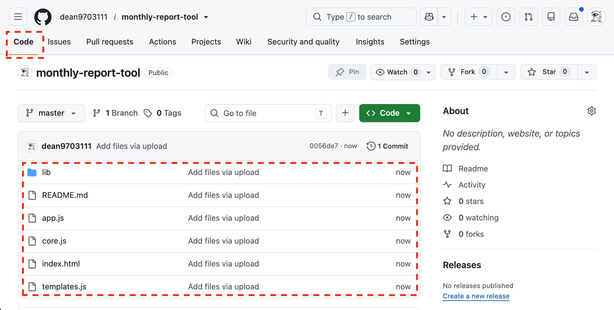

[warning title="Public 專案全世界都看得到，上傳前先檢查"]
- 病人資訊、真實班表、帳號密碼，`絕對不能`放進公開專案
- 要一起上傳的範例檔，一律用`假資料／去識別化`的版本
- 不確定的檔案，就先不要上傳
[/warning]

## GitHub Pages 網頁部署設定

### 🌐 三個設定，讓工具變成一個網址

#### STEP 1：開啟 Pages 功能

- 進入專案頁面上方的「**Settings**」，點左側選單的「**Pages**」
- **Source** 選「**Deploy from a branch**」
- **Branch** 選 `master`、資料夾選 `/ (root)`，按「**Save**」

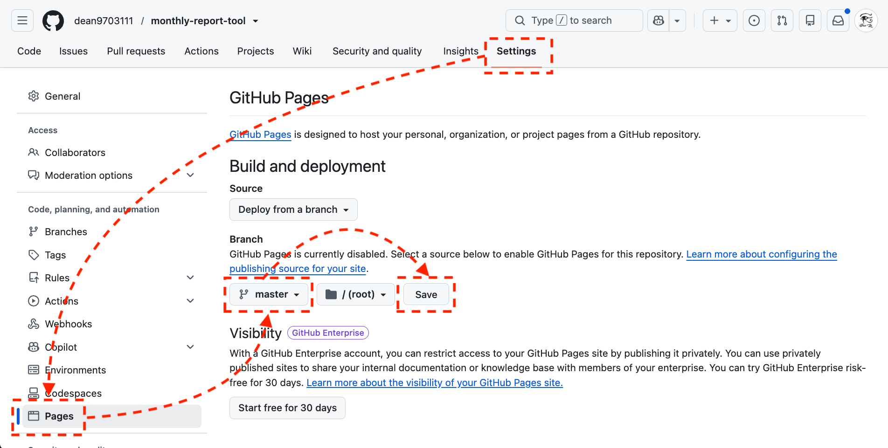

#### STEP 2：等待部署完成

- 等 1～2 分鐘後`重新整理頁面`，上方會出現你的專屬網址：`https://你的帳號.github.io/專案名稱/`

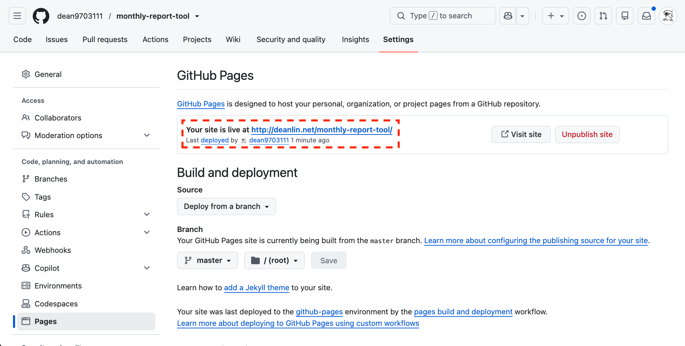

#### STEP 3：打開網址驗證

- 點開網址，看到的就是工具畫面——因為 `index.html` 是`預設的首頁`，所以不用加任何路徑
- `把網址傳給同事`，大家就能用同一套工具
- 實際跑一次流程（上傳範例檔 → 產出結果），確認`跟在自己電腦上雙擊 html 的行為一致`

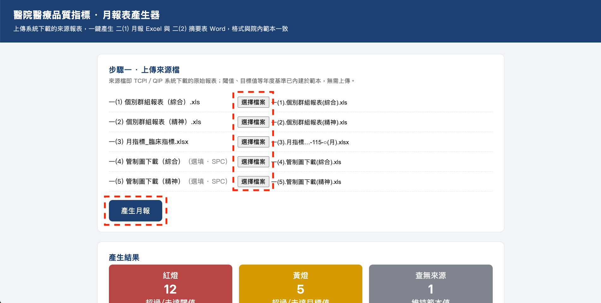

> **程式碼公開了，資料還是你的**
> 放上 GitHub Pages 之後，`公開的只有程式碼`；工具依然是純前端，`所有資料還是只在使用者自己的瀏覽器裡運算`，不會經過任何伺服器。

[flow]
1. 建立專案 — 在 GitHub 上為成品開一個「家」
2. 拖拉上傳 — code 資料夾裡的檔案直接拉上網頁（確認有 index.html）
3. 開啟 Pages — Settings → Pages → 選 master 分支 → Save
4. 拿到網址 — 等 1～2 分鐘，工具就有了專屬網址
[/flow]

## 上了 GitHub，還能讓 Claude 接手優化

### 💻 Claude App 的「Code」功能

程式放上 GitHub 還有一個好處：Claude App 裡有一個「**Code**」功能，可以`直接連接你的 GitHub 專案`，之後想優化工具，可以在 Claude App 裡用說的就好。

- 在 Claude App 點選「**Code**」，選擇`要連接的 GitHub 專案`
- 用文字描述你想要的優化，Claude 會`讀懂專案裡的程式`後給出做法
- 確認後讓它動工，`改好的版本會直接更新回 GitHub`——Pages 網址不變，`工具自動變成新版`
- 就算改壞了也不怕，`每一版都在 GitHub 留著`，隨時退得回去

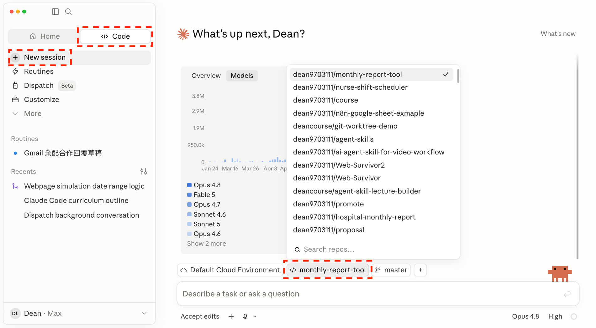

```prompt [label="詢問如何優化上傳方式"]
我想把這個工具變成可以「直接拖曳多檔案上傳」的方式，透過檔名與格式辨識
```

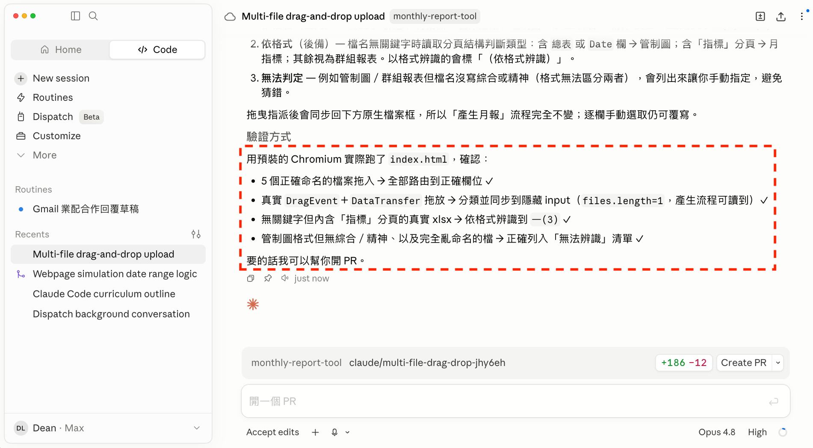

Claude 改好的內容會先放在`另一條草稿分支`上，不會直接動到正式版；要`合併（merge）回主線`，Pages 上的工具才會更新成新版：

```prompt [label="請 Claude 建立 PR 並完成合併"]
幫我 create PR 並完成 merge
```

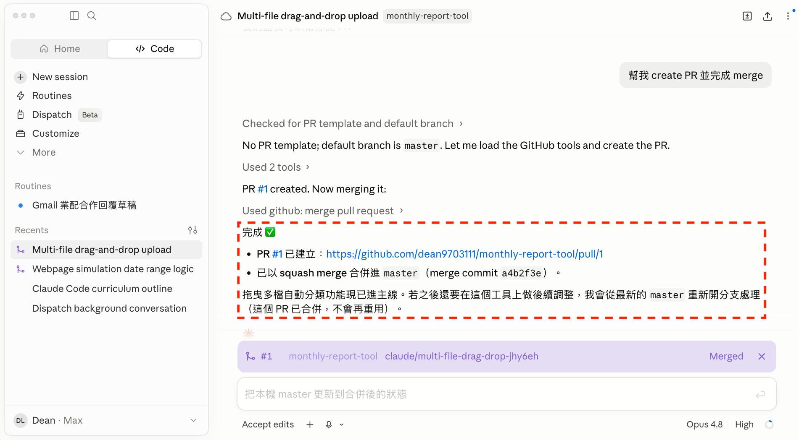

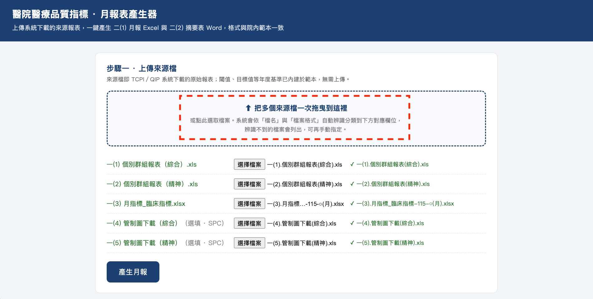

[warning title="雲端改程式很方便，但要知道它的極限"]
- 透過雲端變更程式，`消耗 Token 的速度較快、執行速度也較慢`，適合小幅度的優化
- 主要是幫助大家`初步了解版本控制與迭代的方向`
- 未來想完成`更複雜的功能`，還是要回到`終端機（地端）搭配程式碼編輯器`的方式處理，而不是單純靠雲端
[/warning]

---

# 📌 課程總結

### 🧭 我們今天走過的路

[flow]
1. 先立規矩 — 讀懂衛福部指引：病人個資不外流、人負最終責任
2. 認識幫手 — Connector 接外部工具、Project 建知識庫、Skill 把好方法變 SOP
3. 動手做工具 — 用 Cowork ＋ Vibe Coding，把月報表、排班從需求變成能用的工具
4. 學會抓問題 — 一次只做一件事、用具體反例糾錯、給真實使用者試用
5. 給成品一個家 — 上傳 GitHub 有還原點、設定 Pages 有網址，同事都能用
6. 讓迭代不中斷 — 用 Claude App 的 Code 功能接手優化，提出需求來優化細節
[/flow]

[summary]
- 🪞 **AI 是鏡子** | 它放大的是你的思路，先想清楚再動手，工具才是助力不是神器
- 🧭 **別追工具，追問題** | 觀察 → 看案例 → 對你有沒有幫助，三步判斷，不焦慮
- 🧩 **一次只做一件事** | 先讓 AI 讀懂規則；除了寫程式外還要讓它寫測試
- 🟨 **不確定就留白** | 不確定的數據寧可標黃，也不要讓 AI 用幻覺把你帶歪
- 🙋 **人在關鍵節點把關** | AI 生成的結果未必正確，一定要人類親手驗證過
- 🧠 **現場 know-how 是你的優勢** | 技術可以問 AI，但許多需求只有第一線的你才知道
- 🗂️ **成品要有還原點** | 放上 GitHub 就不怕改壞，開了 Pages 一個網址大家都能用
- ⚖️ **合規是所有應用的前提** | 醫院、同事、病人個資不外流，別忘記 AI 不能代替人背鍋
[/summary]

[qa-session title="Q&A 時間"]
[/qa-session]

---

# 🧰 附錄：想更進一步，先把環境準備好

> **Cowork 可以幫你完成雛形，但打磨細節需要 Claude Code**

## 為什麼要安裝工具？

### 🧠 AI 是大腦，這些工具是它的雙手

- 今天製作的範例（月報表、排班），Cowork `內建環境`就能跑，你什麼都不用裝
- 但像`音檔轉字幕`要用到 Python、`生成講義／提案`要用到 Node.js —— 這些就是 AI 動手的「雙手」
- 沒有這些工具，AI 就算知道怎麼做，也是`有腦無手`

## 建議安裝的工具清單

### 📋 一張表看懂：裝什麼、為什麼

| 工具 | 一句話說它是什麼 | 為什麼要裝 | 哪裡拿 |
| --- | --- | --- | --- |
| **Git** | 專案的「時光機」 | 改壞了能退回上一個版本 | [git-scm.com](https://git-scm.com/) |
| **GitHub 帳號** | 雲端「保險箱」 | 成品存上雲、跨裝置同步 | [github.com](https://github.com) |
| **nvm ＋ Node.js** | 網頁工具 | 實用的套件、網頁框架 | [nvm](https://github.com/nvm-sh/nvm) |
| **Python** | 工具箱 | Agent Skill 腳本常用 | [python.org](https://www.python.org/downloads/) |
| **IDE（程式碼編輯器）** | AI 的「工作桌」 | Cursor／VSCode 擇一即可 | [VSCode](https://code.visualstudio.com/) |
| **Claude 帳號（Pro 以上）** | 一張「門票」 | Cowork、Claude Code 都要它 | [claude.ai](https://claude.ai/) |

## 怎麼裝：Mac 與 Windows 分開看

> **看到「終端機」不用怕**
> 它就是`用打字下指令`的視窗：`Mac` 用「終端機（Terminal）」、`Windows` 用「PowerShell」。下面只列最關鍵的指令，其餘交給 AI 補完。

### 🔧 Git ＆ GitHub 帳號

先確認裝了沒、身份設了沒：

```terminal [label="確認 Git 版本與帳號設定"]
git --version
git config --global user.name
git config --global user.email
```

> **若名字或 Email 是空的，請補上**
> git config --global user.name "你的名字"
> git config --global user.email "你的 Email"

### ⚙️ nvm ＆ Node.js

我們`不直接裝 Node.js`，而是先裝 `nvm`（Node 的版本管理員），之後要升級、切換版本都方便。

#### Mac / Linux

```terminal [label="安裝 nvm"]
curl -o- https://raw.githubusercontent.com/nvm-sh/nvm/v0.40.4/install.sh | bash
```

#### Windows

到 [nvm-windows releases](https://github.com/coreybutler/nvm-windows/releases) 下載 `nvm-setup.exe` 安裝。

裝完 nvm，`重開終端機`，再裝 Node.js：

```terminal [label="安裝並確認 Node.js"]
nvm install --lts
nvm use --lts
node -v
```

### 🐍 Python

#### Mac / Linux

```terminal [label="確認 Python 版本"]
python3 --version
pip3 --version
```

#### Windows

```terminal [label="確認 Python 版本"]
python --version
pip --version
```

> **電腦有多個 Python 版本，套件裝了卻找不到？**
> 交給 AI 就好：「請幫我檢查目前 python 與 pip 指向哪個版本，並設定 alias 讓 python、python3、pip、pip3 都指向同一個版本，避免`套件版本飄移`」。

### 🤖 Claude Code

Cowork 免安裝就能用；`Claude Code` 是它更萬能的兄弟，但要在終端機操作。

#### Mac / Linux / WSL

```terminal [label="安裝 Claude Code"]
curl -fsSL https://claude.ai/install.sh | bash
```

#### Windows PowerShell

```terminal [label="安裝 Claude Code"]
irm https://claude.ai/install.ps1 | iex
```


裝完輸入 `claude` 啟動，第一次會請你`登入 Claude 帳號`。

[warning title="Claude Code 更萬能，也更危險"]
- 它能直接新增、修改、刪除你電腦上的檔案，能力比 Cowork 大得多
- 沒有程式背景時，AI 問「要不要執行」，多數人會直覺按「接受」—— 只要錯一次就可能出事
- 剛開始寧可慢：權限選「每步先問」，看清楚再放行
- 醫療電腦若有安裝限制，`先問過資訊室`再動手
[/warning]

## 確認有安裝成功：一行指令確認全部就緒

### ✅ 一次檢核所有版本

#### Mac / Linux

```terminal [label="一次檢核所有版本"]
git --version && node -v && python --version && claude --version
```

#### Windows PowerShell

```terminal [label="一次檢核所有版本"]
git --version; node -v; python --version; claude --version
```

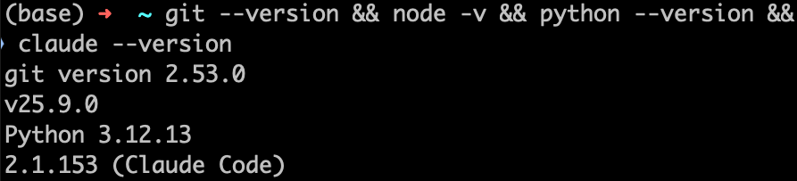

### 🛟 卡關速查表

| 狀況 | 處理方式 |
| --- | --- |
| 出現 `command not found` | 該工具還沒裝，回上面對應段落補裝 |
| Node 版本偏低 | `nvm install --lts && nvm use --lts` |
| Git 沒設定身份 | 補上 `git config --global user.name / user.email` |
| Claude Code 打不開 | 執行 `claude`，依畫面完成登入 |

[warning title="裝不起來很正常，不是你的問題"]
- 環境設定本來就是最容易卡的一關，`連工程師都常卡`
- 每台電腦狀況都不同，出錯是常態，不用自我懷疑
- 最好的除錯夥伴就是 AI：把錯誤訊息`原封不動`複製或截圖丟給它，請它一步步帶你解
[/warning]