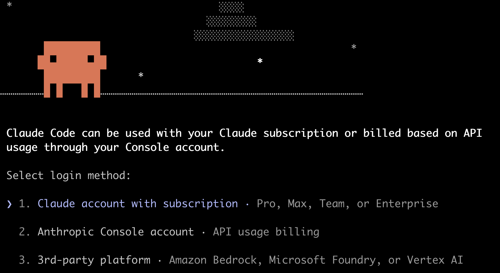
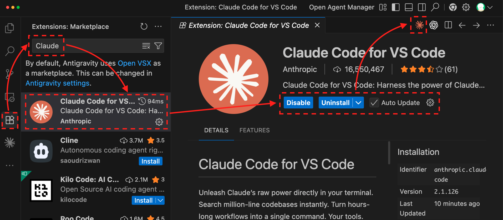
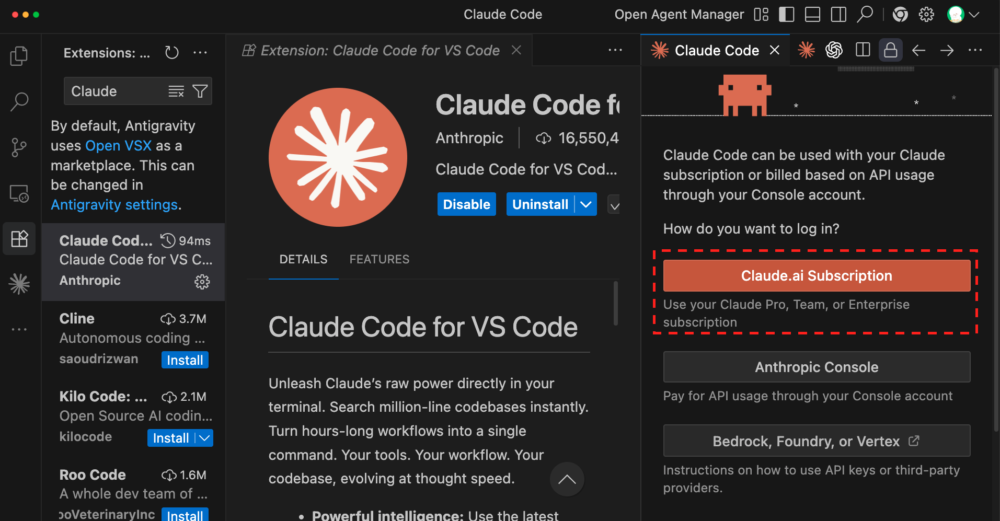
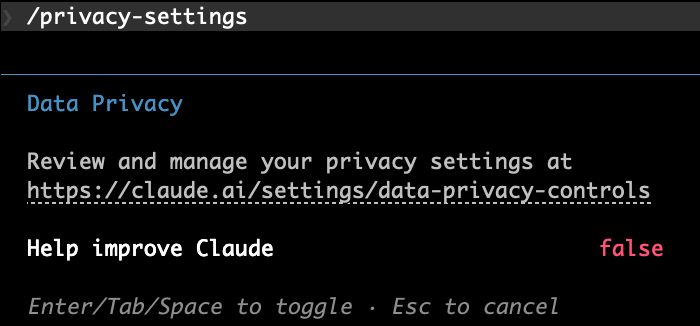
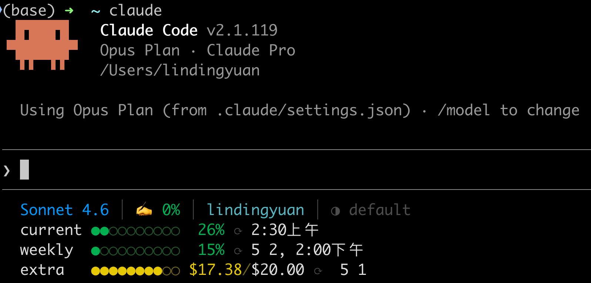
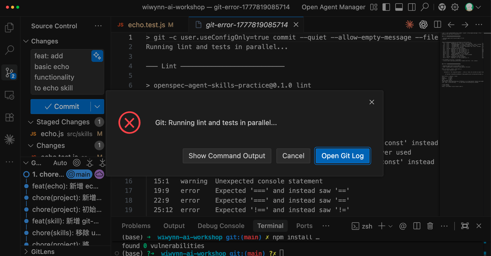
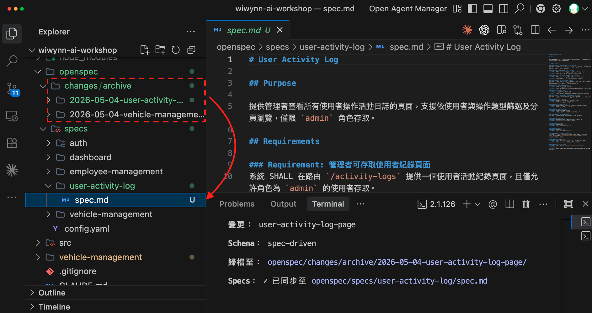
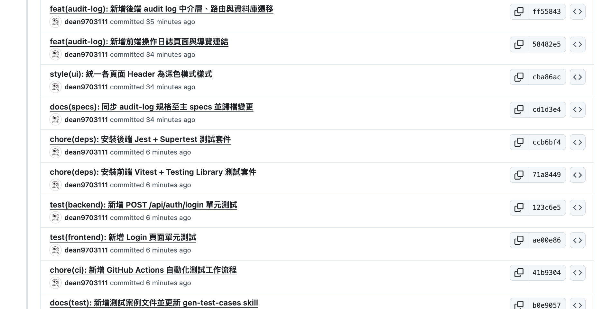
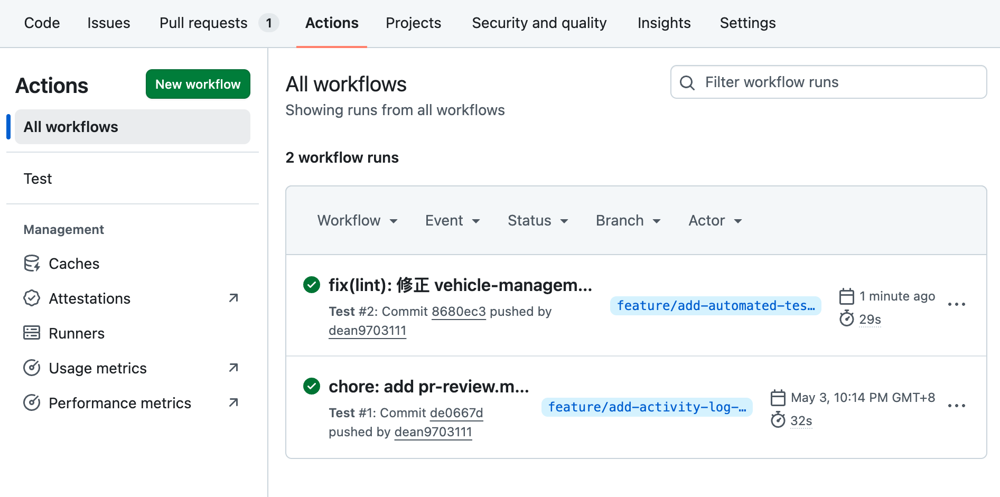
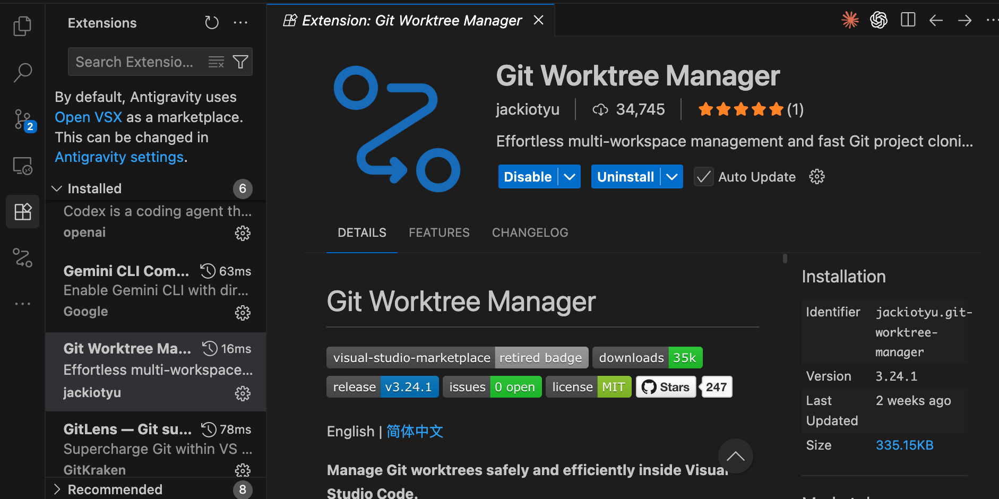

# 常見痛點：穩定性不足、難以維護、無法驗證

> 一句話 AI 就能生成有前端、後端、資料庫的系統，但...你敢用嗎？

## 不要讓 AI 的「快」，變成未來的「債」

### 😓 三大痛點

- **穩定性**：請 AI 解決目前的問題，改完後發現過去正常的功能被改壞了
- **複雜度**：功能持續增加，靠人工逐一確認流程，耗時又容易有遺漏
- **擴充性**：架構逐漸複雜後，任何修改都可能引發連鎖影響，出狀況時連問題都不知道如何定位

### 💪 將 AI 導入工作流

[flow]
1. Lint — 檢查程式碼風格，避免 AI 生成`風格不一致`，留下`多餘程式`，增加 Code Review 負擔。
2. OpenSpec - `讓 AI 根據規格文件做事`，完成從 0 到 1 的建立，更處理從 1 到 100 的迭代
3. 客製化 Agent Skills - 拆分 Commit 讓`邏輯可被追朔`、定義 Branch `命名規則`、設計 PR 方便 `Code Review`
4. 導入測試 - 確保`新功能`符合預期，`舊功能`執行穩定，並透過`測試覆蓋率報告`了解實際狀況
5. Git Flow - 加入`版本控制`與`分支策略`，確保出包時有回頭路，以及不影響到正式版本
6. CI/CD - 透過自動化工作流`檢查格式、測試功能`，並設定要`保護的 Branch`
[/flow]

---

# 前製作業：初探 Claude Code & 確認開發環境

## AI 是大腦，工具是雙手

### 🛠️ 確認開發環境

- **[Git](https://git-scm.com/install/windows)** — 版本控制工具，用來追蹤每次改動
- **[GitHub 帳號](https://github.com)** — 雲端 Git 儲存庫，用來管理專案
- **[nvm](https://github.com/nvm-sh/nvm)** — Node.js 版本管理工具，方便切換
- **[Python](https://www.python.org/downloads/)** — Agent Skills 的 scripts 大部分使用 Python 撰寫
- **[Cursor](https://cursor.com/)**、**[Antigravity](https://antigravity.google/)**、**[VSCode](https://code.visualstudio.com/)** — 安裝任一款程式碼編輯器（IDE）
- **[cmux](https://cmux.com/zh-TW)** - 更好用的終端機工具
- **[Claude 帳號](https://claude.ai/)** — 目前 Claude Code 需要 Pro 級別以上才能使用

#### 確認 Git & GitHub 帳號

```terminal [label="確認 Git 版本與帳號設定"]
git --version
git config --global user.name
git config --global user.email
```

> **若尚未設定，請執行**
> git config --global user.name "你的名字"
> git config --global user.email "你的 Email"

#### 安裝 nvm & 確認版本

**macOS / Linux**

```terminal [label="安裝 nvm"]
curl -o- https://raw.githubusercontent.com/nvm-sh/nvm/v0.40.4/install.sh | bash
```

**Windows**
前往 **[github.com/coreybutler/nvm-windows/releases](https://github.com/coreybutler/nvm-windows/releases)** 下載最新的 `nvm-setup.exe` 安裝程式

安裝完成後，**重新開啟終端機**，確認版本：

```terminal [label="確認 nvm 版本"]
nvm -v
```

#### 安裝最新版本的 Node.js 

```terminal [label="安裝 Node.js（透過 nvm）"]
nvm install --lts
nvm use --lts
node -v
```

#### 確認 Python 版本

**macOS / Linux**：可透過 alias 讓 python 指向 python3 版本

```terminal [label="確認 Python 版本"]
python3 --version
pip3 --version
```

**Windows**

```terminal [label="確認 Python 版本（Windows PowerShell）"]
python --version
pip --version
```

[lab-session title="🛠️  實作時間" duration="10 分鐘" hint="有問題歡迎提出，你的問題可能是大家的問題"]
- 確認 Git & GitHub 帳號
- 安裝 nvm & 確認 Node.js 版本
- 確認 Python 版本
[/lab-session]

## 在終端機使用 Claude Code

### 🛠️ 安裝 Claude Code

**macOS, Linux, WSL**

```terminal [label="安裝 Claude Code"]
curl -fsSL https://claude.ai/install.sh | bash
```

**Windows PowerShell**

```terminal [label="安裝 Claude Code"]
irm https://claude.ai/install.ps1 | iex
```

### 🚀 啟動 Claude Code

```terminal [label="啟動 Claude Code"]
claude
```



## 在 IDE 使用 Claude Code

### 🧩 從 Extensions 安裝

如果不習慣終端機操作，安裝 Claude Code 外掛也能使用大部分的功能。

1. 打開側邊欄 `Extensions`
2. 搜尋 `Claude Code`
3. 點擊 `Install`





### 🛡️ 調整隱私設定

Help improve Claude 默認為 `true`，請調整為 `false`。

```prompt [label="調整隱私設定"]
/privacy-settings
```



### 🚫 禁止 Claude 使用危險指令

AI 執行的指令是無法完全預期的，為了減少損失，可以透過設定來阻止危險操作。

```prompt [label="要求修改設定"]
我希望 Claude 在默認的 settings 禁止下面的指令（其他原有設定要保留）：
- 刪除：rm -rf, rm -fr, rm -r, rm -R, rm -f
- 最高權限：sudo
- 磁碟破壞：dd, mkfs, diskutil erase
- 權限濫用：chmod 777, chmod -R 777
- Git 不可逆操作：reset --hard, push --force, push -f, clean -f, branch -D
- 系統關機/重開：shutdown, reboot
- 檔案清空：: >, truncate
完成後給我看設定檔
```

[lab-session title="🛠️  實作時間" duration="10 分鐘" hint="有問題歡迎提出，你的問題可能是大家的問題"]
- 在終端機使用 Claude Code
- 在 IDE 使用 Claude Code
- 調整隱私設定
- 禁止 Claude 使用危險指令
[/lab-session]

### 📂 了解 Claude Code 工作目錄

[html src="./html/claude-folder-structure.html"]

> **Tips**
> .claude/ 就像給 Claude 一本專屬手冊：告訴它你是誰（設定）、你可以做什麼（權限）、你想怎麼做（規則）、你希望它自動完成什麼（技能），以及特別的角色（代理）。
> 專案層級放在 your-project/.claude/，使用者層級放在 ~/.claude/，**兩者會合併生效，專案設定優先。**

### ⚙️ 了解 Rules / Commands / Skills / MCP 應用場景

**1. Rules（CLAUDE.md）：**`每次對話都會參考`，記錄專案技術棧、規範、注意事項；不要寫太多，會佔用上下文空間
**2. Skills：**把日常工作中執行任務的細節、技巧、判斷模式放進去，AI 遇到`相關任務時會主動觸發`
**3. Commands：**可以設計完整工作流（ex: 執行多個 Skills），要`手動觸發`
**4. MCP：**透過標準介面`呼叫其他工具的 API`，操作方式較穩定、可預期

### 🤖 Claude 不同操作模式

| 模式 | 無需詢問即可執行的操作 | 最適合 |
| --- | --- | --- |
| **default** | 僅讀取 | 入門、敏感工作 |
| **acceptEdits** | 讀取、檔案編輯和常見檔案系統命令（mkdir、touch、mv、cp 等） | 迭代您正在審查的程式碼 |
| **plan** | 僅讀取 | 在變更前探索程式碼庫 |
| **auto** | 所有操作，具有背景安全檢查 | 長時間執行的任務、減少提示疲勞 |
| **dontAsk** | 僅預先批准的工具 | 鎖定的 CI 和指令碼 |
| **bypassPermissions** | 除受保護路徑外的所有操作 | 僅隔離容器和 VM |

> **對話時**：可以按 Shift+Tab 循環「default → acceptEdits → plan」
> **啟動時**：可以用「claude --permission-mode `plan`」來設定

### 📊 設定 Status Line

Context 被壓縮（Compact）、Claude 忘記前面資訊、額度耗盡時，如果沒有 Status Line 完全不會意識到。

```terminal [label="了解目前 Claude Code 額度"]
npx @kamranahmedse/claude-statusline
```



[lab-session title="🛠️  實作時間" duration="5 分鐘" hint="有問題歡迎提出，你的問題可能是大家的問題"]
- 設定 Status Line
[/lab-session]

---

# 新專案：使用 OpenSpec，用規格驅動開發

## 下載課程範例，了解 Lint & Test 重要性

### 🗂️ 課程範例 Repository

[下載 Repository](https://github.com/deancourse/wiwynn-ai-workshop) 後，可以跟著課程進度操作，裡面有事先安裝好的 Agent Skills（放在 `.agents` 資料夾下）

```terminal [label="Clone 課程 Repo"]
git clone git@github.com:deancourse/wiwynn-ai-workshop.git
cd wiwynn-ai-workshop
```

> **還沒設定 SSH Key？**
> 如果 clone 失敗，代表尚未設定 GitHub SSH 金鑰。
> 請參考 [GitHub 官方教學](https://docs.github.com/en/authentication/connecting-to-github-with-ssh) 完成設定。

### 🤖 可以使用不同的 AI Agent

雖然課程講的是 Claude Code，但 Cursor、Codex、Antigravity 這些`主流工具都支援  Rules / Commands / Skills`。

每個 AI Agent 的路徑稍不同，可以使用 [dotagents](https://github.com/dean9703111/dotagents) 來協助建立 symlinks。

```prompt [label="將 Agent Skills 同步到指定的 AI Agent"]
npx @dean9703111/dotagents
```


### 🚀 懂技術會讓 AI 效能加倍

**1. AI 有一定隨機性：**即使有 Rules 規範，AI 生成的格式（ex: 縮排、引號）可能`每次都不一樣`，而且有可能`動到原有邏輯`。
**2. 人會遺漏的讓流程補：**在專案有多個功能同時開發時，`合併可能會遇到衝突`，而 Function 的「}」跟 Array 的「,」都是容易肉眼沒注意到的錯誤。
**3. 加上 Pre-commit：**Commit 前確保專案 `Coding Style 一致性、測試都通過`。

```terminal [label="安裝套件"]
npm install
```

#### 設計 Lint 錯誤

調整 `src/skills/echo.js`，貼上下面程式

```code [label="ESLint 錯誤範例"] 
// 1. no-var — 應使用 let/const，不應使用 var
var oldStyleVariable = "hello";

// 2. prefer-const — 宣告後從未重新賦值，應使用 const
let neverReassigned = 42;

// 3. no-unused-vars — 宣告了但從未使用
let unusedVariable = "nobody uses me";

// 4. no-console — 不應在生產程式碼使用 console
console.log("debug info:", oldStyleVariable, neverReassigned);

// 5. eqeqeq — 應使用 === 而非 ==
export function loosyComparison(a, b) {
  if (a == b) {
    return true;
  }
  if (a == null) {
    return false;
  }
  return a != b;
}

// 6. no-unused-vars (參數) — 函式參數宣告但未使用
export function unusedParam(used, notUsed) {
  return used * 2;
}

// 7. no-undef — 使用未宣告的變數 (ESLint recommended 規則)
export function usingUndeclared() {
  return undeclaredGlobal + 1;
}

// 8. 組合錯誤：var + no-console + eqeqeq 全部出現在同一個函式
export function allInOne(input) {
  var result = 0;
  console.log("input received:", input);
  if (input == 0) {
    result = -1;
  }
  return result;
}
```

#### 設計 Test 錯誤

調整 `src/skills/__tests__/echo.test.js` 測試案例

```code [label="Test 錯誤範例"] 
import { echo } from "../echo.js";

describe("echo skill", () => {
  it("returns the same string", () => {
    expect(echo("hello")).toBe("helloa")
  });

  it("returns an empty string", () => {
    expect(echo("")).toBe("12");
  });

  it("throws when given a non-string", () => {
    expect(() => echo(42)).toThrow(TypeError);
  });
});
```

#### 嘗試 commit 變更



> **把 AI 犯錯當成必然**
> 比起讓 AI 永不犯錯，更重要的是設計當 AI 犯錯時警告的通知！

[lab-session title="🛠️  實作時間" duration="15 分鐘" hint="有問題歡迎提出，你的問題可能是大家的問題"]
- 下載課程範例 `git clone git@github.com:deancourse/wiwynn-ai-workshop.git`
- 安裝 `npx @dean9703111/dotagents` 讓多個 AI Agents 更容易管理
- 安裝專案套件 `npm install`
- 設計 Lint + Test 錯誤，了解流程的重要性
[/lab-session]

## 🔧 安裝 OpenSpec，完成基礎設定

```terminal [label="安裝指令"]
npm install -g @fission-ai/openspec@latest
openspec init
```

## 📦 了解 Agent Skills 架構

- **Skills** — AI 在對話過程中自動觸發的技能包，不需要背指令
- **Commands** — 用 `/opsx` 前綴強制驅動：apply / archive / explore / propose
- 可透過 `openspec config profile` 擴充更多 workflows

```prompt [label="查看 Skill"]
我想知道 openspec 目前安裝的 skill 用途
請使用表格呈現，用白話簡短描述
```

## 🎯 用 SDD 讓 AI 根據規格建立專案

### Prompt 設計三要素

[flow]
1. 專案目標 — 大方向描述需求，AI 會釐清細節
2. 使用技術 — 指定使用技術，便於團隊接手
3. 細節討論 — 提醒 AI 主動提問，釐清模糊需求
[/flow]

> 使用「Plan Mode」，並請 AI 與自己釐清細節會得到更好的結果；下面 Prompt 是讓大家快速體驗完整流程

```prompt [label="建立 MVP 系統"]
設計車輛管理系統，包含以下功能：
- 登入頁面（帳號密碼驗證，區分管理者與一般使用者）
- 首頁儀表板（上方顯示關鍵數據卡片，下面顯示資料圖表）
- 車輛管理頁（可檢視、新增、編輯、刪除車輛資料）
- 員工管理頁（僅管理者可檢視、新增、編輯、刪除員工資料）

前端使用 React 搭配 Magic UI，使用 MSW Mock API 模擬後端回應
參考 openspec 的 skill 執行，以最小可行性方案來規劃
```

### 📋 OpenSpec 如何建立文件規格

[flow]
1. proposal.md — 確認目標與範圍
2. design.md — 技術選型與風險評估
3. specs/ — 按功能分類的詳細規格
4. task.md — 任務清單，完成自動打勾
[/flow]

```prompt [label="開始實作"]
開始實作
```

第一次啟動可以請 AI 幫忙，因為 AI 有很高的機率在第一版遇到零星錯誤

```prompt [label="讓 AI 協助啟動"]
請幫我啟動專案
```

初步確認功能符合預期後，請他將變更歸檔

```prompt [label="歸檔"]
功能符合預期，進行歸檔
```

## 📐 設定 CLAUDE、OpenSpec 專案規則

**CLAUDE.md** 是給「做事」用的，**openspec/config.yaml** 是給「規劃」用的

```prompt [label="初始化規則"]
/init
```

```prompt [label="OpenSpec 設定"]
Please read openspec/config.yaml and help me fill it out
with details about my project, tech stack, and conventions
```

## 🗂️ 設計 README.md、.gitignore 並加入版控

初版完成後，要加入版控；未來更新時，才會清楚 AI 到底改了哪些細節

```prompt [label="設計 .gitignore、README.md"]
請幫我設計專案的「.gitignore」但「.claude、openspec」要加入版本控制
並且將「專案簡介與啟動方式」寫入 README.md
```

> 先使用內建的 AI 來 Generate Commit，Commit 後將變更 Sync Changes 更新上去

---

# 舊專案：根據情境設計 Skills，讓 AI 有執行依據

> **建立客製化 Skill 的重要性**
> 不同部門、團隊都有自己的工作流，專案也有各自的情境；而 Agent Skills 讓每次達成的目標，成為下次的起點。
> **根據需求建立 Agent Skills，畢竟能實際給予幫助的，才是好的 Skill。**

## 🗂️ 課程範例 Repository

[下載 Repository](https://github.com/deancourse/tku-ai-sharing) 後，可以跟著課程進度操作，裡面有事先安裝好的 Agent Skills（放在 `.agents` 資料夾下）

```terminal [label="Clone 課程 Repo"]
git clone git@github.com:deancourse/tku-ai-sharing.git
cd cake-2026-build-with-ai
```

> **還沒設定 SSH Key？**
> 如果 clone 失敗，代表尚未設定 GitHub SSH 金鑰。
> 請參考 [GitHub 官方教學](https://docs.github.com/en/authentication/connecting-to-github-with-ssh) 完成設定，或改用 HTTPS：`https://github.com/deancourse/cake-2026-build-with-ai.git`

## ✨ 用 OpenSpec 新增功能

[flow]
1. 閱讀專案既有架構、功能 — 確認要新增還是修改
2. 開始設計規格文件 - 一樣跑「proposal ⭢ design ⭢ specs ⭢ task」
3. 完成任務後，彙整河道原有規格 - 對快速迭代、多人合作專案幫助極大
[/flow]

```prompt [label="新增功能"]
增加使用者紀錄頁面，供管理者查看
使用 OpenSpec
```

```prompt [label="確認後實作"]
開始實作
```

```prompt [label="歸檔變更"]
幫我歸檔
```



> **為什麼 1 到 100 比 0 到 1 更難？**
> 如果沒有規格文件，下次改功能時 AI **不知道之前的設計邏輯**，可能把**同一個功能重複寫**好幾次，或**改 A 壞 B**。
>
> 用 OpenSpec 每次迭代都會在 Source Control 留下規格變更，**AI 跟人類都有文件可以參考**。避免關鍵人物離職後，系統知識直接斷層。

## 🌿 設計 Branch Name Skill

### 為什麼需要 Branch Name Skill？

[tags]
- [orange] 人工命名：風格不一致（`feat/...`、`feature/...`、`feature-...`）
- [purple] AI 隨意生成：無法反映任務範疇，也不符合團隊規範
- [green] 解法：git-branch-name Skill
[/tags]

**Skill 的設計邏輯：**
- 讀取當前 OpenSpec 任務描述或 commit 範疇
- 依照 `type/short-description` 格式生成分支名稱
- 確保命名規則在整個團隊一致，可加入 `feat`、`fix`、`chore`、`refactor` 等前綴限制

```prompt [label="新增分支"]
生成 branch
```

> **為什麼 Agent Skills 可以節省 Token？**
> 因為只讀取 Meta data（name、description），description 的重點不是描述 Skill 要做什麼，而是**在哪些情境會被觸發**。

## 📝 設計 Commit Skill

### 為什麼需要 Commit Skill？

- 分析變更的檔案 → 判斷應拆成幾個 commit → 分段提交
- 不同功能的修改分開 commit，讓邏輯可被追蹤
- 保持好習慣：每做完一件事就 commit，不要多功能混一起

[tags]
- [orange] 人工手打：耗時且風格不一致
- [purple] AI 自動生成：長短隨機、中英混雜
- [green] 解法：git-smart-commit Skill
[/tags]

```prompt [label="拆分 Commit"]
新增 commit
```



> 如果想測試 git-smart-commit Skill，可以切換到 `feature/add-activity-log-page` branch，輸入 `git reset --soft a401f90f168a37bf2d1d3239863221d219362b41`

## 🔀 設計 PR Skill

### git-pr-description Skill

- 比對當前分支與目標分支的差異
- 讀取 commit 訊息與變更檔案
- 參考 `pr-template` 生成 Title 與 Description（漸進式揭露）

```prompt [label="生成 PR"]
撰寫 PR，與 develop branch 比對
```


> **人，才是 AI 的瓶頸**
> Code Review 的速度已經跟不上 AI 寫程式的速度。當人成為 AI 的瓶頸時，要去想的是如何**降低門檻，而不是放棄審核。**
>
> **設計 Commit、PR 的 Skill 就是透過優化流程讓開發更順暢。**雖然每一步都是 AI 在執行，但如果沒有實務經驗，其實不知道怎麼串起這些工具。**真正值錢的不是工具本身，而是知道什麼時候用、怎麼組合。**

[bonus title="🤖 用 /codex:review 讓 AI 幫你 Code Review"]
**安裝步驟（只需執行一次）**

```
/plugin marketplace add openai/codex-plugin-cc
/plugin install codex@openai-codex
/codex:setup
```

**使用方式**

```
/codex:review
```

Codex 會自動偵測 git 變更量，詢問執行模式：
- 變更小（1–2 個檔案）→ 建議前景等待
- 變更大 → 建議背景執行，完成後用 `/codex:status` 查結果

背景執行時不會打斷你，可以繼續開發其他功能。

**審查結果包含**
- 結論：`approve` 或 `needs-attention`
- 每個問題的檔案位置、嚴重程度（critical / high / medium / low）、修改建議

Codex **只審查，不自動修改**；你確認後再決定要改哪些。

**好處**
1. **第二雙眼睛** — Codex 與 Claude 訓練背景不同，容易發現彼此的盲點
2. **不打斷工作流** — 背景執行，審查與開發並行
3. **比人工快** — 幾十秒內拿到按嚴重程度排列的問題清單
4. **強制分離「找問題」與「改問題」** — 避免 AI 悄悄改到不該動的地方
[/bonus]

---

# 導入測試：讓維護與擴充更有底氣

> 市場不會為爛產品買單；加入自動化測試，是 Vibe Coding **從玩具走向產品的關鍵**

## 🔄 建立適合專案的測試工作流

[flow]
1. 建立資料夾 — 存放測試清單
2. AI 撰寫清單 — 類型、說明、輸入、期待輸出
3. 人類 Review — 確認情境有無遺漏
4. AI 撰寫測試 — 描述與文件一致
5. 自主驗證 — 最多嘗試 5 次
[/flow]

```prompt [label="生成測試案例"]
（拖入要測試的檔案，ex: src/pages/LoginPage.tsx）
生成測試
```

### 💡 實務建議
- 不要一口氣生成所有測試，`先放一個檔案`確認結果符合預期
- 每個頁面/模組有`獨立的測試程式`，方便定位問題
- 測試案例會隨規格變更而調整，`不可能一次到位`

> **千萬不要嫌寫測試浪費時間，測試其實是在幫你加速開發。**
> 現在儘管有 AI 輔助撰寫測試程式，我們還是要仔細檢查 AI 給的測試情境是否合理、有遺漏。

## 🔁 加入 GitHub Action 自動化

- 每次推送到 GitHub 都觸發測試
- 測試完畢生成覆蓋率報告
- 設定 Branch Protection Rule，測試通過才能合併到主分支

> **測試覆蓋率不需追求 100%**
> 重要邏輯都包含在測試程式內，才是最重要的；有了測試，規格書上的功能才能被真正驗證。

```prompt [label="自動化測試"]
我希望在 GitHub Action 加入自動化測試的流程
每一個分支將更新推送到 GitHub 都會觸發一次自動化測試
```



## 🛡️ 設計保護 Branch 的規則

- 設定 `main` / `develop` 為保護分支，禁止直接 push
- 需要通過 CI 測試才能 merge
- 限制 force push 與刪除保護分支

```prompt [label="設定 Branch Protection"]
幫我在 GitHub 設定 Branch Protection Rules
main 分支需要通過 CI 測試、至少一位 reviewer approve 才能 merge
```

## 🌳 認識 Git Worktree，了解多人專案協作技巧

### 讓每個 AI Agent 有獨立的工作區

- 多人協作專案時，你可能要同時撰寫**新功能、Code Review、修 Bug**
- 用 Git Stash 時常會混亂
- 使用 Worktree 可以區隔工作區，AI 可以獨立運作



### 開發、測試、修 Bug 三線並行

| 工作情境 | Worktree 用途 |
| --- | --- |
| **開發新功能** | 在獨立目錄開分支開發，不影響主線 |
| **Code Review** | 切到別人的分支，不需要 stash 當前工作 |
| **修緊急 Bug** | 直接從 main 開一個 worktree 修，不打斷進行中的開發 |

> **使用心得**
> **Git Worktree 主要的目的不是「平行開發」，而是方便處理不同性質的「任務」。**
> AI 執行的效率已經非常高了，與其平行開發後解衝突，還不如**把精力放在 Code Review 上面確保專案穩定性**。

---

# 總結：打造可維護的 AI 工作流

[summary]
- 🧠 **累積 AI 經驗** | 用 CLAUDE.md、Agent Skills 讓 AI 的知識可以複用，**不要每次都從零開始**
- 🏢 **多層次 Skills 管理** | 依照`公司 → 團隊 → 專案 → 個人`分層設計 Skills，避免重複，讓規範向下繼承
- 🔧 **從痛點出發學工具** | 遇到問題再導入工具，工具只是過程中學會的，真正重要的是**辨識問題與設計解法的能力**
[/summary]

## 讓 AI 的經驗可以累積，不要每次都從零開始

- **CLAUDE.md** — 記錄專案背景、技術棧、開發規範，讓每次對話都有上下文
- **Agent Skills** — 封裝最佳實踐，每次達成的目標成為下次的起點
- **openspec/** — 規格文件版本化，新成員、AI 都有文件可以參考

## 建立公司、團隊、專案、個人的 Agent Skills

| 層級 | 說明 | 範例 |
| --- | --- | --- |
| **公司** | 全公司通用規範 | Code Style、安全規則、Commit 格式 |
| **團隊** | 特定團隊工作流 | PR Review 流程、Sprint 命名規則 |
| **專案** | 單一專案情境 | 該專案的測試策略、部署流程 |
| **個人** | 個人偏好設定 | 習慣的語言偏好、常用 Prompt 模板 |

> 透過 [dotagents](https://github.com/dean9703111/dotagents) 可以讓 Skills 同步到不同 AI Agent，不受工具限制。

## 從解決痛點的角度，來學習 AI 工具

> **培養批判性思考能力**
> 人的精力有限，`技術是學不完的`；要先培養出辨識問題的能力，然後思考如何解決，`工具只是在過程中學會罷了`。
> 現場遇到的問題都是不同的，沒有現成的解決方案，就要`自己設計`出來。
> **好的結果，不該靠消耗 Token 拼運氣；而是靠清楚的方向、可重複的工作流、以及人類在關鍵節點的決策。**

[bonus title="🎁 幕後製作心得"]
這個課程網頁的製作，走過了一段從「結果不可控」到「完全掌控」的歷程。

1. **遇到痛點** — Vibe Coding 出來的網頁，調整內容都要改 HTML，非常不方便
2. **逆推結構** — 讓 AI 把現有網頁拆解，對應成一套可用 Markdown 撰寫的格式
3. **內容與版型分離** — 只需改 Markdown，自動套用對應版型，細節完全可控
4. **設計 Agent Skill** — 不是讓 AI 生成網頁，而是讓 AI 學會「這份 Markdown 怎麼寫」
5. **模板生成器思維** — AI 負責生成結構化內容，程式再把內容轉成最終網頁
[/bonus]

[qa-session title="Q&A 時間"]
[/qa-session]
